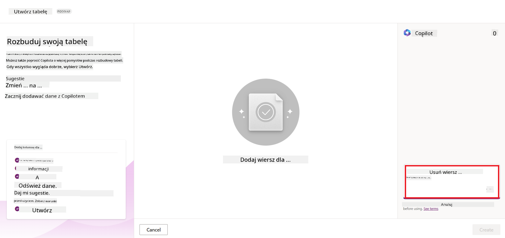
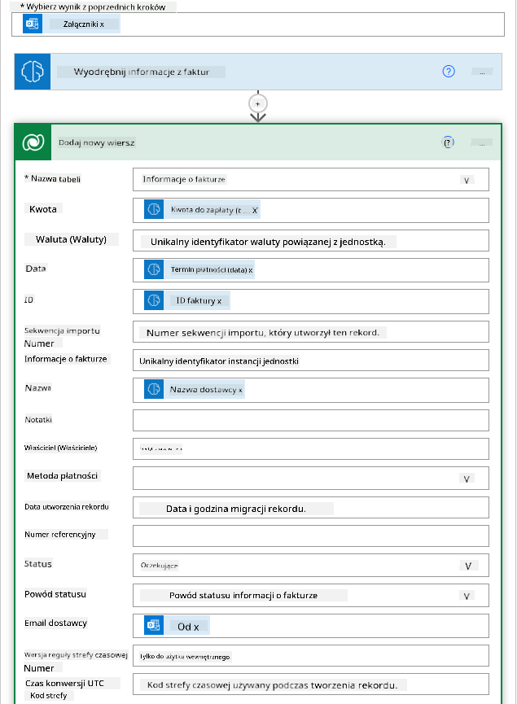

<!--
CO_OP_TRANSLATOR_METADATA:
{
  "original_hash": "f5ff3b6204a695a117d6f452403c95f7",
  "translation_date": "2025-07-09T13:57:37+00:00",
  "source_file": "10-building-low-code-ai-applications/README.md",
  "language_code": "pl"
}
-->
# Tworzenie aplikacji AI Low Code

> _(Kliknij powyższy obraz, aby obejrzeć wideo z tej lekcji)_

## Wprowadzenie

Teraz, gdy nauczyliśmy się tworzyć aplikacje generujące obrazy, porozmawiajmy o low code. Generatywna AI może być wykorzystywana w różnych obszarach, w tym w low code, ale czym właściwie jest low code i jak możemy dodać do niego AI?

Tworzenie aplikacji i rozwiązań stało się łatwiejsze zarówno dla tradycyjnych programistów, jak i osób bez doświadczenia programistycznego dzięki platformom Low Code Development. Platformy Low Code Development umożliwiają tworzenie aplikacji i rozwiązań przy minimalnym lub zerowym kodowaniu. Osiąga się to poprzez zapewnienie wizualnego środowiska programistycznego, które pozwala przeciągać i upuszczać komponenty do budowy aplikacji i rozwiązań. Dzięki temu można tworzyć aplikacje szybciej i przy mniejszym nakładzie zasobów. W tej lekcji zagłębimy się w to, jak korzystać z Low Code i jak wzbogacić rozwój low code o AI za pomocą Power Platform.

Power Platform daje organizacjom możliwość wzmocnienia swoich zespołów, aby mogły tworzyć własne rozwiązania w intuicyjnym środowisku low-code lub no-code. To środowisko upraszcza proces tworzenia rozwiązań. Dzięki Power Platform rozwiązania można tworzyć w ciągu dni lub tygodni, zamiast miesięcy czy lat. Power Platform składa się z pięciu kluczowych produktów: Power Apps, Power Automate, Power BI, Power Pages oraz Copilot Studio.

Ta lekcja obejmuje:

- Wprowadzenie do Generatywnej AI w Power Platform
- Wprowadzenie do Copilot i jak go używać
- Wykorzystanie Generatywnej AI do tworzenia aplikacji i przepływów w Power Platform
- Zrozumienie modeli AI w Power Platform z AI Builder

## Cele nauki

Po ukończeniu tej lekcji będziesz potrafił:

- Zrozumieć, jak działa Copilot w Power Platform.

- Zbudować aplikację Student Assignment Tracker dla naszego startupu edukacyjnego.

- Stworzyć przepływ Invoice Processing, który wykorzystuje AI do wyodrębniania informacji z faktur.

- Stosować najlepsze praktyki podczas korzystania z modelu Create Text z GPT AI.

Narzędzia i technologie, których użyjesz w tej lekcji, to:

- **Power Apps** – do aplikacji Student Assignment Tracker, która oferuje środowisko low-code do tworzenia aplikacji do śledzenia, zarządzania i interakcji z danymi.

- **Dataverse** – do przechowywania danych aplikacji Student Assignment Tracker, zapewniający low-code platformę danych dla przechowywania danych aplikacji.

- **Power Automate** – do przepływu Invoice Processing, gdzie będziesz miał środowisko low-code do tworzenia przepływów automatyzujących proces przetwarzania faktur.

- **AI Builder** – do modelu AI Invoice Processing, gdzie wykorzystasz gotowe modele AI do przetwarzania faktur dla naszego startupu.

## Generatywna AI w Power Platform

Wzbogacanie rozwoju low-code i aplikacji o generatywną AI to kluczowy obszar zainteresowania Power Platform. Celem jest umożliwienie każdemu tworzenia aplikacji, stron, pulpitów i automatyzacji procesów zasilanych AI, _bez konieczności posiadania wiedzy z zakresu data science_. Cel ten realizowany jest poprzez integrację generatywnej AI z doświadczeniem low-code w Power Platform w postaci Copilot i AI Builder.

### Jak to działa?

Copilot to asystent AI, który pozwala tworzyć rozwiązania Power Platform, opisując swoje wymagania w serii konwersacyjnych kroków za pomocą języka naturalnego. Możesz na przykład polecić asystentowi AI, jakie pola ma zawierać Twoja aplikacja, a on stworzy zarówno aplikację, jak i bazowy model danych, lub określić, jak skonfigurować przepływ w Power Automate.

Funkcje oparte na Copilot można wykorzystać jako elementy w ekranach aplikacji, aby umożliwić użytkownikom odkrywanie informacji poprzez interakcje konwersacyjne.

AI Builder to niskokodowa funkcja AI dostępna w Power Platform, która pozwala korzystać z modeli AI do automatyzacji procesów i przewidywania wyników. Dzięki AI Builder możesz dodać AI do swoich aplikacji i przepływów, które łączą się z danymi w Dataverse lub w różnych źródłach danych w chmurze, takich jak SharePoint, OneDrive czy Azure.

Copilot jest dostępny we wszystkich produktach Power Platform: Power Apps, Power Automate, Power BI, Power Pages oraz Power Virtual Agents. AI Builder jest dostępny w Power Apps i Power Automate. W tej lekcji skupimy się na tym, jak używać Copilot i AI Builder w Power Apps i Power Automate, aby stworzyć rozwiązanie dla naszego startupu edukacyjnego.

### Copilot w Power Apps

W ramach Power Platform, Power Apps oferuje środowisko low-code do tworzenia aplikacji do śledzenia, zarządzania i interakcji z danymi. To zestaw usług do tworzenia aplikacji z skalowalną platformą danych oraz możliwością łączenia się z usługami w chmurze i danymi lokalnymi. Power Apps pozwala tworzyć aplikacje działające w przeglądarkach, na tabletach i telefonach, które można udostępniać współpracownikom. Power Apps ułatwia użytkownikom rozpoczęcie tworzenia aplikacji dzięki prostemu interfejsowi, dzięki czemu każdy użytkownik biznesowy lub doświadczony programista może tworzyć niestandardowe aplikacje. Doświadczenie tworzenia aplikacji jest również wzbogacone o Generatywną AI dzięki Copilot.

Funkcja asystenta AI Copilot w Power Apps pozwala opisać, jakiego rodzaju aplikację potrzebujesz i jakie informacje ma ona śledzić, zbierać lub wyświetlać. Copilot generuje wtedy responsywną aplikację Canvas na podstawie Twojego opisu. Następnie możesz dostosować aplikację do swoich potrzeb. AI Copilot generuje i sugeruje również tabelę Dataverse z polami potrzebnymi do przechowywania danych, które chcesz śledzić, wraz z przykładowymi danymi. W tej lekcji później przyjrzymy się, czym jest Dataverse i jak można go używać w Power Apps. Możesz następnie dostosować tabelę do swoich potrzeb, korzystając z funkcji asystenta AI Copilot w formie konwersacyjnych kroków. Ta funkcja jest łatwo dostępna z ekranu głównego Power Apps.

### Copilot w Power Automate

W ramach Power Platform, Power Automate pozwala użytkownikom tworzyć zautomatyzowane przepływy pracy między aplikacjami i usługami. Pomaga automatyzować powtarzalne procesy biznesowe, takie jak komunikacja, zbieranie danych i zatwierdzanie decyzji. Jego prosty interfejs umożliwia użytkownikom o różnym poziomie zaawansowania technicznego (od początkujących po doświadczonych programistów) automatyzację zadań. Doświadczenie tworzenia przepływów jest również wzbogacone o Generatywną AI dzięki Copilot.

Funkcja asystenta AI Copilot w Power Automate pozwala opisać, jakiego rodzaju przepływ potrzebujesz i jakie akcje ma on wykonywać. Copilot generuje wtedy przepływ na podstawie Twojego opisu. Następnie możesz dostosować przepływ do swoich potrzeb. AI Copilot generuje i sugeruje również akcje potrzebne do wykonania zadania, które chcesz zautomatyzować. W tej lekcji później przyjrzymy się, czym są przepływy i jak można ich używać w Power Automate. Możesz następnie dostosować akcje do swoich potrzeb, korzystając z funkcji asystenta AI Copilot w formie konwersacyjnych kroków. Ta funkcja jest łatwo dostępna z ekranu głównego Power Automate.

## Zadanie: Zarządzanie zadaniami uczniów i fakturami dla naszego startupu, z użyciem Copilot

Nasz startup oferuje kursy online dla uczniów. Startup szybko się rozrósł i teraz ma trudności z nadążaniem za popytem na swoje kursy. Startup zatrudnił Cię jako dewelopera Power Platform, aby pomóc im stworzyć rozwiązanie low code, które pomoże zarządzać zadaniami uczniów i fakturami. Ich rozwiązanie powinno umożliwiać śledzenie i zarządzanie zadaniami uczniów za pomocą aplikacji oraz automatyzować proces przetwarzania faktur za pomocą przepływu. Poproszono Cię o wykorzystanie Generatywnej AI do opracowania tego rozwiązania.

Na początek korzystania z Copilot możesz użyć [Power Platform Copilot Prompt Library](https://github.com/pnp/powerplatform-prompts?WT.mc_id=academic-109639-somelezediko), aby zacząć od gotowych promptów. Ta biblioteka zawiera listę promptów, które możesz wykorzystać do tworzenia aplikacji i przepływów z Copilot. Możesz też użyć promptów z biblioteki, aby zobaczyć, jak opisywać swoje wymagania dla Copilot.

### Stwórz aplikację Student Assignment Tracker dla naszego startupu

Nauczyciele w naszym startupie mieli trudności z nadążaniem za zadaniami uczniów. Korzystali z arkusza kalkulacyjnego do śledzenia zadań, ale stało się to trudne do zarządzania wraz ze wzrostem liczby uczniów. Poprosili Cię o stworzenie aplikacji, która pomoże im śledzić i zarządzać zadaniami uczniów. Aplikacja powinna umożliwiać dodawanie nowych zadań, przeglądanie, aktualizowanie i usuwanie zadań. Powinna także pozwalać nauczycielom i uczniom na przeglądanie zadań ocenionych oraz tych, które nie zostały jeszcze ocenione.

Aplikację zbudujesz za pomocą Copilot w Power Apps, wykonując poniższe kroki:

1. Przejdź do ekranu głównego [Power Apps](https://make.powerapps.com?WT.mc_id=academic-105485-koreyst).

1. Użyj pola tekstowego na ekranie głównym, aby opisać aplikację, którą chcesz stworzyć. Na przykład: **_Chcę stworzyć aplikację do śledzenia i zarządzania zadaniami uczniów_**. Kliknij przycisk **Wyślij**, aby przesłać prompt do AI Copilot.

1. AI Copilot zasugeruje tabelę Dataverse z polami potrzebnymi do przechowywania danych, które chcesz śledzić, oraz przykładowymi danymi. Możesz następnie dostosować tabelę do swoich potrzeb, korzystając z funkcji asystenta AI Copilot w formie konwersacyjnych kroków.

   > **Ważne**: Dataverse to podstawowa platforma danych dla Power Platform. To platforma low-code do przechowywania danych aplikacji. Jest to w pełni zarządzana usługa, która bezpiecznie przechowuje dane w chmurze Microsoft i jest udostępniana w Twoim środowisku Power Platform. Posiada wbudowane funkcje zarządzania danymi, takie jak klasyfikacja danych, pochodzenie danych, precyzyjna kontrola dostępu i inne. Więcej o Dataverse możesz dowiedzieć się [tutaj](https://docs.microsoft.com/powerapps/maker/data-platform/data-platform-intro?WT.mc_id=academic-109639-somelezediko).

   

1. Nauczyciele chcą wysyłać e-maile do uczniów, którzy oddali zadania, aby informować ich o postępach. Możesz użyć Copilot, aby dodać nowe pole do tabeli do przechowywania adresu e-mail ucznia. Na przykład, możesz użyć promptu: **_Chcę dodać kolumnę do przechowywania adresu e-mail ucznia_**. Kliknij przycisk **Wyślij**, aby przesłać prompt do AI Copilot.

1. AI Copilot wygeneruje nowe pole, które możesz dostosować do swoich potrzeb.

1. Po zakończeniu pracy z tabelą kliknij przycisk **Utwórz aplikację**, aby stworzyć aplikację.

1. AI Copilot wygeneruje responsywną aplikację Canvas na podstawie Twojego opisu. Następnie możesz dostosować aplikację do swoich potrzeb.

1. Aby nauczyciele mogli wysyłać e-maile do uczniów, możesz użyć Copilot, aby dodać nowy ekran do aplikacji. Na przykład, użyj promptu: **_Chcę dodać ekran do wysyłania e-maili do uczniów_**. Kliknij przycisk **Wyślij**, aby przesłać prompt do AI Copilot.

1. AI Copilot wygeneruje nowy ekran, który możesz dostosować do swoich potrzeb.

1. Po zakończeniu pracy z aplikacją kliknij przycisk **Zapisz**, aby zapisać aplikację.

1. Aby udostępnić aplikację nauczycielom, kliknij przycisk **Udostępnij**, a następnie ponownie kliknij **Udostępnij**. Możesz wtedy udostępnić aplikację, wpisując adresy e-mail nauczycieli.

> **Twoje zadanie domowe**: Aplikacja, którą właśnie stworzyłeś, to dobry początek, ale można ją ulepszyć. Dzięki funkcji e-mail nauczyciele mogą wysyłać wiadomości do uczniów tylko ręcznie, wpisując ich adresy e-mail. Czy potrafisz użyć Copilot, aby stworzyć automatyzację, która pozwoli nauczycielom wysyłać e-maile do uczniów automatycznie, gdy ci oddadzą zadania? Podpowiedź: z odpowiednim promptem możesz użyć Copilot w Power Automate, aby to zbudować.

### Stwórz tabelę informacji o fakturach dla naszego startupu

Zespół finansowy naszego startupu miał trudności z nadążaniem za fakturami. Korzystali z arkusza kalkulacyjnego do śledzenia faktur, ale stało się to trudne do zarządzania wraz ze wzrostem ich liczby. Poprosili Cię o stworzenie tabeli, która pomoże im przechowywać, śledzić i zarządzać informacjami o otrzymanych fakturach. Tabela powinna służyć do budowy automatyzacji, która wyodrębni wszystkie informacje z faktur i zapisze je w tabeli. Tabela powinna także umożliwiać zespołowi finansowemu przeglądanie faktur opłaconych oraz tych, które nie zostały jeszcze opłacone.

Power Platform ma podstawową platformę danych o nazwie Dataverse, która pozwala przechowywać dane dla Twoich aplikacji i rozwiązań. Dataverse zapewnia low-code platformę danych do przechowywania danych aplikacji. Jest to w pełni zarządzana usługa, która bezpiecznie przechowuje dane w chmurze Microsoft i jest udostępniana w Twoim środowisku Power Platform. Posiada wbudowane funkcje zarządzania danymi, takie jak klasyfikacja danych, pochodzenie danych, precyzyjna kontrola dostępu i inne. Więcej o Dataverse możesz dowiedzieć się [tutaj](https://docs.microsoft.com/powerapps/maker/data-platform/data-platform-intro?WT.mc_id=academic-109639-somelezediko).

Dlaczego powinniśmy używać Dataverse dla naszego startupu? Standardowe i niestandardowe tabele w Dataverse zapewniają bezpieczne i oparte na chmurze miejsce do przechowywania Twoich danych. Tabele pozwalają przechowywać różne typy danych, podobnie jak można używać wielu arkuszy w jednym skoroszycie Excel. Możesz używać tabel do przechowywania danych specyficznych dla Twojej organizacji lub potrzeb biznesowych. Niektóre korzyści, które nasz startup uzyska dzięki użyciu Dataverse, obejmują między innymi:
- **Łatwe zarządzanie**: Zarówno metadane, jak i dane są przechowywane w chmurze, więc nie musisz się martwić o szczegóły dotyczące ich przechowywania czy zarządzania. Możesz skupić się na tworzeniu swoich aplikacji i rozwiązań.

- **Bezpieczeństwo**: Dataverse oferuje bezpieczne, oparte na chmurze rozwiązanie do przechowywania danych. Możesz kontrolować, kto ma dostęp do danych w Twoich tabelach oraz w jaki sposób mogą z nich korzystać, używając zabezpieczeń opartych na rolach.

- **Bogate metadane**: Typy danych i relacje są wykorzystywane bezpośrednio w Power Apps.

- **Logika i walidacja**: Możesz używać reguł biznesowych, pól obliczeniowych oraz reguł walidacji, aby wymusić logikę biznesową i utrzymać dokładność danych.

Teraz, gdy wiesz czym jest Dataverse i dlaczego warto go używać, przyjrzyjmy się, jak możesz użyć Copilota do stworzenia tabeli w Dataverse, która spełni wymagania naszego zespołu finansowego.

> **Note** : Będziesz korzystać z tej tabeli w następnej sekcji, aby zbudować automatyzację, która wyciągnie wszystkie informacje z faktur i zapisze je w tabeli.

Aby utworzyć tabelę w Dataverse za pomocą Copilota, wykonaj poniższe kroki:

1. Przejdź do ekranu głównego [Power Apps](https://make.powerapps.com?WT.mc_id=academic-105485-koreyst).

2. W lewym pasku nawigacyjnym wybierz **Tables**, a następnie kliknij **Describe the new Table**.

3. Na ekranie **Describe the new Table** użyj pola tekstowego, aby opisać tabelę, którą chcesz utworzyć. Na przykład: **_Chcę utworzyć tabelę do przechowywania informacji o fakturach_**. Kliknij przycisk **Send**, aby wysłać zapytanie do AI Copilota.

4. AI Copilot zasugeruje tabelę Dataverse z polami potrzebnymi do przechowywania danych, które chcesz śledzić, oraz przykładowymi danymi. Następnie możesz dostosować tabelę do swoich potrzeb, korzystając z funkcji asystenta AI Copilot w formie rozmowy krok po kroku.

5. Zespół finansowy chce wysłać e-mail do dostawcy, aby poinformować go o aktualnym statusie faktury. Możesz użyć Copilota, aby dodać nowe pole do tabeli, które będzie przechowywać adres e-mail dostawcy. Na przykład, możesz użyć następującego zapytania: **_Chcę dodać kolumnę do przechowywania e-maila dostawcy_**. Kliknij przycisk **Send**, aby wysłać zapytanie do AI Copilota.

6. AI Copilot wygeneruje nowe pole, które następnie możesz dostosować do swoich potrzeb.

7. Gdy skończysz pracę nad tabelą, kliknij przycisk **Create**, aby utworzyć tabelę.

## Modele AI w Power Platform z AI Builder

AI Builder to niskokodowa funkcja AI dostępna w Power Platform, która umożliwia korzystanie z modeli AI do automatyzacji procesów i przewidywania wyników. Dzięki AI Builder możesz wprowadzić sztuczną inteligencję do swoich aplikacji i przepływów, które łączą się z danymi w Dataverse lub w różnych źródłach danych w chmurze, takich jak SharePoint, OneDrive czy Azure.

## Modele AI gotowe vs modele AI niestandardowe

AI Builder oferuje dwa typy modeli AI: modele gotowe (Prebuilt AI Models) oraz modele niestandardowe (Custom AI Models). Modele gotowe to modele AI przygotowane i wytrenowane przez Microsoft, dostępne w Power Platform. Pomagają one dodać inteligencję do Twoich aplikacji i przepływów bez konieczności zbierania danych, budowania, trenowania i publikowania własnych modeli. Możesz używać tych modeli do automatyzacji procesów i przewidywania wyników.

Niektóre z dostępnych modeli gotowych w Power Platform to:

- **Key Phrase Extraction**: model wyodrębniający kluczowe frazy z tekstu.
- **Language Detection**: model wykrywający język tekstu.
- **Sentiment Analysis**: model rozpoznający pozytywny, negatywny, neutralny lub mieszany sentyment w tekście.
- **Business Card Reader**: model wyciągający informacje z wizytówek.
- **Text Recognition**: model wyodrębniający tekst z obrazów.
- **Object Detection**: model wykrywający i wyodrębniający obiekty z obrazów.
- **Document processing**: model wyciągający informacje z formularzy.
- **Invoice Processing**: model wyciągający informacje z faktur.

Dzięki modelom niestandardowym możesz wprowadzić własny model do AI Builder, aby działał jak każdy inny model niestandardowy AI Builder, umożliwiając trenowanie modelu na własnych danych. Możesz używać tych modeli do automatyzacji procesów i przewidywania wyników zarówno w Power Apps, jak i Power Automate. Przy korzystaniu z własnych modeli obowiązują pewne ograniczenia. Więcej informacji o tych [ograniczeniach](https://learn.microsoft.com/ai-builder/byo-model#limitations?WT.mc_id=academic-105485-koreyst).

## Zadanie #2 - Stwórz przepływ do przetwarzania faktur dla naszego startupu

Zespół finansowy miał problemy z przetwarzaniem faktur. Korzystali z arkusza kalkulacyjnego do śledzenia faktur, ale stało się to trudne do zarządzania wraz ze wzrostem ich liczby. Poprosili Cię o stworzenie przepływu pracy, który pomoże im przetwarzać faktury za pomocą AI. Przepływ powinien umożliwić wyciąganie informacji z faktur i zapisywanie ich w tabeli Dataverse. Powinien także umożliwić wysyłanie e-maili do zespołu finansowego z wyciągniętymi informacjami.

Teraz, gdy wiesz czym jest AI Builder i dlaczego warto go używać, przyjrzyjmy się, jak możesz użyć modelu Invoice Processing AI Model w AI Builder, który omawialiśmy wcześniej, aby stworzyć przepływ, który pomoże zespołowi finansowemu przetwarzać faktury.

Aby stworzyć przepływ, który pomoże zespołowi finansowemu przetwarzać faktury za pomocą modelu Invoice Processing AI Model w AI Builder, wykonaj poniższe kroki:

1. Przejdź do ekranu głównego [Power Automate](https://make.powerautomate.com?WT.mc_id=academic-105485-koreyst).

2. Użyj pola tekstowego na ekranie głównym, aby opisać przepływ, który chcesz zbudować. Na przykład: **_Przetwarzaj fakturę, gdy pojawi się w mojej skrzynce odbiorczej_**. Kliknij przycisk **Send**, aby wysłać zapytanie do AI Copilota.

   

3. AI Copilot zasugeruje działania potrzebne do wykonania zadania, które chcesz zautomatyzować. Możesz kliknąć przycisk **Next**, aby przejść do kolejnych kroków.

4. W następnym kroku Power Automate poprosi Cię o skonfigurowanie połączeń wymaganych dla przepływu. Po zakończeniu kliknij przycisk **Create flow**, aby utworzyć przepływ.

5. AI Copilot wygeneruje przepływ, który następnie możesz dostosować do swoich potrzeb.

6. Zaktualizuj wyzwalacz przepływu i ustaw **Folder** na folder, w którym będą przechowywane faktury. Na przykład możesz ustawić folder na **Inbox**. Kliknij **Show advanced options** i ustaw **Only with Attachments** na **Yes**. Dzięki temu przepływ będzie uruchamiany tylko wtedy, gdy w folderze pojawi się e-mail z załącznikiem.

7. Usuń z przepływu następujące akcje: **HTML to text**, **Compose**, **Compose 2**, **Compose 3** oraz **Compose 4**, ponieważ nie będą Ci potrzebne.

8. Usuń akcję **Condition** z przepływu, ponieważ nie będzie używana. Powinno to wyglądać jak na poniższym zrzucie ekranu:

   

9. Kliknij przycisk **Add an action** i wyszukaj **Dataverse**. Wybierz akcję **Add a new row**.

10. W akcji **Extract Information from invoices** zaktualizuj pole **Invoice File**, aby wskazywało na **Attachment Content** z e-maila. Dzięki temu przepływ wyciągnie informacje z załącznika faktury.

11. Wybierz tabelę, którą utworzyłeś wcześniej. Na przykład możesz wybrać tabelę **Invoice Information**. Wybierz dynamiczną zawartość z poprzedniej akcji, aby wypełnić następujące pola:

    - ID
    - Amount
    - Date
    - Name
    - Status - ustaw **Status** na **Pending**.
    - Supplier Email - użyj dynamicznej zawartości **From** z wyzwalacza **When a new email arrives**.

    

12. Gdy skończysz pracę nad przepływem, kliknij przycisk **Save**, aby go zapisać. Możesz przetestować przepływ, wysyłając e-mail z fakturą do folderu, który określiłeś w wyzwalaczu.

> **Twoje zadanie domowe**: Przepływ, który właśnie stworzyłeś, to dobry początek, teraz musisz pomyśleć, jak zbudować automatyzację, która pozwoli naszemu zespołowi finansowemu wysyłać e-maile do dostawcy z aktualnym statusem ich faktury. Podpowiedź: przepływ musi się uruchamiać, gdy zmieni się status faktury.

## Użycie modelu AI do generowania tekstu w Power Automate

Model Create Text with GPT AI w AI Builder umożliwia generowanie tekstu na podstawie podanego zapytania i jest zasilany przez Microsoft Azure OpenAI Service. Dzięki tej funkcji możesz wprowadzić technologię GPT (Generative Pre-Trained Transformer) do swoich aplikacji i przepływów, aby tworzyć różnorodne automatyczne przepływy i aplikacje dostarczające wartościowych informacji.

Modele GPT przechodzą intensywne szkolenie na ogromnych zbiorach danych, co pozwala im generować tekst bardzo zbliżony do ludzkiego języka na podstawie podanego zapytania. Po zintegrowaniu z automatyzacją przepływów pracy, modele AI takie jak GPT mogą być wykorzystywane do usprawniania i automatyzacji wielu zadań.

Na przykład możesz tworzyć przepływy, które automatycznie generują tekst do różnych zastosowań, takich jak szkice e-maili, opisy produktów i inne. Możesz także używać modelu do generowania tekstu dla różnych aplikacji, takich jak chatboty czy aplikacje obsługi klienta, które pomagają agentom efektywnie i szybko odpowiadać na zapytania klientów.

Aby dowiedzieć się, jak korzystać z tego modelu AI w Power Automate, przejdź przez moduł [Add intelligence with AI Builder and GPT](https://learn.microsoft.com/training/modules/ai-builder-text-generation/?WT.mc_id=academic-109639-somelezediko).

## Świetna robota! Kontynuuj naukę

Po ukończeniu tej lekcji sprawdź naszą [kolekcję materiałów do nauki Generative AI](https://aka.ms/genai-collection?WT.mc_id=academic-105485-koreyst), aby dalej rozwijać swoją wiedzę na temat Generative AI!

Przejdź do Lekcji 11, gdzie przyjrzymy się, jak [zintegrować Generative AI z Function Calling](../11-integrating-with-function-calling/README.md?WT.mc_id=academic-105485-koreyst)!

**Zastrzeżenie**:  
Niniejszy dokument został przetłumaczony za pomocą usługi tłumaczenia AI [Co-op Translator](https://github.com/Azure/co-op-translator). Mimo że dokładamy starań, aby tłumaczenie było jak najbardziej precyzyjne, prosimy mieć na uwadze, że automatyczne tłumaczenia mogą zawierać błędy lub nieścisłości. Oryginalny dokument w języku źródłowym należy traktować jako źródło wiążące. W przypadku informacji o kluczowym znaczeniu zalecane jest skorzystanie z profesjonalnego tłumaczenia wykonanego przez człowieka. Nie ponosimy odpowiedzialności za jakiekolwiek nieporozumienia lub błędne interpretacje wynikające z korzystania z tego tłumaczenia.