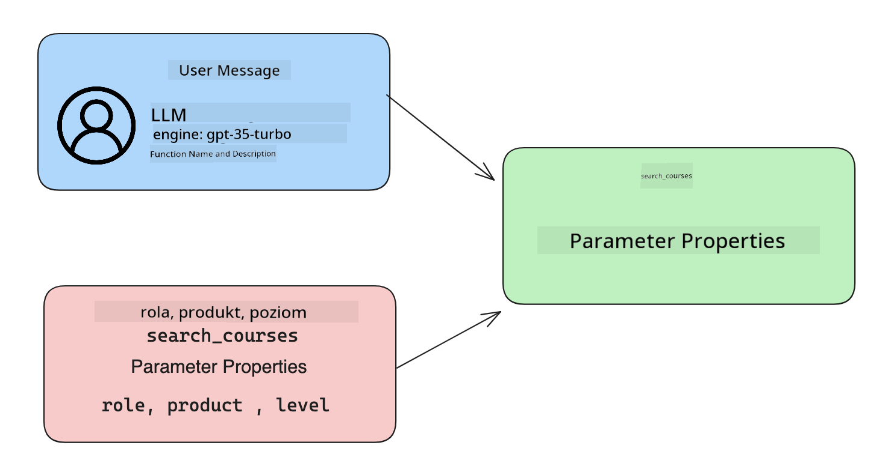

<!--
CO_OP_TRANSLATOR_METADATA:
{
  "original_hash": "77a48a201447be19aa7560706d6f93a0",
  "translation_date": "2025-05-19T21:28:16+00:00",
  "source_file": "11-integrating-with-function-calling/README.md",
  "language_code": "pl"
}
-->
# Integracja z wywoływaniem funkcji

Nauczyłeś się już całkiem sporo w poprzednich lekcjach. Jednak możemy się jeszcze poprawić. Niektóre rzeczy, które możemy rozwiązać, to jak uzyskać bardziej spójny format odpowiedzi, aby ułatwić pracę z odpowiedzią w dalszym procesie. Ponadto, możemy chcieć dodać dane z innych źródeł, aby wzbogacić naszą aplikację.

Wspomniane powyżej problemy to te, które ten rozdział ma na celu rozwiązać.

## Wprowadzenie

Ta lekcja obejmie:

- Wyjaśnienie, czym jest wywoływanie funkcji i jego zastosowania.
- Tworzenie wywołania funkcji przy użyciu Azure OpenAI.
- Jak zintegrować wywołanie funkcji z aplikacją.

## Cele nauki

Pod koniec tej lekcji będziesz mógł:

- Wyjaśnić cel używania wywoływania funkcji.
- Skonfigurować wywołanie funkcji przy użyciu usługi Azure OpenAI.
- Zaprojektować skuteczne wywołania funkcji dla przypadku użycia twojej aplikacji.

## Scenariusz: Ulepszanie naszego chatbota za pomocą funkcji

W tej lekcji chcemy zbudować funkcję dla naszego startupu edukacyjnego, która pozwala użytkownikom korzystać z chatbota do znajdowania kursów technicznych. Będziemy polecać kursy, które odpowiadają ich poziomowi umiejętności, obecnej roli i technologii, którą się interesują.

Aby zrealizować ten scenariusz, użyjemy kombinacji:

- `Azure OpenAI` do stworzenia doświadczenia czatu dla użytkownika.
- `Microsoft Learn Catalog API`, aby pomóc użytkownikom znaleźć kursy na podstawie ich żądań.
- `Function Calling`, aby przyjąć zapytanie użytkownika i wysłać je do funkcji w celu złożenia żądania API.

Aby rozpocząć, przyjrzyjmy się, dlaczego w ogóle chcielibyśmy używać wywoływania funkcji:

## Dlaczego wywoływanie funkcji

Przed wywoływaniem funkcji odpowiedzi z LLM były niestrukturalne i niespójne. Programiści musieli pisać złożony kod walidacyjny, aby upewnić się, że są w stanie obsłużyć każdą wariację odpowiedzi. Użytkownicy nie mogli uzyskać odpowiedzi takich jak "Jaka jest obecna pogoda w Sztokholmie?". Działo się tak, ponieważ modele były ograniczone do czasu, na który dane były trenowane.

Wywoływanie funkcji to funkcja usługi Azure OpenAI, która przezwycięża następujące ograniczenia:

- **Spójny format odpowiedzi**. Jeśli możemy lepiej kontrolować format odpowiedzi, możemy łatwiej zintegrować odpowiedź z innymi systemami.
- **Zewnętrzne dane**. Możliwość użycia danych z innych źródeł aplikacji w kontekście czatu.

## Ilustrowanie problemu poprzez scenariusz

> Zalecamy użycie [załączonego notatnika](../../../11-integrating-with-function-calling/python/aoai-assignment.ipynb), jeśli chcesz uruchomić poniższy scenariusz. Możesz również po prostu przeczytać, jak staramy się zilustrować problem, w którym funkcje mogą pomóc w jego rozwiązaniu.

Przyjrzyjmy się przykładowi, który ilustruje problem formatu odpowiedzi:

Załóżmy, że chcemy stworzyć bazę danych danych uczniów, aby móc polecić im odpowiedni kurs. Poniżej mamy dwa opisy uczniów, które są bardzo podobne pod względem zawartych danych.

1. Stwórz połączenie z naszym zasobem Azure OpenAI:

   ```python
   import os
   import json
   from openai import AzureOpenAI
   from dotenv import load_dotenv
   load_dotenv()

   client = AzureOpenAI(
   api_key=os.environ['AZURE_OPENAI_API_KEY'],  # this is also the default, it can be omitted
   api_version = "2023-07-01-preview"
   )

   deployment=os.environ['AZURE_OPENAI_DEPLOYMENT']
   ```

   Poniżej znajduje się kod Pythona do skonfigurowania naszego połączenia z Azure OpenAI, gdzie ustawiamy `api_type`, `api_base`, `api_version` and `api_key`.

1. Creating two student descriptions using variables `student_1_description` and `student_2_description`.

   ```python
   student_1_description="Emily Johnson is a sophomore majoring in computer science at Duke University. She has a 3.7 GPA. Emily is an active member of the university's Chess Club and Debate Team. She hopes to pursue a career in software engineering after graduating."

   student_2_description = "Michael Lee is a sophomore majoring in computer science at Stanford University. He has a 3.8 GPA. Michael is known for his programming skills and is an active member of the university's Robotics Club. He hopes to pursue a career in artificial intelligence after finishing his studies."
   ```

   Chcemy wysłać powyższe opisy uczniów do LLM, aby przeanalizować dane. Te dane mogą być później użyte w naszej aplikacji i przesłane do API lub przechowywane w bazie danych.

1. Stwórzmy dwa identyczne polecenia, w których instruujemy LLM, jakie informacje nas interesują:

   ```python
   prompt1 = f'''
   Please extract the following information from the given text and return it as a JSON object:

   name
   major
   school
   grades
   club

   This is the body of text to extract the information from:
   {student_1_description}
   '''

   prompt2 = f'''
   Please extract the following information from the given text and return it as a JSON object:

   name
   major
   school
   grades
   club

   This is the body of text to extract the information from:
   {student_2_description}
   '''
   ```

   Powyższe polecenia instruują LLM, aby wyodrębnił informacje i zwrócił odpowiedź w formacie JSON.

1. Po skonfigurowaniu poleceń i połączenia z Azure OpenAI, teraz wyślemy polecenia do LLM używając `openai.ChatCompletion`. We store the prompt in the `messages` variable and assign the role to `user`. To ma na celu naśladowanie wiadomości od użytkownika pisanej do chatbota.

   ```python
   # response from prompt one
   openai_response1 = client.chat.completions.create(
   model=deployment,
   messages = [{'role': 'user', 'content': prompt1}]
   )
   openai_response1.choices[0].message.content

   # response from prompt two
   openai_response2 = client.chat.completions.create(
   model=deployment,
   messages = [{'role': 'user', 'content': prompt2}]
   )
   openai_response2.choices[0].message.content
   ```

Teraz możemy wysłać oba żądania do LLM i zbadać odpowiedź, którą otrzymujemy, znajdując ją w taki sposób `openai_response1['choices'][0]['message']['content']`.

1. Lastly, we can convert the response to JSON format by calling `json.loads`:

   ```python
   # Loading the response as a JSON object
   json_response1 = json.loads(openai_response1.choices[0].message.content)
   json_response1
   ```

   Odpowiedź 1:

   ```json
   {
     "name": "Emily Johnson",
     "major": "computer science",
     "school": "Duke University",
     "grades": "3.7",
     "club": "Chess Club"
   }
   ```

   Odpowiedź 2:

   ```json
   {
     "name": "Michael Lee",
     "major": "computer science",
     "school": "Stanford University",
     "grades": "3.8 GPA",
     "club": "Robotics Club"
   }
   ```

   Mimo że polecenia są takie same, a opisy są podobne, widzimy wartości `Grades` property formatted differently, as we can sometimes get the format `3.7` or `3.7 GPA` for example.

   This result is because the LLM takes unstructured data in the form of the written prompt and returns also unstructured data. We need to have a structured format so that we know what to expect when storing or using this data

So how do we solve the formatting problem then? By using functional calling, we can make sure that we receive structured data back. When using function calling, the LLM does not actually call or run any functions. Instead, we create a structure for the LLM to follow for its responses. We then use those structured responses to know what function to run in our applications.


We can then take what is returned from the function and send this back to the LLM. The LLM will then respond using natural language to answer the user's query.

## Use Cases for using function calls

There are many different use cases where function calls can improve your app like:

- **Calling External Tools**. Chatbots are great at providing answers to questions from users. By using function calling, the chatbots can use messages from users to complete certain tasks. For example, a student can ask the chatbot to "Send an email to my instructor saying I need more assistance with this subject". This can make a function call to `send_email(to: string, body: string)`

- **Create API or Database Queries**. Users can find information using natural language that gets converted into a formatted query or API request. An example of this could be a teacher who requests "Who are the students that completed the last assignment" which could call a function named `get_completed(student_name: string, assignment: int, current_status: string)`

- **Creating Structured Data**. Users can take a block of text or CSV and use the LLM to extract important information from it. For example, a student can convert a Wikipedia article about peace agreements to create AI flashcards. This can be done by using a function called `get_important_facts(agreement_name: string, date_signed: string, parties_involved: list)`

## Creating Your First Function Call

The process of creating a function call includes 3 main steps:

1. **Calling** the Chat Completions API with a list of your functions and a user message.
2. **Reading** the model's response to perform an action i.e. execute a function or API Call.
3. **Making** another call to Chat Completions API with the response from your function to use that information to create a response to the user.



### Step 1 - creating messages

The first step is to create a user message. This can be dynamically assigned by taking the value of a text input or you can assign a value here. If this is your first time working with the Chat Completions API, we need to define the `role` and the `content` of the message.

The `role` can be either `system` (creating rules), `assistant` (the model) or `user` (the end-user). For function calling, we will assign this as `user` i przykładowe pytanie.

```python
messages= [ {"role": "user", "content": "Find me a good course for a beginner student to learn Azure."} ]
```

Przydzielając różne role, jest jasne dla LLM, czy coś mówi system, czy użytkownik, co pomaga zbudować historię rozmowy, na której LLM może się opierać.

### Krok 2 - tworzenie funkcji

Następnie zdefiniujemy funkcję i jej parametry. Użyjemy tutaj tylko jednej funkcji o nazwie `search_courses` but you can create multiple functions.

> **Important** : Functions are included in the system message to the LLM and will be included in the amount of available tokens you have available.

Below, we create the functions as an array of items. Each item is a function and has properties `name`, `description` and `parameters`:

```python
functions = [
   {
      "name":"search_courses",
      "description":"Retrieves courses from the search index based on the parameters provided",
      "parameters":{
         "type":"object",
         "properties":{
            "role":{
               "type":"string",
               "description":"The role of the learner (i.e. developer, data scientist, student, etc.)"
            },
            "product":{
               "type":"string",
               "description":"The product that the lesson is covering (i.e. Azure, Power BI, etc.)"
            },
            "level":{
               "type":"string",
               "description":"The level of experience the learner has prior to taking the course (i.e. beginner, intermediate, advanced)"
            }
         },
         "required":[
            "role"
         ]
      }
   }
]
```

Poniżej opisujemy każdą instancję funkcji bardziej szczegółowo:

- `name` - The name of the function that we want to have called.
- `description` - This is the description of how the function works. Here it's important to be specific and clear.
- `parameters` - A list of values and format that you want the model to produce in its response. The parameters array consists of items where the items have the following properties:
  1.  `type` - The data type of the properties will be stored in.
  1.  `properties` - List of the specific values that the model will use for its response
      1. `name` - The key is the name of the property that the model will use in its formatted response, for example, `product`.
      1. `type` - The data type of this property, for example, `string`.
      1. `description` - Description of the specific property.

There's also an optional property `required` - required property for the function call to be completed.

### Step 3 - Making the function call

After defining a function, we now need to include it in the call to the Chat Completion API. We do this by adding `functions` to the request. In this case `functions=functions`.

There is also an option to set `function_call` to `auto`. This means we will let the LLM decide which function should be called based on the user message rather than assigning it ourselves.

Here's some code below where we call `ChatCompletion.create`, note how we set `functions=functions` and `function_call="auto"` i tym samym dając LLM możliwość wyboru, kiedy wywołać dostarczone funkcje:

```python
response = client.chat.completions.create(model=deployment,
                                        messages=messages,
                                        functions=functions,
                                        function_call="auto")

print(response.choices[0].message)
```

Odpowiedź, która teraz wraca, wygląda następująco:

```json
{
  "role": "assistant",
  "function_call": {
    "name": "search_courses",
    "arguments": "{\n  \"role\": \"student\",\n  \"product\": \"Azure\",\n  \"level\": \"beginner\"\n}"
  }
}
```

Tutaj możemy zobaczyć, jak funkcja `search_courses` was called and with what arguments, as listed in the `arguments` property in the JSON response.

The conclusion the LLM was able to find the data to fit the arguments of the function as it was extracting it from the value provided to the `messages` parameter in the chat completion call. Below is a reminder of the `messages` wartość:

```python
messages= [ {"role": "user", "content": "Find me a good course for a beginner student to learn Azure."} ]
```

Jak widać, `student`, `Azure` and `beginner` was extracted from `messages` and set as input to the function. Using functions this way is a great way to extract information from a prompt but also to provide structure to the LLM and have reusable functionality.

Next, we need to see how we can use this in our app.

## Integrating Function Calls into an Application

After we have tested the formatted response from the LLM, we can now integrate this into an application.

### Managing the flow

To integrate this into our application, let's take the following steps:

1. First, let's make the call to the OpenAI services and store the message in a variable called `response_message`.

   ```python
   response_message = response.choices[0].message
   ```

1. Teraz zdefiniujemy funkcję, która wywoła Microsoft Learn API, aby uzyskać listę kursów:

   ```python
   import requests

   def search_courses(role, product, level):
     url = "https://learn.microsoft.com/api/catalog/"
     params = {
        "role": role,
        "product": product,
        "level": level
     }
     response = requests.get(url, params=params)
     modules = response.json()["modules"]
     results = []
     for module in modules[:5]:
        title = module["title"]
        url = module["url"]
        results.append({"title": title, "url": url})
     return str(results)
   ```

   Zauważ, jak teraz tworzymy rzeczywistą funkcję Pythona, która odpowiada nazwom funkcji wprowadzonym w `functions` variable. We're also making real external API calls to fetch the data we need. In this case, we go against the Microsoft Learn API to search for training modules.

Ok, so we created `functions` variables and a corresponding Python function, how do we tell the LLM how to map these two together so our Python function is called?

1. To see if we need to call a Python function, we need to look into the LLM response and see if `function_call` jest jej częścią i wywołuje wskazaną funkcję. Oto jak możesz wykonać wspomniane sprawdzenie poniżej:

   ```python
   # Check if the model wants to call a function
   if response_message.function_call.name:
    print("Recommended Function call:")
    print(response_message.function_call.name)
    print()

    # Call the function.
    function_name = response_message.function_call.name

    available_functions = {
            "search_courses": search_courses,
    }
    function_to_call = available_functions[function_name]

    function_args = json.loads(response_message.function_call.arguments)
    function_response = function_to_call(**function_args)

    print("Output of function call:")
    print(function_response)
    print(type(function_response))


    # Add the assistant response and function response to the messages
    messages.append( # adding assistant response to messages
        {
            "role": response_message.role,
            "function_call": {
                "name": function_name,
                "arguments": response_message.function_call.arguments,
            },
            "content": None
        }
    )
    messages.append( # adding function response to messages
        {
            "role": "function",
            "name": function_name,
            "content":function_response,
        }
    )
   ```

   Te trzy linie zapewniają, że wyodrębniamy nazwę funkcji, argumenty i dokonujemy wywołania:

   ```python
   function_to_call = available_functions[function_name]

   function_args = json.loads(response_message.function_call.arguments)
   function_response = function_to_call(**function_args)
   ```

   Poniżej znajduje się wynik uruchomienia naszego kodu:

   **Wynik**

   ```Recommended Function call:
   {
     "name": "search_courses",
     "arguments": "{\n  \"role\": \"student\",\n  \"product\": \"Azure\",\n  \"level\": \"beginner\"\n}"
   }

   Output of function call:
   [{'title': 'Describe concepts of cryptography', 'url': 'https://learn.microsoft.com/training/modules/describe-concepts-of-cryptography/?
   WT.mc_id=api_CatalogApi'}, {'title': 'Introduction to audio classification with TensorFlow', 'url': 'https://learn.microsoft.com/en-
   us/training/modules/intro-audio-classification-tensorflow/?WT.mc_id=api_CatalogApi'}, {'title': 'Design a Performant Data Model in Azure SQL
   Database with Azure Data Studio', 'url': 'https://learn.microsoft.com/training/modules/design-a-data-model-with-ads/?
   WT.mc_id=api_CatalogApi'}, {'title': 'Getting started with the Microsoft Cloud Adoption Framework for Azure', 'url':
   'https://learn.microsoft.com/training/modules/cloud-adoption-framework-getting-started/?WT.mc_id=api_CatalogApi'}, {'title': 'Set up the
   Rust development environment', 'url': 'https://learn.microsoft.com/training/modules/rust-set-up-environment/?WT.mc_id=api_CatalogApi'}]
   <class 'str'>
   ```

1. Teraz wyślemy zaktualizowaną wiadomość, `messages` do LLM, abyśmy mogli otrzymać odpowiedź w języku naturalnym zamiast odpowiedzi w formacie JSON API.

   ```python
   print("Messages in next request:")
   print(messages)
   print()

   second_response = client.chat.completions.create(
      messages=messages,
      model=deployment,
      function_call="auto",
      functions=functions,
      temperature=0
         )  # get a new response from GPT where it can see the function response


   print(second_response.choices[0].message)
   ```

   **Wynik**

   ```python
   {
     "role": "assistant",
     "content": "I found some good courses for beginner students to learn Azure:\n\n1. [Describe concepts of cryptography] (https://learn.microsoft.com/training/modules/describe-concepts-of-cryptography/?WT.mc_id=api_CatalogApi)\n2. [Introduction to audio classification with TensorFlow](https://learn.microsoft.com/training/modules/intro-audio-classification-tensorflow/?WT.mc_id=api_CatalogApi)\n3. [Design a Performant Data Model in Azure SQL Database with Azure Data Studio](https://learn.microsoft.com/training/modules/design-a-data-model-with-ads/?WT.mc_id=api_CatalogApi)\n4. [Getting started with the Microsoft Cloud Adoption Framework for Azure](https://learn.microsoft.com/training/modules/cloud-adoption-framework-getting-started/?WT.mc_id=api_CatalogApi)\n5. [Set up the Rust development environment](https://learn.microsoft.com/training/modules/rust-set-up-environment/?WT.mc_id=api_CatalogApi)\n\nYou can click on the links to access the courses."
   }

   ```

## Zadanie

Aby kontynuować naukę o Azure OpenAI Function Calling, możesz zbudować:

- Więcej parametrów funkcji, które mogą pomóc uczniom znaleźć więcej kursów.
- Stworzyć kolejne wywołanie funkcji, które pobiera więcej informacji od ucznia, takich jak jego język ojczysty.
- Stworzyć obsługę błędów, gdy wywołanie funkcji i/lub wywołanie API nie zwraca żadnych odpowiednich kursów.

Podpowiedź: Skorzystaj z [dokumentacji referencyjnej Learn API](https://learn.microsoft.com/training/support/catalog-api-developer-reference?WT.mc_id=academic-105485-koreyst), aby zobaczyć, jak i gdzie dostępne są te dane.

## Świetna robota! Kontynuuj podróż

Po ukończeniu tej lekcji sprawdź naszą [kolekcję nauki o AI generatywnej](https://aka.ms/genai-collection?WT.mc_id=academic-105485-koreyst), aby kontynuować pogłębianie swojej wiedzy o AI generatywnej!

Przejdź do Lekcji 12, gdzie przyjrzymy się, jak [projektować UX dla aplikacji AI](../12-designing-ux-for-ai-applications/README.md?WT.mc_id=academic-105485-koreyst)!

**Zrzeczenie się odpowiedzialności**:  
Ten dokument został przetłumaczony przy użyciu usługi tłumaczenia AI [Co-op Translator](https://github.com/Azure/co-op-translator). Chociaż staramy się zapewnić dokładność, prosimy mieć na uwadze, że automatyczne tłumaczenia mogą zawierać błędy lub nieścisłości. Oryginalny dokument w jego rodzimym języku powinien być uważany za źródło autorytatywne. Dla informacji krytycznych zalecane jest profesjonalne tłumaczenie przez człowieka. Nie ponosimy odpowiedzialności za jakiekolwiek nieporozumienia lub błędne interpretacje wynikające z użycia tego tłumaczenia.