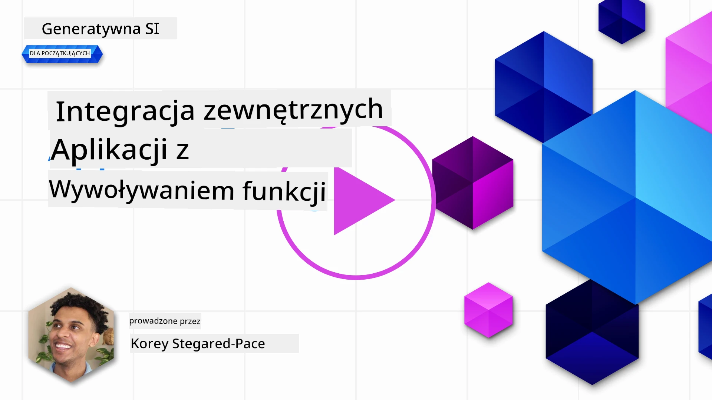
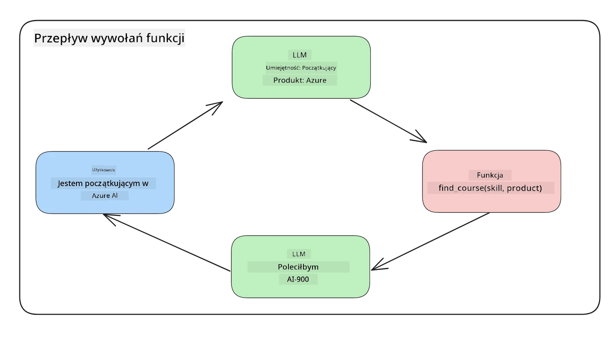
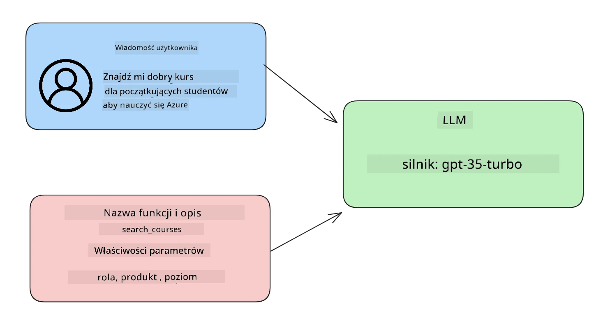

# Integracja z wywoływaniem funkcji

[](https://youtu.be/DgUdCLX8qYQ?si=f1ouQU5HQx6F8Gl2)

Do tej pory nauczyłeś się całkiem sporo w poprzednich lekcjach. Jednak możemy się jeszcze bardziej poprawić. Pewne kwestie, które możemy rozwiązać, dotyczą uzyskania bardziej spójnego formatu odpowiedzi, aby ułatwić dalszą pracę z odpowiedzią. Ponadto, możemy chcieć dodać dane z innych źródeł, aby jeszcze bardziej wzbogacić naszą aplikację.

Wymienione powyżej problemy to właśnie te, które ta część ma zamiar rozwiązać.

## Wprowadzenie

Ta lekcja obejmie:

- Wyjaśnienie, czym jest wywoływanie funkcji i do czego się je stosuje.
- Tworzenie wywołania funkcji za pomocą Azure OpenAI.
- Jak zintegrować wywołanie funkcji z aplikacją.

## Cele nauki

Po zakończeniu tej lekcji będziesz potrafił:

- Wyjaśnić cel stosowania wywoływania funkcji.
- Skonfigurować wywołanie funkcji za pomocą usługi Azure OpenAI.
- Zaprojektować skuteczne wywołania funkcji do zastosowania w swojej aplikacji.

## Scenariusz: Ulepszanie naszego chatbota za pomocą funkcji

Na tę lekcję chcemy zbudować funkcję dla naszego edukacyjnego startupu, która pozwoli użytkownikom korzystać z chatbota do wyszukiwania kursów technicznych. Będziemy polecać kursy dopasowane do ich poziomu umiejętności, obecnej roli i interesującej technologii.

Aby ukończyć ten scenariusz, skorzystamy z kombinacji:

- `Azure OpenAI`, aby stworzyć doświadczenie czatu dla użytkownika.
- `Microsoft Learn Catalog API`, by pomóc użytkownikom znaleźć kursy na podstawie ich zapytań.
- `Wywoływania funkcji`, by wziąć zapytanie użytkownika i przesłać je do funkcji wykonującej żądanie API.

Aby zacząć, spójrzmy, dlaczego w ogóle chcielibyśmy używać wywoływania funkcji:

## Dlaczego wywoływanie funkcji

Przed wywoływaniem funkcji odpowiedzi z modelu LLM były niestrukturalne i niespójne. Programiści musieli pisać skomplikowany kod walidacyjny, by poradzić sobie z każdym wariantem odpowiedzi. Użytkownicy nie mogli uzyskać odpowiedzi na pytania typu „Jaka jest obecna pogoda w Sztokholmie?”. Dzieje się tak, ponieważ modele były ograniczone do czasu, na którym były trenowane.

Wywoływanie funkcji to funkcja usługi Azure OpenAI, która pozwala przezwyciężyć następujące ograniczenia:

- **Spójny format odpowiedzi**. Jeśli możemy lepiej kontrolować format odpowiedzi, łatwiej jest zintegrować je w dalszym etapie z innymi systemami.
- **Dane zewnętrzne**. Możliwość korzystania z danych z innych źródeł aplikacji w kontekście czatu.

## Ilustracja problemu za pomocą scenariusza

> Zalecamy korzystanie z [dołączonego notatnika](./python/aoai-assignment.ipynb?WT.mc_id=academic-105485-koreyst), jeśli chcesz przeprowadzić poniższy scenariusz. Możesz też po prostu czytać dalej, ponieważ staramy się zilustrować problem, w którym funkcje mogą pomóc.

Spójrzmy na przykład, który ilustruje problem formatu odpowiedzi:

Załóżmy, że chcemy stworzyć bazę danych danych studentów, aby móc zaproponować im odpowiedni kurs. Poniżej mamy dwa opisy studentów, które są bardzo podobne pod względem zawartych danych.

1. Utwórz połączenie z zasobem Azure OpenAI:

   ```python
   import os
   import json
   from openai import OpenAI
   from dotenv import load_dotenv
   load_dotenv()

   # Interfejs API odpowiedzi jest udostępniany z punktu końcowego Azure OpenAI (Microsoft Foundry) v1
   # dlatego wskazujemy klienta OpenAI na <your-endpoint>/openai/v1/.
   endpoint = os.environ['AZURE_OPENAI_ENDPOINT']
   client = OpenAI(
   api_key=os.environ['AZURE_OPENAI_API_KEY'],
   base_url=f"{endpoint.rstrip('/')}/openai/v1/",
   )

   deployment=os.environ['AZURE_OPENAI_DEPLOYMENT']
   ```

   Poniżej znajduje się fragment kodu Pythona do skonfigurowania połączenia z Azure OpenAI. Ponieważ używamy punktu końcowego v1, musimy tylko ustawić `api_key` i `base_url` (nie jest potrzebna wersja `api_version`).

1. Utworzenie dwóch opisów studentów w zmiennych `student_1_description` i `student_2_description`.

   ```python
   student_1_description="Emily Johnson is a sophomore majoring in computer science at Duke University. She has a 3.7 GPA. Emily is an active member of the university's Chess Club and Debate Team. She hopes to pursue a career in software engineering after graduating."

   student_2_description = "Michael Lee is a sophomore majoring in computer science at Stanford University. He has a 3.8 GPA. Michael is known for his programming skills and is an active member of the university's Robotics Club. He hopes to pursue a career in artificial intelligence after finishing his studies."
   ```

   Chcemy przesłać powyższe opisy studentów do LLM, aby przetworzyć dane. Dane te mogą być później używane w naszej aplikacji, przesyłane do API albo zapisywane w bazie danych.

1. Stwórzmy dwa identyczne komunikaty, w których instruujemy LLM, jakie informacje nas interesują:

   ```python
   prompt1 = f'''
   Please extract the following information from the given text and return it as a JSON object:

   name
   major
   school
   grades
   club

   This is the body of text to extract the information from:
   {student_1_description}
   '''

   prompt2 = f'''
   Please extract the following information from the given text and return it as a JSON object:

   name
   major
   school
   grades
   club

   This is the body of text to extract the information from:
   {student_2_description}
   '''
   ```

   Powyższe komunikaty nakazują LLM wyodrębnić informacje i zwrócić odpowiedź w formacie JSON.

1. Po przygotowaniu komunikatów i połączenia z Azure OpenAI, wyślemy komunikaty do LLM, korzystając z `client.responses.create`. Przypisujemy komunikat do zmiennej `input` i ustawiamy rolę na `user`. Ma to na celu imitowanie wiadomości przesyłanej przez użytkownika do chatbota.

   ```python
   # odpowiedź z zapytania pierwszego
   openai_response1 = client.responses.create(
   model=deployment,
   input = [{'role': 'user', 'content': prompt1}],
   store=False,
   )
   openai_response1.output_text

   # odpowiedź z zapytania drugiego
   openai_response2 = client.responses.create(
   model=deployment,
   input = [{'role': 'user', 'content': prompt2}],
   store=False,
   )
   openai_response2.output_text
   ```

Teraz możemy wysłać oba zapytania do LLM i sprawdzić otrzymaną odpowiedź, odwołując się do `openai_response1.output_text`.

1. Na końcu możemy przekonwertować odpowiedź do formatu JSON, wywołując `json.loads`:

   ```python
   # Ładowanie odpowiedzi jako obiektu JSON
   json_response1 = json.loads(openai_response1.output_text)
   json_response1
   ```

   Odpowiedź 1:

   ```json
   {
     "name": "Emily Johnson",
     "major": "computer science",
     "school": "Duke University",
     "grades": "3.7",
     "club": "Chess Club"
   }
   ```

   Odpowiedź 2:

   ```json
   {
     "name": "Michael Lee",
     "major": "computer science",
     "school": "Stanford University",
     "grades": "3.8 GPA",
     "club": "Robotics Club"
   }
   ```

   Pomimo że komunikaty są takie same, a opisy podobne, widzimy wartości właściwości `Grades` sformatowane inaczej, na przykład jako `3.7` lub `3.7 GPA`.

   Ten wynik wynika z faktu, że LLM przetwarza dane niestrukturalne w formie zapisanego komunikatu i zwraca również dane niestrukturalne. Potrzebujemy mieć format strukturalny, aby wiedzieć, czego się spodziewać przy przechowywaniu lub wykorzystywaniu tych danych.

Jak więc rozwiązujemy problem formatowania? Dzięki wywoływaniu funkcji możemy mieć pewność, że otrzymamy dane strukturalne. W przypadku wywoływania funkcji LLM faktycznie nie wywołuje ani nie uruchamia żadnych funkcji. Zamiast tego tworzymy strukturę, którą LLM ma przestrzegać w swoich odpowiedziach. Następnie korzystamy z tych ustrukturyzowanych odpowiedzi, aby wiedzieć, jaką funkcję wywołać w naszych aplikacjach.



Możemy następnie wziąć to, co zostało zwrócone przez funkcję i przesłać to z powrotem do LLM. LLM wtedy odpowie w języku naturalnym, aby odpowiedzieć na zapytanie użytkownika.

## Przypadki użycia wywołań funkcji

Istnieje wiele różnych zastosowań, gdzie wywołania funkcji mogą ulepszyć Twoją aplikację, na przykład:

- **Wywoływanie narzędzi zewnętrznych**. Chatboty świetnie odpowiadają na pytania użytkowników. Dzięki wywoływaniu funkcji chatboty mogą wykonać określone zadania na podstawie wiadomości od użytkowników. Na przykład student może poprosić chatbota, aby „wysłał e-mail do mojego instruktora, że potrzebuję więcej pomocy w tym temacie”. Może to wywołać funkcję `send_email(to: string, body: string)`.

- **Tworzenie zapytań do API lub bazy danych**. Użytkownicy mogą znaleźć informacje używając naturalnego języka, który jest konwertowany na sformatowane zapytanie lub żądanie API. Przykładem może być nauczyciel pytający „Którzy uczniowie ukończyli ostatnie zadanie”, które może wywołać funkcję `get_completed(student_name: string, assignment: int, current_status: string)`.

- **Tworzenie danych strukturalnych**. Użytkownicy mogą przekazać fragment tekstu lub plik CSV i użyć LLM do wyodrębnienia ważnych informacji. Na przykład student może przekształcić artykuł na Wikipedii o porozumieniach pokojowych, aby stworzyć fiszki AI. Można to zrobić za pomocą funkcji `get_important_facts(agreement_name: string, date_signed: string, parties_involved: list)`.

## Tworzenie pierwszego wywołania funkcji

Proces tworzenia wywołania funkcji obejmuje 3 główne kroki:

1. **Wywołanie** API odpowiedzi z listą Twoich funkcji (narzędzi) i wiadomością użytkownika.
2. **Odczytanie** odpowiedzi modelu, aby wykonać akcję, np. uruchomić funkcję lub wywołanie API.
3. **Ponowne wywołanie** API odpowiedzi z odpowiedzią z funkcji, aby wykorzystać tę informację do stworzenia odpowiedzi dla użytkownika.



### Krok 1 - tworzenie wiadomości

Pierwszym krokiem jest stworzenie wiadomości użytkownika. Można ją przypisać dynamicznie, pobierając wartość z pola tekstowego lub ustawić ją tutaj. Jeśli to Twój pierwszy raz z API odpowiedzi, musimy określić `role` i `content` wiadomości.

`role` może być `system` (tworzenie reguł), `assistant` (model) lub `user` (użytkownik końcowy). Dla wywoływania funkcji przypiszemy `user` oraz przykład pytania.

```python
messages= [ {"role": "user", "content": "Find me a good course for a beginner student to learn Azure."} ]
```

Poprzez przypisywanie różnych ról jasno informujemy LLM, czy to system coś mówi, czy użytkownik, co pomaga w budowaniu historii rozmowy, na której LLM może bazować.

### Krok 2 - tworzenie funkcji

Następnie zdefiniujemy funkcję i jej parametry. Użyjemy tylko jednej funkcji o nazwie `search_courses`, ale możesz stworzyć wiele funkcji.

> **Ważne**: Funkcje są uwzględniane w wiadomości systemowej do LLM i wliczają się do dostępnej puli tokenów.

Poniżej tworzymy funkcje jako tablicę elementów. Każdy element to narzędzie w formacie płaskim API Odpowiedzi, z właściwościami `type`, `name`, `description` i `parameters`:

```python
functions = [
   {
      "type":"function",
      "name":"search_courses",
      "description":"Retrieves courses from the search index based on the parameters provided",
      "parameters":{
         "type":"object",
         "properties":{
            "role":{
               "type":"string",
               "description":"The role of the learner (i.e. developer, data scientist, student, etc.)"
            },
            "product":{
               "type":"string",
               "description":"The product that the lesson is covering (i.e. Azure, Power BI, etc.)"
            },
            "level":{
               "type":"string",
               "description":"The level of experience the learner has prior to taking the course (i.e. beginner, intermediate, advanced)"
            }
         },
         "required":[
            "role"
         ]
      }
   }
]
```

Poniżej szczegółowo opisujemy każdy z elementów funkcji:

- `name` - Nazwa funkcji, którą chcemy wywołać.
- `description` - Opis działania funkcji. Ważne jest, aby był precyzyjny i jasny.
- `parameters` - Lista wartości i format, jaki model ma wygenerować w odpowiedzi. Tablica parametrów składa się z elementów mających właściwości:
  1.  `type` - Typ danych przechowywanych w właściwościach.
  1.  `properties` - Lista konkretnych wartości, które model ma użyć w swojej odpowiedzi.
      1. `name` - Klucz to nazwa właściwości, której model użyje w sformatowanej odpowiedzi, np. `product`.
      1. `type` - Typ danych tej właściwości, np. `string`.
      1. `description` - Opis konkretnej właściwości.

Jest także opcjonalna właściwość `required` - wymagana do wykonania wywołania funkcji.

### Krok 3 - wykonanie wywołania funkcji

Po zdefiniowaniu funkcji, musimy ją uwzględnić w wywołaniu do API Odpowiedzi. Robimy to, dodając `tools` do żądania. W tym przypadku `tools=functions`.

Istnieje również opcja ustawienia `tool_choice` na `auto`. Oznacza to, że pozwalamy LLM zdecydować, którą funkcję wywołać na podstawie wiadomości użytkownika, zamiast przypisywać to samemu.

Poniżej jest fragment kodu, gdzie wywołujemy `client.responses.create`, zwróć uwagę, że ustawiamy `tools=functions` i `tool_choice="auto"`, dając modelowi wolną rękę, kiedy wywołać przekazane funkcje:

```python
response = client.responses.create(model=deployment,
                                        input=messages,
                                        tools=functions,
                                        tool_choice="auto",
                                        store=False)

print(response.output)
```

Odpowiedź zawiera teraz element `function_call` w `response.output` wyglądający tak:

```json
{
  "type": "function_call",
  "name": "search_courses",
  "call_id": "call_abc123",
  "arguments": "{\n  \"role\": \"student\",\n  \"product\": \"Azure\",\n  \"level\": \"beginner\"\n}"
}
```

Widać, że została wywołana funkcja `search_courses` wraz z argumentami, podanymi w właściwości `arguments` w odpowiedzi JSON.

Model LLM uznał, że dane pasują do argumentów funkcji, ponieważ wydobył je z wartości przekazanej w parametrze `input` wywołania API Odpowiedzi. Poniżej przypomnienie wartości `messages`:

```python
messages= [ {"role": "user", "content": "Find me a good course for a beginner student to learn Azure."} ]
```

Jak widzisz, `student`, `Azure` i `beginner` zostały wyodrębnione z `messages` i ustawione jako wejście do funkcji. Używając funkcji w ten sposób, świetnie wyodrębniasz informacje z komunikatu, a jednocześnie dajesz strukturę LLM i masz funkcjonalność wielokrotnego użytku.

Teraz musimy zobaczyć, jak możemy to użyć w naszej aplikacji.

## Integracja wywołań funkcji z aplikacją

Po przetestowaniu sformatowanej odpowiedzi z LLM, możemy zintegrować ją z aplikacją.

### Zarządzanie przepływem

Aby zintegrować to z naszą aplikacją, wykonajmy następujące kroki:

1. Najpierw wykonaj wywołanie do usług OpenAI i wyodrębnij elementy wywołania funkcji z odpowiedzi `output`.

   ```python
   response_items = response.output
   tool_calls = [item for item in response_items if item.type == "function_call"]
   ```

1. Teraz zdefiniujemy funkcję, która wywoła Microsoft Learn API, by pobrać listę kursów:

   ```python
   import requests

   def search_courses(role, product, level):
     url = "https://learn.microsoft.com/api/catalog/"
     params = {
        "role": role,
        "product": product,
        "level": level
     }
     response = requests.get(url, params=params)
     modules = response.json()["modules"]
     results = []
     for module in modules[:5]:
        title = module["title"]
        url = module["url"]
        results.append({"title": title, "url": url})
     return str(results)
   ```

   Zauważ, że teraz tworzymy faktyczną funkcję Pythona, która odpowiada nazwom funkcji podanym w zmiennej `functions`. Dokonujemy także realnych wywołań zewnętrznego API, by pobrać potrzebne dane — w tym przypadku korzystamy z Microsoft Learn API do wyszukiwania modułów szkoleniowych.

Mamy więc zmienną `functions` oraz odpowiadającą jej funkcję Python. Jak powiedzieć LLM, jak połączyć te dwie rzeczy, aby wywołać funkcję Pythona?

1. Aby sprawdzić, czy musimy wywołać funkcję Pythona, musimy zajrzeć do odpowiedzi LLM, sprawdzić, czy jest tam element `function_call` i wywołać wskazaną funkcję. Oto, jak możesz wykonać to sprawdzenie poniżej:

   ```python
   # Sprawdź, czy model chce wywołać funkcję
   if tool_calls:
    for tool_call in tool_calls:
     print("Recommended Function call:")
     print(tool_call.name)
     print()

     # Wywołaj funkcję.
     function_name = tool_call.name

     available_functions = {
             "search_courses": search_courses,
     }
     function_to_call = available_functions[function_name]

     function_args = json.loads(tool_call.arguments)
     function_response = function_to_call(**function_args)

     print("Output of function call:")
     print(function_response)
     print(type(function_response))

     # Dodaj wywołanie funkcji i jej wynik z powrotem do rozmowy.
     # Element function_call modelu musi zostać dołączony przed jego wyjściem.
     messages.append(tool_call)  # element function_call asystenta
     messages.append( # wynik funkcji
         {
             "type": "function_call_output",
             "call_id": tool_call.call_id,
             "output": function_response,
         }
     )
   ```

   Te trzy linie zapewniają wyodrębnienie nazwy funkcji, argumentów i wykonanie wywołania:

   ```python
   function_to_call = available_functions[function_name]

   function_args = json.loads(tool_call.arguments)
   function_response = function_to_call(**function_args)
   ```

   Poniżej wyniki uruchomienia naszego kodu:

   **Wyjście**

   ```Recommended Function call:
   {
     "name": "search_courses",
     "arguments": "{\n  \"role\": \"student\",\n  \"product\": \"Azure\",\n  \"level\": \"beginner\"\n}"
   }

   Output of function call:
   [{'title': 'Describe concepts of cryptography', 'url': 'https://learn.microsoft.com/training/modules/describe-concepts-of-cryptography/?
   WT.mc_id=api_CatalogApi'}, {'title': 'Introduction to audio classification with TensorFlow', 'url': 'https://learn.microsoft.com/en-
   us/training/modules/intro-audio-classification-tensorflow/?WT.mc_id=api_CatalogApi'}, {'title': 'Design a Performant Data Model in Azure SQL
   Database with Azure Data Studio', 'url': 'https://learn.microsoft.com/training/modules/design-a-data-model-with-ads/?
   WT.mc_id=api_CatalogApi'}, {'title': 'Getting started with the Microsoft Cloud Adoption Framework for Azure', 'url':
   'https://learn.microsoft.com/training/modules/cloud-adoption-framework-getting-started/?WT.mc_id=api_CatalogApi'}, {'title': 'Set up the
   Rust development environment', 'url': 'https://learn.microsoft.com/training/modules/rust-set-up-environment/?WT.mc_id=api_CatalogApi'}]
   <class 'str'>
   ```

1. Teraz prześlemy zaktualizowaną wiadomość, `messages`, do LLM, aby otrzymać odpowiedź w języku naturalnym zamiast sformatowanej odpowiedzi JSON.

   ```python
   print("Messages in next request:")
   print(messages)
   print()

   second_response = client.responses.create(
      input=messages,
      model=deployment,
      tool_choice="auto",
      tools=functions,
      temperature=0,
      store=False,
         )  # uzyskaj nową odpowiedź od modelu, gdzie może zobaczyć odpowiedź funkcji


   print(second_response.output_text)
   ```

   **Wyjście**

   ```text
   I found some good courses for beginner students to learn Azure:

   1. [Describe concepts of cryptography](https://learn.microsoft.com/training/modules/describe-concepts-of-cryptography/?WT.mc_id=api_CatalogApi)
   2. [Introduction to audio classification with TensorFlow](https://learn.microsoft.com/training/modules/intro-audio-classification-tensorflow/?WT.mc_id=api_CatalogApi)
   3. [Design a Performant Data Model in Azure SQL Database with Azure Data Studio](https://learn.microsoft.com/training/modules/design-a-data-model-with-ads/?WT.mc_id=api_CatalogApi)
   4. [Getting started with the Microsoft Cloud Adoption Framework for Azure](https://learn.microsoft.com/training/modules/cloud-adoption-framework-getting-started/?WT.mc_id=api_CatalogApi)
   5. [Set up the Rust development environment](https://learn.microsoft.com/training/modules/rust-set-up-environment/?WT.mc_id=api_CatalogApi)

   You can click on the links to access the courses.
   ```

## Zadanie domowe

Aby kontynuować naukę wywoływania funkcji Azure OpenAI, możesz zbudować:

- Więcej parametrów funkcji, które mogą pomóc uczniom znaleźć więcej kursów.

- Utwórz kolejne wywołanie funkcji, które pobierze więcej informacji od ucznia, takich jak jego język ojczysty
- Dodaj obsługę błędów na wypadek, gdy wywołanie funkcji i/lub wywołanie API nie zwróci żadnych odpowiednich kursów

Podpowiedź: Skorzystaj ze strony [Learn API reference documentation](https://learn.microsoft.com/training/support/catalog-api-developer-reference?WT.mc_id=academic-105485-koreyst), aby zobaczyć, jak i gdzie są dostępne te dane.

## Świetna robota! Kontynuuj podróż

Po ukończeniu tej lekcji sprawdź naszą [kolekcję nauki Generative AI](https://aka.ms/genai-collection?WT.mc_id=academic-105485-koreyst), aby dalej podnosić swoją wiedzę o Generative AI!

Przejdź do Lekcji 12, gdzie przyjrzymy się, jak [projektować UX dla aplikacji AI](../12-designing-ux-for-ai-applications/README.md?WT.mc_id=academic-105485-koreyst)!

---

<!-- CO-OP TRANSLATOR DISCLAIMER START -->
**Zastrzeżenie**:
Niniejszy dokument został przetłumaczony za pomocą usługi tłumaczenia AI [Co-op Translator](https://github.com/Azure/co-op-translator). Choć dążymy do dokładności, prosimy pamiętać, że automatyczne tłumaczenia mogą zawierać błędy lub niedokładności. Oryginalny dokument w jego języku źródłowym należy uznawać za autorytatywne źródło. W przypadku informacji krytycznych zalecane jest skorzystanie z profesjonalnego tłumaczenia wykonanego przez człowieka. Nie ponosimy odpowiedzialności za jakiekolwiek nieporozumienia lub błędne interpretacje wynikające z użycia tego tłumaczenia.
<!-- CO-OP TRANSLATOR DISCLAIMER END -->