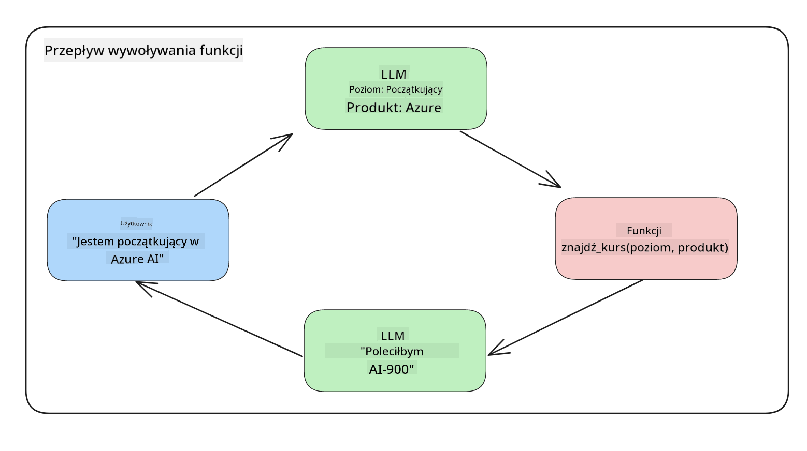

<!--
CO_OP_TRANSLATOR_METADATA:
{
  "original_hash": "77a48a201447be19aa7560706d6f93a0",
  "translation_date": "2025-07-09T14:32:28+00:00",
  "source_file": "11-integrating-with-function-calling/README.md",
  "language_code": "pl"
}
-->
# Integracja z wywoływaniem funkcji

[](https://aka.ms/gen-ai-lesson11-gh?WT.mc_id=academic-105485-koreyst)

Do tej pory nauczyłeś się całkiem sporo w poprzednich lekcjach. Jednak możemy pójść dalej. Niektóre kwestie, które możemy poprawić, to uzyskanie bardziej spójnego formatu odpowiedzi, co ułatwi dalszą pracę z odpowiedzią. Możemy też chcieć dodać dane z innych źródeł, aby jeszcze bardziej wzbogacić naszą aplikację.

Wymienione powyżej problemy są tym, czym zajmie się ten rozdział.

## Wprowadzenie

W tej lekcji omówimy:

- Co to jest wywoływanie funkcji i do czego służy.
- Tworzenie wywołania funkcji za pomocą Azure OpenAI.
- Jak zintegrować wywołanie funkcji z aplikacją.

## Cele nauki

Po ukończeniu tej lekcji będziesz potrafił:

- Wyjaśnić cel stosowania wywoływania funkcji.
- Skonfigurować wywołanie funkcji za pomocą usługi Azure OpenAI.
- Projektować efektywne wywołania funkcji dopasowane do potrzeb Twojej aplikacji.

## Scenariusz: Ulepszanie naszego chatbota za pomocą funkcji

W tej lekcji chcemy stworzyć funkcję dla naszego startupu edukacyjnego, która pozwoli użytkownikom korzystać z chatbota do wyszukiwania kursów technicznych. Będziemy polecać kursy dopasowane do ich poziomu umiejętności, obecnej roli oraz interesującej technologii.

Aby zrealizować ten scenariusz, użyjemy połączenia:

- `Azure OpenAI` do stworzenia doświadczenia czatu dla użytkownika.
- `Microsoft Learn Catalog API` do pomocy użytkownikom w znajdowaniu kursów na podstawie ich zapytań.
- `Function Calling` do przejęcia zapytania użytkownika i przesłania go do funkcji wykonującej zapytanie do API.

Na początek przyjrzyjmy się, dlaczego w ogóle chcemy używać wywoływania funkcji:

## Dlaczego wywoływanie funkcji

Przed wprowadzeniem wywoływania funkcji odpowiedzi z LLM były nieustrukturyzowane i niespójne. Programiści musieli pisać skomplikowany kod walidacyjny, aby poradzić sobie z różnymi wariantami odpowiedzi. Użytkownicy nie mogli uzyskać odpowiedzi na pytania typu „Jaka jest aktualna pogoda w Sztokholmie?”. Dzieje się tak, ponieważ modele były ograniczone do danych, na których zostały wytrenowane.

Wywoływanie funkcji to funkcja usługi Azure OpenAI, która pozwala pokonać następujące ograniczenia:

- **Spójny format odpowiedzi**. Jeśli możemy lepiej kontrolować format odpowiedzi, łatwiej jest zintegrować ją z innymi systemami.
- **Dane zewnętrzne**. Możliwość korzystania z danych pochodzących z innych źródeł aplikacji w kontekście czatu.

## Ilustracja problemu na przykładzie scenariusza

> Zalecamy użycie [dołączonego notatnika](python/aoai-assignment.ipynb), jeśli chcesz uruchomić poniższy scenariusz. Możesz też po prostu czytać dalej, ponieważ chcemy zilustrować problem, który funkcje mogą pomóc rozwiązać.

Spójrzmy na przykład ilustrujący problem z formatem odpowiedzi:

Załóżmy, że chcemy stworzyć bazę danych z danymi studentów, aby móc im sugerować odpowiednie kursy. Poniżej mamy dwa opisy studentów, które są bardzo podobne pod względem zawartych danych.

1. Utwórz połączenie z zasobem Azure OpenAI:

   ```python
   import os
   import json
   from openai import AzureOpenAI
   from dotenv import load_dotenv
   load_dotenv()

   client = AzureOpenAI(
   api_key=os.environ['AZURE_OPENAI_API_KEY'],  # this is also the default, it can be omitted
   api_version = "2023-07-01-preview"
   )

   deployment=os.environ['AZURE_OPENAI_DEPLOYMENT']
   ```

   Poniżej znajduje się kod w Pythonie konfigurujący połączenie z Azure OpenAI, gdzie ustawiamy `api_type`, `api_base`, `api_version` oraz `api_key`.

1. Tworzymy dwa opisy studentów za pomocą zmiennych `student_1_description` i `student_2_description`.

   ```python
   student_1_description="Emily Johnson is a sophomore majoring in computer science at Duke University. She has a 3.7 GPA. Emily is an active member of the university's Chess Club and Debate Team. She hopes to pursue a career in software engineering after graduating."

   student_2_description = "Michael Lee is a sophomore majoring in computer science at Stanford University. He has a 3.8 GPA. Michael is known for his programming skills and is an active member of the university's Robotics Club. He hopes to pursue a career in artificial intelligence after finishing his studies."
   ```

   Chcemy przesłać powyższe opisy studentów do LLM, aby przetworzyć dane. Dane te mogą być później użyte w naszej aplikacji, przesłane do API lub zapisane w bazie danych.

1. Stwórzmy dwa identyczne prompt’y, w których instruujemy LLM, jakie informacje nas interesują:

   ```python
   prompt1 = f'''
   Please extract the following information from the given text and return it as a JSON object:

   name
   major
   school
   grades
   club

   This is the body of text to extract the information from:
   {student_1_description}
   '''

   prompt2 = f'''
   Please extract the following information from the given text and return it as a JSON object:

   name
   major
   school
   grades
   club

   This is the body of text to extract the information from:
   {student_2_description}
   '''
   ```

   Powyższe prompt’y instruują LLM, aby wyodrębnił informacje i zwrócił odpowiedź w formacie JSON.

1. Po skonfigurowaniu promptów i połączenia z Azure OpenAI, wyślemy teraz prompt’y do LLM za pomocą `openai.ChatCompletion`. Przechowujemy prompt w zmiennej `messages` i przypisujemy rolę `user`. Ma to na celu symulację wiadomości od użytkownika wysyłanej do chatbota.

   ```python
   # response from prompt one
   openai_response1 = client.chat.completions.create(
   model=deployment,
   messages = [{'role': 'user', 'content': prompt1}]
   )
   openai_response1.choices[0].message.content

   # response from prompt two
   openai_response2 = client.chat.completions.create(
   model=deployment,
   messages = [{'role': 'user', 'content': prompt2}]
   )
   openai_response2.choices[0].message.content
   ```

Teraz możemy wysłać oba zapytania do LLM i sprawdzić otrzymaną odpowiedź, odczytując ją tak: `openai_response1['choices'][0]['message']['content']`.

1. Na koniec możemy przekonwertować odpowiedź do formatu JSON, wywołując `json.loads`:

   ```python
   # Loading the response as a JSON object
   json_response1 = json.loads(openai_response1.choices[0].message.content)
   json_response1
   ```

   Odpowiedź 1:

   ```json
   {
     "name": "Emily Johnson",
     "major": "computer science",
     "school": "Duke University",
     "grades": "3.7",
     "club": "Chess Club"
   }
   ```

   Odpowiedź 2:

   ```json
   {
     "name": "Michael Lee",
     "major": "computer science",
     "school": "Stanford University",
     "grades": "3.8 GPA",
     "club": "Robotics Club"
   }
   ```

   Mimo że prompt’y są takie same, a opisy podobne, widzimy, że wartości właściwości `Grades` są formatowane różnie, np. czasem otrzymujemy `3.7`, a czasem `3.7 GPA`.

   Ten efekt wynika z faktu, że LLM przyjmuje nieustrukturyzowane dane w formie napisanego promptu i zwraca również nieustrukturyzowane dane. Potrzebujemy mieć ustrukturyzowany format, aby wiedzieć, czego się spodziewać podczas przechowywania lub używania tych danych.

Jak więc rozwiązać problem formatowania? Dzięki wywoływaniu funkcji możemy mieć pewność, że otrzymamy dane w ustrukturyzowanym formacie. Podczas korzystania z wywoływania funkcji LLM tak naprawdę nie wywołuje ani nie uruchamia żadnych funkcji. Zamiast tego tworzymy strukturę, której LLM ma się trzymać w swoich odpowiedziach. Następnie korzystamy z tych ustrukturyzowanych odpowiedzi, aby wiedzieć, jaką funkcję wywołać w naszej aplikacji.



Możemy wtedy wziąć to, co zwróci funkcja, i przesłać to z powrotem do LLM. LLM odpowie wtedy w języku naturalnym, odpowiadając na zapytanie użytkownika.

## Przypadki użycia wywoływania funkcji

Istnieje wiele różnych zastosowań, gdzie wywoływanie funkcji może usprawnić Twoją aplikację, na przykład:

- **Wywoływanie narzędzi zewnętrznych**. Chatboty świetnie odpowiadają na pytania użytkowników. Dzięki wywoływaniu funkcji chatboty mogą wykonać określone zadania na podstawie wiadomości od użytkowników. Na przykład student może poprosić chatbota: „Wyślij e-mail do mojego wykładowcy z prośbą o dodatkową pomoc w tym temacie”. Chatbot może wtedy wywołać funkcję `send_email(to: string, body: string)`.

- **Tworzenie zapytań do API lub bazy danych**. Użytkownicy mogą wyszukiwać informacje w języku naturalnym, które są konwertowane na sformatowane zapytania lub wywołania API. Przykładem może być nauczyciel, który pyta: „Którzy studenci ukończyli ostatnie zadanie?”, co może wywołać funkcję `get_completed(student_name: string, assignment: int, current_status: string)`.

- **Tworzenie ustrukturyzowanych danych**. Użytkownicy mogą wziąć blok tekstu lub plik CSV i użyć LLM do wyodrębnienia z niego ważnych informacji. Na przykład student może przekształcić artykuł z Wikipedii o porozumieniach pokojowych, aby stworzyć fiszki AI. Można to zrobić za pomocą funkcji `get_important_facts(agreement_name: string, date_signed: string, parties_involved: list)`.

## Tworzenie pierwszego wywołania funkcji

Proces tworzenia wywołania funkcji obejmuje 3 główne kroki:

1. **Wywołanie** API Chat Completions z listą Twoich funkcji i wiadomością od użytkownika.
2. **Odczytanie** odpowiedzi modelu, aby wykonać akcję, np. wywołać funkcję lub zapytanie do API.
3. **Wykonanie** kolejnego wywołania API Chat Completions z odpowiedzią z funkcji, aby wykorzystać tę informację do stworzenia odpowiedzi dla użytkownika.


### Krok 1 – tworzenie wiadomości

Pierwszym krokiem jest stworzenie wiadomości od użytkownika. Może być ona dynamicznie przypisana na podstawie wartości z pola tekstowego lub możesz przypisać ją tutaj ręcznie. Jeśli to Twoje pierwsze użycie API Chat Completions, musimy zdefiniować `role` oraz `content` wiadomości.

`role` może mieć wartość `system` (tworzenie reguł), `assistant` (model) lub `user` (użytkownik końcowy). Dla wywoływania funkcji przypiszemy `user` oraz przykładowe pytanie.

```python
messages= [ {"role": "user", "content": "Find me a good course for a beginner student to learn Azure."} ]
```

Przypisując różne role, jasno określamy LLM, czy to system coś mówi, czy użytkownik, co pomaga budować historię rozmowy, na której LLM może się opierać.

### Krok 2 – tworzenie funkcji

Następnie zdefiniujemy funkcję i jej parametry. Użyjemy tutaj jednej funkcji o nazwie `search_courses`, ale możesz stworzyć wiele funkcji.

> **Ważne**: Funkcje są dołączane do wiadomości systemowej wysyłanej do LLM i wliczają się w limit dostępnych tokenów.

Poniżej tworzymy funkcje jako tablicę elementów. Każdy element to funkcja z właściwościami `name`, `description` i `parameters`:

```python
functions = [
   {
      "name":"search_courses",
      "description":"Retrieves courses from the search index based on the parameters provided",
      "parameters":{
         "type":"object",
         "properties":{
            "role":{
               "type":"string",
               "description":"The role of the learner (i.e. developer, data scientist, student, etc.)"
            },
            "product":{
               "type":"string",
               "description":"The product that the lesson is covering (i.e. Azure, Power BI, etc.)"
            },
            "level":{
               "type":"string",
               "description":"The level of experience the learner has prior to taking the course (i.e. beginner, intermediate, advanced)"
            }
         },
         "required":[
            "role"
         ]
      }
   }
]
```

Opiszmy szczegółowo każdą właściwość funkcji:

- `name` – nazwa funkcji, którą chcemy wywołać.
- `description` – opis działania funkcji. Ważne, aby był precyzyjny i jasny.
- `parameters` – lista wartości i formatów, które model ma wygenerować w odpowiedzi. Tablica parametrów składa się z elementów, które mają następujące właściwości:
  1. `type` – typ danych, w jakim będą przechowywane właściwości.
  2. `properties` – lista konkretnych wartości, które model ma uwzględnić w odpowiedzi
      1. `name` – klucz to nazwa właściwości, którą model użyje w sformatowanej odpowiedzi, np. `product`.
      2. `type` – typ danych tej właściwości, np. `string`.
      3. `description` – opis konkretnej właściwości.

Istnieje też opcjonalna właściwość `required` – lista właściwości wymaganych do poprawnego wywołania funkcji.

### Krok 3 – wywołanie funkcji

Po zdefiniowaniu funkcji musimy ją uwzględnić w wywołaniu API Chat Completion. Robimy to, dodając `functions` do zapytania. W tym przypadku `functions=functions`.

Jest też opcja ustawienia `function_call` na `auto`. Oznacza to, że pozwalamy LLM zdecydować, którą funkcję wywołać na podstawie wiadomości użytkownika, zamiast przypisywać to ręcznie.

Poniżej kod, w którym wywołujemy `ChatCompletion.create`, zwróć uwagę, jak ustawiamy `functions=functions` i `function_call="auto"`, dając LLM wybór, kiedy wywołać dostępne funkcje:

```python
response = client.chat.completions.create(model=deployment,
                                        messages=messages,
                                        functions=functions,
                                        function_call="auto")

print(response.choices[0].message)
```

Odpowiedź, którą otrzymujemy, wygląda tak:

```json
{
  "role": "assistant",
  "function_call": {
    "name": "search_courses",
    "arguments": "{\n  \"role\": \"student\",\n  \"product\": \"Azure\",\n  \"level\": \"beginner\"\n}"
  }
}
```

Widzimy, że funkcja `search_courses` została wywołana wraz z argumentami, które są wymienione w właściwości `arguments` w odpowiedzi JSON.

Wniosek jest taki, że LLM potrafił znaleźć dane pasujące do argumentów funkcji, ponieważ wyodrębnił je z wartości przekazanej w parametrze `messages` w wywołaniu chat completion. Poniżej przypomnienie wartości `messages`:

```python
messages= [ {"role": "user", "content": "Find me a good course for a beginner student to learn Azure."} ]
```

Jak widać, `student`, `Azure` i `beginner` zostały wyodrębnione z `messages` i ustawione jako dane wejściowe do funkcji. Korzystanie z funkcji w ten sposób to świetny sposób na wyciąganie informacji z promptu, ale też na nadanie strukturze LLM i posiadanie wielokrotnego użytku funkcjonalności.

Teraz zobaczmy, jak możemy to wykorzystać w naszej aplikacji.

## Integracja wywołań funkcji z aplikacją

Po przetestowaniu sformatowanej odpowiedzi z LLM możemy teraz zintegrować ją z aplikacją.

### Zarządzanie przepływem

Aby zintegrować to z aplikacją, wykonajmy następujące kroki:

1. Najpierw wykonajmy wywołanie do usług OpenAI i zapiszmy wiadomość w zmiennej `response_message`.

   ```python
   response_message = response.choices[0].message
   ```

1. Teraz zdefiniujemy funkcję, która wywoła Microsoft Learn API, aby pobrać listę kursów:

   ```python
   import requests

   def search_courses(role, product, level):
     url = "https://learn.microsoft.com/api/catalog/"
     params = {
        "role": role,
        "product": product,
        "level": level
     }
     response = requests.get(url, params=params)
     modules = response.json()["modules"]
     results = []
     for module in modules[:5]:
        title = module["title"]
        url = module["url"]
        results.append({"title": title, "url": url})
     return str(results)
   ```

   Zwróć uwagę, że teraz tworzymy faktyczną funkcję w Pythonie, która odpowiada nazwom funkcji zdefiniowanym w zmiennej `functions`. Równocześnie wykonujemy rzeczywiste wywołania zewnętrznego API, aby pobrać potrzebne dane. W tym przypadku korzystamy z Microsoft Learn API, aby wyszukać moduły szkoleniowe.

Dobrze, stworzyliśmy zmienną `functions` i odpowiadającą jej funkcję w Pythonie, jak więc powiadomić LLM, jak powiązać te dwie rzeczy, aby nasza funkcja Python została wywołana?

1. Aby sprawdzić, czy musimy wywołać funkcję Python, musimy przejrzeć odpowiedź LLM i sprawdzić, czy zawiera `function_call`, a jeśli tak, wywołać wskazaną funkcję. Poniżej przykład, jak to zrobić:

   ```python
   # Check if the model wants to call a function
   if response_message.function_call.name:
    print("Recommended Function call:")
    print(response_message.function_call.name)
    print()

    # Call the function.
    function_name = response_message.function_call.name

    available_functions = {
            "search_courses": search_courses,
    }
    function_to_call = available_functions[function_name]

    function_args = json.loads(response_message.function_call.arguments)
    function_response = function_to_call(**function_args)

    print("Output of function call:")
    print(function_response)
    print(type(function_response))


    # Add the assistant response and function response to the messages
    messages.append( # adding assistant response to messages
        {
            "role": response_message.role,
            "function_call": {
                "name": function_name,
                "arguments": response_message.function_call.arguments,
            },
            "content": None
        }
    )
    messages.append( # adding function response to messages
        {
            "role": "function",
            "name": function_name,
            "content":function_response,
        }
    )
   ```

   Te trzy linie zapewniają wyodrębnienie nazwy funkcji, argumentów i wykonanie wywołania:

   ```python
   function_to_call = available_functions[function_name]

   function_args = json.loads(response_message.function_call.arguments)
   function_response = function_to_call(**function_args)
   ```

   Poniżej wynik działania naszego kodu:

   **Wynik**

   ```Recommended Function call:
   {
     "name": "search_courses",
     "arguments": "{\n  \"role\": \"student\",\n  \"product\": \"Azure\",\n  \"level\": \"beginner\"\n}"
   }

   Output of function call:
   [{'title': 'Describe concepts of cryptography', 'url': 'https://learn.microsoft.com/training/modules/describe-concepts-of-cryptography/?
   WT.mc_id=api_CatalogApi'}, {'title': 'Introduction to audio classification with TensorFlow', 'url': 'https://learn.microsoft.com/en-
   us/training/modules/intro-audio-classification-tensorflow/?WT.mc_id=api_CatalogApi'}, {'title': 'Design a Performant Data Model in Azure SQL
   Database with Azure Data Studio', 'url': 'https://learn.microsoft.com/training/modules/design-a-data-model-with-ads/?
   WT.mc_id=api_CatalogApi'}, {'title': 'Getting started with the Microsoft Cloud Adoption Framework for Azure', 'url':
   'https://learn.microsoft.com/training/modules/cloud-adoption-framework-getting-started/?WT.mc_id=api_CatalogApi'}, {'title': 'Set up the
   Rust development environment', 'url': 'https://learn.microsoft.com/training/modules/rust-set-up-environment/?WT.mc_id=api_CatalogApi'}]
   <class 'str'>
   ```

1. Teraz wyślemy zaktualizowaną wiadomość `messages` do LLM, aby otrzymać odpowiedź w języku naturalnym zamiast odpowiedzi w formacie JSON z API.

   ```python
   print("Messages in next request:")
   print(messages)
   print()

   second_response = client.chat.completions.create(
      messages=messages,
      model=deployment,
      function_call="auto",
      functions=functions,
      temperature=0
         )  # get a new response from GPT where it can see the function response


   print(second_response.choices[0].message)
   ```

   **Wynik**

   ```python
   {
     "role": "assistant",
     "content": "I found some good courses for beginner students to learn Azure:\n\n1. [Describe concepts of cryptography] (https://learn.microsoft.com/training/modules/describe-concepts-of-cryptography/?WT.mc_id=api_CatalogApi)\n2. [Introduction to audio classification with TensorFlow](https://learn.microsoft.com/training/modules/intro-audio-classification-tensorflow/?WT.mc_id=api_CatalogApi)\n3. [Design a Performant Data Model in Azure SQL Database with Azure Data Studio](https://learn.microsoft.com/training/modules/design-a-data-model-with-ads/?WT.mc_id=api_CatalogApi)\n4. [Getting started with the Microsoft Cloud Adoption Framework for Azure](https://learn.microsoft.com/training/modules/cloud-adoption-framework-getting-started/?WT.mc_id=api_CatalogApi)\n5. [Set up the Rust development environment](https://learn.microsoft.com/training/modules/rust-set-up-environment/?WT.mc_id=api_CatalogApi)\n\nYou can click on the links to access the courses."
   }

   ```

## Zadanie

Aby kontynuować naukę wywoływania funkcji w Azure OpenAI, możesz:

- Dodać więcej parametrów do funkcji, które pomogą użytkownikom znaleźć więcej kursów.
- Stworzyć kolejne wywołanie funkcji, które pobierze więcej informacji od użytkownika, np. jego język ojczysty.
- Dodać obsługę błędów na wypadek, gdy wywołanie funkcji i/lub API nie zwróci odpowiednich kursów.
## Świetna robota! Kontynuuj podróż

Po ukończeniu tej lekcji sprawdź naszą [kolekcję nauki o Generative AI](https://aka.ms/genai-collection?WT.mc_id=academic-105485-koreyst), aby dalej rozwijać swoją wiedzę na temat Generative AI!

Przejdź do Lekcji 12, gdzie przyjrzymy się, jak [projektować UX dla aplikacji AI](../12-designing-ux-for-ai-applications/README.md?WT.mc_id=academic-105485-koreyst)!

**Zastrzeżenie**:  
Niniejszy dokument został przetłumaczony za pomocą usługi tłumaczenia AI [Co-op Translator](https://github.com/Azure/co-op-translator). Mimo że dążymy do dokładności, prosimy mieć na uwadze, że tłumaczenia automatyczne mogą zawierać błędy lub nieścisłości. Oryginalny dokument w języku źródłowym powinien być uznawany za źródło autorytatywne. W przypadku informacji o kluczowym znaczeniu zalecane jest skorzystanie z profesjonalnego tłumaczenia wykonanego przez człowieka. Nie ponosimy odpowiedzialności za jakiekolwiek nieporozumienia lub błędne interpretacje wynikające z korzystania z tego tłumaczenia.