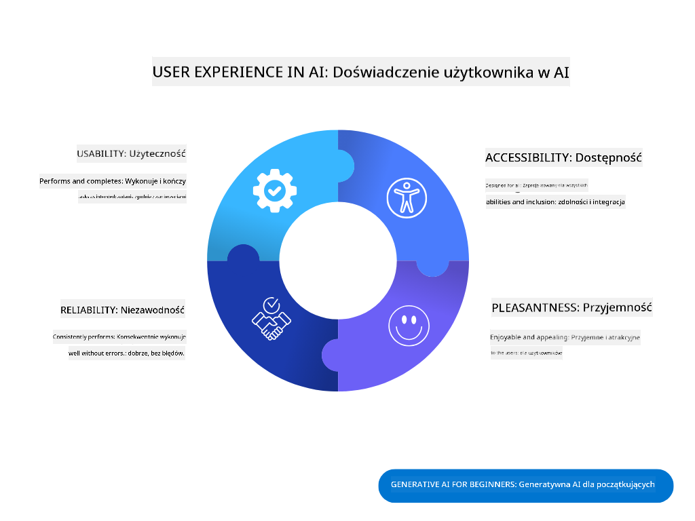
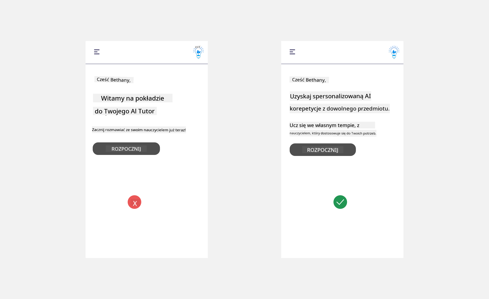
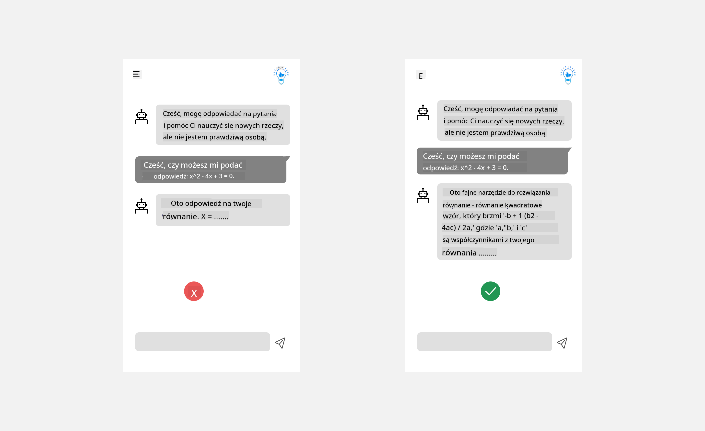
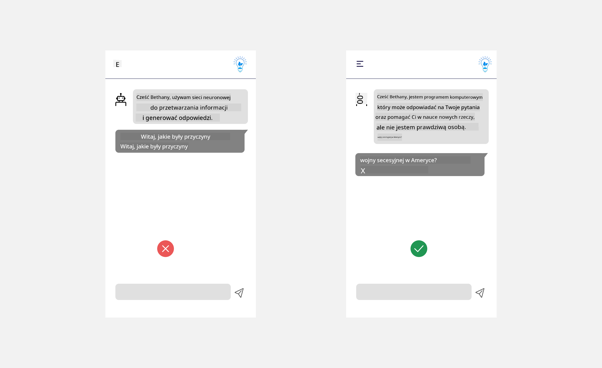
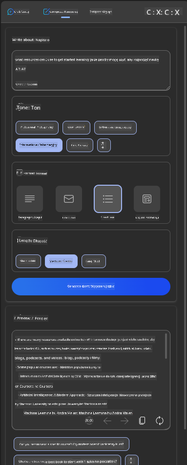
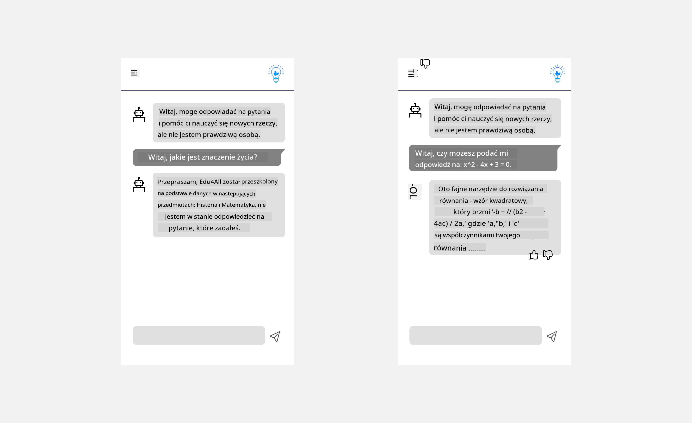

<!--
CO_OP_TRANSLATOR_METADATA:
{
  "original_hash": "ec385b41ee50579025d50cc03bfb3a25",
  "translation_date": "2025-06-25T20:21:35+00:00",
  "source_file": "12-designing-ux-for-ai-applications/README.md",
  "language_code": "pl"
}
-->
# Projektowanie UX dla aplikacji AI

> _(Kliknij na obrazek powyżej, aby obejrzeć wideo z tej lekcji)_

Doświadczenie użytkownika to bardzo ważny aspekt tworzenia aplikacji. Użytkownicy muszą być w stanie korzystać z Twojej aplikacji w efektywny sposób, aby wykonywać zadania. Efektywność to jedno, ale musisz również projektować aplikacje tak, aby były dostępne dla wszystkich, czyniąc je _dostępnymi_. Ten rozdział skupia się na tym obszarze, abyś mógł zaprojektować aplikację, którą ludzie będą mogli i chcieli używać.

## Wprowadzenie

Doświadczenie użytkownika to sposób, w jaki użytkownik interaguje i korzysta z konkretnego produktu lub usługi, czy to systemu, narzędzia czy projektu. Podczas tworzenia aplikacji AI, deweloperzy skupiają się nie tylko na zapewnieniu efektywnego doświadczenia użytkownika, ale także na aspektach etycznych. W tej lekcji omawiamy, jak budować aplikacje sztucznej inteligencji (AI), które odpowiadają na potrzeby użytkowników.

Lekcja obejmie następujące obszary:

- Wprowadzenie do doświadczenia użytkownika i zrozumienie potrzeb użytkowników
- Projektowanie aplikacji AI pod kątem zaufania i przejrzystości
- Projektowanie aplikacji AI do współpracy i informacji zwrotnej

## Cele nauki

Po ukończeniu tej lekcji będziesz w stanie:

- Zrozumieć, jak budować aplikacje AI, które spełniają potrzeby użytkowników.
- Projektować aplikacje AI, które promują zaufanie i współpracę.

### Wymagania wstępne

Zarezerwuj trochę czasu na przeczytanie więcej o [doświadczeniu użytkownika i myśleniu projektowym.](https://learn.microsoft.com/training/modules/ux-design?WT.mc_id=academic-105485-koreyst)

## Wprowadzenie do doświadczenia użytkownika i zrozumienie potrzeb użytkowników

W naszej fikcyjnej edukacyjnej startupie mamy dwóch głównych użytkowników, nauczycieli i uczniów. Każdy z tych użytkowników ma unikalne potrzeby. Projektowanie zorientowane na użytkownika stawia na pierwszym miejscu użytkownika, zapewniając, że produkty są istotne i korzystne dla tych, dla których są przeznaczone.

Aplikacja powinna być **użyteczna, niezawodna, dostępna i przyjemna**, aby zapewnić dobre doświadczenie użytkownika.

### Użyteczność

Bycie użytecznym oznacza, że aplikacja ma funkcjonalność, która odpowiada jej zamierzonemu celowi, na przykład automatyzowanie procesu oceniania lub generowanie fiszek do nauki. Aplikacja, która automatyzuje proces oceniania, powinna być w stanie dokładnie i efektywnie przydzielać oceny pracy uczniów na podstawie zdefiniowanych kryteriów. Podobnie, aplikacja generująca fiszki powinna być w stanie tworzyć odpowiednie i zróżnicowane pytania na podstawie swoich danych.

### Niezawodność

Bycie niezawodnym oznacza, że aplikacja może wykonywać swoje zadanie konsekwentnie i bez błędów. Jednak AI, podobnie jak ludzie, nie jest doskonała i może być podatna na błędy. Aplikacje mogą napotkać błędy lub nieoczekiwane sytuacje wymagające interwencji lub korekty ze strony człowieka. Jak radzisz sobie z błędami? W ostatniej części tej lekcji omówimy, jak systemy i aplikacje AI są projektowane do współpracy i informacji zwrotnej.

### Dostępność

Bycie dostępnym oznacza rozszerzenie doświadczenia użytkownika na użytkowników o różnych zdolnościach, w tym osoby z niepełnosprawnościami, zapewniając, że nikt nie zostanie pominięty. Przestrzegając wytycznych i zasad dotyczących dostępności, rozwiązania AI stają się bardziej inkluzywne, użyteczne i korzystne dla wszystkich użytkowników.

### Przyjemność

Bycie przyjemnym oznacza, że aplikacja jest przyjemna w użyciu. Atrakcyjne doświadczenie użytkownika może mieć pozytywny wpływ na użytkownika, zachęcając go do powrotu do aplikacji i zwiększając przychody firmy.

Nie każdy problem można rozwiązać za pomocą AI. AI wchodzi w grę, aby zwiększyć doświadczenie użytkownika, czy to poprzez automatyzację zadań manualnych, czy personalizację doświadczeń użytkownika.

## Projektowanie aplikacji AI pod kątem zaufania i przejrzystości

Budowanie zaufania jest kluczowe przy projektowaniu aplikacji AI. Zaufanie zapewnia, że użytkownik jest pewny, że aplikacja wykona zadanie, dostarczy wyniki konsekwentnie, a wyniki są tym, czego użytkownik potrzebuje. Ryzykiem w tym obszarze jest brak zaufania i nadmierne zaufanie. Brak zaufania występuje, gdy użytkownik ma małe lub brak zaufania do systemu AI, co prowadzi do odrzucenia aplikacji. Nadmierne zaufanie występuje, gdy użytkownik przecenia zdolności systemu AI, prowadząc do zbyt dużego zaufania do systemu AI. Na przykład, zautomatyzowany system oceniania w przypadku nadmiernego zaufania może prowadzić do tego, że nauczyciel nie sprawdzi niektórych prac, aby upewnić się, że system oceniania działa dobrze. Może to skutkować niesprawiedliwymi lub niedokładnymi ocenami dla uczniów lub utraconymi możliwościami uzyskania informacji zwrotnej i poprawy.

Dwa sposoby na zapewnienie, że zaufanie jest umieszczone w centrum projektowania to wytłumaczalność i kontrola.

### Wytłumaczalność

Gdy AI pomaga w podejmowaniu decyzji, takich jak przekazywanie wiedzy przyszłym pokoleniom, kluczowe jest, aby nauczyciele i rodzice rozumieli, jak podejmowane są decyzje AI. To jest wytłumaczalność - zrozumienie, jak aplikacje AI podejmują decyzje. Projektowanie z myślą o wytłumaczalności obejmuje dodawanie szczegółów dotyczących przykładów, co aplikacja AI może zrobić. Na przykład, zamiast "Rozpocznij z nauczycielem AI", system może użyć: "Podsumuj swoje notatki, aby ułatwić powtórkę za pomocą AI."

Innym przykładem jest to, jak AI korzysta z danych użytkowników i danych osobowych. Na przykład, użytkownik z osobowością ucznia może mieć ograniczenia na podstawie swojej osobowości. AI może nie być w stanie ujawnić odpowiedzi na pytania, ale może pomóc użytkownikowi przemyśleć, jak mogą rozwiązać problem.

Ostatnim kluczowym elementem wytłumaczalności jest uproszczenie wyjaśnień. Uczniowie i nauczyciele mogą nie być ekspertami AI, dlatego wyjaśnienia dotyczące tego, co aplikacja może lub nie może zrobić, powinny być uproszczone i łatwe do zrozumienia.

### Kontrola

Generatywna AI tworzy współpracę między AI a użytkownikiem, gdzie na przykład użytkownik może modyfikować polecenia dla różnych wyników. Dodatkowo, po wygenerowaniu wyniku, użytkownicy powinni mieć możliwość modyfikacji wyników, dając im poczucie kontroli. Na przykład, podczas korzystania z Binga, możesz dostosować swoje polecenie na podstawie formatu, tonu i długości. Dodatkowo, możesz wprowadzać zmiany do swojego wyniku i modyfikować wynik, jak pokazano poniżej:

Inną funkcją w Bing, która pozwala użytkownikowi mieć kontrolę nad aplikacją, jest możliwość włączania i wyłączania danych używanych przez AI. Dla szkolnej aplikacji, uczeń może chcieć używać swoich notatek, jak również zasobów nauczyciela jako materiału do nauki.

> Podczas projektowania aplikacji AI, intencjonalność jest kluczowa w zapewnieniu, że użytkownicy nie będą nadmiernie ufać, stawiając nierealistyczne oczekiwania co do jej możliwości. Jednym ze sposobów na to jest tworzenie tarcia między poleceniami a wynikami. Przypominanie użytkownikowi, że to jest AI, a nie inny człowiek

## Projektowanie aplikacji AI do współpracy i informacji zwrotnej

Jak wcześniej wspomniano, generatywna AI tworzy współpracę między użytkownikiem a AI. Większość interakcji polega na tym, że użytkownik wprowadza polecenie, a AI generuje wynik. Co, jeśli wynik jest niepoprawny? Jak aplikacja radzi sobie z błędami, jeśli się pojawią? Czy AI obwinia użytkownika, czy poświęca czas na wyjaśnienie błędu?

Aplikacje AI powinny być zbudowane w taki sposób, aby mogły otrzymywać i udzielać informacji zwrotnych. To nie tylko pomaga systemowi AI się poprawiać, ale także buduje zaufanie użytkowników. W projektowaniu powinien być uwzględniony obieg informacji zwrotnej, przykładem może być prosty kciuk w górę lub w dół przy wyniku.

Innym sposobem radzenia sobie z tym jest wyraźne komunikowanie możliwości i ograniczeń systemu. Kiedy użytkownik popełnia błąd, żądając czegoś poza możliwościami AI, powinien być również sposób na to, jak sobie z tym poradzić, jak pokazano poniżej.

Błędy systemowe są powszechne w aplikacjach, gdzie użytkownik może potrzebować pomocy z informacjami poza zakresem AI lub aplikacja może mieć limit, ile pytań/tematów użytkownik może generować podsumowania. Na przykład, aplikacja AI przeszkolona na danych dotyczących ograniczonych tematów, na przykład, historii i matematyki, może nie być w stanie poradzić sobie z pytaniami dotyczącymi geografii. Aby temu zaradzić, system AI może dać odpowiedź taką jak: "Przepraszam, nasz produkt został przeszkolony na danych w następujących przedmiotach....., nie mogę odpowiedzieć na pytanie, które zadałeś."

Aplikacje AI nie są doskonałe, dlatego są skłonne do popełniania błędów. Podczas projektowania aplikacji powinieneś zapewnić miejsce na informacje zwrotne od użytkowników i obsługę błędów w sposób prosty i łatwy do wyjaśnienia.

## Zadanie

Weź dowolne aplikacje AI, które dotychczas stworzyłeś, rozważ wdrożenie poniższych kroków w swojej aplikacji:

- **Przyjemność:** Zastanów się, jak możesz uczynić swoją aplikację bardziej przyjemną. Czy dodajesz wyjaśnienia wszędzie? Czy zachęcasz użytkownika do eksploracji? Jak formułujesz swoje komunikaty o błędach?

- **Użyteczność:** Tworzenie aplikacji internetowej. Upewnij się, że Twoja aplikacja jest nawigowalna zarówno za pomocą myszy, jak i klawiatury.

- **Zaufanie i przejrzystość:** Nie ufaj całkowicie AI i jej wynikom, zastanów się, jak dodać człowieka do procesu weryfikacji wyników. Rozważ także i wdroż inne sposoby osiągnięcia zaufania i przejrzystości.

- **Kontrola:** Daj użytkownikowi kontrolę nad danymi, które dostarcza do aplikacji. Wdróż sposób, w jaki użytkownik może włączać i wyłączać zbieranie danych w aplikacji AI.

## Kontynuuj naukę!

Po ukończeniu tej lekcji, zapoznaj się z naszą [kolekcją nauki o generatywnej AI](https://aka.ms/genai-collection?WT.mc_id=academic-105485-koreyst), aby dalej rozwijać swoją wiedzę o generatywnej AI!

Przejdź do Lekcji 13, gdzie przyjrzymy się, jak [zabezpieczać aplikacje AI](../13-securing-ai-applications/README.md?WT.mc_id=academic-105485-koreyst)!

**Zastrzeżenie**:  
Ten dokument został przetłumaczony przy użyciu usługi tłumaczeniowej AI [Co-op Translator](https://github.com/Azure/co-op-translator). Chociaż dążymy do dokładności, prosimy mieć na uwadze, że automatyczne tłumaczenia mogą zawierać błędy lub nieścisłości. Oryginalny dokument w jego rodzimym języku powinien być uznawany za źródło autorytatywne. W przypadku informacji krytycznych zaleca się profesjonalne tłumaczenie przez człowieka. Nie ponosimy odpowiedzialności za jakiekolwiek nieporozumienia lub błędne interpretacje wynikające z użycia tego tłumaczenia.