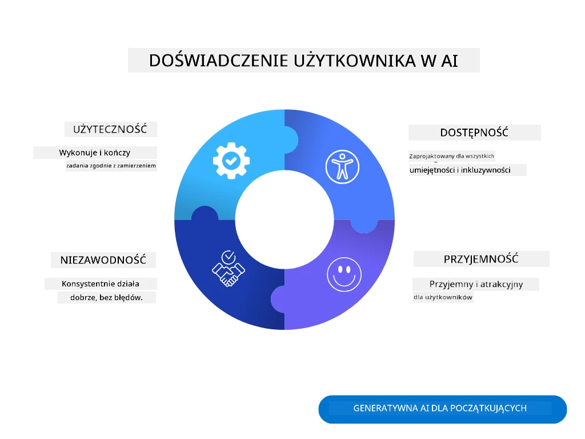
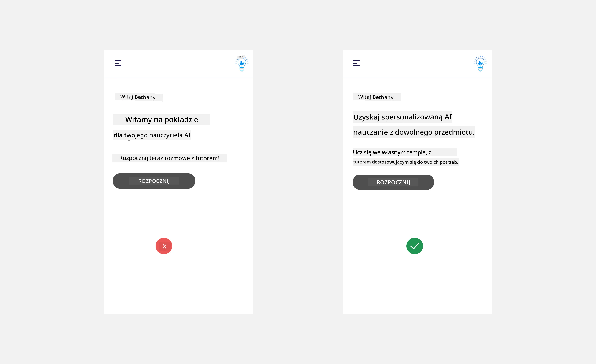
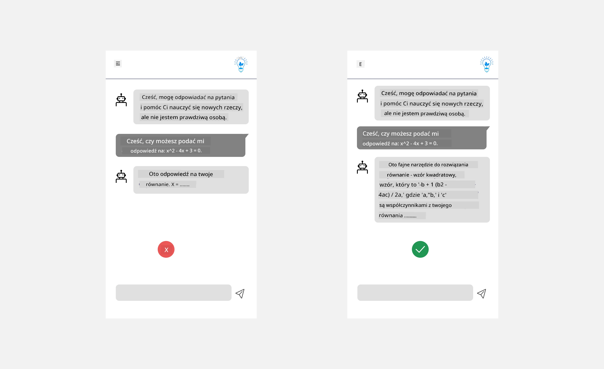
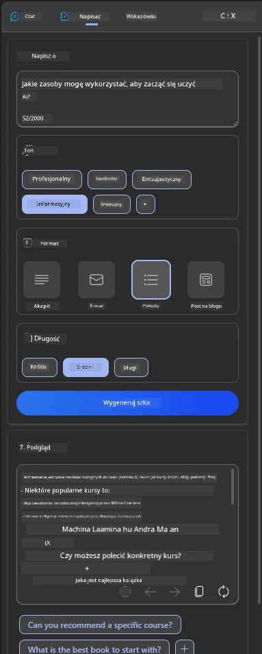
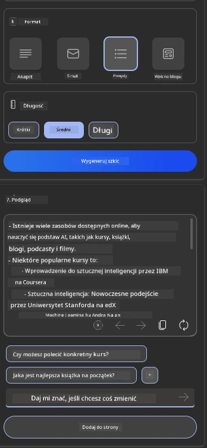

# Projektowanie UX dla aplikacji AI

> _(Kliknij obraz powyżej, aby obejrzeć wideo z tej lekcji)_

Doświadczenie użytkownika jest bardzo ważnym aspektem tworzenia aplikacji. Użytkownicy muszą móc korzystać z twojej aplikacji w efektywny sposób, aby wykonywać zadania. Bycie efektywnym to jedno, ale musisz też projektować aplikacje tak, aby mogły być używane przez każdego, aby były _dostępne_. Ten rozdział skupi się na tym obszarze, abyś mieć nadzieję, zaprojektował aplikację, z której ludzie mogą i chcą korzystać.

## Wprowadzenie

Doświadczenie użytkownika to sposób, w jaki użytkownik wchodzi w interakcję i korzysta z konkretnego produktu lub usługi, czy to systemu, narzędzia czy projektu. Przy tworzeniu aplikacji AI, deweloperzy skupiają się nie tylko na zapewnieniu efektywnego doświadczenia użytkownika, ale także etycznego. W tej lekcji omówimy, jak budować aplikacje Sztucznej Inteligencji (AI), które odpowiadają na potrzeby użytkowników.

Lekcja obejmie następujące obszary:

- Wprowadzenie do Doświadczenia Użytkownika i Zrozumienie Potrzeb Użytkowników
- Projektowanie aplikacji AI z myślą o zaufaniu i przejrzystości
- Projektowanie aplikacji AI dla współpracy i informacji zwrotnej

## Cele nauki

Po ukończeniu tej lekcji będziesz potrafił:

- Zrozumieć, jak budować aplikacje AI, które spełniają potrzeby użytkowników.
- Projektować aplikacje AI, które promują zaufanie i współpracę.

### Wymagania wstępne

Poświęć trochę czasu i przeczytaj więcej o [doświadczeniu użytkownika i design thinking.](https://learn.microsoft.com/training/modules/ux-design?WT.mc_id=academic-105485-koreyst)

## Wprowadzenie do Doświadczenia Użytkownika i Zrozumienie Potrzeb Użytkowników

W naszym fikcyjnym startupie edukacyjnym mamy dwóch głównych użytkowników, nauczycieli i uczniów. Każdy z nich ma unikalne potrzeby. Projektowanie skoncentrowane na użytkowniku stawia na pierwszym miejscu użytkownika, zapewniając, że produkty są istotne i korzystne dla tych, do których są skierowane.

Aplikacja powinna być **użyteczna, niezawodna, dostępna i przyjemna** aby zapewnić dobre doświadczenie użytkownika.

### Użyteczność

Być użytecznym oznacza, że aplikacja ma funkcjonalność odpowiadającą jej zamierzonemu celowi, na przykład automatyzację procesu oceniania lub generowanie fiszek do powtórek. Aplikacja automatyzująca proces oceniania powinna być w stanie dokładnie i efektywnie przypisać oceny do prac uczniów na podstawie określonych kryteriów. Podobnie, aplikacja generująca fiszki powtórkowe powinna umieć tworzyć odpowiednie i różnorodne pytania na podstawie swoich danych.

### Niezawodność

Być niezawodnym oznacza, że aplikacja może konsekwentnie i bez błędów wykonywać swoje zadanie. Jednak AI tak jak ludzie nie jest doskonała i może być podatna na błędy. Aplikacje mogą napotkać błędy lub nieprzewidziane sytuacje, które wymagają interwencji lub korekty przez człowieka. Jak radzisz sobie z błędami? W ostatniej części tej lekcji omówimy, jak systemy i aplikacje AI są projektowane pod kątem współpracy i informacji zwrotnej.

### Dostępność

Być dostępnym oznacza rozszerzyć doświadczenie użytkownika na użytkowników o różnych zdolnościach, w tym osób z niepełnosprawnościami, zapewniając, że nikt nie zostanie pominięty. Przestrzegając wytycznych i zasad dostępności, rozwiązania AI stają się bardziej inkluzywne, użyteczne i korzystne dla wszystkich użytkowników.

### Przyjemność

Być przyjemnym oznacza, że aplikacja jest przyjemna w użyciu. Atrakcyjne doświadczenie użytkownika może pozytywnie wpłynąć na użytkownika, zachęcając go do powrotu do aplikacji i zwiększając przychody firmy.

Nie każde wyzwanie można rozwiązać za pomocą AI. AI pomaga wzbogacić twoje doświadczenie użytkownika, czy to automatyzując zadania ręczne, czy personalizując doświadczenia użytkowników.

## Projektowanie aplikacji AI z myślą o zaufaniu i przejrzystości

Budowanie zaufania jest kluczowe przy projektowaniu aplikacji AI. Zaufanie zapewnia użytkownikowi pewność, że aplikacja wykona zadanie, dostarczy wyniki konsekwentnie, a wyniki spełnią potrzeby użytkownika. Ryzykiem w tym obszarze jest brak zaufania i nadmierne zaufanie. Brak zaufania występuje, gdy użytkownik ma niewielkie lub żadne zaufanie do systemu AI, co prowadzi do odrzucenia aplikacji przez użytkownika. Nadmierne zaufanie występuje, gdy użytkownik przecenia możliwości systemu AI, co prowadzi do zbyt dużego zaufań systemowi AI. Na przykład zautomatyzowany system oceniania w przypadku nadmiernego zaufania może prowadzić do tego, że nauczyciel nie sprawdzi niektórych prac, aby upewnić się, że system oceniania działa prawidłowo. Może to skutkować niesprawiedliwymi lub niedokładnymi ocenami dla uczniów lub utraconymi możliwościami informacji zwrotnej i poprawy.

Dwa sposoby, aby zapewnić, że zaufanie jest na pierwszym miejscu projektowania, to wyjaśnialność i kontrola.

### Wyjaśnialność

Gdy AI pomaga w podejmowaniu decyzji, takich jak przekazywanie wiedzy przyszłym pokoleniom, kluczowe jest, aby nauczyciele i rodzice rozumieli, jak podejmowane są decyzje AI. To jest wyjaśnialność – zrozumienie, jak aplikacje AI podejmują decyzje. Projektowanie dla wyjaśnialności obejmuje dodanie szczegółów podkreślających, jak AI doszło do wyniku. Odbiorcy muszą być świadomi, że wynik jest generowany przez AI, a nie przez człowieka. Na przykład, zamiast mówić "Rozpocznij rozmowę z tutorem teraz", powiedz "Użyj AI tutora, który dostosowuje się do twoich potrzeb i pomaga uczyć się w twoim tempie."

Innym przykładem jest sposób, w jaki AI wykorzystuje dane użytkownika i dane osobowe. Na przykład użytkownik z personą ucznia może mieć ograniczenia na podstawie swojej persony. AI może nie móc ujawnić odpowiedzi na pytania, ale może pomóc użytkownikowi pomyśleć, jak rozwiązać problem.

Ostatnim kluczowym elementem wyjaśnialności jest uproszczenie wyjaśnień. Uczniowie i nauczyciele mogą nie być ekspertami AI, dlatego wyjaśnienia, co aplikacja może lub nie może zrobić, powinny być uproszczone i łatwe do zrozumienia.

### Kontrola

Generatywne AI tworzy współpracę między AI a użytkownikiem, gdzie na przykład użytkownik może modyfikować zapytania, aby uzyskać różne wyniki. Dodatkowo po wygenerowaniu wyniku użytkownicy powinni mieć możliwość modyfikacji wyników, dając im poczucie kontroli. Na przykład, korzystając z Microsoft Copilot (dawniej Bing Chat), możesz dostosować swoje zapytanie według formatu, tonu i długości. Dodatkowo możesz wprowadzać zmiany i modyfikować wynik, jak pokazano poniżej:

Kolejną funkcją w Microsoft Copilot, która pozwala użytkownikowi mieć kontrolę nad aplikacją, jest możliwość włączenia i wyłączenia użycia danych przez AI. W aplikacji szkolnej uczeń może chcieć korzystać zarówno ze swoich notatek, jak i materiałów nauczyciela jako materiału do powtórek.

> Projektując aplikacje AI, kluczowa jest intencjonalność, aby upewnić się, że użytkownicy nie zaufają nadmiernie, stawiając nierealistyczne oczekiwania co do możliwości systemu. Jednym ze sposobów jest tworzenie tarcia między zapytaniami a wynikami. Przypominanie użytkownikowi, że to AI, a nie inny człowiek.

## Projektowanie aplikacji AI dla współpracy i informacji zwrotnej

Jak wspomniano wcześniej, generatywne AI tworzy współpracę między użytkownikiem a AI. Większość interakcji polega na tym, że użytkownik wprowadza zapytanie, a AI generuje wynik. Co jeśli wynik jest błędny? Jak aplikacja radzi sobie z błędami, jeśli się pojawią? Czy AI obwinia użytkownika, czy poświęca czas na wyjaśnienie błędu?

Aplikacje AI powinny być zaprojektowane tak, aby odbierać i udzielać informacji zwrotnej. To nie tylko pomaga systemowi AI się ulepszać, ale także buduje zaufanie użytkowników. Pętla informacji zwrotnej powinna być uwzględniona w projekcie, przykładem może być proste wskazanie kciuka w górę lub w dół pod wynikiem.

Innym sposobem radzenia sobie z tym jest jasne komunikowanie możliwości i ograniczeń systemu. Gdy użytkownik popełni błąd, prosząc o coś wykraczającego poza możliwości AI, powinien istnieć sposób, aby to obsłużyć, jak pokazano poniżej.

Błędy systemu są powszechne w aplikacjach, gdzie użytkownik może potrzebować pomocy z informacjami spoza zakresu AI lub aplikacja może mieć limit, ile pytań/tematów użytkownik może generować podsumowania. Na przykład, aplikacja AI trenowana na danych z ograniczonych tematów, na przykład historii i matematyki, może nie poradzić sobie z pytaniami z geografii. Aby temu zapobiec, system AI może odpowiedzieć: "Przepraszamy, nasz produkt został wytrenowany na danych z następujących przedmiotów....., nie jestem w stanie odpowiedzieć na zadane pytanie."

Aplikacje AI nie są doskonałe, dlatego na pewno popełnią błędy. Projektując swoje aplikacje, powinieneś zapewnić miejsce na informacje zwrotne od użytkowników oraz obsługę błędów w sposób prosty i łatwy do wyjaśnienia.

## Zadanie

Weź dowolne aplikacje AI, które do tej pory stworzyłeś, rozważ wdrożenie poniższych kroków w swojej aplikacji:

- **Przyjemność:** Zastanów się, jak możesz uczynić swoją aplikację bardziej przyjemną. Czy dodajesz wszędzie wyjaśnienia? Czy zachęcasz użytkownika do eksploracji? Jak formułujesz komunikaty o błędach?

- **Użyteczność:** Budujesz aplikację webową. Upewnij się, że twoja aplikacja jest nawigowalna zarówno myszą, jak i klawiaturą.

- **Zaufanie i przejrzystość:** Nie ufaj AI i jego wynikom całkowicie, rozważ, jak dodać człowieka do procesu w celu weryfikacji wyników. Rozważ także i wdrażaj inne sposoby osiągnięcia zaufania i przejrzystości.

- **Kontrola:** Daj użytkownikowi kontrolę nad danymi, które udostępnia aplikacji. Wdróż sposób, aby użytkownik mógł wyrazić zgodę lub ją cofnąć na zbieranie danych w aplikacji AI.

<!-- ## [Post-lecture quiz](../../../12-designing-ux-for-ai-applications/quiz-url) -->

## Kontynuuj swoją naukę!

Po ukończeniu tej lekcji sprawdź naszą [kolekcję nauki Generatywnego AI](https://aka.ms/genai-collection?WT.mc_id=academic-105485-koreyst), aby kontynuować rozwijanie swojej wiedzy o Generatywnym AI!

Przejdź do Lekcji 13, gdzie omówimy, jak [zabezpieczać aplikacje AI](../13-securing-ai-applications/README.md?WT.mc_id=academic-105485-koreyst)!

---

<!-- CO-OP TRANSLATOR DISCLAIMER START -->
**Zastrzeżenie**:
Niniejszy dokument został przetłumaczony za pomocą usługi tłumaczenia AI [Co-op Translator](https://github.com/Azure/co-op-translator). Choć dążymy do dokładności, prosimy pamiętać, że automatyczne tłumaczenia mogą zawierać błędy lub niedokładności. Oryginalny dokument w jego języku źródłowym należy uznawać za autorytatywne źródło. W przypadku informacji krytycznych zalecane jest skorzystanie z profesjonalnego tłumaczenia wykonanego przez człowieka. Nie ponosimy odpowiedzialności za jakiekolwiek nieporozumienia lub błędne interpretacje wynikające z użycia tego tłumaczenia.
<!-- CO-OP TRANSLATOR DISCLAIMER END -->