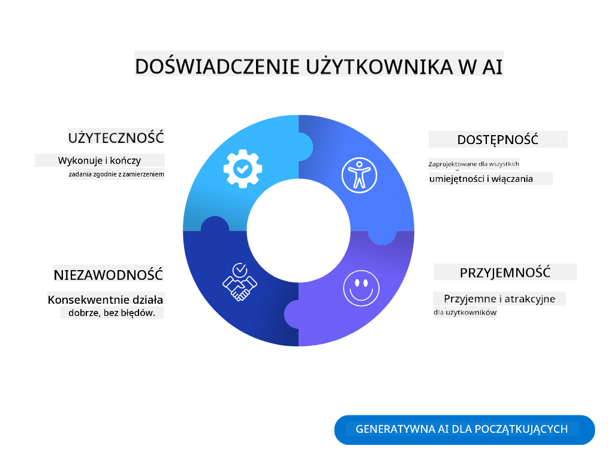
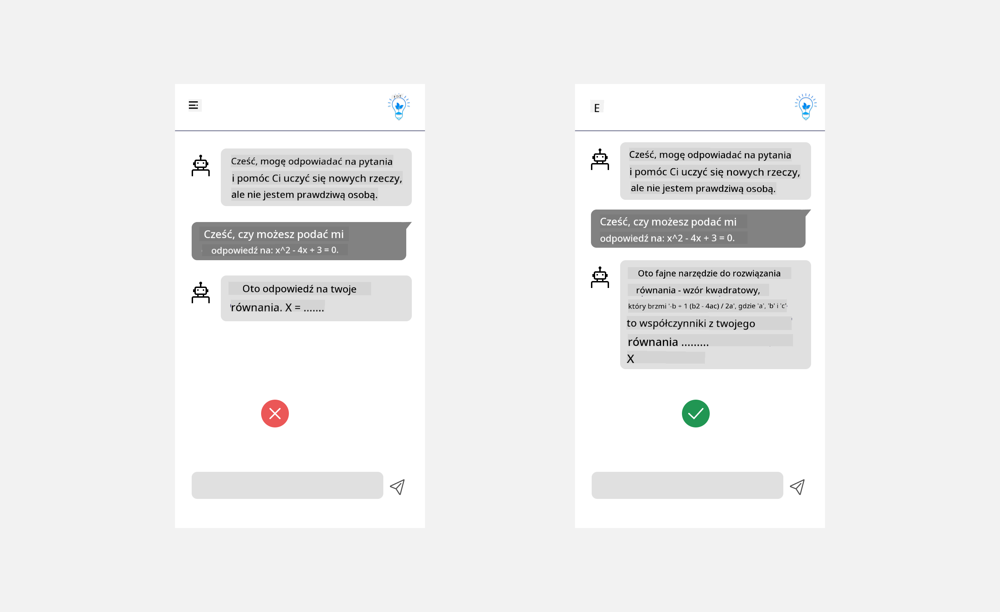
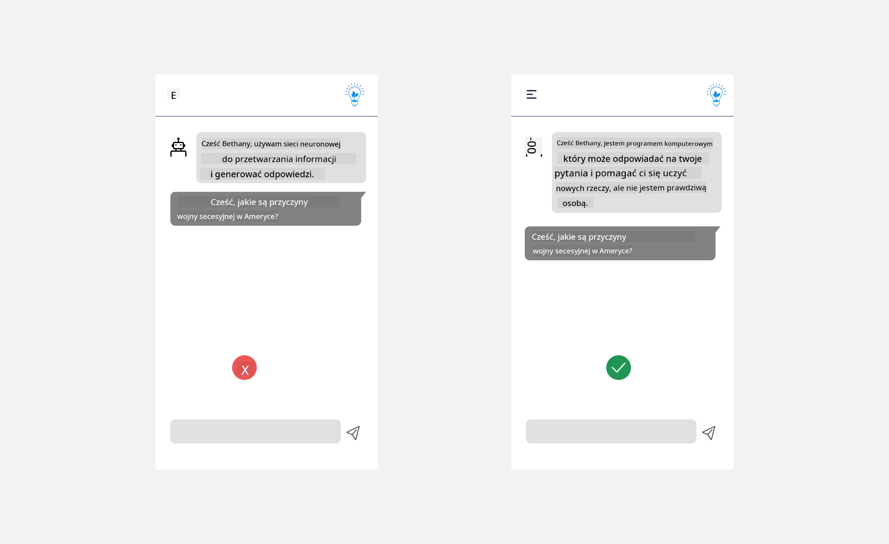

<!--
CO_OP_TRANSLATOR_METADATA:
{
  "original_hash": "747668e4c53d067369f06e9ec2e6313e",
  "translation_date": "2025-08-26T16:46:17+00:00",
  "source_file": "12-designing-ux-for-ai-applications/README.md",
  "language_code": "pl"
}
-->
# Projektowanie UX dla aplikacji AI

> _(Kliknij w powyższy obrazek, aby obejrzeć wideo z tej lekcji)_

Doświadczenie użytkownika to bardzo ważny aspekt budowania aplikacji. Użytkownicy muszą być w stanie korzystać z Twojej aplikacji w efektywny sposób, aby wykonywać zadania. Efektywność to jedno, ale musisz też projektować aplikacje tak, by mogły z nich korzystać wszyscy, czyli by były _dostępne_. Ten rozdział skupia się na tym obszarze, abyś zaprojektował aplikację, z której ludzie będą mogli i chcieli korzystać.

## Wprowadzenie

Doświadczenie użytkownika to sposób, w jaki użytkownik wchodzi w interakcję i korzysta z danego produktu lub usługi, niezależnie czy to system, narzędzie czy projekt. Tworząc aplikacje AI, deweloperzy skupiają się nie tylko na tym, by doświadczenie użytkownika było skuteczne, ale także etyczne. W tej lekcji omawiamy, jak budować aplikacje Sztucznej Inteligencji (AI), które odpowiadają na potrzeby użytkowników.

Lekcja obejmuje następujące zagadnienia:

- Wprowadzenie do doświadczenia użytkownika i zrozumienia potrzeb użytkowników
- Projektowanie aplikacji AI z myślą o zaufaniu i przejrzystości
- Projektowanie aplikacji AI z myślą o współpracy i informacji zwrotnej

## Cele nauki

Po tej lekcji będziesz w stanie:

- Zrozumieć, jak budować aplikacje AI odpowiadające na potrzeby użytkowników.
- Projektować aplikacje AI, które budują zaufanie i wspierają współpracę.

### Wymagania wstępne

Poświęć chwilę i przeczytaj więcej o [doświadczeniu użytkownika i design thinking.](https://learn.microsoft.com/training/modules/ux-design?WT.mc_id=academic-105485-koreyst)

## Wprowadzenie do doświadczenia użytkownika i zrozumienia potrzeb użytkowników

W naszej fikcyjnej edukacyjnej firmie startupowej mamy dwóch głównych użytkowników: nauczycieli i uczniów. Każdy z nich ma inne potrzeby. Projektowanie zorientowane na użytkownika stawia użytkownika na pierwszym miejscu, zapewniając, że produkty są dla niego odpowiednie i użyteczne.

Aplikacja powinna być **użyteczna, niezawodna, dostępna i przyjemna**, aby zapewnić dobre doświadczenie użytkownika.

### Użyteczność

Bycie użytecznym oznacza, że aplikacja posiada funkcje odpowiadające jej przeznaczeniu, na przykład automatyzację oceniania czy generowanie fiszek do powtórek. Aplikacja automatyzująca ocenianie powinna potrafić dokładnie i sprawnie przydzielać oceny na podstawie ustalonych kryteriów. Podobnie, aplikacja generująca fiszki powinna tworzyć trafne i różnorodne pytania na podstawie posiadanych danych.

### Niezawodność

Bycie niezawodnym oznacza, że aplikacja wykonuje swoje zadania konsekwentnie i bez błędów. Jednak AI, podobnie jak ludzie, nie jest doskonała i może popełniać błędy. Aplikacje mogą napotkać błędy lub nieoczekiwane sytuacje, które wymagają interwencji lub korekty człowieka. Jak radzić sobie z błędami? W ostatniej części tej lekcji omówimy, jak projektować systemy i aplikacje AI z myślą o współpracy i informacji zwrotnej.

### Dostępność

Bycie dostępnym oznacza rozszerzenie doświadczenia użytkownika na osoby o różnych możliwościach, w tym osoby z niepełnosprawnościami, tak by nikt nie został pominięty. Przestrzegając zasad i wytycznych dostępności, rozwiązania AI stają się bardziej inkluzywne, użyteczne i korzystne dla wszystkich użytkowników.

### Przyjemność

Bycie przyjemnym oznacza, że korzystanie z aplikacji sprawia radość. Atrakcyjne doświadczenie użytkownika może pozytywnie wpłynąć na użytkownika, zachęcając go do powrotu do aplikacji i zwiększając przychody firmy.

Nie każdy problem da się rozwiązać za pomocą AI. AI ma za zadanie wzbogacić doświadczenie użytkownika, na przykład automatyzując ręczne zadania lub personalizując doświadczenia użytkowników.

## Projektowanie aplikacji AI z myślą o zaufaniu i przejrzystości

Budowanie zaufania jest kluczowe przy projektowaniu aplikacji AI. Zaufanie sprawia, że użytkownik wierzy, iż aplikacja wykona zadanie, dostarczy wyniki konsekwentnie i będą one zgodne z jego potrzebami. Ryzykiem w tym obszarze jest brak zaufania lub nadmierne zaufanie. Brak zaufania pojawia się, gdy użytkownik nie ufa systemowi AI, co prowadzi do odrzucenia aplikacji. Nadmierne zaufanie pojawia się, gdy użytkownik przecenia możliwości systemu AI, przez co ufa mu zbyt mocno. Na przykład, w przypadku automatycznego systemu oceniania, nadmierne zaufanie może sprawić, że nauczyciel nie sprawdzi części prac, by upewnić się, że system działa poprawnie. Może to skutkować niesprawiedliwymi lub nieprawidłowymi ocenami dla uczniów albo utratą okazji do udzielenia informacji zwrotnej i poprawy.

Dwa sposoby, by umieścić zaufanie w centrum projektu, to wyjaśnialność i kontrola.

### Wyjaśnialność

Gdy AI pomaga podejmować decyzje, na przykład przekazywać wiedzę przyszłym pokoleniom, ważne jest, by nauczyciele i rodzice rozumieli, jak podejmowane są decyzje przez AI. To właśnie wyjaśnialność – zrozumienie, jak aplikacje AI podejmują decyzje. Projektowanie z myślą o wyjaśnialności polega na dodaniu szczegółów pokazujących, jak AI doszła do danego wyniku. Odbiorca musi wiedzieć, że wynik został wygenerowany przez AI, a nie człowieka. Na przykład, zamiast pisać "Rozpocznij czat z korepetytorem", napisz "Skorzystaj z korepetytora AI, który dostosowuje się do Twoich potrzeb i pomaga Ci uczyć się we własnym tempie".

Inny przykład to sposób, w jaki AI wykorzystuje dane użytkownika i dane osobowe. Na przykład użytkownik o roli ucznia może mieć ograniczenia wynikające z tej roli. AI może nie ujawniać odpowiedzi na pytania, ale może pomóc użytkownikowi zastanowić się, jak rozwiązać problem.

Ostatnim ważnym elementem wyjaśnialności jest uproszczenie wyjaśnień. Uczniowie i nauczyciele mogą nie być ekspertami od AI, dlatego wyjaśnienia dotyczące tego, co aplikacja może lub nie może zrobić, powinny być proste i łatwe do zrozumienia.

### Kontrola

Generatywna AI tworzy współpracę między AI a użytkownikiem, gdzie na przykład użytkownik może modyfikować polecenia, by uzyskać różne wyniki. Dodatkowo, po wygenerowaniu wyniku, użytkownicy powinni mieć możliwość jego modyfikacji, co daje im poczucie kontroli. Na przykład, korzystając z Binga, możesz dostosować swoje polecenie pod względem formatu, tonu i długości. Możesz też wprowadzać zmiany do wyniku i modyfikować go, jak pokazano poniżej:

Kolejną funkcją w Bingu, która daje użytkownikowi kontrolę nad aplikacją, jest możliwość włączenia lub wyłączenia wykorzystywania danych przez AI. W aplikacji szkolnej uczeń może chcieć korzystać zarówno ze swoich notatek, jak i materiałów nauczyciela jako materiałów do powtórek.

> Projektując aplikacje AI, kluczowa jest intencjonalność, by użytkownicy nie ufali AI bezkrytycznie i nie mieli nierealistycznych oczekiwań wobec jej możliwości. Jednym ze sposobów jest wprowadzenie pewnych "tarć" między poleceniami a wynikami. Przypominaj użytkownikowi, że to AI, a nie inny człowiek.

## Projektowanie aplikacji AI z myślą o współpracy i informacji zwrotnej

Jak już wspomniano, generatywna AI tworzy współpracę między użytkownikiem a AI. Najczęściej polega to na tym, że użytkownik wpisuje polecenie, a AI generuje odpowiedź. Co jeśli wynik jest nieprawidłowy? Jak aplikacja radzi sobie z błędami, jeśli się pojawią? Czy AI obwinia użytkownika, czy poświęca czas na wyjaśnienie błędu?

Aplikacje AI powinny być zaprojektowane tak, by mogły przyjmować i udzielać informacji zwrotnej. To nie tylko pomaga systemowi AI się rozwijać, ale także buduje zaufanie użytkowników. W projekcie powinna znaleźć się pętla informacji zwrotnej, na przykład proste kciuki w górę lub w dół przy wyniku.

Innym sposobem radzenia sobie z tym jest jasne komunikowanie możliwości i ograniczeń systemu. Gdy użytkownik popełni błąd, prosząc o coś, co wykracza poza możliwości AI, powinna być możliwość odpowiedniego zareagowania, jak pokazano poniżej.

Błędy systemowe są częste w aplikacjach, gdzie użytkownik może potrzebować informacji wykraczających poza zakres AI lub aplikacja może mieć limit liczby pytań/przedmiotów, dla których można wygenerować podsumowania. Na przykład aplikacja AI przeszkolona na danych z ograniczonej liczby przedmiotów, np. historii i matematyki, może nie być w stanie odpowiedzieć na pytania z geografii. Aby temu zaradzić, system AI może odpowiedzieć: "Przepraszam, nasz produkt został przeszkolony na danych z następujących przedmiotów....., nie mogę odpowiedzieć na zadane przez Ciebie pytanie."

Aplikacje AI nie są doskonałe, więc będą popełniać błędy. Projektując swoje aplikacje, zadbaj o możliwość zbierania informacji zwrotnej od użytkowników i obsługę błędów w sposób prosty i łatwy do wyjaśnienia.

## Zadanie

Wybierz dowolną aplikację AI, którą do tej pory stworzyłeś, i rozważ wdrożenie poniższych kroków:

- **Przyjemność:** Zastanów się, jak możesz uczynić swoją aplikację bardziej przyjemną. Czy wszędzie dodajesz wyjaśnienia? Czy zachęcasz użytkownika do eksploracji? Jak formułujesz komunikaty o błędach?

- **Użyteczność:** Tworzysz aplikację webową. Upewnij się, że można ją obsługiwać zarówno myszką, jak i klawiaturą.

- **Zaufanie i przejrzystość:** Nie ufaj AI i jej wynikom bezkrytycznie, zastanów się, jak dodać do procesu człowieka, by weryfikował wyniki. Rozważ i wdroż także inne sposoby budowania zaufania i przejrzystości.

- **Kontrola:** Daj użytkownikowi kontrolę nad danymi, które przekazuje aplikacji. Wprowadź możliwość włączenia i wyłączenia zbierania danych w aplikacji AI.

## Kontynuuj naukę!

Po ukończeniu tej lekcji sprawdź naszą [kolekcję nauki o generatywnej AI](https://aka.ms/genai-collection?WT.mc_id=academic-105485-koreyst), aby dalej rozwijać swoją wiedzę o generatywnej AI!

Przejdź do lekcji 13, gdzie dowiesz się, jak [zabezpieczać aplikacje AI](../13-securing-ai-applications/README.md?WT.mc_id=academic-105485-koreyst)!

---

**Zastrzeżenie**:  
Ten dokument został przetłumaczony przy użyciu usługi tłumaczenia AI [Co-op Translator](https://github.com/Azure/co-op-translator). Dokładamy wszelkich starań, aby tłumaczenie było poprawne, jednak należy pamiętać, że automatyczne tłumaczenia mogą zawierać błędy lub nieścisłości. Za źródło autorytatywne należy uznać oryginalny dokument w jego języku ojczystym. W przypadku informacji krytycznych zalecane jest skorzystanie z profesjonalnych usług tłumaczenia przez człowieka. Nie ponosimy odpowiedzialności za wszelkie nieporozumienia lub błędne interpretacje wynikające z użycia tego tłumaczenia.