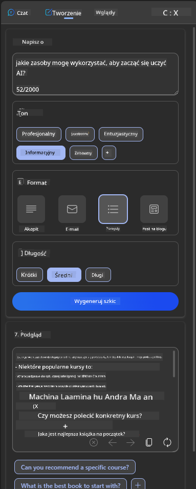

<!--
CO_OP_TRANSLATOR_METADATA:
{
  "original_hash": "78bbeed50fd4dc9fdee931f5daf98cb3",
  "translation_date": "2025-10-18T00:50:45+00:00",
  "source_file": "12-designing-ux-for-ai-applications/README.md",
  "language_code": "pl"
}
-->
# Projektowanie UX dla aplikacji AI

> _(Kliknij obrazek powyżej, aby obejrzeć wideo z tej lekcji)_

Doświadczenie użytkownika jest bardzo ważnym aspektem budowania aplikacji. Użytkownicy muszą być w stanie korzystać z Twojej aplikacji w efektywny sposób, aby wykonywać zadania. Efektywność to jedno, ale równie ważne jest projektowanie aplikacji tak, aby mogły być używane przez wszystkich, czyniąc je _dostępnymi_. Ten rozdział skupi się na tym obszarze, abyś mógł zaprojektować aplikację, którą ludzie będą mogli i chcieli używać.

## Wprowadzenie

Doświadczenie użytkownika to sposób, w jaki użytkownik wchodzi w interakcję i korzysta z konkretnego produktu lub usługi, czy to systemu, narzędzia, czy projektu. Podczas tworzenia aplikacji AI, deweloperzy nie tylko skupiają się na zapewnieniu efektywnego doświadczenia użytkownika, ale także na jego etycznym aspekcie. W tej lekcji omówimy, jak budować aplikacje sztucznej inteligencji (AI), które odpowiadają na potrzeby użytkowników.

Lekcja obejmie następujące obszary:

- Wprowadzenie do doświadczenia użytkownika i zrozumienia potrzeb użytkowników
- Projektowanie aplikacji AI z uwzględnieniem zaufania i przejrzystości
- Projektowanie aplikacji AI dla współpracy i informacji zwrotnej

## Cele nauki

Po ukończeniu tej lekcji będziesz w stanie:

- Zrozumieć, jak budować aplikacje AI, które odpowiadają na potrzeby użytkowników.
- Projektować aplikacje AI, które promują zaufanie i współpracę.

### Wymagania wstępne

Poświęć trochę czasu na przeczytanie więcej o [doświadczeniu użytkownika i myśleniu projektowym.](https://learn.microsoft.com/training/modules/ux-design?WT.mc_id=academic-105485-koreyst)

## Wprowadzenie do doświadczenia użytkownika i zrozumienia potrzeb użytkowników

W naszej fikcyjnej edukacyjnej firmie startupowej mamy dwóch głównych użytkowników: nauczycieli i uczniów. Każdy z tych użytkowników ma unikalne potrzeby. Projektowanie skoncentrowane na użytkowniku priorytetowo traktuje użytkownika, zapewniając, że produkty są odpowiednie i korzystne dla osób, dla których są przeznaczone.

Aplikacja powinna być **użyteczna, niezawodna, dostępna i przyjemna**, aby zapewnić dobre doświadczenie użytkownika.

### Użyteczność

Bycie użytecznym oznacza, że aplikacja ma funkcjonalność odpowiadającą jej zamierzonemu celowi, na przykład automatyzację procesu oceniania lub generowanie fiszek do powtórek. Aplikacja, która automatyzuje proces oceniania, powinna być w stanie dokładnie i efektywnie przydzielać oceny pracom uczniów na podstawie zdefiniowanych kryteriów. Podobnie, aplikacja generująca fiszki powtórkowe powinna być w stanie tworzyć odpowiednie i różnorodne pytania na podstawie swoich danych.

### Niezawodność

Bycie niezawodnym oznacza, że aplikacja może wykonywać swoje zadania konsekwentnie i bez błędów. Jednak AI, podobnie jak ludzie, nie jest doskonała i może być podatna na błędy. Aplikacje mogą napotkać błędy lub nieoczekiwane sytuacje, które wymagają interwencji lub korekty człowieka. Jak radzić sobie z błędami? W ostatniej części tej lekcji omówimy, jak systemy i aplikacje AI są projektowane z myślą o współpracy i informacji zwrotnej.

### Dostępność

Bycie dostępnym oznacza rozszerzenie doświadczenia użytkownika na osoby o różnych zdolnościach, w tym osoby z niepełnosprawnościami, aby nikt nie został pominięty. Przestrzegając wytycznych i zasad dostępności, rozwiązania AI stają się bardziej inkluzywne, użyteczne i korzystne dla wszystkich użytkowników.

### Przyjemność

Bycie przyjemnym oznacza, że korzystanie z aplikacji sprawia radość. Atrakcyjne doświadczenie użytkownika może mieć pozytywny wpływ na użytkownika, zachęcając go do powrotu do aplikacji i zwiększając przychody firmy.

Nie każde wyzwanie można rozwiązać za pomocą AI. AI wspiera doświadczenie użytkownika, czy to poprzez automatyzację ręcznych zadań, czy personalizację doświadczeń użytkownika.

## Projektowanie aplikacji AI z uwzględnieniem zaufania i przejrzystości

Budowanie zaufania jest kluczowe podczas projektowania aplikacji AI. Zaufanie zapewnia użytkownikowi pewność, że aplikacja wykona zadanie, dostarczy wyniki konsekwentnie i będą one zgodne z potrzebami użytkownika. Ryzykiem w tym obszarze jest brak zaufania lub nadmierne zaufanie. Brak zaufania występuje, gdy użytkownik ma mało lub w ogóle nie ufa systemowi AI, co prowadzi do odrzucenia aplikacji. Nadmierne zaufanie występuje, gdy użytkownik przecenia możliwości systemu AI, co prowadzi do zbyt dużego zaufania do systemu AI. Na przykład, w przypadku nadmiernego zaufania do zautomatyzowanego systemu oceniania, nauczyciel może nie sprawdzić niektórych prac, aby upewnić się, że system oceniania działa poprawnie. Może to skutkować niesprawiedliwymi lub niedokładnymi ocenami dla uczniów lub utratą możliwości udzielenia informacji zwrotnej i poprawy.

Dwa sposoby na zapewnienie, że zaufanie jest w centrum projektowania, to wyjaśnialność i kontrola.

### Wyjaśnialność

Kiedy AI pomaga w podejmowaniu decyzji, takich jak przekazywanie wiedzy przyszłym pokoleniom, kluczowe jest, aby nauczyciele i rodzice rozumieli, jak podejmowane są decyzje przez AI. To właśnie jest wyjaśnialność - zrozumienie, jak aplikacje AI podejmują decyzje. Projektowanie z myślą o wyjaśnialności obejmuje dodawanie szczegółów, które podkreślają, jak AI doszło do danego wyniku. Odbiorcy muszą być świadomi, że wynik został wygenerowany przez AI, a nie przez człowieka. Na przykład, zamiast mówić "Rozpocznij rozmowę ze swoim nauczycielem teraz", można powiedzieć "Skorzystaj z nauczyciela AI, który dostosowuje się do Twoich potrzeb i pomaga Ci uczyć się w Twoim tempie."

Innym przykładem jest sposób, w jaki AI wykorzystuje dane użytkownika i dane osobowe. Na przykład użytkownik z rolą ucznia może mieć ograniczenia wynikające z jego roli. AI może nie być w stanie ujawnić odpowiedzi na pytania, ale może pomóc użytkownikowi w przemyśleniu, jak rozwiązać problem.

Ostatnim kluczowym elementem wyjaśnialności jest uproszczenie wyjaśnień. Uczniowie i nauczyciele mogą nie być ekspertami w dziedzinie AI, dlatego wyjaśnienia dotyczące tego, co aplikacja może lub nie może zrobić, powinny być uproszczone i łatwe do zrozumienia.

### Kontrola

Generatywna AI tworzy współpracę między AI a użytkownikiem, gdzie na przykład użytkownik może modyfikować polecenia, aby uzyskać różne wyniki. Dodatkowo, po wygenerowaniu wyniku, użytkownicy powinni mieć możliwość jego modyfikacji, co daje im poczucie kontroli. Na przykład, korzystając z Bing, możesz dostosować swoje polecenie na podstawie formatu, tonu i długości. Dodatkowo możesz wprowadzać zmiany w wyniku i modyfikować go, jak pokazano poniżej:

Inną funkcją w Bing, która pozwala użytkownikowi kontrolować aplikację, jest możliwość włączenia i wyłączenia danych, które AI wykorzystuje. W przypadku aplikacji szkolnej uczeń może chcieć korzystać zarówno ze swoich notatek, jak i zasobów nauczyciela jako materiałów do powtórek.

> Podczas projektowania aplikacji AI kluczowe jest celowe działanie, aby użytkownicy nie nadmiernie ufali, stawiając nierealistyczne oczekiwania wobec jej możliwości. Jednym ze sposobów na to jest tworzenie pewnego rodzaju "tarcia" między poleceniami a wynikami. Przypominanie użytkownikowi, że to jest AI, a nie inny człowiek.

## Projektowanie aplikacji AI dla współpracy i informacji zwrotnej

Jak wspomniano wcześniej, generatywna AI tworzy współpracę między użytkownikiem a AI. Większość interakcji polega na tym, że użytkownik wprowadza polecenie, a AI generuje wynik. Co jednak, jeśli wynik jest niepoprawny? Jak aplikacja radzi sobie z błędami, jeśli się pojawią? Czy AI obwinia użytkownika, czy poświęca czas na wyjaśnienie błędu?

Aplikacje AI powinny być zaprojektowane tak, aby mogły przyjmować i udzielać informacji zwrotnej. To nie tylko pomaga systemowi AI się rozwijać, ale także buduje zaufanie użytkowników. W projektowaniu powinna być uwzględniona pętla informacji zwrotnej, na przykład prosty kciuk w górę lub w dół przy wyniku.

Innym sposobem radzenia sobie z tym jest jasne komunikowanie możliwości i ograniczeń systemu. Gdy użytkownik popełni błąd, prosząc o coś, co wykracza poza możliwości AI, powinien istnieć sposób na rozwiązanie tego problemu, jak pokazano poniżej.

Błędy systemowe są częste w aplikacjach, gdzie użytkownik może potrzebować pomocy w uzyskaniu informacji wykraczających poza zakres AI lub aplikacja może mieć ograniczenia dotyczące liczby pytań/tematów, które użytkownik może generować. Na przykład aplikacja AI przeszkolona na danych z ograniczonej liczby przedmiotów, na przykład historii i matematyki, może nie być w stanie odpowiedzieć na pytania dotyczące geografii. Aby temu zaradzić, system AI może odpowiedzieć: "Przepraszam, nasz produkt został przeszkolony na danych z następujących przedmiotów....., nie mogę odpowiedzieć na pytanie, które zadałeś."

Aplikacje AI nie są doskonałe, dlatego są podatne na błędy. Podczas projektowania swoich aplikacji powinieneś upewnić się, że tworzysz przestrzeń na informacje zwrotne od użytkowników oraz na obsługę błędów w sposób prosty i łatwy do zrozumienia.

## Zadanie

Weź dowolną aplikację AI, którą do tej pory stworzyłeś, i rozważ wdrożenie poniższych kroków w swojej aplikacji:

- **Przyjemność:** Zastanów się, jak możesz uczynić swoją aplikację bardziej przyjemną. Czy dodajesz wyjaśnienia wszędzie? Czy zachęcasz użytkownika do eksploracji? Jak formułujesz swoje komunikaty o błędach?

- **Użyteczność:** Tworząc aplikację internetową, upewnij się, że jest ona nawigowalna zarówno za pomocą myszy, jak i klawiatury.

- **Zaufanie i przejrzystość:** Nie ufaj AI całkowicie i jej wynikom, zastanów się, jak możesz dodać człowieka do procesu weryfikacji wyników. Rozważ i wdroż inne sposoby budowania zaufania i przejrzystości.

- **Kontrola:** Daj użytkownikowi kontrolę nad danymi, które dostarcza aplikacji. Wprowadź sposób, w jaki użytkownik może włączyć lub wyłączyć zbieranie danych w aplikacji AI.

<!-- ## [Quiz po wykładzie](../../../12-designing-ux-for-ai-applications/quiz-url) -->

## Kontynuuj naukę!

Po ukończeniu tej lekcji, sprawdź naszą [kolekcję nauki o generatywnej AI](https://aka.ms/genai-collection?WT.mc_id=academic-105485-koreyst), aby dalej rozwijać swoją wiedzę na temat generatywnej AI!

Przejdź do Lekcji 13, gdzie przyjrzymy się [zabezpieczaniu aplikacji AI](../13-securing-ai-applications/README.md?WT.mc_id=academic-105485-koreyst)!

---

**Zastrzeżenie**:  
Ten dokument został przetłumaczony za pomocą usługi tłumaczenia AI [Co-op Translator](https://github.com/Azure/co-op-translator). Chociaż staramy się zapewnić dokładność, prosimy pamiętać, że automatyczne tłumaczenia mogą zawierać błędy lub nieścisłości. Oryginalny dokument w jego rodzimym języku powinien być uznawany za autorytatywne źródło. W przypadku informacji krytycznych zaleca się skorzystanie z profesjonalnego tłumaczenia przez człowieka. Nie ponosimy odpowiedzialności za jakiekolwiek nieporozumienia lub błędne interpretacje wynikające z użycia tego tłumaczenia.