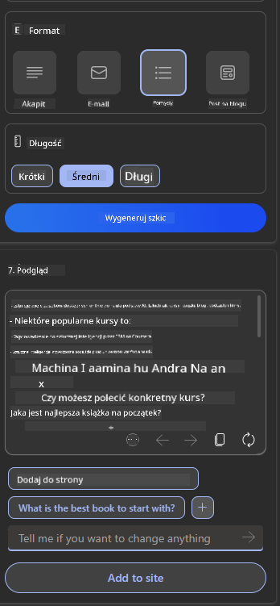

<!--
CO_OP_TRANSLATOR_METADATA:
{
  "original_hash": "ec385b41ee50579025d50cc03bfb3a25",
  "translation_date": "2025-07-09T14:56:43+00:00",
  "source_file": "12-designing-ux-for-ai-applications/README.md",
  "language_code": "pl"
}
-->
# Projektowanie UX dla aplikacji AI

> _(Kliknij powyższy obraz, aby obejrzeć wideo z tej lekcji)_

Doświadczenie użytkownika to bardzo ważny aspekt tworzenia aplikacji. Użytkownicy muszą móc korzystać z Twojej aplikacji w efektywny sposób, aby wykonywać zadania. Efektywność to jedno, ale musisz także projektować aplikacje tak, aby mogły być używane przez każdego, aby były _dostępne_. Ten rozdział skupi się na tym obszarze, abyś mógł zaprojektować aplikację, z której ludzie będą chcieli i mogli korzystać.

## Wprowadzenie

Doświadczenie użytkownika to sposób, w jaki użytkownik wchodzi w interakcję i korzysta z konkretnego produktu lub usługi, czy to systemu, narzędzia, czy projektu. Podczas tworzenia aplikacji AI, deweloperzy skupiają się nie tylko na zapewnieniu skutecznego doświadczenia użytkownika, ale także na jego etyczności. W tej lekcji omówimy, jak budować aplikacje sztucznej inteligencji (AI), które odpowiadają na potrzeby użytkowników.

Lekcja obejmie następujące obszary:

- Wprowadzenie do doświadczenia użytkownika i zrozumienie potrzeb użytkowników
- Projektowanie aplikacji AI z myślą o zaufaniu i przejrzystości
- Projektowanie aplikacji AI z myślą o współpracy i informacji zwrotnej

## Cele nauki

Po ukończeniu tej lekcji będziesz potrafił:

- Zrozumieć, jak tworzyć aplikacje AI spełniające potrzeby użytkowników.
- Projektować aplikacje AI, które promują zaufanie i współpracę.

### Wymagania wstępne

Poświęć trochę czasu i przeczytaj więcej o [doświadczeniu użytkownika i design thinking.](https://learn.microsoft.com/training/modules/ux-design?WT.mc_id=academic-105485-koreyst)

## Wprowadzenie do doświadczenia użytkownika i zrozumienie potrzeb użytkowników

W naszej fikcyjnej edukacyjnej firmie startupowej mamy dwóch głównych użytkowników: nauczycieli i uczniów. Każda z tych grup ma unikalne potrzeby. Projektowanie skoncentrowane na użytkowniku stawia użytkownika na pierwszym miejscu, zapewniając, że produkty są istotne i korzystne dla tych, dla których są przeznaczone.

Aplikacja powinna być **użyteczna, niezawodna, dostępna i przyjemna** aby zapewnić dobre doświadczenie użytkownika.

### Użyteczność

Bycie użytecznym oznacza, że aplikacja ma funkcje odpowiadające jej zamierzonemu celowi, na przykład automatyzację procesu oceniania lub generowanie fiszek do powtórek. Aplikacja automatyzująca ocenianie powinna być w stanie dokładnie i efektywnie przydzielać oceny pracom uczniów na podstawie wcześniej ustalonych kryteriów. Podobnie aplikacja generująca fiszki powtórkowe powinna tworzyć odpowiednie i różnorodne pytania na podstawie swoich danych.

### Niezawodność

Bycie niezawodnym oznacza, że aplikacja może wykonywać swoje zadanie konsekwentnie i bez błędów. Jednak AI, podobnie jak ludzie, nie jest doskonała i może popełniać błędy. Aplikacje mogą napotkać błędy lub nieoczekiwane sytuacje, które wymagają interwencji lub korekty przez człowieka. Jak radzisz sobie z błędami? W ostatniej części tej lekcji omówimy, jak systemy i aplikacje AI są projektowane z myślą o współpracy i informacji zwrotnej.

### Dostępność

Bycie dostępnym oznacza rozszerzenie doświadczenia użytkownika na osoby o różnych zdolnościach, w tym osoby z niepełnosprawnościami, zapewniając, że nikt nie zostanie pominięty. Stosując się do wytycznych i zasad dostępności, rozwiązania AI stają się bardziej inkluzywne, użyteczne i korzystne dla wszystkich użytkowników.

### Przyjemność

Bycie przyjemnym oznacza, że korzystanie z aplikacji sprawia radość. Atrakcyjne doświadczenie użytkownika może mieć pozytywny wpływ na użytkownika, zachęcając go do powrotu do aplikacji i zwiększając przychody firmy.

Nie każdy problem da się rozwiązać za pomocą AI. AI ma na celu wspomaganie doświadczenia użytkownika, czy to poprzez automatyzację ręcznych zadań, czy personalizację doświadczeń użytkownika.

## Projektowanie aplikacji AI z myślą o zaufaniu i przejrzystości

Budowanie zaufania jest kluczowe podczas projektowania aplikacji AI. Zaufanie zapewnia użytkownikowi pewność, że aplikacja wykona zadanie, dostarczy wyniki konsekwentnie, a wyniki będą tym, czego użytkownik potrzebuje. Ryzykiem w tym obszarze jest brak zaufania oraz nadmierne zaufanie. Brak zaufania pojawia się, gdy użytkownik ma małe lub żadne zaufanie do systemu AI, co prowadzi do odrzucenia aplikacji. Nadmierne zaufanie pojawia się, gdy użytkownik przecenia możliwości systemu AI, co prowadzi do zbyt dużego zaufania do systemu. Na przykład w przypadku automatycznego systemu oceniania nadmierne zaufanie może spowodować, że nauczyciel nie sprawdzi niektórych prac, aby upewnić się, że system działa poprawnie. Może to skutkować niesprawiedliwymi lub niedokładnymi ocenami dla uczniów lub utraconymi okazjami do informacji zwrotnej i poprawy.

Dwa sposoby, aby zaufanie było centralnym elementem projektu, to wyjaśnialność i kontrola.

### Wyjaśnialność

Gdy AI pomaga podejmować decyzje, takie jak przekazywanie wiedzy przyszłym pokoleniom, kluczowe jest, aby nauczyciele i rodzice rozumieli, jak podejmowane są decyzje przez AI. To jest wyjaśnialność – zrozumienie, jak aplikacje AI podejmują decyzje. Projektowanie z myślą o wyjaśnialności obejmuje dodawanie szczegółów i przykładów tego, co aplikacja AI potrafi zrobić. Na przykład zamiast "Rozpocznij pracę z AI nauczycielem", system może użyć: "Podsumuj swoje notatki, aby łatwiej się uczyć z pomocą AI."

Innym przykładem jest sposób, w jaki AI wykorzystuje dane użytkownika i dane osobowe. Na przykład użytkownik o profilu ucznia może mieć ograniczenia wynikające z jego profilu. AI może nie ujawniać odpowiedzi na pytania, ale może pomóc użytkownikowi przemyśleć, jak rozwiązać problem.

Ostatnim kluczowym elementem wyjaśnialności jest uproszczenie wyjaśnień. Uczniowie i nauczyciele mogą nie być ekspertami AI, dlatego wyjaśnienia dotyczące tego, co aplikacja może lub nie może zrobić, powinny być uproszczone i łatwe do zrozumienia.

### Kontrola

Generatywne AI tworzy współpracę między AI a użytkownikiem, gdzie na przykład użytkownik może modyfikować zapytania, aby uzyskać różne wyniki. Dodatkowo, po wygenerowaniu wyniku, użytkownicy powinni mieć możliwość modyfikacji rezultatów, co daje im poczucie kontroli. Na przykład podczas korzystania z Bing możesz dostosować zapytanie pod kątem formatu, tonu i długości. Możesz także wprowadzać zmiany w wyniku i modyfikować go, jak pokazano poniżej:

Inną funkcją w Bing, która pozwala użytkownikowi mieć kontrolę nad aplikacją, jest możliwość wyrażenia zgody lub rezygnacji z danych wykorzystywanych przez AI. W aplikacji szkolnej uczeń może chcieć korzystać zarówno ze swoich notatek, jak i zasobów nauczyciela jako materiału do powtórek.

> Projektując aplikacje AI, kluczowa jest intencjonalność, aby użytkownicy nie mieli nadmiernego zaufania i nie stawiali nierealistycznych oczekiwań co do możliwości systemu. Jednym ze sposobów jest wprowadzenie pewnego oporu między zapytaniami a wynikami. Przypominanie użytkownikowi, że to AI, a nie inny człowiek.

## Projektowanie aplikacji AI z myślą o współpracy i informacji zwrotnej

Jak wspomniano wcześniej, generatywne AI tworzy współpracę między użytkownikiem a AI. Większość interakcji polega na wprowadzeniu zapytania przez użytkownika i wygenerowaniu wyniku przez AI. Co jeśli wynik jest niepoprawny? Jak aplikacja radzi sobie z błędami, jeśli się pojawią? Czy AI obwinia użytkownika, czy poświęca czas na wyjaśnienie błędu?

Aplikacje AI powinny być zaprojektowane tak, aby odbierać i udzielać informacji zwrotnej. To nie tylko pomaga systemowi AI się poprawiać, ale także buduje zaufanie użytkowników. W projekcie powinno znaleźć się miejsce na pętlę informacji zwrotnej, na przykład prosty kciuk w górę lub w dół pod wynikiem.

Innym sposobem radzenia sobie z tym jest jasne komunikowanie możliwości i ograniczeń systemu. Gdy użytkownik popełni błąd, prosząc o coś poza możliwościami AI, powinien istnieć sposób na obsłużenie takiej sytuacji, jak pokazano poniżej.

Błędy systemowe są powszechne w aplikacjach, gdzie użytkownik może potrzebować pomocy z informacjami spoza zakresu AI lub aplikacja może mieć limit, ile pytań/tematów użytkownik może generować podsumowań. Na przykład aplikacja AI wytrenowana na danych z ograniczonych przedmiotów, na przykład historii i matematyki, może nie być w stanie obsłużyć pytań z geografii. Aby temu zapobiec, system AI może odpowiedzieć: "Przepraszamy, nasz produkt został wytrenowany na danych z następujących przedmiotów..., nie jestem w stanie odpowiedzieć na zadane pytanie."

Aplikacje AI nie są doskonałe, dlatego mogą popełniać błędy. Projektując swoje aplikacje, powinieneś zapewnić miejsce na informacje zwrotne od użytkowników oraz obsługę błędów w sposób prosty i łatwy do wyjaśnienia.

## Zadanie

Weź dowolne aplikacje AI, które do tej pory stworzyłeś, i rozważ wdrożenie poniższych kroków w swojej aplikacji:

- **Przyjemność:** Zastanów się, jak możesz uczynić swoją aplikację bardziej przyjemną. Czy dodajesz wyjaśnienia wszędzie? Czy zachęcasz użytkownika do eksploracji? Jak formułujesz komunikaty o błędach?

- **Użyteczność:** Tworząc aplikację webową, upewnij się, że jest nawigowalna zarówno za pomocą myszy, jak i klawiatury.

- **Zaufanie i przejrzystość:** Nie ufaj AI i jego wynikom bezgranicznie, rozważ, jak dodać człowieka do procesu weryfikacji wyników. Rozważ i wdroż inne sposoby budowania zaufania i przejrzystości.

- **Kontrola:** Daj użytkownikowi kontrolę nad danymi, które dostarcza aplikacji. Wdróż możliwość wyrażenia zgody lub rezygnacji z gromadzenia danych w aplikacji AI.

## Kontynuuj naukę!

Po ukończeniu tej lekcji sprawdź naszą [kolekcję nauki Generative AI](https://aka.ms/genai-collection?WT.mc_id=academic-105485-koreyst), aby dalej rozwijać swoją wiedzę o Generative AI!

Przejdź do Lekcji 13, gdzie omówimy, jak [zabezpieczać aplikacje AI](../13-securing-ai-applications/README.md?WT.mc_id=academic-105485-koreyst)!

**Zastrzeżenie**:  
Niniejszy dokument został przetłumaczony za pomocą usługi tłumaczenia AI [Co-op Translator](https://github.com/Azure/co-op-translator). Mimo że dążymy do dokładności, prosimy mieć na uwadze, że automatyczne tłumaczenia mogą zawierać błędy lub nieścisłości. Oryginalny dokument w języku źródłowym powinien być uznawany za źródło autorytatywne. W przypadku informacji o kluczowym znaczeniu zalecane jest skorzystanie z profesjonalnego tłumaczenia wykonanego przez człowieka. Nie ponosimy odpowiedzialności za jakiekolwiek nieporozumienia lub błędne interpretacje wynikające z korzystania z tego tłumaczenia.