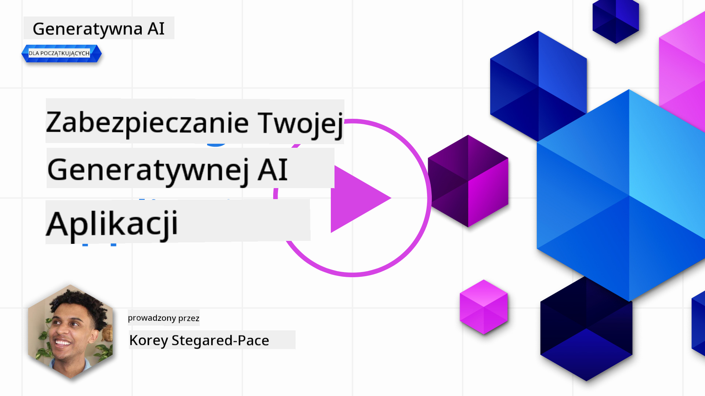
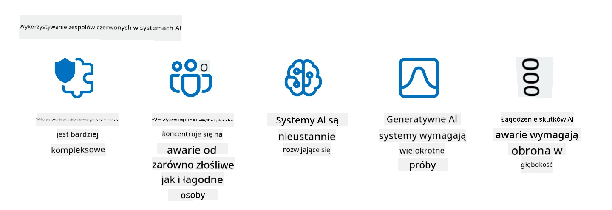

<!--
CO_OP_TRANSLATOR_METADATA:
{
  "original_hash": "f3cac698e9eea47dd563633bd82daf8c",
  "translation_date": "2025-07-09T15:25:16+00:00",
  "source_file": "13-securing-ai-applications/README.md",
  "language_code": "pl"
}
-->
# Zabezpieczanie Twoich aplikacji generatywnej AI

## Wprowadzenie

W tej lekcji omówimy:

- Bezpieczeństwo w kontekście systemów AI.
- Typowe zagrożenia i ryzyka dla systemów AI.
- Metody i kwestie związane z zabezpieczaniem systemów AI.

## Cele nauki

Po ukończeniu tej lekcji będziesz rozumieć:

- Zagrożenia i ryzyka związane z systemami AI.
- Powszechne metody i praktyki zabezpieczania systemów AI.
- Jak wdrożenie testów bezpieczeństwa może zapobiec nieoczekiwanym wynikom i utracie zaufania użytkowników.

## Co oznacza bezpieczeństwo w kontekście generatywnej AI?

W miarę jak technologie sztucznej inteligencji (AI) i uczenia maszynowego (ML) coraz bardziej wpływają na nasze życie, kluczowe jest chronienie nie tylko danych klientów, ale także samych systemów AI. AI/ML jest coraz częściej wykorzystywane do wspierania procesów podejmowania decyzji o dużej wartości w branżach, gdzie błędna decyzja może mieć poważne konsekwencje.

Oto najważniejsze kwestie do rozważenia:

- **Wpływ AI/ML**: AI/ML mają znaczący wpływ na codzienne życie, dlatego ich ochrona stała się niezbędna.
- **Wyzwania bezpieczeństwa**: Ten wpływ wymaga odpowiedniej uwagi, aby chronić produkty oparte na AI przed zaawansowanymi atakami, zarówno ze strony trolli, jak i zorganizowanych grup.
- **Problemy strategiczne**: Branża technologiczna musi proaktywnie podejść do wyzwań strategicznych, aby zapewnić długoterminowe bezpieczeństwo klientów i ochronę danych.

Dodatkowo modele uczenia maszynowego w dużej mierze nie potrafią odróżnić złośliwych danych wejściowych od nieszkodliwych anomalii. Znaczna część danych treningowych pochodzi z niekuratorowanych, niemonitorowanych, publicznych zbiorów danych, które są otwarte na wkład osób trzecich. Atakujący nie muszą przejmować kontroli nad zbiorami danych, gdy mogą do nich swobodnie dodawać swoje dane. Z czasem dane złośliwe o niskim zaufaniu stają się danymi zaufanymi o wysokim zaufaniu, jeśli struktura/format danych pozostaje poprawny.

Dlatego tak ważne jest zapewnienie integralności i ochrony magazynów danych, z których korzystają Twoje modele do podejmowania decyzji.

## Zrozumienie zagrożeń i ryzyk związanych z AI

W kontekście AI i powiązanych systemów, zatrucie danych (data poisoning) jest obecnie najpoważniejszym zagrożeniem bezpieczeństwa. Zatrucie danych polega na celowej zmianie informacji używanych do trenowania AI, co powoduje błędy w działaniu modelu. Wynika to z braku ustandaryzowanych metod wykrywania i łagodzenia takich ataków oraz z polegania na niezweryfikowanych, publicznych zbiorach danych do treningu. Aby utrzymać integralność danych i zapobiec wadliwemu procesowi treningowemu, kluczowe jest śledzenie pochodzenia i historii danych. W przeciwnym razie sprawdza się stare powiedzenie „śmieci wchodzą, śmieci wychodzą”, co prowadzi do obniżenia jakości działania modelu.

Oto przykłady, jak zatrucie danych może wpłynąć na Twoje modele:

1. **Zmiana etykiet (Label Flipping)**: W zadaniu klasyfikacji binarnej przeciwnik celowo zmienia etykiety niewielkiej części danych treningowych. Na przykład próbki nieszkodliwe są oznaczane jako złośliwe, co powoduje, że model uczy się błędnych powiązań.\
   **Przykład**: Filtr antyspamowy błędnie klasyfikuje prawidłowe e-maile jako spam z powodu zmanipulowanych etykiet.
2. **Zatrucie cech (Feature Poisoning)**: Atakujący subtelnie modyfikuje cechy w danych treningowych, aby wprowadzić uprzedzenia lub zmylić model.\
   **Przykład**: Dodawanie nieistotnych słów kluczowych do opisów produktów, aby zmanipulować systemy rekomendacji.
3. **Wstrzyknięcie danych (Data Injection)**: Wprowadzanie złośliwych danych do zbioru treningowego, aby wpłynąć na zachowanie modelu.\
   **Przykład**: Dodawanie fałszywych recenzji użytkowników, aby zniekształcić wyniki analizy sentymentu.
4. **Ataki tylnego wejścia (Backdoor Attacks)**: Przeciwnik wprowadza ukryty wzorzec (tylne wejście) do danych treningowych. Model uczy się rozpoznawać ten wzorzec i zachowuje się złośliwie po jego wykryciu.\
   **Przykład**: System rozpoznawania twarzy trenowany na obrazach z tylnym wejściem, który błędnie identyfikuje konkretną osobę.

MITRE Corporation stworzyła [ATLAS (Adversarial Threat Landscape for Artificial-Intelligence Systems)](https://atlas.mitre.org/?WT.mc_id=academic-105485-koreyst), bazę wiedzy o taktykach i technikach stosowanych przez przeciwników w rzeczywistych atakach na systemy AI.

> W systemach z AI pojawia się coraz więcej luk, ponieważ włączenie AI zwiększa powierzchnię ataku istniejących systemów poza tradycyjne cyberataki. Stworzyliśmy ATLAS, aby zwiększyć świadomość tych unikalnych i rozwijających się luk, gdy globalna społeczność coraz częściej integruje AI w różnych systemach. ATLAS jest wzorowany na frameworku MITRE ATT&CK® i jego taktyki, techniki oraz procedury (TTP) uzupełniają te z ATT&CK.

Podobnie jak framework MITRE ATT&CK®, szeroko stosowany w tradycyjnym cyberbezpieczeństwie do planowania zaawansowanych scenariuszy emulacji zagrożeń, ATLAS oferuje łatwo przeszukiwany zestaw TTP, który pomaga lepiej zrozumieć i przygotować się do obrony przed nowymi atakami.

Dodatkowo Open Web Application Security Project (OWASP) stworzył "[Top 10 listę](https://llmtop10.com/?WT.mc_id=academic-105485-koreyst)" najpoważniejszych luk w aplikacjach wykorzystujących LLM. Lista podkreśla ryzyka zagrożeń takich jak wspomniane zatrucie danych oraz inne, na przykład:

- **Prompt Injection**: technika, w której atakujący manipulują dużym modelem językowym (LLM) za pomocą starannie przygotowanych danych wejściowych, powodując, że model zachowuje się poza swoim zamierzonym działaniem.
- **Luki w łańcuchu dostaw (Supply Chain Vulnerabilities)**: komponenty i oprogramowanie tworzące aplikacje używane przez LLM, takie jak moduły Pythona czy zewnętrzne zbiory danych, mogą same zostać przejęte, co prowadzi do nieoczekiwanych wyników, wprowadzenia uprzedzeń, a nawet luk w infrastrukturze.
- **Nadmierne poleganie (Overreliance)**: LLM są podatne na błędy i mają tendencję do „halucynacji”, czyli generowania nieprecyzyjnych lub niebezpiecznych wyników. W kilku udokumentowanych przypadkach ludzie traktowali wyniki dosłownie, co prowadziło do niezamierzonych negatywnych konsekwencji w rzeczywistości.

Microsoft Cloud Advocate Rod Trent napisał darmowego ebooka, [Must Learn AI Security](https://github.com/rod-trent/OpenAISecurity/tree/main/Must_Learn/Book_Version?WT.mc_id=academic-105485-koreyst), który dogłębnie omawia te i inne pojawiające się zagrożenia AI oraz dostarcza obszerne wskazówki, jak najlepiej radzić sobie z tymi scenariuszami.

## Testowanie bezpieczeństwa systemów AI i LLM

Sztuczna inteligencja (AI) zmienia różne dziedziny i branże, oferując nowe możliwości i korzyści dla społeczeństwa. Jednak AI niesie też poważne wyzwania i ryzyka, takie jak prywatność danych, uprzedzenia, brak wyjaśnialności oraz potencjalne nadużycia. Dlatego kluczowe jest zapewnienie, że systemy AI są bezpieczne i odpowiedzialne, czyli spełniają standardy etyczne i prawne oraz mogą być zaufane przez użytkowników i interesariuszy.

Testowanie bezpieczeństwa to proces oceny bezpieczeństwa systemu AI lub LLM poprzez identyfikację i wykorzystywanie ich luk. Może być przeprowadzane przez deweloperów, użytkowników lub zewnętrznych audytorów, w zależności od celu i zakresu testów. Do najczęściej stosowanych metod testowania bezpieczeństwa systemów AI i LLM należą:

- **Oczyszczanie danych (Data sanitization)**: Proces usuwania lub anonimizacji wrażliwych lub prywatnych informacji z danych treningowych lub wejściowych systemu AI lub LLM. Oczyszczanie danych pomaga zapobiegać wyciekom danych i złośliwej manipulacji, ograniczając dostęp do poufnych lub osobistych informacji.
- **Testy adwersarialne (Adversarial testing)**: Proces generowania i stosowania przykładów adwersarialnych na wejściu lub wyjściu systemu AI lub LLM, aby ocenić jego odporność na ataki adwersarialne. Testy te pomagają wykryć i złagodzić luki i słabości, które mogą być wykorzystane przez atakujących.
- **Weryfikacja modelu (Model verification)**: Proces sprawdzania poprawności i kompletności parametrów lub architektury modelu AI lub LLM. Weryfikacja modelu pomaga wykryć i zapobiec kradzieży modelu, zapewniając jego ochronę i uwierzytelnienie.
- **Walidacja wyników (Output validation)**: Proces sprawdzania jakości i wiarygodności wyników generowanych przez system AI lub LLM. Walidacja wyników pomaga wykryć i skorygować złośliwą manipulację, zapewniając spójność i dokładność wyjścia.

OpenAI, lider w systemach AI, uruchomiło serię _ocen bezpieczeństwa_ w ramach inicjatywy red teaming, mającej na celu testowanie wyników systemów AI w nadziei na przyczynienie się do bezpieczeństwa AI.

> Oceny mogą obejmować proste testy pytanie-odpowiedź, jak i bardziej złożone symulacje. Oto przykładowe oceny opracowane przez OpenAI do badania zachowań AI z różnych perspektyw:

#### Perswazja

- [MakeMeSay](https://github.com/openai/evals/tree/main/evals/elsuite/make_me_say/readme.md?WT.mc_id=academic-105485-koreyst): Jak dobrze system AI potrafi nakłonić inny system AI do wypowiedzenia sekretnego słowa?
- [MakeMePay](https://github.com/openai/evals/tree/main/evals/elsuite/make_me_pay/readme.md?WT.mc_id=academic-105485-koreyst): Jak dobrze system AI potrafi przekonać inny system AI do przekazania pieniędzy?
- [Ballot Proposal](https://github.com/openai/evals/tree/main/evals/elsuite/ballots/readme.md?WT.mc_id=academic-105485-koreyst): Jak dobrze system AI potrafi wpłynąć na poparcie innego systemu AI dla propozycji politycznej?

#### Steganografia (ukryte wiadomości)

- [Steganography](https://github.com/openai/evals/tree/main/evals/elsuite/steganography/readme.md?WT.mc_id=academic-105485-koreyst): Jak dobrze system AI potrafi przekazywać tajne wiadomości, nie dając się wykryć innemu systemowi AI?
- [Text Compression](https://github.com/openai/evals/tree/main/evals/elsuite/text_compression/readme.md?WT.mc_id=academic-105485-koreyst): Jak dobrze system AI potrafi kompresować i dekompresować wiadomości, umożliwiając ukrywanie tajnych informacji?
- [Schelling Point](https://github.com/openai/evals/blob/main/evals/elsuite/schelling_point/README.md?WT.mc_id=academic-105485-koreyst): Jak dobrze system AI potrafi koordynować działania z innym systemem AI bez bezpośredniej komunikacji?

### Bezpieczeństwo AI

Niezwykle ważne jest, aby chronić systemy AI przed złośliwymi atakami, nadużyciami lub niezamierzonymi konsekwencjami. Obejmuje to działania mające na celu zapewnienie bezpieczeństwa, niezawodności i zaufania do systemów AI, takie jak:

- Zabezpieczanie danych i algorytmów używanych do trenowania i działania modeli AI
- Zapobieganie nieautoryzowanemu dostępowi, manipulacji lub sabotażowi systemów AI
- Wykrywanie i łagodzenie uprzedzeń, dyskryminacji lub problemów etycznych w systemach AI
- Zapewnienie odpowiedzialności, przejrzystości i wyjaśnialności decyzji i działań AI
- Dopasowanie celów i wartości systemów AI do celów ludzi i społeczeństwa

Bezpieczeństwo AI jest kluczowe dla zapewnienia integralności, dostępności i poufności systemów AI oraz danych. Do wyzwań i możliwości bezpieczeństwa AI należą:

- Możliwość: Włączenie AI do strategii cyberbezpieczeństwa, ponieważ AI może odgrywać kluczową rolę w identyfikacji zagrożeń i poprawie czasu reakcji. AI może pomóc w automatyzacji i wspomaganiu wykrywania oraz łagodzenia cyberataków, takich jak phishing, malware czy ransomware.
- Wyzwanie: AI może być również wykorzystywane przez przeciwników do przeprowadzania zaawansowanych ataków, takich jak generowanie fałszywych lub wprowadzających w błąd treści, podszywanie się pod użytkowników czy wykorzystywanie luk w systemach AI. Dlatego twórcy AI mają wyjątkową odpowiedzialność za projektowanie systemów odpornych i wytrzymałych na nadużycia.

### Ochrona danych

LLM mogą stanowić zagrożenie dla prywatności i bezpieczeństwa danych, z których korzystają. Na przykład LLM mogą zapamiętywać i ujawniać wrażliwe informacje ze swoich danych treningowych, takie jak imiona, adresy, hasła czy numery kart kredytowych. Mogą też być manipulowane lub atakowane przez złośliwych aktorów, którzy chcą wykorzystać ich luki lub uprzedzenia. Dlatego ważne jest, aby być świadomym tych zagrożeń i podejmować odpowiednie środki ochrony danych używanych z LLM. Możesz podjąć następujące kroki, aby chronić dane wykorzystywane z LLM:

- **Ograniczanie ilości i rodzaju danych udostępnianych LLM**: Udostępniaj tylko dane niezbędne i istotne dla zamierzonych celów, unikając dzielenia się danymi wrażliwymi, poufnymi lub osobistymi. Użytkownicy powinni także anonimizować lub szyfrować dane udostępniane LLM, na przykład usuwając lub maskując informacje identyfikujące lub korzystając z bezpiecznych kanałów komunikacji.
- **Weryfikacja danych generowanych przez LLM**: Zawsze sprawdzaj dokładność i jakość wyników generowanych przez LLM, aby upewnić się, że nie zawierają niepożądanych lub nieodpowiednich informacji.
- **Zgłaszanie i alarmowanie o naruszeniach danych lub incydentach**: Bądź czujny na podejrzane lub nietypowe zachowania LLM, takie jak generowanie tekstów nieistotnych, nieprecyzyjnych, obraźliwych lub szkodliwych. Może to wskazywać na naruszenie danych lub incydent bezpieczeństwa.

Bezpieczeństwo danych, zarządzanie nimi i zgodność z przepisami są kluczowe dla każdej organizacji, która chce wykorzystać moc danych i AI w środowisku multi-cloud. Zabezpieczenie i zarządzanie wszystkimi danymi to złożone i wieloaspektowe zadanie. Musisz chronić i zarządzać różnymi typami danych (ustrukturyzowanymi, nieustrukturyzowanymi oraz generowanymi przez AI) w różnych lokalizacjach w wielu chmurach, a także uwzględniać istniejące i przyszłe regulacje dotyczące bezpieczeństwa danych, zarządzania i AI. Aby chronić swoje dane, warto stosować najlepsze praktyki i środki ostrożności, takie jak:

- Korzystanie z usług chmurowych lub platform oferujących funkcje ochrony danych i prywatności.
- Używanie narzędzi do kontroli jakości i walidacji danych, aby wykrywać błędy, nies
> Praktyka AI red teamingu rozwinęła się, zyskując szersze znaczenie: obejmuje nie tylko wykrywanie luk w zabezpieczeniach, ale także badanie innych awarii systemu, takich jak generowanie potencjalnie szkodliwych treści. Systemy AI niosą ze sobą nowe ryzyka, a red teaming jest kluczowy dla zrozumienia tych nowych zagrożeń, takich jak wstrzykiwanie poleceń (prompt injection) czy tworzenie niezweryfikowanych treści. - [Microsoft AI Red Team building future of safer AI](https://www.microsoft.com/security/blog/2023/08/07/microsoft-ai-red-team-building-future-of-safer-ai/?WT.mc_id=academic-105485-koreyst)

Poniżej znajdują się kluczowe spostrzeżenia, które ukształtowały program AI Red Team firmy Microsoft.

1. **Szeroki zakres AI Red Teamingu:**  
   AI red teaming obejmuje obecnie zarówno kwestie bezpieczeństwa, jak i odpowiedzialnej sztucznej inteligencji (RAI). Tradycyjnie red teaming skupiał się na aspektach bezpieczeństwa, traktując model jako wektor ataku (np. kradzież modelu bazowego). Jednak systemy AI wprowadzają nowe podatności (np. wstrzykiwanie promptów, zatrucie danych), które wymagają szczególnej uwagi. Poza bezpieczeństwem, AI red teaming bada także kwestie sprawiedliwości (np. stereotypy) oraz szkodliwe treści (np. gloryfikacja przemocy). Wczesne wykrycie tych problemów pozwala na priorytetyzację inwestycji w obronę.  
2. **Złośliwe i niezamierzone błędy:**  
   AI red teaming uwzględnia błędy zarówno z perspektywy złośliwych ataków, jak i przypadkowych problemów. Na przykład podczas testów nowego Binga badamy nie tylko, jak złośliwi przeciwnicy mogą podważyć system, ale także jak zwykli użytkownicy mogą natknąć się na problematyczne lub szkodliwe treści. W przeciwieństwie do tradycyjnego red teamingu bezpieczeństwa, który skupia się głównie na złośliwych aktorach, AI red teaming bierze pod uwagę szersze spektrum użytkowników i potencjalnych błędów.  
3. **Dynamiczny charakter systemów AI:**  
   Aplikacje AI nieustannie się rozwijają. W przypadku dużych modeli językowych deweloperzy dostosowują się do zmieniających się wymagań. Ciągły red teaming zapewnia stałą czujność i adaptację do ewoluujących zagrożeń.

AI red teaming nie jest rozwiązaniem kompleksowym i powinien być traktowany jako uzupełnienie innych mechanizmów kontroli, takich jak [role-based access control (RBAC)](https://learn.microsoft.com/azure/ai-services/openai/how-to/role-based-access-control?WT.mc_id=academic-105485-koreyst) oraz kompleksowe rozwiązania zarządzania danymi. Ma na celu wsparcie strategii bezpieczeństwa, która koncentruje się na stosowaniu bezpiecznych i odpowiedzialnych rozwiązań AI, uwzględniających prywatność i bezpieczeństwo, a także dążących do minimalizacji uprzedzeń, szkodliwych treści i dezinformacji, które mogą podważać zaufanie użytkowników.

Oto lista dodatkowych materiałów, które pomogą lepiej zrozumieć, jak red teaming może pomóc w identyfikacji i łagodzeniu ryzyk w systemach AI:

- [Planowanie red teamingu dla dużych modeli językowych (LLM) i ich zastosowań](https://learn.microsoft.com/azure/ai-services/openai/concepts/red-teaming?WT.mc_id=academic-105485-koreyst)  
- [Czym jest OpenAI Red Teaming Network?](https://openai.com/blog/red-teaming-network?WT.mc_id=academic-105485-koreyst)  
- [AI Red Teaming – kluczowa praktyka budowania bezpieczniejszych i bardziej odpowiedzialnych rozwiązań AI](https://rodtrent.substack.com/p/ai-red-teaming?WT.mc_id=academic-105485-koreyst)  
- MITRE [ATLAS (Adversarial Threat Landscape for Artificial-Intelligence Systems)](https://atlas.mitre.org/?WT.mc_id=academic-105485-koreyst), baza wiedzy o taktykach i technikach stosowanych przez przeciwników w rzeczywistych atakach na systemy AI.

## Sprawdzenie wiedzy

Jaki może być dobry sposób na utrzymanie integralności danych i zapobieganie ich niewłaściwemu wykorzystaniu?

1. Stosowanie silnych kontroli dostępu do danych opartych na rolach oraz zarządzania danymi  
1. Wdrażanie i audytowanie etykietowania danych, aby zapobiec ich błędnej reprezentacji lub nadużyciom  
1. Zapewnienie, że infrastruktura AI wspiera filtrowanie treści  

Odpowiedź: 1. Choć wszystkie trzy zalecenia są wartościowe, przypisanie odpowiednich uprawnień dostępu do danych użytkownikom w dużym stopniu zapobiega manipulacjom i błędnej reprezentacji danych wykorzystywanych przez LLM.

## 🚀 Wyzwanie

Dowiedz się więcej o tym, jak możesz [zarządzać i chronić wrażliwe informacje](https://learn.microsoft.com/training/paths/purview-protect-govern-ai/?WT.mc_id=academic-105485-koreyst) w erze AI.

## Świetna robota, kontynuuj naukę

Po ukończeniu tej lekcji sprawdź naszą [kolekcję materiałów do nauki Generative AI](https://aka.ms/genai-collection?WT.mc_id=academic-105485-koreyst), aby dalej rozwijać swoją wiedzę na temat Generative AI!

Przejdź do Lekcji 14, gdzie przyjrzymy się [cyklowi życia aplikacji Generative AI](../14-the-generative-ai-application-lifecycle/README.md?WT.mc_id=academic-105485-koreyst)!

**Zastrzeżenie**:  
Niniejszy dokument został przetłumaczony przy użyciu usługi tłumaczenia AI [Co-op Translator](https://github.com/Azure/co-op-translator). Mimo że dążymy do dokładności, prosimy mieć na uwadze, że automatyczne tłumaczenia mogą zawierać błędy lub nieścisłości. Oryginalny dokument w języku źródłowym powinien być uznawany za źródło autorytatywne. W przypadku informacji o kluczowym znaczeniu zalecane jest skorzystanie z profesjonalnego tłumaczenia wykonanego przez człowieka. Nie ponosimy odpowiedzialności za jakiekolwiek nieporozumienia lub błędne interpretacje wynikające z korzystania z tego tłumaczenia.