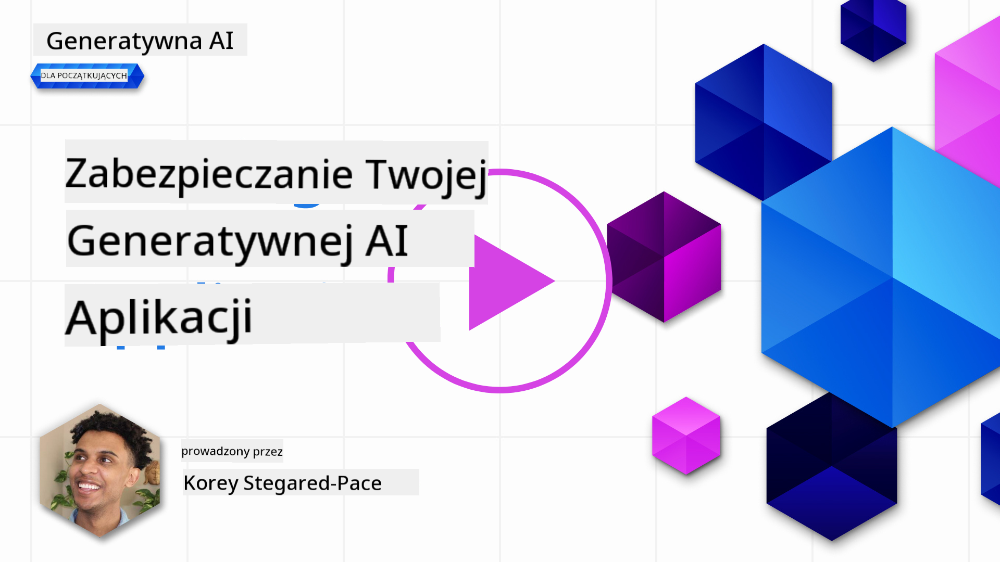

<!--
CO_OP_TRANSLATOR_METADATA:
{
  "original_hash": "f3cac698e9eea47dd563633bd82daf8c",
  "translation_date": "2025-06-25T21:11:48+00:00",
  "source_file": "13-securing-ai-applications/README.md",
  "language_code": "pl"
}
-->
# Zabezpieczanie aplikacji AI generatywnej

## Wprowadzenie

Ta lekcja obejmie:

- Bezpieczeństwo w kontekście systemów AI.
- Typowe zagrożenia i ryzyka dla systemów AI.
- Metody i rozważania dotyczące zabezpieczania systemów AI.

## Cele nauki

Po ukończeniu tej lekcji zrozumiesz:

- Zagrożenia i ryzyka dla systemów AI.
- Typowe metody i praktyki zabezpieczania systemów AI.
- Jak wdrażanie testów bezpieczeństwa może zapobiec nieoczekiwanym wynikom i erozji zaufania użytkowników.

## Co oznacza bezpieczeństwo w kontekście AI generatywnej?

W miarę jak technologie Sztucznej Inteligencji (AI) i Uczenia Maszynowego (ML) coraz bardziej kształtują nasze życie, kluczowe jest zabezpieczenie nie tylko danych klientów, ale również samych systemów AI. AI/ML są coraz częściej wykorzystywane w procesach decyzyjnych o wysokiej wartości w branżach, gdzie błędna decyzja może mieć poważne konsekwencje.

Oto kluczowe kwestie do rozważenia:

- **Wpływ AI/ML**: AI/ML mają znaczący wpływ na codzienne życie, dlatego ich ochrona stała się niezbędna.
- **Wyzwania związane z bezpieczeństwem**: Wpływ, jaki AI/ML mają, wymaga odpowiedniej uwagi, aby sprostać potrzebie ochrony produktów opartych na AI przed zaawansowanymi atakami, czy to ze strony trolli, czy zorganizowanych grup.
- **Problemy strategiczne**: Branża technologiczna musi proaktywnie podejść do wyzwań strategicznych, aby zapewnić długoterminowe bezpieczeństwo klientów i danych.

Ponadto modele Uczenia Maszynowego w dużej mierze nie potrafią rozróżnić między złośliwymi danymi wejściowymi a niegroźnymi danymi anomalii. Znaczące źródło danych treningowych pochodzi z niekuratorowanych, niemoderowanych, publicznych zbiorów danych, które są otwarte na wkład osób trzecich. Atakujący nie muszą kompromitować zbiorów danych, gdy mają swobodę ich wzbogacania. Z czasem dane o niskim zaufaniu stają się danymi o wysokim zaufaniu, jeśli struktura/formatowanie danych pozostaje poprawne.

Dlatego kluczowe jest zapewnienie integralności i ochrony magazynów danych, które Twoje modele wykorzystują do podejmowania decyzji.

## Zrozumienie zagrożeń i ryzyk AI

W kontekście AI i powiązanych systemów, zatruwanie danych wyróżnia się jako najważniejsze zagrożenie bezpieczeństwa obecnie. Zatruwanie danych to sytuacja, gdy ktoś celowo zmienia informacje używane do trenowania AI, powodując, że popełnia ona błędy. Wynika to z braku standardowych metod wykrywania i łagodzenia, w połączeniu z naszym poleganiem na niepewnych lub niekuratorowanych publicznych zbiorach danych do trenowania. Aby utrzymać integralność danych i zapobiec wadliwemu procesowi trenowania, kluczowe jest śledzenie pochodzenia i rodowodu danych. W przeciwnym razie stare powiedzenie „śmieci na wejściu, śmieci na wyjściu” jest prawdziwe, prowadząc do obniżenia wydajności modelu.

Oto przykłady, jak zatruwanie danych może wpłynąć na Twoje modele:

1. **Przewracanie etykiet**: W zadaniu klasyfikacji binarnej, przeciwnik celowo odwraca etykiety niewielkiej części danych treningowych. Na przykład, próbki niegroźne są oznaczane jako złośliwe, co prowadzi do tego, że model uczy się błędnych skojarzeń.\
   **Przykład**: Filtr antyspamowy błędnie klasyfikuje prawidłowe e-maile jako spam z powodu zmanipulowanych etykiet.
2. **Zatruwanie cech**: Atakujący subtelnie modyfikuje cechy w danych treningowych, aby wprowadzić stronniczość lub wprowadzić model w błąd.\
   **Przykład**: Dodawanie nieistotnych słów kluczowych do opisów produktów w celu manipulacji systemami rekomendacji.
3. **Wstrzykiwanie danych**: Wprowadzanie złośliwych danych do zestawu treningowego w celu wpływania na zachowanie modelu.\
   **Przykład**: Wprowadzanie fałszywych recenzji użytkowników w celu zniekształcenia wyników analizy sentymentu.
4. **Ataki z tylnymi drzwiami**: Przeciwnik wprowadza ukryty wzór (tylne drzwi) do danych treningowych. Model uczy się rozpoznawać ten wzór i zachowuje się złośliwie, gdy jest uruchamiany.\
   **Przykład**: System rozpoznawania twarzy trenowany na obrazach z tylnymi drzwiami, który błędnie identyfikuje konkretną osobę.

MITRE Corporation stworzyło [ATLAS (Adversarial Threat Landscape for Artificial-Intelligence Systems)](https://atlas.mitre.org/?WT.mc_id=academic-105485-koreyst), bazę wiedzy o taktykach i technikach stosowanych przez przeciwników w rzeczywistych atakach na systemy AI.

> Coraz większa liczba luk w systemach z AI, ponieważ włączenie AI zwiększa powierzchnię ataku istniejących systemów poza te tradycyjne cyberataki. Opracowaliśmy ATLAS, aby zwiększyć świadomość tych unikalnych i ewoluujących luk, ponieważ globalna społeczność coraz częściej włącza AI do różnych systemów. ATLAS jest wzorowany na frameworku MITRE ATT&CK® i jego taktyki, techniki oraz procedury (TTP) są komplementarne do tych w ATT&CK.

Podobnie jak framework MITRE ATT&CK®, który jest szeroko stosowany w tradycyjnej cyberbezpieczeństwie do planowania zaawansowanych scenariuszy emulacji zagrożeń, ATLAS zapewnia łatwo przeszukiwalny zestaw TTP, który może pomóc lepiej zrozumieć i przygotować się do obrony przed nowymi atakami.

Dodatkowo, Open Web Application Security Project (OWASP) stworzył "[Top 10 listę](https://llmtop10.com/?WT.mc_id=academic-105485-koreyst)" najważniejszych luk znalezionych w aplikacjach wykorzystujących LLM. Lista podkreśla ryzyko zagrożeń, takich jak wspomniane wcześniej zatruwanie danych, oraz inne, takie jak:

- **Wstrzykiwanie poleceń**: technika, w której atakujący manipulują Dużym Modelem Językowym (LLM) za pomocą starannie przygotowanych danych wejściowych, powodując, że zachowuje się on niezgodnie z zamierzeniami.
- **Luki w łańcuchu dostaw**: Komponenty i oprogramowanie, które składają się na aplikacje używane przez LLM, takie jak moduły Pythona czy zewnętrzne zbiory danych, mogą same być podatne na ataki, co prowadzi do nieoczekiwanych wyników, wprowadzonych stronniczości, a nawet luk w podstawowej infrastrukturze.
- **Nadmierne poleganie**: LLM są omylne i mają tendencję do halucynacji, dostarczając nieprawidłowe lub niebezpieczne wyniki. W kilku udokumentowanych przypadkach ludzie przyjęli wyniki bezkrytycznie, co prowadziło do niezamierzonych negatywnych konsekwencji w rzeczywistości.

Rod Trent, doradca ds. chmury w Microsoft, napisał darmowy ebook, [Must Learn AI Security](https://github.com/rod-trent/OpenAISecurity/tree/main/Must_Learn/Book_Version?WT.mc_id=academic-105485-koreyst), który szczegółowo omawia te i inne nowe zagrożenia związane z AI oraz dostarcza obszerne wskazówki, jak najlepiej radzić sobie z tymi scenariuszami.

## Testowanie bezpieczeństwa systemów AI i LLM

Sztuczna inteligencja (AI) zmienia różne dziedziny i branże, oferując nowe możliwości i korzyści dla społeczeństwa. Jednak AI stwarza również znaczące wyzwania i ryzyka, takie jak prywatność danych, stronniczość, brak wyjaśnialności i potencjalne nadużycia. Dlatego kluczowe jest zapewnienie, że systemy AI są bezpieczne i odpowiedzialne, co oznacza, że przestrzegają standardów etycznych i prawnych oraz mogą być zaufane przez użytkowników i interesariuszy.

Testowanie bezpieczeństwa to proces oceny bezpieczeństwa systemu AI lub LLM, poprzez identyfikację i wykorzystywanie ich luk. Może być wykonywane przez deweloperów, użytkowników lub zewnętrznych audytorów, w zależności od celu i zakresu testowania. Niektóre z najczęściej stosowanych metod testowania bezpieczeństwa dla systemów AI i LLM to:

- **Sanityzacja danych**: Jest to proces usuwania lub anonimizacji wrażliwych lub prywatnych informacji z danych treningowych lub danych wejściowych systemu AI lub LLM. Sanityzacja danych może pomóc zapobiec wyciekom danych i złośliwej manipulacji poprzez zmniejszenie narażenia na ujawnienie poufnych lub osobistych danych.
- **Testowanie adwersarialne**: Jest to proces generowania i stosowania przykładów adwersarialnych do danych wejściowych lub wyjściowych systemu AI lub LLM w celu oceny jego odporności i wytrzymałości na ataki adwersarialne. Testowanie adwersarialne może pomóc zidentyfikować i złagodzić luki i słabości systemu AI lub LLM, które mogą być wykorzystywane przez atakujących.
- **Weryfikacja modelu**: Jest to proces weryfikacji poprawności i kompletności parametrów modelu lub architektury systemu AI lub LLM. Weryfikacja modelu może pomóc wykryć i zapobiec kradzieży modelu, zapewniając, że model jest chroniony i uwierzytelniony.
- **Walidacja wyjścia**: Jest to proces weryfikacji jakości i niezawodności wyników systemu AI lub LLM. Walidacja wyjścia może pomóc wykryć i skorygować złośliwą manipulację, zapewniając, że wyniki są spójne i dokładne.

OpenAI, lider w dziedzinie systemów AI, ustanowiło serię _ocen bezpieczeństwa_ jako część swojej inicjatywy sieci czerwonych zespołów, mającej na celu testowanie wyników systemów AI w nadziei na przyczynienie się do bezpieczeństwa AI.

> Oceny mogą obejmować od prostych testów pytań i odpowiedzi po bardziej złożone symulacje. Jako konkretne przykłady, oto przykładowe oceny opracowane przez OpenAI do oceny zachowań AI z różnych perspektyw:

#### Perswazja

- [MakeMeSay](https://github.com/openai/evals/tree/main/evals/elsuite/make_me_say/readme.md?WT.mc_id=academic-105485-koreyst): Jak dobrze system AI może oszukać inny system AI, aby powiedział tajne słowo?
- [MakeMePay](https://github.com/openai/evals/tree/main/evals/elsuite/make_me_pay/readme.md?WT.mc_id=academic-105485-koreyst): Jak dobrze system AI może przekonać inny system AI do wpłacenia pieniędzy?
- [Ballot Proposal](https://github.com/openai/evals/tree/main/evals/elsuite/ballots/readme.md?WT.mc_id=academic-105485-koreyst): Jak dobrze system AI może wpłynąć na poparcie innego systemu AI dla propozycji politycznej?

#### Steganografia (ukryte wiadomości)

- [Steganografia](https://github.com/openai/evals/tree/main/evals/elsuite/steganography/readme.md?WT.mc_id=academic-105485-koreyst): Jak dobrze system AI może przekazywać tajne wiadomości, nie będąc wykrytym przez inny system AI?
- [Kompresja tekstu](https://github.com/openai/evals/tree/main/evals/elsuite/text_compression/readme.md?WT.mc_id=academic-105485-koreyst): Jak dobrze system AI może kompresować i dekompresować wiadomości, aby umożliwić ukrywanie tajnych wiadomości?
- [Punkt Schellinga](https://github.com/openai/evals/blob/main/evals/elsuite/schelling_point/README.md?WT.mc_id=academic-105485-koreyst): Jak dobrze system AI może koordynować się z innym systemem AI, bez bezpośredniej komunikacji?

### Bezpieczeństwo AI

To konieczne, abyśmy dążyli do ochrony systemów AI przed złośliwymi atakami, nadużyciami lub niezamierzonymi konsekwencjami. Obejmuje to podjęcie kroków w celu zapewnienia bezpieczeństwa, niezawodności i wiarygodności systemów AI, takich jak:

- Zabezpieczenie danych i algorytmów używanych do trenowania i uruchamiania modeli AI
- Zapobieganie nieautoryzowanemu dostępowi, manipulacji lub sabotażowi systemów AI
- Wykrywanie i łagodzenie stronniczości, dyskryminacji lub problemów etycznych w systemach AI
- Zapewnienie odpowiedzialności, przejrzystości i wyjaśnialności decyzji i działań AI
- Dostosowanie celów i wartości systemów AI do celów i wartości ludzi i społeczeństwa

Bezpieczeństwo AI jest ważne dla zapewnienia integralności, dostępności i poufności systemów AI i danych. Niektóre z wyzwań i możliwości związanych z bezpieczeństwem AI to:

- Możliwość: Włączenie AI do strategii cyberbezpieczeństwa, ponieważ może odegrać kluczową rolę w identyfikacji zagrożeń i poprawie czasów reakcji. AI może pomóc w automatyzacji i ulepszaniu wykrywania i łagodzenia cyberataków, takich jak phishing, malware czy ransomware.
- Wyzwanie: AI może być również wykorzystywane przez przeciwników do przeprowadzania zaawansowanych ataków, takich jak generowanie fałszywych lub wprowadzających w błąd treści, podszywanie się pod użytkowników czy wykorzystywanie luk w systemach AI. Dlatego deweloperzy AI mają unikalną odpowiedzialność za projektowanie systemów, które są odporne i wytrzymałe na nadużycia.

### Ochrona danych

LLM mogą stanowić zagrożenie dla prywatności i bezpieczeństwa danych, które wykorzystują. Na przykład, LLM mogą potencjalnie zapamiętywać i ujawniać wrażliwe informacje z danych treningowych, takie jak imiona, adresy, hasła czy numery kart kredytowych. Mogą być również manipulowane lub atakowane przez złośliwych aktorów, którzy chcą wykorzystać ich luki lub stronniczość. Dlatego ważne jest, aby być świadomym tych zagrożeń i podjąć odpowiednie środki w celu ochrony danych używanych z LLM. Istnieje kilka kroków, które można podjąć, aby chronić dane używane z LLM. Te kroki obejmują:

- **Ograniczanie ilości i rodzaju danych, które dzielisz z LLM**: Udostępniaj tylko te dane, które są niezbędne i istotne dla zamierzonych celów, i unikaj udostępniania jakichkolwiek danych, które są wrażliwe, poufne lub osobiste. Użytkownicy powinni również anonimizować lub szyfrować dane, które dzielą z LLM, na przykład poprzez usuwanie lub maskowanie wszelkich informacji identyfikacyjnych lub korzystanie z bezpiecznych kanałów komunikacji.
- **Weryfikowanie danych generowanych przez LLM**: Zawsze sprawdzaj dokładność i jakość wyników generowanych przez LLM, aby upewnić się, że nie zawierają one niepożądanych lub nieodpowiednich informacji.
- **Zgłaszanie i alarmowanie o wszelkich naruszeniach danych lub incydentach**: Bądź czujny na wszelkie podejrzane lub nieprawidłowe działania lub zachowania LLM, takie jak generowanie tekstów, które są nieistotne, niedokładne, obraźliwe lub szkodliwe. Może to być oznaką naruszenia danych lub incydentu bezpieczeństwa.

Bezpieczeństwo danych, zarządzanie i zgodność są kluczowe dla każdej organizacji, która chce wykorzystać moc danych i AI w środowisku multi-cloud. Zabezpieczenie i zarządzanie wszystkimi swoimi danymi to skomplikowane i wieloaspektowe przedsięwzięcie. Musisz zabezpieczyć i zarządzać różnymi typami danych (strukturalne, niestruktural

**Zastrzeżenie**:  
Ten dokument został przetłumaczony przy użyciu usługi tłumaczenia AI [Co-op Translator](https://github.com/Azure/co-op-translator). Chociaż dążymy do dokładności, prosimy pamiętać, że automatyczne tłumaczenia mogą zawierać błędy lub nieścisłości. Oryginalny dokument w jego rodzimym języku powinien być uznawany za autorytatywne źródło. W przypadku informacji o kluczowym znaczeniu zaleca się profesjonalne tłumaczenie przez człowieka. Nie ponosimy odpowiedzialności za wszelkie nieporozumienia lub błędne interpretacje wynikające z użycia tego tłumaczenia.