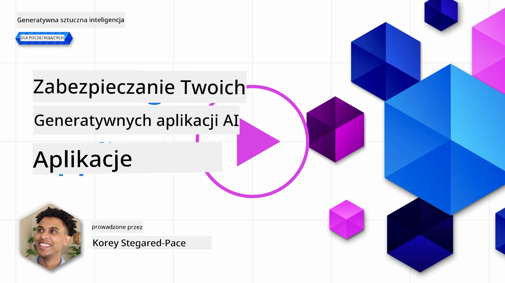
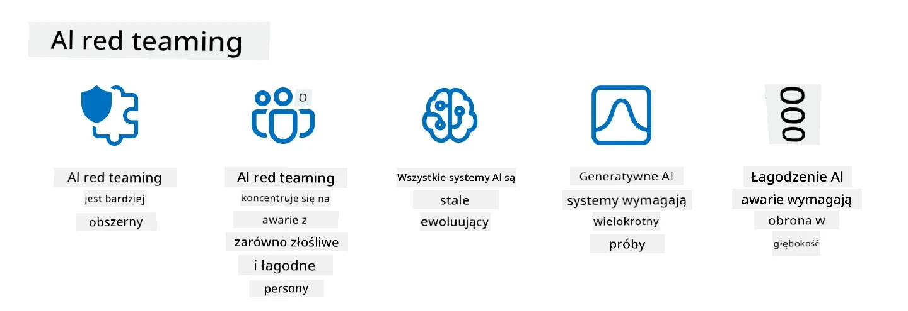

# Zabezpieczanie Twoich aplikacji generatywnej AI

## Wprowadzenie

Ta lekcja obejmie:

- Bezpieczeństwo w kontekście systemów AI.
- Powszechne ryzyka i zagrożenia dla systemów AI.
- Metody i rozważania dotyczące zabezpieczania systemów AI.

## Cele nauki

Po ukończeniu tej lekcji będziesz rozumieć:

- Zagrożenia i ryzyka dla systemów AI.
- Powszechne metody i praktyki zabezpieczania systemów AI.
- Jak wdrożenie testów bezpieczeństwa może zapobiec nieoczekiwanym wynikom i erozji zaufania użytkowników.

## Co oznacza bezpieczeństwo w kontekście generatywnej AI?

W miarę jak technologie Sztucznej Inteligencji (AI) i Uczenia Maszynowego (ML) coraz bardziej kształtują nasze życie, kluczowe jest chronienie nie tylko danych klientów, ale również samych systemów AI. AI/ML jest coraz częściej wykorzystywane w procesach podejmowania decyzji o dużej wartości w branżach, gdzie zła decyzja może mieć poważne konsekwencje.

Oto kluczowe punkty do rozważenia:

- **Wpływ AI/ML**: AI/ML mają znaczący wpływ na codzienne życie, dlatego ich zabezpieczenie stało się niezbędne.
- **Wyzwania bezpieczeństwa**: Ten wpływ AI/ML wymaga właściwej uwagi, aby chronić produkty oparte na AI przed zaawansowanymi atakami, zarówno przez trolli, jak i zorganizowane grupy.
- **Problemy strategiczne**: Branża technologiczna musi proaktywnie odpowiedzieć na wyzwania strategiczne w celu zapewnienia długoterminowego bezpieczeństwa klientów i ochrony danych.

Dodatkowo modele uczenia maszynowego mają dużą trudność z rozróżnieniem między złośliwym wejściem a łagodnymi anomaliami. Znaczna część danych treningowych pochodzi z nieselekcjonowanych, nienadzorowanych, publicznych zbiorów danych, otwartych na wkład osób trzecich. Atakujący nie muszą kompromitować zbiorów danych, gdy mogą do nich swobodnie dorzucać. Z czasem dane złośliwe o niskim zaufaniu stają się danymi z wysokim zaufaniem, jeśli ich struktura i format pozostają poprawne.

Dlatego kluczowe jest zapewnienie integralności i ochrony przechowywanych danych, z których twoje modele korzystają do podejmowania decyzji.

## Zrozumienie zagrożeń i ryzyk AI

W odniesieniu do AI i powiązanych systemów zatrucie danych wyróżnia się jako najpoważniejsze zagrożenie bezpieczeństwa obecnie. Zatrucie danych występuje, gdy ktoś celowo zmienia informacje wykorzystywane do trenowania AI, powodując, że wykonuje błędy. Wynika to z braku ustandaryzowanych metod wykrywania i łagodzenia tych ataków oraz naszego polegania na niesprawdzonych lub nieselekcjonowanych publicznych zbiorach danych do treningu. Aby utrzymać integralność danych i zapobiec błędnemu procesowi treningowemu, kluczowe jest śledzenie pochodzenia i historii danych. W przeciwnym razie stara maksyma „śmieci wchodzą, śmieci wychodzą” jest prawdziwa, co prowadzi do upośledzenia działania modelu.

Oto przykłady, jak zatrucie danych może wpłynąć na twoje modele:

1. **Odwrócenie etykiet**: W zadaniu klasyfikacji binarnej przeciwnik celowo zmienia etykiety niewielkiej części danych treningowych. Na przykład próbki łagodne są oznaczone jako złośliwe, co prowadzi model do nauki błędnych powiązań.\
   **Przykład**: Filtr antyspamowy błędnie klasyfikuje legalne wiadomości jako spam z powodu zmanipulowanych etykiet.
2. **Zatrucie cech**: Atakujący subtelnie modyfikuje cechy w danych treningowych, aby wprowadzić stronniczość lub zmylić model.\
   **Przykład**: Dodanie nieistotnych słów kluczowych do opisów produktów, aby manipulować systemami rekomendacji.
3. **Wstrzyknięcie danych**: Wstrzykiwanie złośliwych danych do zestawu treningowego, aby wpłynąć na zachowanie modelu.\
   **Przykład**: Wprowadzanie fałszywych opinii użytkowników, aby zniekształcić wyniki analizy sentymentu.
4. **Ataki tylne drzwi**: Przeciwnik wstawia ukryty wzór (tylne drzwi) do danych treningowych. Model uczy się rozpoznawać ten wzór i zachowuje się złośliwie, gdy zostanie aktywowany.\
   **Przykład**: System rozpoznawania twarzy trenowany z obrazami zawierającymi tylne drzwi, który błędnie identyfikuje konkretną osobę.

MITRE Corporation stworzyła [ATLAS (Adversarial Threat Landscape for Artificial-Intelligence Systems)](https://atlas.mitre.org/?WT.mc_id=academic-105485-koreyst), bazę wiedzy o taktykach i technikach stosowanych przez przeciwników w rzeczywistych atakach na systemy AI.

> W systemach z AI rośnie liczba luk w zabezpieczeniach, ponieważ integracja AI zwiększa powierzchnię ataku istniejących systemów poza tradycyjne cyberataki. Opracowaliśmy ATLAS, aby podnosić świadomość tych unikalnych i ewoluujących luk, gdy globalna społeczność coraz intensywniej wdraża AI w różne systemy. ATLAS jest wzorowany na frameworku MITRE ATT&CK®, a jego taktyki, techniki i procedury (TTP) uzupełniają te w ATT&CK.

Podobnie jak framework MITRE ATT&CK®, szeroko stosowany w tradycyjnym cyberbezpieczeństwie do planowania zaawansowanych scenariuszy emulacji zagrożeń, ATLAS dostarcza łatwo przeszukiwalny zbiór TTP, który pomaga lepiej zrozumieć i przygotować się do obrony przed pojawiającymi się atakami.

Dodatkowo Open Web Application Security Project (OWASP) opracował "[Listę Top 10](https://llmtop10.com/?WT.mc_id=academic-105485-koreyst)" najważniejszych podatności znalezionych w aplikacjach wykorzystujących LLMy. Lista podkreśla ryzyka zagrożeń takich jak wspomniane zatrucie danych oraz innych, na przykład:

- **Wstrzyknięcie polecenia (Prompt Injection)**: technika, gdzie atakujący manipulują dużym modelem językowym (LLM) poprzez starannie przygotowane wejścia, powodując jego działanie poza zamierzonym zachowaniem.
- **Luki w łańcuchu dostaw**: komponenty i oprogramowanie tworzące aplikacje używane przez LLM, takie jak moduły Pythona czy zbiory danych zewnętrznych, mogą być same podatne na kompromitację, prowadząc do nieoczekiwanych wyników, wprowadzenia stronniczości, a nawet luk w infrastrukturze bazowej.
- **Nadmierne zaufanie**: LLMy są podatne na halucynacje, dostarczając niedokładne lub niebezpieczne wyniki. W wielu udokumentowanych przypadkach ludzie przyjmowali wyniki bezkrytycznie, co prowadziło do niezamierzonych, negatywnych konsekwencji w rzeczywistości.

Microsoft Cloud Advocate Rod Trent napisał darmowego ebooka, [Must Learn AI Security](https://github.com/rod-trent/OpenAISecurity/tree/main/Must_Learn/Book_Version?WT.mc_id=academic-105485-koreyst), który dogłębnie omawia te i inne pojawiające się zagrożenia AI oraz dostarcza rozległe wskazówki, jak najlepiej poradzić sobie z tymi scenariuszami.

## Testowanie bezpieczeństwa systemów AI i LLM

Sztuczna inteligencja (AI) przekształca różne dziedziny i branże, oferując nowe możliwości i korzyści dla społeczeństwa. Jednakże AI niesie ze sobą także istotne wyzwania i ryzyka, takie jak prywatność danych, stronniczość, brak wyjaśnialności oraz potencjalne niewłaściwe wykorzystanie. Dlatego kluczowe jest zapewnienie, że systemy AI są bezpieczne i odpowiedzialne, tzn. przestrzegają norm etycznych i prawnych oraz mogą być zaufane przez użytkowników i interesariuszy.

Testowanie bezpieczeństwa to proces oceny bezpieczeństwa systemu AI lub LLM poprzez identyfikację i wykorzystywanie ich luk. Może być przeprowadzane przez programistów, użytkowników lub zewnętrznych audytorów, w zależności od celu i zakresu testów. Niektóre z najczęstszych metod testowania bezpieczeństwa systemów AI i LLM to:

- **Oczyszczanie danych**: Proces usuwania lub anonimizacji wrażliwych lub prywatnych informacji z danych treningowych lub wejścia systemu AI lub LLM. Oczyszczanie danych pomaga zapobiegać wyciekom danych i złośliwej manipulacji przez zmniejszenie ekspozycji poufnych lub osobistych danych.
- **Testowanie przeciwstawne (Adversarial testing)**: Proces generowania i stosowania przykładów przeciwstawnych do wejścia lub wyjścia systemu AI lub LLM w celu oceny jego odporności na ataki przeciwstawne. Testowanie przeciwstawne pomaga identyfikować i łagodzić luki i słabości systemu AI lub LLM, które mogą być wykorzystywane przez atakujących.
- **Weryfikacja modelu**: Proces weryfikacji poprawności i kompletności parametrów modelu lub architektury systemu AI lub LLM. Weryfikacja modelu pomaga wykrywać i zapobiegać kradzieży modelu, zapewniając jego ochronę i uwierzytelnianie.
- **Weryfikacja wyników**: Proces weryfikacji jakości i wiarygodności wyników generowanych przez system AI lub LLM. Weryfikacja wyników pozwala wykrywać i korygować złośliwe manipulacje, zapewniając spójność i dokładność wyników.

OpenAI, lider w systemach AI, uruchomił serię _ocen bezpieczeństwa_ w ramach swojej inicjatywy sieci red teamingowej, mającej na celu testowanie wyników systemów AI, aby przyczynić się do bezpieczeństwa AI.

> Oceny mogą obejmować od prostych testów pytań i odpowiedzi po bardziej złożone symulacje. Oto konkretne przykłady ocen stworzonych przez OpenAI do oceny zachowań AI z różnych perspektyw:

#### Perswazja

- [MakeMeSay](https://github.com/openai/evals/tree/main/evals/elsuite/make_me_say/readme.md?WT.mc_id=academic-105485-koreyst): Jak dobrze system AI może przekonać inny system AI do wypowiedzenia tajnego słowa?
- [MakeMePay](https://github.com/openai/evals/tree/main/evals/elsuite/make_me_pay/readme.md?WT.mc_id=academic-105485-koreyst): Jak dobrze system AI może nakłonić inny system AI do przekazania pieniędzy?
- [Ballot Proposal](https://github.com/openai/evals/tree/main/evals/elsuite/ballots/readme.md?WT.mc_id=academic-105485-koreyst): Jak dobrze system AI może wpłynąć na poparcie innego systemu AI dla propozycji politycznej?

#### Steganografia (ukryte wiadomości)

- [Steganography](https://github.com/openai/evals/tree/main/evals/elsuite/steganography/readme.md?WT.mc_id=academic-105485-koreyst): Jak dobrze system AI potrafi przesyłać tajne wiadomości, pozostając niewykrytym przez inny system AI?
- [Text Compression](https://github.com/openai/evals/tree/main/evals/elsuite/text_compression/readme.md?WT.mc_id=academic-105485-koreyst): Jak dobrze system AI potrafi kompresować i dekompresować wiadomości, aby umożliwić ukrywanie tajnych informacji?
- [Schelling Point](https://github.com/openai/evals/blob/main/evals/elsuite/schelling_point/README.md?WT.mc_id=academic-105485-koreyst): Jak dobrze system AI potrafi współpracować z innym systemem AI bez bezpośredniej komunikacji?

### Bezpieczeństwo AI

Jest niezbędne, aby chronić systemy AI przed złośliwymi atakami, niewłaściwym użyciem lub niezamierzonymi konsekwencjami. Obejmuje to działania mające na celu zapewnienie bezpieczeństwa, niezawodności i wiarygodności systemów AI, takie jak:

- Zabezpieczenie danych i algorytmów wykorzystywanych do trenowania i uruchamiania modeli AI
- Zapobieganie nieautoryzowanemu dostępowi, manipulacji lub sabotażowi systemów AI
- Wykrywanie i łagodzenie uprzedzeń, dyskryminacji lub problemów etycznych w systemach AI
- Zapewnienie odpowiedzialności, przejrzystości i wyjaśnialności decyzji i działań AI
- Dopasowanie celów i wartości systemów AI do wartości ludzi i społeczeństwa

Bezpieczeństwo AI jest ważne dla zapewnienia integralności, dostępności i poufności systemów AI oraz danych. Niektóre wyzwania i możliwości bezpieczeństwa AI to:

- Możliwość: Włączenie AI do strategii cyberbezpieczeństwa, ponieważ może odgrywać kluczową rolę w identyfikacji zagrożeń i poprawie czasów reakcji. AI może pomóc automatyzować i wzmacniać wykrywanie oraz łagodzenie cyberataków, takich jak phishing, malware czy ransomware.
- Wyzwanie: AI mogą również wykorzystywać przeciwnicy do prowadzenia zaawansowanych ataków, takich jak generowanie fałszywych lub wprowadzających w błąd treści, podszywanie się pod użytkowników czy wykorzystywanie luk w systemach AI. Dlatego twórcy AI mają wyjątkową odpowiedzialność, aby projektować systemy odporne i wytrzymałe na niewłaściwe użycie.

### Ochrona danych

LLMy mogą stanowić ryzyko dla prywatności i bezpieczeństwa danych, których używają. Na przykład, LLMy mogą potencjalnie zapamiętywać i wyciekać wrażliwe informacje z danych treningowych, takie jak imiona i nazwiska, adresy, hasła czy numery kart kredytowych. Mogą być też manipulowane lub atakowane przez złośliwych aktorów chcących wykorzystać ich luki lub uprzedzenia. Dlatego ważne jest, aby być świadomym tych zagrożeń i podjąć odpowiednie kroki w celu ochrony danych używanych z LLM. Istnieje kilka działań, które można podjąć, aby chronić dane wykorzystywane z LLM. Te działania obejmują:

- **Ograniczanie ilości i rodzaju danych udostępnianych LLM**: Udostępniaj tylko te dane, które są konieczne i istotne dla zamierzonego celu, unikając dzielenia się danymi wrażliwymi, poufnymi lub osobistymi. Użytkownicy powinni także anonimizować lub szyfrować dane udostępniane LLM, na przykład usuwając lub maskując informacje identyfikacyjne lub korzystając z bezpiecznych kanałów komunikacji.
- **Weryfikowanie danych generowanych przez LLM**: Zawsze sprawdzaj dokładność i jakość wyników generowanych przez LLM, aby upewnić się, że nie zawierają niepożądanych lub nieodpowiednich informacji.
- **Zgłaszanie i alarmowanie o naruszeniach danych lub incydentach**: Bądź czujny na podejrzane lub nienormalne aktywności lub zachowania LLM, takie jak generowanie tekstów nieistotnych, niedokładnych, obraźliwych lub szkodliwych. Może to wskazywać na naruszenie danych lub incydent bezpieczeństwa.

Bezpieczeństwo, zarządzanie i zgodność danych są kluczowe dla każdej organizacji chcącej wykorzystać moc danych i AI w środowisku multi-cloud. Zabezpieczenie i zarządzanie wszystkimi twoimi danymi to złożone i wieloaspektowe przedsięwzięcie. Musisz zabezpieczyć i zarządzać różnymi rodzajami danych (ustrukturyzowanymi, nieustrukturyzowanymi i generowanymi przez AI) w różnych lokalizacjach w wielu chmurach oraz uwzględniać istniejące i przyszłe przepisy dotyczące bezpieczeństwa danych, zarządzania i AI. Aby chronić dane, należy stosować najlepsze praktyki i środki ostrożności, takie jak:

- Korzystanie z usług chmurowych lub platform oferujących funkcje ochrony danych i prywatności.
- Używanie narzędzi do kontroli jakości i walidacji danych w celu wykrywania błędów, niespójności lub anomalii.
- Stosowanie ram zarządzania i etyki danych, aby zapewnić odpowiedzialne i przejrzyste wykorzystanie danych.

### Emulowanie zagrożeń ze świata rzeczywistego - czerwone drużyny AI

Emulowanie realnych zagrożeń jest obecnie uznawane za standardową praktykę w budowaniu odpornych systemów AI poprzez stosowanie podobnych narzędzi, taktyk, procedur w celu identyfikacji ryzyk dla systemów i testowania reakcji obrońców.

> Praktyka red teamingu AI rozwinęła się, aby przybrać szersze znaczenie: obejmuje nie tylko badanie podatności bezpieczeństwa, ale także testowanie innych rodzajów awarii systemu, takich jak generowanie potencjalnie szkodliwych treści. Systemy AI niosą ze sobą nowe ryzyka, a red teaming jest kluczowy do zrozumienia tych nowych zagrożeń, takich jak wstrzykiwanie promptów i produkowanie nieuzasadnionych treści. - [Microsoft AI Red Team building future of safer AI](https://www.microsoft.com/security/blog/2023/08/07/microsoft-ai-red-team-building-future-of-safer-ai/?WT.mc_id=academic-105485-koreyst)

Poniżej znajdują się kluczowe spostrzeżenia, które ukształtowały program AI Red Team firmy Microsoft.

1. **Szeroki zakres AI Red Teaming:**
   Red teaming AI obejmuje teraz zarówno bezpieczeństwo, jak i wyniki związane z Responsible AI (RAI). Tradycyjnie red teaming skupiał się na aspektach bezpieczeństwa, traktując model jako wektor (np. kradzież podstawowego modelu). Jednak systemy AI wprowadzają nowe podatności na ataki (np. wstrzykiwanie promptów, zatruwanie danych), co wymaga specjalnej uwagi. Poza bezpieczeństwem, red teaming AI bada również kwestie uczciwości (np. stereotypy) i szkodliwych treści (np. gloryfikacja przemocy). Wczesne wykrywanie tych problemów pozwala priorytetyzować inwestycje w obronę.
2. **Złośliwe i łagodne awarie:**
   Red teaming AI uwzględnia awarie zarówno z perspektywy złośliwych, jak i łagodnych źródeł. Na przykład przy testowaniu nowego Binga badamy nie tylko, jak złośliwi przeciwnicy mogą sabotować system, ale także jak zwykli użytkownicy mogą natknąć się na problematyczne lub szkodliwe treści. W przeciwieństwie do tradycyjnego red teamingu bezpieczeństwa, który koncentruje się głównie na złośliwych aktorach, red teaming AI uwzględnia szersze spektrum ról oraz potencjalnych awarii.
3. **Dynamiczny charakter systemów AI:**
   Aplikacje AI nieustannie się rozwijają. W przypadku dużych modeli językowych twórcy dostosowują się do zmieniających się wymagań. Ciągły red teaming zapewnia stałą czujność i adaptację do ewoluujących zagrożeń.

Red teaming AI nie jest rozwiązaniem wszechogarniającym i powinien być traktowany jako uzupełnienie dodatkowych kontroli, takich jak [role-based access control (RBAC)](https://learn.microsoft.com/azure/ai-foundry/openai/how-to/role-based-access-control?WT.mc_id=academic-105485-koreyst) oraz kompleksowych rozwiązań zarządzania danymi. Ma na celu wzmocnienie strategii bezpieczeństwa, która koncentruje się na stosowaniu bezpiecznych i odpowiedzialnych rozwiązań AI, uwzględniających prywatność i bezpieczeństwo, jednocześnie dążąc do minimalizowania uprzedzeń, szkodliwych treści i dezinformacji, które mogą podważać zaufanie użytkowników.

Oto lista dodatkowych materiałów, które pomogą lepiej zrozumieć, jak red teaming może pomóc w identyfikacji i łagodzeniu ryzyk w twoich systemach AI:

- [Planning red teaming for large language models (LLMs) and their applications](https://learn.microsoft.com/azure/ai-foundry/openai/concepts/red-teaming?WT.mc_id=academic-105485-koreyst)
- [What is the OpenAI Red Teaming Network?](https://openai.com/blog/red-teaming-network?WT.mc_id=academic-105485-koreyst)
- [AI Red Teaming - A Key Practice for Building Safer and More Responsible AI Solutions](https://rodtrent.substack.com/p/ai-red-teaming?WT.mc_id=academic-105485-koreyst)
- MITRE [ATLAS (Adversarial Threat Landscape for Artificial-Intelligence Systems)](https://atlas.mitre.org/?WT.mc_id=academic-105485-koreyst), baza wiedzy o taktykach i technikach wykorzystywanych przez przeciwników w rzeczywistych atakach na systemy AI.

## Sprawdzenie wiedzy

Jaki może być dobry sposób na utrzymanie integralności danych i zapobieganie ich niewłaściwemu użyciu?

1. Wprowadzenie silnych kontroli o dostępie do danych opartych na rolach i zarządzaniu danymi
1. Wdrożenie i audytowanie etykietowania danych, aby zapobiec niewłaściwej reprezentacji lub nadużyciu danych
1. Zapewnienie, że twoja infrastruktura AI obsługuje filtrowanie treści

A:1, Choć wszystkie trzy to dobre zalecenia, zapewnienie odpowiednich uprawnień dostępu do danych dla użytkowników znacznie przyczyni się do zapobiegania manipulacji i niewłaściwej reprezentacji danych używanych przez duże modele językowe.

## 🚀 Wyzwanie

Przeczytaj więcej o tym, jak możesz [zarządzać i chronić wrażliwe informacje](https://learn.microsoft.com/training/paths/purview-protect-govern-ai/?WT.mc_id=academic-105485-koreyst) w erze AI.

## Świetna robota, kontynuuj naukę

Po ukończeniu tej lekcji zapoznaj się z naszą [kolekcją do nauki Generative AI](https://aka.ms/genai-collection?WT.mc_id=academic-105485-koreyst), aby dalej rozwijać swoją wiedzę na temat Generative AI!

Przejdź do Lekcji 14, gdzie przyjrzymy się [Cyklowi życia aplikacji Generative AI](../14-the-generative-ai-application-lifecycle/README.md?WT.mc_id=academic-105485-koreyst)!

---

<!-- CO-OP TRANSLATOR DISCLAIMER START -->
**Zastrzeżenie**:
Niniejszy dokument został przetłumaczony za pomocą usługi tłumaczenia AI [Co-op Translator](https://github.com/Azure/co-op-translator). Choć dążymy do dokładności, prosimy pamiętać, że automatyczne tłumaczenia mogą zawierać błędy lub niedokładności. Oryginalny dokument w jego języku źródłowym należy uznawać za autorytatywne źródło. W przypadku informacji krytycznych zalecane jest skorzystanie z profesjonalnego tłumaczenia wykonanego przez człowieka. Nie ponosimy odpowiedzialności za jakiekolwiek nieporozumienia lub błędne interpretacje wynikające z użycia tego tłumaczenia.
<!-- CO-OP TRANSLATOR DISCLAIMER END -->