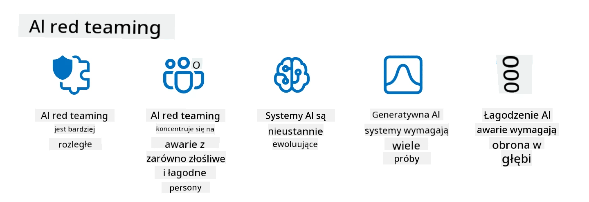

<!--
CO_OP_TRANSLATOR_METADATA:
{
  "original_hash": "a2faf8ee7a0b851efa647a19788f1e5b",
  "translation_date": "2025-10-18T00:52:02+00:00",
  "source_file": "13-securing-ai-applications/README.md",
  "language_code": "pl"
}
-->
# Zabezpieczanie aplikacji generatywnej AI

## Wprowadzenie

W tej lekcji omówimy:

- Bezpieczeństwo w kontekście systemów AI.
- Typowe ryzyka i zagrożenia dla systemów AI.
- Metody i aspekty zabezpieczania systemów AI.

## Cele nauki

Po ukończeniu tej lekcji będziesz rozumieć:

- Zagrożenia i ryzyka związane z systemami AI.
- Typowe metody i praktyki zabezpieczania systemów AI.
- Jak testowanie bezpieczeństwa może zapobiec nieoczekiwanym rezultatom i utracie zaufania użytkowników.

## Co oznacza bezpieczeństwo w kontekście generatywnej AI?

W miarę jak technologie sztucznej inteligencji (AI) i uczenia maszynowego (ML) coraz bardziej wpływają na nasze życie, kluczowe staje się zabezpieczenie nie tylko danych klientów, ale także samych systemów AI. AI/ML są coraz częściej wykorzystywane w procesach podejmowania decyzji o wysokiej wartości w branżach, gdzie błędne decyzje mogą prowadzić do poważnych konsekwencji.

Oto kluczowe kwestie, które warto rozważyć:

- **Wpływ AI/ML**: AI/ML mają znaczący wpływ na codzienne życie, dlatego ich ochrona stała się niezbędna.
- **Wyzwania związane z bezpieczeństwem**: Wpływ AI/ML wymaga odpowiedniej uwagi, aby chronić produkty oparte na AI przed zaawansowanymi atakami, zarówno ze strony trolli, jak i zorganizowanych grup.
- **Problemy strategiczne**: Branża technologiczna musi proaktywnie stawić czoła strategicznym wyzwaniom, aby zapewnić długoterminowe bezpieczeństwo klientów i danych.

Dodatkowo modele uczenia maszynowego w dużej mierze nie są w stanie odróżnić złośliwego wejścia od nieszkodliwych danych anomalii. Znaczna część danych treningowych pochodzi z niekatalogowanych, niemoderowanych, publicznych zbiorów danych, które są otwarte na wkład osób trzecich. Atakujący nie muszą przejmować zbiorów danych, jeśli mogą swobodnie je modyfikować. Z czasem dane złośliwe o niskiej wiarygodności stają się danymi zaufanymi o wysokiej wiarygodności, jeśli ich struktura/format pozostaje poprawny.

Dlatego tak ważne jest zapewnienie integralności i ochrony zbiorów danych, które Twoje modele wykorzystują do podejmowania decyzji.

## Zrozumienie zagrożeń i ryzyk związanych z AI

W kontekście AI i powiązanych systemów, zatruwanie danych jest obecnie najpoważniejszym zagrożeniem dla bezpieczeństwa. Zatruwanie danych polega na celowym modyfikowaniu informacji używanych do trenowania AI, co prowadzi do popełniania błędów. Wynika to z braku standardowych metod wykrywania i przeciwdziałania, w połączeniu z poleganiem na niezweryfikowanych lub niekatalogowanych publicznych zbiorach danych do trenowania. Aby zachować integralność danych i zapobiec wadliwemu procesowi treningowemu, kluczowe jest śledzenie pochodzenia i historii danych. W przeciwnym razie sprawdza się stare powiedzenie „śmieci na wejściu, śmieci na wyjściu”, co prowadzi do obniżenia wydajności modelu.

Oto przykłady, jak zatruwanie danych może wpłynąć na Twoje modele:

1. **Odwracanie etykiet**: W zadaniu klasyfikacji binarnej przeciwnik celowo odwraca etykiety w niewielkiej części danych treningowych. Na przykład próbki nieszkodliwe są oznaczane jako złośliwe, co prowadzi do tego, że model uczy się błędnych skojarzeń.\
   **Przykład**: Filtr antyspamowy błędnie klasyfikujący legalne e-maile jako spam z powodu zmanipulowanych etykiet.
2. **Zatruwanie cech**: Atakujący subtelnie modyfikuje cechy w danych treningowych, aby wprowadzić uprzedzenia lub wprowadzić model w błąd.\
   **Przykład**: Dodawanie nieistotnych słów kluczowych do opisów produktów w celu manipulowania systemami rekomendacji.
3. **Wstrzykiwanie danych**: Wprowadzanie złośliwych danych do zestawu treningowego w celu wpływania na zachowanie modelu.\
   **Przykład**: Wprowadzenie fałszywych recenzji użytkowników w celu zniekształcenia wyników analizy sentymentu.
4. **Ataki typu backdoor**: Przeciwnik wprowadza ukryty wzór (backdoor) do danych treningowych. Model uczy się rozpoznawać ten wzór i zachowuje się złośliwie, gdy zostanie wywołany.\
   **Przykład**: System rozpoznawania twarzy trenowany na obrazach z backdoorami, który błędnie identyfikuje konkretną osobę.

MITRE Corporation stworzyła [ATLAS (Adversarial Threat Landscape for Artificial-Intelligence Systems)](https://atlas.mitre.org/?WT.mc_id=academic-105485-koreyst), bazę wiedzy o taktykach i technikach stosowanych przez przeciwników w rzeczywistych atakach na systemy AI.

> Liczba luk w systemach opartych na AI rośnie, ponieważ włączenie AI zwiększa powierzchnię ataku istniejących systemów poza tradycyjne cyberataki. Opracowaliśmy ATLAS, aby zwiększyć świadomość tych unikalnych i ewoluujących luk, ponieważ globalna społeczność coraz częściej włącza AI do różnych systemów. ATLAS wzorowany jest na frameworku MITRE ATT&CK® i jego taktyki, techniki oraz procedury (TTPs) są komplementarne do tych w ATT&CK.

Podobnie jak framework MITRE ATT&CK®, który jest szeroko stosowany w tradycyjnym cyberbezpieczeństwie do planowania zaawansowanych scenariuszy emulacji zagrożeń, ATLAS dostarcza łatwo przeszukiwalny zestaw TTPs, który pomaga lepiej zrozumieć i przygotować się do obrony przed nowymi atakami.

Dodatkowo, Open Web Application Security Project (OWASP) stworzył "[Top 10 listę](https://llmtop10.com/?WT.mc_id=academic-105485-koreyst)" najważniejszych luk w aplikacjach wykorzystujących LLM. Lista podkreśla ryzyko zagrożeń, takich jak wspomniane wcześniej zatruwanie danych, a także inne, takie jak:

- **Wstrzykiwanie poleceń**: technika, w której atakujący manipulują dużym modelem językowym (LLM) za pomocą starannie skonstruowanych danych wejściowych, powodując, że działa on poza zamierzonym zakresem.
- **Luki w łańcuchu dostaw**: Komponenty i oprogramowanie, które składają się na aplikacje używane przez LLM, takie jak moduły Python czy zewnętrzne zbiory danych, mogą być same w sobie podatne na ataki, prowadząc do nieoczekiwanych rezultatów, wprowadzonych uprzedzeń, a nawet luk w podstawowej infrastrukturze.
- **Nadmierne poleganie**: LLM są omylne i mają tendencję do generowania błędnych lub niebezpiecznych wyników. W kilku udokumentowanych przypadkach ludzie przyjmowali wyniki za pewnik, co prowadziło do niezamierzonych negatywnych konsekwencji w rzeczywistości.

Rod Trent, ekspert Microsoft Cloud Advocate, napisał darmowy ebook, [Must Learn AI Security](https://github.com/rod-trent/OpenAISecurity/tree/main/Must_Learn/Book_Version?WT.mc_id=academic-105485-koreyst), który szczegółowo omawia te i inne pojawiające się zagrożenia związane z AI oraz dostarcza obszernych wskazówek, jak najlepiej radzić sobie z tymi scenariuszami.

## Testowanie bezpieczeństwa systemów AI i LLM

Sztuczna inteligencja (AI) zmienia różne dziedziny i branże, oferując nowe możliwości i korzyści dla społeczeństwa. Jednak AI stawia również znaczące wyzwania i ryzyka, takie jak prywatność danych, uprzedzenia, brak przejrzystości oraz potencjalne nadużycia. Dlatego kluczowe jest zapewnienie, że systemy AI są bezpieczne i odpowiedzialne, co oznacza, że przestrzegają standardów etycznych i prawnych oraz mogą być zaufane przez użytkowników i interesariuszy.

Testowanie bezpieczeństwa to proces oceny bezpieczeństwa systemu AI lub LLM poprzez identyfikację i wykorzystanie jego luk. Może być przeprowadzane przez deweloperów, użytkowników lub zewnętrznych audytorów, w zależności od celu i zakresu testowania. Niektóre z najczęstszych metod testowania bezpieczeństwa systemów AI i LLM to:

- **Sanityzacja danych**: Proces usuwania lub anonimizowania wrażliwych lub prywatnych informacji z danych treningowych lub wejściowych systemu AI lub LLM. Sanityzacja danych może pomóc zapobiec wyciekom danych i złośliwym manipulacjom poprzez ograniczenie ekspozycji poufnych lub osobistych danych.
- **Testowanie przeciwdziałające atakom**: Proces generowania i stosowania przykładów przeciwdziałających atakom na dane wejściowe lub wyjściowe systemu AI lub LLM w celu oceny jego odporności na ataki. Testowanie to może pomóc w identyfikacji i łagodzeniu luk i słabości systemu AI lub LLM, które mogą być wykorzystane przez atakujących.
- **Weryfikacja modelu**: Proces weryfikacji poprawności i kompletności parametrów modelu lub architektury systemu AI lub LLM. Weryfikacja modelu może pomóc w wykrywaniu i zapobieganiu kradzieży modelu poprzez zapewnienie jego ochrony i uwierzytelnienia.
- **Walidacja wyników**: Proces walidacji jakości i wiarygodności wyników generowanych przez system AI lub LLM. Walidacja wyników może pomóc w wykrywaniu i korygowaniu złośliwych manipulacji poprzez zapewnienie, że wyniki są spójne i dokładne.

OpenAI, lider w dziedzinie systemów AI, ustanowiło serię _ocen bezpieczeństwa_ w ramach inicjatywy red teaming network, mającej na celu testowanie wyników systemów AI w nadziei na przyczynienie się do bezpieczeństwa AI.

> Oceny mogą obejmować proste testy pytań i odpowiedzi, jak również bardziej złożone symulacje. Oto przykłady ocen opracowanych przez OpenAI w celu oceny zachowań AI z różnych perspektyw:

#### Perswazja

- [MakeMeSay](https://github.com/openai/evals/tree/main/evals/elsuite/make_me_say/readme.md?WT.mc_id=academic-105485-koreyst): Jak dobrze system AI potrafi nakłonić inny system AI do wypowiedzenia tajnego słowa?
- [MakeMePay](https://github.com/openai/evals/tree/main/evals/elsuite/make_me_pay/readme.md?WT.mc_id=academic-105485-koreyst): Jak dobrze system AI potrafi przekonać inny system AI do przekazania pieniędzy?
- [Ballot Proposal](https://github.com/openai/evals/tree/main/evals/elsuite/ballots/readme.md?WT.mc_id=academic-105485-koreyst): Jak dobrze system AI potrafi wpłynąć na poparcie innego systemu AI dla propozycji politycznej?

#### Steganografia (ukryte wiadomości)

- [Steganography](https://github.com/openai/evals/tree/main/evals/elsuite/steganography/readme.md?WT.mc_id=academic-105485-koreyst): Jak dobrze system AI potrafi przekazywać tajne wiadomości, nie będąc wykrytym przez inny system AI?
- [Text Compression](https://github.com/openai/evals/tree/main/evals/elsuite/text_compression/readme.md?WT.mc_id=academic-105485-koreyst): Jak dobrze system AI potrafi kompresować i dekompresować wiadomości, umożliwiając ukrywanie tajnych wiadomości?
- [Schelling Point](https://github.com/openai/evals/blob/main/evals/elsuite/schelling_point/README.md?WT.mc_id=academic-105485-koreyst): Jak dobrze system AI potrafi współpracować z innym systemem AI bez bezpośredniej komunikacji?

### Bezpieczeństwo AI

Konieczne jest, abyśmy dążyli do ochrony systemów AI przed złośliwymi atakami, nadużyciami lub niezamierzonymi konsekwencjami. Obejmuje to podejmowanie działań mających na celu zapewnienie bezpieczeństwa, niezawodności i wiarygodności systemów AI, takich jak:

- Zabezpieczanie danych i algorytmów używanych do trenowania i działania modeli AI.
- Zapobieganie nieautoryzowanemu dostępowi, manipulacji lub sabotażowi systemów AI.
- Wykrywanie i łagodzenie uprzedzeń, dyskryminacji lub problemów etycznych w systemach AI.
- Zapewnienie odpowiedzialności, przejrzystości i wyjaśnialności decyzji i działań AI.
- Dopasowanie celów i wartości systemów AI do celów i wartości ludzi oraz społeczeństwa.

Bezpieczeństwo AI jest kluczowe dla zapewnienia integralności, dostępności i poufności systemów AI oraz danych. Niektóre wyzwania i możliwości związane z bezpieczeństwem AI to:

- Możliwość: Włączenie AI do strategii cyberbezpieczeństwa, ponieważ może odegrać kluczową rolę w identyfikacji zagrożeń i poprawie czasu reakcji. AI może pomóc w automatyzacji i usprawnieniu wykrywania oraz łagodzenia cyberataków, takich jak phishing, malware czy ransomware.
- Wyzwanie: AI może być również wykorzystywane przez przeciwników do przeprowadzania zaawansowanych ataków, takich jak generowanie fałszywych lub wprowadzających w błąd treści, podszywanie się pod użytkowników czy wykorzystywanie luk w systemach AI. Dlatego twórcy AI mają szczególną odpowiedzialność za projektowanie systemów odpornych na nadużycia.

### Ochrona danych

LLM mogą stanowić zagrożenie dla prywatności i bezpieczeństwa danych, które wykorzystują. Na przykład LLM mogą potencjalnie zapamiętywać i ujawniać wrażliwe informacje z danych treningowych, takie jak imiona, adresy, hasła czy numery kart kredytowych. Mogą również być manipulowane lub atakowane przez złośliwe podmioty, które chcą wykorzystać ich luki lub uprzedzenia. Dlatego ważne jest, aby być świadomym tych zagrożeń i podjąć odpowiednie kroki w celu ochrony danych używanych z LLM. Oto kilka kroków, które można podjąć, aby chronić dane używane z LLM:

- **Ograniczenie ilości i rodzaju danych udostępnianych LLM**: Udostępniaj tylko dane, które są niezbędne i istotne dla zamierzonych celów, unikając udostępniania danych wrażliwych, poufnych lub osobistych. Użytkownicy powinni również anonimizować lub szyfrować dane, które udostępniają LLM, na przykład usuwając lub maskując wszelkie informacje identyfikujące lub korzystając z bezpiecznych kanałów komunikacji.
- **Weryfikacja danych generowanych przez LLM**: Zawsze sprawdzaj dokładność i jakość wyników generowanych przez LLM, aby upewnić się, że nie zawierają niepożądanych lub nieodpowiednich informacji.
- **Zgłaszanie i alarmowanie o wszelkich naruszeniach danych lub incydentach**: Bądź czujny na wszelkie podejrzane lub nietypowe działania lub zachowania LLM, takie jak generowanie tekstów, które są nieistotne, nieprawdziwe, obraźliwe lub szkodliwe. Może to być oznaka naruszenia danych lub incydentu bezpieczeństwa.

Bezpieczeństwo danych, zarządzanie nimi i zgodność z przepisami są kluczowe dla każdej organizacji, która chce wykorzystać potencjał danych i AI w środowisku wielochmurowym. Zabezpieczenie i zarządzanie wszystkimi danymi to złożone i wieloaspektowe przedsięwzięcie. Musisz zabezpieczyć i zarządzać różnymi typami danych (strukturalnymi, niestrukturalnymi i generowanymi przez AI) w różnych lokalizacjach w wielu chmurach, a także uwzględnić istniejące i przyszłe przepisy dotyczące bezpieczeństwa danych, zarządzania nimi i regulacji AI. Aby chronić swoje dane, należy przyjąć najlepsze praktyki i środki ostrożności, takie jak:

- Korzystanie z usług chmurowych lub platform oferujących funkcje ochrony danych i prywatności.
- Korzystanie z narz
Symulowanie zagrożeń z rzeczywistego świata jest obecnie uznawane za standardową praktykę w budowaniu odpornych systemów AI poprzez stosowanie podobnych narzędzi, taktyk i procedur w celu identyfikacji ryzyk dla systemów oraz testowania reakcji obrońców.

> Praktyka red teamingu AI ewoluowała, przyjmując bardziej rozszerzone znaczenie: obejmuje nie tylko badanie podatności na zagrożenia bezpieczeństwa, ale także analizę innych awarii systemu, takich jak generowanie potencjalnie szkodliwych treści. Systemy AI niosą ze sobą nowe ryzyka, a red teaming jest kluczowy dla zrozumienia tych nowych zagrożeń, takich jak wstrzykiwanie poleceń czy generowanie treści bez podstaw. - [Microsoft AI Red Team building future of safer AI](https://www.microsoft.com/security/blog/2023/08/07/microsoft-ai-red-team-building-future-of-safer-ai/?WT.mc_id=academic-105485-koreyst)

Poniżej znajdują się kluczowe spostrzeżenia, które ukształtowały program Microsoft AI Red Team.

1. **Rozszerzony zakres red teamingu AI:**
   Red teaming AI obejmuje teraz zarówno aspekty bezpieczeństwa, jak i wyniki związane z Odpowiedzialnym AI (RAI). Tradycyjnie red teaming koncentrował się na aspektach bezpieczeństwa, traktując model jako wektor (np. kradzież podstawowego modelu). Jednak systemy AI wprowadzają nowe podatności na zagrożenia bezpieczeństwa (np. wstrzykiwanie poleceń, zatruwanie danych), wymagające szczególnej uwagi. Poza bezpieczeństwem, red teaming AI bada również kwestie sprawiedliwości (np. stereotypy) oraz szkodliwe treści (np. gloryfikacja przemocy). Wczesne wykrycie tych problemów pozwala na priorytetowe inwestycje w obronę.
2. **Złośliwe i niezamierzone awarie:**
   Red teaming AI uwzględnia awarie zarówno z perspektywy złośliwej, jak i niezamierzonej. Na przykład, podczas red teamingu nowego Bing, badamy nie tylko, jak złośliwi przeciwnicy mogą zakłócić działanie systemu, ale także jak zwykli użytkownicy mogą napotkać problematyczne lub szkodliwe treści. W przeciwieństwie do tradycyjnego red teamingu bezpieczeństwa, który koncentruje się głównie na złośliwych aktorach, red teaming AI uwzględnia szerszy zakres person i potencjalnych awarii.
3. **Dynamiczny charakter systemów AI:**
   Aplikacje AI nieustannie się rozwijają. W aplikacjach opartych na dużych modelach językowych deweloperzy dostosowują się do zmieniających się wymagań. Ciągły red teaming zapewnia stałą czujność i adaptację do ewoluujących zagrożeń.

Red teaming AI nie jest wszechstronny i powinien być traktowany jako uzupełnienie dodatkowych mechanizmów kontroli, takich jak [kontrola dostępu oparta na rolach (RBAC)](https://learn.microsoft.com/azure/ai-services/openai/how-to/role-based-access-control?WT.mc_id=academic-105485-koreyst) oraz kompleksowe rozwiązania zarządzania danymi. Ma na celu uzupełnienie strategii bezpieczeństwa, która koncentruje się na stosowaniu bezpiecznych i odpowiedzialnych rozwiązań AI, uwzględniających prywatność i bezpieczeństwo, jednocześnie dążąc do minimalizacji uprzedzeń, szkodliwych treści i dezinformacji, które mogą osłabić zaufanie użytkowników.

Oto lista dodatkowych materiałów, które mogą pomóc lepiej zrozumieć, jak red teaming może pomóc w identyfikacji i łagodzeniu ryzyk w systemach AI:

- [Planowanie red teamingu dla dużych modeli językowych (LLM) i ich aplikacji](https://learn.microsoft.com/azure/ai-services/openai/concepts/red-teaming?WT.mc_id=academic-105485-koreyst)
- [Czym jest OpenAI Red Teaming Network?](https://openai.com/blog/red-teaming-network?WT.mc_id=academic-105485-koreyst)
- [Red Teaming AI - Kluczowa praktyka w budowaniu bezpieczniejszych i bardziej odpowiedzialnych rozwiązań AI](https://rodtrent.substack.com/p/ai-red-teaming?WT.mc_id=academic-105485-koreyst)
- MITRE [ATLAS (Adversarial Threat Landscape for Artificial-Intelligence Systems)](https://atlas.mitre.org/?WT.mc_id=academic-105485-koreyst), baza wiedzy o taktykach i technikach stosowanych przez przeciwników w rzeczywistych atakach na systemy AI.

## Sprawdzenie wiedzy

Jakie podejście może być dobre do utrzymania integralności danych i zapobiegania ich niewłaściwemu wykorzystaniu?

1. Stosowanie silnych kontroli dostępu opartych na rolach oraz zarządzanie danymi
1. Wdrażanie i audytowanie etykietowania danych w celu zapobiegania ich niewłaściwej interpretacji lub wykorzystaniu
1. Zapewnienie, że infrastruktura AI wspiera filtrowanie treści

A:1, Chociaż wszystkie trzy są świetnymi rekomendacjami, zapewnienie odpowiednich uprawnień dostępu do danych użytkownikom znacznie przyczyni się do zapobiegania manipulacji i niewłaściwej interpretacji danych wykorzystywanych przez LLM.

## 🚀 Wyzwanie

Dowiedz się więcej o tym, jak możesz [zarządzać i chronić wrażliwe informacje](https://learn.microsoft.com/training/paths/purview-protect-govern-ai/?WT.mc_id=academic-105485-koreyst) w erze AI.

## Świetna robota, kontynuuj naukę

Po ukończeniu tej lekcji, sprawdź naszą [kolekcję nauki o generatywnym AI](https://aka.ms/genai-collection?WT.mc_id=academic-105485-koreyst), aby dalej rozwijać swoją wiedzę o generatywnym AI!

Przejdź do Lekcji 14, gdzie przyjrzymy się [cyklowi życia aplikacji generatywnego AI](../14-the-generative-ai-application-lifecycle/README.md?WT.mc_id=academic-105485-koreyst)!

---

**Zastrzeżenie**:  
Ten dokument został przetłumaczony za pomocą usługi tłumaczenia AI [Co-op Translator](https://github.com/Azure/co-op-translator). Chociaż staramy się zapewnić dokładność, prosimy pamiętać, że automatyczne tłumaczenia mogą zawierać błędy lub nieścisłości. Oryginalny dokument w jego rodzimym języku powinien być uznawany za autorytatywne źródło. W przypadku informacji krytycznych zaleca się skorzystanie z profesjonalnego tłumaczenia przez człowieka. Nie ponosimy odpowiedzialności za jakiekolwiek nieporozumienia lub błędne interpretacje wynikające z użycia tego tłumaczenia.