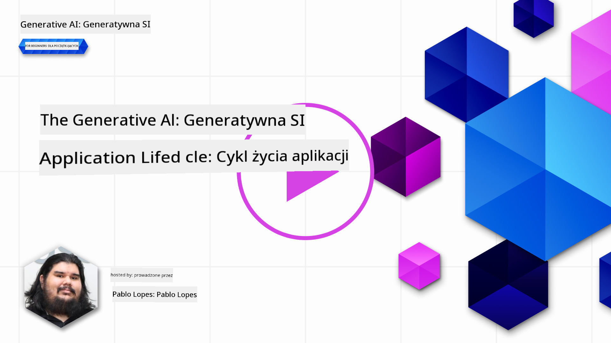
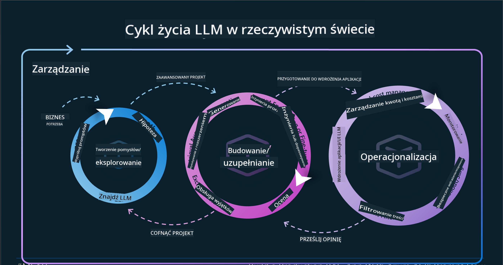
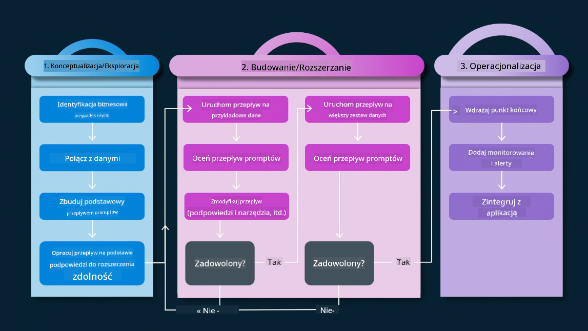
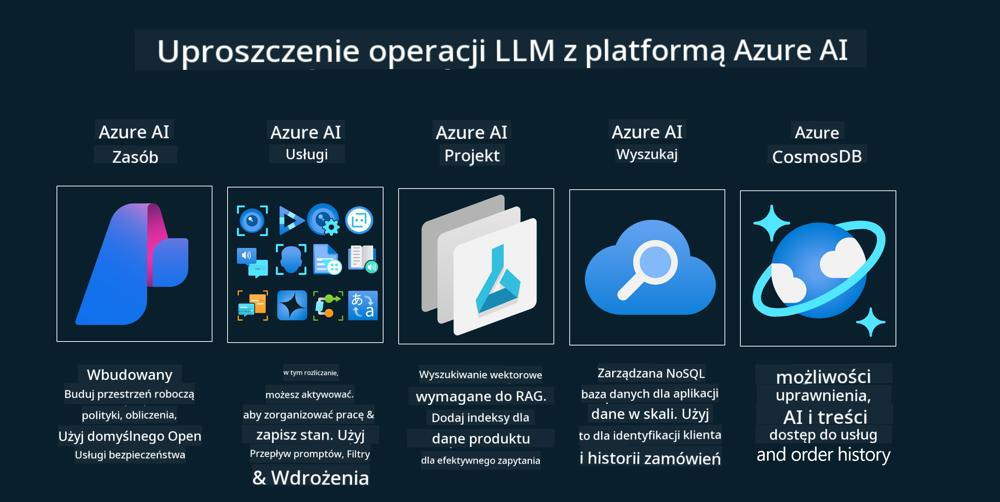
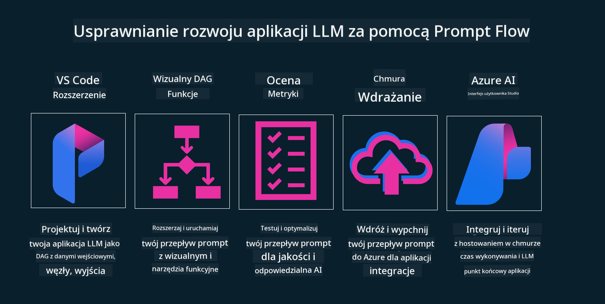

<!--
CO_OP_TRANSLATOR_METADATA:
{
  "original_hash": "27a5347a5022d5ef0a72ab029b03526a",
  "translation_date": "2025-05-19T23:26:53+00:00",
  "source_file": "14-the-generative-ai-application-lifecycle/README.md",
  "language_code": "pl"
}
-->

# Cykl życia aplikacji generatywnej AI

Ważnym pytaniem dla wszystkich aplikacji AI jest istotność funkcji AI, ponieważ AI to szybko rozwijająca się dziedzina. Aby zapewnić, że twoja aplikacja pozostaje istotna, niezawodna i solidna, musisz ją stale monitorować, oceniać i doskonalić. W tym miejscu pojawia się cykl życia generatywnej AI.

Cykl życia generatywnej AI to ramy, które prowadzą cię przez etapy tworzenia, wdrażania i utrzymywania aplikacji generatywnej AI. Pomaga ci zdefiniować cele, mierzyć wydajność, identyfikować wyzwania i wdrażać rozwiązania. Pomaga również dostosować aplikację do standardów etycznych i prawnych w twojej dziedzinie oraz oczekiwań interesariuszy. Przestrzegając cyklu życia generatywnej AI, możesz zapewnić, że twoja aplikacja zawsze dostarcza wartość i zadowala użytkowników.

## Wprowadzenie

W tym rozdziale:

- Zrozumiesz zmianę paradygmatu z MLOps na LLMOps
- Cykl życia LLM
- Narzędzia cyklu życia
- Metryfikacja i ocena cyklu życia

## Zrozum zmianę paradygmatu z MLOps na LLMOps

LLM to nowe narzędzie w arsenale sztucznej inteligencji, niezwykle potężne w zadaniach analizy i generacji dla aplikacji. Jednak ta moc ma pewne konsekwencje w tym, jak usprawniamy zadania AI i klasycznego uczenia maszynowego.

Z tego powodu potrzebujemy nowego paradygmatu, aby dostosować to narzędzie w dynamiczny sposób, z odpowiednimi bodźcami. Możemy kategoryzować starsze aplikacje AI jako "Aplikacje ML", a nowsze jako "Aplikacje GenAI" lub po prostu "Aplikacje AI", odzwierciedlając główne technologie i techniki używane w danym czasie. To zmienia naszą narrację na wiele sposobów, spójrz na poniższe porównanie.

Zauważ, że w LLMOps skupiamy się bardziej na twórcach aplikacji, wykorzystując integracje jako kluczowy punkt, korzystając z "Modeli jako usługi" i myśląc o następujących punktach dla metryk.

- Jakość: Jakość odpowiedzi
- Szkoda: Odpowiedzialna AI
- Uczciwość: Oparcie odpowiedzi (Czy ma sens? Czy jest poprawna?)
- Koszt: Budżet rozwiązania
- Opóźnienie: Średni czas odpowiedzi na token

## Cykl życia LLM

Aby zrozumieć cykl życia i jego modyfikacje, przyjrzyjmy się poniższej infografice.

Jak możesz zauważyć, różni się to od zwykłych cykli życia MLOps. LLM mają wiele nowych wymagań, takich jak Promowanie, różne techniki poprawy jakości (Fine-Tuning, RAG, Meta-Prompts), różne oceny i odpowiedzialność w zakresie odpowiedzialnej AI, a na końcu nowe metryki oceny (Jakość, Szkoda, Uczciwość, Koszt i Opóźnienie).

Na przykład, spójrz, jak wymyślamy. Używając inżynierii promptów do eksperymentowania z różnymi LLM, aby zbadać możliwości testowania, czy ich hipotezy mogą być poprawne.

Zauważ, że to nie jest liniowe, ale zintegrowane pętle, iteracyjne i z nadrzędnym cyklem.

Jak możemy eksplorować te kroki? Przejdźmy do szczegółów, jak możemy zbudować cykl życia.

Może to wyglądać nieco skomplikowanie, skupmy się najpierw na trzech dużych krokach.

1. Ideowanie/Eksplorowanie: Eksploracja, tutaj możemy badać zgodnie z naszymi potrzebami biznesowymi. Tworzenie prototypów, tworzenie [PromptFlow](https://microsoft.github.io/promptflow/index.html?WT.mc_id=academic-105485-koreyst) i testowanie, czy jest wystarczająco efektywne dla naszej hipotezy.
2. Budowanie/Uzupełnianie: Implementacja, teraz zaczynamy oceniać dla większych zestawów danych, wdrażać techniki, takie jak Fine-tuning i RAG, aby sprawdzić solidność naszego rozwiązania. Jeśli nie działa, ponowne wdrożenie, dodanie nowych kroków w naszym przepływie lub restrukturyzacja danych może pomóc. Po przetestowaniu naszego przepływu i skali, jeśli działa i sprawdzimy nasze metryki, jest gotowe do następnego kroku.
3. Operacjonalizacja: Integracja, teraz dodajemy systemy monitorowania i alertów do naszego systemu, wdrażanie i integrację aplikacji do naszej aplikacji.

Następnie mamy nadrzędny cykl zarządzania, skupiający się na bezpieczeństwie, zgodności i zarządzaniu.

Gratulacje, teraz twoja aplikacja AI jest gotowa do działania. Aby uzyskać praktyczne doświadczenie, spójrz na [Demo czatu Contoso.](https://nitya.github.io/contoso-chat/?WT.mc_id=academic-105485-koreys)

Teraz, jakie narzędzia możemy użyć?

## Narzędzia cyklu życia

Do narzędzi, Microsoft dostarcza [Azure AI Platform](https://azure.microsoft.com/solutions/ai/?WT.mc_id=academic-105485-koreys) i [PromptFlow](https://microsoft.github.io/promptflow/index.html?WT.mc_id=academic-105485-koreyst), które ułatwiają i sprawiają, że twój cykl jest łatwy do wdrożenia i gotowy do działania.

[Azure AI Platform](https://azure.microsoft.com/solutions/ai/?WT.mc_id=academic-105485-koreys) pozwala na korzystanie z [AI Studio](https://ai.azure.com/?WT.mc_id=academic-105485-koreys). AI Studio to portal internetowy, który pozwala na eksplorację modeli, próbek i narzędzi. Zarządzanie zasobami, przepływami rozwoju UI oraz opcjami SDK/CLI dla rozwoju opartego na kodzie.

Azure AI pozwala na korzystanie z wielu zasobów do zarządzania operacjami, usługami, projektami, wyszukiwaniem wektorowym i potrzebami baz danych.

Twórz, od Proof-of-Concept (POC) aż do aplikacji na dużą skalę z PromptFlow:

- Projektuj i twórz aplikacje z VS Code, z wizualnymi i funkcjonalnymi narzędziami
- Testuj i dopracowuj swoje aplikacje dla jakości AI, z łatwością.
- Używaj Azure AI Studio do integracji i iteracji z chmurą, wdrażaj i integruj szybko.

## Świetnie! Kontynuuj naukę!

Niesamowite, teraz dowiedz się więcej o tym, jak strukturyzujemy aplikację, aby używać koncepcji z [Aplikacją czatu Contoso](https://nitya.github.io/contoso-chat/?WT.mc_id=academic-105485-koreyst), aby zobaczyć, jak Cloud Advocacy dodaje te koncepcje w demonstracjach. Aby uzyskać więcej treści, sprawdź nasze [sesje na Ignite!
](https://www.youtube.com/watch?v=DdOylyrTOWg)

Teraz sprawdź Lekcję 15, aby zrozumieć, jak [Retrieval Augmented Generation i Bazy Danych Wektorowych](../15-rag-and-vector-databases/README.md?WT.mc_id=academic-105485-koreyst) wpływają na Generatywną AI i jak tworzyć bardziej angażujące aplikacje!

**Zastrzeżenie**:  
Ten dokument został przetłumaczony przy użyciu usługi tłumaczenia AI [Co-op Translator](https://github.com/Azure/co-op-translator). Chociaż staramy się zapewnić dokładność, prosimy mieć na uwadze, że automatyczne tłumaczenia mogą zawierać błędy lub nieścisłości. Oryginalny dokument w jego rodzimym języku powinien być uznawany za autorytatywne źródło. W przypadku istotnych informacji zalecane jest profesjonalne tłumaczenie przez człowieka. Nie ponosimy odpowiedzialności za jakiekolwiek nieporozumienia lub błędne interpretacje wynikające z użycia tego tłumaczenia.