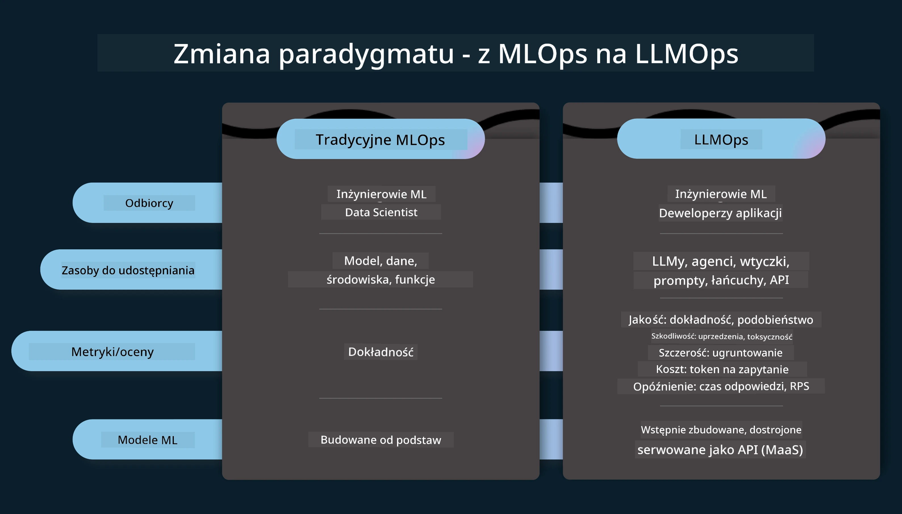
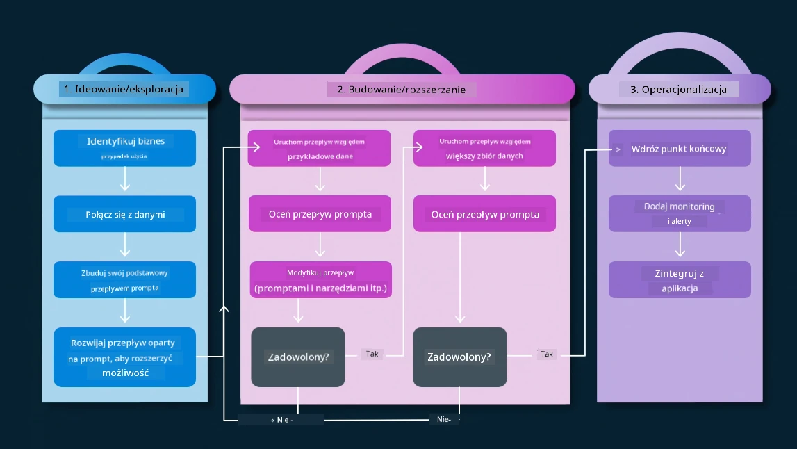
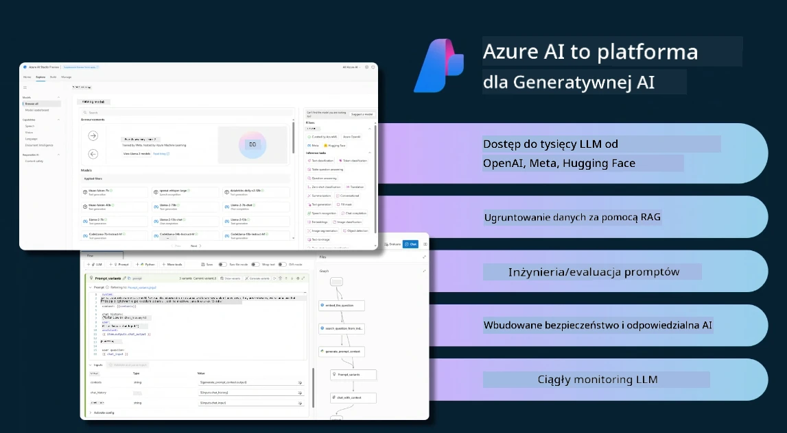
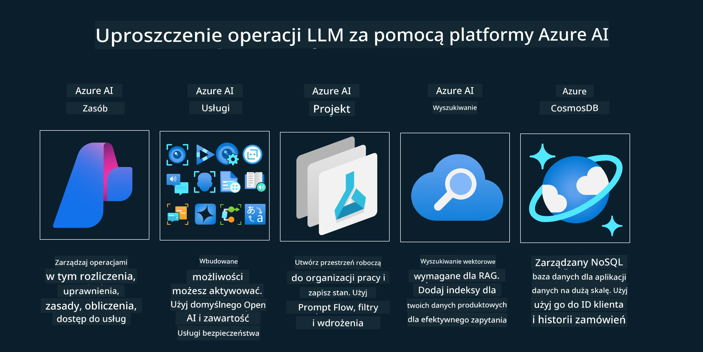
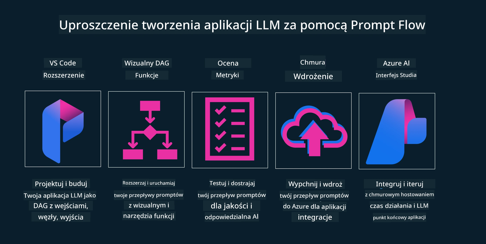

<!--
CO_OP_TRANSLATOR_METADATA:
{
  "original_hash": "df44972d5575ea8cef3c52ee31696d04",
  "translation_date": "2025-12-19T14:49:03+00:00",
  "source_file": "14-the-generative-ai-application-lifecycle/README.md",
  "language_code": "pl"
}
-->

# Cykl życia aplikacji generatywnej AI

Ważnym pytaniem dla wszystkich aplikacji AI jest trafność funkcji AI, ponieważ AI to szybko rozwijająca się dziedzina, aby zapewnić, że Twoja aplikacja pozostaje istotna, niezawodna i solidna, musisz ją stale monitorować, oceniać i ulepszać. Tutaj wchodzi w grę cykl życia generatywnej AI.

Cykl życia generatywnej AI to ramy, które prowadzą Cię przez etapy tworzenia, wdrażania i utrzymania aplikacji generatywnej AI. Pomaga zdefiniować cele, mierzyć wydajność, identyfikować wyzwania i wdrażać rozwiązania. Pomaga również dostosować aplikację do standardów etycznych i prawnych Twojej dziedziny oraz interesariuszy. Stosując się do cyklu życia generatywnej AI, możesz zapewnić, że Twoja aplikacja zawsze dostarcza wartość i zadowala użytkowników.

## Wprowadzenie

W tym rozdziale:

- Zrozumiesz zmianę paradygmatu z MLOps na LLMOps
- Cykl życia LLM
- Narzędzia cyklu życia
- Metryfikacja i ocena cyklu życia

## Zrozumienie zmiany paradygmatu z MLOps na LLMOps

LLM to nowe narzędzie w arsenale sztucznej inteligencji, są niezwykle potężne w zadaniach analizy i generowania dla aplikacji, jednak ta moc niesie ze sobą konsekwencje w sposobie usprawniania zadań AI i klasycznego uczenia maszynowego.

W związku z tym potrzebujemy nowego paradygmatu, aby dostosować to narzędzie dynamicznie, z odpowiednimi zachętami. Możemy kategoryzować starsze aplikacje AI jako "ML Apps", a nowsze jako "GenAI Apps" lub po prostu "AI Apps", odzwierciedlając dominujące technologie i techniki używane w danym czasie. To zmienia naszą narrację na wiele sposobów, spójrz na poniższe porównanie.

Zauważ, że w LLMOps skupiamy się bardziej na deweloperach aplikacji, używając integracji jako kluczowego punktu, korzystając z "Modeli jako usługi" i myśląc o następujących punktach metryk.

- Jakość: Jakość odpowiedzi
- Szkoda: Odpowiedzialna AI
- Uczciwość: Podstawy odpowiedzi (Czy ma sens? Czy jest poprawna?)
- Koszt: Budżet rozwiązania
- Opóźnienie: Średni czas odpowiedzi na token

## Cykl życia LLM

Najpierw, aby zrozumieć cykl życia i modyfikacje, spójrz na następującą infografikę.

Jak zauważysz, różni się to od zwykłych cykli życia w MLOps. LLM mają wiele nowych wymagań, takich jak promptowanie, różne techniki poprawy jakości (Fine-Tuning, RAG, Meta-Prompts), różne oceny i odpowiedzialność związana z odpowiedzialną AI, wreszcie nowe metryki oceny (Jakość, Szkoda, Uczciwość, Koszt i Opóźnienie).

Na przykład, spójrz jak generujemy pomysły. Używając inżynierii promptów do eksperymentowania z różnymi LLM, aby zbadać możliwości i przetestować, czy ich hipotezy mogą być poprawne.

Zauważ, że nie jest to proces liniowy, lecz zintegrowane pętle, iteracyjne i z nadrzędnym cyklem.

Jak możemy eksplorować te kroki? Przyjrzyjmy się szczegółowo, jak można zbudować cykl życia.

Może to wyglądać trochę skomplikowanie, skupmy się najpierw na trzech głównych krokach.

1. Generowanie pomysłów/Eksploracja: Eksploracja, tutaj możemy badać zgodnie z potrzebami biznesowymi. Prototypowanie, tworzenie [PromptFlow](https://microsoft.github.io/promptflow/index.html?WT.mc_id=academic-105485-koreyst) i testowanie, czy jest wystarczająco efektywne dla naszej hipotezy.
1. Budowanie/Wzmacnianie: Implementacja, teraz zaczynamy oceniać na większych zbiorach danych, wdrażać techniki, takie jak Fine-tuning i RAG, aby sprawdzić odporność naszego rozwiązania. Jeśli nie działa, ponowna implementacja, dodanie nowych kroków w naszym przepływie lub restrukturyzacja danych może pomóc. Po przetestowaniu przepływu i skali, jeśli działa i spełnia nasze metryki, jest gotowe do następnego kroku.
1. Operacjonalizacja: Integracja, teraz dodajemy systemy monitoringu i alertów do naszego systemu, wdrożenie i integrację aplikacji z naszą aplikacją.

Następnie mamy nadrzędny cykl zarządzania, skupiający się na bezpieczeństwie, zgodności i zarządzaniu.

Gratulacje, teraz Twoja aplikacja AI jest gotowa do działania i operacyjna. Aby zdobyć praktyczne doświadczenie, spójrz na [Demo czatu Contoso.](https://nitya.github.io/contoso-chat/?WT.mc_id=academic-105485-koreys)

A jakie narzędzia możemy użyć?

## Narzędzia cyklu życia

Do narzędzi Microsoft oferuje [Azure AI Platform](https://azure.microsoft.com/solutions/ai/?WT.mc_id=academic-105485-koreys) oraz [PromptFlow](https://microsoft.github.io/promptflow/index.html?WT.mc_id=academic-105485-koreyst), które ułatwiają i czynią cykl łatwym do wdrożenia i gotowym do użycia.

[Azure AI Platform](https://azure.microsoft.com/solutions/ai/?WT.mc_id=academic-105485-koreys) pozwala korzystać z [AI Studio](https://ai.azure.com/?WT.mc_id=academic-105485-koreys). AI Studio to portal internetowy, który pozwala eksplorować modele, przykłady i narzędzia. Zarządzać zasobami, przepływami UI oraz opcjami SDK/CLI dla rozwoju opartego na kodzie.

Azure AI pozwala korzystać z wielu zasobów do zarządzania operacjami, usługami, projektami, wyszukiwaniem wektorowym i potrzebami baz danych.

Buduj od Proof-of-Concept (POC) do aplikacji na dużą skalę z PromptFlow:

- Projektuj i twórz aplikacje z VS Code, korzystając z narzędzi wizualnych i funkcjonalnych
- Testuj i dostrajaj swoje aplikacje dla jakości AI, z łatwością.
- Używaj Azure AI Studio do integracji i iteracji z chmurą, wypychania i wdrażania dla szybkiej integracji.

## Świetnie! Kontynuuj naukę!

Niesamowite, teraz dowiedz się więcej o tym, jak strukturyzujemy aplikację, aby używać tych koncepcji z [Contoso Chat App](https://nitya.github.io/contoso-chat/?WT.mc_id=academic-105485-koreyst), aby zobaczyć, jak Cloud Advocacy dodaje te koncepcje w demonstracjach. Aby uzyskać więcej treści, sprawdź naszą [sesję Ignite!
](https://www.youtube.com/watch?v=DdOylyrTOWg)

Teraz sprawdź Lekcję 15, aby zrozumieć, jak [Retrieval Augmented Generation i bazy danych wektorowych](../15-rag-and-vector-databases/README.md?WT.mc_id=academic-105485-koreyst) wpływają na generatywną AI i tworzą bardziej angażujące aplikacje!

---

<!-- CO-OP TRANSLATOR DISCLAIMER START -->
**Zastrzeżenie**:  
Niniejszy dokument został przetłumaczony za pomocą usługi tłumaczenia AI [Co-op Translator](https://github.com/Azure/co-op-translator). Mimo że dokładamy starań, aby tłumaczenie było jak najbardziej precyzyjne, prosimy mieć na uwadze, że automatyczne tłumaczenia mogą zawierać błędy lub nieścisłości. Oryginalny dokument w języku źródłowym powinien być uznawany za źródło autorytatywne. W przypadku informacji krytycznych zalecane jest skorzystanie z profesjonalnego tłumaczenia wykonanego przez człowieka. Nie ponosimy odpowiedzialności za jakiekolwiek nieporozumienia lub błędne interpretacje wynikające z korzystania z tego tłumaczenia.
<!-- CO-OP TRANSLATOR DISCLAIMER END -->