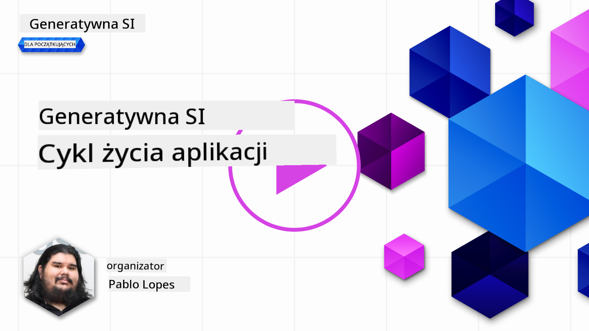
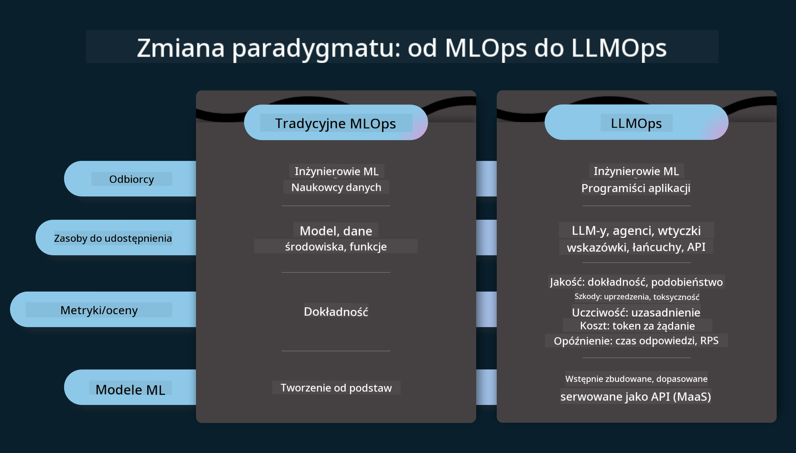
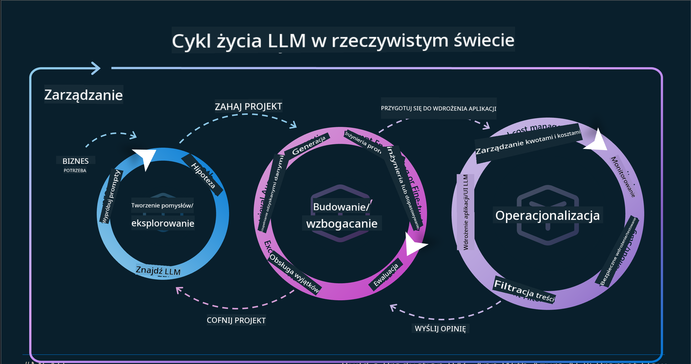
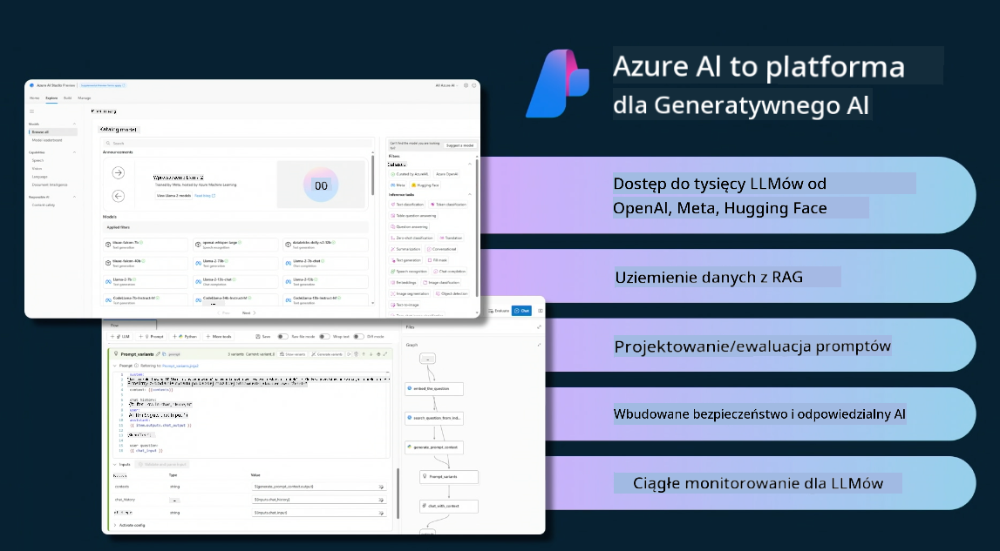
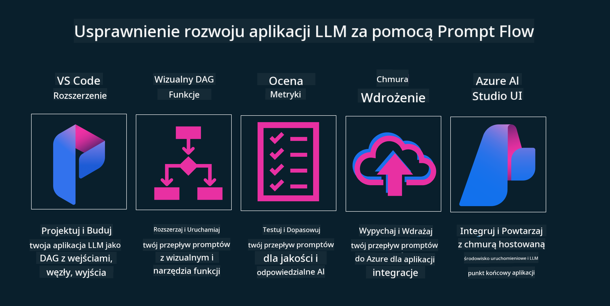

<!--
CO_OP_TRANSLATOR_METADATA:
{
  "original_hash": "27a5347a5022d5ef0a72ab029b03526a",
  "translation_date": "2025-06-25T22:02:38+00:00",
  "source_file": "14-the-generative-ai-application-lifecycle/README.md",
  "language_code": "pl"
}
-->

# Cykl życia aplikacji z generatywną AI

Ważnym pytaniem dla wszystkich aplikacji AI jest adekwatność funkcji AI, ponieważ AI to szybko rozwijająca się dziedzina. Aby zapewnić, że Twoja aplikacja pozostaje istotna, niezawodna i solidna, musisz ją stale monitorować, oceniać i ulepszać. Tutaj wkracza cykl życia generatywnej AI.

Cykl życia generatywnej AI to ramy, które prowadzą Cię przez etapy tworzenia, wdrażania i utrzymania aplikacji generatywnej AI. Pomaga określić cele, mierzyć wydajność, identyfikować wyzwania i wdrażać rozwiązania. Pomaga także dostosować aplikację do standardów etycznych i prawnych Twojej domeny oraz interesariuszy. Dzięki przestrzeganiu cyklu życia generatywnej AI możesz zapewnić, że Twoja aplikacja zawsze dostarcza wartości i satysfakcjonuje użytkowników.

## Wprowadzenie

W tym rozdziale dowiesz się:

- Zrozumieć zmianę paradygmatu z MLOps na LLMOps
- Cykl życia LLM
- Narzędzia do cyklu życia
- Metryfikacja i ocena cyklu życia

## Zrozumieć zmianę paradygmatu z MLOps na LLMOps

LLM to nowe narzędzie w arsenale sztucznej inteligencji, które jest niezwykle potężne w zadaniach analizy i generowania dla aplikacji. Jednak ta moc ma pewne konsekwencje w usprawnianiu zadań AI i klasycznego uczenia maszynowego.

W związku z tym potrzebujemy nowego paradygmatu, aby dostosować to narzędzie w dynamiczny sposób, z odpowiednimi zachętami. Możemy kategoryzować starsze aplikacje AI jako "Aplikacje ML", a nowsze jako "Aplikacje GenAI" lub po prostu "Aplikacje AI", odzwierciedlając dominującą technologię i techniki używane w danym czasie. To zmienia naszą narrację na wiele sposobów, spójrz na poniższe porównanie.

Zauważ, że w LLMOps skupiamy się bardziej na deweloperach aplikacji, używając integracji jako kluczowego punktu, korzystając z "Modeli jako usługi" i myśląc o następujących punktach dla metryk.

- Jakość: Jakość odpowiedzi
- Szkoda: Odpowiedzialna AI
- Uczciwość: Uzasadnienie odpowiedzi (Czy to ma sens? Czy jest poprawne?)
- Koszt: Budżet rozwiązania
- Opóźnienie: Średni czas odpowiedzi tokena

## Cykl życia LLM

Najpierw, aby zrozumieć cykl życia i modyfikacje, spójrzmy na następną infografikę.

Jak możesz zauważyć, różni się to od zwykłych cykli życia z MLOps. LLM mają wiele nowych wymagań, takich jak Podpowiadanie, różne techniki poprawy jakości (Dostrajanie, RAG, Meta-Podpowiedzi), różna ocena i odpowiedzialność z odpowiedzialną AI, wreszcie nowe metryki oceny (Jakość, Szkoda, Uczciwość, Koszt i Opóźnienie).

Na przykład, spójrz na to, jak generujemy pomysły. Używając inżynierii podpowiedzi do eksperymentowania z różnymi LLM w celu zbadania możliwości przetestowania, czy ich hipoteza może być poprawna.

Zauważ, że to nie jest liniowe, ale zintegrowane pętle, iteracyjne i z ogólnym cyklem.

Jak możemy zbadać te kroki? Przejdźmy do szczegółów, jak możemy zbudować cykl życia.

To może wyglądać trochę skomplikowanie, skupmy się najpierw na trzech dużych krokach.

1. Generowanie pomysłów/Eksploracja: Eksploracja, tutaj możemy badać zgodnie z naszymi potrzebami biznesowymi. Prototypowanie, tworzenie [PromptFlow](https://microsoft.github.io/promptflow/index.html?WT.mc_id=academic-105485-koreyst) i testowanie, czy jest wystarczająco wydajne dla naszej hipotezy.
2. Budowanie/Zwiększanie: Implementacja, teraz zaczynamy oceniać dla większych zbiorów danych, wdrażamy techniki, takie jak Dostrajanie i RAG, aby sprawdzić solidność naszego rozwiązania. Jeśli nie, ponowne wdrożenie, dodanie nowych kroków w naszym przepływie lub restrukturyzacja danych, może pomóc. Po przetestowaniu naszego przepływu i naszej skali, jeśli działa i sprawdza nasze metryki, jest gotowe do następnego kroku.
3. Operacjonalizacja: Integracja, teraz dodajemy systemy monitorowania i alertów do naszego systemu, wdrażanie i integracja aplikacji do naszej aplikacji.

Następnie mamy ogólny cykl zarządzania, skupiający się na bezpieczeństwie, zgodności i zarządzaniu.

Gratulacje, teraz masz gotową do działania aplikację AI. Aby zdobyć praktyczne doświadczenie, spójrz na [Demo czatu Contoso.](https://nitya.github.io/contoso-chat/?WT.mc_id=academic-105485-koreys)

Jakie narzędzia możemy teraz użyć?

## Narzędzia do cyklu życia

Do narzędzi Microsoft oferuje [Platformę Azure AI](https://azure.microsoft.com/solutions/ai/?WT.mc_id=academic-105485-koreys) oraz [PromptFlow](https://microsoft.github.io/promptflow/index.html?WT.mc_id=academic-105485-koreyst), które ułatwiają i sprawiają, że Twój cykl jest łatwy do wdrożenia i gotowy do działania.

[Platforma Azure AI](https://azure.microsoft.com/solutions/ai/?WT.mc_id=academic-105485-koreys) pozwala korzystać z [AI Studio](https://ai.azure.com/?WT.mc_id=academic-105485-koreys). AI Studio to portal internetowy, który pozwala eksplorować modele, próbki i narzędzia. Zarządzać zasobami, przepływami rozwoju UI oraz opcjami SDK/CLI dla rozwoju opartego na kodzie.

Azure AI pozwala korzystać z wielu zasobów, zarządzać operacjami, usługami, projektami, wyszukiwaniem wektorowym i potrzebami baz danych.

Konstrukcja, od Proof-of-Concept (POC) aż po aplikacje na dużą skalę z PromptFlow:

- Projektowanie i budowanie aplikacji z VS Code, z narzędziami wizualnymi i funkcjonalnymi
- Testowanie i dostrajanie aplikacji dla jakości AI, z łatwością.
- Korzystanie z Azure AI Studio do integracji i iteracji z chmurą, wdrażanie i szybka integracja.

## Świetnie! Kontynuuj naukę!

Niesamowite, teraz dowiedz się więcej o tym, jak strukturyzujemy aplikację, aby używać koncepcji z [Aplikacją czatu Contoso](https://nitya.github.io/contoso-chat/?WT.mc_id=academic-105485-koreyst), aby zobaczyć, jak Cloud Advocacy dodaje te koncepcje w demonstracjach. Aby uzyskać więcej treści, sprawdź naszą [sesję breakout na Ignite!
](https://www.youtube.com/watch?v=DdOylyrTOWg)

Teraz sprawdź Lekcję 15, aby zrozumieć, jak [Retrieval Augmented Generation i bazy danych wektorowych](../15-rag-and-vector-databases/README.md?WT.mc_id=academic-105485-koreyst) wpływają na generatywną AI i tworzą bardziej angażujące aplikacje!

**Zastrzeżenie**:  
Ten dokument został przetłumaczony za pomocą usługi tłumaczenia AI [Co-op Translator](https://github.com/Azure/co-op-translator). Chociaż staramy się zapewnić dokładność, prosimy pamiętać, że automatyczne tłumaczenia mogą zawierać błędy lub nieścisłości. Oryginalny dokument w jego rodzimym języku powinien być uważany za źródło autorytatywne. W przypadku informacji krytycznych zalecane jest profesjonalne tłumaczenie przez człowieka. Nie ponosimy odpowiedzialności za jakiekolwiek nieporozumienia lub błędne interpretacje wynikające z użycia tego tłumaczenia.