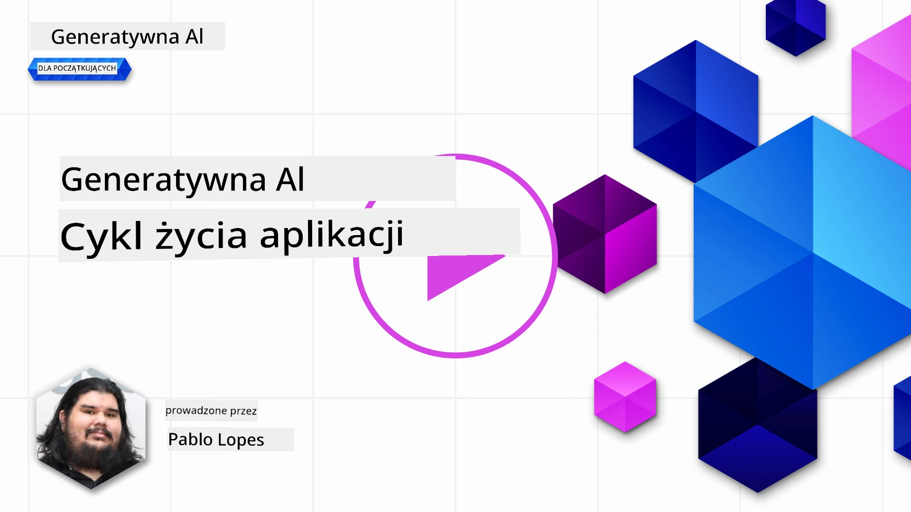
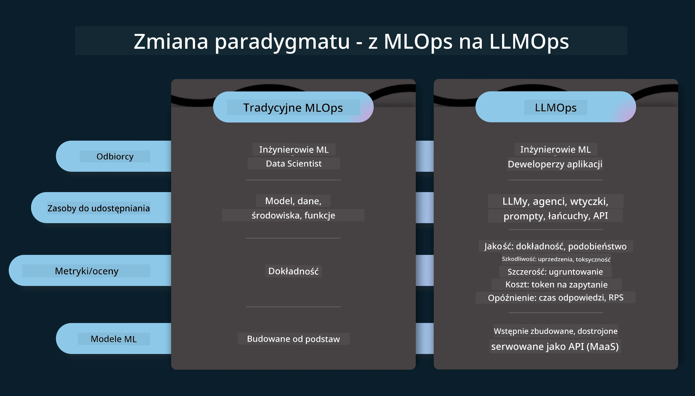
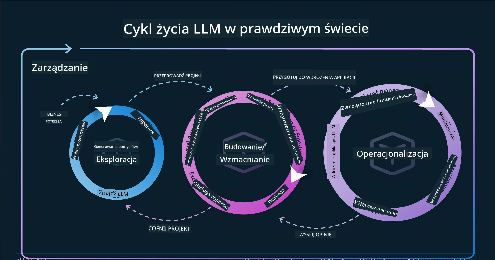
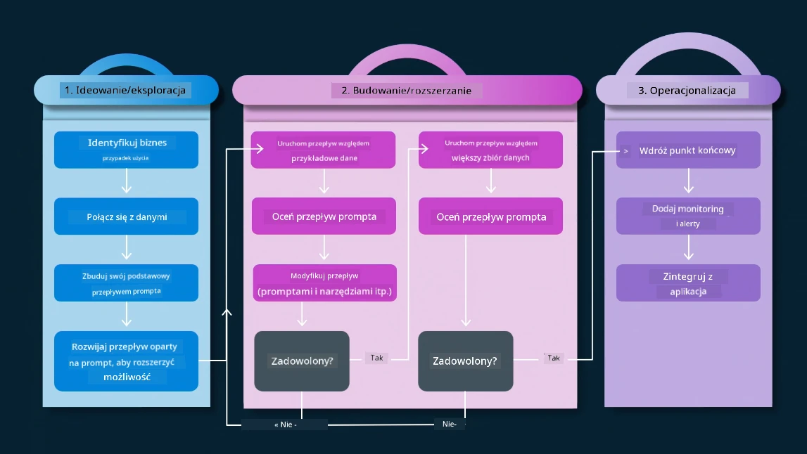
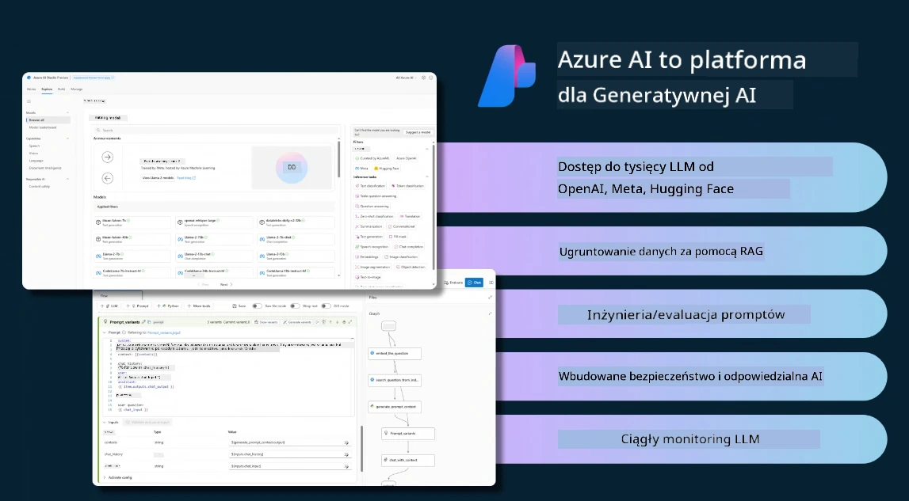
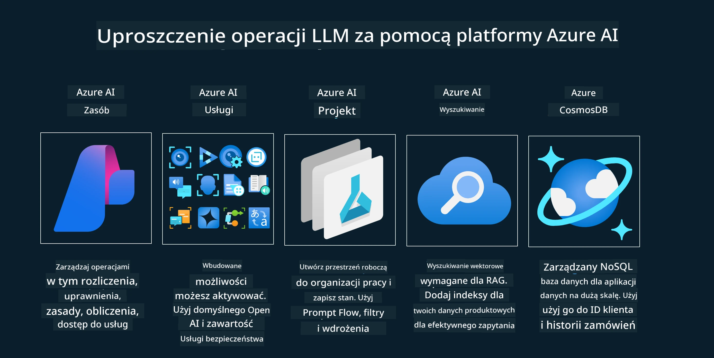
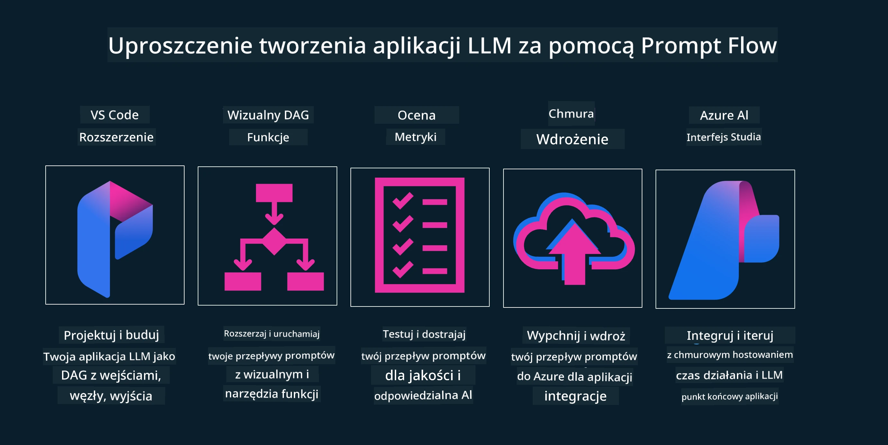

# Cykl życia aplikacji generatywnej AI

Ważnym pytaniem dla wszystkich aplikacji AI jest istotność funkcji AI, ponieważ AI to szybko rozwijająca się dziedzina, aby zapewnić, że Twoja aplikacja pozostanie istotna, niezawodna i solidna, musisz ją stale monitorować, oceniać i ulepszać. Tutaj wchodzi w grę cykl życia generatywnej AI.

Cykl życia generatywnej AI to ramy, które prowadzą Cię przez etapy opracowywania, wdrażania i utrzymania aplikacji generatywnej AI. Pomaga zdefiniować cele, mierzyć wydajność, identyfikować wyzwania i wdrażać rozwiązania. Pomaga również dostosować aplikację do standardów etycznych i prawnych Twojej dziedziny oraz interesariuszy. Podążając za cyklem życia generatywnej AI, możesz zapewnić, że Twoja aplikacja zawsze dostarcza wartości i spełnia oczekiwania użytkowników.

## Wprowadzenie

W tym rozdziale:

- Zrozumiesz zmianę paradygmatu z MLOps na LLMOps
- Cykl życia LLM
- Narzędzia do cyklu życia
- Metryfikacja i ewaluacja cyklu życia

## Zrozumienie zmiany paradygmatu z MLOps na LLMOps

LLM to nowe narzędzie w arsenale Sztucznej Inteligencji, są one niezwykle potężne w zadaniach analizy i generowania dla aplikacji, jednak ta moc niesie ze sobą pewne konsekwencje w sposobie usprawniania AI i klasycznych zadań uczenia maszynowego.

W związku z tym potrzebujemy nowego paradygmatu do adaptacji tego narzędzia w sposób dynamiczny, z właściwymi zachętami. Możemy kategoryzować starsze aplikacje AI jako „aplikacje ML”, a nowsze aplikacje AI jako „aplikacje GenAI” lub po prostu „aplikacje AI”, odzwierciedlając używaną w danym czasie technologię i techniki. Ta zmiana przesuwa naszą narrację na wiele sposobów, zobacz poniższe porównanie.

Zauważ, że w LLMOps skupiamy się bardziej na twórcach aplikacji, wykorzystując integracje jako kluczowy punkt, korzystając z „Modeli jako usługi” oraz myśląc o następujących punktach dla metryk.

- Jakość: Jakość odpowiedzi
- Szkoda: Odpowiedzialna AI
- Szczerość: Ugruntowanie odpowiedzi (Czy ma sens? Czy jest poprawna?)
- Koszt: Budżet rozwiązania
- Opóźnienie: Średni czas odpowiedzi na token

## Cykl życia LLM

Najpierw, aby zrozumieć cykl życia i modyfikacje, zwróć uwagę na poniższą infografikę.

Jak możesz zauważyć, różni się to od typowych cykli życia w MLOps. LLM mają wiele nowych wymagań, takich jak Prompting, różne techniki poprawy jakości (Fine-Tuning, RAG, Meta-Prompts), różne oceny i odpowiedzialność w zakresie odpowiedzialnej AI, oraz nowe metryki ewaluacyjne (Jakość, Szkoda, Szczerość, Koszt i Opóźnienie).

Na przykład spójrz, jak generujemy pomysły. Używamy inżynierii promptów do eksperymentowania z różnymi LLM, aby eksplorować możliwości i sprawdzić, czy ich hipoteza może być prawidłowa.

Zauważ, że nie jest to proces liniowy, lecz zintegrowane pętle iteracyjne z nadrzędnym cyklem.

Jak możemy eksplorować te kroki? Przyjrzyjmy się szczegółowo, jak można zbudować cykl życia.

Może to wyglądać nieco skomplikowanie, skupmy się najpierw na trzech dużych krokach.

1. Generowanie pomysłów/eksploracja: Eksploracja, tutaj możemy badać zgodnie z potrzebami biznesowymi. Prototypowanie, tworzenie [PromptFlow](https://microsoft.github.io/promptflow/index.html?WT.mc_id=academic-105485-koreyst) i testowanie, czy jest wystarczająco efektywne dla naszej hipotezy.
1. Budowanie/rozszerzanie: Implementacja, teraz zaczynamy oceniać na większych zbiorach danych, stosujemy techniki, takie jak fine-tuning i RAG, aby sprawdzić solidność rozwiązania. Jeśli nie działa, ponowna implementacja, dodanie nowych kroków w przepływie lub restrukturyzacja danych może pomóc. Po przetestowaniu przepływu i skali, jeśli działa i spełnia nasze metryki, jest gotowe na następny etap.
1. Operacjonalizacja: Integracja, teraz dodajemy systemy monitorowania i alertów, wdrożenie i integrację aplikacji z naszą aplikacją.

Następnie mamy nadrzędny cykl zarządzania, skupiający się na bezpieczeństwie, zgodności i zarządzaniu.

Gratulacje, teraz masz gotową i działającą aplikację AI. Dla praktycznego doświadczenia zobacz [Contoso Chat Demo.](https://nitya.github.io/contoso-chat/?WT.mc_id=academic-105485-koreyst)

A jakie narzędzia możemy użyć?

## Narzędzia do cyklu życia

Microsoft udostępnia [Azure AI Platform](https://azure.microsoft.com/solutions/ai/?WT.mc_id=academic-105485-koreyst) oraz [PromptFlow](https://microsoft.github.io/promptflow/index.html?WT.mc_id=academic-105485-koreyst), które ułatwiają i umożliwiają łatwą implementację cyklu.

[Azure AI Platform](https://azure.microsoft.com/solutions/ai/?WT.mc_id=academic-105485-koreyst) pozwala korzystać z [AI Studio](https://ai.azure.com/?WT.mc_id=academic-105485-koreyst). AI Studio to portal webowy, który umożliwia eksplorację modeli, przykładów i narzędzi. Zarządzanie zasobami, przepływami UI oraz opcje SDK/CLI dla programowania z kodem.

Azure AI umożliwia korzystanie z wielu zasobów do zarządzania operacjami, usługami, projektami, wyszukiwaniem wektorowym i potrzebami baz danych.

Buduj od Proof-of-Concept (POC) do dużych zastosowań z PromptFlow:

- Projektuj i buduj aplikacje z VS Code, z narzędziami wizualnymi i funkcjonalnymi
- Testuj i dostrajaj swoje aplikacje pod kątem jakości AI, z łatwością.
- Używaj Azure AI Studio do integracji i iteracji z chmurą, Push i Deploy dla szybkiej integracji.

## Świetnie! Kontynuuj naukę!

Niesamowicie, teraz dowiedz się więcej o strukturze aplikacji, aby wykorzystać te koncepcje z [Contoso Chat App](https://nitya.github.io/contoso-chat/?WT.mc_id=academic-105485-koreyst), aby zobaczyć, jak Cloud Advocacy wprowadza te pojęcia w demonstracjach. Więcej materiałów znajdziesz na naszej sesji [Ignite breakout session!
](https://www.youtube.com/watch?v=DdOylyrTOWg)

Teraz zobacz Lekcję 15, aby zrozumieć, jak [Retrieval Augmented Generation i bazy danych wektorowych](../15-rag-and-vector-databases/README.md?WT.mc_id=academic-105485-koreyst) wpływają na Generatywną AI i tworzą bardziej angażujące aplikacje!

---

<!-- CO-OP TRANSLATOR DISCLAIMER START -->
**Zastrzeżenie**:  
Niniejszy dokument został przetłumaczony za pomocą usługi tłumaczenia AI [Co-op Translator](https://github.com/Azure/co-op-translator). Mimo że dążymy do jak największej dokładności, prosimy pamiętać, że tłumaczenia automatyczne mogą zawierać błędy lub niedokładności. Oryginalny dokument w języku źródłowym należy traktować jako źródło autorytatywne. W przypadku informacji krytycznych zalecane jest skorzystanie z profesjonalnego tłumaczenia wykonanego przez człowieka. Nie ponosimy odpowiedzialności za jakiekolwiek nieporozumienia lub błędne interpretacje wynikające z korzystania z tego tłumaczenia.
<!-- CO-OP TRANSLATOR DISCLAIMER END -->