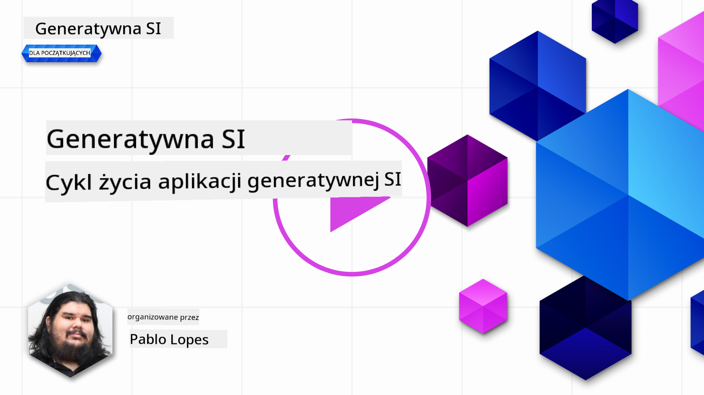

<!--
CO_OP_TRANSLATOR_METADATA:
{
  "original_hash": "27a5347a5022d5ef0a72ab029b03526a",
  "translation_date": "2025-07-09T15:52:47+00:00",
  "source_file": "14-the-generative-ai-application-lifecycle/README.md",
  "language_code": "pl"
}
-->

# Cykl życia aplikacji generatywnej AI

Ważnym pytaniem dla wszystkich aplikacji AI jest trafność funkcji AI, ponieważ AI to szybko rozwijająca się dziedzina. Aby Twoja aplikacja pozostała aktualna, niezawodna i solidna, musisz ją nieustannie monitorować, oceniać i ulepszać. W tym właśnie pomaga cykl życia generatywnej AI.

Cykl życia generatywnej AI to ramy, które prowadzą Cię przez etapy tworzenia, wdrażania i utrzymania aplikacji generatywnej AI. Pomaga określić cele, mierzyć wyniki, identyfikować wyzwania i wdrażać rozwiązania. Pomaga także dostosować aplikację do standardów etycznych i prawnych Twojej dziedziny oraz interesariuszy. Stosując się do cyklu życia generatywnej AI, możesz mieć pewność, że Twoja aplikacja zawsze dostarcza wartość i zadowala użytkowników.

## Wprowadzenie

W tym rozdziale:

- Zrozumiesz zmianę paradygmatu z MLOps na LLMOps
- Poznasz cykl życia LLM
- Narzędzia wspierające cykl życia
- Metryfikację i ocenę cyklu życia

## Zrozumienie zmiany paradygmatu z MLOps na LLMOps

LLM to nowe narzędzie w arsenale sztucznej inteligencji, niezwykle potężne w zadaniach analizy i generowania dla aplikacji, jednak ta moc niesie ze sobą konsekwencje w sposobie usprawniania zadań AI i klasycznego uczenia maszynowego.

W związku z tym potrzebujemy nowego paradygmatu, aby dostosować to narzędzie w dynamiczny sposób, z odpowiednimi zachętami. Możemy podzielić starsze aplikacje AI na „ML Apps”, a nowsze na „GenAI Apps” lub po prostu „AI Apps”, odzwierciedlając dominujące technologie i techniki stosowane w danym czasie. To przesuwa naszą narrację na wiele sposobów, spójrz na poniższe porównanie.

Zauważ, że w LLMOps skupiamy się bardziej na deweloperach aplikacji, wykorzystując integracje jako kluczowy punkt, stosując „Modele jako usługa” i myśląc o następujących metrykach.

- Jakość: Jakość odpowiedzi
- Szkoda: Odpowiedzialna AI
- Uczciwość: Podstawa odpowiedzi (Czy ma sens? Czy jest poprawna?)
- Koszt: Budżet rozwiązania
- Opóźnienie: Średni czas odpowiedzi na token

## Cykl życia LLM

Na początek, aby zrozumieć cykl życia i jego modyfikacje, spójrz na poniższą infografikę.

Jak zauważysz, różni się ona od standardowych cykli życia w MLOps. LLM mają wiele nowych wymagań, takich jak promptowanie, różne techniki poprawy jakości (Fine-Tuning, RAG, Meta-Prompts), inne podejście do oceny i odpowiedzialności w kontekście odpowiedzialnej AI, a także nowe metryki oceny (Jakość, Szkoda, Uczciwość, Koszt i Opóźnienie).

Na przykład, spójrz jak generujemy pomysły. Używając inżynierii promptów, eksperymentujemy z różnymi LLM, aby zbadać możliwości i sprawdzić, czy ich hipotezy mogą być prawdziwe.

Zauważ, że nie jest to proces liniowy, lecz zintegrowane pętle, iteracyjne i z nadrzędnym cyklem.

Jak możemy eksplorować te kroki? Przyjrzyjmy się szczegółowo, jak zbudować cykl życia.

Może to wyglądać trochę skomplikowanie, skupmy się najpierw na trzech głównych etapach.

1. Generowanie pomysłów/Eksploracja: Eksploracja, tutaj możemy badać zgodnie z potrzebami biznesowymi. Prototypowanie, tworzenie [PromptFlow](https://microsoft.github.io/promptflow/index.html?WT.mc_id=academic-105485-koreyst) i testowanie, czy jest wystarczająco efektywne dla naszej hipotezy.
1. Budowanie/Ulepszanie: Implementacja, teraz zaczynamy oceniać na większych zbiorach danych, wdrażamy techniki takie jak Fine-tuning i RAG, aby sprawdzić odporność naszego rozwiązania. Jeśli nie działa, ponowna implementacja, dodanie nowych kroków w przepływie lub restrukturyzacja danych może pomóc. Po przetestowaniu przepływu i skali, jeśli działa i spełnia nasze metryki, jest gotowe do kolejnego kroku.
1. Operacjonalizacja: Integracja, teraz dodajemy systemy monitoringu i alertów, wdrażamy i integrujemy aplikację.

Następnie mamy nadrzędny cykl zarządzania, skupiający się na bezpieczeństwie, zgodności i zarządzaniu.

Gratulacje, teraz Twoja aplikacja AI jest gotowa do działania i operacyjna. Aby zdobyć praktyczne doświadczenie, zobacz [Contoso Chat Demo.](https://nitya.github.io/contoso-chat/?WT.mc_id=academic-105485-koreys)

A jakie narzędzia możemy wykorzystać?

## Narzędzia wspierające cykl życia

Microsoft oferuje [Azure AI Platform](https://azure.microsoft.com/solutions/ai/?WT.mc_id=academic-105485-koreys) oraz [PromptFlow](https://microsoft.github.io/promptflow/index.html?WT.mc_id=academic-105485-koreyst), które ułatwiają i upraszczają wdrażanie cyklu życia.

[Azure AI Platform](https://azure.microsoft.com/solutions/ai/?WT.mc_id=academic-105485-koreys) pozwala korzystać z [AI Studio](https://ai.azure.com/?WT.mc_id=academic-105485-koreys). AI Studio to portal internetowy umożliwiający eksplorację modeli, przykładów i narzędzi. Zarządzanie zasobami, tworzenie przepływów UI oraz opcje SDK/CLI dla programistów preferujących kod.

Azure AI pozwala korzystać z wielu zasobów do zarządzania operacjami, usługami, projektami, wyszukiwaniem wektorowym i bazami danych.

Buduj od Proof-of-Concept (POC) aż po aplikacje na dużą skalę z PromptFlow:

- Projektuj i twórz aplikacje z VS Code, korzystając z narzędzi wizualnych i funkcjonalnych
- Testuj i dostrajaj aplikacje, aby uzyskać wysoką jakość AI, łatwo i szybko
- Korzystaj z Azure AI Studio, aby integrować i iterować w chmurze, wypychać i wdrażać dla szybkiej integracji

## Świetnie! Kontynuuj naukę!

Fantastycznie, teraz dowiedz się więcej o tym, jak strukturyzujemy aplikację, aby wykorzystać te koncepcje na przykładzie [Contoso Chat App](https://nitya.github.io/contoso-chat/?WT.mc_id=academic-105485-koreyst), aby zobaczyć, jak Cloud Advocacy wprowadza te koncepcje w demonstracjach. Po więcej materiałów sprawdź naszą [sesję Ignite!](https://www.youtube.com/watch?v=DdOylyrTOWg)

Teraz przejdź do Lekcji 15, aby zrozumieć, jak [Retrieval Augmented Generation i bazy danych wektorowych](../15-rag-and-vector-databases/README.md?WT.mc_id=academic-105485-koreyst) wpływają na Generatywną AI i jak tworzyć bardziej angażujące aplikacje!

**Zastrzeżenie**:  
Niniejszy dokument został przetłumaczony za pomocą usługi tłumaczenia AI [Co-op Translator](https://github.com/Azure/co-op-translator). Chociaż dokładamy starań, aby tłumaczenie było jak najbardziej precyzyjne, prosimy mieć na uwadze, że automatyczne tłumaczenia mogą zawierać błędy lub nieścisłości. Oryginalny dokument w języku źródłowym należy traktować jako źródło wiążące. W przypadku informacji o kluczowym znaczeniu zalecane jest skorzystanie z profesjonalnego tłumaczenia wykonanego przez człowieka. Nie ponosimy odpowiedzialności za jakiekolwiek nieporozumienia lub błędne interpretacje wynikające z korzystania z tego tłumaczenia.