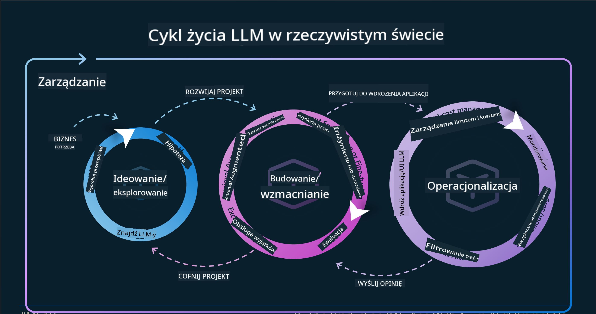
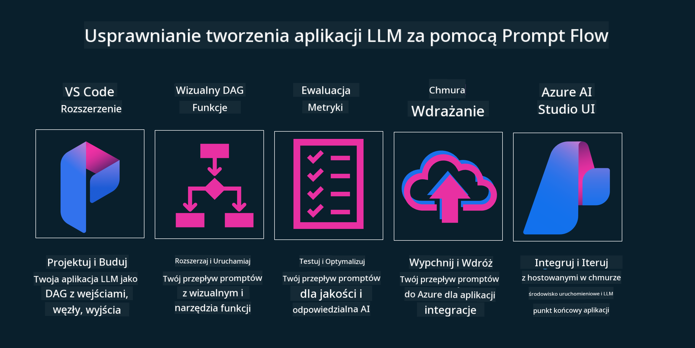

<!--
CO_OP_TRANSLATOR_METADATA:
{
  "original_hash": "b9d32511b27373a1b21b5789d4fda057",
  "translation_date": "2025-10-18T00:55:48+00:00",
  "source_file": "14-the-generative-ai-application-lifecycle/README.md",
  "language_code": "pl"
}
-->

# Cykl życia aplikacji generatywnej AI

Ważnym pytaniem dotyczącym wszystkich aplikacji AI jest ich aktualność, ponieważ sztuczna inteligencja to dziedzina szybko się rozwijająca. Aby Twoja aplikacja pozostała aktualna, niezawodna i solidna, musisz ją stale monitorować, oceniać i ulepszać. Właśnie tutaj wkracza cykl życia generatywnej AI.

Cykl życia generatywnej AI to ramy, które prowadzą Cię przez etapy tworzenia, wdrażania i utrzymania aplikacji generatywnej AI. Pomaga określić cele, mierzyć wydajność, identyfikować wyzwania i wdrażać rozwiązania. Pomaga również dostosować aplikację do standardów etycznych i prawnych w Twojej dziedzinie oraz oczekiwań interesariuszy. Dzięki przestrzeganiu cyklu życia generatywnej AI możesz zapewnić, że Twoja aplikacja zawsze dostarcza wartość i zadowala użytkowników.

## Wprowadzenie

W tym rozdziale dowiesz się:

- Jak zrozumieć zmianę paradygmatu z MLOps na LLMOps
- Cykl życia LLM
- Narzędzia wspierające cykl życia
- Metryki i ocena cyklu życia

## Zrozumienie zmiany paradygmatu z MLOps na LLMOps

LLM to nowe narzędzie w arsenale sztucznej inteligencji, niezwykle potężne w zadaniach analizy i generowania dla aplikacji. Jednak ta moc niesie ze sobą konsekwencje w sposobie optymalizacji zadań AI i klasycznego uczenia maszynowego.

W związku z tym potrzebujemy nowego paradygmatu, aby dostosować to narzędzie w dynamiczny sposób, z odpowiednimi bodźcami. Starsze aplikacje AI możemy kategoryzować jako "aplikacje ML", a nowsze jako "aplikacje GenAI" lub po prostu "aplikacje AI", odzwierciedlając dominujące technologie i techniki używane w danym czasie. To zmienia naszą narrację na wiele sposobów, spójrz na poniższe porównanie.

Zauważ, że w LLMOps bardziej skupiamy się na deweloperach aplikacji, wykorzystując integracje jako kluczowy punkt, korzystając z "Modeli jako usługi" i uwzględniając następujące punkty dla metryk:

- Jakość: jakość odpowiedzi
- Szkody: odpowiedzialna AI
- Uczciwość: ugruntowanie odpowiedzi (Czy ma sens? Czy jest poprawna?)
- Koszt: budżet rozwiązania
- Opóźnienie: średni czas odpowiedzi na token

## Cykl życia LLM

Najpierw, aby zrozumieć cykl życia i jego modyfikacje, zwróć uwagę na poniższą infografikę.

Jak możesz zauważyć, różni się to od zwykłych cykli życia w MLOps. LLM mają wiele nowych wymagań, takich jak tworzenie promptów, różne techniki poprawy jakości (Fine-Tuning, RAG, Meta-Prompts), różne oceny i odpowiedzialność w ramach odpowiedzialnej AI, a także nowe metryki oceny (Jakość, Szkody, Uczciwość, Koszt i Opóźnienie).

Na przykład, spójrz na to, jak generujemy pomysły. Wykorzystujemy inżynierię promptów, aby eksperymentować z różnymi LLM i badać możliwości, testując, czy nasze hipotezy mogą być poprawne.

Zauważ, że nie jest to proces liniowy, ale zintegrowane pętle, iteracyjne i z nadrzędnym cyklem.

Jak możemy zbadać te kroki? Przyjrzyjmy się szczegółom, jak można zbudować cykl życia.

Może to wyglądać na skomplikowane, skupmy się najpierw na trzech głównych krokach.

1. Generowanie pomysłów/eksploracja: Eksploracja, tutaj możemy badać zgodnie z potrzebami biznesowymi. Tworzenie prototypów, tworzenie [PromptFlow](https://microsoft.github.io/promptflow/index.html?WT.mc_id=academic-105485-koreyst) i testowanie, czy jest wystarczająco efektywne dla naszej hipotezy.
2. Budowanie/rozszerzanie: Implementacja, teraz zaczynamy oceniać większe zestawy danych, wdrażać techniki, takie jak Fine-Tuning i RAG, aby sprawdzić solidność naszego rozwiązania. Jeśli nie działa, ponowne wdrożenie, dodanie nowych kroków w naszym przepływie lub restrukturyzacja danych może pomóc. Po przetestowaniu naszego przepływu i skali, jeśli działa i spełnia nasze metryki, jest gotowe do następnego kroku.
3. Operacjonalizacja: Integracja, teraz dodajemy systemy monitorowania i alertów do naszego systemu, wdrażanie i integracja aplikacji z naszą aplikacją.

Następnie mamy nadrzędny cykl zarządzania, koncentrujący się na bezpieczeństwie, zgodności i zarządzaniu.

Gratulacje, teraz Twoja aplikacja AI jest gotowa do działania i operacyjna. Aby zdobyć praktyczne doświadczenie, zapoznaj się z [Contoso Chat Demo.](https://nitya.github.io/contoso-chat/?WT.mc_id=academic-105485-koreys)

Jakie narzędzia możemy wykorzystać?

## Narzędzia wspierające cykl życia

Microsoft oferuje [Azure AI Platform](https://azure.microsoft.com/solutions/ai/?WT.mc_id=academic-105485-koreys) oraz [PromptFlow](https://microsoft.github.io/promptflow/index.html?WT.mc_id=academic-105485-koreyst), które ułatwiają wdrożenie cyklu życia i sprawiają, że jest gotowy do działania.

[Azure AI Platform](https://azure.microsoft.com/solutions/ai/?WT.mc_id=academic-105485-koreys) pozwala korzystać z [AI Studio](https://ai.azure.com/?WT.mc_id=academic-105485-koreys). AI Studio to portal internetowy, który umożliwia eksplorację modeli, przykładów i narzędzi. Zarządzanie zasobami, przepływami rozwoju interfejsu użytkownika oraz opcjami SDK/CLI dla rozwoju opartego na kodzie.

Azure AI pozwala korzystać z wielu zasobów do zarządzania operacjami, usługami, projektami, wyszukiwaniem wektorowym i potrzebami baz danych.

Twórz, od Proof-of-Concept (POC) aż po aplikacje na dużą skalę, korzystając z PromptFlow:

- Projektuj i buduj aplikacje w VS Code, korzystając z narzędzi wizualnych i funkcjonalnych
- Testuj i dostosowuj swoje aplikacje, aby zapewnić wysoką jakość AI, z łatwością.
- Korzystaj z Azure AI Studio, aby integrować i iterować w chmurze, wdrażać i szybko integrować.

## Świetnie! Kontynuuj naukę!

Wspaniale, teraz dowiedz się więcej o tym, jak strukturyzujemy aplikację, aby wykorzystać te koncepcje, korzystając z [Contoso Chat App](https://nitya.github.io/contoso-chat/?WT.mc_id=academic-105485-koreyst), aby zobaczyć, jak Cloud Advocacy wprowadza te koncepcje w demonstracjach. Aby uzyskać więcej treści, sprawdź naszą [sesję na Ignite!](https://www.youtube.com/watch?v=DdOylyrTOWg)

Teraz przejdź do Lekcji 15, aby zrozumieć, jak [Retrieval Augmented Generation i bazy danych wektorowe](../15-rag-and-vector-databases/README.md?WT.mc_id=academic-105485-koreyst) wpływają na generatywną AI i pozwalają tworzyć bardziej angażujące aplikacje!

---

**Zastrzeżenie**:  
Ten dokument został przetłumaczony za pomocą usługi tłumaczenia AI [Co-op Translator](https://github.com/Azure/co-op-translator). Chociaż staramy się zapewnić dokładność, prosimy pamiętać, że automatyczne tłumaczenia mogą zawierać błędy lub nieścisłości. Oryginalny dokument w jego rodzimym języku powinien być uznawany za źródło autorytatywne. W przypadku informacji krytycznych zaleca się skorzystanie z profesjonalnego tłumaczenia przez człowieka. Nie ponosimy odpowiedzialności za jakiekolwiek nieporozumienia lub błędne interpretacje wynikające z użycia tego tłumaczenia.