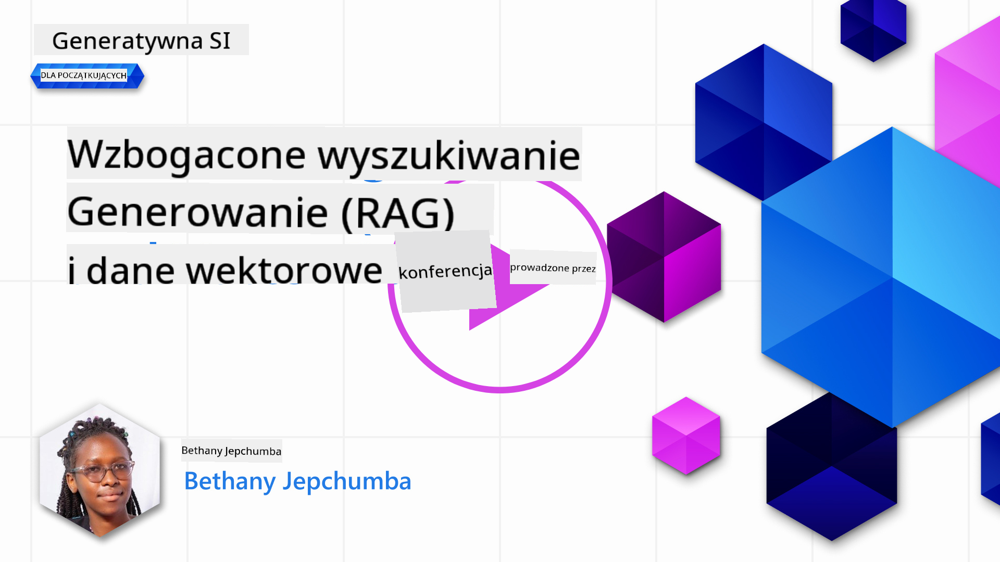
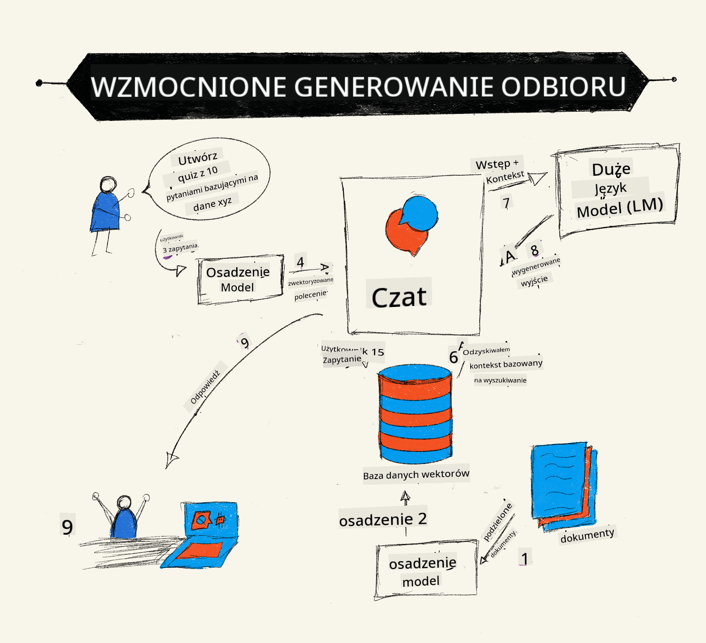
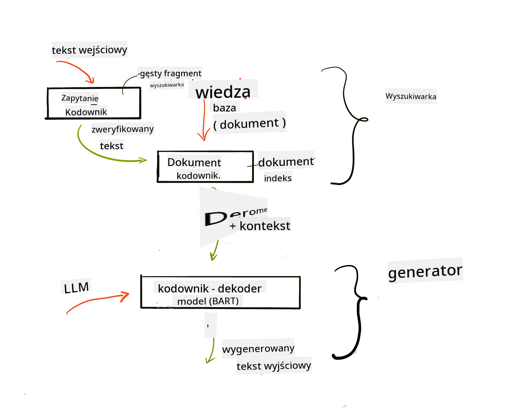
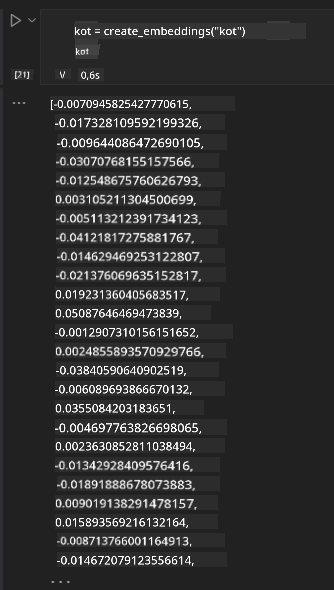

<!--
CO_OP_TRANSLATOR_METADATA:
{
  "original_hash": "e2861bbca91c0567ef32bc77fe054f9e",
  "translation_date": "2025-07-09T16:11:46+00:00",
  "source_file": "15-rag-and-vector-databases/README.md",
  "language_code": "pl"
}
-->
# Retrieval Augmented Generation (RAG) i bazy danych wektorowych

[](https://aka.ms/gen-ai-lesson15-gh?WT.mc_id=academic-105485-koreyst)

W lekcji o aplikacjach wyszukiwania krótko omówiliśmy, jak zintegrować własne dane z dużymi modelami językowymi (LLM). W tej lekcji zagłębimy się w koncepcję osadzania danych w aplikacji LLM, mechanikę tego procesu oraz metody przechowywania danych, obejmujące zarówno embeddingi, jak i tekst.

> **Wideo wkrótce**

## Wprowadzenie

W tej lekcji omówimy:

- Wprowadzenie do RAG, czym jest i dlaczego jest wykorzystywane w AI (sztucznej inteligencji).

- Zrozumienie, czym są bazy danych wektorowych i jak stworzyć jedną dla naszej aplikacji.

- Praktyczny przykład integracji RAG w aplikacji.

## Cele nauki

Po ukończeniu tej lekcji będziesz potrafił:

- Wyjaśnić znaczenie RAG w wyszukiwaniu i przetwarzaniu danych.

- Skonfigurować aplikację RAG i osadzić swoje dane w LLM.

- Skutecznie integrować RAG i bazy danych wektorowych w aplikacjach LLM.

## Nasz scenariusz: wzbogacanie naszych LLM o własne dane

W tej lekcji chcemy dodać własne notatki do startupu edukacyjnego, co pozwoli chatbotowi uzyskać więcej informacji na różne tematy. Korzystając z naszych notatek, uczniowie będą mogli lepiej się uczyć i rozumieć różne zagadnienia, co ułatwi im powtórki przed egzaminami. Do stworzenia naszego scenariusza wykorzystamy:

- `Azure OpenAI:` LLM, którego użyjemy do stworzenia chatbota

- `Lekcję AI dla początkujących o sieciach neuronowych:` to będą dane, na których osadzimy nasz LLM

- `Azure AI Search` i `Azure Cosmos DB:` baza danych wektorowych do przechowywania danych i tworzenia indeksu wyszukiwania

Użytkownicy będą mogli tworzyć quizy na podstawie swoich notatek, fiszki do powtórek oraz podsumowania w formie zwięzłych przeglądów. Zacznijmy od wyjaśnienia, czym jest RAG i jak działa:

## Retrieval Augmented Generation (RAG)

Chatbot oparty na LLM przetwarza zapytania użytkownika, aby generować odpowiedzi. Jest zaprojektowany tak, by być interaktywny i angażować się w rozmowy na różne tematy. Jednak jego odpowiedzi są ograniczone do kontekstu dostarczonego oraz danych, na których był trenowany. Na przykład, GPT-4 ma cutoff wiedzy na wrzesień 2021, co oznacza, że nie zna wydarzeń po tej dacie. Ponadto dane użyte do trenowania LLM nie zawierają poufnych informacji, takich jak prywatne notatki czy instrukcje produktów firmy.

### Jak działają RAG (Retrieval Augmented Generation)



Załóżmy, że chcesz wdrożyć chatbota, który tworzy quizy na podstawie twoich notatek — potrzebujesz wtedy połączenia z bazą wiedzy. Tu z pomocą przychodzi RAG. RAG działa w następujący sposób:

- **Baza wiedzy:** Przed wyszukiwaniem dokumenty muszą zostać załadowane i przetworzone, zwykle dzieląc duże dokumenty na mniejsze fragmenty, przekształcając je w embeddingi tekstowe i przechowując w bazie danych.

- **Zapytanie użytkownika:** użytkownik zadaje pytanie

- **Wyszukiwanie:** Gdy użytkownik zada pytanie, model embeddingowy wyszukuje odpowiednie informacje w bazie wiedzy, aby dostarczyć więcej kontekstu, który zostanie dołączony do promptu.

- **Generowanie z rozszerzeniem:** LLM wzbogaca swoją odpowiedź na podstawie pobranych danych. Pozwala to na generowanie odpowiedzi nie tylko na podstawie danych wytrenowanych, ale także na podstawie istotnych informacji z dodanego kontekstu. Pobranie danych służy do rozszerzenia odpowiedzi LLM. Następnie LLM zwraca odpowiedź na pytanie użytkownika.



Architektura RAG jest realizowana za pomocą transformatorów składających się z dwóch części: enkodera i dekodera. Na przykład, gdy użytkownik zada pytanie, tekst wejściowy jest „zakodowany” do wektorów, które uchwytują znaczenie słów, a wektory są „dekodowane” do naszego indeksu dokumentów i generują nowy tekst na podstawie zapytania użytkownika. LLM używa modelu enkoder-dekoder do generowania odpowiedzi.

Dwa podejścia do implementacji RAG według proponowanego artykułu: [Retrieval-Augmented Generation for Knowledge intensive NLP Tasks](https://arxiv.org/pdf/2005.11401.pdf?WT.mc_id=academic-105485-koreyst) to:

- **_RAG-Sequence_** wykorzystujący pobrane dokumenty do przewidzenia najlepszej możliwej odpowiedzi na zapytanie użytkownika

- **RAG-Token** wykorzystujący dokumenty do generowania kolejnego tokena, a następnie pobierający je, by odpowiedzieć na zapytanie użytkownika

### Dlaczego warto używać RAG?

- **Bogactwo informacji:** zapewnia, że odpowiedzi tekstowe są aktualne i zgodne z najnowszymi danymi. Dzięki temu poprawia wydajność w zadaniach specyficznych dla danej dziedziny, uzyskując dostęp do wewnętrznej bazy wiedzy.

- Redukuje wymyślanie informacji, wykorzystując **weryfikowalne dane** z bazy wiedzy, które dostarczają kontekst do zapytań użytkowników.

- Jest **opłacalne**, ponieważ jest tańsze niż dostrajanie (fine-tuning) LLM.

## Tworzenie bazy wiedzy

Nasza aplikacja opiera się na naszych osobistych danych, tj. lekcji o sieciach neuronowych z kursu AI dla początkujących.

### Bazy danych wektorowych

Baza danych wektorowych, w przeciwieństwie do tradycyjnych baz, to specjalistyczna baza zaprojektowana do przechowywania, zarządzania i wyszukiwania osadzonych wektorów. Przechowuje numeryczne reprezentacje dokumentów. Rozbicie danych na embeddingi numeryczne ułatwia naszemu systemowi AI zrozumienie i przetwarzanie danych.

Przechowujemy embeddingi w bazach danych wektorowych, ponieważ LLM mają limit liczby tokenów, które mogą przyjąć jako wejście. Nie można przekazać całych embeddingów do LLM, dlatego musimy je podzielić na fragmenty, a gdy użytkownik zada pytanie, zwracane są embeddingi najbardziej pasujące do pytania wraz z promptem. Dzielenie na fragmenty również zmniejsza koszty związane z liczbą tokenów przekazywanych do LLM.

Popularne bazy danych wektorowych to Azure Cosmos DB, Clarifyai, Pinecone, Chromadb, ScaNN, Qdrant i DeepLake. Możesz stworzyć model Azure Cosmos DB za pomocą Azure CLI, używając następującego polecenia:

```bash
az login
az group create -n <resource-group-name> -l <location>
az cosmosdb create -n <cosmos-db-name> -r <resource-group-name>
az cosmosdb list-keys -n <cosmos-db-name> -g <resource-group-name>
```

### Od tekstu do embeddingów

Przed przechowywaniem danych musimy przekonwertować je na embeddingi wektorowe. Jeśli pracujesz z dużymi dokumentami lub długimi tekstami, możesz je podzielić na fragmenty w oparciu o spodziewane zapytania. Dzielenie można wykonać na poziomie zdań lub akapitów. Ponieważ fragmenty czerpią znaczenie z otaczających słów, możesz dodać do nich dodatkowy kontekst, np. tytuł dokumentu lub tekst przed lub po fragmencie. Możesz podzielić dane w następujący sposób:

```python
def split_text(text, max_length, min_length):
    words = text.split()
    chunks = []
    current_chunk = []

    for word in words:
        current_chunk.append(word)
        if len(' '.join(current_chunk)) < max_length and len(' '.join(current_chunk)) > min_length:
            chunks.append(' '.join(current_chunk))
            current_chunk = []

    # If the last chunk didn't reach the minimum length, add it anyway
    if current_chunk:
        chunks.append(' '.join(current_chunk))

    return chunks
```

Po podzieleniu możemy osadzić tekst, korzystając z różnych modeli embeddingowych. Niektóre modele, które możesz wykorzystać, to: word2vec, ada-002 od OpenAI, Azure Computer Vision i wiele innych. Wybór modelu zależy od języków, których używasz, rodzaju kodowanej zawartości (tekst/obraz/audio), rozmiaru wejścia, które może zakodować, oraz długości wyjścia embeddingu.

Przykład embeddingu tekstu z użyciem modelu OpenAI `text-embedding-ada-002`:



## Wyszukiwanie i wyszukiwanie wektorowe

Gdy użytkownik zada pytanie, retriever przekształca je w wektor za pomocą enkodera zapytań, a następnie przeszukuje indeks dokumentów w poszukiwaniu wektorów powiązanych z zapytaniem. Po znalezieniu konwertuje zarówno wektor zapytania, jak i wektory dokumentów na tekst i przekazuje je do LLM.

### Wyszukiwanie

Wyszukiwanie odbywa się, gdy system próbuje szybko znaleźć dokumenty w indeksie spełniające kryteria wyszukiwania. Celem retrievera jest pobranie dokumentów, które posłużą do dostarczenia kontekstu i osadzenia LLM na twoich danych.

Istnieje kilka sposobów wyszukiwania w bazie danych, takich jak:

- **Wyszukiwanie słów kluczowych** – używane do wyszukiwania tekstowego

- **Wyszukiwanie semantyczne** – wykorzystuje znaczenie semantyczne słów

- **Wyszukiwanie wektorowe** – konwertuje dokumenty z tekstu na reprezentacje wektorowe za pomocą modeli embeddingowych. Wyszukiwanie odbywa się przez zapytanie o dokumenty, których reprezentacje wektorowe są najbliższe pytaniu użytkownika.

- **Hybrydowe** – połączenie wyszukiwania słów kluczowych i wektorowego.

Problem z wyszukiwaniem pojawia się, gdy w bazie nie ma podobnej odpowiedzi do zapytania — system wtedy zwraca najlepsze dostępne informacje. Możesz jednak zastosować takie metody jak ustawienie maksymalnej odległości dla trafności lub użyć wyszukiwania hybrydowego łączącego słowa kluczowe i wyszukiwanie wektorowe. W tej lekcji użyjemy wyszukiwania hybrydowego, czyli połączenia obu metod. Dane przechowamy w dataframe z kolumnami zawierającymi fragmenty oraz embeddingi.

### Podobieństwo wektorów

Retriever będzie przeszukiwał bazę wiedzy w poszukiwaniu embeddingów, które są blisko siebie, czyli najbliższych sąsiadów, ponieważ są to teksty podobne. W scenariuszu, gdy użytkownik zada pytanie, jest ono najpierw osadzone, a następnie dopasowane do podobnych embeddingów. Najczęściej stosowaną miarą podobieństwa wektorów jest podobieństwo cosinusowe, oparte na kącie między dwoma wektorami.

Możemy też mierzyć podobieństwo innymi metodami, takimi jak odległość euklidesowa (prosta linia między końcami wektorów) oraz iloczyn skalarny (suma iloczynów odpowiadających sobie elementów dwóch wektorów).

### Indeks wyszukiwania

Przed wyszukiwaniem musimy zbudować indeks wyszukiwania dla naszej bazy wiedzy. Indeks przechowuje embeddingi i pozwala szybko odnaleźć najbardziej podobne fragmenty nawet w dużej bazie danych. Możemy stworzyć indeks lokalnie, używając:

```python
from sklearn.neighbors import NearestNeighbors

embeddings = flattened_df['embeddings'].to_list()

# Create the search index
nbrs = NearestNeighbors(n_neighbors=5, algorithm='ball_tree').fit(embeddings)

# To query the index, you can use the kneighbors method
distances, indices = nbrs.kneighbors(embeddings)
```

### Ponowne sortowanie (re-ranking)

Po wykonaniu zapytania do bazy danych może być konieczne posortowanie wyników od najbardziej trafnych. Re-ranking LLM wykorzystuje uczenie maszynowe, aby poprawić trafność wyników, układając je od najbardziej do najmniej istotnych. Korzystając z Azure AI Search, re-ranking jest wykonywany automatycznie za pomocą semantycznego rerankera. Przykład działania re-rankingu z użyciem najbliższych sąsiadów:

```python
# Find the most similar documents
distances, indices = nbrs.kneighbors([query_vector])

index = []
# Print the most similar documents
for i in range(3):
    index = indices[0][i]
    for index in indices[0]:
        print(flattened_df['chunks'].iloc[index])
        print(flattened_df['path'].iloc[index])
        print(flattened_df['distances'].iloc[index])
    else:
        print(f"Index {index} not found in DataFrame")
```

## Łączenie wszystkiego w całość

Ostatnim krokiem jest dodanie naszego LLM, aby uzyskać odpowiedzi oparte na naszych danych. Możemy to zaimplementować w następujący sposób:

```python
user_input = "what is a perceptron?"

def chatbot(user_input):
    # Convert the question to a query vector
    query_vector = create_embeddings(user_input)

    # Find the most similar documents
    distances, indices = nbrs.kneighbors([query_vector])

    # add documents to query  to provide context
    history = []
    for index in indices[0]:
        history.append(flattened_df['chunks'].iloc[index])

    # combine the history and the user input
    history.append(user_input)

    # create a message object
    messages=[
        {"role": "system", "content": "You are an AI assistant that helps with AI questions."},
        {"role": "user", "content": history[-1]}
    ]

    # use chat completion to generate a response
    response = openai.chat.completions.create(
        model="gpt-4",
        temperature=0.7,
        max_tokens=800,
        messages=messages
    )

    return response.choices[0].message

chatbot(user_input)
```

## Ocena naszej aplikacji

### Metryki oceny

- Jakość dostarczanych odpowiedzi – czy brzmią naturalnie, płynnie i jak od człowieka

- Osadzenie danych: ocena, czy odpowiedź pochodzi z dostarczonych dokumentów

- Trafność: ocena, czy odpowiedź pasuje i jest powiązana z zadanym pytaniem

- Płynność – czy odpowiedź jest poprawna gramatycznie i zrozumiała

## Przypadki użycia RAG i baz danych wektorowych

Istnieje wiele zastosowań, gdzie wywołania funkcji mogą usprawnić twoją aplikację, np.:

- Pytania i odpowiedzi: osadzenie danych firmy w czacie, z którego mogą korzystać pracownicy, zadając pytania.

- Systemy rekomendacyjne: tworzenie systemów dopasowujących najbardziej podobne wartości, np. filmy, restauracje i inne.

- Usługi chatbotów: przechowywanie historii rozmów i personalizacja konwersacji na podstawie danych użytkownika.

- Wyszukiwanie obrazów na podstawie embeddingów wektorowych, przydatne w rozpoznawaniu obrazów i wykrywaniu anomalii.

## Podsumowanie

Omówiliśmy podstawowe zagadnienia RAG, od dodawania danych do aplikacji, przez zapytania użytkownika, aż po generowanie odpowiedzi. Aby uprościć tworzenie RAG, możesz skorzystać z frameworków takich jak Semantic Kernel, Langchain czy Autogen.

## Zadanie

Aby kontynuować naukę Retrieval Augmented Generation (RAG), możesz zbudować:

- Front-end aplikacji, korzystając z wybranego przez siebie frameworka

- Wykorzystać framework, np. LangChain lub Semantic Kernel, i odtworzyć swoją aplikację.

Gratulacje za ukończenie lekcji 👏.

## Nauka się tutaj nie kończy, kontynuuj swoją podróż

Po ukończeniu tej lekcji sprawdź naszą [kolekcję Generative AI Learning](https://aka.ms/genai-collection?WT.mc_id=academic-105485-koreyst), aby dalej rozwijać swoją wiedzę o Generative AI!

**Zastrzeżenie**:  
Niniejszy dokument został przetłumaczony za pomocą usługi tłumaczenia AI [Co-op Translator](https://github.com/Azure/co-op-translator). Mimo że dążymy do dokładności, prosimy mieć na uwadze, że tłumaczenia automatyczne mogą zawierać błędy lub nieścisłości. Oryginalny dokument w języku źródłowym powinien być uznawany za źródło autorytatywne. W przypadku informacji o kluczowym znaczeniu zalecane jest skorzystanie z profesjonalnego tłumaczenia wykonanego przez człowieka. Nie ponosimy odpowiedzialności za jakiekolwiek nieporozumienia lub błędne interpretacje wynikające z korzystania z tego tłumaczenia.