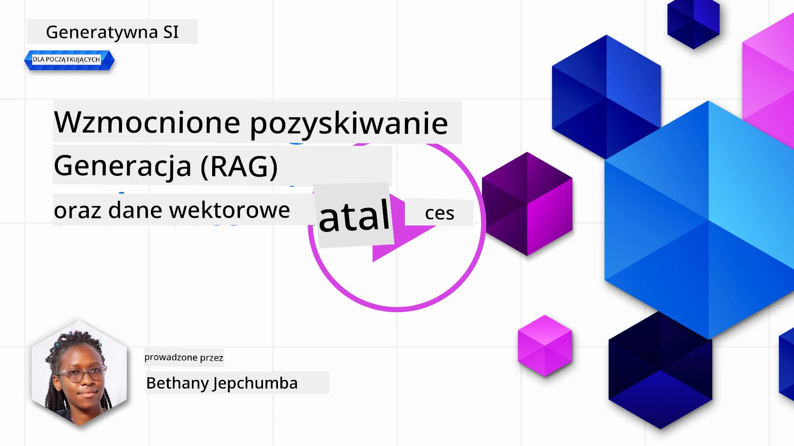
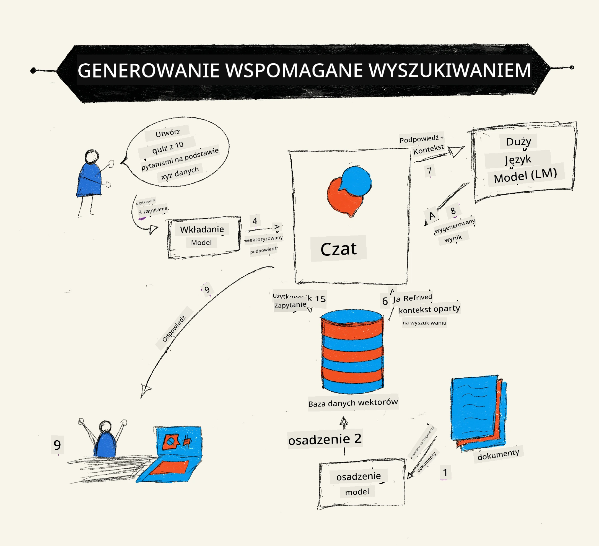
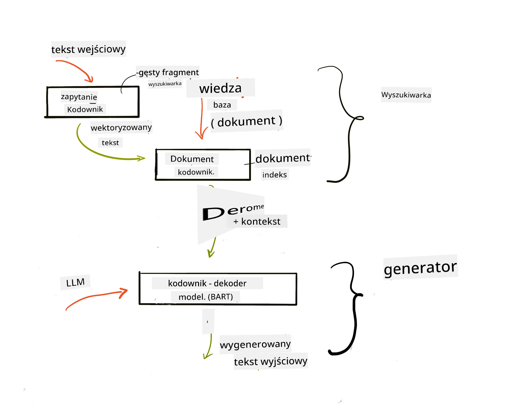

# Generowanie Wzbogacone o Wyszukiwanie (RAG) i Bazy Danych Wektorowych

[](https://youtu.be/4l8zhHUBeyI?si=BmvDmL1fnHtgQYkL)

W lekcji o aplikacjach wyszukiwawczych krótko poznaliśmy, jak integrować własne dane z dużymi modelami językowymi (LLM). W tej lekcji zagłębimy się dalej w koncepcje osadzania danych w aplikacji LLM, mechanikę tego procesu oraz metody przechowywania danych, obejmujące zarówno osadzenia, jak i tekst.

> **Wideo wkrótce**

## Wprowadzenie

W tej lekcji omówimy następujące zagadnienia:

- Wprowadzenie do RAG, czym jest i dlaczego jest stosowany w AI (sztucznej inteligencji).

- Zrozumienie czym są bazy danych wektorowych i tworzenie jednej dla naszej aplikacji.

- Praktyczny przykład integracji RAG w aplikacji.

## Cele nauki

Po ukończeniu tej lekcji będziesz potrafił/a:

- Wyjaśnić znaczenie RAG w wyszukiwaniu i przetwarzaniu danych.

- Skonfigurować aplikację RAG i osadzić swoje dane w LLM.

- Skutecznie integrować RAG oraz bazy danych wektorowych w aplikacjach LLM.

## Nasz scenariusz: wzbogacanie naszych LLM o własne dane

Na tę lekcję chcemy dodać własne notatki do startupu edukacyjnego, co pozwoli chatbotowi na uzyskanie większej ilości informacji na różne tematy. Korzystając z posiadanych notatek, uczący się będą mogli lepiej się uczyć i rozumieć różne tematy, co ułatwi przygotowania do egzaminów. Do stworzenia naszego scenariusza wykorzystamy:

- `Azure OpenAI:` LLM, którego użyjemy do stworzenia chatbota

- `Lekcja AI dla początkujących o Sieciach Neuronowych:` dane, na których opieramy nasz LLM

- `Azure AI Search` i `Azure Cosmos DB:` baza danych wektorowych do przechowywania naszych danych i tworzenia indeksów wyszukiwania

Użytkownicy będą mogli tworzyć quizy na podstawie notatek, fiszki do powtórek oraz streszczenia w formie zwięzłych przeglądów. Aby zacząć, zobaczmy czym jest RAG i jak działa:

## Generowanie Wzbogacone o Wyszukiwanie (RAG)

Chatbot zasilany LLM przetwarza dane wejściowe użytkownika, aby generować odpowiedzi. Jest zaprojektowany tak, aby być interaktywny i angażować się w rozmowy na różne tematy. Jednak jego odpowiedzi są ograniczone do kontekstu podanego i bazowych danych treningowych. Na przykład, GPT-4 ma datę odcięcia wiedzy na wrzesień 2021, co oznacza, że nie zna wydarzeń, które nastąpiły po tym czasie. Dodatkowo, dane użyte do trenowania LLM nie zawierają informacji poufnych, takich jak notatki osobiste czy instrukcje obsługi firmy.

### Jak działają RAG (Generowanie Wzbogacone o Wyszukiwanie)



Załóżmy, że chcesz wdrożyć chatbota tworzącego quizy na podstawie twoich notatek, potrzebujesz więc połączenia z bazą wiedzy. Tutaj z pomocą przychodzi RAG. RAG działa następująco:

- **Baza wiedzy:** Przed wyszukiwaniem dokumenty muszą zostać załadowane i przetworzone, zwykle poprzez podział dużych dokumentów na mniejsze fragmenty, przekształcenie ich na osadzenia tekstowe i zapisanie w bazie danych.

- **Zapytanie użytkownika:** użytkownik zadaje pytanie

- **Wyszukiwanie:** Gdy użytkownik pyta, model osadzający wyszukuje odpowiednie informacje w bazie wiedzy, aby dostarczyć więcej kontekstu, który zostanie dodany do prompta.

- **Generowanie wzbogacone:** LLM ulepsza swoją odpowiedź na podstawie pobranych danych. Pozwala to na generowanie odpowiedzi nie tylko w oparciu o dane wstępnie wytrenowane, ale także o relewantne informacje z dodanego kontekstu. Pobranie danych służy do wzbogacenia odpowiedzi LLM. LLM zwraca następnie odpowiedź na pytanie użytkownika.



Architektura RAG opiera się na transformatorach składających się z dwóch części: enkodera i dekodera. Na przykład, gdy użytkownik zadaje pytanie, tekst wejściowy jest "enkodowany" na wektory zawierające znaczenie słów, które następnie są "dekodowane" na nasz indeks dokumentów i generują nowy tekst na podstawie zapytania użytkownika. LLM używa modelu enkoder-dekoder do generowania wyjścia.

Dwa podejścia przy implementacji RAG według proponowanego artykułu: [Retrieval-Augmented Generation for Knowledge intensive NLP (natural language processing software) Tasks](https://arxiv.org/pdf/2005.11401.pdf?WT.mc_id=academic-105485-koreyst) to:

- **_RAG-Sequence_** używający pobranych dokumentów do przewidywania najlepszej odpowiedzi na zapytanie użytkownika

- **RAG-Token** używający dokumentów do generowania kolejnego tokenu, a następnie pobierający je ponownie, aby odpowiedzieć na zapytanie użytkownika

### Dlaczego warto używać RAG?

- **Bogactwo informacji:** zapewnia, że tekstowe odpowiedzi są aktualne i na czasie. Poprawia wydajność w zadaniach specyficznych dla danej dziedziny poprzez dostęp do wewnętrznej bazy wiedzy.

- Zmniejsza zmyślanie, korzystając z **weryfikowalnych danych** w bazie wiedzy, by zapewnić kontekst do zapytań użytkowników.

- Jest **opłacalne**, ponieważ jest bardziej ekonomiczne w porównaniu do dostrajania LLM.

## Tworzenie bazy wiedzy

Nasza aplikacja opiera się na naszych danych osobistych, tj. lekcji o Sieciach Neuronowych z kursu AI dla początkujących.

### Bazy danych wektorowych

Baza danych wektorowa, w odróżnieniu od tradycyjnych baz, to specjalistyczna baza zaprojektowana do przechowywania, zarządzania i wyszukiwania osadzonych wektorów. Przechowuje numeryczne reprezentacje dokumentów. Rozbicie danych na numeryczne osadzenia ułatwia naszemu systemowi AI zrozumienie i przetworzenie danych.

Przechowujemy osadzenia w bazach danych wektorowych, ponieważ LLM mają limit liczby tokenów akceptowanych na wejściu. Nie można przekazać całych osadzeń do LLM, dlatego musimy podzielić je na fragmenty, a gdy użytkownik zada pytanie, zwrócone zostaną osadzenia najbardziej dopasowane wraz z promptem. Podział na fragmenty także obniża koszty związane z liczbą tokenów przesyłanych przez LLM.

Do popularnych baz danych wektorowych należą Azure Cosmos DB, Clarifyai, Pinecone, Chromadb, ScaNN, Qdrant i DeepLake. Możesz utworzyć model Azure Cosmos DB używając Azure CLI poniższym poleceniem:

```bash
az login
az group create -n <resource-group-name> -l <location>
az cosmosdb create -n <cosmos-db-name> -r <resource-group-name>
az cosmosdb list-keys -n <cosmos-db-name> -g <resource-group-name>
```

### Od tekstu do osadzeń

Przed zapisaniem danych musimy przekształcić je w osadzenia wektorowe. Jeśli pracujesz z dużymi dokumentami lub długimi tekstami, możesz je podzielić na fragmenty według przewidywanych zapytań. Dzielenie może odbywać się na poziomie zdań lub akapitów. Ponieważ fragmenty czerpią znaczenie ze słów w ich otoczeniu, możesz dodać dodatkowy kontekst do fragmentu, np. tytuł dokumentu lub tekst przed lub po fragmencie. Fragmentowanie danych może wyglądać następująco:

```python
def split_text(text, max_length, min_length):
    words = text.split()
    chunks = []
    current_chunk = []

    for word in words:
        current_chunk.append(word)
        if len(' '.join(current_chunk)) < max_length and len(' '.join(current_chunk)) > min_length:
            chunks.append(' '.join(current_chunk))
            current_chunk = []

    # Jeśli ostatni fragment nie osiągnął minimalnej długości, dodaj go mimo to
    if current_chunk:
        chunks.append(' '.join(current_chunk))

    return chunks
```

Po podzieleniu możemy osadzić tekst używając różnych modeli osadzania. Są to między innymi: word2vec, ada-002 od OpenAI, Azure Computer Vision i wiele innych. Wybór modelu zależy od języków, którymi pracujesz, rodzaju kodowanej treści (tekst/obraz/dźwięk), rozmiaru wejścia, które potrafi zakodować oraz długości wyjścia osadzenia.

Przykład osadzonego tekstu przy użyciu modelu `text-embedding-ada-002` od OpenAI:


## Wyszukiwanie i przeszukiwanie wektorowe

Gdy użytkownik zada pytanie, system zamienia je na wektor za pomocą enkodera zapytań, a następnie przeszukuje indeks dokumentów, aby znaleźć wektory w dokumentach odpowiadające zapytaniu. Następnie konwertuje zarówno wektor wejściowy, jak i wektory dokumentów na tekst i przekazuje je do LLM.

### Wyszukiwanie

Wyszukiwanie ma miejsce, gdy system próbuje szybko znaleźć dokumenty z indeksu spełniające kryteria wyszukiwania. Celem wyszukiwania jest znalezienie dokumentów, które posłużą do dostarczenia kontekstu i osadzenia LLM na twoich danych.

Istnieje kilka sposobów wyszukiwania w bazie danych, takich jak:

- **Wyszukiwanie po słowach kluczowych** - używane do wyszukiwania tekstu

- **Wyszukiwanie wektorowe** - przekształca dokumenty z tekstu na reprezentacje wektorowe za pomocą modeli osadzania, umożliwiając **wyszukiwanie semantyczne** oparte na znaczeniu słów. Wyszukiwanie odbywa się poprzez zapytanie o dokumenty, których reprezentacje wektorowe są najbliższe zapytaniu użytkownika.

- **Hybrydowe** - połączenie wyszukiwania po słowach i wektorowego.

Problem pojawia się, gdy w bazie nie ma podobnej odpowiedzi do zapytania; system wtedy zwraca najlepsze dostępne informacje. Można jednak stosować takie metody jak ustalanie maksymalnej odległości dla trafności lub używać wyszukiwania hybrydowego, łączącego obie metody. W tej lekcji użyjemy wyszukiwania hybrydowego, łączącego wyszukiwanie wektorowe i po słowach kluczowych. Dane będziemy przechowywać w dataframe z kolumnami zawierającymi fragmenty oraz osadzenia.

### Podobieństwo wektorów

Wyszukiwarka przeszukuje bazę wiedzy pod kątem osadzeń, które są blisko siebie, czyli najbliższego sąsiada, ponieważ teksty są podobne. W scenariuszu najpierw zapytanie użytkownika jest osadzone i dopasowywane do podobnych osadzeń. Popularną miarą podobieństwa wektorów jest podobieństwo cosinusowe oparte na kącie między dwoma wektorami.

Możemy także mierzyć podobieństwo alternatywnie, np. za pomocą odległości euklidesowej będącej najkrótszą linią między końcami wektorów oraz iloczynu skalarnego mierzącego sumę iloczynów odpowiadających elementów wektorów.

### Indeks wyszukiwania

Przed wykonaniem wyszukiwania musimy zbudować indeks wyszukiwania dla bazy wiedzy. Indeks przechowuje osadzenia i pozwala szybko odnaleźć najbardziej podobne fragmenty, nawet w dużej bazie danych. Możemy stworzyć indeks lokalnie za pomocą:

```python
from sklearn.neighbors import NearestNeighbors

embeddings = flattened_df['embeddings'].to_list()

# Utwórz indeks wyszukiwania
nbrs = NearestNeighbors(n_neighbors=5, algorithm='ball_tree').fit(embeddings)

# Aby przeszukać indeks, możesz użyć metody kneighbors
distances, indices = nbrs.kneighbors(embeddings)
```

### Ponowne sortowanie wyników (re-ranking)

Po wykonaniu zapytania do bazy możemy chcieć posortować wyniki od najbardziej relewantnych. LLM do ponownego sortowania wykorzystuje uczenie maszynowe, by poprawić trafność wyników poprzez ich uporządkowanie od najbardziej odpowiednich. Korzystając z Azure AI Search, ponowne sortowanie odbywa się automatycznie przez semantyczny reranker. Przykład działania ponownego sortowania z najbliższymi sąsiadami:

```python
# Znajdź najbardziej podobne dokumenty
distances, indices = nbrs.kneighbors([query_vector])

index = []
# Wydrukuj najbardziej podobne dokumenty
for i in range(3):
    index = indices[0][i]
    for index in indices[0]:
        print(flattened_df['chunks'].iloc[index])
        print(flattened_df['path'].iloc[index])
        print(flattened_df['distances'].iloc[index])
    else:
        print(f"Index {index} not found in DataFrame")
```

## Podsumowanie

Ostatnim krokiem jest dodanie naszego LLM do całego procesu, aby uzyskać odpowiedzi oparte na naszych danych. Możemy to zaimplementować w następujący sposób:

```python
user_input = "what is a perceptron?"

def chatbot(user_input):
    # Konwertuj pytanie na wektor zapytania
    query_vector = create_embeddings(user_input)

    # Znajdź najbardziej podobne dokumenty
    distances, indices = nbrs.kneighbors([query_vector])

    # dodaj dokumenty do zapytania, aby dostarczyć kontekst
    history = []
    for index in indices[0]:
        history.append(flattened_df['chunks'].iloc[index])

    # połącz historię i dane wejściowe użytkownika
    history.append(user_input)

    # utwórz obiekt wiadomości
    messages=[
        {"role": "system", "content": "You are an AI assistant that helps with AI questions."},
        {"role": "user", "content": "\n\n".join(history) }
    ]

    # użyj API Odpowiedzi, aby wygenerować odpowiedź
    response = client.responses.create(
        model="gpt-5-mini",
        max_output_tokens=800,
        input=messages,
        store=False,
    )

    return response.output_text

chatbot(user_input)
```

## Ocena naszej aplikacji

### Metryki oceny

- Jakość dostarczanych odpowiedzi, zapewniając, że brzmią naturalnie, płynnie i ludzko

- Osadzenie danych: ocena, czy odpowiedź pochodzi z dostarczonych dokumentów

- Trafność: ocena, czy odpowiedź pasuje i jest związana z zadanym pytaniem

- Płynność – czy odpowiedź jest poprawna gramatycznie

## Przypadki użycia RAG (Generowanie Wzbogacone o Wyszukiwanie) i baz danych wektorowych

Istnieje wiele różnych zastosowań, gdzie wywołania funkcji mogą poprawić twoją aplikację, m.in.:

- Pytania i odpowiedzi: osadzenie danych firmy w czacie, z którego mogą korzystać pracownicy, zadając pytania.

- Systemy rekomendacji: tworzenie systemu dopasowującego najbardziej podobne wartości, np. filmy, restauracje i wiele innych.

- Usługi chatbotów: przechowywanie historii rozmów i personalizacja konwersacji na podstawie danych użytkownika.

- Wyszukiwanie obrazów oparte na osadzeniach wektorowych, przydatne podczas rozpoznawania obrazów i wykrywania anomalii.

## Podsumowanie

Omówiliśmy podstawowe zagadnienia RAG, od dodania naszych danych do aplikacji, przez zapytanie użytkownika aż po wynik. Aby uprościć tworzenie RAG, możesz użyć frameworków takich jak Semantic Kernel, Langchain lub Autogen.

## Zadanie domowe

Aby kontynuować naukę Generowania Wzbogaconego o Wyszukiwanie (RAG), możesz zbudować:

- Front-end aplikacji przy użyciu wybranego frameworka

- Wykorzystać framework, taki jak LangChain lub Semantic Kernel, i odtworzyć swoją aplikację.

Gratulacje za ukończenie lekcji 👏.

## Nauka się tutaj nie kończy, kontynuuj podróż

Po ukończeniu lekcji zapoznaj się z naszą [kolekcją nauki Generatywnej AI](https://aka.ms/genai-collection?WT.mc_id=academic-105485-koreyst), aby dalej rozwijać swoją wiedzę z zakresu Generatywnej AI!

---

<!-- CO-OP TRANSLATOR DISCLAIMER START -->
**Zastrzeżenie**:
Niniejszy dokument został przetłumaczony za pomocą usługi tłumaczenia AI [Co-op Translator](https://github.com/Azure/co-op-translator). Choć dążymy do dokładności, prosimy pamiętać, że automatyczne tłumaczenia mogą zawierać błędy lub niedokładności. Oryginalny dokument w jego języku źródłowym należy uznawać za autorytatywne źródło. W przypadku informacji krytycznych zalecane jest skorzystanie z profesjonalnego tłumaczenia wykonanego przez człowieka. Nie ponosimy odpowiedzialności za jakiekolwiek nieporozumienia lub błędne interpretacje wynikające z użycia tego tłumaczenia.
<!-- CO-OP TRANSLATOR DISCLAIMER END -->