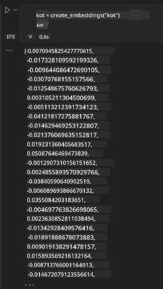

<!--
CO_OP_TRANSLATOR_METADATA:
{
  "original_hash": "e2861bbca91c0567ef32bc77fe054f9e",
  "translation_date": "2025-06-25T22:31:06+00:00",
  "source_file": "15-rag-and-vector-databases/README.md",
  "language_code": "pl"
}
-->
# Retrieval Augmented Generation (RAG) i bazy danych wektorowych

W lekcji dotyczącej aplikacji wyszukiwania krótko omówiliśmy, jak zintegrować własne dane z dużymi modelami językowymi (LLM). W tej lekcji zagłębimy się w pojęcia dotyczące zakotwiczenia danych w aplikacji LLM, mechanikę procesu oraz metody przechowywania danych, w tym zarówno osadzeń, jak i tekstu.

> **Wideo wkrótce**

## Wprowadzenie

W tej lekcji omówimy następujące zagadnienia:

- Wprowadzenie do RAG, czym jest i dlaczego jest używane w AI (sztucznej inteligencji).

- Zrozumienie, czym są bazy danych wektorowych i stworzenie jednej dla naszej aplikacji.

- Praktyczny przykład, jak zintegrować RAG z aplikacją.

## Cele nauki

Po ukończeniu tej lekcji będziesz w stanie:

- Wyjaśnić znaczenie RAG w wyszukiwaniu i przetwarzaniu danych.

- Skonfigurować aplikację RAG i zakotwiczyć swoje dane w LLM.

- Efektywna integracja RAG i baz danych wektorowych w aplikacjach LLM.

## Nasz scenariusz: ulepszanie naszych LLM za pomocą własnych danych

W tej lekcji chcemy dodać własne notatki do edukacyjnego startupu, co pozwoli chatbotowi uzyskać więcej informacji na różne tematy. Korzystając z naszych notatek, uczniowie będą mogli lepiej się uczyć i rozumieć różne zagadnienia, co ułatwi im przygotowanie się do egzaminów. Aby stworzyć nasz scenariusz, użyjemy:

- `Azure OpenAI:` LLM, którego użyjemy do stworzenia naszego chatbota

- `AI for beginners' lesson on Neural Networks`: będą to dane, na których zakotwiczymy nasze LLM

- `Azure AI Search` i `Azure Cosmos DB:` baza danych wektorowych do przechowywania naszych danych i tworzenia indeksu wyszukiwania

Użytkownicy będą mogli tworzyć quizy z praktycznymi pytaniami z notatek, karty do powtórek oraz podsumować je w zwięzłe przeglądy. Aby rozpocząć, przyjrzyjmy się, czym jest RAG i jak działa:

## Retrieval Augmented Generation (RAG)

Chatbot zasilany przez LLM przetwarza zapytania użytkowników, aby generować odpowiedzi. Jest zaprojektowany do interakcji i angażuje się w rozmowy na szeroki zakres tematów. Jednak jego odpowiedzi są ograniczone do dostarczonego kontekstu i jego podstawowych danych treningowych. Na przykład, wiedza GPT-4 kończy się we wrześniu 2021 roku, co oznacza, że nie zna wydarzeń, które miały miejsce po tym okresie. Ponadto, dane używane do trenowania LLM wykluczają poufne informacje, takie jak osobiste notatki czy instrukcje obsługi produktów firmy.

### Jak działają RAG (Retrieval Augmented Generation)

Załóżmy, że chcesz wdrożyć chatbota, który tworzy quizy z twoich notatek, będziesz potrzebować połączenia z bazą wiedzy. Tu z pomocą przychodzi RAG. RAG działa w następujący sposób:

- **Baza wiedzy:** Przed pobraniem, te dokumenty muszą zostać wczytane i przetworzone, zazwyczaj poprzez podzielenie dużych dokumentów na mniejsze fragmenty, przekształcenie ich w osadzenia tekstowe i przechowywanie ich w bazie danych.

- **Zapytanie użytkownika:** użytkownik zadaje pytanie

- **Pobieranie:** Kiedy użytkownik zadaje pytanie, model osadzenia pobiera odpowiednie informacje z naszej bazy wiedzy, aby dostarczyć więcej kontekstu, który zostanie włączony do zapytania.

- **Augmentacja generacji:** LLM ulepsza swoją odpowiedź na podstawie pobranych danych. Pozwala to na generowanie odpowiedzi nie tylko na podstawie danych wytrenowanych, ale także na podstawie odpowiednich informacji z dodanego kontekstu. Pobierane dane są używane do wzbogacenia odpowiedzi LLM. LLM następnie zwraca odpowiedź na pytanie użytkownika.

Architektura RAG jest implementowana za pomocą transformatorów składających się z dwóch części: kodera i dekodera. Na przykład, gdy użytkownik zadaje pytanie, tekst wejściowy jest 'kodowany' na wektory uchwytujące znaczenie słów, a wektory są 'dekodowane' do naszego indeksu dokumentów i generują nowy tekst na podstawie zapytania użytkownika. LLM używa zarówno modelu kodera-dekodera, aby wygenerować wynik.

Dwa podejścia przy implementacji RAG zgodnie z proponowanym artykułem: [Retrieval-Augmented Generation for Knowledge intensive NLP (natural language processing software) Tasks](https://arxiv.org/pdf/2005.11401.pdf?WT.mc_id=academic-105485-koreyst) są:

- **_RAG-Sequence_** używając pobranych dokumentów do przewidywania najlepszego możliwego odpowiedzi na zapytanie użytkownika

- **RAG-Token** używając dokumentów do generowania następnego tokenu, a następnie pobierając je, aby odpowiedzieć na zapytanie użytkownika

### Dlaczego warto używać RAG?

- **Bogactwo informacji:** zapewnia, że odpowiedzi tekstowe są aktualne i bieżące. Zwiększa to wydajność w zadaniach specyficznych dla danego obszaru, uzyskując dostęp do wewnętrznej bazy wiedzy.

- Redukuje fabrykację, wykorzystując **weryfikowalne dane** w bazie wiedzy, aby dostarczyć kontekst do zapytań użytkowników.

- Jest **kosztowo efektywny**, ponieważ są bardziej ekonomiczne w porównaniu do dostrajania LLM.

## Tworzenie bazy wiedzy

Nasza aplikacja opiera się na naszych danych osobistych, tj. lekcji o sieciach neuronowych w programie nauczania AI dla początkujących.

### Bazy danych wektorowych

Baza danych wektorowych, w przeciwieństwie do tradycyjnych baz danych, jest specjalistyczną bazą danych zaprojektowaną do przechowywania, zarządzania i wyszukiwania osadzonych wektorów. Przechowuje numeryczne reprezentacje dokumentów. Rozbijanie danych na numeryczne osadzenia ułatwia naszemu systemowi AI zrozumienie i przetwarzanie danych.

Przechowujemy nasze osadzenia w bazach danych wektorowych, ponieważ LLM mają ograniczenie liczby tokenów, które akceptują jako dane wejściowe. Ponieważ nie można przekazać całych osadzeń do LLM, będziemy musieli je podzielić na fragmenty, a gdy użytkownik zada pytanie, osadzenia najbardziej podobne do pytania zostaną zwrócone wraz z zapytaniem. Dzielenie na fragmenty również zmniejsza koszty związane z liczbą tokenów przekazywanych przez LLM.

Niektóre popularne bazy danych wektorowych to Azure Cosmos DB, Clarifyai, Pinecone, Chromadb, ScaNN, Qdrant i DeepLake. Możesz stworzyć model Azure Cosmos DB za pomocą Azure CLI, używając następującego polecenia:

```bash
az login
az group create -n <resource-group-name> -l <location>
az cosmosdb create -n <cosmos-db-name> -r <resource-group-name>
az cosmosdb list-keys -n <cosmos-db-name> -g <resource-group-name>
```

### Od tekstu do osadzeń

Przed przechowaniem naszych danych, będziemy musieli przekształcić je w osadzenia wektorowe, zanim zostaną przechowane w bazie danych. Jeśli pracujesz z dużymi dokumentami lub długimi tekstami, możesz podzielić je na fragmenty na podstawie oczekiwanych zapytań. Dzielenie na fragmenty można zrobić na poziomie zdania lub akapitu. Ponieważ dzielenie na fragmenty wywodzi znaczenia z otaczających słów, możesz dodać trochę innego kontekstu do fragmentu, na przykład dodając tytuł dokumentu lub włączając trochę tekstu przed lub po fragmencie. Możesz podzielić dane w następujący sposób:

```python
def split_text(text, max_length, min_length):
    words = text.split()
    chunks = []
    current_chunk = []

    for word in words:
        current_chunk.append(word)
        if len(' '.join(current_chunk)) < max_length and len(' '.join(current_chunk)) > min_length:
            chunks.append(' '.join(current_chunk))
            current_chunk = []

    # If the last chunk didn't reach the minimum length, add it anyway
    if current_chunk:
        chunks.append(' '.join(current_chunk))

    return chunks
```

Po podzieleniu, możemy następnie osadzić nasz tekst, używając różnych modeli osadzeń. Niektóre modele, które możesz użyć, to: word2vec, ada-002 od OpenAI, Azure Computer Vision i wiele innych. Wybór modelu do użycia będzie zależał od języków, które używasz, rodzaju kodowanej zawartości (tekst/obrazy/audio), rozmiaru danych wejściowych, które może zakodować, i długości wyjścia osadzenia.

Przykład osadzonego tekstu za pomocą modelu OpenAI `text-embedding-ada-002` to:


## Wyszukiwanie i wyszukiwanie wektorowe

Gdy użytkownik zada pytanie, retriever przekształca je w wektor za pomocą kodera zapytań, a następnie przeszukuje nasz indeks wyszukiwania dokumentów w poszukiwaniu odpowiednich wektorów w dokumencie, które są związane z danymi wejściowymi. Po zakończeniu, konwertuje zarówno wektor wejściowy, jak i wektory dokumentu na tekst i przekazuje je przez LLM.

### Pobieranie

Pobieranie następuje, gdy system próbuje szybko znaleźć dokumenty z indeksu, które spełniają kryteria wyszukiwania. Celem retrievera jest uzyskanie dokumentów, które będą używane do dostarczania kontekstu i zakotwiczenia LLM na twoich danych.

Istnieje kilka sposobów wykonywania wyszukiwania w naszej bazie danych, takich jak:

- **Wyszukiwanie słów kluczowych** - używane do wyszukiwania tekstów

- **Wyszukiwanie semantyczne** - wykorzystuje semantyczne znaczenie słów

- **Wyszukiwanie wektorowe** - konwertuje dokumenty z tekstu na reprezentacje wektorowe, używając modeli osadzeń. Pobieranie będzie odbywać się poprzez zapytania do dokumentów, których reprezentacje wektorowe są najbliższe pytaniu użytkownika.

- **Hybrydowe** - połączenie zarówno wyszukiwania słów kluczowych, jak i wyszukiwania wektorowego.

Wyzwanie związane z pobieraniem pojawia się, gdy w bazie danych nie ma podobnej odpowiedzi na zapytanie, system wtedy zwróci najlepsze informacje, jakie mogą uzyskać, jednak możesz użyć taktyk, takich jak ustawienie maksymalnej odległości dla istotności lub użycie wyszukiwania hybrydowego, które łączy zarówno słowa kluczowe, jak i wyszukiwanie wektorowe. W tej lekcji użyjemy wyszukiwania hybrydowego, połączenia zarówno wyszukiwania wektorowego, jak i słów kluczowych. Przechowamy nasze dane w ramce danych z kolumnami zawierającymi fragmenty oraz osadzenia.

### Podobieństwo wektorowe

Retriever przeszukuje bazę danych wiedzy w poszukiwaniu osadzeń, które są blisko siebie, najbliższego sąsiada, ponieważ są to teksty, które są podobne. W scenariuszu, gdy użytkownik zadaje zapytanie, jest ono najpierw osadzane, a następnie dopasowywane do podobnych osadzeń. Zwykłym pomiarem, który jest używany do określenia, jak podobne są różne wektory, jest podobieństwo kosinusowe, które opiera się na kącie między dwoma wektorami.

Możemy mierzyć podobieństwo za pomocą innych alternatyw, które możemy użyć, to odległość euklidesowa, która jest linią prostą między końcami wektorów, oraz iloczyn skalarny, który mierzy sumę produktów odpowiadających sobie elementów dwóch wektorów.

### Indeks wyszukiwania

Podczas pobierania będziemy musieli zbudować indeks wyszukiwania dla naszej bazy wiedzy, zanim wykonamy wyszukiwanie. Indeks będzie przechowywał nasze osadzenia i może szybko pobierać najbardziej podobne fragmenty, nawet w dużej bazie danych. Możemy stworzyć nasz indeks lokalnie, używając:

```python
from sklearn.neighbors import NearestNeighbors

embeddings = flattened_df['embeddings'].to_list()

# Create the search index
nbrs = NearestNeighbors(n_neighbors=5, algorithm='ball_tree').fit(embeddings)

# To query the index, you can use the kneighbors method
distances, indices = nbrs.kneighbors(embeddings)
```

### Ponowne rankingowanie

Po zapytaniu bazy danych, możesz potrzebować posortować wyniki od najbardziej istotnych. LLM do ponownego rankingowania wykorzystuje uczenie maszynowe do poprawy istotności wyników wyszukiwania, poprzez ich uporządkowanie od najbardziej istotnych. Korzystając z Azure AI Search, ponowne rankingowanie jest wykonywane automatycznie za pomocą semantycznego ponownego rankingu. Przykład, jak działa ponowne rankingowanie, używając najbliższych sąsiadów:

```python
# Find the most similar documents
distances, indices = nbrs.kneighbors([query_vector])

index = []
# Print the most similar documents
for i in range(3):
    index = indices[0][i]
    for index in indices[0]:
        print(flattened_df['chunks'].iloc[index])
        print(flattened_df['path'].iloc[index])
        print(flattened_df['distances'].iloc[index])
    else:
        print(f"Index {index} not found in DataFrame")
```

## Łączenie wszystkiego razem

Ostatnim krokiem jest dodanie naszego LLM do mieszanki, aby móc uzyskać odpowiedzi, które są zakotwiczone na naszych danych. Możemy to zaimplementować w następujący sposób:

```python
user_input = "what is a perceptron?"

def chatbot(user_input):
    # Convert the question to a query vector
    query_vector = create_embeddings(user_input)

    # Find the most similar documents
    distances, indices = nbrs.kneighbors([query_vector])

    # add documents to query  to provide context
    history = []
    for index in indices[0]:
        history.append(flattened_df['chunks'].iloc[index])

    # combine the history and the user input
    history.append(user_input)

    # create a message object
    messages=[
        {"role": "system", "content": "You are an AI assistant that helps with AI questions."},
        {"role": "user", "content": history[-1]}
    ]

    # use chat completion to generate a response
    response = openai.chat.completions.create(
        model="gpt-4",
        temperature=0.7,
        max_tokens=800,
        messages=messages
    )

    return response.choices[0].message

chatbot(user_input)
```

## Ocena naszej aplikacji

### Metryki oceny

- Jakość dostarczonych odpowiedzi, zapewniając, że brzmią naturalnie, płynnie i jak człowiek

- Zakotwiczenie danych: ocena, czy odpowiedź pochodzi z dostarczonych dokumentów

- Istotność: ocena, czy odpowiedź pasuje i jest związana z zadanym pytaniem

- Płynność - czy odpowiedź ma sens gramatyczny

## Przypadki użycia RAG (Retrieval Augmented Generation) i baz danych wektorowych

Istnieje wiele różnych przypadków użycia, w których wywołania funkcji mogą poprawić twoją aplikację, takich jak:

- Pytania i odpowiedzi: zakotwiczenie danych firmy do czatu, który może być używany przez pracowników do zadawania pytań.

- Systemy rekomendacji: gdzie możesz stworzyć system, który dopasowuje najbardziej podobne wartości, np. filmy, restauracje i wiele innych.

- Usługi chatbotów: możesz przechowywać historię czatu i personalizować rozmowę na podstawie danych użytkownika.

- Wyszukiwanie obrazów na podstawie osadzeń wektorowych, przydatne podczas rozpoznawania obrazów i wykrywania anomalii.

## Podsumowanie

Omówiliśmy podstawowe obszary RAG, od dodania naszych danych do aplikacji, zapytania użytkownika i wyniku. Aby uprościć tworzenie RAG, możesz użyć takich frameworków jak Semanti Kernel, Langchain lub Autogen.

## Zadanie

Aby kontynuować naukę Retrieval Augmented Generation (RAG), możesz zbudować:

- Zbuduj interfejs dla aplikacji, używając wybranego przez siebie frameworka

- Wykorzystaj framework, czy to LangChain, czy Semantic Kernel, i odtwórz swoją aplikację.

Gratulacje za ukończenie lekcji 👏.

## Nauka się nie kończy tutaj, kontynuuj podróż

Po ukończeniu tej lekcji, sprawdź naszą [kolekcję nauki Generative AI](https://aka.ms/genai-collection?WT.mc_id=academic-105485-koreyst), aby kontynuować zdobywanie wiedzy o Generative AI!

**Zastrzeżenie**:  
Ten dokument został przetłumaczony za pomocą usługi tłumaczenia AI [Co-op Translator](https://github.com/Azure/co-op-translator). Chociaż dążymy do dokładności, prosimy mieć na uwadze, że automatyczne tłumaczenia mogą zawierać błędy lub nieścisłości. Oryginalny dokument w jego rodzimym języku powinien być uznawany za autorytatywne źródło. W przypadku informacji krytycznych zaleca się profesjonalne tłumaczenie przez człowieka. Nie ponosimy odpowiedzialności za jakiekolwiek nieporozumienia lub błędne interpretacje wynikające z użycia tego tłumaczenia.