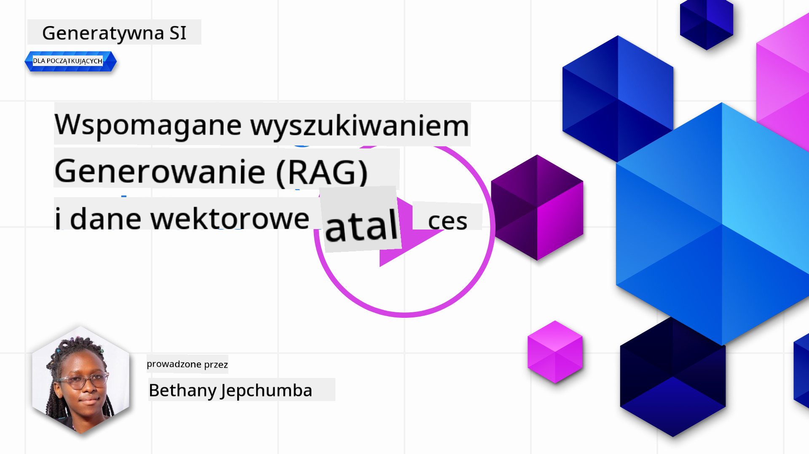
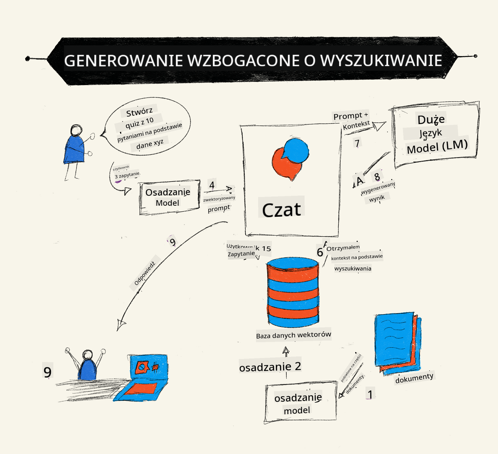

<!--
CO_OP_TRANSLATOR_METADATA:
{
  "original_hash": "b4b0266fbadbba7ded891b6485adc66d",
  "translation_date": "2025-10-18T00:53:29+00:00",
  "source_file": "15-rag-and-vector-databases/README.md",
  "language_code": "pl"
}
-->
# Generowanie wspomagane wyszukiwaniem (RAG) i bazy danych wektorowych

[](https://youtu.be/4l8zhHUBeyI?si=BmvDmL1fnHtgQYkL)

W lekcji dotyczącej aplikacji wyszukiwania krótko omówiliśmy, jak zintegrować własne dane z dużymi modelami językowymi (LLM). W tej lekcji zagłębimy się w koncepcję osadzania danych w aplikacji LLM, mechanikę tego procesu oraz metody przechowywania danych, w tym osadzeń i tekstu.

> **Wideo wkrótce**

## Wprowadzenie

W tej lekcji omówimy następujące zagadnienia:

- Wprowadzenie do RAG, czym jest i dlaczego jest wykorzystywane w sztucznej inteligencji (AI).

- Zrozumienie, czym są bazy danych wektorowych i stworzenie jednej dla naszej aplikacji.

- Praktyczny przykład integracji RAG z aplikacją.

## Cele nauki

Po ukończeniu tej lekcji będziesz w stanie:

- Wyjaśnić znaczenie RAG w wyszukiwaniu i przetwarzaniu danych.

- Skonfigurować aplikację RAG i osadzić swoje dane w LLM.

- Skutecznie zintegrować RAG i bazy danych wektorowych w aplikacjach LLM.

## Nasz scenariusz: ulepszanie LLM za pomocą własnych danych

W tej lekcji chcemy dodać nasze własne notatki do startupu edukacyjnego, co pozwoli chatbotowi uzyskać więcej informacji na różne tematy. Dzięki naszym notatkom uczniowie będą mogli lepiej się uczyć i zrozumieć różne zagadnienia, co ułatwi im przygotowanie się do egzaminów. Aby stworzyć nasz scenariusz, użyjemy:

- `Azure OpenAI:` LLM, którego użyjemy do stworzenia naszego chatbota

- `Lekcja dla początkujących na temat sieci neuronowych:` dane, na których osadzimy nasz LLM

- `Azure AI Search` i `Azure Cosmos DB:` baza danych wektorowych do przechowywania naszych danych i tworzenia indeksu wyszukiwania

Użytkownicy będą mogli tworzyć quizy na podstawie swoich notatek, fiszki do powtórek oraz podsumowania w formie zwięzłych przeglądów. Aby rozpocząć, przyjrzyjmy się, czym jest RAG i jak działa:

## Generowanie wspomagane wyszukiwaniem (RAG)

Chatbot oparty na LLM przetwarza zapytania użytkownika, aby generować odpowiedzi. Jest zaprojektowany tak, aby być interaktywny i angażować użytkowników w szerokim zakresie tematów. Jednak jego odpowiedzi są ograniczone do kontekstu dostarczonego w danych treningowych. Na przykład, wiedza GPT-4 kończy się na wrześniu 2021 roku, co oznacza, że nie zna wydarzeń, które miały miejsce po tym okresie. Ponadto dane używane do trenowania LLM nie zawierają poufnych informacji, takich jak osobiste notatki czy podręczniki produktów firmy.

### Jak działają RAG (Generowanie wspomagane wyszukiwaniem)



Załóżmy, że chcesz wdrożyć chatbota, który tworzy quizy na podstawie Twoich notatek. Wymaga to połączenia z bazą wiedzy. Tutaj z pomocą przychodzi RAG. RAG działa w następujący sposób:

- **Baza wiedzy:** Przed wyszukiwaniem dokumenty muszą zostać zaimportowane i wstępnie przetworzone, zazwyczaj poprzez podzielenie dużych dokumentów na mniejsze fragmenty, przekształcenie ich w osadzenia tekstowe i przechowywanie w bazie danych.

- **Zapytanie użytkownika:** użytkownik zadaje pytanie.

- **Wyszukiwanie:** Gdy użytkownik zadaje pytanie, model osadzeń wyszukuje odpowiednie informacje w naszej bazie wiedzy, aby dostarczyć więcej kontekstu, który zostanie włączony do zapytania.

- **Generowanie wspomagane:** LLM ulepsza swoją odpowiedź na podstawie wyszukanych danych. Pozwala to na generowanie odpowiedzi nie tylko na podstawie danych wstępnie przeszkolonych, ale także na podstawie istotnych informacji z dodanego kontekstu. Wyszukane dane są używane do wzbogacenia odpowiedzi LLM. Następnie LLM zwraca odpowiedź na pytanie użytkownika.


Architektura RAG jest implementowana za pomocą transformatorów składających się z dwóch części: kodera i dekodera. Na przykład, gdy użytkownik zadaje pytanie, tekst wejściowy jest "kodowany" na wektory, które przechwytują znaczenie słów, a następnie wektory są "dekodowane" w naszym indeksie dokumentów, generując nowy tekst na podstawie zapytania użytkownika. LLM wykorzystuje zarówno model kodera, jak i dekodera do generowania odpowiedzi.

Dwa podejścia do implementacji RAG, zgodnie z proponowanym artykułem: [Retrieval-Augmented Generation for Knowledge intensive NLP (natural language processing software) Tasks](https://arxiv.org/pdf/2005.11401.pdf?WT.mc_id=academic-105485-koreyst), to:

- **_RAG-Sequence_** wykorzystujący wyszukane dokumenty do przewidywania najlepszego możliwego rozwiązania zapytania użytkownika.

- **RAG-Token** wykorzystujący dokumenty do generowania kolejnego tokenu, a następnie wyszukiwania ich w celu odpowiedzi na zapytanie użytkownika.

### Dlaczego warto korzystać z RAG?

- **Bogactwo informacji:** zapewnia, że odpowiedzi tekstowe są aktualne i zgodne z rzeczywistością. Dzięki temu poprawia wydajność w zadaniach specyficznych dla danej dziedziny, uzyskując dostęp do wewnętrznej bazy wiedzy.

- Redukuje fabrykowanie informacji, wykorzystując **weryfikowalne dane** z bazy wiedzy, aby dostarczyć kontekst do zapytań użytkownika.

- Jest **kosztowo efektywne**, ponieważ jest bardziej ekonomiczne w porównaniu do dostrajania LLM.

## Tworzenie bazy wiedzy

Nasza aplikacja opiera się na naszych osobistych danych, tj. lekcji o sieciach neuronowych z programu nauczania AI dla początkujących.

### Bazy danych wektorowych

Baza danych wektorowych, w przeciwieństwie do tradycyjnych baz danych, jest specjalistyczną bazą danych zaprojektowaną do przechowywania, zarządzania i wyszukiwania osadzonych wektorów. Przechowuje numeryczne reprezentacje dokumentów. Rozbijanie danych na numeryczne osadzenia ułatwia naszemu systemowi AI zrozumienie i przetwarzanie danych.

Przechowujemy nasze osadzenia w bazach danych wektorowych, ponieważ LLM mają ograniczenie liczby tokenów, które akceptują jako dane wejściowe. Ponieważ nie można przekazać całych osadzeń do LLM, musimy je podzielić na fragmenty, a gdy użytkownik zada pytanie, osadzenia najbardziej podobne do pytania zostaną zwrócone razem z zapytaniem. Podział na fragmenty również zmniejsza koszty związane z liczbą tokenów przekazywanych przez LLM.

Niektóre popularne bazy danych wektorowych to Azure Cosmos DB, Clarifyai, Pinecone, Chromadb, ScaNN, Qdrant i DeepLake. Możesz stworzyć model Azure Cosmos DB za pomocą Azure CLI, używając następującego polecenia:

```bash
az login
az group create -n <resource-group-name> -l <location>
az cosmosdb create -n <cosmos-db-name> -r <resource-group-name>
az cosmosdb list-keys -n <cosmos-db-name> -g <resource-group-name>
```

### Od tekstu do osadzeń

Przed przechowywaniem naszych danych musimy je przekształcić w osadzenia wektorowe, zanim zostaną zapisane w bazie danych. Jeśli pracujesz z dużymi dokumentami lub długimi tekstami, możesz je podzielić na fragmenty na podstawie zapytań, których się spodziewasz. Podział na fragmenty można przeprowadzić na poziomie zdania lub akapitu. Ponieważ podział na fragmenty wywodzi znaczenia z otaczających słów, możesz dodać dodatkowy kontekst do fragmentu, na przykład dodając tytuł dokumentu lub włączając tekst przed lub po fragmencie. Możesz podzielić dane w następujący sposób:

```python
def split_text(text, max_length, min_length):
    words = text.split()
    chunks = []
    current_chunk = []

    for word in words:
        current_chunk.append(word)
        if len(' '.join(current_chunk)) < max_length and len(' '.join(current_chunk)) > min_length:
            chunks.append(' '.join(current_chunk))
            current_chunk = []

    # If the last chunk didn't reach the minimum length, add it anyway
    if current_chunk:
        chunks.append(' '.join(current_chunk))

    return chunks
```

Po podzieleniu na fragmenty możemy osadzić nasz tekst, korzystając z różnych modeli osadzeń. Niektóre modele, które można wykorzystać, to: word2vec, ada-002 od OpenAI, Azure Computer Vision i wiele innych. Wybór modelu zależy od używanych języków, rodzaju kodowanej treści (tekst/obrazy/dźwięk), rozmiaru danych wejściowych, które może zakodować, oraz długości wyjściowego osadzenia.

Przykład osadzonego tekstu przy użyciu modelu OpenAI `text-embedding-ada-002`:


## Wyszukiwanie i wyszukiwanie wektorowe

Gdy użytkownik zadaje pytanie, wyszukiwarka przekształca je w wektor za pomocą kodera zapytań, a następnie przeszukuje nasz indeks dokumentów w poszukiwaniu odpowiednich wektorów w dokumencie, które są związane z danymi wejściowymi. Po zakończeniu przekształca zarówno wektor wejściowy, jak i wektory dokumentów w tekst i przekazuje je przez LLM.

### Wyszukiwanie

Wyszukiwanie odbywa się, gdy system próbuje szybko znaleźć dokumenty z indeksu, które spełniają kryteria wyszukiwania. Celem wyszukiwarki jest uzyskanie dokumentów, które będą używane do dostarczenia kontekstu i osadzenia LLM w Twoich danych.

Istnieje kilka sposobów wyszukiwania w naszej bazie danych, takich jak:

- **Wyszukiwanie słów kluczowych** - używane do wyszukiwania tekstów.

- **Wyszukiwanie semantyczne** - wykorzystuje semantyczne znaczenie słów.

- **Wyszukiwanie wektorowe** - przekształca dokumenty z tekstu na reprezentacje wektorowe za pomocą modeli osadzeń. Wyszukiwanie odbywa się poprzez zapytania do dokumentów, których reprezentacje wektorowe są najbliższe pytaniu użytkownika.

- **Hybrydowe** - połączenie zarówno wyszukiwania słów kluczowych, jak i wyszukiwania wektorowego.

Problem z wyszukiwaniem pojawia się, gdy w bazie danych nie ma odpowiedzi podobnej do zapytania, system zwróci wtedy najlepsze dostępne informacje. Można jednak zastosować takie taktyki, jak ustawienie maksymalnej odległości dla trafności lub użycie wyszukiwania hybrydowego, które łączy zarówno słowa kluczowe, jak i wyszukiwanie wektorowe. W tej lekcji użyjemy wyszukiwania hybrydowego, które łączy wyszukiwanie wektorowe i słów kluczowych. Przechowamy nasze dane w ramce danych z kolumnami zawierającymi fragmenty oraz osadzenia.

### Podobieństwo wektorowe

Wyszukiwarka przeszuka bazę wiedzy w poszukiwaniu osadzeń, które są blisko siebie, najbliższych sąsiadów, ponieważ są to teksty podobne. W scenariuszu, gdy użytkownik zadaje zapytanie, jest ono najpierw osadzane, a następnie dopasowywane do podobnych osadzeń. Powszechną miarą używaną do określenia, jak bardzo podobne są różne wektory, jest podobieństwo cosinusowe, które opiera się na kącie między dwoma wektorami.

Możemy mierzyć podobieństwo za pomocą innych alternatyw, takich jak odległość euklidesowa, która jest prostą linią między końcami wektorów, oraz iloczyn skalarny, który mierzy sumę iloczynów odpowiadających sobie elementów dwóch wektorów.

### Indeks wyszukiwania

Podczas wyszukiwania będziemy musieli zbudować indeks wyszukiwania dla naszej bazy wiedzy, zanim przeprowadzimy wyszukiwanie. Indeks przechowuje nasze osadzenia i może szybko wyszukiwać najbardziej podobne fragmenty nawet w dużej bazie danych. Możemy stworzyć nasz indeks lokalnie, używając:

```python
from sklearn.neighbors import NearestNeighbors

embeddings = flattened_df['embeddings'].to_list()

# Create the search index
nbrs = NearestNeighbors(n_neighbors=5, algorithm='ball_tree').fit(embeddings)

# To query the index, you can use the kneighbors method
distances, indices = nbrs.kneighbors(embeddings)
```

### Ponowne rangowanie

Po zapytaniu bazy danych może być konieczne posortowanie wyników od najbardziej trafnych. LLM do ponownego rangowania wykorzystuje uczenie maszynowe, aby poprawić trafność wyników wyszukiwania, porządkując je od najbardziej trafnych. Korzystając z Azure AI Search, ponowne rangowanie odbywa się automatycznie za pomocą semantycznego ponownego rangera. Przykład działania ponownego rangowania przy użyciu najbliższych sąsiadów:

```python
# Find the most similar documents
distances, indices = nbrs.kneighbors([query_vector])

index = []
# Print the most similar documents
for i in range(3):
    index = indices[0][i]
    for index in indices[0]:
        print(flattened_df['chunks'].iloc[index])
        print(flattened_df['path'].iloc[index])
        print(flattened_df['distances'].iloc[index])
    else:
        print(f"Index {index} not found in DataFrame")
```

## Łączenie wszystkiego w całość

Ostatnim krokiem jest dodanie naszego LLM do procesu, aby móc uzyskać odpowiedzi osadzone w naszych danych. Możemy to zaimplementować w następujący sposób:

```python
user_input = "what is a perceptron?"

def chatbot(user_input):
    # Convert the question to a query vector
    query_vector = create_embeddings(user_input)

    # Find the most similar documents
    distances, indices = nbrs.kneighbors([query_vector])

    # add documents to query  to provide context
    history = []
    for index in indices[0]:
        history.append(flattened_df['chunks'].iloc[index])

    # combine the history and the user input
    history.append(user_input)

    # create a message object
    messages=[
        {"role": "system", "content": "You are an AI assistant that helps with AI questions."},
        {"role": "user", "content": history[-1]}
    ]

    # use chat completion to generate a response
    response = openai.chat.completions.create(
        model="gpt-4",
        temperature=0.7,
        max_tokens=800,
        messages=messages
    )

    return response.choices[0].message

chatbot(user_input)
```

## Ocena naszej aplikacji

### Metryki oceny

- Jakość dostarczanych odpowiedzi, zapewniając, że brzmią naturalnie, płynnie i jak odpowiedzi człowieka.

- Osadzenie danych: ocena, czy odpowiedź pochodzi z dostarczonych dokumentów.

- Trafność: ocena, czy odpowiedź pasuje i jest związana z zadanym pytaniem.

- Płynność - czy odpowiedź jest poprawna gramatycznie.

## Przykłady zastosowania RAG (Generowanie wspomagane wyszukiwaniem) i baz danych wektorowych

Istnieje wiele różnych zastosowań, w których wywołania funkcji mogą poprawić Twoją aplikację, takich jak:

- Odpowiadanie na pytania: osadzenie danych firmy w czacie, który może być używany przez pracowników do zadawania pytań.

- Systemy rekomendacji: gdzie można stworzyć system dopasowujący najbardziej podobne wartości, np. filmy, restauracje i wiele innych.

- Usługi chatbotów: można przechowywać historię czatu i personalizować rozmowę na podstawie danych użytkownika.

- Wyszukiwanie obrazów na podstawie osadzeń wektorowych, przydatne przy rozpoznawaniu obrazów i wykrywaniu anomalii.

## Podsumowanie

Omówiliśmy podstawowe aspekty RAG, od dodawania danych do aplikacji, przez zapytanie użytkownika, aż po wynik. Aby uprościć tworzenie RAG, możesz użyć takich frameworków jak Semantic Kernel, Langchain czy Autogen.

## Zadanie

Aby kontynuować naukę o Generowaniu wspomaganym wyszukiwaniem (RAG), możesz:

- Zbudować interfejs użytkownika dla aplikacji, korzystając z wybranego frameworka.

- Wykorzystać framework, taki jak LangChain lub Semantic Kernel, i odtworzyć swoją aplikację.

Gratulacje z ukończenia lekcji 👏.

## Nauka nie kończy się tutaj, kontynuuj swoją podróż

Po ukończeniu tej lekcji zapoznaj się z naszą [kolekcją nauki o generatywnej AI](https://aka.ms/genai-collection?WT.mc_id=academic-105485-koreyst), aby dalej rozwijać swoją wiedzę na temat generatywnej AI!

---

**Zastrzeżenie**:  
Ten dokument został przetłumaczony za pomocą usługi tłumaczenia AI [Co-op Translator](https://github.com/Azure/co-op-translator). Chociaż staramy się zapewnić dokładność, prosimy pamiętać, że automatyczne tłumaczenia mogą zawierać błędy lub nieścisłości. Oryginalny dokument w jego rodzimym języku powinien być uznawany za autorytatywne źródło. W przypadku informacji krytycznych zaleca się skorzystanie z profesjonalnego tłumaczenia przez człowieka. Nie ponosimy odpowiedzialności za jakiekolwiek nieporozumienia lub błędne interpretacje wynikające z użycia tego tłumaczenia.