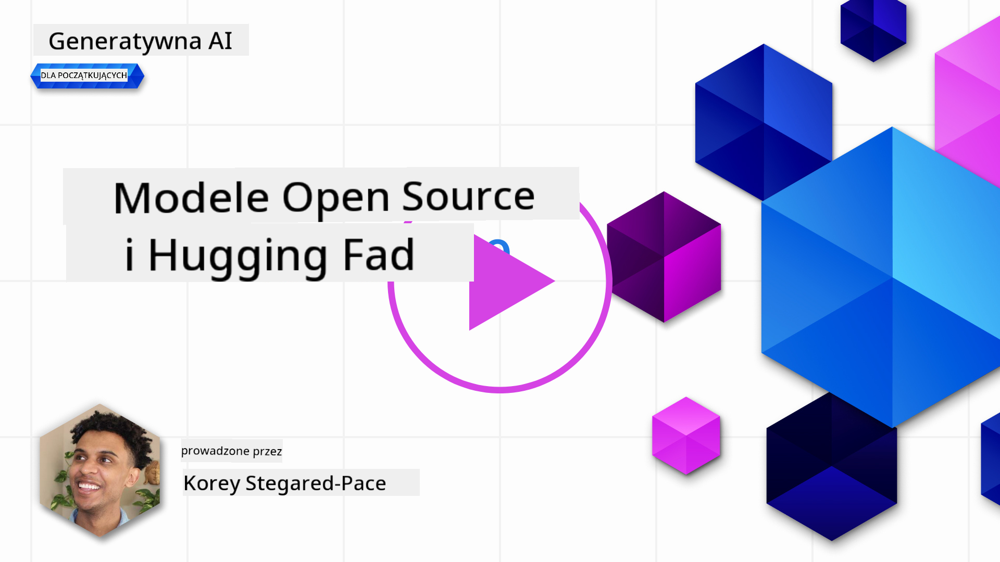
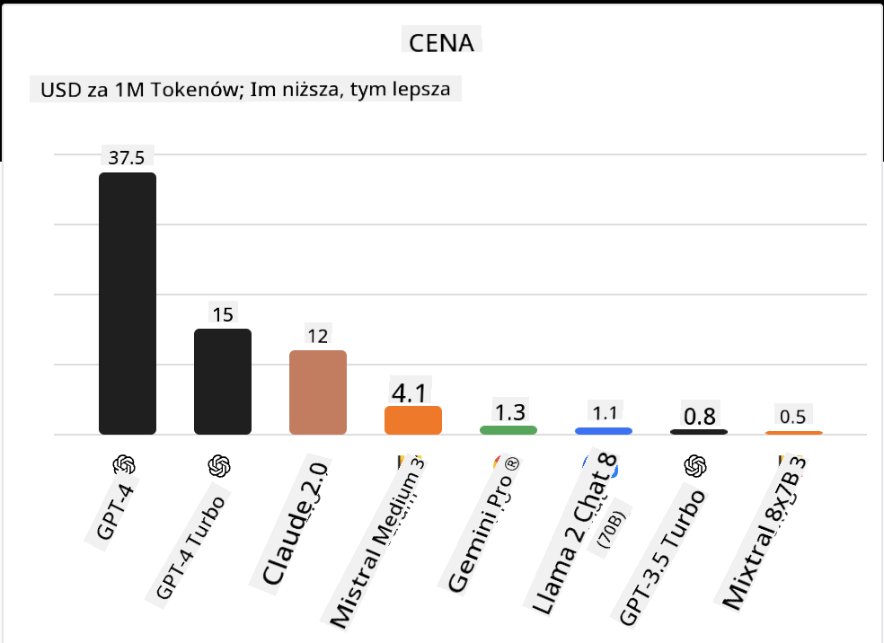
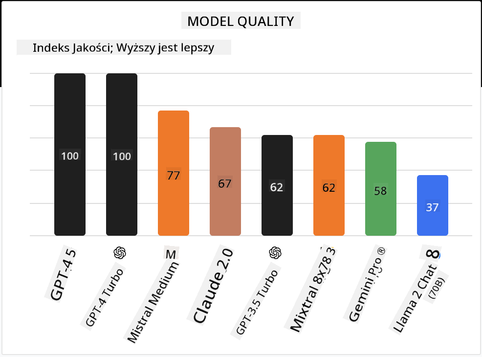

<!--
CO_OP_TRANSLATOR_METADATA:
{
  "original_hash": "0bba96e53ab841d99db731892a51fab8",
  "translation_date": "2025-05-20T06:54:53+00:00",
  "source_file": "16-open-source-models/README.md",
  "language_code": "pl"
}
-->

## Wprowadzenie

Świat otwartoźródłowych LLM jest ekscytujący i nieustannie się rozwija. Ta lekcja ma na celu dostarczenie dogłębnego spojrzenia na modele open source. Jeśli szukasz informacji o tym, jak modele zastrzeżone porównują się do modeli open source, przejdź do lekcji ["Badanie i porównywanie różnych LLM"](../02-exploring-and-comparing-different-llms/README.md?WT.mc_id=academic-105485-koreyst). Ta lekcja obejmie również temat dostrajania, ale bardziej szczegółowe wyjaśnienie można znaleźć w lekcji ["Dostrajanie LLM"](../18-fine-tuning/README.md?WT.mc_id=academic-105485-koreyst).

## Cele nauki

- Zrozumienie modeli open source
- Zrozumienie korzyści z pracy z modelami open source
- Badanie dostępnych modeli otwartych na platformach Hugging Face i Azure AI Studio

## Czym są modele open source?

Oprogramowanie open source odegrało kluczową rolę w rozwoju technologii w różnych dziedzinach. Inicjatywa Open Source (OSI) zdefiniowała [10 kryteriów dla oprogramowania](https://web.archive.org/web/20241126001143/https://opensource.org/osd?WT.mc_id=academic-105485-koreyst), aby mogło być klasyfikowane jako open source. Kod źródłowy musi być otwarcie udostępniony na licencji zatwierdzonej przez OSI.

Chociaż rozwój LLM ma podobne elementy do rozwijania oprogramowania, proces nie jest dokładnie taki sam. Wywołało to wiele dyskusji w społeczności na temat definicji open source w kontekście LLM. Aby model był zgodny z tradycyjną definicją open source, powinny być publicznie dostępne następujące informacje:

- Zbiory danych używane do trenowania modelu.
- Pełne wagi modelu jako część treningu.
- Kod oceny.
- Kod dostrajania.
- Pełne wagi modelu i metryki treningowe.

Obecnie istnieje tylko kilka modeli, które spełniają te kryteria. [Model OLMo stworzony przez Allen Institute for Artificial Intelligence (AllenAI)](https://huggingface.co/allenai/OLMo-7B?WT.mc_id=academic-105485-koreyst) jest jednym z nich.

Na potrzeby tej lekcji będziemy dalej odnosić się do modeli jako "modele otwarte", ponieważ mogą one nie spełniać powyższych kryteriów w momencie pisania.

## Korzyści z modeli otwartych

**Wysoka możliwość dostosowania** - Ponieważ modele otwarte są wydawane z szczegółowymi informacjami o treningu, badacze i deweloperzy mogą modyfikować wnętrze modelu. To umożliwia tworzenie wysoko wyspecjalizowanych modeli, które są dostrojone do konkretnego zadania lub obszaru badań. Przykłady obejmują generowanie kodu, operacje matematyczne i biologię.

**Koszt** - Koszt na token za użycie i wdrożenie tych modeli jest niższy niż modeli zastrzeżonych. Przy budowaniu aplikacji Generative AI, warto rozważyć wydajność w stosunku do ceny podczas pracy z tymi modelami w przypadku użycia.

 Źródło: Artificial Analysis

**Elastyczność** - Praca z modelami otwartymi pozwala na elastyczność w zakresie używania różnych modeli lub ich łączenia. Przykładem jest [HuggingChat Assistants](https://huggingface.co/chat?WT.mc_id=academic-105485-koreyst), gdzie użytkownik może wybrać model używany bezpośrednio w interfejsie użytkownika:

## Badanie różnych modeli otwartych

### Llama 2

[LLama2](https://huggingface.co/meta-llama?WT.mc_id=academic-105485-koreyst), opracowany przez Meta, jest modelem otwartym zoptymalizowanym dla aplikacji opartych na czacie. Jest to wynikiem metody dostrajania, która obejmowała dużą ilość dialogów i opinii ludzkich. Dzięki tej metodzie model generuje więcej wyników zgodnych z oczekiwaniami ludzkimi, co zapewnia lepsze doświadczenie użytkownika.

Przykłady dostrojonych wersji Llama obejmują [Japanese Llama](https://huggingface.co/elyza/ELYZA-japanese-Llama-2-7b?WT.mc_id=academic-105485-koreyst), który specjalizuje się w języku japońskim oraz [Llama Pro](https://huggingface.co/TencentARC/LLaMA-Pro-8B?WT.mc_id=academic-105485-koreyst), który jest ulepszoną wersją modelu podstawowego.

### Mistral

[Mistral](https://huggingface.co/mistralai?WT.mc_id=academic-105485-koreyst) jest modelem otwartym o silnym nacisku na wysoką wydajność i efektywność. Wykorzystuje podejście Mixture-of-Experts, które łączy grupę wyspecjalizowanych modeli ekspertów w jeden system, gdzie w zależności od wejścia, wybierane są określone modele do użycia. Dzięki temu obliczenia są bardziej efektywne, ponieważ modele zajmują się tylko tymi wejściami, w których się specjalizują.

Przykłady dostrojonych wersji Mistral obejmują [BioMistral](https://huggingface.co/BioMistral/BioMistral-7B?text=Mon+nom+est+Thomas+et+mon+principal?WT.mc_id=academic-105485-koreyst), który skupia się na dziedzinie medycznej, oraz [OpenMath Mistral](https://huggingface.co/nvidia/OpenMath-Mistral-7B-v0.1-hf?WT.mc_id=academic-105485-koreyst), który wykonuje obliczenia matematyczne.

### Falcon

[Falcon](https://huggingface.co/tiiuae?WT.mc_id=academic-105485-koreyst) to LLM stworzony przez Instytut Innowacji Technologicznych (**TII**). Falcon-40B został wytrenowany na 40 miliardach parametrów, co pokazało, że przewyższa GPT-3 przy mniejszym budżecie obliczeniowym. Jest to możliwe dzięki zastosowaniu algorytmu FlashAttention i wielozapytaniowej uwagi, które pozwalają zmniejszyć wymagania pamięciowe w czasie inferencji. Dzięki skróconemu czasowi inferencji, Falcon-40B nadaje się do aplikacji czatowych.

Przykłady dostrojonych wersji Falcon obejmują [OpenAssistant](https://huggingface.co/OpenAssistant/falcon-40b-sft-top1-560?WT.mc_id=academic-105485-koreyst), asystenta zbudowanego na otwartych modelach oraz [GPT4ALL](https://huggingface.co/nomic-ai/gpt4all-falcon?WT.mc_id=academic-105485-koreyst), który dostarcza wyższą wydajność niż model podstawowy.

## Jak wybrać

Nie ma jednej odpowiedzi na pytanie, jak wybrać model otwarty. Dobrym miejscem na początek jest skorzystanie z funkcji filtrowania według zadania w Azure AI Studio. Pomoże to zrozumieć, do jakich typów zadań model został wytrenowany. Hugging Face utrzymuje również LLM Leaderboard, który pokazuje najlepsze modele w oparciu o określone metryki.

Podczas porównywania LLM w różnych typach, [Artificial Analysis](https://artificialanalysis.ai/?WT.mc_id=academic-105485-koreyst) to kolejny świetny zasób:

 Źródło: Artificial Analysis

Jeśli pracujesz nad konkretnym przypadkiem użycia, skuteczne może być wyszukiwanie dostrojonych wersji skupionych na tym samym obszarze. Eksperymentowanie z wieloma otwartymi modelami, aby zobaczyć, jak spełniają one oczekiwania twoje i użytkowników, to kolejna dobra praktyka.

## Następne kroki

Najlepszą częścią modeli otwartych jest to, że można szybko zacząć z nimi pracować. Sprawdź [Katalog modeli Azure AI Studio](https://ai.azure.com?WT.mc_id=academic-105485-koreyst), który zawiera konkretną kolekcję Hugging Face z omawianymi tutaj modelami.

## Nauka nie kończy się tutaj, kontynuuj podróż

Po ukończeniu tej lekcji, sprawdź naszą [kolekcję nauki o AI generatywnej](https://aka.ms/genai-collection?WT.mc_id=academic-105485-koreyst), aby kontynuować podnoszenie swojej wiedzy o AI generatywnej!

**Zrzeczenie się odpowiedzialności**:  
Ten dokument został przetłumaczony za pomocą usługi tłumaczeniowej AI [Co-op Translator](https://github.com/Azure/co-op-translator). Chociaż dążymy do dokładności, prosimy mieć na uwadze, że automatyczne tłumaczenia mogą zawierać błędy lub nieścisłości. Oryginalny dokument w jego rodzimym języku powinien być uważany za źródło autorytatywne. W przypadku informacji krytycznych zaleca się profesjonalne tłumaczenie przez człowieka. Nie ponosimy odpowiedzialności za wszelkie nieporozumienia lub błędne interpretacje wynikające z użycia tego tłumaczenia.