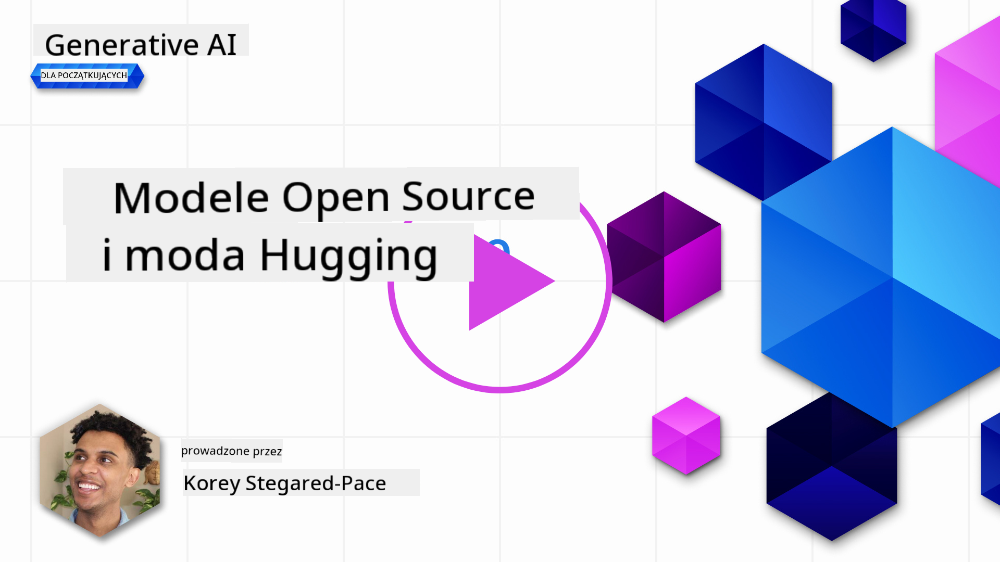
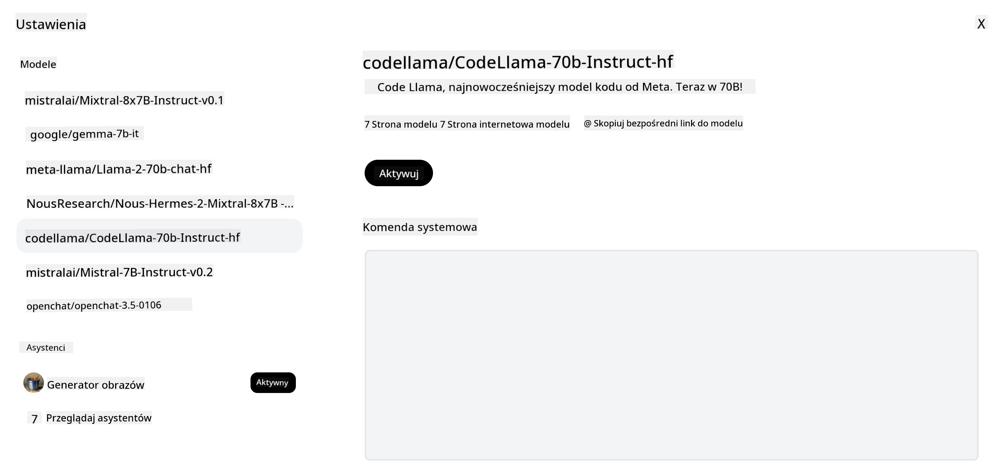
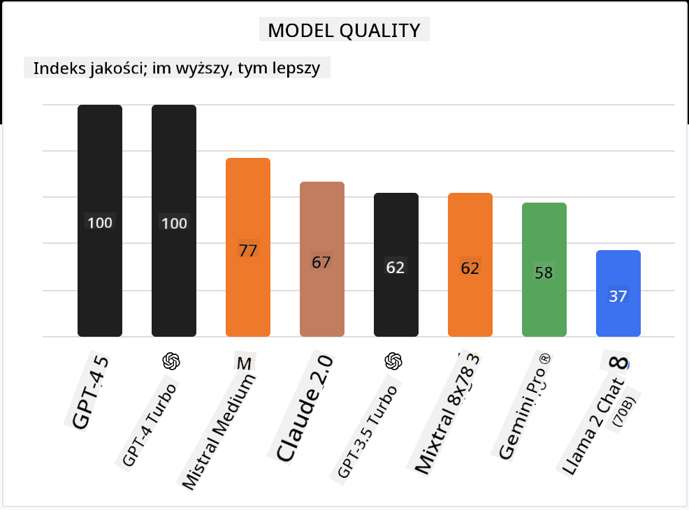

<!--
CO_OP_TRANSLATOR_METADATA:
{
  "original_hash": "0bba96e53ab841d99db731892a51fab8",
  "translation_date": "2025-07-09T17:09:17+00:00",
  "source_file": "16-open-source-models/README.md",
  "language_code": "pl"
}
-->

## Wprowadzenie

Świat otwartych modeli LLM jest ekscytujący i nieustannie się rozwija. Ta lekcja ma na celu szczegółowe przybliżenie tematu modeli open source. Jeśli szukasz informacji o tym, jak modele własnościowe wypadają na tle modeli open source, przejdź do lekcji ["Exploring and Comparing Different LLMs"](../02-exploring-and-comparing-different-llms/README.md?WT.mc_id=academic-105485-koreyst). W tej lekcji poruszymy również temat fine-tuningu, ale bardziej szczegółowe wyjaśnienie znajdziesz w lekcji ["Fine-Tuning LLMs"](../18-fine-tuning/README.md?WT.mc_id=academic-105485-koreyst).

## Cele nauki

- Poznanie modeli open source
- Zrozumienie korzyści płynących z pracy z modelami open source
- Zapoznanie się z otwartymi modelami dostępnymi na Hugging Face i w Azure AI Studio

## Czym są modele Open Source?

Oprogramowanie open source odegrało kluczową rolę w rozwoju technologii w różnych dziedzinach. Open Source Initiative (OSI) zdefiniowało [10 kryteriów dla oprogramowania](https://web.archive.org/web/20241126001143/https://opensource.org/osd?WT.mc_id=academic-105485-koreyst), które musi spełniać, aby zostać uznane za open source. Kod źródłowy musi być publicznie udostępniony na licencji zatwierdzonej przez OSI.

Chociaż rozwój LLM ma podobne elementy do tworzenia oprogramowania, proces ten nie jest dokładnie taki sam. To wywołało wiele dyskusji w społeczności na temat definicji open source w kontekście LLM. Aby model spełniał tradycyjną definicję open source, następujące informacje powinny być publicznie dostępne:

- Zbiory danych użyte do trenowania modelu.
- Pełne wagi modelu jako część treningu.
- Kod do ewaluacji.
- Kod do fine-tuningu.
- Pełne wagi modelu oraz metryki treningowe.

Obecnie istnieje tylko kilka modeli spełniających te kryteria. Jednym z nich jest [model OLMo stworzony przez Allen Institute for Artificial Intelligence (AllenAI)](https://huggingface.co/allenai/OLMo-7B?WT.mc_id=academic-105485-koreyst).

W tej lekcji będziemy odnosić się do modeli jako "otwarte modele", ponieważ mogą one nie spełniać powyższych kryteriów w momencie pisania.

## Korzyści z otwartych modeli

**Wysoka możliwość dostosowania** – Ponieważ otwarte modele są udostępniane wraz ze szczegółowymi informacjami o treningu, badacze i deweloperzy mogą modyfikować ich wnętrze. Umożliwia to tworzenie wysoce wyspecjalizowanych modeli, dostrojonych do konkretnego zadania lub dziedziny. Przykładami są generowanie kodu, operacje matematyczne czy biologia.

**Koszty** – Koszt za token przy używaniu i wdrażaniu tych modeli jest niższy niż w przypadku modeli własnościowych. Budując aplikacje Generative AI, warto rozważyć stosunek wydajności do ceny w kontekście swojego zastosowania.

  
Źródło: Artificial Analysis

**Elastyczność** – Praca z otwartymi modelami pozwala na elastyczność w wyborze różnych modeli lub ich łączeniu. Przykładem są [HuggingChat Assistants](https://huggingface.co/chat?WT.mc_id=academic-105485-koreyst), gdzie użytkownik może wybrać model bezpośrednio w interfejsie użytkownika:

## Przegląd różnych otwartych modeli

### Llama 2

[LLama2](https://huggingface.co/meta-llama?WT.mc_id=academic-105485-koreyst), opracowany przez Meta, to otwarty model zoptymalizowany pod kątem aplikacji czatowych. Wynika to z metody fine-tuningu, która obejmowała dużą ilość dialogów i opinii ludzi. Dzięki temu model generuje wyniki bardziej zgodne z oczekiwaniami użytkowników, co przekłada się na lepsze doświadczenie.

Przykładami wersji fine-tunowanych Llamy są [Japanese Llama](https://huggingface.co/elyza/ELYZA-japanese-Llama-2-7b?WT.mc_id=academic-105485-koreyst), specjalizująca się w języku japońskim, oraz [Llama Pro](https://huggingface.co/TencentARC/LLaMA-Pro-8B?WT.mc_id=academic-105485-koreyst), ulepszona wersja modelu bazowego.

### Mistral

[Mistral](https://huggingface.co/mistralai?WT.mc_id=academic-105485-koreyst) to otwarty model skupiający się na wysokiej wydajności i efektywności. Wykorzystuje podejście Mixture-of-Experts, które łączy grupę wyspecjalizowanych modeli eksperckich w jeden system, gdzie w zależności od wejścia wybierane są odpowiednie modele. Dzięki temu obliczenia są bardziej efektywne, ponieważ modele zajmują się tylko tymi danymi, w których są specjalistami.

Przykładami wersji fine-tunowanych Mistrala są [BioMistral](https://huggingface.co/BioMistral/BioMistral-7B?text=Mon+nom+est+Thomas+et+mon+principal?WT.mc_id=academic-105485-koreyst), skoncentrowany na medycynie, oraz [OpenMath Mistral](https://huggingface.co/nvidia/OpenMath-Mistral-7B-v0.1-hf?WT.mc_id=academic-105485-koreyst), który wykonuje obliczenia matematyczne.

### Falcon

[Falcon](https://huggingface.co/tiiuae?WT.mc_id=academic-105485-koreyst) to LLM stworzony przez Technology Innovation Institute (**TII**). Falcon-40B został wytrenowany na 40 miliardach parametrów i wykazuje lepszą wydajność niż GPT-3 przy mniejszym budżecie obliczeniowym. Jest to możliwe dzięki zastosowaniu algorytmu FlashAttention oraz multiquery attention, które zmniejszają wymagania pamięciowe podczas inferencji. Dzięki temu Falcon-40B nadaje się do zastosowań czatowych.

Przykładami wersji fine-tunowanych Falcona są [OpenAssistant](https://huggingface.co/OpenAssistant/falcon-40b-sft-top1-560?WT.mc_id=academic-105485-koreyst), asystent oparty na otwartych modelach, oraz [GPT4ALL](https://huggingface.co/nomic-ai/gpt4all-falcon?WT.mc_id=academic-105485-koreyst), który oferuje wyższą wydajność niż model bazowy.

## Jak wybrać?

Nie ma jednej odpowiedzi na pytanie, jak wybrać otwarty model. Dobrym punktem startowym jest skorzystanie z funkcji filtrowania według zadania w Azure AI Studio. Pomoże to zrozumieć, do jakich typów zadań model był trenowany. Hugging Face prowadzi również LLM Leaderboard, który pokazuje najlepiej działające modele według określonych metryk.

Jeśli chcesz porównać LLM w różnych kategoriach, [Artificial Analysis](https://artificialanalysis.ai/?WT.mc_id=academic-105485-koreyst) to kolejne świetne źródło:

  
Źródło: Artificial Analysis

Pracując nad konkretnym przypadkiem użycia, warto poszukać wersji fine-tunowanych skupionych na danej dziedzinie. Eksperymentowanie z kilkoma otwartymi modelami, aby sprawdzić, jak spełniają oczekiwania twoje i użytkowników, to również dobra praktyka.

## Kolejne kroki

Najlepsze w otwartych modelach jest to, że możesz zacząć z nimi pracować bardzo szybko. Sprawdź [Azure AI Studio Model Catalog](https://ai.azure.com?WT.mc_id=academic-105485-koreyst), który zawiera specjalną kolekcję modeli Hugging Face, o których tu mówiliśmy.

## Nauka nie kończy się tutaj, kontynuuj podróż

Po ukończeniu tej lekcji zapoznaj się z naszą [kolekcją Generative AI Learning](https://aka.ms/genai-collection?WT.mc_id=academic-105485-koreyst), aby dalej rozwijać swoją wiedzę o Generative AI!

**Zastrzeżenie**:  
Niniejszy dokument został przetłumaczony przy użyciu usługi tłumaczenia AI [Co-op Translator](https://github.com/Azure/co-op-translator). Chociaż dokładamy starań, aby tłumaczenie było jak najbardziej precyzyjne, prosimy mieć na uwadze, że automatyczne tłumaczenia mogą zawierać błędy lub nieścisłości. Oryginalny dokument w języku źródłowym należy traktować jako źródło autorytatywne. W przypadku informacji o kluczowym znaczeniu zalecane jest skorzystanie z profesjonalnego tłumaczenia wykonanego przez człowieka. Nie ponosimy odpowiedzialności za jakiekolwiek nieporozumienia lub błędne interpretacje wynikające z korzystania z tego tłumaczenia.