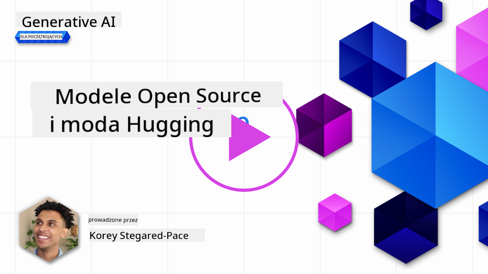
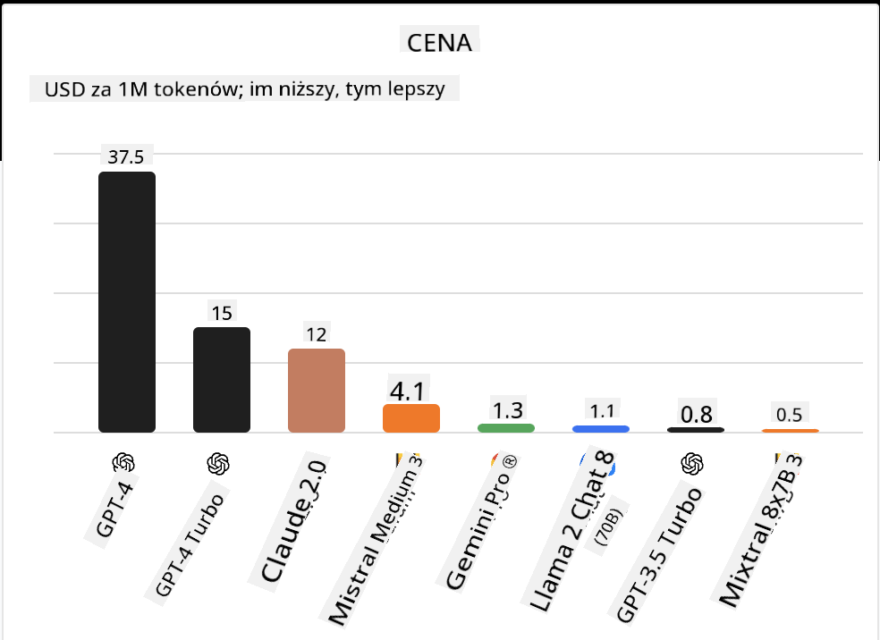
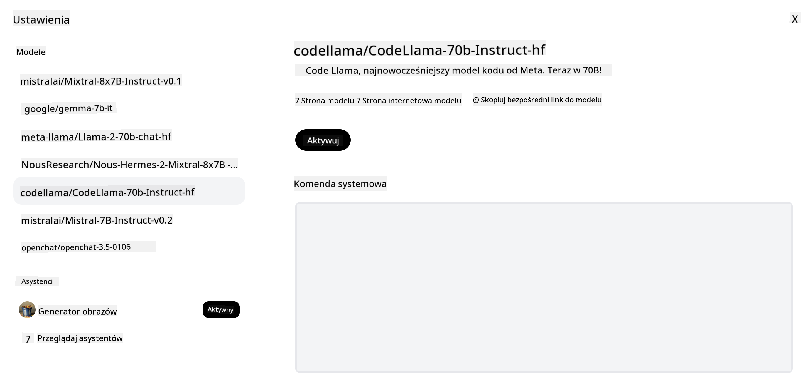

<!--
CO_OP_TRANSLATOR_METADATA:
{
  "original_hash": "0bba96e53ab841d99db731892a51fab8",
  "translation_date": "2025-06-25T23:55:53+00:00",
  "source_file": "16-open-source-models/README.md",
  "language_code": "pl"
}
-->

## Wprowadzenie

Świat open-source LLMs jest ekscytujący i ciągle się rozwija. Ta lekcja ma na celu dostarczenie szczegółowego spojrzenia na modele open source. Jeśli szukasz informacji na temat porównania modeli zastrzeżonych z modelami open source, przejdź do lekcji ["Exploring and Comparing Different LLMs"](../02-exploring-and-comparing-different-llms/README.md?WT.mc_id=academic-105485-koreyst). Ta lekcja obejmie również temat dostrajania, ale bardziej szczegółowe wyjaśnienie znajdziesz w lekcji ["Fine-Tuning LLMs"](../18-fine-tuning/README.md?WT.mc_id=academic-105485-koreyst).

## Cele nauki

- Zrozumienie modeli open source
- Zrozumienie korzyści płynących z pracy z modelami open source
- Eksploracja dostępnych modeli open na Hugging Face i Azure AI Studio

## Czym są modele Open Source?

Oprogramowanie open source odegrało kluczową rolę w rozwoju technologii w różnych dziedzinach. Open Source Initiative (OSI) zdefiniowała [10 kryteriów dla oprogramowania](https://web.archive.org/web/20241126001143/https://opensource.org/osd?WT.mc_id=academic-105485-koreyst), aby mogło być sklasyfikowane jako open source. Kod źródłowy musi być otwarcie udostępniony na podstawie licencji zatwierdzonej przez OSI.

Chociaż rozwój LLMs ma podobne elementy do tworzenia oprogramowania, proces nie jest dokładnie taki sam. To wywołało wiele dyskusji w społeczności na temat definicji open source w kontekście LLMs. Aby model był zgodny z tradycyjną definicją open source, powinny być publicznie dostępne następujące informacje:

- Zbiory danych używane do trenowania modelu.
- Pełne wagi modelu jako część treningu.
- Kod ewaluacji.
- Kod dostrajania.
- Pełne wagi modelu i metryki treningowe.

Obecnie jest tylko kilka modeli, które spełniają te kryteria. [Model OLMo stworzony przez Allen Institute for Artificial Intelligence (AllenAI)](https://huggingface.co/allenai/OLMo-7B?WT.mc_id=academic-105485-koreyst) jest jednym z nich.

Na potrzeby tej lekcji będziemy odtąd odnosić się do modeli jako "modele otwarte", ponieważ mogą nie spełniać powyższych kryteriów w momencie pisania.

## Korzyści z modeli otwartych

**Wysoce konfigurowalne** - Ponieważ modele otwarte są wydawane z szczegółowymi informacjami o treningu, badacze i deweloperzy mogą modyfikować wnętrze modelu. To umożliwia tworzenie wysoce specjalistycznych modeli dostrojonych do konkretnego zadania lub obszaru badań. Niektóre przykłady to generowanie kodu, operacje matematyczne i biologia.

**Koszt** - Koszt na token za używanie i wdrażanie tych modeli jest niższy niż w przypadku modeli zastrzeżonych. Podczas tworzenia aplikacji Generative AI, warto rozważyć wydajność w porównaniu do ceny, pracując z tymi modelami w swoim przypadku użycia.

  
Źródło: Artificial Analysis

**Elastyczność** - Praca z modelami otwartymi umożliwia elastyczność w zakresie używania różnych modeli lub ich łączenia. Przykładem jest [HuggingChat Assistants](https://huggingface.co/chat?WT.mc_id=academic-105485-koreyst), gdzie użytkownik może wybrać model używany bezpośrednio w interfejsie użytkownika:

## Eksploracja różnych modeli otwartych

### Llama 2

[LLama2](https://huggingface.co/meta-llama?WT.mc_id=academic-105485-koreyst), opracowany przez Meta, jest modelem otwartym zoptymalizowanym do aplikacji opartych na czacie. Wynika to z jego metody dostrajania, która obejmowała dużą ilość dialogów i opinii ludzi. Dzięki tej metodzie model generuje więcej wyników zgodnych z oczekiwaniami ludzi, co zapewnia lepsze doświadczenie użytkownika.

Niektóre przykłady dostrojonych wersji Llama to [Japanese Llama](https://huggingface.co/elyza/ELYZA-japanese-Llama-2-7b?WT.mc_id=academic-105485-koreyst), który specjalizuje się w języku japońskim oraz [Llama Pro](https://huggingface.co/TencentARC/LLaMA-Pro-8B?WT.mc_id=academic-105485-koreyst), który jest ulepszoną wersją modelu bazowego.

### Mistral

[Mistral](https://huggingface.co/mistralai?WT.mc_id=academic-105485-koreyst) jest modelem otwartym z silnym naciskiem na wysoką wydajność i efektywność. Wykorzystuje podejście Mixture-of-Experts, które łączy grupę wyspecjalizowanych modeli eksperckich w jeden system, gdzie w zależności od wejścia, wybrane są określone modele do użycia. To sprawia, że obliczenia są bardziej efektywne, ponieważ modele zajmują się tylko wejściami, w których się specjalizują.

Niektóre przykłady dostrojonych wersji Mistral to [BioMistral](https://huggingface.co/BioMistral/BioMistral-7B?text=Mon+nom+est+Thomas+et+mon+principal?WT.mc_id=academic-105485-koreyst), który koncentruje się na dziedzinie medycznej oraz [OpenMath Mistral](https://huggingface.co/nvidia/OpenMath-Mistral-7B-v0.1-hf?WT.mc_id=academic-105485-koreyst), który wykonuje obliczenia matematyczne.

### Falcon

[Falcon](https://huggingface.co/tiiuae?WT.mc_id=academic-105485-koreyst) jest LLM stworzonym przez Technology Innovation Institute (**TII**). Falcon-40B został wytrenowany na 40 miliardach parametrów, co wykazano, że działa lepiej niż GPT-3 przy mniejszym budżecie obliczeniowym. Wynika to z użycia algorytmu FlashAttention i uwagi wielozapytaniowej, które pozwalają na zmniejszenie wymagań dotyczących pamięci w czasie wnioskowania. Dzięki skróconemu czasowi wnioskowania, Falcon-40B nadaje się do aplikacji opartych na czacie.

Niektóre przykłady dostrojonych wersji Falcon to [OpenAssistant](https://huggingface.co/OpenAssistant/falcon-40b-sft-top1-560?WT.mc_id=academic-105485-koreyst), asystent zbudowany na modelach otwartych oraz [GPT4ALL](https://huggingface.co/nomic-ai/gpt4all-falcon?WT.mc_id=academic-105485-koreyst), który dostarcza wyższą wydajność niż model bazowy.

## Jak wybrać

Nie ma jednej odpowiedzi na wybór modelu otwartego. Dobrym miejscem na rozpoczęcie jest użycie funkcji filtrowania według zadania w Azure AI Studio. Pomoże to zrozumieć, do jakiego rodzaju zadań model został wytrenowany. Hugging Face również utrzymuje LLM Leaderboard, który pokazuje najlepsze modele na podstawie określonych metryk.

Podczas porównywania LLMs różnych typów, [Artificial Analysis](https://artificialanalysis.ai/?WT.mc_id=academic-105485-koreyst) jest kolejnym świetnym źródłem:

  
Źródło: Artificial Analysis

Jeśli pracujesz nad konkretnym przypadkiem użycia, wyszukiwanie dostrojonych wersji skupionych na tym samym obszarze może być skuteczne. Eksperymentowanie z wieloma modelami otwartymi, aby zobaczyć, jak się sprawdzają zgodnie z Twoimi i użytkowników oczekiwaniami, jest kolejną dobrą praktyką.

## Następne kroki

Najlepsze w modelach otwartych jest to, że można zacząć z nimi pracować dość szybko. Sprawdź [Azure AI Studio Model Catalog](https://ai.azure.com?WT.mc_id=academic-105485-koreyst), który zawiera specjalną kolekcję Hugging Face z modelami, które omawialiśmy tutaj.

## Nauka nie kończy się tutaj, kontynuuj podróż

Po ukończeniu tej lekcji, sprawdź naszą [Generative AI Learning collection](https://aka.ms/genai-collection?WT.mc_id=academic-105485-koreyst), aby dalej rozwijać swoją wiedzę na temat Generative AI!

**Zastrzeżenie**:  
Ten dokument został przetłumaczony przy użyciu usługi tłumaczenia AI [Co-op Translator](https://github.com/Azure/co-op-translator). Chociaż dążymy do dokładności, prosimy mieć na uwadze, że automatyczne tłumaczenia mogą zawierać błędy lub nieścisłości. Oryginalny dokument w jego rodzimym języku powinien być uważany za źródło autorytatywne. W przypadku istotnych informacji zaleca się profesjonalne tłumaczenie przez człowieka. Nie ponosimy odpowiedzialności za wszelkie nieporozumienia lub błędne interpretacje wynikające z użycia tego tłumaczenia.