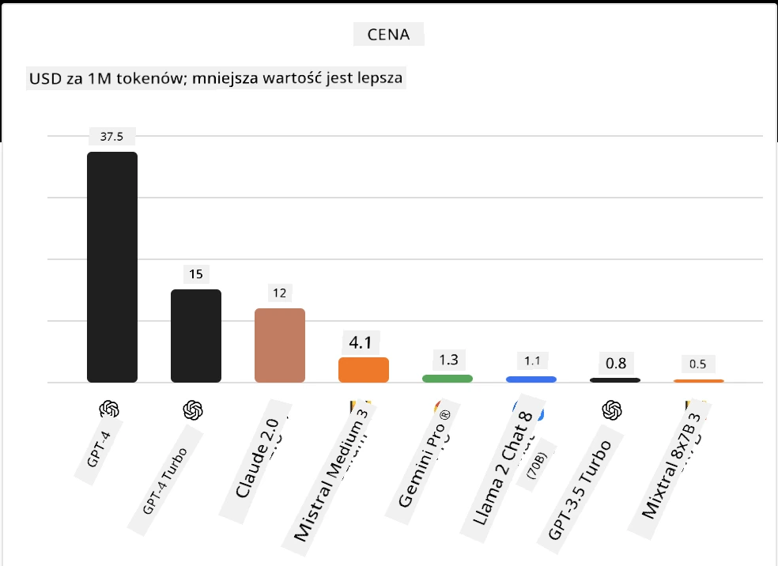
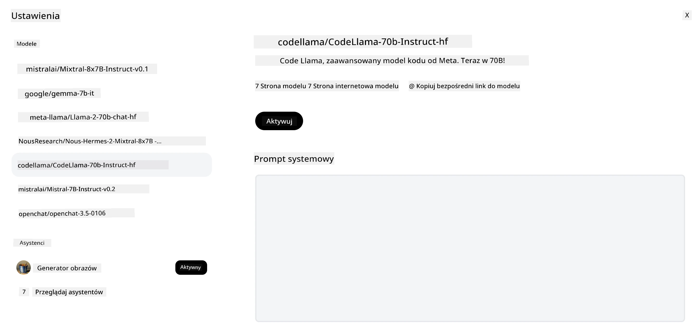
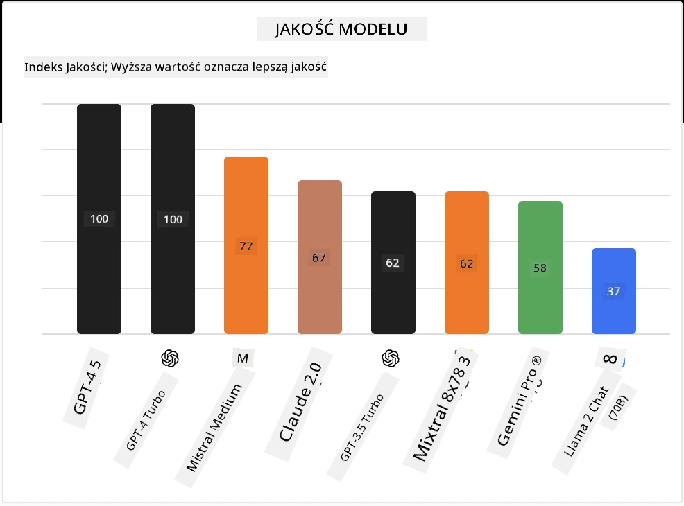

## Wprowadzenie

Świat otwartych modeli LLM jest ekscytujący i nieustannie się rozwija. Ta lekcja ma na celu zapewnienie dogłębnego spojrzenia na modele open source. Jeśli szukasz informacji na temat porównania modeli własnościowych z modelami otwartymi, przejdź do lekcji ["Eksploracja i porównanie różnych LLM"](../02-exploring-and-comparing-different-llms/README.md?WT.mc_id=academic-105485-koreyst). Ta lekcja również poruszy temat fine-tuningu, ale bardziej szczegółowe wyjaśnienie znajdziesz w lekcji ["Fine-Tuning LLM"](../18-fine-tuning/README.md?WT.mc_id=academic-105485-koreyst).

## Cele nauki

- Zdobycie wiedzy na temat modeli open source
- Zrozumienie korzyści płynących z pracy z modelami open source
- Eksploracja dostępnych modeli open na Hugging Face oraz katalogu modeli Microsoft Foundry

## Czym są modele Open Source?

Oprogramowanie open source odegrało kluczową rolę w rozwoju technologii w różnych dziedzinach. Inicjatywa Open Source (OSI) zdefiniowała [10 kryteriów dla oprogramowania](https://web.archive.org/web/20241126001143/https://opensource.org/osd?WT.mc_id=academic-105485-koreyst), które kwalifikuje je jako otwarte. Kod źródłowy musi być publicznie udostępniony na licencji zatwierdzonej przez OSI.

Chociaż proces tworzenia LLM ma podobne elementy do tworzenia oprogramowania, nie jest on dokładnie taki sam. Powoduje to wiele dyskusji w społeczności na temat definicji open source w kontekście LLM. Aby model był zgodny z tradycyjną definicją open source, następujące informacje powinny być publicznie dostępne:

- Zbiory danych użyte do trenowania modelu.
- Pełne wagi modelu jako część treningu.
- Kod do ewaluacji.
- Kod do fine-tuningu.
- Pełne wagi modelu i metryki treningu.

Obecnie istnieje tylko kilka modeli spełniających te kryteria. [Model OLMo stworzony przez Allen Institute for Artificial Intelligence (AllenAI)](https://huggingface.co/allenai/OLMo-7B?WT.mc_id=academic-105485-koreyst) jest jednym z nich.

W tej lekcji będziemy odnosić się do modeli jako "otwarte modele", ponieważ mogą one nie spełniać powyższych kryteriów w chwili pisania.

## Korzyści z modeli otwartych

**Wysoka konfigurowalność** - Ponieważ otwarte modele są udostępniane z szczegółowymi informacjami dotyczącymi treningu, badacze i deweloperzy mogą modyfikować ich wnętrze. Umożliwia to tworzenie wysoce wyspecjalizowanych modeli dostrojonych do konkretnego zadania lub dziedziny nauki. Przykładami są generowanie kodu, operacje matematyczne i biologia.

**Koszt** - Koszt za token przy używaniu i wdrażaniu tych modeli jest niższy niż w przypadku modeli własnościowych. Budując aplikacje Generative AI, warto rozważyć wydajność względem ceny dla swojego konkretnego przypadku użycia.

Źródło: Artificial Analysis

**Elastyczność** - Praca z otwartymi modelami daje elastyczność w zakresie używania różnych modeli lub ich łączenia. Przykładem są [Asystenci HuggingChat](https://huggingface.co/chat?WT.mc_id=academic-105485-koreyst), gdzie użytkownik może wybrać model bezpośrednio w interfejsie:

## Eksploracja różnych modeli otwartych

### Llama 2

[Llama2](https://huggingface.co/meta-llama?WT.mc_id=academic-105485-koreyst), opracowany przez Meta, to otwarty model zoptymalizowany do zastosowań czatowych. Jest to możliwe dzięki metodzie fine-tuningu, która obejmowała dużą ilość dialogów i feedback od ludzi. Dzięki temu model generuje wyniki bardziej zgodne z oczekiwaniami użytkowników, co poprawia doświadczenie użytkownika.

Przykładami wersji fine-tuningu Llamy są [Japanese Llama](https://huggingface.co/elyza/ELYZA-japanese-Llama-2-7b?WT.mc_id=academic-105485-koreyst), specjalizująca się w japońskim, oraz [Llama Pro](https://huggingface.co/TencentARC/LLaMA-Pro-8B?WT.mc_id=academic-105485-koreyst), będąca ulepszoną wersją modelu bazowego.

### Mistral

[Mistral](https://huggingface.co/mistralai?WT.mc_id=academic-105485-koreyst) to otwarty model z silnym naciskiem na wysoką wydajność i efektywność. Wykorzystuje podejście Mixture-of-Experts, które łączy grupę wyspecjalizowanych modeli ekspertów w jeden system, gdzie w zależności od wejścia są wybierane odpowiednie modele do użycia. Sprawia to, że obliczenia są bardziej efektywne, gdyż modele odpowiadają tylko na te dane wejściowe, w których są wyspecjalizowane.

Przykładami wersji fine-tuned Mistrala są [BioMistral](https://huggingface.co/BioMistral/BioMistral-7B?text=Mon+nom+est+Thomas+et+mon+principal?WT.mc_id=academic-105485-koreyst), skupiający się na medycynie, oraz [OpenMath Mistral](https://huggingface.co/nvidia/OpenMath-Mistral-7B-v0.1-hf?WT.mc_id=academic-105485-koreyst), służący do obliczeń matematycznych.

### Falcon

[Falcon](https://huggingface.co/tiiuae?WT.mc_id=academic-105485-koreyst) to LLM stworzony przez Technology Innovation Institute (**TII**). Falcon-40B był trenowany na 40 miliardach parametrów i wykazał się lepszą wydajnością niż GPT-3 przy mniejszym budżecie obliczeniowym. To zasługa użycia algorytmu FlashAttention i multiquery attention, które zmniejszają wymagania pamięciowe podczas inferencji. Dzięki krótszemu czasowi inferencji Falcon-40B nadaje się do zastosowań czatowych.

Przykładami wersji fine-tuned Falcona są [OpenAssistant](https://huggingface.co/OpenAssistant/falcon-40b-sft-top1-560?WT.mc_id=academic-105485-koreyst), asystent zbudowany na otwartych modelach, oraz [GPT4ALL](https://huggingface.co/nomic-ai/gpt4all-falcon?WT.mc_id=academic-105485-koreyst), który zapewnia wyższą wydajność niż model bazowy.

## Jak wybrać

Nie ma jednej odpowiedzi na wybór otwartego modelu. Dobrym miejscem na start jest użycie filtra według zadania w katalogu modeli Microsoft Foundry. Pomoże to zrozumieć, do jakich zadań model był trenowany. Hugging Face utrzymuje również LLM Leaderboard, który pokazuje najlepsze modele na podstawie określonych metryk.

Jeśli chcesz porównać LLM w różnych kategoriach, [Artificial Analysis](https://artificialanalysis.ai/?WT.mc_id=academic-105485-koreyst) to kolejne świetne źródło:

Źródło: Artificial Analysis

Jeśli pracujesz nad konkretnym przypadkiem użycia, efektywne może być poszukiwanie wersji fine-tuningu skoncentrowanych na tej samej dziedzinie. Eksperymentowanie z wieloma otwartymi modelami, aby zobaczyć, jak działają zgodnie z Twoimi i oczekiwaniami użytkowników, to kolejna dobra praktyka.

## Następne kroki

Najlepsze w modelach otwartych jest to, że możesz zacząć z nimi pracować dość szybko. Sprawdź [katalog modeli Microsoft Foundry](https://ai.azure.com?WT.mc_id=academic-105485-koreyst), który zawiera specjalną kolekcję Hugging Face z modelami omówionymi tutaj.

## Nauka na tym się nie kończy, kontynuuj podróż

Po ukończeniu tej lekcji sprawdź naszą [kolekcję nauki Generative AI](https://aka.ms/genai-collection?WT.mc_id=academic-105485-koreyst), aby dalej podnosić swoje umiejętności w dziedzinie Generative AI!

---

<!-- CO-OP TRANSLATOR DISCLAIMER START -->
**Zastrzeżenie**:
Niniejszy dokument został przetłumaczony za pomocą usługi tłumaczenia AI [Co-op Translator](https://github.com/Azure/co-op-translator). Choć dążymy do dokładności, prosimy pamiętać, że automatyczne tłumaczenia mogą zawierać błędy lub niedokładności. Oryginalny dokument w jego języku źródłowym należy uznawać za autorytatywne źródło. W przypadku informacji krytycznych zalecane jest skorzystanie z profesjonalnego tłumaczenia wykonanego przez człowieka. Nie ponosimy odpowiedzialności za jakiekolwiek nieporozumienia lub błędne interpretacje wynikające z użycia tego tłumaczenia.
<!-- CO-OP TRANSLATOR DISCLAIMER END -->