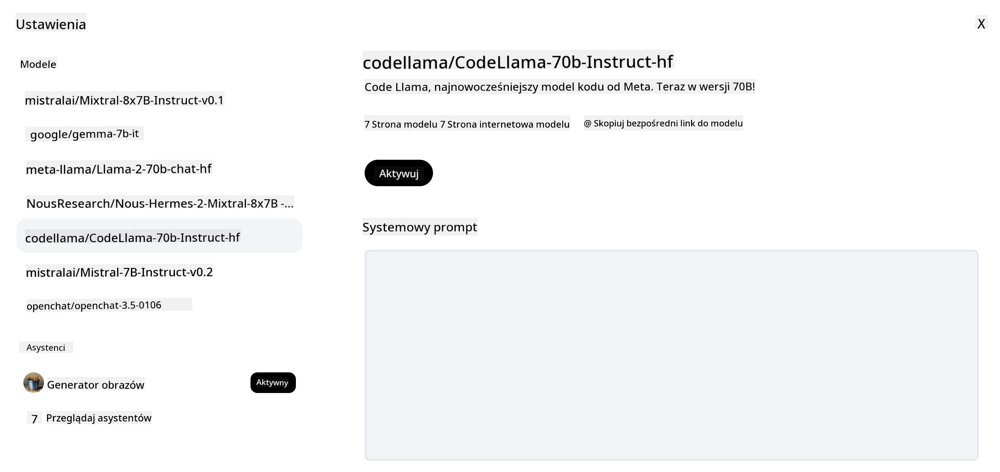

<!--
CO_OP_TRANSLATOR_METADATA:
{
  "original_hash": "a8b2d4bb727c877ebf9edff8623d16b9",
  "translation_date": "2025-09-06T10:17:05+00:00",
  "source_file": "16-open-source-models/README.md",
  "language_code": "pl"
}
-->

## Wprowadzenie

Świat otwartych modeli LLM jest ekscytujący i nieustannie się rozwija. Celem tej lekcji jest szczegółowe omówienie otwartych modeli. Jeśli szukasz informacji na temat porównania modeli własnościowych z otwartymi, przejdź do lekcji ["Eksploracja i porównanie różnych LLM"](../02-exploring-and-comparing-different-llms/README.md?WT.mc_id=academic-105485-koreyst). W tej lekcji poruszymy również temat dostrajania modeli, ale bardziej szczegółowe wyjaśnienie znajdziesz w lekcji ["Dostrajanie LLM"](../18-fine-tuning/README.md?WT.mc_id=academic-105485-koreyst).

## Cele nauki

- Zrozumienie otwartych modeli
- Poznanie korzyści wynikających z pracy z otwartymi modelami
- Eksploracja dostępnych otwartych modeli na platformach Hugging Face i Azure AI Studio

## Czym są otwarte modele?

Oprogramowanie open source odegrało kluczową rolę w rozwoju technologii w różnych dziedzinach. Open Source Initiative (OSI) zdefiniowała [10 kryteriów dla oprogramowania](https://web.archive.org/web/20241126001143/https://opensource.org/osd?WT.mc_id=academic-105485-koreyst), aby mogło być uznane za open source. Kod źródłowy musi być otwarcie udostępniony na licencji zatwierdzonej przez OSI.

Chociaż rozwój LLM ma podobne elementy do tworzenia oprogramowania, proces ten nie jest dokładnie taki sam. To wywołało wiele dyskusji w społeczności na temat definicji open source w kontekście LLM. Aby model był zgodny z tradycyjną definicją open source, następujące informacje powinny być publicznie dostępne:

- Zbiory danych użyte do trenowania modelu.
- Pełne wagi modelu jako część treningu.
- Kod oceny.
- Kod dostrajania.
- Pełne wagi modelu i metryki treningowe.

Obecnie tylko kilka modeli spełnia te kryteria. [Model OLMo stworzony przez Allen Institute for Artificial Intelligence (AllenAI)](https://huggingface.co/allenai/OLMo-7B?WT.mc_id=academic-105485-koreyst) jest jednym z nich.

Na potrzeby tej lekcji będziemy odnosić się do modeli jako "otwarte modele", ponieważ mogą one nie spełniać powyższych kryteriów w momencie pisania.

## Korzyści z otwartych modeli

**Wysoka personalizacja** - Ponieważ otwarte modele są udostępniane z szczegółowymi informacjami o treningu, badacze i programiści mogą modyfikować wewnętrzne mechanizmy modelu. Umożliwia to tworzenie wysoce wyspecjalizowanych modeli dostrojonych do konkretnego zadania lub dziedziny. Przykłady obejmują generowanie kodu, operacje matematyczne i biologię.

**Koszt** - Koszt na token przy użyciu i wdrażaniu tych modeli jest niższy niż w przypadku modeli własnościowych. Podczas budowania aplikacji generatywnej AI warto przeanalizować wydajność w stosunku do ceny w kontekście użycia tych modeli.

  
Źródło: Artificial Analysis

**Elastyczność** - Praca z otwartymi modelami pozwala na elastyczność w korzystaniu z różnych modeli lub ich łączeniu. Przykładem jest [HuggingChat Assistants](https://huggingface.co/chat?WT.mc_id=academic-105485-koreyst), gdzie użytkownik może wybrać model używany bezpośrednio w interfejsie użytkownika:

## Eksploracja różnych otwartych modeli

### Llama 2

[LLama2](https://huggingface.co/meta-llama?WT.mc_id=academic-105485-koreyst), opracowany przez Meta, jest otwartym modelem zoptymalizowanym pod kątem aplikacji opartych na czacie. Wynika to z metody dostrajania, która obejmowała dużą ilość dialogów i opinii od ludzi. Dzięki tej metodzie model generuje wyniki bardziej zgodne z oczekiwaniami użytkowników, co zapewnia lepsze doświadczenie.

Przykłady dostrojonych wersji Llama to [Japanese Llama](https://huggingface.co/elyza/ELYZA-japanese-Llama-2-7b?WT.mc_id=academic-105485-koreyst), specjalizujący się w języku japońskim, oraz [Llama Pro](https://huggingface.co/TencentARC/LLaMA-Pro-8B?WT.mc_id=academic-105485-koreyst), który jest ulepszoną wersją modelu bazowego.

### Mistral

[Mistral](https://huggingface.co/mistralai?WT.mc_id=academic-105485-koreyst) to otwarty model skoncentrowany na wysokiej wydajności i efektywności. Wykorzystuje podejście Mixture-of-Experts, które łączy grupę wyspecjalizowanych modeli ekspertów w jeden system, gdzie w zależności od wejścia wybierane są odpowiednie modele. Dzięki temu obliczenia są bardziej efektywne, ponieważ modele zajmują się tylko tymi wejściami, w których się specjalizują.

Przykłady dostrojonych wersji Mistral to [BioMistral](https://huggingface.co/BioMistral/BioMistral-7B?text=Mon+nom+est+Thomas+et+mon+principal?WT.mc_id=academic-105485-koreyst), skoncentrowany na medycynie, oraz [OpenMath Mistral](https://huggingface.co/nvidia/OpenMath-Mistral-7B-v0.1-hf?WT.mc_id=academic-105485-koreyst), który wykonuje obliczenia matematyczne.

### Falcon

[Falcon](https://huggingface.co/tiiuae?WT.mc_id=academic-105485-koreyst) to LLM stworzony przez Technology Innovation Institute (**TII**). Falcon-40B został wytrenowany na 40 miliardach parametrów, co wykazało lepszą wydajność niż GPT-3 przy mniejszym budżecie obliczeniowym. Wynika to z zastosowania algorytmu FlashAttention i wielozapytaniowej uwagi, które pozwalają na zmniejszenie wymagań pamięciowych podczas inferencji. Dzięki skróconemu czasowi inferencji Falcon-40B nadaje się do aplikacji czatowych.

Przykłady dostrojonych wersji Falcon to [OpenAssistant](https://huggingface.co/OpenAssistant/falcon-40b-sft-top1-560?WT.mc_id=academic-105485-koreyst), asystent oparty na otwartych modelach, oraz [GPT4ALL](https://huggingface.co/nomic-ai/gpt4all-falcon?WT.mc_id=academic-105485-koreyst), który oferuje wyższą wydajność niż model bazowy.

## Jak wybrać?

Nie ma jednej odpowiedzi na pytanie, jak wybrać otwarty model. Dobrym miejscem na rozpoczęcie jest użycie funkcji filtrowania według zadania w Azure AI Studio. Pomoże to zrozumieć, do jakich typów zadań model został wytrenowany. Hugging Face prowadzi również LLM Leaderboard, który pokazuje najlepiej działające modele na podstawie określonych metryk.

Jeśli chcesz porównać LLM w różnych typach, [Artificial Analysis](https://artificialanalysis.ai/?WT.mc_id=academic-105485-koreyst) to kolejne świetne źródło:

  
Źródło: Artificial Analysis

Jeśli pracujesz nad konkretnym przypadkiem użycia, wyszukiwanie dostrojonych wersji skoncentrowanych na tej samej dziedzinie może być skuteczne. Eksperymentowanie z wieloma otwartymi modelami, aby zobaczyć, jak spełniają oczekiwania Twoje i Twoich użytkowników, to również dobra praktyka.

## Kolejne kroki

Najlepsze w otwartych modelach jest to, że można zacząć z nimi pracować bardzo szybko. Sprawdź [Azure AI Foundry Model Catalog](https://ai.azure.com?WT.mc_id=academic-105485-koreyst), który zawiera kolekcję Hugging Face z modelami omówionymi w tej lekcji.

## Nauka nie kończy się tutaj, kontynuuj podróż

Po ukończeniu tej lekcji sprawdź naszą [kolekcję nauki o generatywnej AI](https://aka.ms/genai-collection?WT.mc_id=academic-105485-koreyst), aby dalej rozwijać swoją wiedzę o generatywnej AI!

---

**Zastrzeżenie**:  
Ten dokument został przetłumaczony za pomocą usługi tłumaczenia AI [Co-op Translator](https://github.com/Azure/co-op-translator). Chociaż dokładamy wszelkich starań, aby tłumaczenie było precyzyjne, prosimy pamiętać, że automatyczne tłumaczenia mogą zawierać błędy lub nieścisłości. Oryginalny dokument w jego rodzimym języku powinien być uznawany za źródło autorytatywne. W przypadku informacji o kluczowym znaczeniu zaleca się skorzystanie z profesjonalnego tłumaczenia przez człowieka. Nie ponosimy odpowiedzialności za jakiekolwiek nieporozumienia lub błędne interpretacje wynikające z użycia tego tłumaczenia.