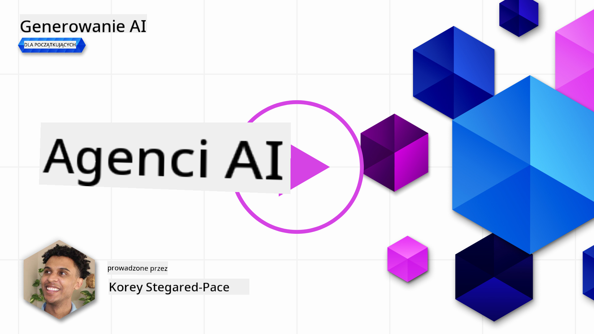
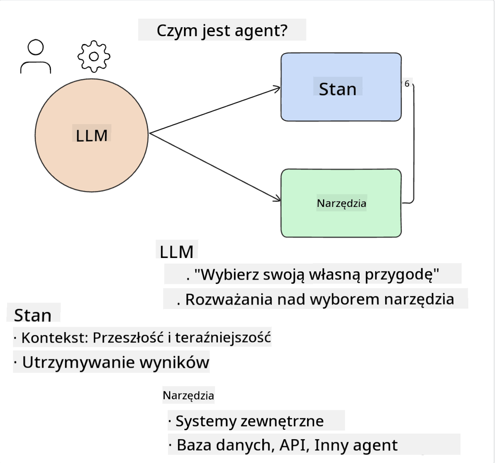
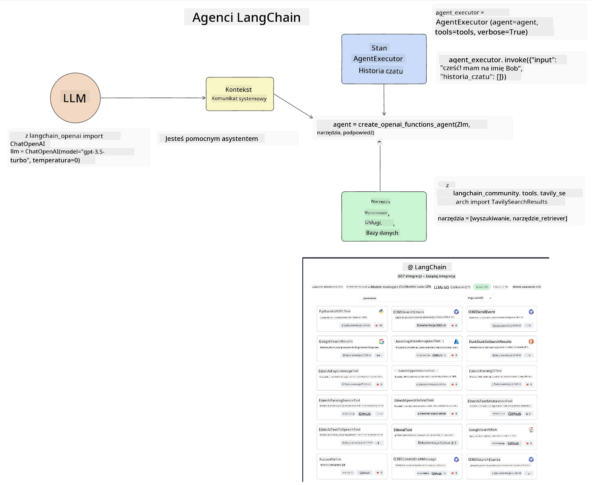
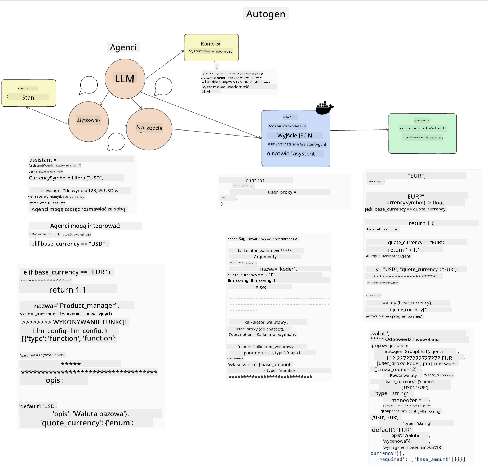
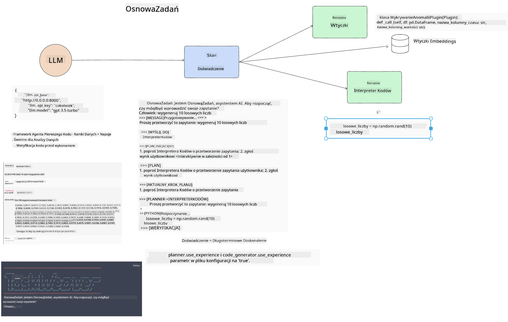
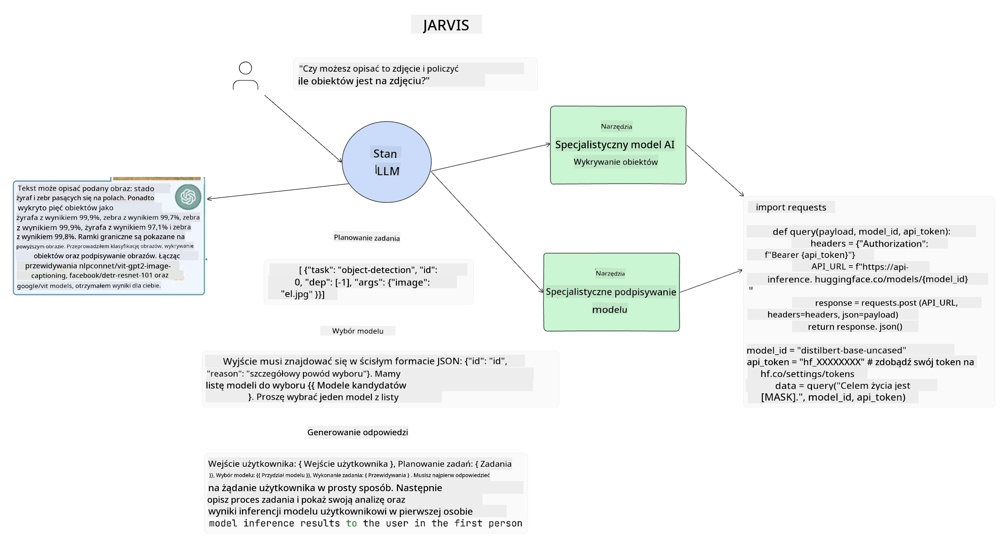

<!--
CO_OP_TRANSLATOR_METADATA:
{
  "original_hash": "11f03c81f190d9cbafd0f977dcbede6c",
  "translation_date": "2025-05-20T07:22:26+00:00",
  "source_file": "17-ai-agents/README.md",
  "language_code": "pl"
}
-->
[](https://aka.ms/gen-ai-lesson17-gh?WT.mc_id=academic-105485-koreyst)

## Wprowadzenie

Agenci AI to ekscytujący rozwój w dziedzinie Generative AI, umożliwiający ewolucję dużych modeli językowych (LLM) z asystentów w agentów zdolnych do podejmowania działań. Frameworki Agentów AI pozwalają deweloperom tworzyć aplikacje, które dają LLM dostęp do narzędzi i zarządzania stanem. Te frameworki zwiększają również widoczność, umożliwiając użytkownikom i deweloperom monitorowanie działań planowanych przez LLM, co poprawia zarządzanie doświadczeniami.

Lekcja obejmie następujące obszary:

- Zrozumienie, czym jest Agent AI - Czym dokładnie jest Agent AI?
- Eksploracja czterech różnych frameworków Agentów AI - Co je wyróżnia?
- Zastosowanie tych Agentów AI do różnych przypadków użycia - Kiedy powinniśmy używać Agentów AI?

## Cele nauki

Po ukończeniu tej lekcji będziesz w stanie:

- Wyjaśnić, czym są Agenci AI i jak można ich używać.
- Zrozumieć różnice między niektórymi popularnymi frameworkami Agentów AI i jak się różnią.
- Zrozumieć, jak działają Agenci AI, aby móc budować z nimi aplikacje.

## Czym są Agenci AI?

Agenci AI to bardzo ekscytujące pole w świecie Generative AI. Z tym entuzjazmem czasami pojawia się zamieszanie dotyczące terminów i ich zastosowania. Aby uprościć sprawę i uwzględnić większość narzędzi, które odnoszą się do Agentów AI, będziemy używać następującej definicji:

Agenci AI pozwalają dużym modelom językowym (LLM) wykonywać zadania, dając im dostęp do **stanu** i **narzędzi**.



Zdefiniujmy te pojęcia:

**Duże modele językowe** - To modele, o których mowa w całym tym kursie, takie jak GPT-3.5, GPT-4, Llama-2, itp.

**Stan** - Odnosi się do kontekstu, w którym działa LLM. LLM używa kontekstu swoich poprzednich działań oraz bieżącego kontekstu, kierując swoje decyzje dotyczące kolejnych działań. Frameworki Agentów AI umożliwiają deweloperom łatwiejsze utrzymanie tego kontekstu.

**Narzędzia** - Aby wykonać zadanie, które użytkownik zażądał, a LLM zaplanował, LLM potrzebuje dostępu do narzędzi. Przykłady narzędzi to baza danych, API, zewnętrzna aplikacja, a nawet inny LLM!

Te definicje, miejmy nadzieję, dadzą ci solidne podstawy, gdy będziemy przyglądać się, jak są one implementowane. Przyjrzyjmy się kilku różnym frameworkom Agentów AI:

## Agenci LangChain

[LangChain Agents](https://python.langchain.com/docs/how_to/#agents?WT.mc_id=academic-105485-koreyst) to implementacja definicji, które podaliśmy powyżej.

Aby zarządzać **stanem**, używa wbudowanej funkcji zwanej `AgentExecutor`. Akceptuje ona zdefiniowane `agent` oraz `tools`, które są dla niej dostępne.

`Agent Executor` przechowuje również historię czatu, aby zapewnić kontekst czatu.



LangChain oferuje [katalog narzędzi](https://integrations.langchain.com/tools?WT.mc_id=academic-105485-koreyst), które można zaimportować do swojej aplikacji, w której LLM może uzyskać dostęp. Są one tworzone przez społeczność i zespół LangChain.

Możesz następnie zdefiniować te narzędzia i przekazać je do `Agent Executor`.

Widoczność to kolejny ważny aspekt, gdy mówimy o Agentach AI. Ważne jest, aby deweloperzy aplikacji rozumieli, z którego narzędzia korzysta LLM i dlaczego. W tym celu zespół LangChain opracował LangSmith.

## AutoGen

Kolejnym frameworkiem Agentów AI, o którym będziemy rozmawiać, jest [AutoGen](https://microsoft.github.io/autogen/?WT.mc_id=academic-105485-koreyst). Głównym celem AutoGen są rozmowy. Agenci są zarówno **rozmowni**, jak i **dostosowywalni**.

**Rozmowni -** LLM mogą rozpocząć i kontynuować rozmowę z innym LLM, aby ukończyć zadanie. Odbywa się to poprzez tworzenie `AssistantAgents` i nadawanie im określonej wiadomości systemowej.

```python

autogen.AssistantAgent( name="Coder", llm_config=llm_config, ) pm = autogen.AssistantAgent( name="Product_manager", system_message="Creative in software product ideas.", llm_config=llm_config, )

```

**Dostosowywalni** - Agenci mogą być definiowani nie tylko jako LLM, ale również jako użytkownik lub narzędzie. Jako deweloper, możesz zdefiniować `UserProxyAgent`, który jest odpowiedzialny za interakcję z użytkownikiem w celu uzyskania informacji zwrotnej przy wykonywaniu zadania. Ta informacja zwrotna może kontynuować wykonywanie zadania lub je zatrzymać.

```python
user_proxy = UserProxyAgent(name="user_proxy")
```

### Stan i Narzędzia

Aby zmienić i zarządzać stanem, asystent Agent generuje kod Python, aby ukończyć zadanie.

Oto przykład procesu:



#### LLM Zdefiniowany z Wiadomością Systemową

```python
system_message="For weather related tasks, only use the functions you have been provided with. Reply TERMINATE when the task is done."
```

Te wiadomości systemowe kierują tym konkretnym LLM, które funkcje są istotne dla jego zadania. Pamiętaj, że z AutoGen możesz mieć wiele zdefiniowanych AssistantAgents z różnymi wiadomościami systemowymi.

#### Czat Rozpoczyna Użytkownik

```python
user_proxy.initiate_chat( chatbot, message="I am planning a trip to NYC next week, can you help me pick out what to wear? ", )

```

Ta wiadomość od user_proxy (Człowieka) rozpoczyna proces Agenta, aby zbadać możliwe funkcje, które powinien wykonać.

#### Funkcja jest Wykonywana

```bash
chatbot (to user_proxy):

***** Suggested tool Call: get_weather ***** Arguments: {"location":"New York City, NY","time_periond:"7","temperature_unit":"Celsius"} ******************************************************** --------------------------------------------------------------------------------

>>>>>>>> EXECUTING FUNCTION get_weather... user_proxy (to chatbot): ***** Response from calling function "get_weather" ***** 112.22727272727272 EUR ****************************************************************

```

Gdy początkowy czat zostanie przetworzony, Agent wyśle sugerowane narzędzie do wywołania. W tym przypadku jest to funkcja nazwana `get_weather`. Depending on your configuration, this function can be automatically executed and read by the Agent or can be executed based on user input.

You can find a list of [AutoGen code samples](https://microsoft.github.io/autogen/docs/Examples/?WT.mc_id=academic-105485-koreyst) to further explore how to get started building.

## Taskweaver

The next agent framework we will explore is [Taskweaver](https://microsoft.github.io/TaskWeaver/?WT.mc_id=academic-105485-koreyst). It is known as a "code-first" agent because instead of working strictly with `strings` , it can work with DataFrames in Python. This becomes extremely useful for data analysis and generation tasks. This can be things like creating graphs and charts or generating random numbers.

### State and Tools

To manage the state of the conversation, TaskWeaver uses the concept of a `Planner`. The `Planner` is a LLM that takes the request from the users and maps out the tasks that need to be completed to fulfill this request.

To complete the tasks the `Planner` is exposed to the collection of tools called `Plugins`. Mogą to być klasy Python lub ogólny interpreter kodu. Te wtyczki są przechowywane jako osadzenia, aby LLM mógł lepiej wyszukiwać odpowiednią wtyczkę.



Oto przykład wtyczki do obsługi wykrywania anomalii:

```python
class AnomalyDetectionPlugin(Plugin): def __call__(self, df: pd.DataFrame, time_col_name: str, value_col_name: str):
```

Kod jest weryfikowany przed wykonaniem. Inną funkcją zarządzania kontekstem w Taskweaver jest `experience`. Experience allows for the context of a conversation to be stored over to the long term in a YAML file. This can be configured so that the LLM improves over time on certain tasks given that it is exposed to prior conversations.

## JARVIS

The last agent framework we will explore is [JARVIS](https://github.com/microsoft/JARVIS?tab=readme-ov-file?WT.mc_id=academic-105485-koreyst). What makes JARVIS unique is that it uses an LLM to manage the `state` rozmowy, a `tools` to inne modele AI. Każdy z modeli AI to wyspecjalizowane modele, które wykonują określone zadania, takie jak wykrywanie obiektów, transkrypcja czy opisywanie obrazów.



LLM, będący modelem ogólnego przeznaczenia, otrzymuje żądanie od użytkownika i identyfikuje konkretne zadanie oraz wszelkie argumenty/dane potrzebne do wykonania zadania.

```python
[{"task": "object-detection", "id": 0, "dep": [-1], "args": {"image": "e1.jpg" }}]
```

LLM następnie formatuje żądanie w sposób, który specjalistyczny model AI może zinterpretować, na przykład jako JSON. Gdy model AI zwróci swoją prognozę na podstawie zadania, LLM otrzymuje odpowiedź.

Jeśli do wykonania zadania potrzebne są wiele modeli, również zinterpretuje odpowiedzi od tych modeli, zanim połączy je, aby wygenerować odpowiedź dla użytkownika.

Poniższy przykład pokazuje, jak to by działało, gdy użytkownik żąda opisu i liczenia obiektów na obrazku:

## Zadanie

Aby kontynuować naukę o Agentach AI, możesz zbudować z AutoGen:

- Aplikację, która symuluje spotkanie biznesowe z różnymi działami startupu edukacyjnego.
- Stwórz wiadomości systemowe, które prowadzą LLM w zrozumieniu różnych person i priorytetów oraz umożliwiają użytkownikowi zaprezentowanie nowego pomysłu na produkt.
- LLM powinien następnie generować pytania uzupełniające z każdego działu, aby dopracować i poprawić prezentację oraz pomysł na produkt.

## Nauka nie kończy się tutaj, kontynuuj podróż

Po ukończeniu tej lekcji, sprawdź naszą [kolekcję nauki o Generative AI](https://aka.ms/genai-collection?WT.mc_id=academic-105485-koreyst), aby kontynuować pogłębianie wiedzy o Generative AI!

**Zastrzeżenie**:  
Ten dokument został przetłumaczony za pomocą usługi tłumaczenia AI [Co-op Translator](https://github.com/Azure/co-op-translator). Chociaż staramy się o dokładność, prosimy mieć świadomość, że automatyczne tłumaczenia mogą zawierać błędy lub nieścisłości. Oryginalny dokument w jego rodzimym języku powinien być uznawany za wiarygodne źródło. W przypadku istotnych informacji zalecane jest profesjonalne tłumaczenie przez człowieka. Nie ponosimy odpowiedzialności za wszelkie nieporozumienia lub błędne interpretacje wynikające z użycia tego tłumaczenia.