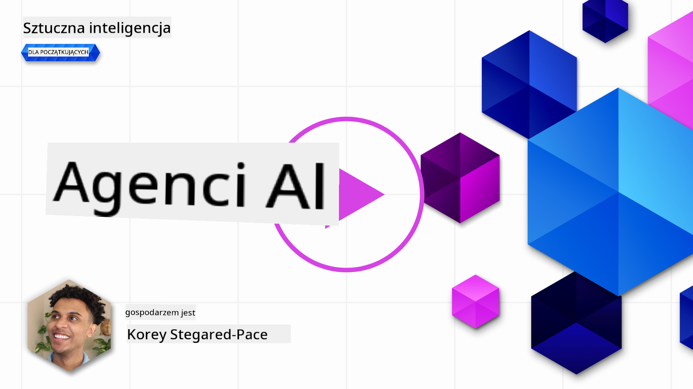
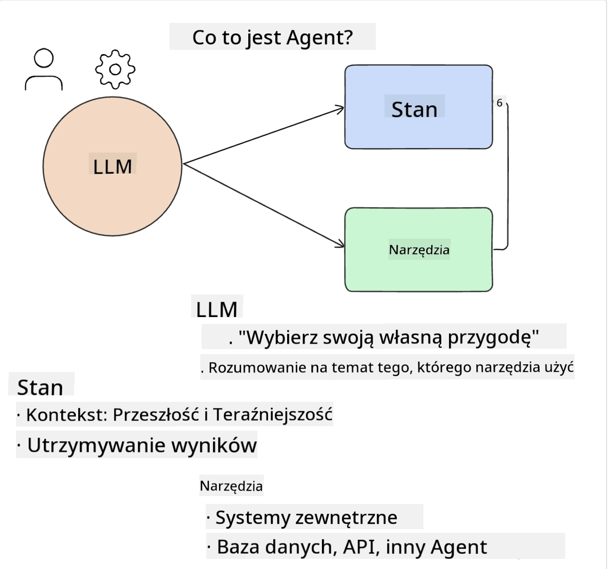
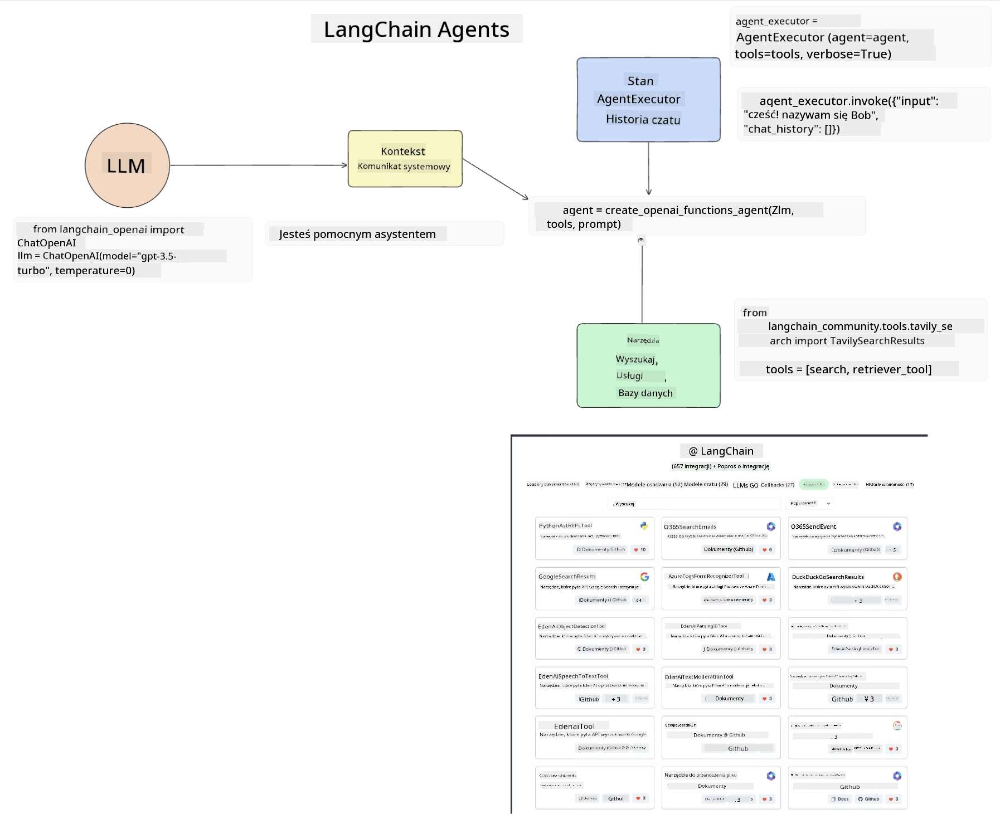
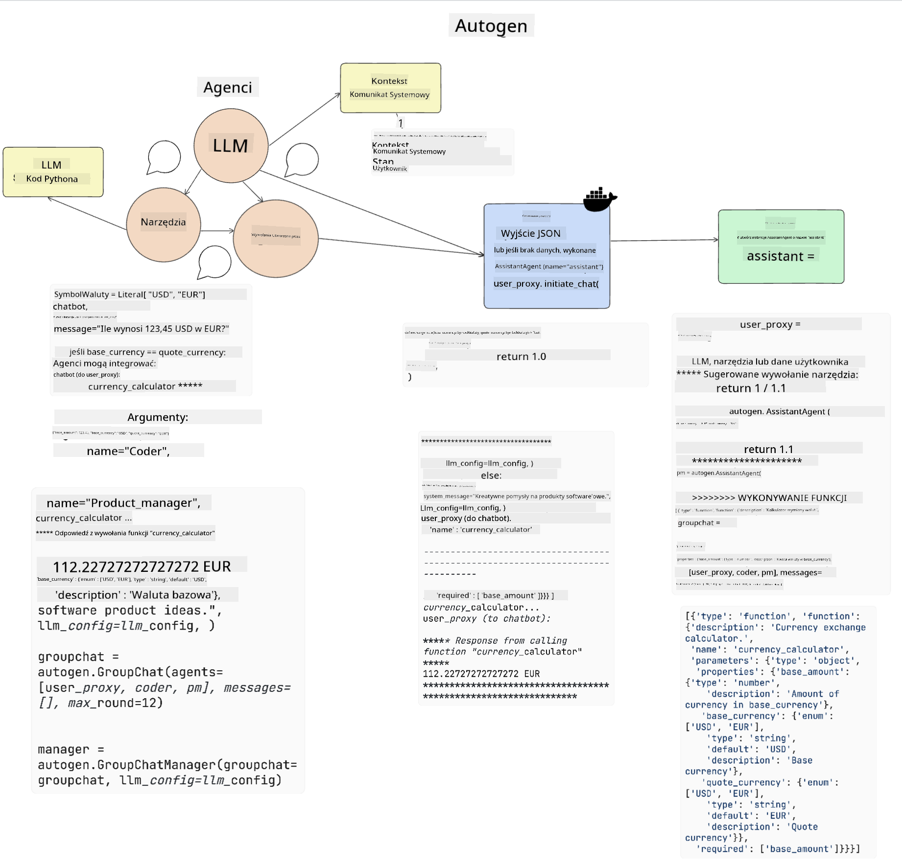
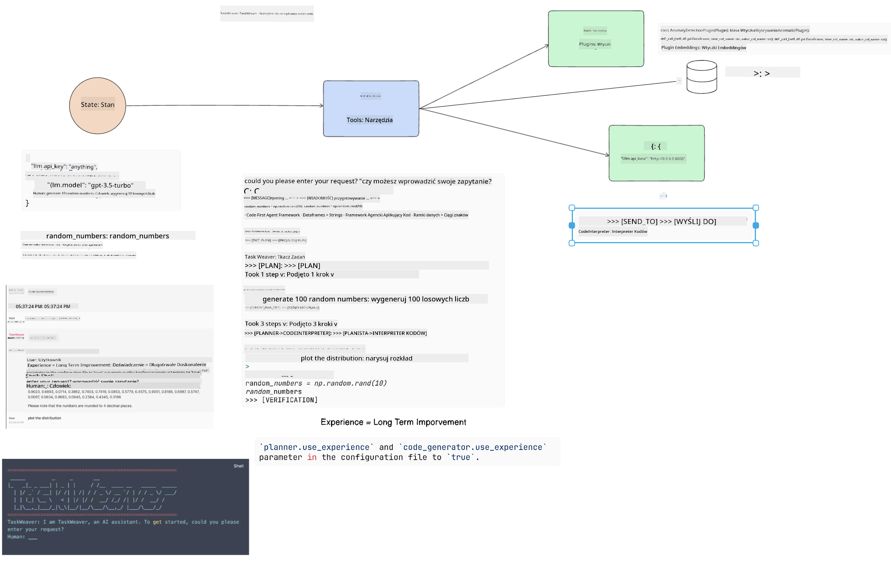
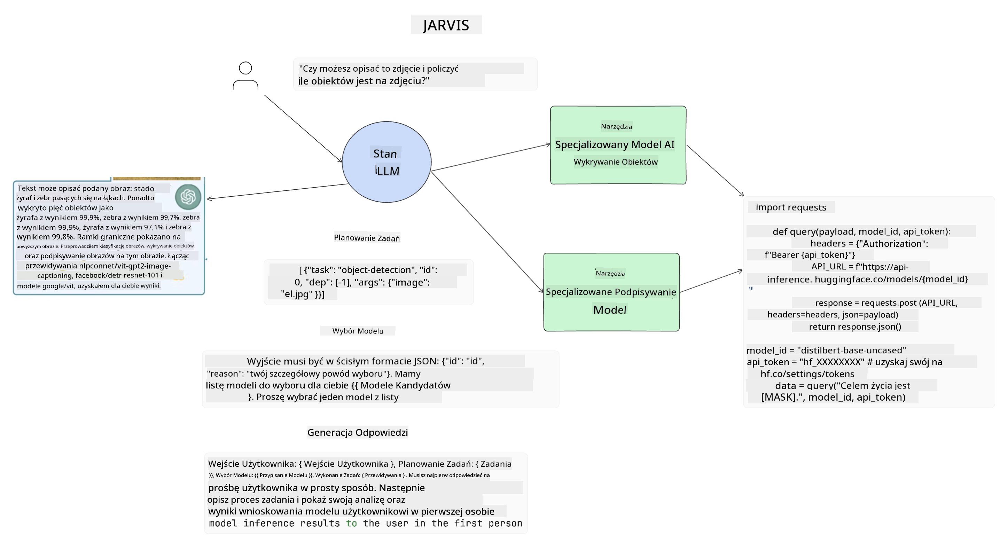

<!--
CO_OP_TRANSLATOR_METADATA:
{
  "original_hash": "11f03c81f190d9cbafd0f977dcbede6c",
  "translation_date": "2025-06-26T00:17:05+00:00",
  "source_file": "17-ai-agents/README.md",
  "language_code": "pl"
}
-->
[](https://aka.ms/gen-ai-lesson17-gh?WT.mc_id=academic-105485-koreyst)

## Wprowadzenie

Agenci AI to ekscytujący rozwój w dziedzinie Generatywnej AI, umożliwiający modelom językowym (LLM) przejście od asystentów do agentów zdolnych do podejmowania działań. Frameworki Agentów AI pozwalają deweloperom tworzyć aplikacje, które dają LLM dostęp do narzędzi i zarządzania stanem. Te frameworki zwiększają również widoczność, umożliwiając użytkownikom i deweloperom monitorowanie działań planowanych przez LLM, co poprawia zarządzanie doświadczeniem.

Lekcja obejmie następujące obszary:

- Zrozumienie, czym jest Agent AI - Czym dokładnie jest Agent AI?
- Badanie czterech różnych frameworków Agentów AI - Co czyni je wyjątkowymi?
- Zastosowanie tych Agentów AI do różnych przypadków użycia - Kiedy powinniśmy używać Agentów AI?

## Cele nauki

Po ukończeniu tej lekcji będziesz w stanie:

- Wyjaśnić, czym są Agenci AI i jak można ich używać.
- Zrozumieć różnice między niektórymi popularnymi frameworkami Agentów AI oraz jak się różnią.
- Zrozumieć, jak działają Agenci AI, aby budować aplikacje z ich użyciem.

## Czym są Agenci AI?

Agenci AI to bardzo ekscytująca dziedzina w świecie Generatywnej AI. Z tą ekscytacją czasami pojawia się zamieszanie w terminach i ich zastosowaniu. Aby utrzymać rzeczy proste i obejmujące większość narzędzi odnoszących się do Agentów AI, użyjemy tej definicji:

Agenci AI pozwalają modelom językowym (LLM) wykonywać zadania, dając im dostęp do **stanu** i **narzędzi**.



Zdefiniujmy te terminy:

**Duże modele językowe** - To modele, o których mowa w całym kursie, takie jak GPT-3.5, GPT-4, Llama-2, itd.

**Stan** - Odnosi się do kontekstu, w którym działa LLM. LLM używa kontekstu swoich przeszłych działań i bieżącego kontekstu, kierując swoje decyzje dotyczące kolejnych działań. Frameworki Agentów AI umożliwiają deweloperom łatwiejsze utrzymanie tego kontekstu.

**Narzędzia** - Aby ukończyć zadanie, które użytkownik zażądał i które LLM zaplanował, LLM potrzebuje dostępu do narzędzi. Przykłady narzędzi mogą obejmować bazę danych, API, zewnętrzną aplikację, a nawet inne LLM!

Te definicje powinny dać Ci dobre podstawy na przyszłość, gdy będziemy badać, jak są one wdrażane. Przyjrzyjmy się kilku różnym frameworkom Agentów AI:

## LangChain Agents

[LangChain Agents](https://python.langchain.com/docs/how_to/#agents?WT.mc_id=academic-105485-koreyst) to implementacja definicji, które przedstawiliśmy powyżej.

Aby zarządzać **stanem**, używa wbudowanej funkcji o nazwie `AgentExecutor`. Akceptuje zdefiniowane `agent` oraz `tools`, które są dla niego dostępne.

`Agent Executor` również przechowuje historię czatu, aby zapewnić kontekst czatu.



LangChain oferuje [katalog narzędzi](https://integrations.langchain.com/tools?WT.mc_id=academic-105485-koreyst), które można zaimportować do swojej aplikacji, w której LLM może uzyskać dostęp. Są one tworzone przez społeczność i zespół LangChain.

Możesz następnie zdefiniować te narzędzia i przekazać je do `Agent Executor`.

Widoczność to kolejny ważny aspekt, gdy mówimy o Agentach AI. Ważne jest, aby deweloperzy aplikacji rozumieli, z jakiego narzędzia korzysta LLM i dlaczego. W tym celu zespół LangChain opracował LangSmith.

## AutoGen

Kolejnym frameworkiem Agentów AI, który omówimy, jest [AutoGen](https://microsoft.github.io/autogen/?WT.mc_id=academic-105485-koreyst). Głównym celem AutoGen są rozmowy. Agenci są zarówno **rozmowni**, jak i **dostosowywalni**.

**Rozmowni -** LLM mogą rozpocząć i kontynuować rozmowę z innym LLM, aby ukończyć zadanie. Odbywa się to poprzez tworzenie `AssistantAgents` i nadanie im konkretnej wiadomości systemowej.

```python

autogen.AssistantAgent( name="Coder", llm_config=llm_config, ) pm = autogen.AssistantAgent( name="Product_manager", system_message="Creative in software product ideas.", llm_config=llm_config, )

```

**Dostosowywalni** - Agenci mogą być definiowani nie tylko jako LLM, ale także jako użytkownik lub narzędzie. Jako deweloper możesz zdefiniować `UserProxyAgent`, który jest odpowiedzialny za interakcję z użytkownikiem w celu uzyskania informacji zwrotnych podczas wykonywania zadania. Te informacje zwrotne mogą albo kontynuować wykonywanie zadania, albo je zatrzymać.

```python
user_proxy = UserProxyAgent(name="user_proxy")
```

### Stan i narzędzia

Aby zmieniać i zarządzać stanem, Agent asystent generuje kod Python do wykonania zadania.

Oto przykład procesu:



#### LLM zdefiniowany z wiadomością systemową

```python
system_message="For weather related tasks, only use the functions you have been provided with. Reply TERMINATE when the task is done."
```

Ta wiadomość systemowa kieruje tym konkretnym LLM, które funkcje są istotne dla jego zadania. Pamiętaj, że w AutoGen możesz mieć wiele zdefiniowanych AssistantAgents z różnymi wiadomościami systemowymi.

#### Czat jest inicjowany przez użytkownika

```python
user_proxy.initiate_chat( chatbot, message="I am planning a trip to NYC next week, can you help me pick out what to wear? ", )

```

Ta wiadomość od user_proxy (Człowieka) rozpocznie proces Agenta, aby zbadać możliwe funkcje, które powinien wykonać.

#### Funkcja jest wykonywana

```bash
chatbot (to user_proxy):

***** Suggested tool Call: get_weather ***** Arguments: {"location":"New York City, NY","time_periond:"7","temperature_unit":"Celsius"} ******************************************************** --------------------------------------------------------------------------------

>>>>>>>> EXECUTING FUNCTION get_weather... user_proxy (to chatbot): ***** Response from calling function "get_weather" ***** 112.22727272727272 EUR ****************************************************************

```

Po przetworzeniu początkowego czatu Agent wyśle sugestię narzędzia do wywołania. W tym przypadku jest to funkcja nazwana `get_weather`. Depending on your configuration, this function can be automatically executed and read by the Agent or can be executed based on user input.

You can find a list of [AutoGen code samples](https://microsoft.github.io/autogen/docs/Examples/?WT.mc_id=academic-105485-koreyst) to further explore how to get started building.

## Taskweaver

The next agent framework we will explore is [Taskweaver](https://microsoft.github.io/TaskWeaver/?WT.mc_id=academic-105485-koreyst). It is known as a "code-first" agent because instead of working strictly with `strings` , it can work with DataFrames in Python. This becomes extremely useful for data analysis and generation tasks. This can be things like creating graphs and charts or generating random numbers.

### State and Tools

To manage the state of the conversation, TaskWeaver uses the concept of a `Planner`. The `Planner` is a LLM that takes the request from the users and maps out the tasks that need to be completed to fulfill this request.

To complete the tasks the `Planner` is exposed to the collection of tools called `Plugins`. Mogą to być klasy Python lub ogólny interpreter kodu. Te pluginy są przechowywane jako osadzenia, aby LLM mógł lepiej wyszukiwać odpowiedni plugin.



Oto przykład pluginu do obsługi wykrywania anomalii:

```python
class AnomalyDetectionPlugin(Plugin): def __call__(self, df: pd.DataFrame, time_col_name: str, value_col_name: str):
```

Kod jest weryfikowany przed wykonaniem. Kolejną funkcją do zarządzania kontekstem w Taskweaver jest `experience`. Experience allows for the context of a conversation to be stored over to the long term in a YAML file. This can be configured so that the LLM improves over time on certain tasks given that it is exposed to prior conversations.

## JARVIS

The last agent framework we will explore is [JARVIS](https://github.com/microsoft/JARVIS?tab=readme-ov-file?WT.mc_id=academic-105485-koreyst). What makes JARVIS unique is that it uses an LLM to manage the `state` rozmowy, a `tools` to inne modele AI. Każdy z modeli AI to wyspecjalizowane modele, które wykonują określone zadania, takie jak wykrywanie obiektów, transkrypcja czy opisywanie obrazów.



LLM, będący modelem ogólnego przeznaczenia, otrzymuje żądanie od użytkownika i identyfikuje konkretne zadanie oraz wszelkie argumenty/dane potrzebne do wykonania zadania.

```python
[{"task": "object-detection", "id": 0, "dep": [-1], "args": {"image": "e1.jpg" }}]
```

LLM następnie formatuje żądanie w sposób, który wyspecjalizowany model AI może zinterpretować, na przykład JSON. Po tym, jak model AI zwróci swoją prognozę na podstawie zadania, LLM otrzymuje odpowiedź.

Jeśli do wykonania zadania wymagane są wiele modeli, LLM również zinterpretuje odpowiedź od tych modeli, zanim połączy je w jedną odpowiedź dla użytkownika.

Poniższy przykład pokazuje, jak to działa, gdy użytkownik żąda opisu i liczenia obiektów na zdjęciu:

## Zadanie

Aby kontynuować naukę o Agentach AI, możesz zbudować z AutoGen:

- Aplikację symulującą spotkanie biznesowe z różnymi działami startupu edukacyjnego.
- Utwórz wiadomości systemowe, które kierują LLM w zrozumieniu różnych osobowości i priorytetów oraz umożliwiają użytkownikowi przedstawienie nowego pomysłu na produkt.
- LLM powinien następnie generować pytania uzupełniające od każdego działu, aby udoskonalić i poprawić pomysł na produkt.

## Nauka nie kończy się tutaj, kontynuuj podróż

Po ukończeniu tej lekcji, sprawdź naszą [kolekcję nauki o Generatywnej AI](https://aka.ms/genai-collection?WT.mc_id=academic-105485-koreyst), aby dalej rozwijać swoją wiedzę na temat Generatywnej AI!

**Zastrzeżenie**:  
Ten dokument został przetłumaczony przy użyciu usługi tłumaczeniowej AI [Co-op Translator](https://github.com/Azure/co-op-translator). Chociaż dążymy do dokładności, prosimy mieć na uwadze, że automatyczne tłumaczenia mogą zawierać błędy lub nieścisłości. Oryginalny dokument w jego rodzimym języku powinien być uznawany za źródło autorytatywne. W przypadku informacji krytycznych zaleca się profesjonalne tłumaczenie przez człowieka. Nie ponosimy odpowiedzialności za jakiekolwiek nieporozumienia lub błędne interpretacje wynikające z użycia tego tłumaczenia.