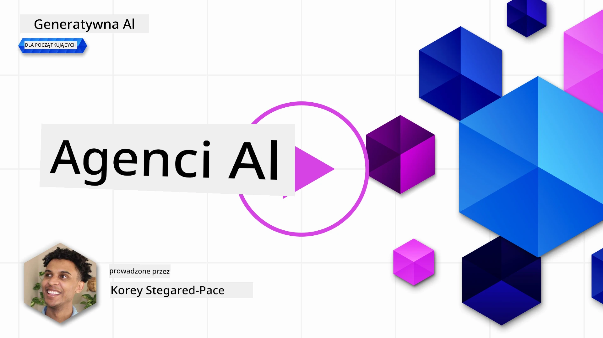
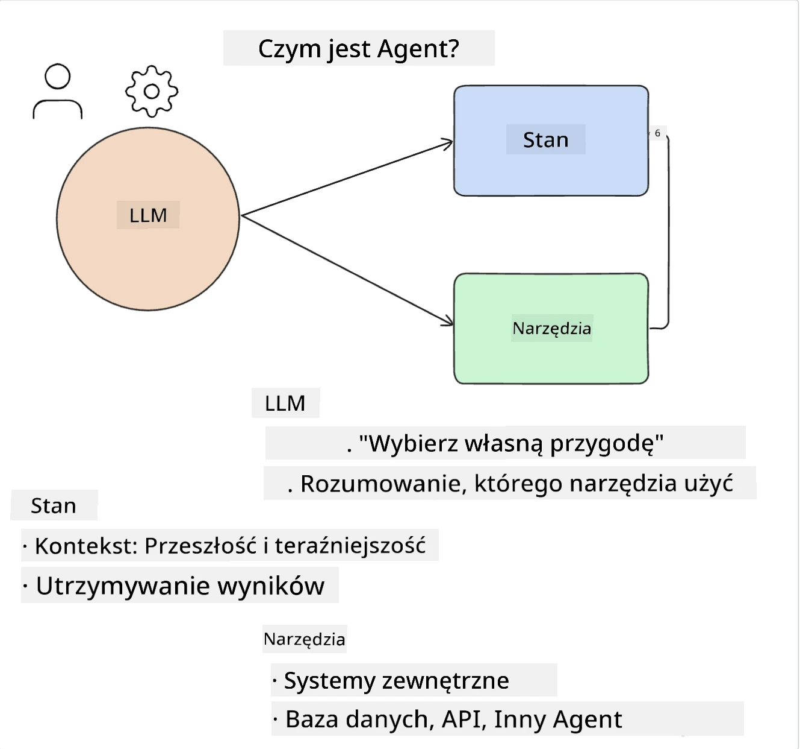
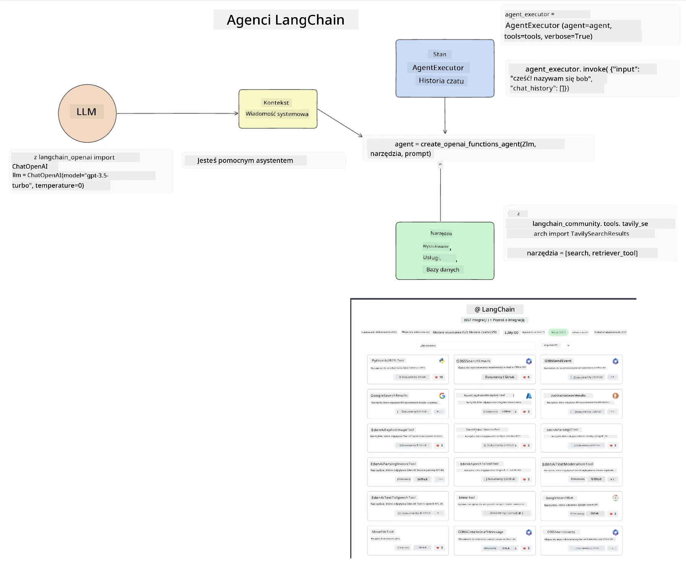
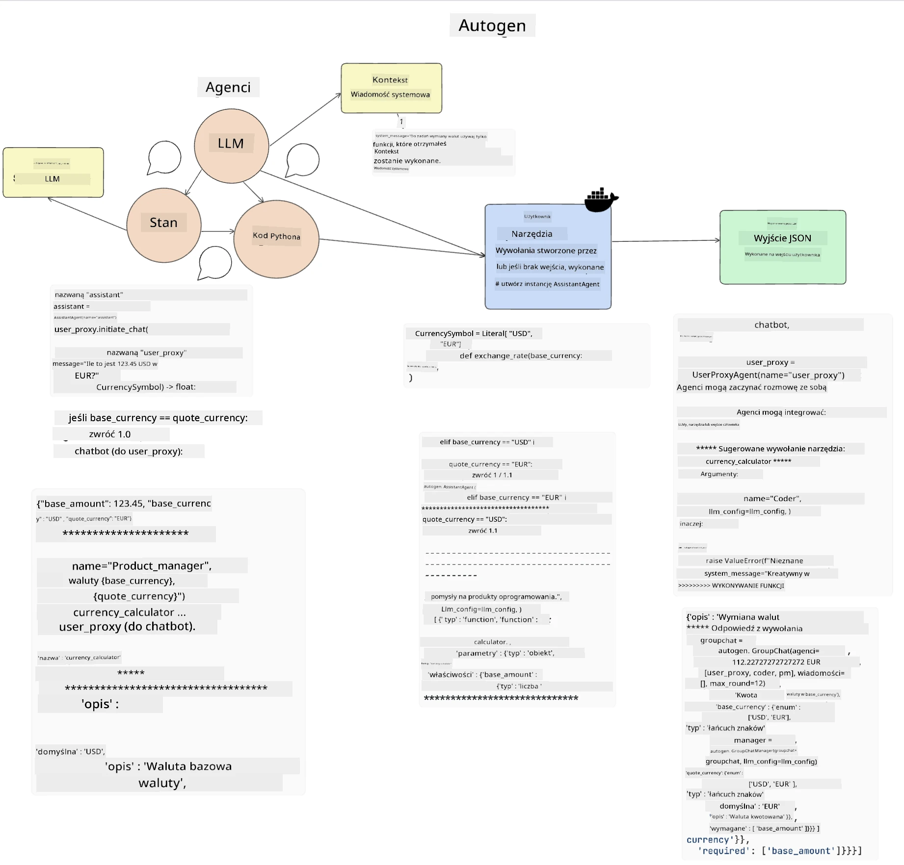
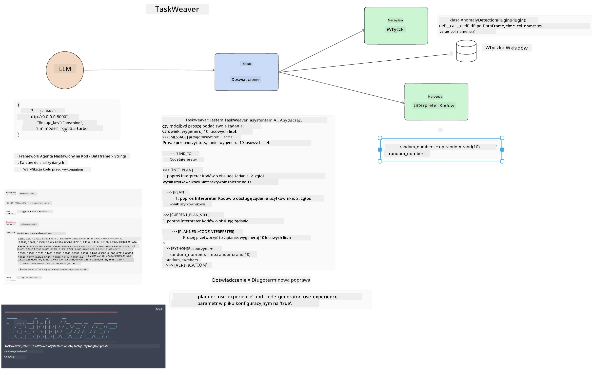
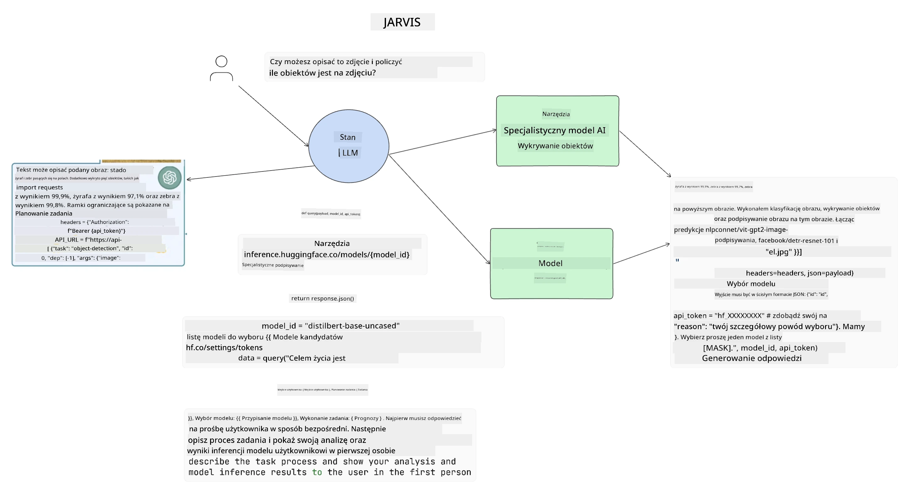

[](https://youtu.be/yAXVW-lUINc?si=bOtW9nL6jc3XJgOM)

## Wprowadzenie

Agent AI to ekscytujący rozwój w dziedzinie Generatywnej Sztucznej Inteligencji, umożliwiający dużym modelom językowym (LLM) ewolucję od asystentów do agentów zdolnych do podejmowania działań. Frameworki Agentów AI pozwalają programistom tworzyć aplikacje, które dają LLM dostęp do narzędzi i zarządzania stanem. Frameworki te zwiększają również widoczność, pozwalając użytkownikom i programistom monitorować działania planowane przez LLM, co poprawia zarządzanie doświadczeniem.

Lekcja obejmie następujące obszary:

- Zrozumienie, czym jest Agent AI - czym dokładnie jest Agent AI?
- Eksploracja czterech różnych Frameworków Agentów AI - co je wyróżnia?
- Zastosowanie tych Agentów AI w różnych przypadkach użycia - kiedy powinniśmy korzystać z Agentów AI?

## Cele nauki

Po ukończeniu tej lekcji będziesz potrafił:

- Wyjaśnić, czym są Agenci AI i jak można ich używać.
- Zrozumieć różnice pomiędzy popularnymi Frameworkami Agentów AI oraz ich odmienne cechy.
- Zrozumieć, jak działają Agenci AI, aby móc budować z nimi aplikacje.

## Czym są Agenci AI?

Agenci AI to bardzo ekscytujący obszar w świecie Generatywnej Sztucznej Inteligencji. Z tym entuzjazmem wiąże się czasem zamieszanie wokół pojęć i ich zastosowania. Aby uprościć sprawę i objąć większość narzędzi określających się jako Agenci AI, używamy następującej definicji:

Agenci AI pozwalają dużym modelom językowym (LLM) wykonywać zadania, dając im dostęp do **stanu** i **narzędzi**.



Zdefiniujmy te terminy:

**Duże modele językowe** – to modele wymieniane w tym kursie, takie jak GPT-3.5, GPT-4, Llama-2 itp.

**Stan** – odnosi się do kontekstu, w jakim działa LLM. LLM wykorzystuje kontekst swoich poprzednich działań oraz bieżący kontekst, co kieruje podejmowaniem decyzji przy kolejnych działaniach. Frameworki Agentów AI ułatwiają programistom utrzymanie tego kontekstu.

**Narzędzia** – aby wykonać zadanie, które użytkownik zlecił, a które LLM zaplanował, LLM potrzebuje dostępu do narzędzi. Przykładami narzędzi mogą być baza danych, API, zewnętrzna aplikacja lub nawet inny LLM!

Te definicje powinny dać Ci solidne podstawy na dalszą część lekcji, w której przyjrzymy się ich implementacji. Zobaczmy kilka różnych frameworków Agentów AI:

## LangChain Agents

[LangChain Agents](https://python.langchain.com/docs/how_to/#agents?WT.mc_id=academic-105485-koreyst) to implementacja powyższych definicji.

Do zarządzania **stanem**, używa wbudowanej funkcji o nazwie `AgentExecutor`. Przyjmuje ona zdefiniowanego `agenta` oraz dostępne `narzędzia`.

`Agent Executor` przechowuje również historię czatu, aby zapewnić kontekst rozmowy.



LangChain oferuje [katalog narzędzi](https://integrations.langchain.com/tools?WT.mc_id=academic-105485-koreyst), które można importować do Twojej aplikacji, aby LLM miał do nich dostęp. Są one tworzone zarówno przez społeczność, jak i zespół LangChain.

Możesz zdefiniować te narzędzia i przekazać je do `Agent Executor`.

Widoczność jest kolejnym ważnym aspektem w przypadku Agentów AI. Dla twórców aplikacji ważne jest, aby rozumieli, które narzędzie LLM używa i dlaczego. Dlatego zespół LangChain opracował LangSmith.

## AutoGen

Kolejny framework Agentów AI, który omówimy, to [AutoGen](https://microsoft.github.io/autogen/?WT.mc_id=academic-105485-koreyst). Głównym celem AutoGen są rozmowy. Agenci są jednocześnie **zdolni do rozmowy** i **konfigurowalni**.

**Zdolni do rozmowy** – LLM mogą rozpoczynać i kontynuować rozmowę z innym LLM, aby wykonać zadanie. Odbywa się to poprzez tworzenie `AssistantAgents` i nadanie im określonej wiadomości systemowej.

```python

autogen.AssistantAgent( name="Coder", llm_config=llm_config, ) pm = autogen.AssistantAgent( name="Product_manager", system_message="Creative in software product ideas.", llm_config=llm_config, )

```

**Konfigurowalni** – Agenci mogą być definiowani nie tylko jako LLM, ale także jako użytkownik lub narzędzie. Jako programista możesz zdefiniować `UserProxyAgent`, który odpowiada za interakcję z użytkownikiem w celu uzyskania informacji zwrotnej przy realizacji zadania. Ta informacja zwrotna może kontynuować wykonanie zadania lub je zatrzymać.

```python
user_proxy = UserProxyAgent(name="user_proxy")
```

### Stan i Narzędzia

Aby zmieniać i zarządzać stanem, agent asystent generuje kod Python do wykonania zadania.

Oto przykład tego procesu:



#### LLM zdefiniowany za pomocą wiadomości systemowej

```python
system_message="For weather related tasks, only use the functions you have been provided with. Reply TERMINATE when the task is done."
```

Ta wiadomość systemowa kieruje tym konkretnym LLM, które funkcje są istotne dla jego zadania. Pamiętaj, że w AutoGen możesz mieć wiele AssistantAgents z różnymi wiadomościami systemowymi.

#### Czat inicjowany przez użytkownika

```python
user_proxy.initiate_chat( chatbot, message="I am planning a trip to NYC next week, can you help me pick out what to wear? ", )

```

Ta wiadomość od user_proxy (Człowiek) rozpoczyna proces, w którym Agent bada możliwe funkcje, które powinien wykonać.

#### Funkcja jest wykonywana

```bash
chatbot (to user_proxy):

***** Suggested tool Call: get_weather ***** Arguments: {"location":"New York City, NY","time_periond:"7","temperature_unit":"Celsius"} ******************************************************** --------------------------------------------------------------------------------

>>>>>>>> EXECUTING FUNCTION get_weather... user_proxy (to chatbot): ***** Response from calling function "get_weather" ***** 112.22727272727272 EUR ****************************************************************

```

Po przetworzeniu początkowego czatu Agent wyśle sugerowane narzędzie do wywołania. W tym przypadku jest to funkcja o nazwie `get_weather`. W zależności od konfiguracji funkcja ta może być automatycznie wykonana i odczytana przez Agenta lub wykonana na podstawie wejścia użytkownika.

Możesz znaleźć listę [przykładów kodu AutoGen](https://microsoft.github.io/autogen/docs/Examples/?WT.mc_id=academic-105485-koreyst), aby dalej eksplorować, jak zacząć budować aplikacje.

## Taskweaver

Kolejny framework agentowy, który omówimy, to [Taskweaver](https://microsoft.github.io/TaskWeaver/?WT.mc_id=academic-105485-koreyst). Jest znany jako agent „code-first”, ponieważ zamiast pracować wyłącznie z `łańcuchami znaków`, może operować na DataFrame'ach w Pythonie. Jest to niezwykle przydatne do analizy danych i zadań generacyjnych. Może to obejmować takie działania jak tworzenie wykresów i grafik czy generowanie liczb losowych.

### Stan i Narzędzia

Do zarządzania stanem rozmowy, TaskWeaver używa pojęcia `Planner`. `Planner` to LLM, który przyjmuje zapytania od użytkowników i mapuje zadania, które należy wykonać, aby spełnić to zapytanie.

Do realizacji zadań `Planner` ma dostęp do kolekcji narzędzi zwanych `Plugins`. Mogą to być klasy Pythona lub ogólny interpreter kodu. Te wtyczki są przechowywane jako embeddingi, dzięki czemu LLM może lepiej wyszukiwać odpowiedni plugin.



Oto przykład pluginu do wykrywania anomalii:

```python
class AnomalyDetectionPlugin(Plugin): def __call__(self, df: pd.DataFrame, time_col_name: str, value_col_name: str):
```

Kod jest weryfikowany przed wykonaniem. Kolejną funkcją do zarządzania kontekstem w Taskweaver jest `experience`. Experience pozwala na przechowywanie kontekstu rozmowy w długim terminie w pliku YAML. Można to skonfigurować tak, aby LLM z czasem poprawiał się w realizacji określonych zadań, mając dostęp do wcześniejszych rozmów.

## JARVIS

Ostatni framework agentowy, który omówimy, to [JARVIS](https://github.com/microsoft/JARVIS?tab=readme-ov-file&WT.mc_id=academic-105485-koreyst). Wyjątkowość JARVIS polega na tym, że do zarządzania `stanem` rozmowy używa LLM, natomiast `narzędziami` są inne modele AI. Każdy z tych modeli jest wyspecjalizowany i realizuje konkretne zadania, takie jak wykrywanie obiektów, transkrypcja lub opisywanie obrazów.



LLM, jako model ogólnego przeznaczenia, otrzymuje zapytanie od użytkownika i identyfikuje konkretne zadanie oraz niezbędne argumenty/dane do jego wykonania.

```python
[{"task": "object-detection", "id": 0, "dep": [-1], "args": {"image": "e1.jpg" }}]
```

LLM następnie formatuje zapytanie w sposób zrozumiały dla wyspecjalizowanego modelu AI, na przykład w JSON. Gdy model AI zwróci swoją prognozę na podstawie zadania, LLM odbiera odpowiedź.

Jeśli do wykonania zadania wymaganych jest kilka modeli, LLM interpretuje odpowiedzi tych modeli, a następnie scala je w odpowiedź dla użytkownika.

Poniższy przykład pokazuje, jak to działa, gdy użytkownik prosi o opis i liczbę obiektów na zdjęciu:

## Zadanie

Aby kontynuować naukę o Agentach AI, możesz stworzyć z AutoGen:

- Aplikację symulującą spotkanie biznesowe z różnymi działami startupu edukacyjnego.
- Stwórz wiadomości systemowe, które pomogą LLM zrozumieć różne persony i priorytety oraz umożliwią użytkownikowi przedstawienie nowego pomysłu na produkt.
- LLM powinien następnie generować pytania uzupełniające od każdego działu, aby udoskonalić i poprawić pomysł na pitch i produkt.

## Nauka na tym się nie kończy – kontynuuj podróż

Po ukończeniu tej lekcji sprawdź naszą [kolekcję nauki o Generatywnej AI](https://aka.ms/genai-collection?WT.mc_id=academic-105485-koreyst), aby kontynuować rozwijanie swojej wiedzy o Generatywnej Sztucznej Inteligencji!

---

<!-- CO-OP TRANSLATOR DISCLAIMER START -->
**Zastrzeżenie**:  
Niniejszy dokument został przetłumaczony przy użyciu automatycznej usługi tłumaczeniowej AI [Co-op Translator](https://github.com/Azure/co-op-translator). Mimo że dążymy do dokładności, prosimy mieć na uwadze, że tłumaczenia automatyczne mogą zawierać błędy lub nieścisłości. Oryginalny dokument w języku źródłowym powinien być uznawany za autorytatywne źródło. W przypadku informacji krytycznych zalecane jest skorzystanie z profesjonalnego tłumaczenia wykonanego przez człowieka. Nie ponosimy odpowiedzialności za jakiekolwiek nieporozumienia lub błędne interpretacje wynikające z korzystania z tego tłumaczenia.
<!-- CO-OP TRANSLATOR DISCLAIMER END -->