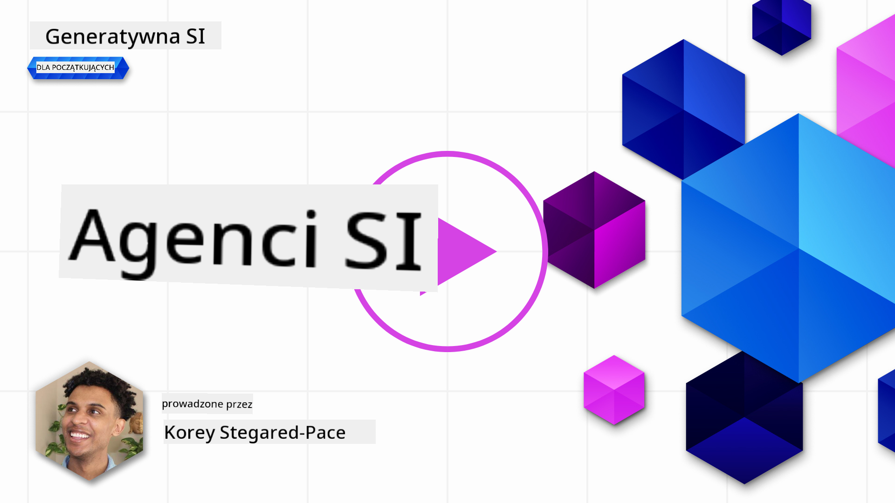
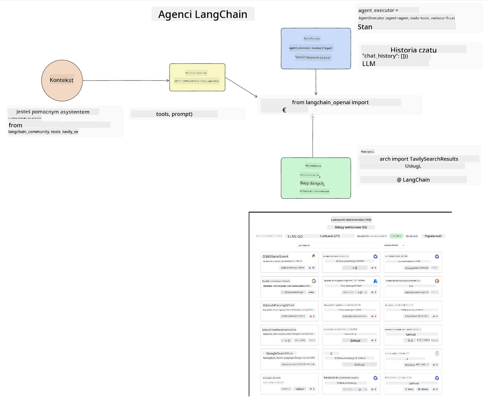
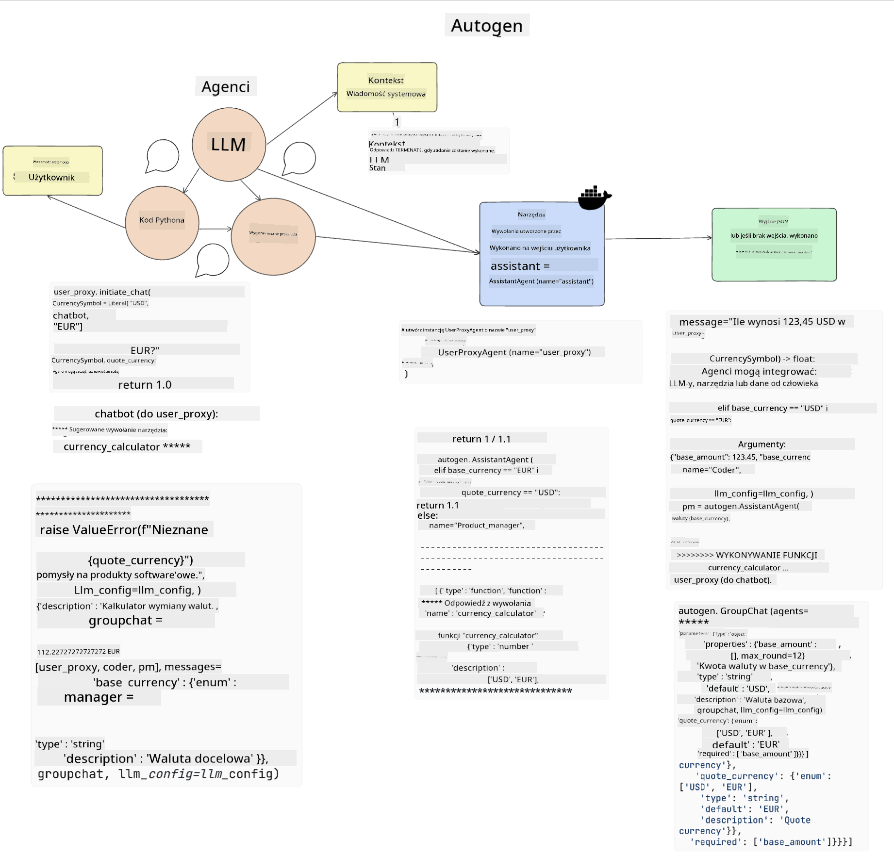

<!--
CO_OP_TRANSLATOR_METADATA:
{
  "original_hash": "11f03c81f190d9cbafd0f977dcbede6c",
  "translation_date": "2025-07-09T17:24:45+00:00",
  "source_file": "17-ai-agents/README.md",
  "language_code": "pl"
}
-->
[](https://aka.ms/gen-ai-lesson17-gh?WT.mc_id=academic-105485-koreyst)

## Wprowadzenie

AI Agents to ekscytujący rozwój w dziedzinie Generative AI, który pozwala dużym modelom językowym (LLM) ewoluować z asystentów w agentów zdolnych do podejmowania działań. Frameworki AI Agent umożliwiają deweloperom tworzenie aplikacji, które dają LLM dostęp do narzędzi i zarządzania stanem. Frameworki te zwiększają także przejrzystość, pozwalając użytkownikom i deweloperom monitorować działania planowane przez LLM, co poprawia zarządzanie doświadczeniem.

W lekcji omówimy następujące zagadnienia:

- Czym jest AI Agent – czym dokładnie jest AI Agent?
- Przegląd czterech różnych frameworków AI Agent – co je wyróżnia?
- Zastosowanie AI Agent w różnych przypadkach użycia – kiedy warto korzystać z AI Agent?

## Cele nauki

Po ukończeniu tej lekcji będziesz potrafił:

- Wyjaśnić, czym są AI Agents i jak można je wykorzystać.
- Zrozumieć różnice między popularnymi frameworkami AI Agent oraz ich unikalne cechy.
- Zrozumieć, jak działają AI Agents, aby móc budować z nimi aplikacje.

## Czym są AI Agents?

AI Agents to bardzo ekscytująca dziedzina w świecie Generative AI. Z tą ekscytacją często wiąże się też pewne zamieszanie dotyczące terminologii i zastosowań. Aby uprościć sprawę i objąć większość narzędzi określanych jako AI Agents, przyjmujemy następującą definicję:

AI Agents pozwalają dużym modelom językowym (LLM) wykonywać zadania, dając im dostęp do **stanu** i **narzędzi**.


Zdefiniujmy te pojęcia:

**Duże modele językowe** – to modele, o których mowa w całym kursie, takie jak GPT-3.5, GPT-4, Llama-2 itp.

**Stan** – odnosi się do kontekstu, w którym działa LLM. LLM korzysta z kontekstu swoich wcześniejszych działań oraz aktualnego kontekstu, co kieruje jego decyzjami dotyczącymi kolejnych działań. Frameworki AI Agent ułatwiają deweloperom utrzymanie tego kontekstu.

**Narzędzia** – aby wykonać zadanie, które użytkownik zlecił, a które LLM zaplanował, LLM potrzebuje dostępu do narzędzi. Przykładami narzędzi mogą być baza danych, API, zewnętrzna aplikacja lub nawet inny LLM!

Te definicje powinny dać Ci solidne podstawy do dalszej nauki, gdy przyjrzymy się, jak są one implementowane. Sprawdźmy kilka różnych frameworków AI Agent:

## LangChain Agents

[LangChain Agents](https://python.langchain.com/docs/how_to/#agents?WT.mc_id=academic-105485-koreyst) to implementacja powyższych definicji.

Do zarządzania **stanem** wykorzystuje wbudowaną funkcję o nazwie `AgentExecutor`. Przyjmuje ona zdefiniowanego `agenta` oraz dostępne dla niego `narzędzia`.

`AgentExecutor` przechowuje również historię rozmowy, aby zapewnić kontekst czatu.



LangChain oferuje [katalog narzędzi](https://integrations.langchain.com/tools?WT.mc_id=academic-105485-koreyst), które można zaimportować do swojej aplikacji, aby LLM miał do nich dostęp. Narzędzia te są tworzone przez społeczność oraz zespół LangChain.

Następnie możesz zdefiniować te narzędzia i przekazać je do `AgentExecutor`.

Widoczność to kolejny ważny aspekt w kontekście AI Agents. Dla deweloperów aplikacji istotne jest, aby wiedzieć, z jakiego narzędzia korzysta LLM i dlaczego. W tym celu zespół LangChain stworzył LangSmith.

## AutoGen

Kolejnym frameworkiem AI Agent, który omówimy, jest [AutoGen](https://microsoft.github.io/autogen/?WT.mc_id=academic-105485-koreyst). Głównym celem AutoGen są konwersacje. Agenci są zarówno **rozmawialni**, jak i **konfigurowalni**.

**Rozmawialni** – LLM mogą rozpoczynać i kontynuować rozmowę z innym LLM, aby wykonać zadanie. Odbywa się to przez tworzenie `AssistantAgents` i nadawanie im określonej wiadomości systemowej.

```python

autogen.AssistantAgent( name="Coder", llm_config=llm_config, ) pm = autogen.AssistantAgent( name="Product_manager", system_message="Creative in software product ideas.", llm_config=llm_config, )

```

**Konfigurowalni** – Agenci mogą być definiowani nie tylko jako LLM, ale także jako użytkownik lub narzędzie. Jako deweloper możesz zdefiniować `UserProxyAgent`, który odpowiada za interakcję z użytkownikiem w celu uzyskania informacji zwrotnej podczas realizacji zadania. Ta informacja zwrotna może kontynuować wykonanie zadania lub je przerwać.

```python
user_proxy = UserProxyAgent(name="user_proxy")
```

### Stan i narzędzia

Aby zmieniać i zarządzać stanem, agent asystent generuje kod w Pythonie do wykonania zadania.

Oto przykład tego procesu:



#### LLM zdefiniowany za pomocą wiadomości systemowej

```python
system_message="For weather related tasks, only use the functions you have been provided with. Reply TERMINATE when the task is done."
```

Ta wiadomość systemowa kieruje tym konkretnym LLM, które funkcje są istotne dla jego zadania. Pamiętaj, że w AutoGen możesz mieć wielu zdefiniowanych AssistantAgents z różnymi wiadomościami systemowymi.

#### Rozmowa rozpoczyna się od użytkownika

```python
user_proxy.initiate_chat( chatbot, message="I am planning a trip to NYC next week, can you help me pick out what to wear? ", )

```

Ta wiadomość od user_proxy (człowieka) rozpoczyna proces, w którym agent bada, które funkcje powinien wykonać.

#### Funkcja jest wykonywana

```bash
chatbot (to user_proxy):

***** Suggested tool Call: get_weather ***** Arguments: {"location":"New York City, NY","time_periond:"7","temperature_unit":"Celsius"} ******************************************************** --------------------------------------------------------------------------------

>>>>>>>> EXECUTING FUNCTION get_weather... user_proxy (to chatbot): ***** Response from calling function "get_weather" ***** 112.22727272727272 EUR ****************************************************************

```

Po przetworzeniu początkowej rozmowy agent wyśle sugestię narzędzia do wywołania. W tym przypadku jest to funkcja `get_weather`. W zależności od konfiguracji funkcja ta może być wykonana automatycznie i odczytana przez agenta lub może być uruchomiona na podstawie danych od użytkownika.

Możesz znaleźć listę [przykładów kodu AutoGen](https://microsoft.github.io/autogen/docs/Examples/?WT.mc_id=academic-105485-koreyst), aby lepiej poznać, jak zacząć budować.

## Taskweaver

Kolejnym frameworkiem agentów, który omówimy, jest [Taskweaver](https://microsoft.github.io/TaskWeaver/?WT.mc_id=academic-105485-koreyst). Znany jest jako agent „code-first”, ponieważ zamiast pracować wyłącznie z `stringami`, może operować na DataFrame’ach w Pythonie. Jest to niezwykle przydatne przy zadaniach analizy danych i generowania danych, takich jak tworzenie wykresów czy generowanie liczb losowych.

### Stan i narzędzia

Do zarządzania stanem rozmowy TaskWeaver wykorzystuje koncepcję `Plannera`. `Planner` to LLM, który przyjmuje żądanie od użytkownika i mapuje zadania, które trzeba wykonać, aby je zrealizować.

Aby wykonać zadania, `Planner` ma dostęp do kolekcji narzędzi zwanych `Plugins`. Mogą to być klasy Pythona lub ogólny interpreter kodu. Te pluginy są przechowywane jako embeddingi, co pozwala LLM lepiej wyszukiwać odpowiedni plugin.


Oto przykład pluginu do wykrywania anomalii:

```python
class AnomalyDetectionPlugin(Plugin): def __call__(self, df: pd.DataFrame, time_col_name: str, value_col_name: str):
```

Kod jest weryfikowany przed wykonaniem. Kolejną funkcją do zarządzania kontekstem w Taskweaver jest `experience`. Experience pozwala na długoterminowe przechowywanie kontekstu rozmowy w pliku YAML. Można to skonfigurować tak, aby LLM z czasem poprawiał się w wykonywaniu określonych zadań, mając dostęp do wcześniejszych rozmów.

## JARVIS

Ostatnim frameworkiem agentów, który omówimy, jest [JARVIS](https://github.com/microsoft/JARVIS?tab=readme-ov-file?WT.mc_id=academic-105485-koreyst). Co wyróżnia JARVIS, to fakt, że do zarządzania `stanem` rozmowy używa LLM, a `narzędzia` to inne modele AI. Każdy z tych modeli jest wyspecjalizowany w wykonywaniu określonych zadań, takich jak wykrywanie obiektów, transkrypcja czy opisywanie obrazów.


LLM, jako model ogólnego przeznaczenia, otrzymuje żądanie od użytkownika i identyfikuje konkretne zadanie oraz wszelkie argumenty/dane potrzebne do jego wykonania.

```python
[{"task": "object-detection", "id": 0, "dep": [-1], "args": {"image": "e1.jpg" }}]
```

Następnie LLM formatuje żądanie w sposób zrozumiały dla wyspecjalizowanego modelu AI, na przykład w formacie JSON. Gdy model AI zwróci swoją prognozę na podstawie zadania, LLM odbiera odpowiedź.

Jeśli do wykonania zadania potrzebnych jest kilka modeli, LLM interpretuje odpowiedzi od tych modeli, a następnie łączy je, aby wygenerować odpowiedź dla użytkownika.

Poniższy przykład pokazuje, jak to działa, gdy użytkownik prosi o opis i liczbę obiektów na zdjęciu:

## Zadanie

Aby kontynuować naukę o AI Agents, możesz zbudować z AutoGen:

- Aplikację symulującą spotkanie biznesowe różnych działów startupu edukacyjnego.
- Stwórz wiadomości systemowe, które pomogą LLM zrozumieć różne persony i priorytety oraz umożliwią użytkownikowi przedstawienie nowego pomysłu na produkt.
- LLM powinien następnie generować pytania uzupełniające od każdego działu, aby dopracować i ulepszyć prezentację oraz pomysł na produkt.

## Nauka nie kończy się tutaj, kontynuuj podróż

Po ukończeniu tej lekcji sprawdź naszą [kolekcję materiałów do nauki Generative AI](https://aka.ms/genai-collection?WT.mc_id=academic-105485-koreyst), aby dalej rozwijać swoją wiedzę o Generative AI!

**Zastrzeżenie**:  
Niniejszy dokument został przetłumaczony za pomocą usługi tłumaczenia AI [Co-op Translator](https://github.com/Azure/co-op-translator). Mimo że dążymy do dokładności, prosimy mieć na uwadze, że automatyczne tłumaczenia mogą zawierać błędy lub nieścisłości. Oryginalny dokument w języku źródłowym powinien być uznawany za źródło autorytatywne. W przypadku informacji o kluczowym znaczeniu zalecane jest skorzystanie z profesjonalnego tłumaczenia wykonanego przez człowieka. Nie ponosimy odpowiedzialności za jakiekolwiek nieporozumienia lub błędne interpretacje wynikające z korzystania z tego tłumaczenia.