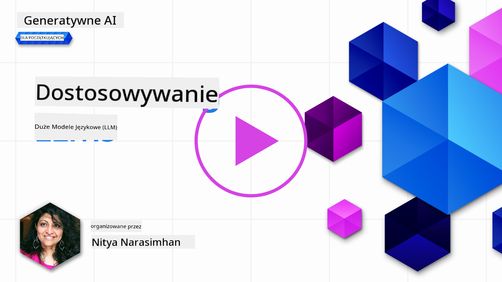
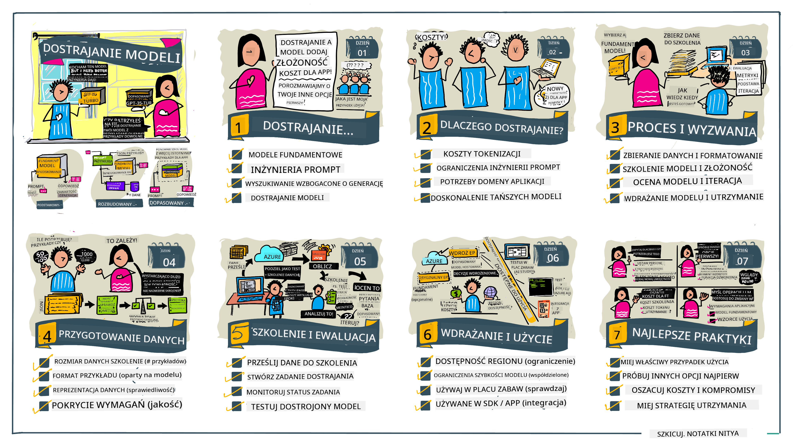

<!--
CO_OP_TRANSLATOR_METADATA:
{
  "original_hash": "68664f7e754a892ae1d8d5e2b7bd2081",
  "translation_date": "2025-07-09T17:42:15+00:00",
  "source_file": "18-fine-tuning/README.md",
  "language_code": "pl"
}
-->

# Dostosowywanie Twojego LLM

Wykorzystanie dużych modeli językowych do tworzenia aplikacji generatywnej AI wiąże się z nowymi wyzwaniami. Kluczową kwestią jest zapewnienie jakości odpowiedzi (dokładności i trafności) generowanych przez model na podstawie zapytania użytkownika. W poprzednich lekcjach omawialiśmy techniki takie jak inżynieria promptów oraz generowanie wspomagane wyszukiwaniem, które próbują rozwiązać ten problem poprzez _modyfikację wejściowego promptu_ do istniejącego modelu.

W dzisiejszej lekcji porozmawiamy o trzeciej technice, **dostosowywaniu (fine-tuning)**, która stara się rozwiązać ten problem poprzez _ponowne trenowanie samego modelu_ z użyciem dodatkowych danych. Zagłębmy się w szczegóły.

## Cele nauki

Ta lekcja wprowadza pojęcie dostosowywania modeli językowych wstępnie wytrenowanych, omawia korzyści i wyzwania związane z tym podejściem oraz dostarcza wskazówek, kiedy i jak stosować fine-tuning, aby poprawić wydajność Twoich modeli generatywnej AI.

Po zakończeniu tej lekcji powinieneś być w stanie odpowiedzieć na następujące pytania:

- Czym jest fine-tuning modeli językowych?
- Kiedy i dlaczego fine-tuning jest przydatny?
- Jak mogę dostosować wstępnie wytrenowany model?
- Jakie są ograniczenia fine-tuningu?

Gotowy? Zaczynajmy.

## Ilustrowany przewodnik

Chcesz zobaczyć ogólny obraz tego, co omówimy, zanim zagłębimy się w szczegóły? Sprawdź ten ilustrowany przewodnik, który opisuje ścieżkę nauki dla tej lekcji – od poznania podstawowych koncepcji i motywacji do fine-tuningu, po zrozumienie procesu i najlepszych praktyk realizacji zadania dostosowywania. To fascynujący temat do zgłębienia, więc nie zapomnij odwiedzić strony [Resources](./RESOURCES.md?WT.mc_id=academic-105485-koreyst) po dodatkowe linki wspierające Twoją samodzielną naukę!

## Czym jest fine-tuning modeli językowych?

Z definicji, duże modele językowe są _wstępnie wytrenowane_ na dużych ilościach tekstu pochodzącego z różnych źródeł, w tym z internetu. Jak dowiedzieliśmy się w poprzednich lekcjach, potrzebujemy technik takich jak _inżynieria promptów_ i _generowanie wspomagane wyszukiwaniem_, aby poprawić jakość odpowiedzi modelu na pytania użytkownika („prompty”).

Popularną techniką inżynierii promptów jest dostarczenie modelowi większej ilości wskazówek, co powinno znaleźć się w odpowiedzi, poprzez podanie _instrukcji_ (wskazówki jawne) lub _kilku przykładów_ (wskazówki niejawne). Nazywa się to _uczeniem z niewielką liczbą przykładów (few-shot learning)_, ale ma dwie ograniczenia:

- Limity tokenów modelu mogą ograniczać liczbę przykładów, które można podać, co zmniejsza skuteczność.
- Koszty tokenów modelu mogą sprawić, że dodawanie przykładów do każdego promptu będzie drogie i ograniczy elastyczność.

Fine-tuning to powszechna praktyka w systemach uczenia maszynowego, gdzie bierzemy wstępnie wytrenowany model i ponownie trenujemy go na nowych danych, aby poprawić jego wydajność w konkretnym zadaniu. W kontekście modeli językowych możemy dostosować wstępnie wytrenowany model _za pomocą wyselekcjonowanego zestawu przykładów dla konkretnego zadania lub dziedziny zastosowania_, tworząc **model niestandardowy**, który może być dokładniejszy i bardziej trafny dla tego konkretnego zadania lub dziedziny. Dodatkową korzyścią fine-tuningu jest to, że może on również zmniejszyć liczbę przykładów potrzebnych do few-shot learning – redukując zużycie tokenów i związane z tym koszty.

## Kiedy i dlaczego powinniśmy dostosowywać modele?

W _tym_ kontekście, gdy mówimy o fine-tuningu, mamy na myśli **nadzorowany** fine-tuning, gdzie ponowne trenowanie odbywa się przez **dodanie nowych danych**, które nie były częścią oryginalnego zbioru treningowego. Różni się to od podejścia nienadzorowanego, gdzie model jest ponownie trenowany na oryginalnych danych, ale z innymi hiperparametrami.

Kluczową rzeczą do zapamiętania jest to, że fine-tuning to zaawansowana technika, która wymaga pewnego poziomu wiedzy, aby osiągnąć oczekiwane rezultaty. Jeśli zostanie wykonany nieprawidłowo, może nie przynieść oczekiwanych ulepszeń, a nawet pogorszyć wydajność modelu w docelowej dziedzinie.

Zanim nauczysz się „jak” dostosowywać modele językowe, musisz wiedzieć „dlaczego” warto wybrać tę drogę i „kiedy” rozpocząć proces fine-tuningu. Zacznij od zadania sobie tych pytań:

- **Przypadek użycia**: Jaki jest Twój _przypadek użycia_ dla fine-tuningu? Co chcesz poprawić w obecnym wstępnie wytrenowanym modelu?
- **Alternatywy**: Czy próbowałeś _innych technik_, aby osiągnąć pożądane rezultaty? Użyj ich, aby stworzyć punkt odniesienia do porównań.
  - Inżynieria promptów: Wypróbuj techniki takie jak few-shot prompting z przykładami odpowiedzi. Oceń jakość odpowiedzi.
  - Generowanie wspomagane wyszukiwaniem: Spróbuj wzbogacić prompt o wyniki zapytań wyszukiwanych w Twoich danych. Oceń jakość odpowiedzi.
- **Koszty**: Czy zidentyfikowałeś koszty związane z fine-tuningiem?
  - Możliwość dostosowania – czy wstępnie wytrenowany model jest dostępny do fine-tuningu?
  - Nakład pracy – przygotowanie danych treningowych, ocena i dopracowywanie modelu.
  - Moc obliczeniowa – uruchamianie zadań fine-tuningu i wdrażanie dostosowanego modelu.
  - Dane – dostęp do wystarczającej liczby przykładów dobrej jakości, aby fine-tuning miał efekt.
- **Korzyści**: Czy potwierdziłeś korzyści z fine-tuningu?
  - Jakość – czy dostosowany model przewyższał bazowy?
  - Koszty – czy zmniejsza zużycie tokenów przez uproszczenie promptów?
  - Rozszerzalność – czy możesz wykorzystać bazowy model do nowych dziedzin?

Odpowiadając na te pytania, powinieneś być w stanie zdecydować, czy fine-tuning jest odpowiednim podejściem dla Twojego przypadku użycia. Idealnie, podejście to jest uzasadnione tylko wtedy, gdy korzyści przewyższają koszty. Gdy zdecydujesz się kontynuować, czas pomyśleć o tym, _jak_ możesz dostosować wstępnie wytrenowany model.

Chcesz poznać więcej szczegółów dotyczących procesu podejmowania decyzji? Obejrzyj [To fine-tune or not to fine-tune](https://www.youtube.com/watch?v=0Jo-z-MFxJs)

## Jak możemy dostosować wstępnie wytrenowany model?

Aby dostosować wstępnie wytrenowany model, potrzebujesz:

- wstępnie wytrenowanego modelu do dostosowania
- zbioru danych do fine-tuningu
- środowiska treningowego do uruchomienia zadania fine-tuningu
- środowiska hostingowego do wdrożenia dostosowanego modelu

## Fine-Tuning w praktyce

Poniższe zasoby oferują samouczki krok po kroku, które przeprowadzą Cię przez rzeczywisty przykład z wybranym modelem i wyselekcjonowanym zbiorem danych. Aby przejść przez te samouczki, potrzebujesz konta u konkretnego dostawcy oraz dostępu do odpowiednich modeli i zbiorów danych.

| Provider     | Tutorial                                                                                                                                                                       | Opis                                                                                                                                                                                                                                                                                                                                                                                                                             |
| ------------ | ------------------------------------------------------------------------------------------------------------------------------------------------------------------------------ | -------------------------------------------------------------------------------------------------------------------------------------------------------------------------------------------------------------------------------------------------------------------------------------------------------------------------------------------------------------------------------------------------------------------------------- |
| OpenAI       | [How to fine-tune chat models](https://github.com/openai/openai-cookbook/blob/main/examples/How_to_finetune_chat_models.ipynb?WT.mc_id=academic-105485-koreyst)                | Naucz się dostosowywać `gpt-35-turbo` do konkretnej dziedziny („asystent przepisów”) poprzez przygotowanie danych treningowych, uruchomienie zadania fine-tuningu oraz wykorzystanie dostosowanego modelu do inferencji.                                                                                                                                                                                                         |
| Azure OpenAI | [GPT 3.5 Turbo fine-tuning tutorial](https://learn.microsoft.com/azure/ai-services/openai/tutorials/fine-tune?tabs=python-new%2Ccommand-line?WT.mc_id=academic-105485-koreyst) | Naucz się dostosowywać model `gpt-35-turbo-0613` **na platformie Azure**, wykonując kroki tworzenia i przesyłania danych treningowych, uruchamiania zadania fine-tuningu oraz wdrażania i korzystania z nowego modelu.                                                                                                                                                                                                             |
| Hugging Face | [Fine-tuning LLMs with Hugging Face](https://www.philschmid.de/fine-tune-llms-in-2024-with-trl?WT.mc_id=academic-105485-koreyst)                                               | Ten wpis na blogu przeprowadza Cię przez proces fine-tuningu _otwartego LLM_ (np. `CodeLlama 7B`) z użyciem biblioteki [transformers](https://huggingface.co/docs/transformers/index?WT.mc_id=academic-105485-koreyst) oraz [Transformer Reinforcement Learning (TRL)](https://huggingface.co/docs/trl/index?WT.mc_id=academic-105485-koreyst) z wykorzystaniem otwartych [zbiorów danych](https://huggingface.co/docs/datasets/index?WT.mc_id=academic-105485-koreyst) na Hugging Face. |
|              |                                                                                                                                                                                |                                                                                                                                                                                                                                                                                                                                                                                                                                 |
| 🤗 AutoTrain | [Fine-tuning LLMs with AutoTrain](https://github.com/huggingface/autotrain-advanced/?WT.mc_id=academic-105485-koreyst)                                                         | AutoTrain (lub AutoTrain Advanced) to biblioteka Pythona stworzona przez Hugging Face, która umożliwia fine-tuning dla wielu różnych zadań, w tym dostosowywanie LLM. AutoTrain to rozwiązanie bez kodu, a fine-tuning można przeprowadzić w własnej chmurze, na Hugging Face Spaces lub lokalnie. Obsługuje zarówno interfejs webowy, CLI, jak i trening za pomocą plików konfiguracyjnych yaml.                                                                                   |
|              |                                                                                                                                                                                |                                                                                                                                                                                                                                                                                                                                                                                                                                 |

## Zadanie

Wybierz jeden z powyższych samouczków i przejdź przez niego krok po kroku. _Możemy przygotować wersję tych samouczków w Jupyter Notebooks w tym repozytorium wyłącznie jako odniesienie. Prosimy korzystać bezpośrednio z oryginalnych źródeł, aby mieć najnowsze wersje_.

## Świetna robota! Kontynuuj naukę.

Po ukończeniu tej lekcji sprawdź naszą kolekcję [Generative AI Learning](https://aka.ms/genai-collection?WT.mc_id=academic-105485-koreyst), aby dalej rozwijać swoją wiedzę o generatywnej AI!

Gratulacje!! Ukończyłeś ostatnią lekcję z serii v2 tego kursu! Nie przestawaj się uczyć i tworzyć. \*\*Sprawdź stronę [RESOURCES](RESOURCES.md?WT.mc_id=academic-105485-koreyst) z listą dodatkowych materiałów dotyczących tego tematu.

Nasza seria lekcji v1 została również zaktualizowana o więcej zadań i koncepcji. Poświęć chwilę, aby odświeżyć swoją wiedzę – i prosimy, [dziel się swoimi pytaniami i opiniami](https://github.com/microsoft/generative-ai-for-beginners/issues?WT.mc_id=academic-105485-koreyst), aby pomóc nam ulepszać te lekcje dla społeczności.

**Zastrzeżenie**:  
Niniejszy dokument został przetłumaczony za pomocą usługi tłumaczenia AI [Co-op Translator](https://github.com/Azure/co-op-translator). Mimo że dążymy do dokładności, prosimy pamiętać, że automatyczne tłumaczenia mogą zawierać błędy lub nieścisłości. Oryginalny dokument w języku źródłowym powinien być uznawany za źródło autorytatywne. W przypadku informacji o kluczowym znaczeniu zalecane jest skorzystanie z profesjonalnego tłumaczenia wykonanego przez człowieka. Nie ponosimy odpowiedzialności za jakiekolwiek nieporozumienia lub błędne interpretacje wynikające z korzystania z tego tłumaczenia.