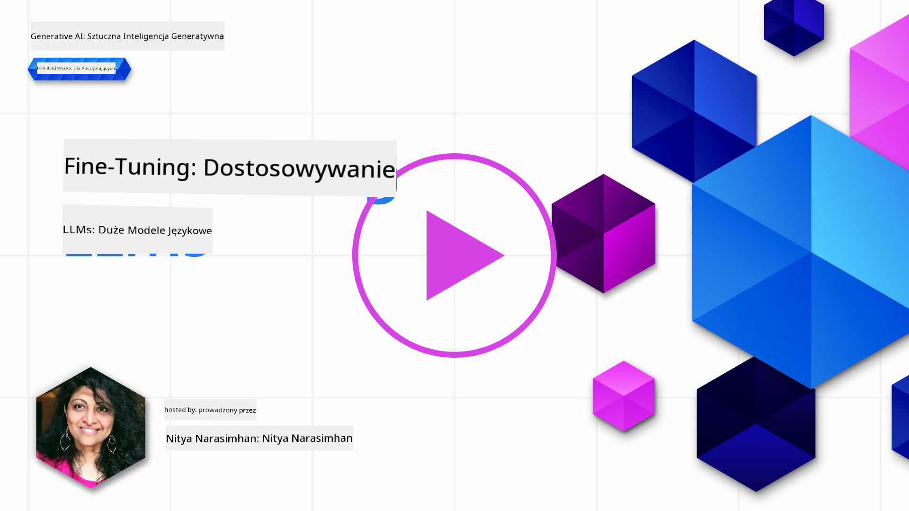
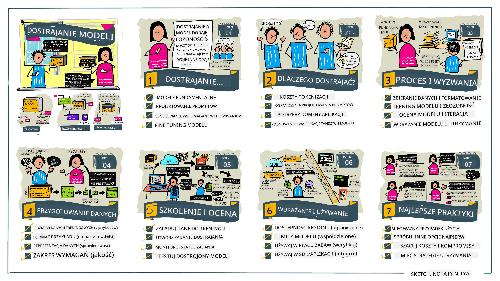

<!--
CO_OP_TRANSLATOR_METADATA:
{
  "original_hash": "68664f7e754a892ae1d8d5e2b7bd2081",
  "translation_date": "2025-05-20T07:46:55+00:00",
  "source_file": "18-fine-tuning/README.md",
  "language_code": "pl"
}
-->

# Dostrajanie Twojego LLM

Wykorzystanie dużych modeli językowych do budowy aplikacji generatywnej AI wiąże się z nowymi wyzwaniami. Kluczowym problemem jest zapewnienie jakości odpowiedzi (dokładności i trafności) w treściach generowanych przez model dla danego zapytania użytkownika. W poprzednich lekcjach omawialiśmy techniki takie jak inżynieria promptów i generacja wspomagana wyszukiwaniem, które próbują rozwiązać problem poprzez _modyfikację wejścia promptu_ dla istniejącego modelu.

W dzisiejszej lekcji omawiamy trzecią technikę, **dostrajanie**, która próbuje rozwiązać wyzwanie poprzez _ponowne trenowanie samego modelu_ z dodatkowymi danymi. Zanurzmy się w szczegóły.

## Cele nauki

Ta lekcja wprowadza pojęcie dostrajania dla wstępnie wytrenowanych modeli językowych, bada korzyści i wyzwania związane z tym podejściem oraz daje wskazówki, kiedy i jak używać dostrajania, aby poprawić wydajność swoich modeli generatywnej AI.

Na koniec tej lekcji powinieneś być w stanie odpowiedzieć na następujące pytania:

- Czym jest dostrajanie dla modeli językowych?
- Kiedy i dlaczego dostrajanie jest przydatne?
- Jak mogę dostroić wstępnie wytrenowany model?
- Jakie są ograniczenia dostrajania?

Gotowy? Zaczynajmy.

## Ilustrowany przewodnik

Chcesz zobaczyć ogólny obraz tego, co będziemy omawiać, zanim zagłębimy się w szczegóły? Sprawdź ten ilustrowany przewodnik, który opisuje ścieżkę nauki dla tej lekcji - od poznania podstawowych koncepcji i motywacji do dostrajania, po zrozumienie procesu i najlepszych praktyk dotyczących wykonywania zadania dostrajania. To fascynujący temat do eksploracji, więc nie zapomnij sprawdzić strony [Zasoby](./RESOURCES.md?WT.mc_id=academic-105485-koreyst) z dodatkowymi linkami wspierającymi Twoją samodzielną ścieżkę nauki!

## Czym jest dostrajanie dla modeli językowych?

Z definicji, duże modele językowe są _wstępnie wytrenowane_ na dużych ilościach tekstu pochodzącego z różnych źródeł, w tym z internetu. Jak nauczyliśmy się w poprzednich lekcjach, potrzebujemy technik takich jak _inżynieria promptów_ i _generacja wspomagana wyszukiwaniem_, aby poprawić jakość odpowiedzi modelu na pytania użytkownika ("prompty").

Popularna technika inżynierii promptów polega na dostarczeniu modelowi większej ilości wskazówek dotyczących oczekiwanego wyniku odpowiedzi, poprzez dostarczenie _instrukcji_ (wyraźne wskazówki) lub _podanie kilku przykładów_ (niejawne wskazówki). To jest określane jako _uczenie się na kilku przykładach_, ale ma dwie ograniczenia:

- Limity tokenów modelu mogą ograniczać liczbę przykładów, które możesz podać, i ograniczać skuteczność.
- Koszty tokenów modelu mogą sprawić, że dodanie przykładów do każdego promptu będzie kosztowne i ograniczać elastyczność.

Dostrajanie jest powszechną praktyką w systemach uczenia maszynowego, gdzie bierzemy wstępnie wytrenowany model i ponownie go trenujemy z nowymi danymi, aby poprawić jego wydajność w konkretnym zadaniu. W kontekście modeli językowych możemy dostroić wstępnie wytrenowany model _z wyselekcjonowanym zestawem przykładów dla danego zadania lub domeny aplikacji_, aby stworzyć **model niestandardowy**, który może być bardziej dokładny i trafny dla tego konkretnego zadania lub domeny. Dodatkową korzyścią dostrajania jest to, że może również zmniejszyć liczbę przykładów potrzebnych do uczenia się na kilku przykładach - zmniejszając zużycie tokenów i związane z tym koszty.

## Kiedy i dlaczego powinniśmy dostrajać modele?

W _tym_ kontekście, gdy mówimy o dostrajaniu, odnosimy się do **nadzorowanego** dostrajania, gdzie ponowne trenowanie odbywa się poprzez **dodanie nowych danych**, które nie były częścią pierwotnego zestawu danych treningowych. Jest to inne niż podejście dostrajania nienadzorowanego, gdzie model jest ponownie trenowany na pierwotnych danych, ale z innymi hiperparametrami.

Kluczową rzeczą do zapamiętania jest to, że dostrajanie jest zaawansowaną techniką, która wymaga pewnego poziomu wiedzy, aby osiągnąć pożądane rezultaty. Jeśli zostanie wykonane nieprawidłowo, może nie zapewnić oczekiwanych ulepszeń, a nawet pogorszyć wydajność modelu dla Twojej docelowej domeny.

Więc zanim nauczysz się "jak" dostrajać modele językowe, musisz wiedzieć "dlaczego" powinieneś obrać tę drogę i "kiedy" rozpocząć proces dostrajania. Zacznij od zadania sobie tych pytań:

- **Zastosowanie**: Jaki jest Twój _przypadek użycia_ dla dostrajania? Jaki aspekt obecnego wstępnie wytrenowanego modelu chcesz poprawić?
- **Alternatywy**: Czy próbowałeś _innych technik_, aby osiągnąć pożądane rezultaty? Użyj ich do stworzenia punktu odniesienia do porównania.
  - Inżynieria promptów: Wypróbuj techniki takie jak promptowanie na kilku przykładach z odpowiedziami na odpowiednie prompty. Oceń jakość odpowiedzi.
  - Generacja wspomagana wyszukiwaniem: Wypróbuj augmentację promptów z wynikami zapytań uzyskanymi poprzez wyszukiwanie w swoich danych. Oceń jakość odpowiedzi.
- **Koszty**: Czy zidentyfikowałeś koszty dostrajania?
  - Dostępność do dostrajania - czy wstępnie wytrenowany model jest dostępny do dostrajania?
  - Wysiłek - na przygotowanie danych treningowych, ocenę i udoskonalanie modelu.
  - Obliczenia - na uruchamianie zadań dostrajania i wdrażanie dostrojonego modelu
  - Dane - dostęp do wystarczającej ilości jakościowych przykładów dla wpływu dostrajania
- **Korzyści**: Czy potwierdziłeś korzyści dostrajania?
  - Jakość - czy dostrojony model przewyższył punkt odniesienia?
  - Koszt - czy zmniejsza zużycie tokenów przez uproszczenie promptów?
  - Rozszerzalność - czy możesz ponownie wykorzystać bazowy model dla nowych domen?

Odpowiadając na te pytania, powinieneś być w stanie zdecydować, czy dostrajanie jest właściwym podejściem dla Twojego przypadku użycia. Idealnie, podejście jest ważne tylko wtedy, gdy korzyści przewyższają koszty. Gdy zdecydujesz się kontynuować, czas pomyśleć o _jak_ możesz dostroić wstępnie wytrenowany model.

Chcesz uzyskać więcej informacji na temat procesu podejmowania decyzji? Obejrzyj [Dostroić czy nie dostroić](https://www.youtube.com/watch?v=0Jo-z-MFxJs)

## Jak możemy dostroić wstępnie wytrenowany model?

Aby dostroić wstępnie wytrenowany model, potrzebujesz:

- wstępnie wytrenowanego modelu do dostrojenia
- zestawu danych do użycia do dostrajania
- środowiska treningowego do uruchomienia zadania dostrajania
- środowiska hostingowego do wdrożenia dostrojonego modelu

## Dostrajanie w działaniu

Poniższe zasoby oferują szczegółowe samouczki, które przeprowadzą Cię przez prawdziwy przykład użycia wybranego modelu z wyselekcjonowanym zestawem danych. Aby przejść przez te samouczki, potrzebujesz konta u konkretnego dostawcy, wraz z dostępem do odpowiedniego modelu i zestawów danych.

| Dostawca     | Samouczek                                                                                                                                                                       | Opis                                                                                                                                                                                                                                                                                                                                                                                                                        |
| ------------ | ------------------------------------------------------------------------------------------------------------------------------------------------------------------------------ | ---------------------------------------------------------------------------------------------------------------------------------------------------------------------------------------------------------------------------------------------------------------------------------------------------------------------------------------------------------------------------------------------------------------------------------- |
| OpenAI       | [Jak dostroić modele czatu](https://github.com/openai/openai-cookbook/blob/main/examples/How_to_finetune_chat_models.ipynb?WT.mc_id=academic-105485-koreyst)                | Naucz się dostrajać `gpt-35-turbo` dla konkretnej domeny ("asystent kulinarny") poprzez przygotowanie danych treningowych, uruchomienie zadania dostrajania i użycie dostrojonego modelu do wnioskowania.                                                                                                                                                                                                                                              |
| Azure OpenAI | [Samouczek dostrajania GPT 3.5 Turbo](https://learn.microsoft.com/azure/ai-services/openai/tutorials/fine-tune?tabs=python-new%2Ccommand-line?WT.mc_id=academic-105485-koreyst) | Naucz się dostrajać model `gpt-35-turbo-0613` **na Azure** poprzez podjęcie kroków w celu stworzenia i przesłania danych treningowych, uruchomienia zadania dostrajania. Wdrażaj i używaj nowego modelu.                                                                                                                                                                                                                                                                 |
| Hugging Face | [Dostrajanie LLM z Hugging Face](https://www.philschmid.de/fine-tune-llms-in-2024-with-trl?WT.mc_id=academic-105485-koreyst)                                               | Ten wpis na blogu przeprowadzi Cię przez dostrajanie _otwartego LLM_ (np. `CodeLlama 7B`) przy użyciu biblioteki [transformers](https://huggingface.co/docs/transformers/index?WT.mc_id=academic-105485-koreyst) i [Reinforcement Learning (TRL)](https://huggingface.co/docs/trl/index?WT.mc_id=academic-105485-koreyst]) z otwartymi [zestawami danych](https://huggingface.co/docs/datasets/index?WT.mc_id=academic-105485-koreyst) na Hugging Face. |
|              |                                                                                                                                                                                |                                                                                                                                                                                                                                                                                                                                                                                                                                    |
| 🤗 AutoTrain | [Dostrajanie LLM z AutoTrain](https://github.com/huggingface/autotrain-advanced/?WT.mc_id=academic-105485-koreyst)                                                         | AutoTrain (lub AutoTrain Advanced) to biblioteka Python rozwinięta przez Hugging Face, która umożliwia dostrajanie dla wielu różnych zadań, w tym dostrajanie LLM. AutoTrain to rozwiązanie bez kodu, a dostrajanie można przeprowadzić we własnej chmurze, na Hugging Face Spaces lub lokalnie. Obsługuje zarówno GUI oparte na webie, CLI, jak i trening za pomocą plików konfiguracyjnych yaml.                                                                               |
|              |                                                                                                                                                                                |                                                                                                                                                                                                                                                                                                                                                                                                                                    |

## Zadanie

Wybierz jeden z powyższych samouczków i przejdź przez niego. _Możemy zreplikować wersję tych samouczków w Jupyter Notebooks w tym repozytorium tylko do celów referencyjnych. Proszę używać bezpośrednio oryginalnych źródeł, aby uzyskać najnowsze wersje_.

## Świetna robota! Kontynuuj naukę.

Po ukończeniu tej lekcji, sprawdź naszą [kolekcję nauki Generative AI](https://aka.ms/genai-collection?WT.mc_id=academic-105485-koreyst), aby kontynuować rozwijanie swojej wiedzy na temat Generative AI!

Gratulacje!! Ukończyłeś ostatnią lekcję z serii v2 dla tego kursu! Nie przestawaj się uczyć i budować. **Sprawdź stronę [ZASOBY](RESOURCES.md?WT.mc_id=academic-105485-koreyst) dla listy dodatkowych sugestii dotyczących tego tematu.

Nasza seria lekcji v1 również została zaktualizowana o więcej zadań i koncepcji. Więc poświęć chwilę, aby odświeżyć swoją wiedzę - i proszę [podziel się swoimi pytaniami i opinią](https://github.com/microsoft/generative-ai-for-beginners/issues?WT.mc_id=academic-105485-koreyst), aby pomóc nam poprawić te lekcje dla społeczności.

**Zastrzeżenie**:  
Ten dokument został przetłumaczony przy użyciu usługi tłumaczenia AI [Co-op Translator](https://github.com/Azure/co-op-translator). Chociaż dążymy do dokładności, prosimy pamiętać, że automatyczne tłumaczenia mogą zawierać błędy lub nieścisłości. Oryginalny dokument w jego rodzimym języku powinien być uznawany za wiarygodne źródło. W przypadku informacji krytycznych zaleca się profesjonalne tłumaczenie przez człowieka. Nie ponosimy odpowiedzialności za wszelkie nieporozumienia lub błędne interpretacje wynikające z użycia tego tłumaczenia.