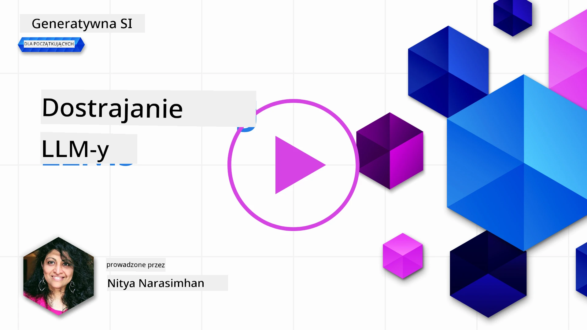
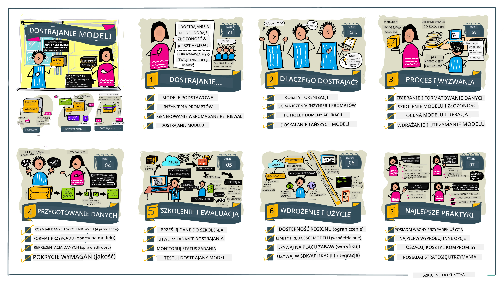

# Dostosowywanie Twojego LLM

Używanie dużych modeli językowych do budowy aplikacji generujących AI wiąże się z nowymi wyzwaniami. Kluczowym zagadnieniem jest zapewnienie jakości odpowiedzi (dokładności i trafności) generowanych przez model na określone zapytanie użytkownika. W poprzednich lekcjach omawialiśmy techniki takie jak inżynieria podpowiedzi oraz generowanie wspomagane wyszukiwaniem, które starają się rozwiązać problem poprzez _modyfikację wejścia podpowiedzi_ do istniejącego modelu.

W dzisiejszej lekcji omówimy trzecią technikę, **dostrajanie**, która stara się rozwiązać wyzwanie poprzez _ponowne trenowanie samego modelu_ z dodatkowymi danymi. Zanurzmy się w szczegóły.

## Cele nauki

Ta lekcja wprowadza koncepcję dostrajania wstępnie wytrenowanych modeli językowych, bada korzyści i wyzwania takiego podejścia oraz dostarcza wskazówek, kiedy i jak używać dostrajania, aby poprawić wydajność twoich modeli generujących AI.

Po zakończeniu lekcji powinieneś być w stanie odpowiedzieć na następujące pytania:

- Czym jest dostrajanie modeli językowych?
- Kiedy i dlaczego dostrajanie jest użyteczne?
- Jak mogę dostroić wstępnie wytrenowany model?
- Jakie są ograniczenia dostrajania?

Gotowy? Zaczynajmy.

## Ilustrowany przewodnik

Chcesz mieć ogólny obraz tego, co omówimy, zanim zaczniemy? Sprawdź ten ilustrowany przewodnik opisujący ścieżkę nauki dla tej lekcji – od nauki podstawowych pojęć i motywacji do dostrajania, po zrozumienie procesu i najlepszych praktyk realizacji zadania dostrajania. To fascynujący temat do eksploracji, więc nie zapomnij zajrzeć na stronę [Zasoby](./RESOURCES.md?WT.mc_id=academic-105485-koreyst) po dodatkowe linki wspierające samodzielną naukę!

## Czym jest dostrajanie modeli językowych?

Z definicji, duże modele językowe są _wstępnie wytrenowane_ na dużych ilościach tekstów pochodzących z różnych źródeł, w tym internetu. Jak dowiedzieliśmy się w poprzednich lekcjach, potrzebujemy technik takich jak _inżynieria podpowiedzi_ i _generowanie wspomagane wyszukiwaniem_, aby poprawić jakość odpowiedzi modelu na pytania użytkownika („podpowiedzi”).

Popularna technika inżynierii podpowiedzi polega na dostarczaniu modelowi więcej wskazówek co do oczekiwanej odpowiedzi, czy to przez podawanie _instrukcji_ (wskazówek jawnych), czy _kilku przykładów_ (wskazówek niejawnych). Nazywa się to _uczeniem z niewielką liczbą przykładów_, ale ma dwie ograniczenia:

- Limity tokenów modelu mogą ograniczać liczbę przykładów, które możesz podać, i zmniejszać skuteczność.
- Koszty tokenów modelu mogą powodować, że dodawanie przykładów do każdej podpowiedzi stanie się kosztowne i ograniczać elastyczność.

Dostrajanie to powszechna praktyka w systemach uczenia maszynowego, gdzie bierzemy wstępnie wytrenowany model i ponownie go trenujemy z nowymi danymi, aby poprawić jego działanie na określonym zadaniu. W kontekście modeli językowych możemy dostroić wstępnie wytrenowany model _za pomocą wyselekcjonowanego zestawu przykładów dla konkretnego zadania lub domeny zastosowania_, tworząc **model niestandardowy**, który może być bardziej dokładny i trafny w tym konkretnym zadaniu lub dziedzinie. Dodatkową korzyścią z dostrajania jest możliwość zmniejszenia liczby przykładów potrzebnych do uczenia z niewielką liczbą przykładów – co redukuje użycie tokenów i powiązane koszty.

## Kiedy i dlaczego powinniśmy dostrajać modele?

W _tym_ kontekście, gdy mówimy o dostrajaniu, mamy na myśli **nadzorowane** dostrajanie, gdzie ponowne trenowanie odbywa się poprzez **dodawanie nowych danych**, które nie były częścią oryginalnego zbioru treningowego. Różni się to od niesuperwizowanego dostrajania, gdzie model jest trenowany ponownie na oryginalnych danych, lecz z innymi hiperparametrami.

Kluczową rzeczą do zapamiętania jest to, że dostrajanie to zaawansowana technika, która wymaga pewnego poziomu wiedzy, aby osiągnąć oczekiwane rezultaty. Jeśli zostanie źle wykonane, może nie przynieść spodziewanych ulepszeń, a nawet pogorszyć wydajność modelu dla twojej docelowej dziedziny.

Dlatego zanim nauczysz się „jak” dostrajać modele językowe, musisz wiedzieć „dlaczego” warto wybrać tę metodę i „kiedy” rozpocząć proces dostrajania. Zacznij od zadania sobie tych pytań:

- **Przypadek użycia**: Jaki jest twój _przypadek użycia_ dostrajania? Jaki aspekt obecnego wstępnie wytrenowanego modelu chcesz poprawić?
- **Alternatywy**: Czy próbowałeś _innych technik_, aby osiągnąć zamierzone cele? Wykorzystaj je, aby stworzyć bazę do porównań.
  - Inżynieria podpowiedzi: Wypróbuj techniki takie jak podpowiedzi z niewielką liczbą przykładów odpowiednich reakcji podpowiedzi. Oceń jakość odpowiedzi.
  - Generowanie wspomagane wyszukiwaniem: Wypróbuj uzupełnianie podpowiedzi wynikami wyszukiwania danych. Oceń jakość odpowiedzi.
- **Koszty**: Czy zidentyfikowałeś koszty dostrajania?
  - Możliwość dostrajania – czy wstępnie wytrenowany model jest dostępny do dostrajania?
  - Nakład pracy – na przygotowanie danych treningowych, ocenę i udoskonalanie modelu.
  - Obliczenia – na uruchomienie pracy dostrajania i wdrożenie dostrojonego modelu.
  - Dane – dostęp do wystarczającej jakości przykładów, aby dostrajanie miało wpływ.
- **Korzyści**: Czy potwierdziłeś korzyści z dostrajania?
  - Jakość – czy dostrojony model przewyższył bazowy?
  - Koszt – czy zmniejsza użycie tokenów poprzez uproszczenie podpowiedzi?
  - Rozszerzalność – czy możesz ponownie wykorzystać model bazowy dla nowych domen?

Odpowiadając na te pytania, powinieneś być w stanie zdecydować, czy dostrajanie jest właściwym podejściem dla twojego przypadku użycia. Idealnie, podejście jest ważne tylko wtedy, gdy korzyści przewyższają koszty. Gdy zdecydujesz się na kontynuację, czas pomyśleć, _jak_ możesz dostroić wstępnie wytrenowany model.

Chcesz uzyskać więcej informacji o procesie podejmowania decyzji? Obejrzyj [To fine-tune or not to fine-tune](https://www.youtube.com/watch?v=0Jo-z-MFxJs)

## Jak możemy dostroić wstępnie wytrenowany model?

Aby dostroić wstępnie wytrenowany model, potrzebujesz:

- wstępnie wytrenowanego modelu do dostrajania
- zestawu danych do użycia podczas dostrajania
- środowiska treningowego do uruchomienia zadania dostrajania
- środowiska hostingowego do wdrożenia dostrojonego modelu

## Dostrajanie w praktyce

Poniższe zasoby oferują tutoriale krok po kroku, które przeprowadzą cię przez rzeczywisty przykład korzystania z wybranego modelu i wyselekcjonowanego zestawu danych. Aby pracować z tymi tutorialami, potrzebujesz konta u konkretnego dostawcy oraz dostępu do odpowiednich modeli i zestawów danych.

| Dostawca    | Tutorial                                                                                                                                                                      | Opis                                                                                                                                                                                                                                                                                                                                                                                                                             |
| ----------- | ----------------------------------------------------------------------------------------------------------------------------------------------------------------------------- | -------------------------------------------------------------------------------------------------------------------------------------------------------------------------------------------------------------------------------------------------------------------------------------------------------------------------------------------------------------------------------------------------------------------------------- |
| OpenAI      | [Jak dostroić modele czatu](https://github.com/openai/openai-cookbook/blob/main/examples/How_to_finetune_chat_models.ipynb?WT.mc_id=academic-105485-koreyst)               | Naucz się dostrajać `gpt-35-turbo` dla konkretnej domeny („asystent przepisów”) poprzez przygotowanie danych treningowych, uruchomienie zadania dostrajania i użycie dostrojonego modelu do wnioskowania.                                                                                                                                                                                                                       |
| Azure OpenAI| [Poradnik dostrajania GPT 3.5 Turbo](https://learn.microsoft.com/azure/ai-services/openai/tutorials/fine-tune?tabs=python-new%2Ccommand-line&WT.mc_id=academic-105485-koreyst)| Naucz się dostrajać model `gpt-35-turbo-0613` **na platformie Azure** wykonując kroki tworzenia i przesyłania danych treningowych, uruchomienia zadania dostrajania. Wdrożenie i użycie nowego modelu.                                                                                                                                                                                                                              |
| Hugging Face| [Dostrajanie LLM z Hugging Face](https://www.philschmid.de/fine-tune-llms-in-2024-with-trl?WT.mc_id=academic-105485-koreyst)                                              | Ten wpis na blogu prowadzi cię przez dostrajanie _otwartego LLM_ (np. `CodeLlama 7B`) używając biblioteki [transformers](https://huggingface.co/docs/transformers/index?WT.mc_id=academic-105485-koreyst) i [Transformer Reinforcement Learning (TRL)](https://huggingface.co/docs/trl/index?WT.mc_id=academic-105485-koreyst) oraz otwartych [zbiorów danych](https://huggingface.co/docs/datasets/index?WT.mc_id=academic-105485-koreyst) Hugging Face.    |
|             |                                                                                                                                                                               |                                                                                                                                                                                                                                                                                                                                                                                                                                 |
| 🤗 AutoTrain| [Dostrajanie LLM z AutoTrain](https://github.com/huggingface/autotrain-advanced/?WT.mc_id=academic-105485-koreyst)                                                          | AutoTrain (lub AutoTrain Advanced) to biblioteka Pythona stworzona przez Hugging Face, która pozwala na dostrajanie dla różnych zadań, w tym dostrajanie LLM. AutoTrain to rozwiązanie bez kodu i dostrajanie można przeprowadzić w twojej chmurze, na Hugging Face Spaces lub lokalnie. Obsługuje zarówno graficzny interfejs sieciowy, CLI, jak i trening przez pliki konfiguracyjne YAML.                                          |
|             |                                                                                                                                                                               |                                                                                                                                                                                                                                                                                                                                                                                                                                 |
| 🦥 Unsloth  | [Dostrajanie LLM z Unsloth](https://github.com/unslothai/unsloth)                                                                                                           | Unsloth to otwartoźródłowy framework wspierający dostrajanie LLM i uczenie przez wzmacnianie (RL). Unsloth ułatwia lokalne trenowanie, ocenę i wdrażanie z gotowymi [notatnikami](https://github.com/unslothai/notebooks). Obsługuje też modele tekst-na-mowę (TTS), BERT oraz multimodalne. Aby rozpocząć, przeczytaj ich krok po kroku [Przewodnik po dostrajaniu LLM](https://docs.unsloth.ai/get-started/fine-tuning-llms-guide).                 |
|             |                                                                                                                                                                               |                                                                                                                                                                                                                                                                                                                                                                                                                                 |
## Zadanie

Wybierz jeden z powyższych tutoriali i przejdź przez niego. _Możemy powielić wersję tych tutoriali w Notatnikach Jupyter w tym repozytorium tylko jako odniesienie. Prosimy korzystaj bezpośrednio z oryginalnych źródeł, aby uzyskać najnowsze wersje_.

## Doskonała robota! Kontynuuj naukę.

Po ukończeniu tej lekcji zajrzyj do naszej [kolekcji nauki o generatywnym AI](https://aka.ms/genai-collection?WT.mc_id=academic-105485-koreyst), by dalej podnosić swoje kompetencje w generatywnym AI!

Gratulacje!! Ukończyłeś ostatnią lekcję z serii v2 tego kursu! Nie przestawaj się uczyć i tworzyć. \*\*Sprawdź stronę [ZASOBY](RESOURCES.md?WT.mc_id=academic-105485-koreyst) dla listy dodatkowych sugestii właśnie na ten temat.

Nasza seria lekcji v1 została również zaktualizowana o kolejne zadania i koncepcje. Poświęć chwilę, by odświeżyć swoją wiedzę – i prosimy [podziel się swoimi pytaniami i opiniami](https://github.com/microsoft/generative-ai-for-beginners/issues?WT.mc_id=academic-105485-koreyst), aby pomóc nam ulepszyć te lekcje dla społeczności.

---

<!-- CO-OP TRANSLATOR DISCLAIMER START -->
**Zastrzeżenie**:  
Niniejszy dokument został przetłumaczony za pomocą automatycznej usługi tłumaczeń AI [Co-op Translator](https://github.com/Azure/co-op-translator). Mimo że dokładamy starań, aby tłumaczenie było jak najdokładniejsze, prosimy mieć na uwadze, że tłumaczenia automatyczne mogą zawierać błędy lub nieścisłości. Oryginalny dokument w języku źródłowym należy traktować jako źródło wiarygodne. W przypadku informacji krytycznych zaleca się skorzystanie z profesjonalnego tłumaczenia wykonanego przez człowieka. Nie ponosimy odpowiedzialności za jakiekolwiek nieporozumienia lub błędne interpretacje wynikające z korzystania z tego tłumaczenia.
<!-- CO-OP TRANSLATOR DISCLAIMER END -->