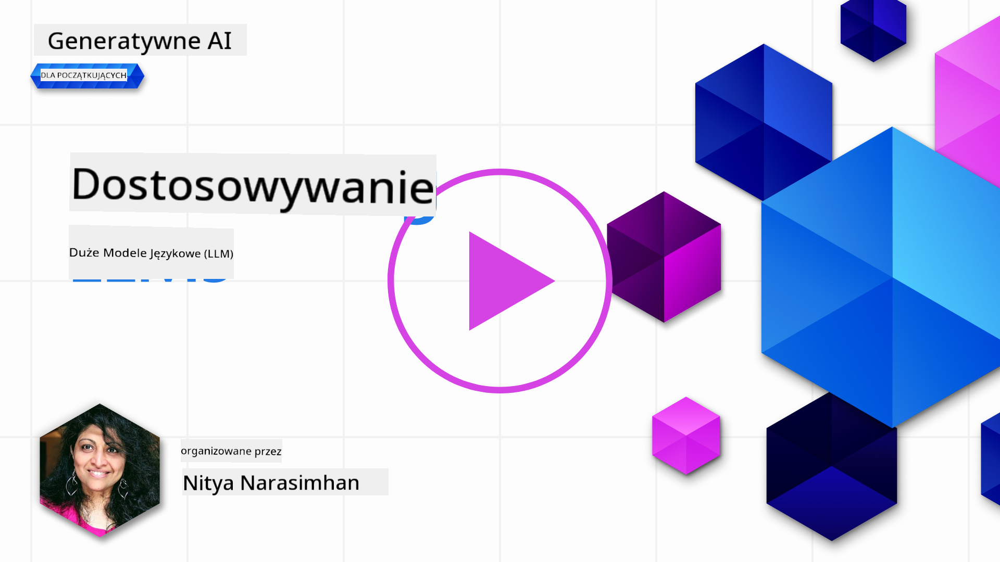
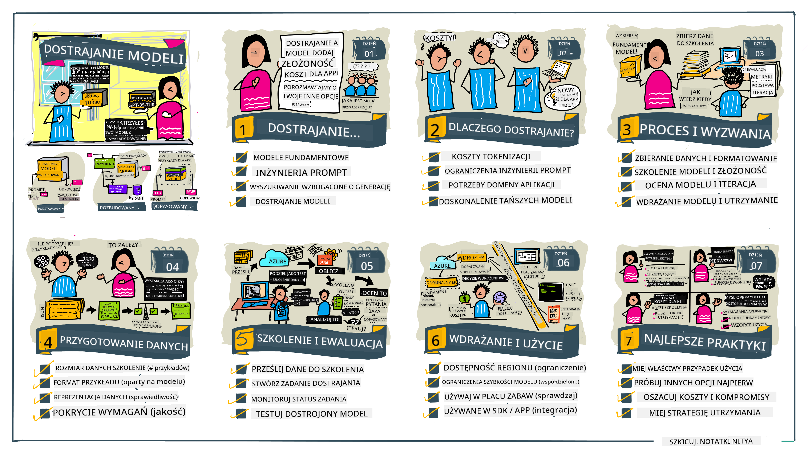

<!--
CO_OP_TRANSLATOR_METADATA:
{
  "original_hash": "68664f7e754a892ae1d8d5e2b7bd2081",
  "translation_date": "2025-06-26T00:40:58+00:00",
  "source_file": "18-fine-tuning/README.md",
  "language_code": "pl"
}
-->

# Dostosowywanie swojego LLM

Wykorzystanie dużych modeli językowych do budowania aplikacji AI generatywnej wiąże się z nowymi wyzwaniami. Kluczowym problemem jest zapewnienie jakości odpowiedzi (dokładności i trafności) w treści generowanej przez model na podstawie danego zapytania użytkownika. W poprzednich lekcjach omówiliśmy techniki takie jak inżynieria podpowiedzi i generacja wspomagana odzyskiwaniem, które próbują rozwiązać problem poprzez _modyfikację wejścia podpowiedzi_ dla istniejącego modelu.

W dzisiejszej lekcji omawiamy trzecią technikę, **dostosowywanie**, która stara się rozwiązać problem poprzez _ponowne trenowanie samego modelu_ z dodatkowymi danymi. Zanurzmy się w szczegóły.

## Cele nauki

Ta lekcja wprowadza koncepcję dostosowywania dla wstępnie wytrenowanych modeli językowych, eksploruje korzyści i wyzwania związane z tym podejściem oraz dostarcza wskazówek, kiedy i jak używać dostosowywania, aby poprawić wydajność swoich modeli AI generatywnej.

Po zakończeniu tej lekcji powinieneś być w stanie odpowiedzieć na następujące pytania:

- Co to jest dostosowywanie dla modeli językowych?
- Kiedy i dlaczego dostosowywanie jest przydatne?
- Jak mogę dostosować wstępnie wytrenowany model?
- Jakie są ograniczenia dostosowywania?

Gotowy? Zaczynajmy.

## Ilustrowany przewodnik

Chcesz zobaczyć ogólny obraz tego, co będziemy omawiać, zanim się zagłębimy? Sprawdź ten ilustrowany przewodnik, który opisuje podróż edukacyjną dla tej lekcji - od nauki podstawowych koncepcji i motywacji do dostosowywania, do zrozumienia procesu i najlepszych praktyk w wykonywaniu zadania dostosowywania. To fascynujący temat do eksploracji, więc nie zapomnij sprawdzić strony [Zasoby](./RESOURCES.md?WT.mc_id=academic-105485-koreyst) z dodatkowymi linkami wspierającymi Twoją samodzielną podróż edukacyjną!

## Co to jest dostosowywanie dla modeli językowych?

Z definicji, duże modele językowe są _wstępnie wytrenowane_ na dużych ilościach tekstu pochodzącego z różnych źródeł, w tym z internetu. Jak nauczyliśmy się w poprzednich lekcjach, potrzebujemy technik takich jak _inżynieria podpowiedzi_ i _generacja wspomagana odzyskiwaniem_, aby poprawić jakość odpowiedzi modelu na pytania użytkownika ("podpowiedzi").

Popularna technika inżynierii podpowiedzi polega na dostarczaniu modelowi większego wsparcia w tym, czego oczekuje się w odpowiedzi, albo poprzez dostarczanie _instrukcji_ (wyraźne wskazówki), albo _podając kilka przykładów_ (ukryte wskazówki). Jest to nazywane _uczeniem się na kilku przykładach_, ale ma dwie ograniczenia:

- Limity tokenów modelu mogą ograniczać liczbę przykładów, które można podać, oraz ograniczać skuteczność.
- Koszty tokenów modelu mogą sprawić, że dodawanie przykładów do każdej podpowiedzi będzie kosztowne, ograniczając elastyczność.

Dostosowywanie jest powszechną praktyką w systemach uczenia maszynowego, gdzie bierzemy wstępnie wytrenowany model i ponownie go trenujemy z nowymi danymi, aby poprawić jego wydajność w określonym zadaniu. W kontekście modeli językowych możemy dostosować wstępnie wytrenowany model _z zestawem przykładów dla danego zadania lub dziedziny aplikacji_, aby stworzyć **model niestandardowy**, który może być bardziej dokładny i trafny dla tego konkretnego zadania lub dziedziny. Dodatkową korzyścią z dostosowywania jest to, że może również zmniejszyć liczbę potrzebnych przykładów dla uczenia się na kilku przykładach - zmniejszając użycie tokenów i związane z tym koszty.

## Kiedy i dlaczego powinniśmy dostosowywać modele?

W _tym_ kontekście, kiedy mówimy o dostosowywaniu, odnosimy się do **nadzorowanego** dostosowywania, gdzie ponowne trenowanie odbywa się poprzez **dodanie nowych danych**, które nie były częścią pierwotnego zestawu danych treningowych. Jest to różne od podejścia nienadzorowanego dostosowywania, gdzie model jest ponownie trenowany na pierwotnych danych, ale z różnymi hiperparametrami.

Kluczową rzeczą do zapamiętania jest to, że dostosowywanie jest zaawansowaną techniką, która wymaga pewnego poziomu wiedzy, aby osiągnąć pożądane rezultaty. Jeśli zostanie wykonane nieprawidłowo, może nie przynieść oczekiwanych ulepszeń, a nawet pogorszyć wydajność modelu w docelowej dziedzinie.

Dlatego zanim nauczysz się "jak" dostosowywać modele językowe, musisz wiedzieć "dlaczego" powinieneś obrać tę drogę i "kiedy" rozpocząć proces dostosowywania. Zacznij od zadania sobie tych pytań:

- **Przypadek użycia**: Jaki jest Twój _przypadek użycia_ dla dostosowywania? Jaki aspekt obecnego wstępnie wytrenowanego modelu chcesz poprawić?
- **Alternatywy**: Czy próbowałeś _innych technik_ osiągnięcia pożądanych wyników? Użyj ich do stworzenia podstawy do porównania.
  - Inżynieria podpowiedzi: Wypróbuj techniki takie jak podpowiedzi z kilkoma przykładami odpowiednich odpowiedzi. Oceń jakość odpowiedzi.
  - Generacja wspomagana odzyskiwaniem: Spróbuj wzbogacić podpowiedzi wynikami zapytań uzyskanymi poprzez przeszukiwanie danych. Oceń jakość odpowiedzi.
- **Koszty**: Czy zidentyfikowałeś koszty dostosowywania?
  - Możliwość dostosowania - czy wstępnie wytrenowany model jest dostępny do dostosowywania?
  - Wysiłek - na przygotowanie danych treningowych, ocenę i udoskonalenie modelu.
  - Obliczenia - na uruchomienie zadań dostosowywania i wdrożenie dostosowanego modelu.
  - Dane - dostęp do wystarczającej jakości przykładów dla wpływu dostosowywania.
- **Korzyści**: Czy potwierdziłeś korzyści z dostosowywania?
  - Jakość - czy dostosowany model przewyższył podstawę?
  - Koszt - czy zmniejsza użycie tokenów poprzez uproszczenie podpowiedzi?
  - Rozszerzalność - czy możesz ponownie użyć modelu bazowego dla nowych dziedzin?

Odpowiadając na te pytania, powinieneś być w stanie zdecydować, czy dostosowywanie jest odpowiednim podejściem dla Twojego przypadku użycia. Idealnie, podejście jest ważne tylko wtedy, gdy korzyści przewyższają koszty. Gdy zdecydujesz się kontynuować, czas pomyśleć o _tym, jak_ możesz dostosować wstępnie wytrenowany model.

Chcesz uzyskać więcej wglądów w proces podejmowania decyzji? Obejrzyj [Czy dostosowywać, czy nie dostosowywać](https://www.youtube.com/watch?v=0Jo-z-MFxJs)

## Jak możemy dostosować wstępnie wytrenowany model?

Aby dostosować wstępnie wytrenowany model, musisz mieć:

- wstępnie wytrenowany model do dostosowania
- zestaw danych do użycia w dostosowywaniu
- środowisko treningowe do uruchomienia zadania dostosowywania
- środowisko hostingowe do wdrożenia dostosowanego modelu

## Dostosowywanie w praktyce

Poniższe zasoby dostarczają samouczków krok po kroku, które przeprowadzą Cię przez prawdziwy przykład wykorzystujący wybrany model z kuratorem zestawem danych. Aby przejść przez te samouczki, potrzebujesz konta u konkretnego dostawcy oraz dostępu do odpowiedniego modelu i zestawów danych.

| Dostawca     | Samouczek                                                                                                                                                                       | Opis                                                                                                                                                                                                                                                                                                                                                                                                                        |
| ------------ | ------------------------------------------------------------------------------------------------------------------------------------------------------------------------------ | ---------------------------------------------------------------------------------------------------------------------------------------------------------------------------------------------------------------------------------------------------------------------------------------------------------------------------------------------------------------------------------------------------------------------------------- |
| OpenAI       | [Jak dostosować modele czatowe](https://github.com/openai/openai-cookbook/blob/main/examples/How_to_finetune_chat_models.ipynb?WT.mc_id=academic-105485-koreyst)                | Naucz się dostosowywać `gpt-35-turbo` dla konkretnej dziedziny ("asystent kulinarny") poprzez przygotowanie danych treningowych, uruchomienie zadania dostosowywania i wykorzystanie dostosowanego modelu do wnioskowania.                                                                                                                                                                                                                                              |
| Azure OpenAI | [Samouczek dostosowywania GPT 3.5 Turbo](https://learn.microsoft.com/azure/ai-services/openai/tutorials/fine-tune?tabs=python-new%2Ccommand-line?WT.mc_id=academic-105485-koreyst) | Naucz się dostosowywać model `gpt-35-turbo-0613` **na Azure** poprzez kroki tworzenia i przesyłania danych treningowych, uruchomienia zadania dostosowywania. Wdróż i użyj nowego modelu.                                                                                                                                                                                                                                                                 |
| Hugging Face | [Dostosowywanie LLM z Hugging Face](https://www.philschmid.de/fine-tune-llms-in-2024-with-trl?WT.mc_id=academic-105485-koreyst)                                               | Ten post na blogu przeprowadza Cię przez dostosowywanie _otwartego LLM_ (np. `CodeLlama 7B`) za pomocą biblioteki [transformers](https://huggingface.co/docs/transformers/index?WT.mc_id=academic-105485-koreyst) i [Reinforcement Learning (TRL)](https://huggingface.co/docs/trl/index?WT.mc_id=academic-105485-koreyst]) z otwartymi [zestawami danych](https://huggingface.co/docs/datasets/index?WT.mc_id=academic-105485-koreyst) na Hugging Face. |
|              |                                                                                                                                                                                |                                                                                                                                                                                                                                                                                                                                                                                                                                    |
| 🤗 AutoTrain | [Dostosowywanie LLM z AutoTrain](https://github.com/huggingface/autotrain-advanced/?WT.mc_id=academic-105485-koreyst)                                                         | AutoTrain (lub AutoTrain Advanced) to biblioteka python opracowana przez Hugging Face, która umożliwia dostosowywanie dla wielu różnych zadań, w tym dostosowywanie LLM. AutoTrain to rozwiązanie bez kodu, a dostosowywanie można wykonać we własnej chmurze, na Hugging Face Spaces lub lokalnie. Obsługuje zarówno interfejs GUI, CLI, jak i trening za pomocą plików konfiguracyjnych yaml.                                                                               |
|              |                                                                                                                                                                                |                                                                                                                                                                                                                                                                                                                                                                                                                                    |

## Zadanie

Wybierz jeden z powyższych samouczków i przejdź przez niego. _Możemy zreplikować wersję tych samouczków w Jupyter Notebooks w tym repozytorium wyłącznie jako odniesienie. Proszę używać oryginalnych źródeł bezpośrednio, aby uzyskać najnowsze wersje_.

## Świetna robota! Kontynuuj naukę.

Po zakończeniu tej lekcji, sprawdź naszą [kolekcję nauki o AI generatywnej](https://aka.ms/genai-collection?WT.mc_id=academic-105485-koreyst), aby kontynuować rozwijanie swojej wiedzy na temat AI generatywnej!

Gratulacje!! Ukończyłeś ostatnią lekcję z serii v2 tego kursu! Nie przestawaj się uczyć i budować. \*\*Sprawdź stronę [ZASOBY](RESOURCES.md?WT.mc_id=academic-105485-koreyst) z listą dodatkowych sugestii dotyczących tego właśnie tematu.

Nasza seria lekcji v1 została również zaktualizowana o więcej zadań i koncepcji. Więc poświęć chwilę na odświeżenie swojej wiedzy - i proszę [podziel się swoimi pytaniami i opiniami](https://github.com/microsoft/generative-ai-for-beginners/issues?WT.mc_id=academic-105485-koreyst), aby pomóc nam ulepszyć te lekcje dla społeczności.

**Zastrzeżenie**:  
Ten dokument został przetłumaczony przy użyciu usługi tłumaczenia AI [Co-op Translator](https://github.com/Azure/co-op-translator). Chociaż dążymy do dokładności, prosimy pamiętać, że automatyczne tłumaczenia mogą zawierać błędy lub nieścisłości. Oryginalny dokument w jego ojczystym języku powinien być uznawany za autorytatywne źródło. W przypadku informacji krytycznych zaleca się profesjonalne tłumaczenie przez człowieka. Nie ponosimy odpowiedzialności za jakiekolwiek nieporozumienia lub błędne interpretacje wynikające z użycia tego tłumaczenia.