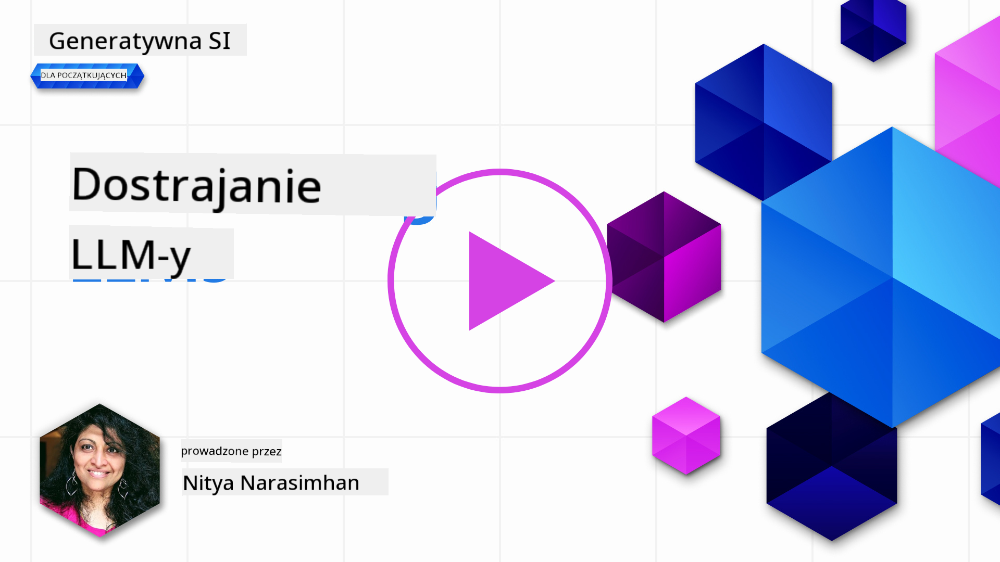

<!--
CO_OP_TRANSLATOR_METADATA:
{
  "original_hash": "807f0d9fc1747e796433534e1be6a98a",
  "translation_date": "2025-10-18T00:56:05+00:00",
  "source_file": "18-fine-tuning/README.md",
  "language_code": "pl"
}
-->

# Dostosowywanie Twojego LLM

Wykorzystanie dużych modeli językowych do budowy aplikacji generatywnej AI wiąże się z nowymi wyzwaniami. Kluczowym problemem jest zapewnienie jakości odpowiedzi (dokładności i trafności) w treściach generowanych przez model na podstawie zapytań użytkownika. W poprzednich lekcjach omawialiśmy techniki, takie jak inżynieria promptów i generacja wspomagana wyszukiwaniem, które próbują rozwiązać ten problem poprzez _modyfikację wejścia promptu_ w istniejącym modelu.

W dzisiejszej lekcji omawiamy trzecią technikę, **dostosowywanie**, która próbuje rozwiązać ten problem poprzez _ponowne trenowanie samego modelu_ z dodatkowymi danymi. Zgłębmy szczegóły.

## Cele nauki

Ta lekcja wprowadza koncepcję dostosowywania dla wstępnie wytrenowanych modeli językowych, bada korzyści i wyzwania związane z tym podejściem oraz dostarcza wskazówek, kiedy i jak stosować dostosowywanie, aby poprawić wydajność Twoich modeli generatywnej AI.

Po ukończeniu tej lekcji powinieneś być w stanie odpowiedzieć na następujące pytania:

- Czym jest dostosowywanie modeli językowych?
- Kiedy i dlaczego dostosowywanie jest przydatne?
- Jak mogę dostosować wstępnie wytrenowany model?
- Jakie są ograniczenia dostosowywania?

Gotowy? Zaczynajmy.

## Ilustrowany przewodnik

Chcesz najpierw zobaczyć ogólny obraz tego, co omówimy? Sprawdź ten ilustrowany przewodnik, który opisuje ścieżkę nauki dla tej lekcji - od poznania podstawowych koncepcji i motywacji do dostosowywania, po zrozumienie procesu i najlepszych praktyk w realizacji zadania dostosowywania. To fascynujący temat do zgłębienia, więc nie zapomnij sprawdzić strony [Zasoby](./RESOURCES.md?WT.mc_id=academic-105485-koreyst) z dodatkowymi linkami wspierającymi Twoją samodzielną naukę!

## Czym jest dostosowywanie modeli językowych?

Z definicji, duże modele językowe są _wstępnie wytrenowane_ na dużych ilościach tekstu pochodzącego z różnych źródeł, w tym z internetu. Jak dowiedzieliśmy się w poprzednich lekcjach, potrzebujemy technik takich jak _inżynieria promptów_ i _generacja wspomagana wyszukiwaniem_, aby poprawić jakość odpowiedzi modelu na pytania użytkownika ("prompty").

Popularną techniką inżynierii promptów jest dostarczanie modelowi bardziej szczegółowych wskazówek dotyczących oczekiwanego wyniku odpowiedzi, poprzez podanie _instrukcji_ (wyraźne wskazówki) lub _kilku przykładów_ (ukryte wskazówki). Nazywa się to _uczeniem na podstawie kilku przykładów_, ale ma dwie ograniczenia:

- Limity tokenów modelu mogą ograniczać liczbę przykładów, które można podać, co zmniejsza skuteczność.
- Koszty tokenów modelu mogą sprawić, że dodawanie przykładów do każdego promptu stanie się kosztowne i mniej elastyczne.

Dostosowywanie to powszechna praktyka w systemach uczenia maszynowego, polegająca na ponownym trenowaniu wstępnie wytrenowanego modelu z nowymi danymi w celu poprawy jego wydajności w określonym zadaniu. W kontekście modeli językowych możemy dostosować wstępnie wytrenowany model _za pomocą starannie dobranego zestawu przykładów dla danego zadania lub dziedziny zastosowania_, aby stworzyć **model niestandardowy**, który może być bardziej dokładny i trafny dla tego konkretnego zadania lub dziedziny. Dodatkową korzyścią z dostosowywania jest to, że może ono również zmniejszyć liczbę przykładów potrzebnych do uczenia na podstawie kilku przykładów - redukując zużycie tokenów i związane z tym koszty.

## Kiedy i dlaczego powinniśmy dostosowywać modele?

W _tym_ kontekście, mówiąc o dostosowywaniu, mamy na myśli **nadzorowane** dostosowywanie, gdzie ponowne trenowanie odbywa się poprzez **dodanie nowych danych**, które nie były częścią oryginalnego zestawu danych treningowych. Jest to inne niż podejście do dostosowywania nienadzorowanego, gdzie model jest ponownie trenowany na oryginalnych danych, ale z różnymi hiperparametrami.

Kluczową rzeczą, o której należy pamiętać, jest to, że dostosowywanie to zaawansowana technika, która wymaga pewnego poziomu wiedzy, aby osiągnąć pożądane rezultaty. Jeśli zostanie wykonane nieprawidłowo, może nie przynieść oczekiwanych ulepszeń, a nawet pogorszyć wydajność modelu w docelowej dziedzinie.

Zanim dowiesz się "jak" dostosowywać modele językowe, musisz wiedzieć "dlaczego" warto obrać tę drogę i "kiedy" rozpocząć proces dostosowywania. Zacznij od zadania sobie następujących pytań:

- **Zastosowanie**: Jaki jest Twój _cel_ dostosowywania? Jaki aspekt obecnego wstępnie wytrenowanego modelu chcesz poprawić?
- **Alternatywy**: Czy próbowałeś _innych technik_, aby osiągnąć pożądane rezultaty? Użyj ich, aby stworzyć punkt odniesienia do porównania.
  - Inżynieria promptów: Wypróbuj techniki, takie jak podawanie kilku przykładów odpowiednich odpowiedzi w promptach. Oceń jakość odpowiedzi.
  - Generacja wspomagana wyszukiwaniem: Spróbuj wzbogacić prompty wynikami wyszukiwania w Twoich danych. Oceń jakość odpowiedzi.
- **Koszty**: Czy zidentyfikowałeś koszty związane z dostosowywaniem?
  - Możliwość dostosowania - czy wstępnie wytrenowany model jest dostępny do dostosowywania?
  - Wysiłek - przygotowanie danych treningowych, ocena i udoskonalanie modelu.
  - Zasoby obliczeniowe - uruchamianie zadań dostosowywania i wdrażanie dostosowanego modelu.
  - Dane - dostęp do wystarczającej liczby wysokiej jakości przykładów dla wpływu dostosowywania.
- **Korzyści**: Czy potwierdziłeś korzyści płynące z dostosowywania?
  - Jakość - czy dostosowany model przewyższył punkt odniesienia?
  - Koszt - czy zmniejsza zużycie tokenów poprzez uproszczenie promptów?
  - Rozszerzalność - czy można ponownie wykorzystać bazowy model w nowych dziedzinach?

Odpowiadając na te pytania, powinieneś być w stanie zdecydować, czy dostosowywanie jest odpowiednim podejściem dla Twojego celu. Idealnie, podejście jest uzasadnione tylko wtedy, gdy korzyści przewyższają koszty. Gdy zdecydujesz się kontynuować, czas pomyśleć o _tym, jak_ możesz dostosować wstępnie wytrenowany model.

Chcesz dowiedzieć się więcej o procesie podejmowania decyzji? Obejrzyj [Dostosowywać czy nie dostosowywać](https://www.youtube.com/watch?v=0Jo-z-MFxJs)

## Jak możemy dostosować wstępnie wytrenowany model?

Aby dostosować wstępnie wytrenowany model, potrzebujesz:

- wstępnie wytrenowanego modelu do dostosowania
- zestawu danych do użycia w procesie dostosowywania
- środowiska treningowego do uruchomienia zadania dostosowywania
- środowiska hostingowego do wdrożenia dostosowanego modelu

## Dostosowywanie w praktyce

Poniższe zasoby oferują szczegółowe samouczki, które przeprowadzą Cię przez rzeczywisty przykład użycia wybranego modelu z odpowiednio dobranym zestawem danych. Aby przejść przez te samouczki, potrzebujesz konta u konkretnego dostawcy oraz dostępu do odpowiedniego modelu i zestawów danych.

| Dostawca     | Samouczek                                                                                                                                                                       | Opis                                                                                                                                                                                                                                                                                                                                                                                                                        |
| ------------ | ------------------------------------------------------------------------------------------------------------------------------------------------------------------------------ | ---------------------------------------------------------------------------------------------------------------------------------------------------------------------------------------------------------------------------------------------------------------------------------------------------------------------------------------------------------------------------------------------------------------------------------- |
| OpenAI       | [Jak dostosować modele konwersacyjne](https://github.com/openai/openai-cookbook/blob/main/examples/How_to_finetune_chat_models.ipynb?WT.mc_id=academic-105485-koreyst)         | Naucz się dostosowywać `gpt-35-turbo` do konkretnej dziedziny ("asystent kulinarny") poprzez przygotowanie danych treningowych, uruchomienie zadania dostosowywania i użycie dostosowanego modelu do wnioskowania.                                                                                                                                                                                                                 |
| Azure OpenAI | [Samouczek dostosowywania GPT 3.5 Turbo](https://learn.microsoft.com/azure/ai-services/openai/tutorials/fine-tune?tabs=python-new%2Ccommand-line?WT.mc_id=academic-105485-koreyst) | Naucz się dostosowywać model `gpt-35-turbo-0613` **na platformie Azure**, wykonując kroki tworzenia i przesyłania danych treningowych, uruchamiania zadania dostosowywania. Wdrażaj i używaj nowego modelu.                                                                                                                                                                                                                     |
| Hugging Face | [Dostosowywanie LLM z Hugging Face](https://www.philschmid.de/fine-tune-llms-in-2024-with-trl?WT.mc_id=academic-105485-koreyst)                                                | Ten wpis na blogu przeprowadza przez proces dostosowywania _otwartego LLM_ (np. `CodeLlama 7B`) za pomocą biblioteki [transformers](https://huggingface.co/docs/transformers/index?WT.mc_id=academic-105485-koreyst) i [Transformer Reinforcement Learning (TRL)](https://huggingface.co/docs/trl/index?WT.mc_id=academic-105485-koreyst]) z otwartymi [zestawami danych](https://huggingface.co/docs/datasets/index?WT.mc_id=academic-105485-koreyst) na Hugging Face. |
|              |                                                                                                                                                                                |                                                                                                                                                                                                                                                                                                                                                                                                                                    |
| 🤗 AutoTrain | [Dostosowywanie LLM z AutoTrain](https://github.com/huggingface/autotrain-advanced/?WT.mc_id=academic-105485-koreyst)                                                         | AutoTrain (lub AutoTrain Advanced) to biblioteka Python opracowana przez Hugging Face, która umożliwia dostosowywanie dla wielu różnych zadań, w tym dostosowywanie LLM. AutoTrain to rozwiązanie bez kodu, a dostosowywanie można przeprowadzić w Twojej własnej chmurze, na Hugging Face Spaces lub lokalnie. Obsługuje zarówno interfejs GUI oparty na sieci, CLI, jak i trening za pomocą plików konfiguracyjnych yaml.                       |
|              |                                                                                                                                                                                |                                                                                                                                                                                                                                                                                                                                                                                                                                    |

## Zadanie

Wybierz jeden z powyższych samouczków i przejdź przez niego. _Możemy odtworzyć wersję tych samouczków w Jupyter Notebooks w tym repozytorium wyłącznie jako odniesienie. Proszę korzystać bezpośrednio z oryginalnych źródeł, aby uzyskać najnowsze wersje_.

## Świetna robota! Kontynuuj naukę.

Po ukończeniu tej lekcji, sprawdź naszą [kolekcję nauki o generatywnej AI](https://aka.ms/genai-collection?WT.mc_id=academic-105485-koreyst), aby dalej rozwijać swoją wiedzę na temat generatywnej AI!

Gratulacje!! Ukończyłeś ostatnią lekcję z serii v2 tego kursu! Nie przestawaj się uczyć i tworzyć. \*\*Sprawdź stronę [ZASOBY](RESOURCES.md?WT.mc_id=academic-105485-koreyst) z listą dodatkowych sugestii dotyczących tego tematu.

Nasza seria lekcji v1 została również zaktualizowana o więcej zadań i koncepcji. Poświęć chwilę na odświeżenie swojej wiedzy - i prosimy, [podziel się swoimi pytaniami i opiniami](https://github.com/microsoft/generative-ai-for-beginners/issues?WT.mc_id=academic-105485-koreyst), aby pomóc nam ulepszyć te lekcje dla społeczności.

---

**Zastrzeżenie**:  
Ten dokument został przetłumaczony za pomocą usługi tłumaczenia AI [Co-op Translator](https://github.com/Azure/co-op-translator). Chociaż staramy się zapewnić dokładność, prosimy pamiętać, że automatyczne tłumaczenia mogą zawierać błędy lub nieścisłości. Oryginalny dokument w jego rodzimym języku powinien być uznawany za autorytatywne źródło. W przypadku informacji krytycznych zaleca się skorzystanie z profesjonalnego tłumaczenia przez człowieka. Nie ponosimy odpowiedzialności za jakiekolwiek nieporozumienia lub błędne interpretacje wynikające z użycia tego tłumaczenia.