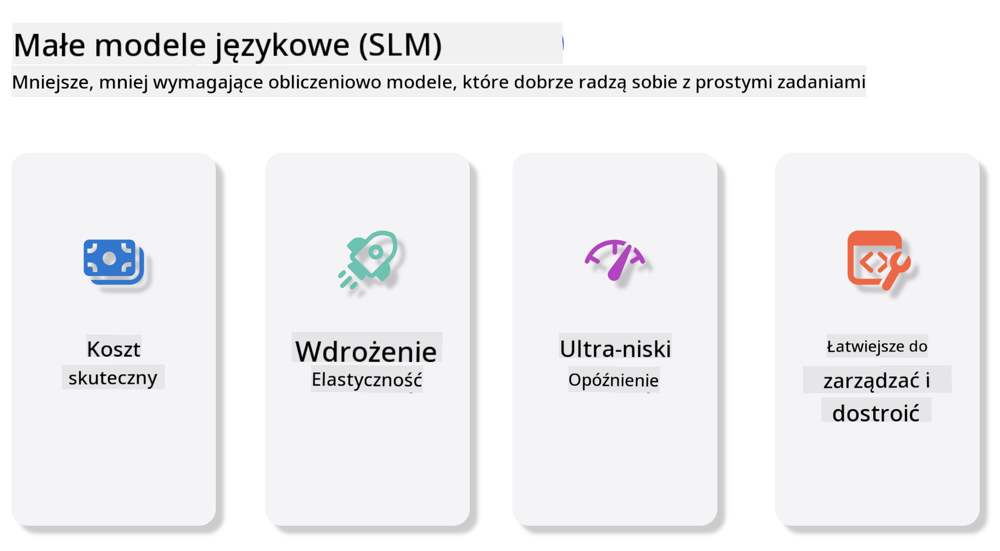
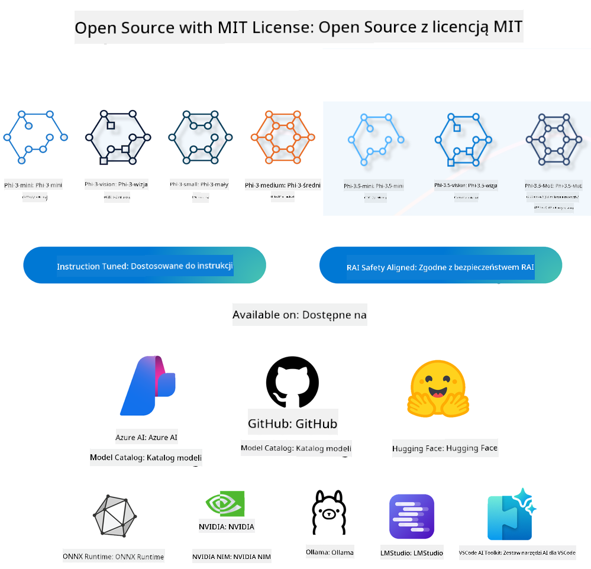
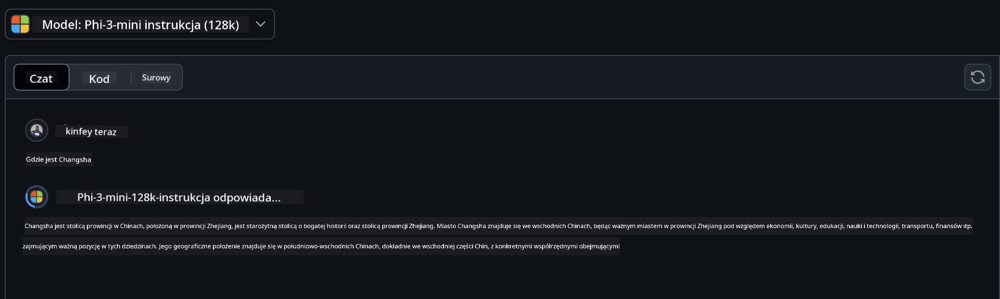
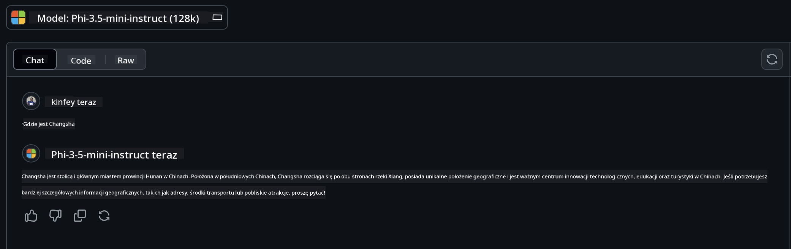

<!--
CO_OP_TRANSLATOR_METADATA:
{
  "original_hash": "124ad36cfe96f74038811b6e2bb93e9d",
  "translation_date": "2025-05-20T09:47:27+00:00",
  "source_file": "19-slm/README.md",
  "language_code": "pl"
}
-->
# Wprowadzenie do małych modeli językowych dla generatywnej AI dla początkujących Generatywna AI to fascynujące pole sztucznej inteligencji, które koncentruje się na tworzeniu systemów zdolnych do generowania nowej treści. Ta treść może obejmować tekst i obrazy, muzykę, a nawet całe wirtualne środowiska. Jednym z najbardziej ekscytujących zastosowań generatywnej AI jest obszar modeli językowych. ## Czym są małe modele językowe? Mały model językowy (SLM) reprezentuje zmniejszoną wersję dużego modelu językowego (LLM), wykorzystując wiele zasad architektonicznych i technik LLM, jednocześnie wykazując znacznie zmniejszone obciążenie obliczeniowe. SLM są podzbiorem modeli językowych zaprojektowanych do generowania tekstu przypominającego ludzki. W przeciwieństwie do swoich większych odpowiedników, takich jak GPT-4, SLM są bardziej kompaktowe i wydajne, co czyni je idealnymi dla zastosowań, gdzie zasoby obliczeniowe są ograniczone. Pomimo mniejszego rozmiaru, nadal mogą wykonywać różnorodne zadania. Zazwyczaj SLM są konstruowane poprzez kompresję lub destylację LLM, mając na celu zachowanie znacznej części funkcjonalności i zdolności językowych pierwotnego modelu. To zmniejszenie rozmiaru modelu zmniejsza ogólną złożoność, czyniąc SLM bardziej efektywnymi pod względem zarówno użycia pamięci, jak i wymagań obliczeniowych. Pomimo tych optymalizacji, SLM mogą nadal wykonywać szeroki zakres zadań przetwarzania języka naturalnego (NLP): - Generowanie tekstu: Tworzenie spójnych i kontekstowo odpowiednich zdań lub akapitów. - Uzupełnianie tekstu: Przewidywanie i uzupełnianie zdań na podstawie podanego promptu. - Tłumaczenie: Konwersja tekstu z jednego języka na inny. - Podsumowanie: Skracanie długich fragmentów tekstu do krótszych, bardziej przystępnych podsumowań. Chociaż z pewnymi kompromisami w wydajności lub głębokości zrozumienia w porównaniu do ich większych odpowiedników. ## Jak działają małe modele językowe? SLM są trenowane na ogromnych ilościach danych tekstowych. Podczas treningu uczą się wzorców i struktur języka, co pozwala im generować tekst, który jest zarówno gramatycznie poprawny, jak i kontekstowo odpowiedni. Proces treningu obejmuje: - Zbieranie danych: Gromadzenie dużych zbiorów danych tekstowych z różnych źródeł. - Przetwarzanie wstępne: Czyszczenie i organizowanie danych, aby były odpowiednie do treningu. - Trening: Wykorzystanie algorytmów uczenia maszynowego do nauczania modelu, jak rozumieć i generować tekst. - Dopasowywanie: Dostosowywanie modelu w celu poprawy jego wydajności w określonych zadaniach. Rozwój SLM jest zgodny z rosnącą potrzebą modeli, które mogą być wdrażane w środowiskach o ograniczonych zasobach, takich jak urządzenia mobilne czy platformy edge computing, gdzie pełnoskalowe LLM mogą być niepraktyczne ze względu na ich duże wymagania zasobowe. Koncentrując się na efektywności, SLM równoważą wydajność z dostępnością, umożliwiając szersze zastosowanie w różnych dziedzinach.  ## Cele nauki W tej lekcji mamy nadzieję wprowadzić wiedzę o SLM i połączyć ją z Microsoft Phi-3, aby nauczyć się różnych scenariuszy w treści tekstowej, wizji i MoE. Pod koniec tej lekcji powinieneś być w stanie odpowiedzieć na następujące pytania: - Co to jest SLM - Jaka jest różnica między SLM a LLM - Co to jest rodzina Microsoft Phi-3/3.5 - Jak wnioskować rodzinę Microsoft Phi-3/3.5 Gotowy? Zaczynajmy. ## Różnice między dużymi modelami językowymi (LLM) a małymi modelami językowymi (SLM) Zarówno LLM, jak i SLM są oparte na podstawowych zasadach probabilistycznego uczenia maszynowego, stosując podobne podejścia w projektowaniu architektonicznym, metodach treningu, procesach generowania danych i technikach oceny modeli. Jednak kilka kluczowych czynników różni te dwa typy modeli. ## Zastosowania małych modeli językowych SLM mają szeroki zakres zastosowań, w tym: - Chatboty: Zapewnianie wsparcia klienta i angażowanie użytkowników w sposób konwersacyjny. - Tworzenie treści: Pomoc pisarzom w generowaniu pomysłów lub nawet pisaniu całych artykułów. - Edukacja: Pomoc uczniom w pisaniu zadań lub nauce nowych języków. - Dostępność: Tworzenie narzędzi dla osób z niepełnosprawnościami, takich jak systemy tekst-na-mowę. **Rozmiar** Główną różnicą między LLM a SLM jest skala modeli. LLM, takie jak ChatGPT (GPT-4), mogą składać się z szacowanych 1,76 biliona parametrów, podczas gdy otwartoźródłowe SLM, takie jak Mistral 7B, są zaprojektowane z znacznie mniejszą liczbą parametrów — około 7 miliardów. Ta różnica wynika głównie z różnic w architekturze modelu i procesach treningowych. Na przykład ChatGPT wykorzystuje mechanizm samouważności w ramach kodera-dekodera, podczas gdy Mistral 7B używa uwagi okna przesuwnego, co umożliwia bardziej efektywny trening w modelu tylko dekodera. Ta różnica architektoniczna ma głębokie implikacje dla złożoności i wydajności tych modeli. **Zrozumienie** SLM są zazwyczaj optymalizowane pod kątem wydajności w określonych dziedzinach, co czyni je wysoce wyspecjalizowanymi, ale potencjalnie ograniczonymi w zdolności do zapewnienia szerokiego zrozumienia kontekstowego w wielu dziedzinach wiedzy. W przeciwieństwie do tego, LLM dążą do symulowania inteligencji przypominającej ludzką na bardziej kompleksowym poziomie. Trenowane na ogromnych, zróżnicowanych zbiorach danych, LLM są zaprojektowane do dobrze radzenia sobie w różnych dziedzinach, oferując większą wszechstronność i adaptacyjność. W rezultacie LLM są bardziej odpowiednie dla szerszego zakresu zadań downstream, takich jak przetwarzanie języka naturalnego i programowanie. **Obliczenia** Trening i wdrożenie LLM to procesy intensywne pod względem zasobów, często wymagające znacznej infrastruktury obliczeniowej, w tym dużych klastrów GPU. Na przykład, trening modelu takiego jak ChatGPT od zera może wymagać tysięcy GPU przez dłuższe okresy. W przeciwieństwie do tego, SLM, z mniejszą liczbą parametrów, są bardziej dostępne pod względem zasobów obliczeniowych. Modele takie jak Mistral 7B mogą być trenowane i uruchamiane na lokalnych maszynach wyposażonych w umiarkowane możliwości GPU, chociaż trening nadal wymaga kilku godzin na wielu GPU. **Stronniczość** Stronniczość jest znanym problemem w LLM, głównie ze względu na charakter danych treningowych. Modele te często polegają na surowych, otwarcie dostępnych danych z internetu, które mogą niedostatecznie reprezentować lub błędnie przedstawiać niektóre grupy, wprowadzać błędne etykietowanie lub odzwierciedlać stronniczość językową wpływającą na dialekt, wariacje geograficzne i zasady gramatyczne. Dodatkowo, złożoność architektury LLM może nieumyślnie pogłębiać stronniczość, która może pozostać niezauważona bez starannego dostosowywania. Z drugiej strony, SLM, będąc trenowane na bardziej ograniczonych, specyficznych dla dziedziny zbiorach danych, są z natury mniej podatne na takie stronniczości, chociaż nie są na nie odporne. **Wnioskowanie** Zmniejszony rozmiar SLM daje im znaczną przewagę pod względem szybkości wnioskowania, pozwalając na efektywne generowanie wyników na lokalnym sprzęcie bez potrzeby rozległego przetwarzania równoległego. W przeciwieństwie do tego, LLM, ze względu na swój rozmiar i złożoność, często wymagają znacznych zasobów obliczeniowych równoległych, aby osiągnąć akceptowalne czasy wnioskowania. Obecność wielu jednoczesnych użytkowników dodatkowo spowalnia czas odpowiedzi LLM, zwłaszcza gdy są wdrażane na dużą skalę. Podsumowując, choć zarówno LLM, jak i SLM dzielą podstawę w uczeniu maszynowym, znacznie różnią się pod względem rozmiaru modelu, wymagań zasobowych, zrozumienia kontekstowego, podatności na stronniczość i szybkości wnioskowania. Te różnice odzwierciedlają ich odpowiednią przydatność do różnych zastosowań, z LLM będącymi bardziej wszechstronnymi, ale wymagającymi zasobów, a SLM oferującymi bardziej specyficzną dla dziedziny efektywność z zmniejszonymi wymaganiami obliczeniowymi. ***Uwaga: W tym rozdziale wprowadzimy SLM, używając Microsoft Phi-3 / 3.5 jako przykład.*** ## Wprowadzenie rodziny Phi-3 / Phi-3.5 Rodzina Phi-3 / 3.5 głównie koncentruje się na scenariuszach aplikacyjnych dotyczących tekstu, wizji i Agenta (MoE): ### Phi-3 / 3.5 Instrukcja Głównie do generowania tekstu, uzupełniania czatu i ekstrakcji informacji z treści, itp. **Phi-3-mini** Model językowy 3.8B jest dostępny w Microsoft Azure AI Studio, Hugging Face i Ollama. Modele Phi-3 znacznie przewyższają modele językowe o równych i większych rozmiarach na kluczowych benchmarkach (patrz poniżej liczby benchmarków, wyższe liczby są lepsze). Phi-3-mini przewyższa modele dwa razy większe, podczas gdy Phi-3-small i Phi-3-medium przewyższają większe modele, w tym GPT-3.5 **Phi-3-small & medium** Z zaledwie 7B parametrów, Phi-3-small pokonuje GPT-3.5T na różnych benchmarkach językowych, logicznych, kodowania i matematycznych. Phi-3-medium z 14B parametrów kontynuuje ten trend i przewyższa Gemini 1.0 Pro. **Phi-3.5-mini** Możemy go traktować jako ulepszenie Phi-3-mini. Chociaż liczba parametrów pozostaje niezmieniona, poprawia zdolność do obsługi wielu języków (obsługa 20+ języków: arabski, chiński, czeski, duński, holenderski, angielski, fiński, francuski, niemiecki, hebrajski, węgierski, włoski, japoński, koreański, norweski, polski, portugalski, rosyjski, hiszpański, szwedzki, tajski, turecki, ukraiński) i dodaje silniejsze wsparcie dla długiego kontekstu. Phi-3.5-mini z 3.8B parametrów przewyższa modele językowe o tym samym rozmiarze i jest na równi z modelami dwa razy większymi. ### Phi-3 / 3.5 Wizja Możemy traktować model instrukcji Phi-3/3.5 jako zdolność Phi do rozumienia, a Wizja to to, co daje Phi oczy do zrozumienia świata. **Phi-3-Wizja** Phi-3-wizja, z zaledwie 4.2B parametrów, kontynuuje ten trend i przewyższa większe modele, takie jak Claude-3 Haiku i Gemini 1.0 Pro V w ogólnych zadaniach rozumowania wizualnego, OCR i zrozumieniu tabel i diagramów. **Phi-3.5-Wizja** Phi-3.5-Wizja jest również ulepszeniem Phi-3-Wizja, dodając obsługę wielu obrazów. Możesz traktować to jako poprawę wizji, nie tylko możesz zobaczyć zdjęcia, ale także filmy. Phi-3.5-wizja przewyższa większe modele, takie jak Claude-3.5 Sonnet i Gemini 1.5 Flash w zadaniach zrozumienia OCR, tabel i wykresów oraz na równi w ogólnych zadaniach rozumowania wiedzy wizualnej. Obsługa wejścia wieloklatkowego, tj. wykonywanie rozumowania na wielu obrazach wejściowych ### Phi-3.5-MoE ***Mieszanka ekspertów (MoE)*** umożliwia modelom być wstępnie trenowanymi z znacznie mniejszymi zasobami obliczeniowymi, co oznacza, że możesz znacznie zwiększyć rozmiar modelu lub zbioru danych przy tym samym budżecie obliczeniowym co model gęsty. W szczególności, model MoE powinien osiągnąć tę samą jakość co jego gęsty odpowiednik znacznie szybciej podczas wstępnego treningu. Phi-3.5-MoE składa się z 16x3.8B modułów eksperckich. Phi-3.5-MoE z zaledwie 6.6B aktywnych parametrów osiąga podobny poziom rozumowania, zrozumienia języka i matematyki co znacznie większe modele Możemy używać modelu rodziny Phi-3/3.5 na podstawie różnych scenariuszy. W przeciwieństwie do LLM, możesz wdrożyć Phi-3/3.5-mini lub Phi-3/3.5-Wizja na urządzeniach edge. ## Jak używać modeli rodziny Phi-3/3.5 Mamy nadzieję używać Phi-3/3.5 w różnych scenariuszach. Następnie użyjemy Phi-3/3.5 na podstawie różnych scenariuszy.  ### Różnica wnioskowania API Chmury **Modele GitHub** GitHub
Modele to najbardziej bezpośredni sposób. Możesz szybko uzyskać dostęp do modelu Phi-3/3.5-Instruct poprzez GitHub Models. W połączeniu z Azure AI Inference SDK / OpenAI SDK, możesz uzyskać dostęp do API poprzez kod, aby wykonać wywołanie Phi-3/3.5-Instruct. Możesz również testować różne efekty poprzez Playground. - Demo: Porównanie efektów Phi-3-mini i Phi-3.5-mini w chińskich scenariuszach   **Azure AI Studio** Lub jeśli chcemy używać modeli vision i MoE, możemy użyć Azure AI Studio, aby wykonać wywołanie. Jeśli jesteś zainteresowany, możesz przeczytać Phi-3 Cookbook, aby dowiedzieć się, jak wywołać Phi-3/3.5 Instruct, Vision, MoE poprzez Azure AI Studio [Kliknij ten link](https://github.com/microsoft/Phi-3CookBook/blob/main/md/02.QuickStart/AzureAIStudio_QuickStart.md?WT.mc_id=academic-105485-koreyst) **NVIDIA NIM** Oprócz rozwiązań katalogu modeli opartych na chmurze dostarczanych przez Azure i GitHub, możesz również użyć [Nivida NIM](https://developer.nvidia.com/nim?WT.mc_id=academic-105485-koreyst) do wykonania powiązanych wywołań. Możesz odwiedzić NIVIDA NIM, aby wykonać wywołania API rodziny Phi-3/3.5. NVIDIA NIM (NVIDIA Inference Microservices) to zestaw przyspieszonych mikrousług inferencyjnych zaprojektowanych, aby pomóc deweloperom w efektywnym wdrażaniu modeli AI w różnych środowiskach, w tym w chmurach, centrach danych i stacjach roboczych. Oto kilka kluczowych cech NVIDIA NIM: - **Łatwość wdrażania:** NIM pozwala na wdrażanie modeli AI za pomocą jednego polecenia, co ułatwia integrację z istniejącymi przepływami pracy. - **Optymalna wydajność:** Wykorzystuje wstępnie zoptymalizowane silniki inferencyjne NVIDIA, takie jak TensorRT i TensorRT-LLM, aby zapewnić niską latencję i wysoką przepustowość. - **Skalowalność:** NIM obsługuje autoskalowanie na Kubernetes, co pozwala na efektywne zarządzanie zmiennym obciążeniem. - **Bezpieczeństwo i kontrola:** Organizacje mogą utrzymywać kontrolę nad swoimi danymi i aplikacjami, hostując mikrousługi NIM na własnej zarządzanej infrastrukturze. - **Standardowe API:** NIM zapewnia standardowe w branży API, co ułatwia budowę i integrację aplikacji AI, takich jak chatboty, asystenci AI i inne. NIM jest częścią NVIDIA AI Enterprise, które ma na celu uproszczenie wdrażania i operacjonalizacji modeli AI, zapewniając ich efektywne działanie na GPU NVIDIA. - Demo: Użycie Nividia NIM do wywołania Phi-3.5-Vision-API [[Kliknij ten link](../../../19-slm/python/Phi-3-Vision-Nividia-NIM.ipynb)] ### Inference Phi-3/3.5 w lokalnym środowisku Inference w odniesieniu do Phi-3 lub dowolnego modelu językowego, takiego jak GPT-3, odnosi się do procesu generowania odpowiedzi lub przewidywań na podstawie otrzymanego wejścia. Gdy podajesz zapytanie lub pytanie do Phi-3, wykorzystuje ono swoją wytrenowaną sieć neuronową, aby wnioskować najbardziej prawdopodobną i odpowiednią odpowiedź, analizując wzorce i relacje w danych, na których zostało wytrenowane. **Hugging Face Transformer** Hugging Face Transformers to potężna biblioteka zaprojektowana do przetwarzania języka naturalnego (NLP) i innych zadań uczenia maszynowego. Oto kilka kluczowych punktów na jej temat: 1. **Modele wstępnie wytrenowane**: Oferuje tysiące wstępnie wytrenowanych modeli, które można wykorzystać do różnych zadań, takich jak klasyfikacja tekstu, rozpoznawanie nazwanych jednostek, odpowiadanie na pytania, streszczanie, tłumaczenie i generowanie tekstu. 2. **Interoperacyjność frameworków**: Biblioteka obsługuje wiele frameworków uczenia głębokiego, w tym PyTorch, TensorFlow i JAX. Pozwala to na trenowanie modelu w jednym frameworku i użycie go w innym. 3. **Możliwości multimodalne**: Oprócz NLP, Hugging Face Transformers obsługuje również zadania w dziedzinie wizji komputerowej (np. klasyfikacja obrazów, wykrywanie obiektów) i przetwarzania dźwięku (np. rozpoznawanie mowy, klasyfikacja dźwięku). 4. **Łatwość użycia**: Biblioteka oferuje API i narzędzia do łatwego pobierania i dostrajania modeli, co czyni ją dostępną zarówno dla początkujących, jak i ekspertów. 5. **Społeczność i zasoby**: Hugging Face ma żywą społeczność oraz obszerne dokumentacje, samouczki i przewodniki, które pomagają użytkownikom rozpocząć pracę i w pełni wykorzystać możliwości biblioteki. [oficjalna dokumentacja](https://huggingface.co/docs/transformers/index?WT.mc_id=academic-105485-koreyst) lub ich [repozytorium GitHub](https://github.com/huggingface/transformers?WT.mc_id=academic-105485-koreyst). Jest to najczęściej stosowana metoda, ale wymaga również przyspieszenia GPU. W końcu sceny takie jak Vision i MoE wymagają wielu obliczeń, które będą bardzo ograniczone na CPU, jeśli nie zostaną zkwantyzowane. - Demo: Użycie Transformera do wywołania Phi-3.5-Instuct [Kliknij ten link](../../../19-slm/python/phi35-instruct-demo.ipynb) - Demo: Użycie Transformera do wywołania Phi-3.5-Vision[Kliknij ten link](../../../19-slm/python/phi35-vision-demo.ipynb) - Demo: Użycie Transformera do wywołania Phi-3.5-MoE[Kliknij ten link](../../../19-slm/python/phi35_moe_demo.ipynb) **Ollama** [Ollama](https://ollama.com/?WT.mc_id=academic-105485-koreyst) to platforma zaprojektowana w celu ułatwienia uruchamiania dużych modeli językowych (LLM) lokalnie na Twoim komputerze. Obsługuje różne modele, takie jak Llama 3.1, Phi 3, Mistral i Gemma 2, między innymi. Platforma upraszcza proces, łącząc wagi modelu, konfigurację i dane w jeden pakiet, co czyni ją bardziej dostępną dla użytkowników, którzy chcą dostosować i tworzyć własne modele. Ollama jest dostępna dla macOS, Linux i Windows. Jest to doskonałe narzędzie, jeśli chcesz eksperymentować lub wdrażać LLM bez polegania na usługach w chmurze. Ollama to najbardziej bezpośredni sposób, wystarczy wykonać następujące polecenie. ```bash

ollama run phi3.5

``` **ONNX Runtime for GenAI** [ONNX Runtime](https://github.com/microsoft/onnxruntime-genai?WT.mc_id=academic-105485-koreyst) to międzyplatformowy akcelerator wnioskowania i treningu maszynowego. ONNX Runtime for Generative AI (GENAI) to potężne narzędzie, które pomaga w efektywnym uruchamianiu modeli generatywnych AI na różnych platformach. ## Co to jest ONNX Runtime? ONNX Runtime to projekt open-source, który umożliwia wysokowydajne wnioskowanie modeli uczenia maszynowego. Obsługuje modele w formacie Open Neural Network Exchange (ONNX), który jest standardem reprezentacji modeli uczenia maszynowego. Wnioskowanie ONNX Runtime może umożliwić szybsze doświadczenia klienta i niższe koszty, obsługując modele z frameworków głębokiego uczenia, takich jak PyTorch i TensorFlow/Keras, a także klasyczne biblioteki uczenia maszynowego, takie jak scikit-learn, LightGBM, XGBoost itp. ONNX Runtime jest kompatybilny z różnym sprzętem, sterownikami i systemami operacyjnymi oraz zapewnia optymalną wydajność, wykorzystując akceleratory sprzętowe tam, gdzie to możliwe, obok optymalizacji grafów i transformacji ## Co to jest Generative AI? Generative AI odnosi się do systemów AI, które mogą generować nową treść, taką jak tekst, obrazy lub muzyka, na podstawie danych, na których zostały wytrenowane. Przykłady to modele językowe, takie jak GPT-3, i modele generowania obrazów, takie jak Stable Diffusion. Biblioteka ONNX Runtime for GenAI zapewnia pętlę generatywną AI dla modeli ONNX, w tym wnioskowanie z ONNX Runtime, przetwarzanie logitów, wyszukiwanie i próbkowanie oraz zarządzanie pamięcią podręczną KV. ## ONNX Runtime for GENAI ONNX Runtime for GENAI rozszerza możliwości ONNX Runtime, aby obsługiwać modele generatywne AI. Oto kilka kluczowych cech: - **Szerokie wsparcie platform:** Działa na różnych platformach, w tym Windows, Linux, macOS, Android i iOS. - **Wsparcie modeli:** Obsługuje wiele popularnych modeli generatywnych AI, takich jak LLaMA, GPT-Neo, BLOOM i inne. - **Optymalizacja wydajności:** Zawiera optymalizacje dla różnych akceleratorów sprzętowych, takich jak GPU NVIDIA, GPU AMD i inne. - **Łatwość użycia:** Zapewnia API do łatwej integracji z aplikacjami, umożliwiając generowanie tekstu, obrazów i innych treści przy minimalnym kodzie - Użytkownicy mogą wywołać metodę generate() na wysokim poziomie lub uruchomić każdą iterację modelu w pętli, generując jeden token na raz i opcjonalnie aktualizując parametry generacji w pętli. - ONNX Runtime obsługuje również wyszukiwanie zachłanne/balansujące i próbkowanie TopP, TopK do generowania sekwencji tokenów oraz wbudowane przetwarzanie logitów, takie jak kary za powtórzenia. Możesz również łatwo dodać niestandardowe ocenianie. ## Rozpoczęcie Aby rozpocząć pracę z ONNX Runtime for GENAI, możesz postępować zgodnie z tymi krokami: ### Zainstaluj ONNX Runtime: ```Python
pip install onnxruntime
``` ### Zainstaluj rozszerzenia Generative AI: ```Python
pip install onnxruntime-genai
``` ### Uruchom model: Oto prosty przykład w Pythonie: ```Python
import onnxruntime_genai as og

model = og.Model('path_to_your_model.onnx')

tokenizer = og.Tokenizer(model)

input_text = "Hello, how are you?"

input_tokens = tokenizer.encode(input_text)

output_tokens = model.generate(input_tokens)

output_text = tokenizer.decode(output_tokens)

print(output_text) 
``` ### Demo: Użycie ONNX Runtime GenAI do wywołania Phi-3.5-Vision ```python

import onnxruntime_genai as og

model_path = './Your Phi-3.5-vision-instruct ONNX Path'

img_path = './Your Image Path'

model = og.Model(model_path)

processor = model.create_multimodal_processor()

tokenizer_stream = processor.create_stream()

text = "Your Prompt"

prompt = "<|user|>\n"

prompt += "<|image_1|>\n"

prompt += f"{text}<|end|>\n"

prompt += "<|assistant|>\n"

image = og.Images.open(img_path)

inputs = processor(prompt, images=image)

params = og.GeneratorParams(model)

params.set_inputs(inputs)

params.set_search_options(max_length=3072)

generator = og.Generator(model, params)

while not generator.is_done():

    generator.compute_logits()
    
    generator.generate_next_token()

    new_token = generator.get_next_tokens()[0]
    
    code += tokenizer_stream.decode(new_token)
    
    print(tokenizer_stream.decode(new_token), end='', flush=True)

``` **Inne** Oprócz metod referencyjnych ONNX Runtime i Ollama, możemy również ukończyć referencję modeli ilościowych na podstawie metod referencyjnych modeli dostarczanych przez różnych producentów. Takie jak Apple MLX framework z Apple Metal, Qualcomm QNN z NPU, Intel OpenVINO z CPU/GPU itp. Możesz również uzyskać więcej treści z [Phi-3 Cookbook](https://github.com/microsoft/phi-3cookbook?WT.mc_id=academic-105485-koreyst) ## Więcej Poznaliśmy podstawy rodziny Phi-3/3.5, ale aby dowiedzieć się więcej o SLM, potrzebujemy więcej wiedzy. Możesz znaleźć odpowiedzi w Phi-3 Cookbook. Jeśli chcesz dowiedzieć się więcej, odwiedź [Phi-3 Cookbook](https://github.com/microsoft/phi-3cookbook?WT.mc_id=academic-105485-koreyst).

**Zastrzeżenie**:  
Ten dokument został przetłumaczony przy użyciu usługi tłumaczenia AI [Co-op Translator](https://github.com/Azure/co-op-translator). Choć staramy się zapewnić dokładność, prosimy pamiętać, że automatyczne tłumaczenia mogą zawierać błędy lub nieścisłości. Oryginalny dokument w jego rodzimym języku powinien być uznawany za autorytatywne źródło. W przypadku istotnych informacji zaleca się profesjonalne tłumaczenie przez człowieka. Nie ponosimy odpowiedzialności za wszelkie nieporozumienia lub błędne interpretacje wynikające z użycia tego tłumaczenia.