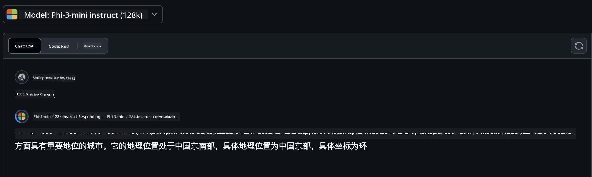
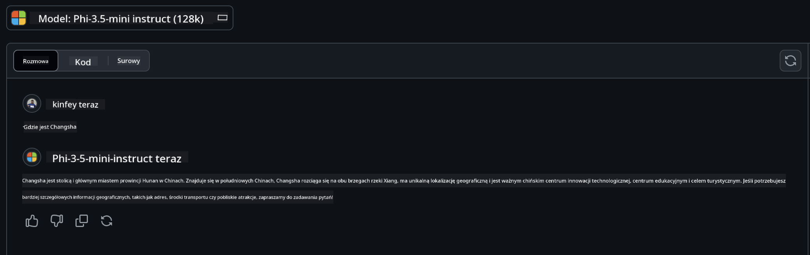

<!--
CO_OP_TRANSLATOR_METADATA:
{
  "original_hash": "124ad36cfe96f74038811b6e2bb93e9d",
  "translation_date": "2025-06-26T02:12:06+00:00",
  "source_file": "19-slm/README.md",
  "language_code": "pl"
}
-->

Model to najbardziej bezpośredni sposób. Możesz szybko uzyskać dostęp do modelu Phi-3/3.5-Instruct poprzez GitHub Models. W połączeniu z Azure AI Inference SDK / OpenAI SDK możesz uzyskać dostęp do API poprzez kod, aby ukończyć wywołanie Phi-3/3.5-Instruct. Możesz także przetestować różne efekty poprzez Playground. - Demo: Porównanie efektów Phi-3-mini i Phi-3.5-mini w chińskich scenariuszach   **Azure AI Studio** Jeśli chcemy używać modeli wizji i MoE, możemy użyć Azure AI Studio do ukończenia wywołania. Jeśli jesteś zainteresowany, możesz przeczytać Phi-3 Cookbook, aby dowiedzieć się, jak wywołać Phi-3/3.5 Instruct, Vision, MoE poprzez Azure AI Studio [Kliknij ten link](https://github.com/microsoft/Phi-3CookBook/blob/main/md/02.QuickStart/AzureAIStudio_QuickStart.md?WT.mc_id=academic-105485-koreyst) **NVIDIA NIM** Oprócz rozwiązań katalogu modeli w chmurze oferowanych przez Azure i GitHub, możesz również użyć [Nivida NIM](https://developer.nvidia.com/nim?WT.mc_id=academic-105485-koreyst) do ukończenia powiązanych wywołań. Możesz odwiedzić NIVIDA NIM, aby ukończyć wywołania API rodziny Phi-3/3.5. NVIDIA NIM (NVIDIA Inference Microservices) to zestaw przyspieszonych mikrousług inferencyjnych zaprojektowanych, aby pomóc deweloperom w efektywnym wdrażaniu modeli AI w różnych środowiskach, w tym chmurach, centrach danych i stacjach roboczych. Oto kilka kluczowych cech NVIDIA NIM: - **Łatwość wdrożenia:** NIM pozwala na wdrożenie modeli AI za pomocą jednego polecenia, co ułatwia integrację z istniejącymi procesami pracy. - **Optymalizacja wydajności:** Wykorzystuje pre-optymalizowane silniki inferencyjne NVIDIA, takie jak TensorRT i TensorRT-LLM, aby zapewnić niską latencję i wysoką przepustowość. - **Skalowalność:** NIM obsługuje automatyczne skalowanie na Kubernetes, umożliwiając skuteczne zarządzanie zmiennymi obciążeniami. - **Bezpieczeństwo i kontrola:** Organizacje mogą zachować kontrolę nad swoimi danymi i aplikacjami poprzez samodzielne hostowanie mikrousług NIM na własnej zarządzanej infrastrukturze. - **Standardowe API:** NIM dostarcza standardowe API branżowe, co ułatwia budowanie i integrację aplikacji AI, takich jak chatboty, asystenci AI i inne. NIM jest częścią NVIDIA AI Enterprise, które ma na celu uproszczenie wdrożenia i operacjonalizacji modeli AI, zapewniając ich efektywne działanie na GPU NVIDIA. - Demo: Użycie Nividia NIM do wywołania Phi-3.5-Vision-API [[Kliknij ten link](../../../19-slm/python/Phi-3-Vision-Nividia-NIM.ipynb)] ### Inferencja Phi-3/3.5 w lokalnym środowisku Inferencja w odniesieniu do Phi-3 lub jakiegokolwiek modelu językowego, takiego jak GPT-3, odnosi się do procesu generowania odpowiedzi lub prognoz na podstawie otrzymanego wejścia. Kiedy podajesz pytanie lub zapytanie do Phi-3, używa on swojej wytrenowanej sieci neuronowej, aby wywnioskować najbardziej prawdopodobną i odpowiednią odpowiedź, analizując wzorce i relacje w danych, na których został wytrenowany. **Hugging Face Transformer** Hugging Face Transformers to potężna biblioteka zaprojektowana do przetwarzania języka naturalnego (NLP) i innych zadań związanych z uczeniem maszynowym. Oto kilka kluczowych punktów na jej temat: 1. **Modele wytrenowane:** Oferuje tysiące wytrenowanych modeli, które można używać do różnych zadań, takich jak klasyfikacja tekstu, rozpoznawanie nazwanych encji, odpowiadanie na pytania, podsumowywanie, tłumaczenie i generowanie tekstu. 2. **Interoperacyjność frameworków:** Biblioteka obsługuje wiele frameworków głębokiego uczenia, w tym PyTorch, TensorFlow i JAX. Pozwala to na wytrenowanie modelu w jednym frameworku i użycie go w innym. 3. **Zdolności multimodalne:** Oprócz NLP, Hugging Face Transformers obsługuje również zadania w zakresie wizji komputerowej (np. klasyfikacja obrazów, wykrywanie obiektów) i przetwarzania dźwięku (np. rozpoznawanie mowy, klasyfikacja dźwięku). 4. **Łatwość użycia:** Biblioteka oferuje API i narzędzia do łatwego pobierania i dostrajania modeli, co sprawia, że jest dostępna zarówno dla początkujących, jak i ekspertów. 5. **Społeczność i zasoby:** Hugging Face ma żywą społeczność oraz bogatą dokumentację, tutoriale i przewodniki, które pomagają użytkownikom rozpocząć pracę i w pełni wykorzystać bibliotekę. [oficjalna dokumentacja](https://huggingface.co/docs/transformers/index?WT.mc_id=academic-105485-koreyst) lub ich [repozytorium GitHub](https://github.com/huggingface/transformers?WT.mc_id=academic-105485-koreyst). To najczęściej używana metoda, ale wymaga również akceleracji GPU. W końcu sceny takie jak Vision i MoE wymagają wielu obliczeń, które będą bardzo ograniczone na CPU, jeśli nie zostaną zkwantyzowane. - Demo: Użycie Transformera do wywołania Phi-3.5-Instuct [Kliknij ten link](../../../19-slm/python/phi35-instruct-demo.ipynb) - Demo: Użycie Transformera do wywołania Phi-3.5-Vision [Kliknij ten link](../../../19-slm/python/phi35-vision-demo.ipynb) - Demo: Użycie Transformera do wywołania Phi-3.5-MoE [Kliknij ten link](../../../19-slm/python/phi35_moe_demo.ipynb) **Ollama** [Ollama](https://ollama.com/?WT.mc_id=academic-105485-koreyst) to platforma zaprojektowana, aby ułatwić uruchamianie dużych modeli językowych (LLM) lokalnie na Twoim komputerze. Obsługuje różne modele, takie jak Llama 3.1, Phi 3, Mistral i Gemma 2, między innymi. Platforma upraszcza proces, łącząc wagi modelu, konfigurację i dane w jeden pakiet, co sprawia, że jest bardziej dostępna dla użytkowników do dostosowywania i tworzenia własnych modeli. Ollama jest dostępna dla macOS, Linux i Windows. To świetne narzędzie, jeśli chcesz eksperymentować lub wdrażać LLM bez polegania na usługach chmurowych. Ollama to najbardziej bezpośredni sposób, wystarczy wykonać następujące polecenie. ```bash

ollama run phi3.5

``` **ONNX Runtime for GenAI** [ONNX Runtime](https://github.com/microsoft/onnxruntime-genai?WT.mc_id=academic-105485-koreyst) to platformowy akcelerator inferencji i treningu maszynowego. ONNX Runtime dla Generative AI (GENAI) to potężne narzędzie, które pomaga efektywnie uruchamiać modele generatywne AI na różnych platformach. ## Czym jest ONNX Runtime? ONNX Runtime to projekt open-source, który umożliwia wysokowydajną inferencję modeli uczenia maszynowego. Obsługuje modele w formacie Open Neural Network Exchange (ONNX), który jest standardem reprezentacji modeli uczenia maszynowego. Inferencja ONNX Runtime może umożliwić szybsze doświadczenia klientów i niższe koszty, obsługując modele z frameworków głębokiego uczenia, takich jak PyTorch i TensorFlow/Keras, a także klasyczne biblioteki uczenia maszynowego, takie jak scikit-learn, LightGBM, XGBoost, itp. ONNX Runtime jest kompatybilny z różnym sprzętem, sterownikami i systemami operacyjnymi, i zapewnia optymalną wydajność poprzez wykorzystanie akceleratorów sprzętowych tam, gdzie to możliwe, wraz z optymalizacjami grafu i transformacjami ## Czym jest Generative AI? Generative AI odnosi się do systemów AI, które mogą generować nową zawartość, taką jak tekst, obrazy lub muzyka, na podstawie danych, na których zostały wytrenowane. Przykłady to modele językowe, takie jak GPT-3, i modele generacji obrazów, takie jak Stable Diffusion. Biblioteka ONNX Runtime for GenAI zapewnia pętlę generatywną AI dla modeli ONNX, w tym inferencję z ONNX Runtime, przetwarzanie logitów, wyszukiwanie i próbkowanie oraz zarządzanie pamięcią podręczną KV. ## ONNX Runtime for GENAI ONNX Runtime for GENAI rozszerza możliwości ONNX Runtime, aby wspierać modele generatywne AI. Oto kilka kluczowych cech: - **Szerokie wsparcie platformowe:** Działa na różnych platformach, w tym Windows, Linux, macOS, Android i iOS. - **Wsparcie modelu:** Obsługuje wiele popularnych modeli generatywnych AI, takich jak LLaMA, GPT-Neo, BLOOM i inne. - **Optymalizacja wydajności:** Zawiera optymalizacje dla różnych akceleratorów sprzętowych, takich jak GPU NVIDIA, GPU AMD i inne2. - **Łatwość użycia:** Dostarcza API do łatwej integracji z aplikacjami, umożliwiając generowanie tekstu, obrazów i innych treści przy minimalnym kodzie - Użytkownicy mogą wywołać metodę generate() na wysokim poziomie lub uruchomić każdą iterację modelu w pętli, generując jeden token na raz i opcjonalnie aktualizując parametry generacji wewnątrz pętli. - ONNX runtime ma również wsparcie dla chciwego/beam search i TopP, TopK próbkowania do generowania sekwencji tokenów oraz wbudowanego przetwarzania logitów, jak kary za powtórzenia. Możesz także łatwo dodać własne ocenianie. ## Rozpoczęcie Aby rozpocząć pracę z ONNX Runtime for GENAI, możesz wykonać następujące kroki: ### Zainstaluj ONNX Runtime: ```Python
pip install onnxruntime
``` ### Zainstaluj rozszerzenia AI generatywnego: ```Python
pip install onnxruntime-genai
``` ### Uruchom model: Oto prosty przykład w Pythonie: ```Python
import onnxruntime_genai as og

model = og.Model('path_to_your_model.onnx')

tokenizer = og.Tokenizer(model)

input_text = "Hello, how are you?"

input_tokens = tokenizer.encode(input_text)

output_tokens = model.generate(input_tokens)

output_text = tokenizer.decode(output_tokens)

print(output_text) 
``` ### Demo: Użycie ONNX Runtime GenAI do wywołania Phi-3.5-Vision ```python

import onnxruntime_genai as og

model_path = './Your Phi-3.5-vision-instruct ONNX Path'

img_path = './Your Image Path'

model = og.Model(model_path)

processor = model.create_multimodal_processor()

tokenizer_stream = processor.create_stream()

text = "Your Prompt"

prompt = "<|user|>\n"

prompt += "<|image_1|>\n"

prompt += f"{text}<|end|>\n"

prompt += "<|assistant|>\n"

image = og.Images.open(img_path)

inputs = processor(prompt, images=image)

params = og.GeneratorParams(model)

params.set_inputs(inputs)

params.set_search_options(max_length=3072)

generator = og.Generator(model, params)

while not generator.is_done():

    generator.compute_logits()
    
    generator.generate_next_token()

    new_token = generator.get_next_tokens()[0]
    
    code += tokenizer_stream.decode(new_token)
    
    print(tokenizer_stream.decode(new_token), end='', flush=True)

``` **Inne** Oprócz metod referencyjnych ONNX Runtime i Ollama, możemy również ukończyć referencję modeli ilościowych na podstawie metod referencyjnych modeli dostarczanych przez różnych producentów. Takie jak Apple MLX framework z Apple Metal, Qualcomm QNN z NPU, Intel OpenVINO z CPU/GPU, itp. Możesz także uzyskać więcej treści z [Phi-3 Cookbook](https://github.com/microsoft/phi-3cookbook?WT.mc_id=academic-105485-koreyst) ## Więcej Nauczyliśmy się podstaw rodziny Phi-3/3.5, ale aby dowiedzieć się więcej o SLM, potrzebujemy więcej wiedzy. Odpowiedzi możesz znaleźć w Phi-3 Cookbook. Jeśli chcesz dowiedzieć się więcej, odwiedź [Phi-3 Cookbook](https://github.com/microsoft/phi-3cookbook?WT.mc_id=academic-105485-koreyst).

**Zastrzeżenie**:  
Ten dokument został przetłumaczony przy użyciu usługi tłumaczeniowej AI [Co-op Translator](https://github.com/Azure/co-op-translator). Dokładamy wszelkich starań, aby zapewnić dokładność, jednak prosimy mieć na uwadze, że tłumaczenia automatyczne mogą zawierać błędy lub nieścisłości. Oryginalny dokument w jego rodzimym języku powinien być uznawany za autorytatywne źródło. W przypadku istotnych informacji zalecane jest profesjonalne tłumaczenie przez człowieka. Nie ponosimy odpowiedzialności za wszelkie nieporozumienia lub błędne interpretacje wynikające z korzystania z tego tłumaczenia.