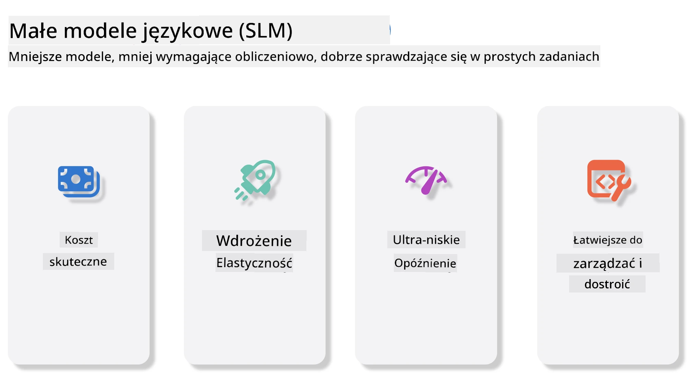
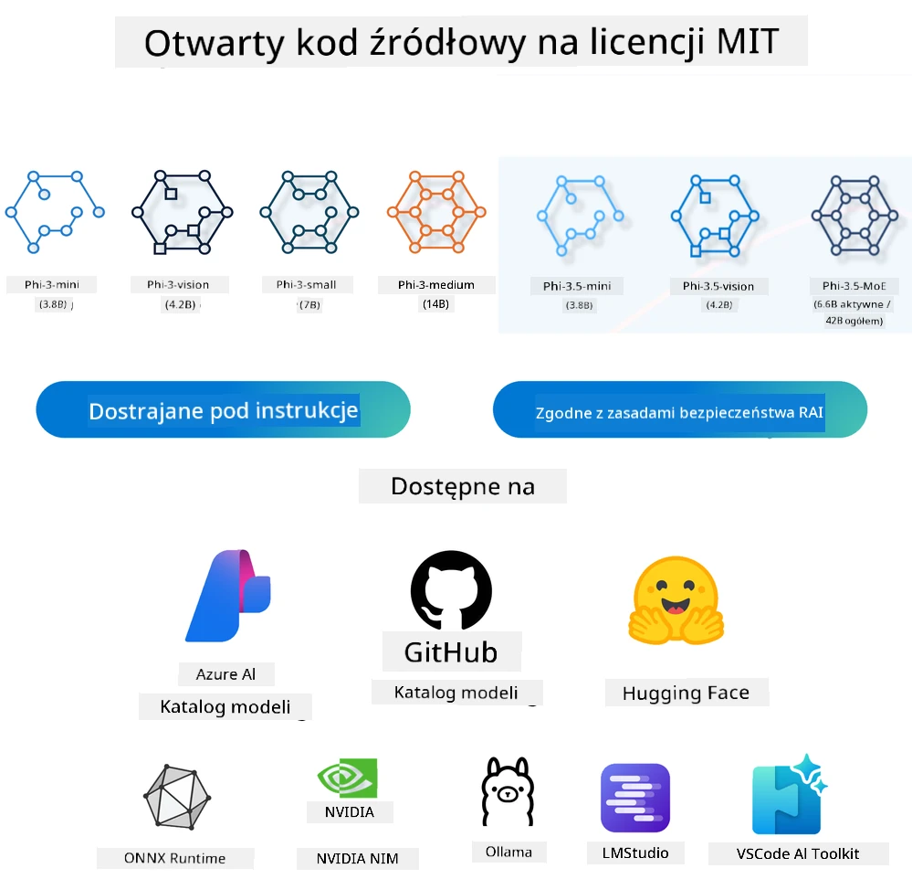
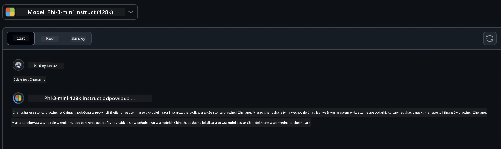
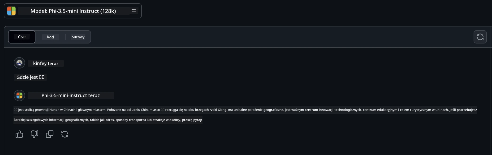

# Wprowadzenie do Małych Modeli Językowych dla Generatywnej AI dla Początkujących
Generatywna AI to fascynująca dziedzina sztucznej inteligencji, która koncentruje się na tworzeniu systemów zdolnych do generowania nowych treści. Te treści mogą obejmować tekst i obrazy, muzykę, a nawet całe wirtualne środowiska. Jedną z najbardziej ekscytujących zastosowań generatywnej AI są modele językowe.

## Czym są Małe Modele Językowe?

Mały Model Językowy (SLM) to zmniejszona wersja dużego modelu językowego (LLM), wykorzystująca wiele zasad architektonicznych i technik LLM, przy znacznie mniejszym zapotrzebowaniu na moc obliczeniową.

SLMy to podzbiór modeli językowych zaprojektowanych do generowania tekstu przypominającego ludzki. W przeciwieństwie do ich większych odpowiedników, takich jak GPT-4, SLMy są bardziej kompaktowe i efektywne, co czyni je idealnymi do zastosowań, w których zasoby obliczeniowe są ograniczone. Pomimo mniejszego rozmiaru, potrafią wykonywać różne zadania. Zazwyczaj SLMy są tworzone przez kompresję lub destylację LLM, mającą na celu zachowanie znacznej części funkcjonalności i zdolności językowych oryginalnego modelu. Ta redukcja rozmiaru modelu zmniejsza ogólną złożoność, co sprawia, że SLMy są bardziej wydajne pod względem zarówno zużycia pamięci, jak i wymagań obliczeniowych. Pomimo tych optymalizacji, SLMy mogą realizować szeroki zakres zadań przetwarzania języka naturalnego (NLP):

- Generowanie Tekstu: Tworzenie spójnych i kontekstowo odpowiednich zdań lub akapitów.
- Uzupełnianie Tekstu: Przewidywanie i uzupełnianie zdań na podstawie podanego promptu.
- Tłumaczenie: Przekładanie tekstu z jednego języka na inny.
- Streszczanie: Kondensowanie długich fragmentów tekstu do krótszych, łatwiejszych do przyswojenia streszczeń.

Choć z pewnymi kompromisami w wydajności lub głębokości rozumienia w porównaniu do ich większych odpowiedników.

## Jak działają Małe Modele Językowe?
SLMy są trenowane na ogromnych zbiorach danych tekstowych. Podczas treningu uczą się wzorców i struktur języka, co pozwala im generować tekst, który jest zarówno poprawny gramatycznie, jak i kontekstowo odpowiedni. Proces treningowy obejmuje:

- Zbieranie Danych: Gromadzenie dużych zestawów danych tekstowych z różnych źródeł.
- Wstępne Przetwarzanie: Oczyszczanie i organizowanie danych, aby uczynić je odpowiednimi do treningu.
- Trening: Używanie algorytmów uczenia maszynowego do nauki modelu rozumienia i generowania tekstu.
- Dostosowywanie (Fine-Tuning): Regulowanie modelu w celu poprawy jego wydajności w określonych zadaniach.

Rozwój SLMy jest zgodny z rosnącą potrzebą modeli, które mogą być wdrażane w środowiskach o ograniczonych zasobach, takich jak urządzenia mobilne czy platformy edge computing, gdzie pełnowymiarowe LLM mogą być niepraktyczne ze względu na duże wymagania zasobowe. Koncentrując się na efektywności, SLMy balansują wydajność z dostępnością, umożliwiając szersze zastosowanie w różnych dziedzinach.



## Cele Nauki

W tej lekcji mamy nadzieję wprowadzić wiedzę o SLMy i połączyć ją z Microsoft Phi-3, aby poznać różne scenariusze w generowaniu tekstu, wizji i MoE.

Do końca tej lekcji powinieneś być w stanie odpowiedzieć na następujące pytania:

- Czym jest SLM?
- Jaka jest różnica między SLM a LLM?
- Czym jest rodzina Microsoft Phi-3/3.5?
- Jak przeprowadzić inferencję z wykorzystaniem rodziny Microsoft Phi-3/3.5?

Gotowy? Zaczynajmy.

## Różnice między Dużymi Modelami Językowymi (LLMs) a Małymi Modelami Językowymi (SLMs)

Zarówno LLM, jak i SLM opierają się na podstawowych zasadach probabilistycznego uczenia maszynowego, stosując podobne podejścia w projektowaniu architektury, metodach treningu, procesach generacji danych oraz technikach oceny modeli. Jednak kilka kluczowych czynników odróżnia te dwa typy modeli.

## Zastosowania Małych Modeli Językowych

SLMy mają szeroki zakres zastosowań, w tym:

- Chatboty: Zapewnianie wsparcia klienta i interakcje z użytkownikami w formie rozmowy.
- Tworzenie Treści: Pomoc pisarzom poprzez generowanie pomysłów lub nawet tworzenie całych artykułów.
- Edukacja: Wspieranie uczniów w zadaniach pisemnych lub nauce nowych języków.
- Dostępność: Tworzenie narzędzi dla osób z niepełnosprawnościami, takich jak systemy tekst-na-mowę.

**Rozmiar**

Podstawowa różnica między LLM a SLM polega na skali modeli. LLM, takie jak ChatGPT (GPT-4), mogą liczyć szacunkowo 1,76 biliona parametrów, podczas gdy otwarte SLM, takie jak Mistral 7B, są zaprojektowane z znacząco mniejszą liczbą parametrów – około 7 miliardów. Ta różnica wynika głównie z różnych architektur modeli i procesów treningowych. Na przykład ChatGPT wykorzystuje mechanizm samo-uwagi w ramach architektury encoder-decoder, podczas gdy Mistral 7B stosuje przesuwające się okno uwagi, co umożliwia bardziej efektywny trening w modelu opartym tylko na dekoderze. Ta różnica architektoniczna ma znaczące skutki dla złożoności i wydajności tych modeli.

**Zrozumienie**

SLMy są zazwyczaj optymalizowane pod kątem wydajności w określonych dziedzinach, co czyni je wysoce wyspecjalizowanymi, ale potencjalnie ograniczonymi w zdolności do szerokiego rozumienia kontekstowego na wielu polach wiedzy. Natomiast LLM dążą do symulacji inteligencji na bardziej wszechstronnym poziomie. Trenowane na ogromnych, zróżnicowanych zestawach danych, LLM mają za zadanie dobrze radzić sobie w różnych dziedzinach, oferując większą wszechstronność i zdolność adaptacji. W konsekwencji, LLM są bardziej odpowiednie do szerszego zakresu zadań, takich jak przetwarzanie języka naturalnego i programowanie.

**Zasoby Obliczeniowe**

Trening i wdrażanie LLM to procesy wymagające znacznych zasobów, często angażujące rozbudowaną infrastrukturę obliczeniową, w tym duże klastry GPU. Na przykład, trenowanie modelu takiego jak ChatGPT od podstaw może wymagać tysięcy GPU przez długie okresy. W przeciwieństwie do tego, SLMy, ze względu na mniejszą liczbę parametrów, są bardziej dostępne pod względem zasobów obliczeniowych. Modele takie jak Mistral 7B mogą być trenowane i uruchamiane na lokalnych maszynach wyposażonych w umiarkowane możliwości GPU, choć trening wciąż wymaga kilku godzin na wielu GPU.

**Stronniczość**

Stronniczość to znany problem w LLM, głównie ze względu na charakter danych treningowych. Modele te często opierają się na surowych, publicznie dostępnych danych z internetu, które mogą niedostatecznie reprezentować lub błędnie przedstawiać niektóre grupy, wprowadzać błędne oznaczenia lub odzwierciedlać lingwistyczne uprzedzenia wynikające z dialektów, różnic geograficznych i zasad gramatycznych. Ponadto złożoność architektur LLM może przypadkowo pogłębiać stronniczość, która może pozostać niezauważona bez dokładnego dostrajania. Z kolei SLMy, trenowane na bardziej ograniczonych, specyficznych dla dziedziny zestawach danych, są z natury mniej podatne na takie uprzedzenia, choć nie są ich całkowicie wolne.

**Inferencja**

Zmniejszony rozmiar SLMy daje im istotną przewagę pod względem szybkości inferencji, pozwalając na efektywne generowanie wyników na lokalnym sprzęcie bez potrzeby rozbudowanej przetwarzania równoległego. W przeciwieństwie do nich, LLM, z racji swojego rozmiaru i złożoności, często wymagają znacznych zasobów obliczeniowych działających równolegle, aby osiągnąć akceptowalny czas odpowiedzi. Obecność wielu współbieżnych użytkowników dodatkowo spowalnia odpowiedzi LLM, zwłaszcza przy wdrożeniach na dużą skalę.

Podsumowując, chociaż LLM i SLM mają wspólne podstawy w uczeniu maszynowym, różnią się znacznie pod względem rozmiaru modelu, wymagań sprzętowych, zdolności rozumienia kontekstu, podatności na stronniczość oraz szybkości inferencji. Te różnice odzwierciedlają ich odpowiednią przydatność do różnych zastosowań – LLM są bardziej wszechstronne, lecz zasobożerne, natomiast SLMy oferują efektywność ukierunkowaną na specyficzne dziedziny przy mniejszym zapotrzebowaniu na moc obliczeniową.

***Uwaga: W tej lekcji wprowadzimy SLM na przykładzie Microsoft Phi-3 / 3.5.***

## Przedstawienie Rodziny Phi-3 / Phi-3.5

Rodzina Phi-3 / 3.5 jest głównie nastawiona na scenariusze zastosowań związane z tekstem, wizją oraz Agentem (MoE):

### Phi-3 / 3.5 Instruct

Głównie do generowania tekstu, uzupełniania dialogów i ekstrakcji informacji z treści, itp.

**Phi-3-mini**

Model językowy z 3,8 miliardami parametrów jest dostępny w Microsoft Azure AI Studio, Hugging Face i Ollama. Modele Phi-3 osiągają znacznie lepsze wyniki niż modele o równoważnym lub większym rozmiarze na kluczowych benchmarkach (zobacz liczby benchmarkowe poniżej, wyższe liczby oznaczają lepsze wyniki). Phi-3-mini przewyższa modele dwukrotnie większe, podczas gdy Phi-3-small i Phi-3-medium przewyższają większe modele, w tym GPT-3.5.

**Phi-3-small & medium**

Zaledwie 7 miliardów parametrów pozwala Phi-3-small wyprzedzić GPT-3.5T w wielu testach językowych, rozumowania, kodowania i matematyki.

Phi-3-medium z 14 miliardami parametrów kontynuuje ten trend i przewyższa Gemini 1.0 Pro.

**Phi-3.5-mini**

Możemy go traktować jako ulepszenie Phi-3-mini. Parametry pozostają niezmienione, ale poprawia zdolność obsługi wielu języków (obsługuje ponad 20 języków: arabski, chiński, czeski, duński, niderlandzki, angielski, fiński, francuski, niemiecki, hebrajski, węgierski, włoski, japoński, koreański, norweski, polski, portugalski, rosyjski, hiszpański, szwedzki, tajski, turecki, ukraiński) oraz dodaje silniejsze wsparcie dla długiego kontekstu.

Phi-3.5-mini z 3,8 miliarda parametrów przewyższa modele językowe tego samego rozmiaru i dorównuje modelom dwukrotnie większym.

### Phi-3 / 3.5 Vision

Model Instruct Phi-3/3.5 można uznać za zdolność Phi do rozumienia, a Vision to oczy Phi, dzięki którym Pyta rozumie świat.

**Phi-3-Vision**

Phi-3-Vision z zaledwie 4,2 miliarda parametrów kontynuuje ten trend i przewyższa większe modele, takie jak Claude-3 Haiku i Gemini 1.0 Pro V, w zadaniach ogólnego rozumowania wizualnego, OCR oraz rozumieniu tabel i diagramów.

**Phi-3.5-Vision**

Phi-3.5-Vision to również ulepszenie Phi-3-Vision, dodające wsparcie dla wielu obrazów. Można to traktować jako ulepszenie wizji – nie tylko widzi obrazy, ale także filmy.

Phi-3.5-Vision przewyższa większe modele, takie jak Claude-3.5 Sonnet i Gemini 1.5 Flash, w zadaniach OCR, rozumieniu tabel i wykresów oraz dorównuje im w zadaniach ogólnego rozumowania wizualnego. Obsługuje wieloklatkowe wejścia, czyli rozumowanie na wielu obrazach wejściowych.

### Phi-3.5-MoE

***Mixture of Experts (MoE)*** umożliwia trenowanie modeli przy znacznie mniejszym zużyciu obliczeń, co oznacza, że można znacząco zwiększyć rozmiar modelu lub zestawu danych przy zachowaniu tego samego budżetu obliczeniowego co model gęsty (dense). MoE powinno osiągnąć tę samą jakość co jego gęsty odpowiednik znacznie szybciej podczas wstępnego treningu.

Phi-3.5-MoE składa się z 16 modułów ekspertów o rozmiarze 3,8 miliarda parametrów każdy. Phi-3.5-MoE, mający tylko 6,6 miliarda aktywnych parametrów, osiąga podobny poziom rozumowania, zrozumienia języka i matematyki jak znacznie większe modele.

Możemy używać modeli rodziny Phi-3/3.5 w różnych scenariuszach. W przeciwieństwie do LLM, można wdrożyć Phi-3/3.5-mini lub Phi-3/3.5-Vision na urządzeniach brzegowych (edge).

## Jak korzystać z modeli rodziny Phi-3/3.5

Mamy nadzieję używać Phi-3/3.5 w różnych scenariuszach. Dalej będziemy korzystać z Phi-3/3.5 w oparciu o różne scenariusze.



### Inferencja przez API w chmurze

**Modele GitHub**

Modele GitHub to najbardziej bezpośredni sposób. Możesz szybko uzyskać dostęp do modelu Phi-3/3.5-Instruct poprzez Modele GitHub. W połączeniu z Azure AI Inference SDK / OpenAI SDK możesz uzyskać dostęp do API przez kod, aby wykonać wywołanie Phi-3/3.5-Instruct. Możesz również testować różne efekty przez Playground.

- Demo: Porównanie efektów Phi-3-mini i Phi-3.5-mini w scenariuszach chińskojęzycznych





**Azure AI Studio**

Jeśli chcemy używać modeli wizji i MoE, można użyć Azure AI Studio do wykonania wywołania. Jeśli jesteś zainteresowany, możesz przeczytać Phi-3 Cookbook, aby dowiedzieć się, jak wywołać Phi-3/3.5 Instruct, Vision, MoE przez Azure AI Studio [Kliknij ten link](https://github.com/microsoft/Phi-3CookBook/blob/main/md/02.QuickStart/AzureAIStudio_QuickStart.md?WT.mc_id=academic-105485-koreyst)

**NVIDIA NIM**

Oprócz rozwiązań katalogu modeli opartych na chmurze udostępnianych przez Azure i GitHub, można także wykorzystać [NVIDIA NIM](https://developer.nvidia.com/nim?WT.mc_id=academic-105485-koreyst) do wykonania odpowiednich wywołań. Możesz odwiedzić NVIDIA NIM, aby zrealizować wywołania API rodziny Phi-3/3.5. NVIDIA NIM (NVIDIA Inference Microservices) to zestaw przyspieszonych mikrousług inferencyjnych, stworzonych, aby pomóc deweloperom efektywnie wdrażać modele AI w różnych środowiskach, w tym w chmurach, centrach danych i na stacjach roboczych.

Oto kilka kluczowych funkcji NVIDIA NIM:
- **Łatwość wdrożenia:** NIM umożliwia wdrożenie modeli AI za pomocą jednego polecenia, co ułatwia integrację z istniejącymi procesami.
- **Optymalna wydajność:** Wykorzystuje wstępnie zoptymalizowane silniki inferencyjne NVIDIA, takie jak TensorRT i TensorRT-LLM, zapewniając niskie opóźnienia i wysoką przepustowość.
- **Skalowalność:** NIM wspiera autoskalowanie na Kubernetes, umożliwiając skuteczne obsługiwanie różnorodnych obciążeń.
- **Bezpieczeństwo i kontrola:** Organizacje mogą zachować kontrolę nad swoimi danymi i aplikacjami, samodzielnie hostując mikrousługi NIM na własnej zarządzanej infrastrukturze.
- **Standardowe API:** NIM oferuje przemysłowe standardy API, ułatwiając budowę i integrację aplikacji AI, takich jak chatboty, asystenci AI i inne.

NIM jest częścią NVIDIA AI Enterprise, którego celem jest uproszczenie wdrażania i operacjonalizacji modeli AI, zapewniając ich efektywne działanie na GPU NVIDIA.

- Demo: Korzystanie z NVIDIA NIM do wywołania Phi-3.5-Vision-API [[Kliknij ten link](./python/Phi-3-Vision-Nividia-NIM.ipynb?WT.mc_id=academic-105485-koreyst)]


### Uruchamianie Phi-3/3.5 lokalnie
Inferencja w odniesieniu do Phi-3 lub jakiegokolwiek modelu językowego jak GPT-3 odnosi się do procesu generowania odpowiedzi lub przewidywań na podstawie otrzymanego wejścia. Gdy podajesz prompt lub pytanie do Phi-3, wykorzystuje on wytrenowaną sieć neuronową, aby wywnioskować najbardziej prawdopodobną i adekwatną odpowiedź, analizując wzorce i zależności w danych, na których był szkolony.

**Hugging Face Transformer**
Hugging Face Transformers to potężna biblioteka zaprojektowana do przetwarzania języka naturalnego (NLP) oraz innych zadań uczenia maszynowego. Oto kilka kluczowych punktów na jej temat:

1. **Modele wstępnie wytrenowane:** Udostępnia tysiące modeli wstępnie wytrenowanych, które można wykorzystać do różnych zadań, takich jak klasyfikacja tekstu, rozpoznawanie nazwanych encji, odpowiadanie na pytania, streszczanie, tłumaczenie oraz generowanie tekstu.

2. **Interoperacyjność frameworków:** Biblioteka wspiera wiele frameworków uczenia głębokiego, w tym PyTorch, TensorFlow i JAX. Pozwala to na trenowanie modelu w jednym frameworku i używanie go w innym.

3. **Możliwości multimodalne:** Poza NLP, Hugging Face Transformers wspiera również zadania związane z wizją komputerową (np. klasyfikacja obrazów, detekcja obiektów) oraz przetwarzaniem dźwięku (np. rozpoznawanie mowy, klasyfikacja audio).

4. **Łatwość użycia:** Biblioteka oferuje API i narzędzia do łatwego pobierania i dostrajania modeli, czyniąc ją dostępną zarówno dla początkujących, jak i ekspertów.

5. **Społeczność i zasoby:** Hugging Face posiada aktywną społeczność oraz obszerną dokumentację, tutoriale i przewodniki pomagające użytkownikom zacząć pracę i maksymalnie wykorzystać bibliotekę.
[oficjalna dokumentacja](https://huggingface.co/docs/transformers/index?WT.mc_id=academic-105485-koreyst) lub ich [repozytorium GitHub](https://github.com/huggingface/transformers?WT.mc_id=academic-105485-koreyst).

To jest najczęściej używana metoda, ale wymaga również akceleracji GPU. W końcu scenariusze takie jak Vision i MoE wymagają wielu obliczeń, które będą bardzo wolne na CPU, jeśli nie są skwantowane.


- Demo: Korzystanie z Transformer do wywołania Phi-3.5-Instruct [Kliknij ten link](./python/phi35-instruct-demo.ipynb?WT.mc_id=academic-105485-koreyst)

- Demo: Korzystanie z Transformer do wywołania Phi-3.5-Vision [Kliknij ten link](./python/phi35-vision-demo.ipynb?WT.mc_id=academic-105485-koreyst)

- Demo: Korzystanie z Transformer do wywołania Phi-3.5-MoE [Kliknij ten link](./python/phi35_moe_demo.ipynb?WT.mc_id=academic-105485-koreyst)

**Ollama**
[Ollama](https://ollama.com/?WT.mc_id=academic-105485-koreyst) to platforma zaprojektowana tak, aby ułatwić uruchamianie dużych modeli językowych (LLM) lokalnie na Twoim komputerze. Wspiera różne modele, takie jak Llama 3.1, Phi 3, Mistral i Gemma 2, między innymi. Platforma upraszcza proces, łącząc wagi modelu, konfigurację i dane w jeden pakiet, co sprawia, że jest bardziej przystępna dla użytkowników chcących dostosowywać i tworzyć własne modele. Ollama jest dostępna dla macOS, Linux i Windows. To świetne narzędzie, jeśli chcesz eksperymentować lub wdrażać LLM bez korzystania z usług chmurowych. Ollama to najprostsza metoda, wystarczy wykonać następujące polecenie.


```bash

ollama run phi3.5

```


**ONNX Runtime dla GenAI**

[ONNX Runtime](https://github.com/microsoft/onnxruntime-genai?WT.mc_id=academic-105485-koreyst) to wieloplatformowy akcelerator inferencji i trenowania modeli uczenia maszynowego. ONNX Runtime dla Generative AI (GENAI) to potężne narzędzie pomagające efektywnie uruchamiać generatywne modele AI na różnych platformach.

## Czym jest ONNX Runtime?
ONNX Runtime to projekt open source, który umożliwia wysokowydajną inferencję modeli uczenia maszynowego. Obsługuje modele w formacie Open Neural Network Exchange (ONNX), który jest standardem reprezentacji modeli uczenia maszynowego. Inferencja ONNX Runtime może przyspieszyć doświadczenia klientów i obniżyć koszty, wspierając modele z frameworków deep learning, takich jak PyTorch i TensorFlow/Keras, a także klasyczne biblioteki uczenia maszynowego, takie jak scikit-learn, LightGBM, XGBoost i inne. ONNX Runtime jest kompatybilny z różnym sprzętem, sterownikami i systemami operacyjnymi, zapewniając optymalną wydajność dzięki wykorzystaniu akceleratorów sprzętowych tam, gdzie jest to możliwe, wraz z optymalizacjami i transformacjami grafu.

## Czym jest Generatywna AI?
Generatywna AI odnosi się do systemów AI, które potrafią generować nową zawartość, taką jak tekst, obrazy lub muzyka, bazując na danych, na których były szkolone. Przykładami są modele językowe, jak GPT-3, oraz modele generowania obrazów, takie jak Stable Diffusion. Biblioteka ONNX Runtime dla GenAI dostarcza pętlę generatywnej AI dla modeli ONNX, włączając inferencję za pomocą ONNX Runtime, przetwarzanie logitów, wyszukiwanie i próbkę oraz zarządzanie pamięcią KV cache.

## ONNX Runtime dla GENAI
ONNX Runtime dla GENAI rozszerza funkcjonalności ONNX Runtime o wsparcie dla generatywnych modeli AI. Oto kilka kluczowych cech:

- **Szerokie wsparcie platform:** Działa na różnych platformach, w tym Windows, Linux, macOS, Android i iOS.
- **Wsparcie modeli:** Obsługuje wiele popularnych modeli generatywnych AI, takich jak LLaMA, GPT-Neo, BLOOM i inne.
- **Optymalizacja wydajności:** Zawiera optymalizacje dla różnych akceleratorów sprzętowych, takich jak GPU NVIDIA, GPU AMD i inne.
- **Łatwość użycia:** Zapewnia API do łatwej integracji z aplikacjami, pozwalając generować tekst, obrazy i inne treści za pomocą minimalnej ilości kodu.
- Użytkownicy mogą wywołać wysokopoziomową metodę generate(), lub uruchamiać każdą iterację modelu w pętli, generując po jednym tokenie i opcjonalnie aktualizując parametry generacji w pętli.
- ONNX Runtime posiada także wsparcie dla algorytmów greedy/beam search oraz próbkowania TopP, TopK do generowania sekwencji tokenów oraz wbudowane przetwarzanie logitów jak kary za powtórzenia. Można także łatwo dodać własne oceny.

## Jak zacząć
Aby rozpocząć z ONNX Runtime dla GENAI, możesz wykonać następujące kroki:

### Zainstaluj ONNX Runtime:
```Python
pip install onnxruntime
```
### Zainstaluj rozszerzenia Generative AI:
```Python
pip install onnxruntime-genai
```

### Uruchom model: Oto prosty przykład w Pythonie:
```Python
import onnxruntime_genai as og

model = og.Model('path_to_your_model.onnx')

tokenizer = og.Tokenizer(model)

input_text = "Hello, how are you?"

input_tokens = tokenizer.encode(input_text)

output_tokens = model.generate(input_tokens)

output_text = tokenizer.decode(output_tokens)

print(output_text) 
```
### Demo: Korzystanie z ONNX Runtime GenAI do wywołania Phi-3.5-Vision


```python

import onnxruntime_genai as og

model_path = './Your Phi-3.5-vision-instruct ONNX Path'

img_path = './Your Image Path'

model = og.Model(model_path)

processor = model.create_multimodal_processor()

tokenizer_stream = processor.create_stream()

text = "Your Prompt"

prompt = "<|user|>\n"

prompt += "<|image_1|>\n"

prompt += f"{text}<|end|>\n"

prompt += "<|assistant|>\n"

image = og.Images.open(img_path)

inputs = processor(prompt, images=image)

params = og.GeneratorParams(model)

params.set_inputs(inputs)

params.set_search_options(max_length=3072)

generator = og.Generator(model, params)

while not generator.is_done():

    generator.compute_logits()
    
    generator.generate_next_token()

    new_token = generator.get_next_tokens()[0]
    
    output = tokenizer_stream.decode(new_token)
    
    print(tokenizer_stream.decode(new_token), end='', flush=True)

```


**Inne**

Oprócz metod referencyjnych ONNX Runtime i Ollama, możemy również korzystać z metod referencyjnych modeli kwantowych zapewnianych przez różnych producentów. Takie jak framework Apple MLX z Apple Metal, Qualcomm QNN z NPU, Intel OpenVINO z CPU/GPU itd. Więcej materiałów znajdziesz także w [Phi-3 Cookbook](https://github.com/microsoft/phi-3cookbook?WT.mc_id=academic-105485-koreyst)


## Więcej

Poznaliśmy podstawy rodziny Phi-3/3.5, ale aby lepiej poznać SLM, potrzebujemy więcej wiedzy. Odpowiedzi znajdziesz w Phi-3 Cookbook. Jeśli chcesz dowiedzieć się więcej, odwiedź proszę [Phi-3 Cookbook](https://github.com/microsoft/phi-3cookbook?WT.mc_id=academic-105485-koreyst).

---

<!-- CO-OP TRANSLATOR DISCLAIMER START -->
**Klauzula wyłączenia odpowiedzialności**:  
Niniejszy dokument został przetłumaczony przy użyciu usługi tłumaczenia AI [Co-op Translator](https://github.com/Azure/co-op-translator). Mimo że dokładamy starań, aby tłumaczenie było jak najbardziej precyzyjne, prosimy mieć na uwadze, że automatyczne przekłady mogą zawierać błędy lub nieścisłości. Oryginalny dokument w jego natywnym języku należy traktować jako źródło autorytatywne. W przypadku informacji o kluczowym znaczeniu zaleca się skorzystanie z profesjonalnego tłumaczenia wykonanego przez człowieka. Nie ponosimy odpowiedzialności za wszelkie nieporozumienia lub błędne interpretacje wynikające z korzystania z tego tłumaczenia.
<!-- CO-OP TRANSLATOR DISCLAIMER END -->