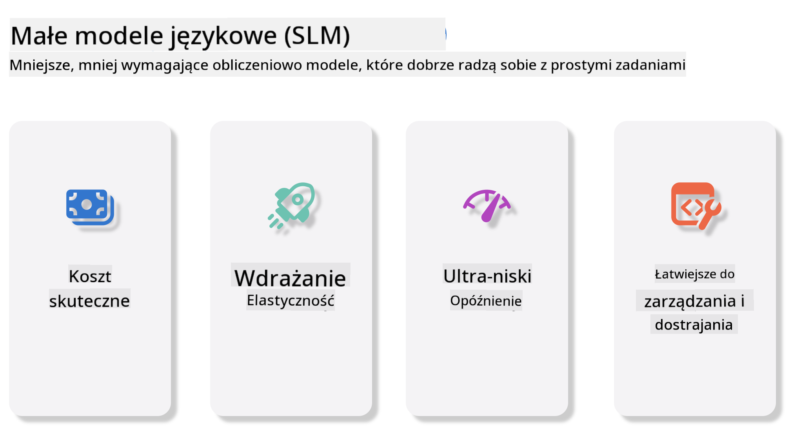
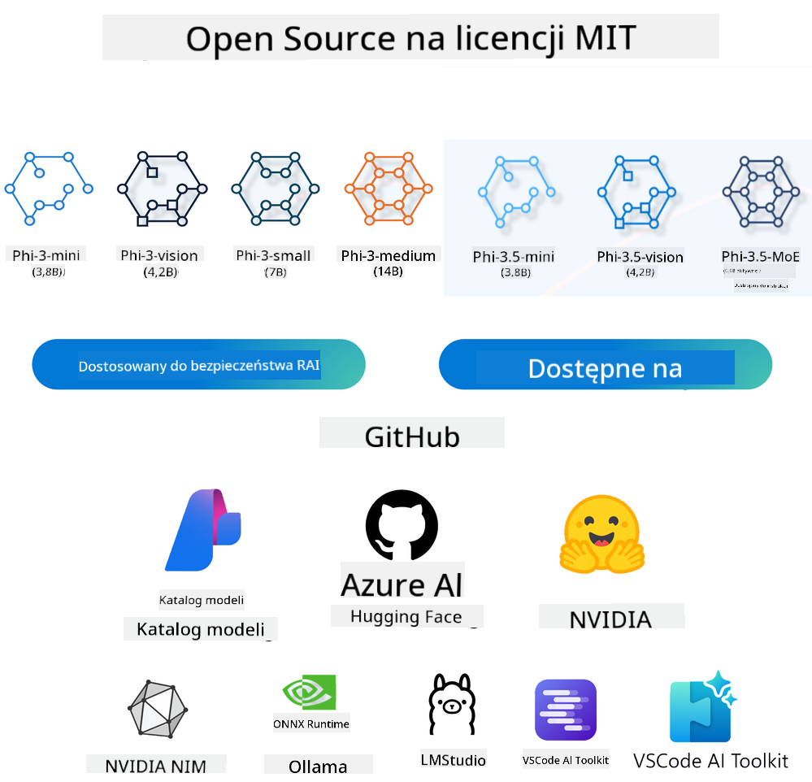

<!--
CO_OP_TRANSLATOR_METADATA:
{
  "original_hash": "124ad36cfe96f74038811b6e2bb93e9d",
  "translation_date": "2025-07-09T18:32:13+00:00",
  "source_file": "19-slm/README.md",
  "language_code": "pl"
}
-->
# Wprowadzenie do Małych Modeli Językowych dla Generatywnej AI dla Początkujących  
Generatywna AI to fascynująca dziedzina sztucznej inteligencji, która koncentruje się na tworzeniu systemów zdolnych do generowania nowej treści. Ta treść może obejmować tekst, obrazy, muzykę, a nawet całe wirtualne środowiska. Jednym z najbardziej ekscytujących zastosowań generatywnej AI są modele językowe.

## Czym są Małe Modele Językowe?  

Mały Model Językowy (SLM) to pomniejszona wersja dużego modelu językowego (LLM), wykorzystująca wiele zasad architektonicznych i technik stosowanych w LLM, ale charakteryzująca się znacznie mniejszym zapotrzebowaniem na zasoby obliczeniowe.

SLMy to podzbiór modeli językowych zaprojektowanych do generowania tekstu przypominającego ludzki. W przeciwieństwie do ich większych odpowiedników, takich jak GPT-4, SLMy są bardziej kompaktowe i efektywne, co czyni je idealnymi do zastosowań, gdzie zasoby obliczeniowe są ograniczone. Pomimo mniejszych rozmiarów, potrafią wykonywać różnorodne zadania. Zazwyczaj SLMy powstają poprzez kompresję lub destylację LLM, dążąc do zachowania znacznej części funkcjonalności i zdolności językowych oryginalnego modelu. Zmniejszenie rozmiaru modelu obniża jego złożoność, co sprawia, że SLMy są bardziej efektywne pod względem zużycia pamięci i wymagań obliczeniowych. Pomimo tych optymalizacji, SLMy potrafią realizować szeroki zakres zadań przetwarzania języka naturalnego (NLP):

- Generowanie tekstu: Tworzenie spójnych i kontekstowo odpowiednich zdań lub akapitów.  
- Uzupełnianie tekstu: Przewidywanie i dokańczanie zdań na podstawie podanego promptu.  
- Tłumaczenie: Przekład tekstu z jednego języka na inny.  
- Streszczanie: Skracanie długich tekstów do krótszych, bardziej przystępnych podsumowań.  

Choć z pewnymi kompromisami w wydajności lub głębokości rozumienia w porównaniu do większych modeli.

## Jak działają Małe Modele Językowe?  
SLMy są trenowane na ogromnych zbiorach danych tekstowych. Podczas treningu uczą się wzorców i struktur języka, co pozwala im generować teksty zarówno gramatycznie poprawne, jak i kontekstowo adekwatne. Proces treningu obejmuje:

- Zbieranie danych: Gromadzenie dużych zbiorów tekstów z różnych źródeł.  
- Wstępne przetwarzanie: Czyszczenie i organizowanie danych, aby były odpowiednie do treningu.  
- Trening: Wykorzystanie algorytmów uczenia maszynowego do nauczenia modelu rozumienia i generowania tekstu.  
- Dostrajenie: Dostosowywanie modelu w celu poprawy jego wydajności w konkretnych zadaniach.  

Rozwój SLMów odpowiada rosnącemu zapotrzebowaniu na modele, które można wdrażać w środowiskach o ograniczonych zasobach, takich jak urządzenia mobilne czy platformy edge computing, gdzie pełnowymiarowe LLMy mogą być niepraktyczne ze względu na duże wymagania sprzętowe. Skupiając się na efektywności, SLMy łączą wydajność z dostępnością, umożliwiając szersze zastosowanie w różnych dziedzinach.



## Cele nauki  

W tej lekcji chcemy wprowadzić wiedzę o SLM i połączyć ją z Microsoft Phi-3, aby poznać różne scenariusze w generowaniu tekstu, wizji oraz MoE.

Pod koniec lekcji powinieneś być w stanie odpowiedzieć na następujące pytania:

- Czym jest SLM  
- Czym różni się SLM od LLM  
- Czym jest rodzina Microsoft Phi-3/3.5  
- Jak przeprowadzić inferencję modeli Microsoft Phi-3/3.5  

Gotowy? Zaczynajmy.

## Różnice między Dużymi Modelami Językowymi (LLM) a Małymi Modelami Językowymi (SLM)  

Zarówno LLM, jak i SLM opierają się na podstawowych zasadach probabilistycznego uczenia maszynowego, stosując podobne podejścia w projektowaniu architektury, metodach treningu, procesach generowania danych oraz technikach oceny modeli. Jednak kilka kluczowych czynników odróżnia te dwa typy modeli.

## Zastosowania Małych Modeli Językowych  

SLMy mają szerokie zastosowanie, w tym:

- Chatboty: Zapewnianie wsparcia klienta i prowadzenie rozmów z użytkownikami.  
- Tworzenie treści: Wspomaganie pisarzy w generowaniu pomysłów lub nawet tworzeniu całych artykułów.  
- Edukacja: Pomoc uczniom w zadaniach pisemnych lub nauce języków.  
- Dostępność: Tworzenie narzędzi dla osób z niepełnosprawnościami, takich jak systemy tekst-na-mowę.  

**Rozmiar**  

Podstawowa różnica między LLM a SLM tkwi w skali modeli. LLM, takie jak ChatGPT (GPT-4), mogą mieć około 1,76 biliona parametrów, podczas gdy otwarte SLMy, takie jak Mistral 7B, są zaprojektowane z znacznie mniejszą liczbą parametrów — około 7 miliardów. Ta różnica wynika głównie z odmiennej architektury i procesów treningowych. Na przykład ChatGPT wykorzystuje mechanizm self-attention w ramach architektury encoder-decoder, podczas gdy Mistral 7B stosuje sliding window attention, co umożliwia bardziej efektywny trening w modelu typu decoder-only. Ta różnica architektoniczna ma istotny wpływ na złożoność i wydajność modeli.

**Zrozumienie**  

SLMy są zazwyczaj optymalizowane pod kątem wydajności w określonych dziedzinach, co czyni je wysoce wyspecjalizowanymi, ale potencjalnie ograniczonymi w zdolności do szerokiego rozumienia kontekstu w wielu obszarach wiedzy. W przeciwieństwie do tego, LLM dążą do symulacji inteligencji na bardziej wszechstronnym poziomie. Trenowane na ogromnych, zróżnicowanych zbiorach danych, LLM są zaprojektowane tak, aby dobrze radzić sobie w różnych dziedzinach, oferując większą wszechstronność i elastyczność. W efekcie LLM są bardziej odpowiednie do szerokiego zakresu zadań, takich jak przetwarzanie języka naturalnego czy programowanie.

**Zasoby obliczeniowe**  

Trening i wdrożenie LLM to procesy wymagające dużych zasobów, często obejmujące rozbudowaną infrastrukturę obliczeniową, w tym klastry GPU na dużą skalę. Na przykład trening modelu takiego jak ChatGPT od podstaw może wymagać tysięcy GPU przez długi czas. W przeciwieństwie do tego, SLMy, ze względu na mniejszą liczbę parametrów, są bardziej dostępne pod względem zasobów obliczeniowych. Modele takie jak Mistral 7B można trenować i uruchamiać na lokalnych maszynach wyposażonych w umiarkowane GPU, choć trening nadal wymaga kilku godzin na wielu GPU.

**Stronniczość**  

Stronniczość to znany problem w LLM, głównie ze względu na charakter danych treningowych. Modele te często bazują na surowych, ogólnodostępnych danych z internetu, które mogą niedostatecznie reprezentować lub błędnie przedstawiać niektóre grupy, wprowadzać błędne oznaczenia lub odzwierciedlać językowe uprzedzenia wynikające z dialektów, różnic geograficznych czy reguł gramatycznych. Dodatkowo złożoność architektury LLM może nieświadomie potęgować te uprzedzenia, które mogą pozostać niezauważone bez starannego dostrajania. Z kolei SLMy, trenowane na bardziej ograniczonych, specyficznych dla domeny zbiorach danych, są z natury mniej podatne na takie uprzedzenia, choć nie są od nich całkowicie wolne.

**Inferencja**  

Zmniejszony rozmiar SLMów daje im znaczącą przewagę pod względem szybkości inferencji, pozwalając na efektywne generowanie wyników na lokalnym sprzęcie bez potrzeby rozbudowanego przetwarzania równoległego. W przeciwieństwie do tego, LLM, ze względu na rozmiar i złożoność, często wymagają znacznych zasobów obliczeniowych do równoległego przetwarzania, aby osiągnąć akceptowalny czas odpowiedzi. Obecność wielu jednoczesnych użytkowników dodatkowo spowalnia czas reakcji LLM, zwłaszcza przy wdrożeniach na dużą skalę.

Podsumowując, choć LLM i SLM mają wspólne podstawy w uczeniu maszynowym, różnią się znacząco pod względem rozmiaru modelu, wymagań sprzętowych, rozumienia kontekstu, podatności na stronniczość oraz szybkości inferencji. Te różnice odzwierciedlają ich odpowiednią przydatność do różnych zastosowań — LLM są bardziej wszechstronne, ale zasobożerne, natomiast SLM oferują efektywność w określonych dziedzinach przy mniejszych wymaganiach obliczeniowych.

***Note：W tym rozdziale przedstawimy SLM na przykładzie Microsoft Phi-3 / 3.5.***

## Wprowadzenie do rodziny Phi-3 / Phi-3.5  

Rodzina Phi-3 / 3.5 jest głównie skierowana do scenariuszy zastosowań związanych z tekstem, wizją oraz Agentem (MoE):

### Phi-3 / 3.5 Instruct  

Głównie do generowania tekstu, uzupełniania rozmów i ekstrakcji informacji z treści.

**Phi-3-mini**  

Model językowy o wielkości 3,8 miliarda parametrów jest dostępny na Microsoft Azure AI Studio, Hugging Face oraz Ollama. Modele Phi-3 znacząco przewyższają modele językowe o podobnej lub większej wielkości w kluczowych benchmarkach (patrz liczby benchmarków poniżej, wyższe liczby oznaczają lepsze wyniki). Phi-3-mini przewyższa modele dwukrotnie większe, podczas gdy Phi-3-small i Phi-3-medium przewyższają większe modele, w tym GPT-3.5.

**Phi-3-small & medium**  

Zaledwie 7 miliardów parametrów, a Phi-3-small pokonuje GPT-3.5T w różnych benchmarkach językowych, rozumowania, kodowania i matematyki.

Phi-3-medium z 14 miliardami parametrów kontynuuje ten trend i przewyższa Gemini 1.0 Pro.

**Phi-3.5-mini**  

Możemy go traktować jako ulepszoną wersję Phi-3-mini. Parametry pozostają bez zmian, ale poprawia zdolność obsługi wielu języków (obsługuje ponad 20 języków: arabski, chiński, czeski, duński, niderlandzki, angielski, fiński, francuski, niemiecki, hebrajski, węgierski, włoski, japoński, koreański, norweski, polski, portugalski, rosyjski, hiszpański, szwedzki, tajski, turecki, ukraiński) oraz dodaje silniejsze wsparcie dla długiego kontekstu.

Phi-3.5-mini z 3,8 miliarda parametrów przewyższa modele językowe o tym samym rozmiarze i jest porównywalny z modelami dwukrotnie większymi.

### Phi-3 / 3.5 Vision  

Możemy traktować model Instruct Phi-3/3.5 jako zdolność Phi do rozumienia, a Vision to oczy Phi, które pozwalają mu rozumieć świat.

**Phi-3-Vision**  

Phi-3-vision, mający tylko 4,2 miliarda parametrów, kontynuuje ten trend i przewyższa większe modele, takie jak Claude-3 Haiku i Gemini 1.0 Pro V, w zadaniach ogólnego rozumowania wizualnego, OCR oraz rozumienia tabel i diagramów.

**Phi-3.5-Vision**  

Phi-3.5-Vision to również ulepszenie Phi-3-Vision, dodające wsparcie dla wielu obrazów. Można to traktować jako poprawę w wizji — nie tylko widzisz obrazy, ale także filmy.

Phi-3.5-vision przewyższa większe modele, takie jak Claude-3.5 Sonnet i Gemini 1.5 Flash, w zadaniach OCR, rozumienia tabel i wykresów oraz jest porównywalny w zadaniach ogólnego rozumowania wizualnego. Obsługuje wieloklatkowe wejścia, czyli potrafi analizować wiele obrazów jednocześnie.

### Phi-3.5-MoE  

***Mixture of Experts (MoE)*** umożliwia trenowanie modeli przy znacznie mniejszym zużyciu mocy obliczeniowej, co oznacza, że można znacznie zwiększyć rozmiar modelu lub zbioru danych przy tym samym budżecie obliczeniowym co model gęsty. W szczególności model MoE powinien osiągnąć tę samą jakość co jego gęsty odpowiednik znacznie szybciej podczas pretreningu.

Phi-3.5-MoE składa się z 16 modułów ekspertów po 3,8 miliarda parametrów każdy. Phi-3.5-MoE z zaledwie 6,6 miliarda aktywnych parametrów osiąga podobny poziom rozumowania, rozumienia języka i matematyki jak znacznie większe modele.

Możemy używać modeli z rodziny Phi-3/3.5 w różnych scenariuszach. W przeciwieństwie do LLM, Phi-3/3.5-mini lub Phi-3/3.5-Vision można wdrażać na urządzeniach edge.

## Jak korzystać z modeli rodziny Phi-3/3.5  

Chcemy używać Phi-3/3.5 w różnych scenariuszach. Poniżej przedstawimy wykorzystanie Phi-3/3.5 w zależności od scenariusza.



### Różnice w inferencji w API chmurowym  

**GitHub Models**  

GitHub Models to najprostszy sposób. Możesz szybko uzyskać dostęp do modelu Phi-3/3.5-Instruct przez GitHub Models. W połączeniu z Azure AI Inference SDK / OpenAI SDK możesz wywołać API za pomocą kodu, aby wykonać wywołanie Phi-3/3.5-Instruct. Możesz także testować różne efekty przez Playground.

- Demo: Porównanie efektów Phi-3-mini i Phi-3.5-mini w scenariuszach chińskojęzycznych


**Azure AI Studio**  

Jeśli chcemy korzystać z modeli wizji i MoE, możemy użyć Azure AI Studio do wykonania wywołań. Jeśli jesteś zainteresowany, możesz przeczytać Phi-3 Cookbook, aby dowiedzieć się, jak wywoływać Phi-3/3.5 Instruct, Vision, MoE przez Azure AI Studio [Kliknij ten link](https://github.com/microsoft/Phi-3CookBook/blob/main/md/02.QuickStart/AzureAIStudio_QuickStart.md?WT.mc_id=academic-105485-koreyst)

**NVIDIA NIM**  

Oprócz rozwiązań katalogu modeli w chmurze oferowanych przez Azure i GitHub, możesz także użyć [NVIDIA NIM](https://developer.nvidia.com/nim?WT.mc_id=academic-105485-koreyst) do wykonania powiązanych wywołań. Możesz odwiedzić NVIDIA NIM, aby wykonać wywołania API modeli z rodziny Phi-3/3.5. NVIDIA NIM (NVIDIA Inference Microservices) to zestaw przyspieszonych mikroserwisów inferencyjnych, zaprojektowanych, aby pomóc deweloperom efektywnie wdrażać modele AI w różnych środowiskach, w tym w chmurach, centrach danych i na stacjach roboczych.

Oto kilka kluczowych cech NVIDIA NIM:

- **Łatwość wdrożenia:** NIM pozwala na wdrożenie modeli AI za pomocą jednego polecenia, co ułatwia integrację z istniejącymi procesami.  
- **Optymalizacja wydajności:** Wykorzystuje zoptymalizowane silniki inferencyjne NVIDIA, takie jak TensorRT i TensorRT-LLM, zapewnia
- **Bezpieczeństwo i kontrola:** Organizacje mogą zachować kontrolę nad swoimi danymi i aplikacjami, samodzielnie hostując mikroserwisy NIM na własnej zarządzanej infrastrukturze.  
- **Standardowe API:** NIM udostępnia standardowe w branży API, co ułatwia tworzenie i integrację aplikacji AI, takich jak chatboty, asystenci AI i inne.

NIM jest częścią NVIDIA AI Enterprise, które ma na celu uproszczenie wdrażania i operacjonalizacji modeli AI, zapewniając ich efektywne działanie na GPU NVIDIA.

- Demo: Korzystanie z Nividia NIM do wywołania Phi-3.5-Vision-API  [[Kliknij ten link](python/Phi-3-Vision-Nividia-NIM.ipynb)]


### Inference Phi-3/3.5 w środowisku lokalnym  
Inference w kontekście Phi-3 lub dowolnego modelu językowego, takiego jak GPT-3, odnosi się do procesu generowania odpowiedzi lub prognoz na podstawie otrzymanego wejścia. Gdy podajesz prompt lub pytanie do Phi-3, model wykorzystuje wytrenowaną sieć neuronową, aby wywnioskować najbardziej prawdopodobną i adekwatną odpowiedź, analizując wzorce i zależności w danych, na których był trenowany.

**Hugging Face Transformer**  
Hugging Face Transformers to potężna biblioteka zaprojektowana do przetwarzania języka naturalnego (NLP) oraz innych zadań uczenia maszynowego. Oto kilka kluczowych informacji o niej:

1. **Modele wstępnie wytrenowane:** Udostępnia tysiące modeli wstępnie wytrenowanych, które można wykorzystać do różnych zadań, takich jak klasyfikacja tekstu, rozpoznawanie nazwanych bytów, odpowiadanie na pytania, streszczanie, tłumaczenie czy generowanie tekstu.

2. **Współpraca z różnymi frameworkami:** Biblioteka obsługuje wiele frameworków do uczenia głębokiego, w tym PyTorch, TensorFlow i JAX. Pozwala to trenować model w jednym frameworku i używać go w innym.

3. **Możliwości multimodalne:** Poza NLP, Hugging Face Transformers wspiera także zadania z zakresu wizji komputerowej (np. klasyfikacja obrazów, wykrywanie obiektów) oraz przetwarzania dźwięku (np. rozpoznawanie mowy, klasyfikacja audio).

4. **Łatwość użycia:** Biblioteka oferuje API i narzędzia do łatwego pobierania i dostrajania modeli, co czyni ją dostępną zarówno dla początkujących, jak i ekspertów.

5. **Społeczność i zasoby:** Hugging Face ma aktywną społeczność oraz obszerną dokumentację, samouczki i przewodniki, które pomagają użytkownikom rozpocząć pracę i w pełni wykorzystać bibliotekę.  
[oficjalna dokumentacja](https://huggingface.co/docs/transformers/index?WT.mc_id=academic-105485-koreyst) lub ich [repozytorium GitHub](https://github.com/huggingface/transformers?WT.mc_id=academic-105485-koreyst).

To jest najczęściej stosowana metoda, ale wymaga również akceleracji GPU. W końcu scenariusze takie jak Vision i MoE wymagają dużej liczby obliczeń, które na CPU będą bardzo ograniczone, jeśli nie zostaną poddane kwantyzacji.


- Demo: Korzystanie z Transformer do wywołania Phi-3.5-Instuct [Kliknij ten link](python/phi35-instruct-demo.ipynb)

- Demo: Korzystanie z Transformer do wywołania Phi-3.5-Vision [Kliknij ten link](python/phi35-vision-demo.ipynb)

- Demo: Korzystanie z Transformer do wywołania Phi-3.5-MoE [Kliknij ten link](python/phi35_moe_demo.ipynb)

**Ollama**  
[Ollama](https://ollama.com/?WT.mc_id=academic-105485-koreyst) to platforma zaprojektowana, aby ułatwić uruchamianie dużych modeli językowych (LLM) lokalnie na Twoim komputerze. Obsługuje różne modele, takie jak Llama 3.1, Phi 3, Mistral i Gemma 2, między innymi. Platforma upraszcza proces, łącząc wagi modelu, konfigurację i dane w jeden pakiet, co ułatwia użytkownikom dostosowywanie i tworzenie własnych modeli. Ollama jest dostępna na macOS, Linux i Windows. To świetne narzędzie, jeśli chcesz eksperymentować z LLM lub wdrażać je bez polegania na usługach chmurowych. Ollama to najprostszy sposób, wystarczy wykonać następujące polecenie.


```bash

ollama run phi3.5

```


**ONNX Runtime dla GenAI**

[ONNX Runtime](https://github.com/microsoft/onnxruntime-genai?WT.mc_id=academic-105485-koreyst) to wieloplatformowy akcelerator do inferencji i trenowania modeli uczenia maszynowego. ONNX Runtime dla Generative AI (GENAI) to potężne narzędzie, które pomaga efektywnie uruchamiać modele generatywnej AI na różnych platformach.

## Czym jest ONNX Runtime?  
ONNX Runtime to projekt open-source umożliwiający wysokowydajną inferencję modeli uczenia maszynowego. Obsługuje modele w formacie Open Neural Network Exchange (ONNX), który jest standardem reprezentacji modeli ML. Inferencja w ONNX Runtime może przyspieszyć doświadczenia użytkowników i obniżyć koszty, wspierając modele z frameworków deep learning, takich jak PyTorch i TensorFlow/Keras, a także klasyczne biblioteki ML, takie jak scikit-learn, LightGBM, XGBoost i inne. ONNX Runtime jest kompatybilny z różnym sprzętem, sterownikami i systemami operacyjnymi, zapewniając optymalną wydajność dzięki wykorzystaniu akceleratorów sprzętowych tam, gdzie to możliwe, wraz z optymalizacjami i transformacjami grafu.

## Czym jest Generative AI?  
Generative AI odnosi się do systemów AI, które potrafią generować nowe treści, takie jak tekst, obrazy czy muzyka, na podstawie danych, na których były trenowane. Przykładami są modele językowe takie jak GPT-3 oraz modele generowania obrazów, np. Stable Diffusion. Biblioteka ONNX Runtime dla GenAI zapewnia pętlę generatywnej AI dla modeli ONNX, w tym inferencję z ONNX Runtime, przetwarzanie logits, wyszukiwanie i próbkowanie oraz zarządzanie pamięcią KV cache.

## ONNX Runtime dla GENAI  
ONNX Runtime dla GENAI rozszerza możliwości ONNX Runtime o wsparcie dla modeli generatywnej AI. Oto kilka kluczowych cech:

- **Szerokie wsparcie platform:** Działa na różnych platformach, w tym Windows, Linux, macOS, Android i iOS.  
- **Wsparcie modeli:** Obsługuje wiele popularnych modeli generatywnej AI, takich jak LLaMA, GPT-Neo, BLOOM i inne.  
- **Optymalizacja wydajności:** Zawiera optymalizacje dla różnych akceleratorów sprzętowych, takich jak GPU NVIDIA, GPU AMD i inne.  
- **Łatwość użycia:** Udostępnia API do łatwej integracji z aplikacjami, pozwalając generować tekst, obrazy i inne treści przy minimalnej ilości kodu.  
- Użytkownicy mogą wywołać metodę generate() na wysokim poziomie lub uruchamiać każdą iterację modelu w pętli, generując token po tokenie i opcjonalnie aktualizując parametry generacji w trakcie pętli.  
- ONNX Runtime obsługuje także greedy/beam search oraz próbkowanie TopP, TopK do generowania sekwencji tokenów oraz wbudowane przetwarzanie logits, takie jak kary za powtórzenia. Można też łatwo dodać własne metryki oceny.

## Jak zacząć  
Aby rozpocząć pracę z ONNX Runtime dla GENAI, wykonaj następujące kroki:

### Zainstaluj ONNX Runtime:  
```Python
pip install onnxruntime
```  
### Zainstaluj rozszerzenia Generative AI:  
```Python
pip install onnxruntime-genai
```

### Uruchom model: Oto prosty przykład w Pythonie:  
```Python
import onnxruntime_genai as og

model = og.Model('path_to_your_model.onnx')

tokenizer = og.Tokenizer(model)

input_text = "Hello, how are you?"

input_tokens = tokenizer.encode(input_text)

output_tokens = model.generate(input_tokens)

output_text = tokenizer.decode(output_tokens)

print(output_text) 
```  
### Demo: Korzystanie z ONNX Runtime GenAI do wywołania Phi-3.5-Vision  


```python

import onnxruntime_genai as og

model_path = './Your Phi-3.5-vision-instruct ONNX Path'

img_path = './Your Image Path'

model = og.Model(model_path)

processor = model.create_multimodal_processor()

tokenizer_stream = processor.create_stream()

text = "Your Prompt"

prompt = "<|user|>\n"

prompt += "<|image_1|>\n"

prompt += f"{text}<|end|>\n"

prompt += "<|assistant|>\n"

image = og.Images.open(img_path)

inputs = processor(prompt, images=image)

params = og.GeneratorParams(model)

params.set_inputs(inputs)

params.set_search_options(max_length=3072)

generator = og.Generator(model, params)

while not generator.is_done():

    generator.compute_logits()
    
    generator.generate_next_token()

    new_token = generator.get_next_tokens()[0]
    
    code += tokenizer_stream.decode(new_token)
    
    print(tokenizer_stream.decode(new_token), end='', flush=True)

```


**Inne**

Oprócz metod referencyjnych ONNX Runtime i Ollama, możemy również uzupełnić referencje modeli kwantowych na podstawie metod referencyjnych dostarczanych przez różnych producentów. Na przykład Apple MLX framework z Apple Metal, Qualcomm QNN z NPU, Intel OpenVINO z CPU/GPU itd. Więcej materiałów znajdziesz również w [Phi-3 Cookbook](https://github.com/microsoft/phi-3cookbook?WT.mc_id=academic-105485-koreyst)


## Więcej

Poznaliśmy podstawy rodziny Phi-3/3.5, ale aby dowiedzieć się więcej o SLM, potrzebujemy dodatkowej wiedzy. Odpowiedzi znajdziesz w Phi-3 Cookbook. Jeśli chcesz zgłębić temat, odwiedź [Phi-3 Cookbook](https://github.com/microsoft/phi-3cookbook?WT.mc_id=academic-105485-koreyst).

**Zastrzeżenie**:  
Niniejszy dokument został przetłumaczony za pomocą usługi tłumaczenia AI [Co-op Translator](https://github.com/Azure/co-op-translator). Mimo że dążymy do dokładności, prosimy mieć na uwadze, że tłumaczenia automatyczne mogą zawierać błędy lub nieścisłości. Oryginalny dokument w języku źródłowym powinien być uznawany za źródło autorytatywne. W przypadku informacji o kluczowym znaczeniu zalecane jest skorzystanie z profesjonalnego tłumaczenia wykonanego przez człowieka. Nie ponosimy odpowiedzialności za jakiekolwiek nieporozumienia lub błędne interpretacje wynikające z korzystania z tego tłumaczenia.