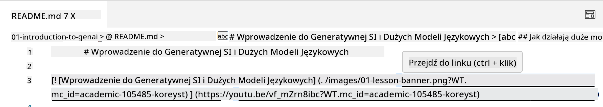
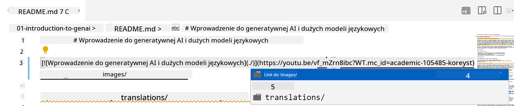
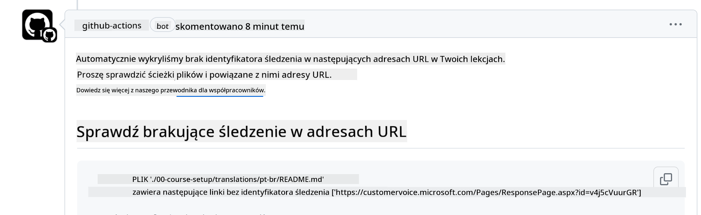
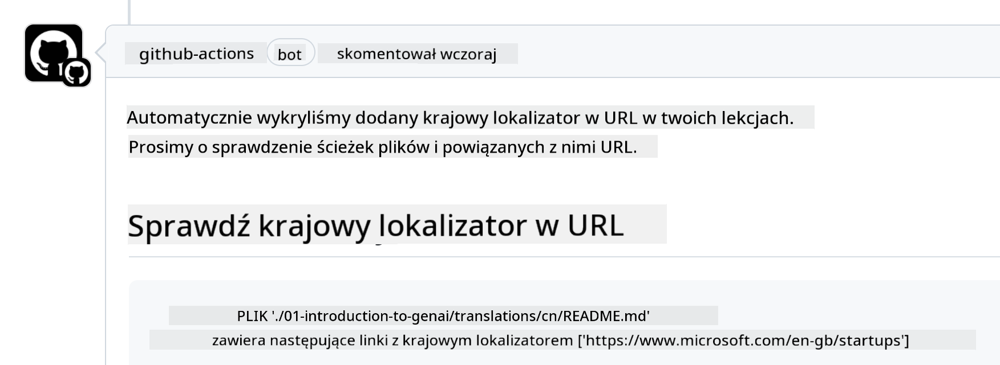

<!--
CO_OP_TRANSLATOR_METADATA:
{
  "original_hash": "57c41f2af71001a2cff9d8eb797cb843",
  "translation_date": "2025-05-19T08:39:12+00:00",
  "source_file": "CONTRIBUTING.md",
  "language_code": "pl"
}
-->
# Współtworzenie

Ten projekt ceni sobie wkład i sugestie. Większość wkładów wymaga, abyś zgodził się na Umowę Licencyjną Współtwórcy (CLA), która potwierdza, że masz prawo i faktycznie udzielasz nam praw do korzystania z Twojego wkładu. Szczegóły znajdziesz na <https://cla.microsoft.com>.

> Ważne: tłumacząc tekst w tym repozytorium, upewnij się, że nie korzystasz z tłumaczeń maszynowych. Zweryfikujemy tłumaczenia za pośrednictwem społeczności, więc zgłaszaj się do tłumaczeń tylko w językach, w których jesteś biegły.

Gdy złożysz pull request, bot CLA automatycznie określi, czy musisz dostarczyć CLA i odpowiednio oznaczy PR (np. etykieta, komentarz). Po prostu postępuj zgodnie z instrukcjami dostarczonymi przez bota. Musisz to zrobić tylko raz we wszystkich repozytoriach korzystających z naszego CLA.

## Kodeks Postępowania

Ten projekt przyjął [Kodeks Postępowania Microsoft Open Source](https://opensource.microsoft.com/codeofconduct/?WT.mc_id=academic-105485-koreyst).
Więcej informacji znajdziesz w [FAQ Kodeksu Postępowania](https://opensource.microsoft.com/codeofconduct/faq/?WT.mc_id=academic-105485-koreyst) lub kontaktując się z [opencode@microsoft.com](mailto:opencode@microsoft.com) w przypadku dodatkowych pytań lub komentarzy.

## Pytanie lub problem?

Prosimy nie otwierać problemów na GitHubie dotyczących ogólnych pytań wsparcia, ponieważ lista GitHub powinna być używana do zgłoszeń dotyczących funkcji i błędów. W ten sposób możemy łatwiej śledzić rzeczywiste problemy lub błędy w kodzie i oddzielić ogólną dyskusję od rzeczywistego kodu.

## Literówki, problemy, błędy i wkłady

Zawsze, gdy przesyłasz jakiekolwiek zmiany do repozytorium Generative AI for Beginners, postępuj zgodnie z poniższymi zaleceniami.

* Zawsze fork repozytorium na swoje konto przed dokonaniem modyfikacji
* Nie łącz wielu zmian w jednym pull request. Na przykład, zgłaszaj poprawki błędów i aktualizacje dokumentacji w oddzielnych PR
* Jeśli Twój pull request pokazuje konflikty scalania, upewnij się, że zaktualizowałeś lokalną główną gałąź, aby była lustrzanym odbiciem tego, co jest w głównym repozytorium, zanim dokonasz modyfikacji
* Jeśli przesyłasz tłumaczenie, utwórz jeden PR dla wszystkich przetłumaczonych plików, ponieważ nie akceptujemy częściowych tłumaczeń treści
* Jeśli przesyłasz literówkę lub poprawkę dokumentacji, możesz łączyć modyfikacje w jednym PR, jeśli jest to odpowiednie

## Ogólne wskazówki dotyczące pisania

- Upewnij się, że wszystkie Twoje URL są umieszczone w nawiasach kwadratowych, po których następuje nawias zewnętrzny bez dodatkowych spacji wokół nich lub w środku ``.
- Upewnij się, że każdy względny link (tj. linki do innych plików i folderów w repozytorium) zaczyna się od `./` odnoszącego się do pliku lub folderu znajdującego się w bieżącym katalogu roboczym lub `../` odnoszącego się do pliku lub folderu znajdującego się w katalogu nadrzędnym.
- Upewnij się, że każdy względny link (tj. linki do innych plików i folderów w repozytorium) ma identyfikator śledzenia (tj. `?` lub `&` następnie `wt.mc_id=` lub `WT.mc_id=`) na końcu.
- Upewnij się, że każdy URL z następujących domen _github.com, microsoft.com, visualstudio.com, aka.ms, i azure.com_ ma identyfikator śledzenia (tj. `?` lub `&` następnie `wt.mc_id=` lub `WT.mc_id=`) na końcu.
- Upewnij się, że Twoje linki nie mają lokalizacji specyficznej dla kraju (tj. `/en-us/` lub `/en/`).
- Upewnij się, że wszystkie obrazy są przechowywane w folderze `./images`.
- Upewnij się, że obrazy mają opisowe nazwy używające angielskich znaków, cyfr i myślników w nazwie obrazu.

## Przepływy pracy GitHub

Gdy przesyłasz pull request, uruchomione zostaną cztery różne przepływy pracy, aby zweryfikować wcześniejsze zasady.
Po prostu postępuj zgodnie z instrukcjami wymienionymi tutaj, aby przejść przez kontrole przepływu pracy.

- [Sprawdź uszkodzone ścieżki względne](../..)
- [Sprawdź, czy ścieżki mają śledzenie](../..)
- [Sprawdź, czy URL mają śledzenie](../..)
- [Sprawdź, czy URL nie mają lokalizacji](../..)

### Sprawdź uszkodzone ścieżki względne

Ten przepływ pracy zapewnia, że każda względna ścieżka w Twoich plikach działa.
To repozytorium jest wdrażane na stronach GitHub, więc musisz być bardzo ostrożny, gdy wpisujesz linki, które wszystko łączą, aby nie skierować nikogo w złe miejsce.

Aby upewnić się, że Twoje linki działają poprawnie, po prostu użyj VS Code, aby to sprawdzić.

Na przykład, gdy najedziesz kursorem na dowolny link w swoich plikach, zostaniesz poproszony o śledzenie linku, naciskając **ctrl + klik**

Jeśli klikniesz link i nie działa lokalnie, to z pewnością wywoła przepływ pracy i nie zadziała na GitHub.

Aby naprawić ten problem, spróbuj wpisać link z pomocą VS Code.

Gdy wpiszesz `./` lub `../`, VS Code poprosi Cię o wybór spośród dostępnych opcji zgodnie z tym, co wpisałeś.

Śledź ścieżkę, klikając żądany plik lub folder, i będziesz pewien, że Twoja ścieżka nie jest uszkodzona.

Gdy dodasz poprawną ścieżkę względną, zapisz i wypchnij swoje zmiany, przepływ pracy zostanie ponownie uruchomiony, aby zweryfikować Twoje zmiany.
Jeśli przejdziesz kontrolę, jesteś gotowy.

### Sprawdź, czy ścieżki mają śledzenie

Ten przepływ pracy zapewnia, że każda względna ścieżka ma w sobie śledzenie.
To repozytorium jest wdrażane na stronach GitHub, więc musimy śledzić ruch między różnymi plikami i folderami.

Aby upewnić się, że Twoje ścieżki względne mają w sobie śledzenie, po prostu sprawdź, czy na końcu ścieżki znajduje się następujący tekst `?wt.mc_id=`.
Jeśli jest dodany do Twoich ścieżek względnych, przejdziesz tę kontrolę.

Jeśli nie, możesz otrzymać następujący błąd.

Aby naprawić ten problem, spróbuj otworzyć ścieżkę pliku, którą przepływ pracy podświetlił, i dodaj identyfikator śledzenia na końcu ścieżek względnych.

Gdy dodasz identyfikator śledzenia, zapisz i wypchnij swoje zmiany, przepływ pracy zostanie ponownie uruchomiony, aby zweryfikować Twoje zmiany.
Jeśli przejdziesz kontrolę, jesteś gotowy.

### Sprawdź, czy URL mają śledzenie

Ten przepływ pracy zapewnia, że każdy URL ma w sobie śledzenie.
To repozytorium jest dostępne dla wszystkich, więc musisz upewnić się, że śledzisz dostęp, aby wiedzieć, skąd pochodzi ruch.

Aby upewnić się, że Twoje URL mają w sobie śledzenie, po prostu sprawdź, czy na końcu URL znajduje się następujący tekst `?wt.mc_id=`.
Jeśli jest dodany do Twoich URL, przejdziesz tę kontrolę.

Jeśli nie, możesz otrzymać następujący błąd.

Aby naprawić ten problem, spróbuj otworzyć ścieżkę pliku, którą przepływ pracy podświetlił, i dodaj identyfikator śledzenia na końcu URL.

Gdy dodasz identyfikator śledzenia, zapisz i wypchnij swoje zmiany, przepływ pracy zostanie ponownie uruchomiony, aby zweryfikować Twoje zmiany.
Jeśli przejdziesz kontrolę, jesteś gotowy.

### Sprawdź, czy URL nie mają lokalizacji

Ten przepływ pracy zapewnia, że każdy URL nie ma w sobie lokalizacji specyficznej dla kraju.
To repozytorium jest dostępne dla wszystkich na całym świecie, więc musisz upewnić się, że nie zawierasz lokalizacji swojego kraju w URL.

Aby upewnić się, że Twoje URL nie mają w sobie lokalizacji kraju, po prostu sprawdź, czy w URL nie ma następującego tekstu `/en-us/` lub `/en/` lub jakiejkolwiek innej lokalizacji językowej.
Jeśli nie jest obecny w Twoich URL, przejdziesz tę kontrolę.

Jeśli nie, możesz otrzymać następujący błąd.

Aby naprawić ten problem, spróbuj otworzyć ścieżkę pliku, którą przepływ pracy podświetlił, i usuń lokalizację kraju z URL.

Gdy usuniesz lokalizację kraju, zapisz i wypchnij swoje zmiany, przepływ pracy zostanie ponownie uruchomiony, aby zweryfikować Twoje zmiany.
Jeśli przejdziesz kontrolę, jesteś gotowy.

Gratulacje! Skontaktujemy się z Tobą tak szybko, jak to możliwe, z opinią na temat Twojego wkładu.

**Zrzeczenie się odpowiedzialności**:  
Ten dokument został przetłumaczony przy użyciu usługi tłumaczenia AI [Co-op Translator](https://github.com/Azure/co-op-translator). Dokładamy wszelkich starań, aby zapewnić dokładność, jednak prosimy pamiętać, że automatyczne tłumaczenia mogą zawierać błędy lub nieścisłości. Oryginalny dokument w jego ojczystym języku powinien być uznawany za wiarygodne źródło. W przypadku istotnych informacji zaleca się profesjonalne tłumaczenie przez człowieka. Nie ponosimy odpowiedzialności za jakiekolwiek nieporozumienia lub błędne interpretacje wynikające z korzystania z tego tłumaczenia.