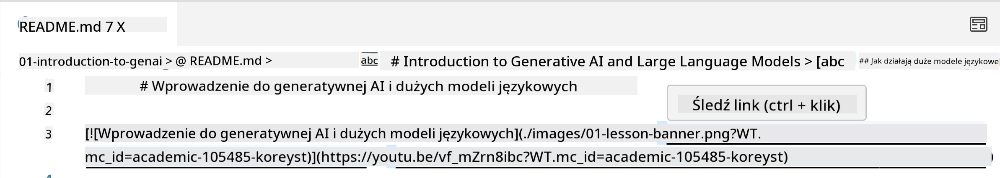
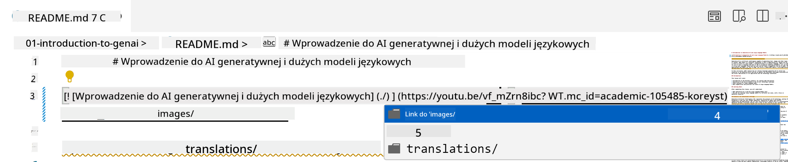
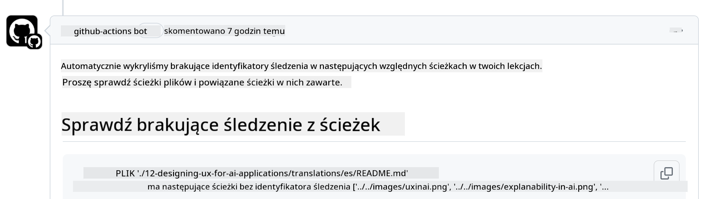
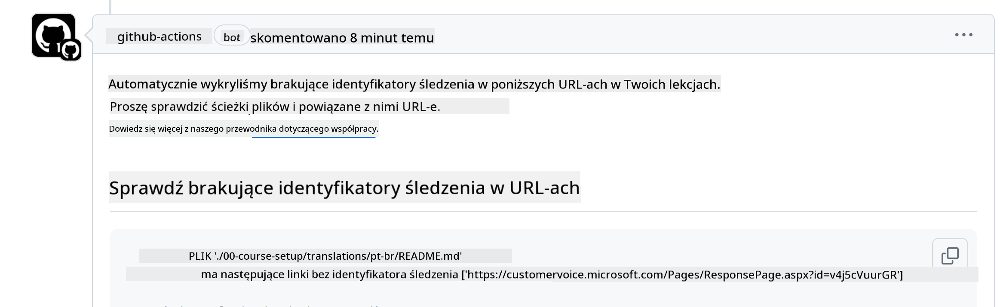
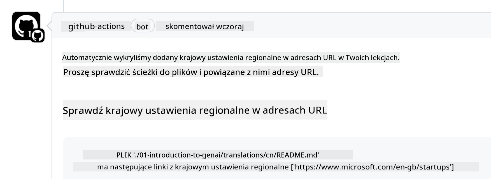

<!--
CO_OP_TRANSLATOR_METADATA:
{
  "original_hash": "57c41f2af71001a2cff9d8eb797cb843",
  "translation_date": "2025-06-25T07:09:32+00:00",
  "source_file": "CONTRIBUTING.md",
  "language_code": "pl"
}
-->
# Wkład

Ten projekt z radością przyjmuje wkład i sugestie. Większość wkładów wymaga, abyś zgodził się na Umowę Licencyjną Współtwórcy (CLA), deklarując, że masz prawo i faktycznie przyznajesz nam prawa do korzystania z Twojego wkładu. Szczegóły znajdziesz na stronie <https://cla.microsoft.com>.

> Ważne: podczas tłumaczenia tekstu w tym repozytorium, upewnij się, że nie korzystasz z tłumaczenia maszynowego. Zweryfikujemy tłumaczenia za pomocą społeczności, więc zgłaszaj się tylko do tłumaczeń w językach, w których jesteś biegły.

Gdy przesyłasz pull request, CLA-bot automatycznie określi, czy musisz dostarczyć CLA i odpowiednio oznaczy PR (np. etykieta, komentarz). Po prostu postępuj zgodnie z instrukcjami dostarczonymi przez bota. Będziesz musiał to zrobić tylko raz we wszystkich repozytoriach korzystających z naszego CLA.

## Kodeks postępowania

Ten projekt przyjął [Kodeks Postępowania Microsoft Open Source](https://opensource.microsoft.com/codeofconduct/?WT.mc_id=academic-105485-koreyst). Aby uzyskać więcej informacji, przeczytaj [FAQ dotyczące Kodeksu Postępowania](https://opensource.microsoft.com/codeofconduct/faq/?WT.mc_id=academic-105485-koreyst) lub skontaktuj się z [opencode@microsoft.com](mailto:opencode@microsoft.com) w przypadku dodatkowych pytań lub komentarzy.

## Pytanie lub problem?

Proszę nie otwierać problemów na GitHubie dla ogólnych pytań dotyczących wsparcia, ponieważ lista GitHub powinna być używana do zgłaszania funkcji i błędów. Dzięki temu możemy łatwiej śledzić rzeczywiste problemy lub błędy w kodzie i oddzielić ogólną dyskusję od rzeczywistego kodu.

## Literówki, problemy, błędy i wkład

Zawsze, gdy przesyłasz jakiekolwiek zmiany do repozytorium Generative AI for Beginners, proszę przestrzegać tych zaleceń.

* Zawsze forkuj repozytorium na swoje konto przed dokonaniem modyfikacji
* Nie łącz wielu zmian w jednym pull request. Na przykład, przesyłaj poprawki błędów i aktualizacje dokumentacji za pomocą oddzielnych PR
* Jeśli Twój pull request pokazuje konflikty podczas scalania, upewnij się, że zaktualizowałeś lokalną wersję główną, aby była lustrzanym odbiciem tego, co znajduje się w głównym repozytorium przed dokonaniem modyfikacji
* Jeśli przesyłasz tłumaczenie, proszę utworzyć jeden PR dla wszystkich przetłumaczonych plików, ponieważ nie akceptujemy częściowych tłumaczeń treści
* Jeśli przesyłasz poprawkę literówki lub dokumentacji, możesz połączyć modyfikacje w jednym PR, jeśli jest to odpowiednie

## Ogólne wskazówki dotyczące pisania

- Upewnij się, że wszystkie Twoje URL-e są zamknięte w nawiasach kwadratowych, po których następuje nawias bez dodatkowych spacji wokół nich lub wewnątrz ``.
- Upewnij się, że każdy względny link (tj. linki do innych plików i folderów w repozytorium) zaczyna się od `./` odnoszącego się do pliku lub folderu znajdującego się w bieżącym katalogu roboczym lub `../` odnoszącego się do pliku lub folderu znajdującego się w nadrzędnym katalogu roboczym.
- Upewnij się, że każdy względny link (tj. linki do innych plików i folderów w repozytorium) ma identyfikator śledzenia (tj. `?` lub `&`, a następnie `wt.mc_id=` lub `WT.mc_id=`) na końcu.
- Upewnij się, że każdy URL z następujących domen _github.com, microsoft.com, visualstudio.com, aka.ms, i azure.com_ ma identyfikator śledzenia (tj. `?` lub `&`, a następnie `wt.mc_id=` lub `WT.mc_id=`) na końcu.
- Upewnij się, że Twoje linki nie mają specyficznego dla kraju lokalnego oznaczenia (tj. `/en-us/` lub `/en/`).
- Upewnij się, że wszystkie obrazy są przechowywane w folderze `./images`.
- Upewnij się, że obrazy mają opisowe nazwy używając angielskich znaków, cyfr i myślników w nazwie Twojego obrazu.

## GitHub Workflows

Gdy przesyłasz pull request, cztery różne przepływy pracy zostaną uruchomione, aby zweryfikować poprzednie zasady. Po prostu postępuj zgodnie z instrukcjami wymienionymi tutaj, aby przejść kontrole przepływu pracy.

- [Sprawdź uszkodzone względne ścieżki](../..)
- [Sprawdź, czy ścieżki mają śledzenie](../..)
- [Sprawdź, czy URL-e mają śledzenie](../..)
- [Sprawdź, czy URL-e nie mają lokalnego oznaczenia](../..)

### Sprawdź uszkodzone względne ścieżki

Ten przepływ pracy zapewnia, że każda względna ścieżka w Twoich plikach działa. To repozytorium jest wdrożone na stronach GitHub, więc musisz być bardzo ostrożny, gdy wpisujesz linki, które łączą wszystko razem, aby nie skierować nikogo w złe miejsce.

Aby upewnić się, że Twoje linki działają poprawnie, po prostu użyj VS Code, aby to sprawdzić.

Na przykład, gdy najedziesz kursorem na dowolny link w swoich plikach, zostaniesz zachęcony do podążania za linkiem, naciskając **ctrl + klik**

Jeśli klikniesz na link i nie działa lokalnie, to z pewnością uruchomi przepływ pracy i nie będzie działać na GitHubie.

Aby rozwiązać ten problem, spróbuj wpisać link z pomocą VS Code.

Gdy wpiszesz `./` lub `../`, VS Code wyświetli Ci dostępne opcje zgodnie z tym, co wpisałeś.

Podążaj za ścieżką, klikając na żądany plik lub folder, a będziesz pewien, że Twoja ścieżka nie jest uszkodzona.

Gdy dodasz poprawną względną ścieżkę, zapisz i prześlij swoje zmiany, przepływ pracy zostanie uruchomiony ponownie, aby zweryfikować Twoje zmiany. Jeśli przejdziesz kontrolę, jesteś gotowy do działania.

### Sprawdź, czy ścieżki mają śledzenie

Ten przepływ pracy zapewnia, że każda względna ścieżka ma w sobie śledzenie. To repozytorium jest wdrożone na stronach GitHub, więc musimy śledzić ruch między różnymi plikami i folderami.

Aby upewnić się, że Twoje względne ścieżki mają w sobie śledzenie, po prostu sprawdź, czy na końcu ścieżki znajduje się następujący tekst `?wt.mc_id=`. Jeśli jest dodany do Twoich względnych ścieżek, przejdziesz tę kontrolę.

Jeśli nie, możesz otrzymać następujący błąd.

Aby rozwiązać ten problem, spróbuj otworzyć ścieżkę pliku, którą wyróżnił przepływ pracy, i dodaj identyfikator śledzenia na końcu względnych ścieżek.

Gdy dodasz identyfikator śledzenia, zapisz i prześlij swoje zmiany, przepływ pracy zostanie uruchomiony ponownie, aby zweryfikować Twoje zmiany. Jeśli przejdziesz kontrolę, jesteś gotowy do działania.

### Sprawdź, czy URL-e mają śledzenie

Ten przepływ pracy zapewnia, że każdy URL ma w sobie śledzenie. To repozytorium jest dostępne dla wszystkich, więc musisz upewnić się, że śledzisz dostęp, aby wiedzieć, skąd pochodzi ruch.

Aby upewnić się, że Twoje URL-e mają w sobie śledzenie, po prostu sprawdź, czy na końcu URL znajduje się następujący tekst `?wt.mc_id=`. Jeśli jest dodany do Twoich URL-i, przejdziesz tę kontrolę.

Jeśli nie, możesz otrzymać następujący błąd.

Aby rozwiązać ten problem, spróbuj otworzyć ścieżkę pliku, którą wyróżnił przepływ pracy, i dodaj identyfikator śledzenia na końcu URL-i.

Gdy dodasz identyfikator śledzenia, zapisz i prześlij swoje zmiany, przepływ pracy zostanie uruchomiony ponownie, aby zweryfikować Twoje zmiany. Jeśli przejdziesz kontrolę, jesteś gotowy do działania.

### Sprawdź, czy URL-e nie mają lokalnego oznaczenia

Ten przepływ pracy zapewnia, że każdy URL nie ma w sobie specyficznego dla kraju lokalnego oznaczenia. To repozytorium jest dostępne dla wszystkich na całym świecie, więc musisz upewnić się, że nie dodajesz lokalnego oznaczenia swojego kraju do URL-i.

Aby upewnić się, że Twoje URL-e nie mają lokalnego oznaczenia kraju, po prostu sprawdź, czy gdziekolwiek w URL znajduje się następujący tekst `/en-us/` lub `/en/` lub jakiekolwiek inne oznaczenie językowe. Jeśli nie jest obecne w Twoich URL-ach, przejdziesz tę kontrolę.

Jeśli nie, możesz otrzymać następujący błąd.

Aby rozwiązać ten problem, spróbuj otworzyć ścieżkę pliku, którą wyróżnił przepływ pracy, i usuń lokalne oznaczenie kraju z URL-i.

Gdy usuniesz lokalne oznaczenie kraju, zapisz i prześlij swoje zmiany, przepływ pracy zostanie uruchomiony ponownie, aby zweryfikować Twoje zmiany. Jeśli przejdziesz kontrolę, jesteś gotowy do działania.

Gratulacje! Skontaktujemy się z Tobą jak najszybciej z informacją zwrotną na temat Twojego wkładu.

**Zastrzeżenie**:  
Ten dokument został przetłumaczony przy użyciu usługi tłumaczenia AI [Co-op Translator](https://github.com/Azure/co-op-translator). Chociaż dążymy do dokładności, prosimy pamiętać, że automatyczne tłumaczenia mogą zawierać błędy lub nieścisłości. Oryginalny dokument w jego rodzimym języku powinien być uznawany za źródło autorytatywne. W przypadku informacji krytycznych zaleca się profesjonalne tłumaczenie przez człowieka. Nie ponosimy odpowiedzialności za jakiekolwiek nieporozumienia lub błędne interpretacje wynikające z użycia tego tłumaczenia.