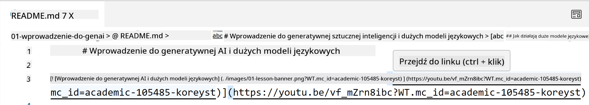
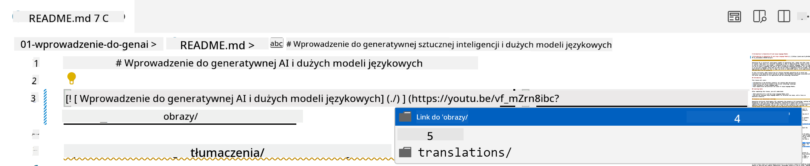
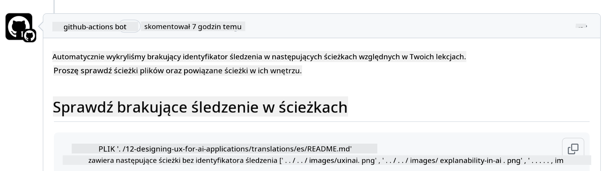
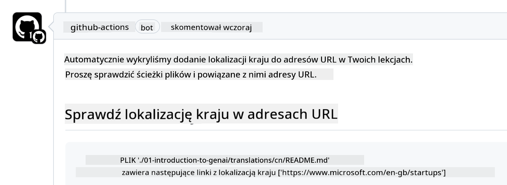

<!--
CO_OP_TRANSLATOR_METADATA:
{
  "original_hash": "57c41f2af71001a2cff9d8eb797cb843",
  "translation_date": "2025-07-09T06:06:14+00:00",
  "source_file": "CONTRIBUTING.md",
  "language_code": "pl"
}
-->
# Współtworzenie

Ten projekt zachęca do zgłaszania wkładów i sugestii. Większość wkładów wymaga zgody na Contributor License Agreement (CLA), w którym oświadczasz, że masz prawo i faktycznie udzielasz nam praw do korzystania z Twojego wkładu. Szczegóły znajdziesz na stronie <https://cla.microsoft.com>.

> Ważne: podczas tłumaczenia tekstów w tym repozytorium, prosimy o niekorzystanie z tłumaczeń maszynowych. Weryfikację tłumaczeń przeprowadzi społeczność, dlatego prosimy o zgłaszanie się do tłumaczeń tylko w językach, w których jesteś biegły.

Gdy zgłaszasz pull request, bot CLA automatycznie sprawdzi, czy musisz dostarczyć CLA i odpowiednio oznaczy PR (np. etykietą, komentarzem). Wystarczy, że wykonasz te kroki raz dla wszystkich repozytoriów korzystających z naszego CLA.

## Kodeks postępowania

Ten projekt przyjął [Microsoft Open Source Code of Conduct](https://opensource.microsoft.com/codeofconduct/?WT.mc_id=academic-105485-koreyst).
Więcej informacji znajdziesz w [Code of Conduct FAQ](https://opensource.microsoft.com/codeofconduct/faq/?WT.mc_id=academic-105485-koreyst) lub skontaktuj się pod adresem [opencode@microsoft.com](mailto:opencode@microsoft.com) w razie dodatkowych pytań lub uwag.

## Pytania lub problemy?

Prosimy, aby nie otwierać zgłoszeń na GitHub w sprawie ogólnych pytań wsparcia, ponieważ lista na GitHub powinna służyć do zgłaszania propozycji funkcji i błędów. Dzięki temu łatwiej będzie nam śledzić faktyczne problemy lub błędy w kodzie i oddzielić ogólną dyskusję od kwestii technicznych.

## Literówki, problemy, błędy i wkłady

Za każdym razem, gdy zgłaszasz zmiany do repozytorium Generative AI for Beginners, prosimy o przestrzeganie poniższych zaleceń.

* Zawsze forkuj repozytorium na swoje konto przed wprowadzeniem zmian
* Nie łącz wielu zmian w jednym pull request. Na przykład, zgłaszaj poprawki błędów i aktualizacje dokumentacji w osobnych PR
* Jeśli Twój pull request pokazuje konflikty scalania, upewnij się, że zaktualizowałeś lokalną gałąź main tak, aby była lustrzanym odbiciem głównego repozytorium przed wprowadzeniem zmian
* Jeśli zgłaszasz tłumaczenie, utwórz jeden PR obejmujący wszystkie przetłumaczone pliki, ponieważ nie akceptujemy częściowych tłumaczeń treści
* Jeśli zgłaszasz literówkę lub poprawkę dokumentacji, możesz łączyć modyfikacje w jednym PR, jeśli to odpowiednie

## Ogólne wskazówki dotyczące pisania

- Upewnij się, że wszystkie Twoje adresy URL są ujęte w nawiasy kwadratowe, po których następują nawiasy okrągłe bez dodatkowych spacji ``.
- Upewnij się, że każdy link względny (czyli odwołujący się do innych plików i folderów w repozytorium) zaczyna się od `./` odnoszącego się do pliku lub folderu w bieżącym katalogu roboczym lub `../` odnoszącego się do pliku lub folderu w katalogu nadrzędnym.
- Upewnij się, że każdy link względny (czyli odwołujący się do innych plików i folderów w repozytorium) ma na końcu identyfikator śledzenia (czyli `?` lub `&` a następnie `wt.mc_id=` lub `WT.mc_id=`).
- Upewnij się, że każdy adres URL z następujących domen _github.com, microsoft.com, visualstudio.com, aka.ms, oraz azure.com_ ma na końcu identyfikator śledzenia (czyli `?` lub `&` a następnie `wt.mc_id=` lub `WT.mc_id=`).
- Upewnij się, że Twoje linki nie zawierają specyficznego dla kraju lokalnego ustawienia (np. `/en-us/` lub `/en/`).
- Upewnij się, że wszystkie obrazy są przechowywane w folderze `./images`.
- Upewnij się, że obrazy mają opisowe nazwy używając znaków angielskich, cyfr i myślników w nazwie pliku.

## GitHub Workflows

Gdy zgłaszasz pull request, uruchamiane są cztery różne workflow, które sprawdzają powyższe zasady.
Wystarczy, że wykonasz instrukcje podane tutaj, aby przejść kontrole workflow.

- [Check Broken Relative Paths](../..)
- [Check Paths Have Tracking](../..)
- [Check URLs Have Tracking](../..)
- [Check URLs Don't Have Locale](../..)

### Check Broken Relative Paths

To workflow sprawdza, czy wszystkie linki względne w Twoich plikach działają poprawnie.
To repozytorium jest wdrażane na GitHub Pages, więc musisz bardzo uważać, wpisując linki, które łączą wszystko, aby nie kierowały nigdzie niepoprawnie.

Aby upewnić się, że Twoje linki działają poprawnie, po prostu użyj VS Code do ich sprawdzenia.

Na przykład, gdy najedziesz kursorem na dowolny link w plikach, pojawi się podpowiedź, aby przejść do linku, naciskając **ctrl + kliknięcie**

Jeśli klikniesz link i nie działa lokalnie, to na pewno workflow zgłosi błąd i nie zadziała na GitHub.

Aby rozwiązać ten problem, spróbuj wpisać link z pomocą VS Code.

Gdy wpiszesz `./` lub `../`, VS Code podpowie Ci dostępne opcje zgodne z tym, co wpisałeś.

Wybierz ścieżkę, klikając na odpowiedni plik lub folder, i będziesz mieć pewność, że ścieżka nie jest uszkodzona.

Po dodaniu poprawnej ścieżki względnej, zapisz i wypchnij zmiany, workflow zostanie ponownie uruchomione, aby zweryfikować zmiany.
Jeśli przejdziesz kontrolę, możesz kontynuować.

### Check Paths Have Tracking

To workflow sprawdza, czy każda ścieżka względna zawiera identyfikator śledzenia.
To repozytorium jest wdrażane na GitHub Pages, więc musimy śledzić ruch między różnymi plikami i folderami.

Aby upewnić się, że Twoje ścieżki względne mają identyfikator śledzenia, sprawdź, czy na końcu ścieżki znajduje się tekst `?wt.mc_id=`.
Jeśli jest dołączony do Twoich ścieżek względnych, przejdziesz tę kontrolę.

Jeśli nie, możesz otrzymać następujący błąd.

Aby rozwiązać ten problem, otwórz plik wskazany przez workflow i dodaj identyfikator śledzenia na końcu ścieżek względnych.

Po dodaniu identyfikatora śledzenia, zapisz i wypchnij zmiany, workflow zostanie ponownie uruchomione, aby zweryfikować zmiany.
Jeśli przejdziesz kontrolę, możesz kontynuować.

### Check URLs Have Tracking

To workflow sprawdza, czy każdy adres URL zawiera identyfikator śledzenia.
To repozytorium jest dostępne dla wszystkich, więc musisz upewnić się, że śledzimy dostęp, aby wiedzieć, skąd pochodzi ruch.

Aby upewnić się, że Twoje adresy URL mają identyfikator śledzenia, sprawdź, czy na końcu adresu znajduje się tekst `?wt.mc_id=`.
Jeśli jest dołączony do Twoich adresów URL, przejdziesz tę kontrolę.

Jeśli nie, możesz otrzymać następujący błąd.

Aby rozwiązać ten problem, otwórz plik wskazany przez workflow i dodaj identyfikator śledzenia na końcu adresów URL.

Po dodaniu identyfikatora śledzenia, zapisz i wypchnij zmiany, workflow zostanie ponownie uruchomione, aby zweryfikować zmiany.
Jeśli przejdziesz kontrolę, możesz kontynuować.

### Check URLs Don't Have Locale

To workflow sprawdza, czy żaden adres URL nie zawiera specyficznego dla kraju lokalnego ustawienia.
To repozytorium jest dostępne dla wszystkich na świecie, więc musisz upewnić się, że nie zawierasz lokalizacji swojego kraju w adresach URL.

Aby upewnić się, że Twoje adresy URL nie zawierają lokalizacji kraju, sprawdź, czy w adresie nie występuje tekst `/en-us/` lub `/en/` lub jakakolwiek inna lokalizacja językowa.
Jeśli nie ma jej w Twoich adresach URL, przejdziesz tę kontrolę.

Jeśli nie, możesz otrzymać następujący błąd.

Aby rozwiązać ten problem, otwórz plik wskazany przez workflow i usuń lokalizację kraju z adresów URL.

Po usunięciu lokalizacji kraju, zapisz i wypchnij zmiany, workflow zostanie ponownie uruchomione, aby zweryfikować zmiany.
Jeśli przejdziesz kontrolę, możesz kontynuować.

Gratulacje! Skontaktujemy się z Tobą jak najszybciej z opinią na temat Twojego wkładu.

**Zastrzeżenie**:  
Niniejszy dokument został przetłumaczony za pomocą usługi tłumaczenia AI [Co-op Translator](https://github.com/Azure/co-op-translator). Mimo że dążymy do dokładności, prosimy mieć na uwadze, że automatyczne tłumaczenia mogą zawierać błędy lub nieścisłości. Oryginalny dokument w języku źródłowym powinien być uznawany za źródło autorytatywne. W przypadku informacji o kluczowym znaczeniu zalecane jest skorzystanie z profesjonalnego tłumaczenia wykonanego przez człowieka. Nie ponosimy odpowiedzialności za jakiekolwiek nieporozumienia lub błędne interpretacje wynikające z korzystania z tego tłumaczenia.