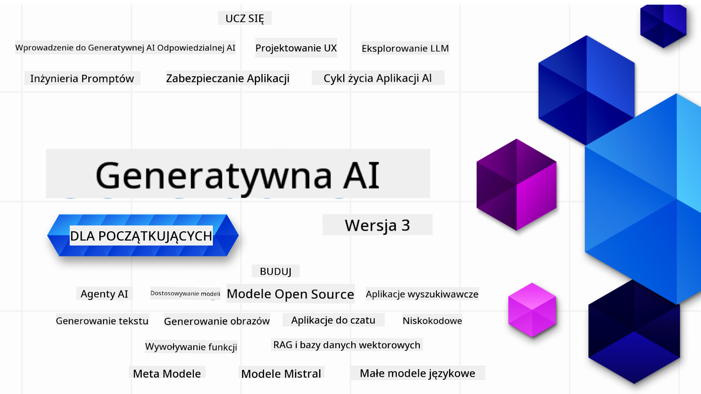

<!--
CO_OP_TRANSLATOR_METADATA:
{
  "original_hash": "ca2afa136ed9aca0634f39f51239746e",
  "translation_date": "2025-08-27T08:32:38+00:00",
  "source_file": "README.md",
  "language_code": "pl"
}
-->

### 21 lekcji uczących wszystkiego, co musisz wiedzieć, aby zacząć budować aplikacje Generative AI

### 🌐 Wsparcie dla wielu języków

#### Obsługiwane przez GitHub Action (Automatyczne i zawsze aktualne)

[French](../fr/README.md) | [Spanish](../es/README.md) | [German](../de/README.md) | [Russian](../ru/README.md) | [Arabic](../ar/README.md) | [Persian (Farsi)](../fa/README.md) | [Urdu](../ur/README.md) | [Chinese (Simplified)](../zh/README.md) | [Chinese (Traditional, Macau)](../mo/README.md) | [Chinese (Traditional, Hong Kong)](../hk/README.md) | [Chinese (Traditional, Taiwan)](../tw/README.md) | [Japanese](../ja/README.md) | [Korean](../ko/README.md) | [Hindi](../hi/README.md) | [Bengali](../bn/README.md) | [Marathi](../mr/README.md) | [Nepali](../ne/README.md) | [Punjabi (Gurmukhi)](../pa/README.md) | [Portuguese (Portugal)](../pt/README.md) | [Portuguese (Brazil)](../br/README.md) | [Italian](../it/README.md) | [Lithuanian](../lt/README.md) | [Polish](./README.md) | [Turkish](../tr/README.md) | [Greek](../el/README.md) | [Thai](../th/README.md) | [Swedish](../sv/README.md) | [Danish](../da/README.md) | [Norwegian](../no/README.md) | [Finnish](../fi/README.md) | [Dutch](../nl/README.md) | [Hebrew](../he/README.md) | [Vietnamese](../vi/README.md) | [Indonesian](../id/README.md) | [Malay](../ms/README.md) | [Tagalog (Filipino)](../tl/README.md) | [Swahili](../sw/README.md) | [Hungarian](../hu/README.md) | [Czech](../cs/README.md) | [Slovak](../sk/README.md) | [Romanian](../ro/README.md) | [Bulgarian](../bg/README.md) | [Serbian (Cyrillic)](../sr/README.md) | [Croatian](../hr/README.md) | [Slovenian](../sl/README.md) | [Ukrainian](../uk/README.md) | [Burmese (Myanmar)](../my/README.md)

# Generative AI dla Początkujących (Wersja 3) - Kurs

Poznaj podstawy budowania aplikacji Generative AI dzięki naszemu kompleksowemu kursowi składającemu się z 21 lekcji, przygotowanemu przez Microsoft Cloud Advocates.

## 🌱 Pierwsze kroki

Kurs składa się z 21 lekcji. Każda lekcja obejmuje osobny temat, więc możesz zacząć od dowolnego miejsca!

Lekcje są oznaczone jako "Learn" (nauka), które wyjaśniają koncepcję Generative AI, lub "Build" (budowanie), które zawierają zarówno wyjaśnienia koncepcji, jak i przykłady kodu w **Pythonie** oraz **TypeScript**, jeśli to możliwe.

Dla programistów .NET sprawdź [Generative AI dla Początkujących (Edycja .NET)](https://github.com/microsoft/Generative-AI-for-beginners-dotnet?WT.mc_id=academic-105485-koreyst)!

Każda lekcja zawiera również sekcję "Keep Learning" z dodatkowymi narzędziami do nauki.

## Co jest potrzebne
### Aby uruchomić kod z tego kursu, możesz użyć:
 - [Azure OpenAI Service](https://aka.ms/genai-beginners/azure-open-ai?WT.mc_id=academic-105485-koreyst) - **Lekcje:** "aoai-assignment"
 - [GitHub Marketplace Model Catalog](https://aka.ms/genai-beginners/gh-models?WT.mc_id=academic-105485-koreyst) - **Lekcje:** "githubmodels"
 - [OpenAI API](https://aka.ms/genai-beginners/open-ai?WT.mc_id=academic-105485-koreyst) - **Lekcje:** "oai-assignment" 

- Podstawowa znajomość Pythona lub TypeScript będzie pomocna - \*Dla absolutnie początkujących polecamy te kursy [Python](https://aka.ms/genai-beginners/python?WT.mc_id=academic-105485-koreyst) i [TypeScript](https://aka.ms/genai-beginners/typescript?WT.mc_id=academic-105485-koreyst)
- Konto GitHub, aby [zforkować całe repozytorium](https://aka.ms/genai-beginners/github?WT.mc_id=academic-105485-koreyst) na swoje konto GitHub

Stworzyliśmy lekcję **[Course Setup](./00-course-setup/README.md?WT.mc_id=academic-105485-koreyst)**, która pomoże Ci w konfiguracji środowiska programistycznego.

Nie zapomnij [dodać gwiazdki (🌟) do tego repozytorium](https://docs.github.com/en/get-started/exploring-projects-on-github/saving-repositories-with-stars?WT.mc_id=academic-105485-koreyst), aby łatwiej je znaleźć później.

## 🧠 Gotowy do wdrożenia?

Jeśli szukasz bardziej zaawansowanych przykładów kodu, sprawdź naszą [kolekcję przykładów kodu Generative AI](https://aka.ms/genai-beg-code?WT.mc_id=academic-105485-koreyst) w **Pythonie** i **TypeScript**.

## 🗣️ Poznaj innych uczących się, uzyskaj wsparcie

Dołącz do naszego [oficjalnego serwera Discord Azure AI Foundry](https://aka.ms/genai-discord?WT.mc_id=academic-105485-koreyst), aby spotkać się i nawiązać kontakt z innymi uczestnikami kursu oraz uzyskać wsparcie.

Zadaj pytania lub podziel się opinią o produkcie na naszym [forum dla programistów Azure AI Foundry](https://aka.ms/azureaifoundry/forum) na Github.

## 🚀 Budujesz startup?

Odwiedź [Microsoft for Startups](https://www.microsoft.com/startups), aby dowiedzieć się, jak zacząć budować z kredytami Azure już dziś.

## 🙏 Chcesz pomóc?

Masz sugestie lub znalazłeś błędy w pisowni lub kodzie? [Zgłoś problem](https://github.com/microsoft/generative-ai-for-beginners/issues?WT.mc_id=academic-105485-koreyst) lub [stwórz pull request](https://github.com/microsoft/generative-ai-for-beginners/pulls?WT.mc_id=academic-105485-koreyst)

## 📂 Każda lekcja zawiera:

- Krótkie wideo wprowadzające do tematu
- Pisemną lekcję znajdującą się w README
- Przykłady kodu w Pythonie i TypeScript wspierające Azure OpenAI oraz OpenAI API
- Linki do dodatkowych zasobów, aby kontynuować naukę

## 🗃️ Lekcje

| #   | **Link do lekcji**                                                                                                                           | **Opis**                                                                                       | **Wideo**                                                                   | **Dodatkowa nauka**                                                             |
| --- | -------------------------------------------------------------------------------------------------------------------------------------------- | --------------------------------------------------------------------------------------------- | --------------------------------------------------------------------------- | ------------------------------------------------------------------------------ |
| 00  | [Course Setup](./00-course-setup/README.md?WT.mc_id=academic-105485-koreyst)                                                                 | **Learn:** Jak skonfigurować swoje środowisko programistyczne                                  | Wideo wkrótce                                                                 | [Dowiedz się więcej](https://aka.ms/genai-collection?WT.mc_id=academic-105485-koreyst) |
| 01  | [Introduction to Generative AI and LLMs](./01-introduction-to-genai/README.md?WT.mc_id=academic-105485-koreyst)                              | **Learn:** Zrozumienie, czym jest Generative AI i jak działają modele językowe (LLMs).         | [Wideo](https://aka.ms/gen-ai-lesson-1-gh?WT.mc_id=academic-105485-koreyst) | [Dowiedz się więcej](https://aka.ms/genai-collection?WT.mc_id=academic-105485-koreyst) |
| 02  | [Exploring and comparing different LLMs](./02-exploring-and-comparing-different-llms/README.md?WT.mc_id=academic-105485-koreyst)             | **Learn:** Jak wybrać odpowiedni model dla swojego przypadku użycia                            | [Wideo](https://aka.ms/gen-ai-lesson2-gh?WT.mc_id=academic-105485-koreyst)  | [Dowiedz się więcej](https://aka.ms/genai-collection?WT.mc_id=academic-105485-koreyst) |
| 03  | [Using Generative AI Responsibly](./03-using-generative-ai-responsibly/README.md?WT.mc_id=academic-105485-koreyst)                           | **Learn:** Jak budować aplikacje Generative AI w sposób odpowiedzialny                        | [Wideo](https://aka.ms/gen-ai-lesson3-gh?WT.mc_id=academic-105485-koreyst)  | [Dowiedz się więcej](https://aka.ms/genai-collection?WT.mc_id=academic-105485-koreyst) |
| 04  | [Understanding Prompt Engineering Fundamentals](./04-prompt-engineering-fundamentals/README.md?WT.mc_id=academic-105485-koreyst)             | **Learn:** Praktyczne najlepsze praktyki w projektowaniu promptów                             | [Wideo](https://aka.ms/gen-ai-lesson4-gh?WT.mc_id=academic-105485-koreyst)  | [Dowiedz się więcej](https://aka.ms/genai-collection?WT.mc_id=academic-105485-koreyst) |
| 05  | [Creating Advanced Prompts](./05-advanced-prompts/README.md?WT.mc_id=academic-105485-koreyst)                                                | **Learn:** Jak stosować techniki projektowania promptów, które poprawiają wyniki               | [Wideo](https://aka.ms/gen-ai-lesson5-gh?WT.mc_id=academic-105485-koreyst)  | [Dowiedz się więcej](https://aka.ms/genai-collection?WT.mc_id=academic-105485-koreyst) |
| 06  | [Tworzenie aplikacji generujących tekst](./06-text-generation-apps/README.md?WT.mc_id=academic-105485-koreyst)                                | **Buduj:** Aplikację generującą tekst za pomocą Azure OpenAI / OpenAI API                        | [Wideo](https://aka.ms/gen-ai-lesson6-gh?WT.mc_id=academic-105485-koreyst)  | [Dowiedz się więcej](https://aka.ms/genai-collection?WT.mc_id=academic-105485-koreyst) |
| 07  | [Tworzenie aplikacji czatowych](./07-building-chat-applications/README.md?WT.mc_id=academic-105485-koreyst)                                  | **Buduj:** Techniki efektywnego tworzenia i integracji aplikacji czatowych                      | [Wideo](https://aka.ms/gen-ai-lessons7-gh?WT.mc_id=academic-105485-koreyst) | [Dowiedz się więcej](https://aka.ms/genai-collection?WT.mc_id=academic-105485-koreyst) |
| 08  | [Tworzenie aplikacji wyszukiwarki z bazami danych wektorowych](./08-building-search-applications/README.md?WT.mc_id=academic-105485-koreyst) | **Buduj:** Aplikację wyszukiwarki wykorzystującą Embeddings do wyszukiwania danych              | [Wideo](https://aka.ms/gen-ai-lesson8-gh?WT.mc_id=academic-105485-koreyst)  | [Dowiedz się więcej](https://aka.ms/genai-collection?WT.mc_id=academic-105485-koreyst) |
| 09  | [Tworzenie aplikacji generujących obrazy](./09-building-image-applications/README.md?WT.mc_id=academic-105485-koreyst)                       | **Buduj:** Aplikację generującą obrazy                                                          | [Wideo](https://aka.ms/gen-ai-lesson9-gh?WT.mc_id=academic-105485-koreyst)  | [Dowiedz się więcej](https://aka.ms/genai-collection?WT.mc_id=academic-105485-koreyst) |
| 10  | [Tworzenie aplikacji AI bez kodowania](./10-building-low-code-ai-applications/README.md?WT.mc_id=academic-105485-koreyst)                    | **Buduj:** Aplikację Generative AI za pomocą narzędzi Low Code                                  | [Wideo](https://aka.ms/gen-ai-lesson10-gh?WT.mc_id=academic-105485-koreyst) | [Dowiedz się więcej](https://aka.ms/genai-collection?WT.mc_id=academic-105485-koreyst) |
| 11  | [Integracja aplikacji z wywoływaniem funkcji](./11-integrating-with-function-calling/README.md?WT.mc_id=academic-105485-koreyst)             | **Buduj:** Czym jest wywoływanie funkcji i jak je wykorzystać w aplikacjach                     | [Wideo](https://aka.ms/gen-ai-lesson11-gh?WT.mc_id=academic-105485-koreyst) | [Dowiedz się więcej](https://aka.ms/genai-collection?WT.mc_id=academic-105485-koreyst) |
| 12  | [Projektowanie UX dla aplikacji AI](./12-designing-ux-for-ai-applications/README.md?WT.mc_id=academic-105485-koreyst)                        | **Ucz się:** Jak stosować zasady projektowania UX podczas tworzenia aplikacji Generative AI     | [Wideo](https://aka.ms/gen-ai-lesson12-gh?WT.mc_id=academic-105485-koreyst) | [Dowiedz się więcej](https://aka.ms/genai-collection?WT.mc_id=academic-105485-koreyst) |
| 13  | [Zabezpieczanie aplikacji Generative AI](./13-securing-ai-applications/README.md?WT.mc_id=academic-105485-koreyst)                           | **Ucz się:** Zagrożenia i ryzyka dla systemów AI oraz metody ich zabezpieczania                 | [Wideo](https://aka.ms/gen-ai-lesson13-gh?WT.mc_id=academic-105485-koreyst) | [Dowiedz się więcej](https://aka.ms/genai-collection?WT.mc_id=academic-105485-koreyst) |
| 14  | [Cykl życia aplikacji Generative AI](./14-the-generative-ai-application-lifecycle/README.md?WT.mc_id=academic-105485-koreyst)                | **Ucz się:** Narzędzia i metryki do zarządzania cyklem życia LLM i LLMOps                       | [Wideo](https://aka.ms/gen-ai-lesson14-gh?WT.mc_id=academic-105485-koreyst) | [Dowiedz się więcej](https://aka.ms/genai-collection?WT.mc_id=academic-105485-koreyst) |
| 15  | [Retrieval Augmented Generation (RAG) i bazy danych wektorowych](./15-rag-and-vector-databases/README.md?WT.mc_id=academic-105485-koreyst)   | **Buduj:** Aplikację wykorzystującą framework RAG do pobierania embeddings z baz danych wektorowych | [Wideo](https://aka.ms/gen-ai-lesson15-gh?WT.mc_id=academic-105485-koreyst) | [Dowiedz się więcej](https://aka.ms/genai-collection?WT.mc_id=academic-105485-koreyst) |
| 16  | [Modele open source i Hugging Face](./16-open-source-models/README.md?WT.mc_id=academic-105485-koreyst)                                      | **Buduj:** Aplikację wykorzystującą modele open source dostępne na Hugging Face                 | [Wideo](https://aka.ms/gen-ai-lesson16-gh?WT.mc_id=academic-105485-koreyst) | [Dowiedz się więcej](https://aka.ms/genai-collection?WT.mc_id=academic-105485-koreyst) |
| 17  | [Agent AI](./17-ai-agents/README.md?WT.mc_id=academic-105485-koreyst)                                                                        | **Buduj:** Aplikację wykorzystującą framework Agent AI                                          | [Wideo](https://aka.ms/gen-ai-lesson17-gh?WT.mc_id=academic-105485-koreyst) | [Dowiedz się więcej](https://aka.ms/genai-collection?WT.mc_id=academic-105485-koreyst) |
| 18  | [Dostosowywanie LLM](./18-fine-tuning/README.md?WT.mc_id=academic-105485-koreyst)                                                            | **Ucz się:** Czym jest dostosowywanie LLM, dlaczego i jak to robić                              | [Wideo](https://aka.ms/gen-ai-lesson18-gh?WT.mc_id=academic-105485-koreyst) | [Dowiedz się więcej](https://aka.ms/genai-collection?WT.mc_id=academic-105485-koreyst) |
| 19  | [Tworzenie z SLM](./19-slm/README.md?WT.mc_id=academic-105485-koreyst)                                                                       | **Ucz się:** Korzyści z tworzenia z wykorzystaniem Small Language Models                        | Wideo wkrótce | [Dowiedz się więcej](https://aka.ms/genai-collection?WT.mc_id=academic-105485-koreyst) |
| 20  | [Tworzenie z modelami Mistral](./20-mistral/README.md?WT.mc_id=academic-105485-koreyst)                                                      | **Ucz się:** Funkcje i różnice modeli z rodziny Mistral                                         | Wideo wkrótce | [Dowiedz się więcej](https://aka.ms/genai-collection?WT.mc_id=academic-105485-koreyst) |
| 21  | [Tworzenie z modelami Meta](./21-meta/README.md?WT.mc_id=academic-105485-koreyst)                                                            | **Ucz się:** Funkcje i różnice modeli z rodziny Meta                                            | Wideo wkrótce | [Dowiedz się więcej](https://aka.ms/genai-collection?WT.mc_id=academic-105485-koreyst) |

### 🌟 Specjalne podziękowania

Specjalne podziękowania dla [**Johna Aziza**](https://www.linkedin.com/in/john0isaac/) za stworzenie wszystkich GitHub Actions i workflowów.

[**Bernhardowi Merkle**](https://www.linkedin.com/in/bernhard-merkle-738b73/) za kluczowy wkład w każdą lekcję, poprawiający doświadczenie użytkownika i kodu.

## 🎒 Inne kursy

Nasz zespół tworzy inne kursy! Sprawdź:

- [**NOWOŚĆ** Protokół kontekstu modelu dla początkujących](https://github.com/microsoft/mcp-for-beginners)
- [Agent AI dla początkujących](https://github.com/microsoft/ai-agents-for-beginners)
- [Generative AI dla początkujących z użyciem .NET](https://github.com/microsoft/Generative-AI-for-beginners-dotnet)
- [Generative AI dla początkujących z użyciem JavaScript](https://aka.ms/genai-js-course)
- [Generative AI dla początkujących z użyciem Java](https://aka.ms/genaijava)
- [ML dla początkujących](https://aka.ms/ml-beginners)
- [Data Science dla początkujących](https://aka.ms/datascience-beginners)
- [AI dla początkujących](https://aka.ms/ai-beginners)
- [Cyberbezpieczeństwo dla początkujących](https://github.com/microsoft/Security-101)
- [Web Dev dla początkujących](https://aka.ms/webdev-beginners)
- [IoT dla początkujących](https://aka.ms/iot-beginners)
- [XR Development dla początkujących](https://github.com/microsoft/xr-development-for-beginners)
- [Opanowanie GitHub Copilot dla programowania w parach z AI](https://aka.ms/GitHubCopilotAI)
- [Opanowanie GitHub Copilot dla programistów C#/.NET](https://github.com/microsoft/mastering-github-copilot-for-dotnet-csharp-developers)
- [Wybierz swoją własną przygodę z Copilotem](https://github.com/microsoft/CopilotAdventures)

---

**Zastrzeżenie**:  
Ten dokument został przetłumaczony za pomocą usługi tłumaczeniowej AI [Co-op Translator](https://github.com/Azure/co-op-translator). Chociaż dokładamy wszelkich starań, aby tłumaczenie było precyzyjne, prosimy pamiętać, że automatyczne tłumaczenia mogą zawierać błędy lub nieścisłości. Oryginalny dokument w jego rodzimym języku powinien być uznawany za wiarygodne źródło. W przypadku informacji krytycznych zaleca się skorzystanie z profesjonalnego tłumaczenia wykonanego przez człowieka. Nie ponosimy odpowiedzialności za jakiekolwiek nieporozumienia lub błędne interpretacje wynikające z korzystania z tego tłumaczenia.