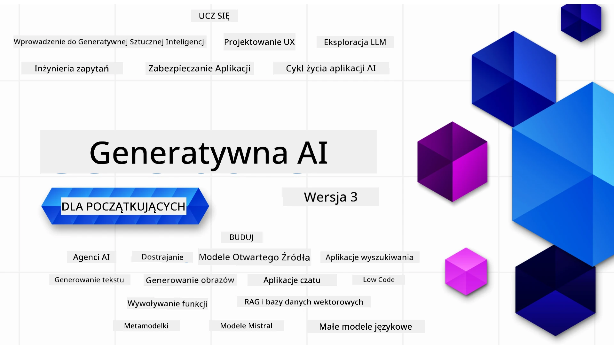

### 21 lekcji uczących wszystkiego, co musisz wiedzieć, aby zacząć tworzyć aplikacje Generative AI

[](https://github.com/microsoft/Generative-AI-For-Beginners/blob/master/LICENSE?WT.mc_id=academic-105485-koreyst)
[](https://GitHub.com/microsoft/Generative-AI-For-Beginners/graphs/contributors/?WT.mc_id=academic-105485-koreyst)
[](https://GitHub.com/microsoft/Generative-AI-For-Beginners/issues/?WT.mc_id=academic-105485-koreyst)
[](https://GitHub.com/microsoft/Generative-AI-For-Beginners/pulls/?WT.mc_id=academic-105485-koreyst)
[](http://makeapullrequest.com?WT.mc_id=academic-105485-koreyst)

[](https://GitHub.com/microsoft/Generative-AI-For-Beginners/watchers/?WT.mc_id=academic-105485-koreyst)
[](https://GitHub.com/microsoft/Generative-AI-For-Beginners/network/?WT.mc_id=academic-105485-koreyst)
[](https://GitHub.com/microsoft/Generative-AI-For-Beginners/stargazers/?WT.mc_id=academic-105485-koreyst)

[](https://discord.gg/nTYy5BXMWG)

### 🌐 Obsługa wielu języków

#### Wsparcie przez GitHub Action (automatyczne i zawsze aktualne)

<!-- CO-OP TRANSLATOR LANGUAGES TABLE START -->
[Arabic](../ar/README.md) | [Bengali](../bn/README.md) | [Bulgarian](../bg/README.md) | [Burmese (Myanmar)](../my/README.md) | [Chinese (Simplified)](../zh-CN/README.md) | [Chinese (Traditional, Hong Kong)](../zh-HK/README.md) | [Chinese (Traditional, Macau)](../zh-MO/README.md) | [Chinese (Traditional, Taiwan)](../zh-TW/README.md) | [Croatian](../hr/README.md) | [Czech](../cs/README.md) | [Danish](../da/README.md) | [Dutch](../nl/README.md) | [Estonian](../et/README.md) | [Finnish](../fi/README.md) | [French](../fr/README.md) | [German](../de/README.md) | [Greek](../el/README.md) | [Hebrew](../he/README.md) | [Hindi](../hi/README.md) | [Hungarian](../hu/README.md) | [Indonesian](../id/README.md) | [Italian](../it/README.md) | [Japanese](../ja/README.md) | [Kannada](../kn/README.md) | [Khmer](../km/README.md) | [Korean](../ko/README.md) | [Lithuanian](../lt/README.md) | [Malay](../ms/README.md) | [Malayalam](../ml/README.md) | [Marathi](../mr/README.md) | [Nepali](../ne/README.md) | [Nigerian Pidgin](../pcm/README.md) | [Norwegian](../no/README.md) | [Persian (Farsi)](../fa/README.md) | [Polish](./README.md) | [Portuguese (Brazil)](../pt-BR/README.md) | [Portuguese (Portugal)](../pt-PT/README.md) | [Punjabi (Gurmukhi)](../pa/README.md) | [Romanian](../ro/README.md) | [Russian](../ru/README.md) | [Serbian (Cyrillic)](../sr/README.md) | [Slovak](../sk/README.md) | [Slovenian](../sl/README.md) | [Spanish](../es/README.md) | [Swahili](../sw/README.md) | [Swedish](../sv/README.md) | [Tagalog (Filipino)](../tl/README.md) | [Tamil](../ta/README.md) | [Telugu](../te/README.md) | [Thai](../th/README.md) | [Turkish](../tr/README.md) | [Ukrainian](../uk/README.md) | [Urdu](../ur/README.md) | [Vietnamese](../vi/README.md)

> **Wolisz klonować lokalnie?**
>
> To repozytorium zawiera tłumaczenia na ponad 50 języków, co znacząco zwiększa rozmiar pobierania. Aby sklonować bez tłumaczeń, użyj sparse checkout:
>
> **Bash / macOS / Linux:**
> ```bash
> git clone --filter=blob:none --sparse https://github.com/microsoft/generative-ai-for-beginners.git
> cd generative-ai-for-beginners
> git sparse-checkout set --no-cone '/*' '!translations' '!translated_images'
> ```
>
> **CMD (Windows):**
> ```cmd
> git clone --filter=blob:none --sparse https://github.com/microsoft/generative-ai-for-beginners.git
> cd generative-ai-for-beginners
> git sparse-checkout set --no-cone "/*" "!translations" "!translated_images"
> ```
>
> To zapewnia wszystko, czego potrzebujesz, aby ukończyć kurs z dużo szybszym pobieraniem.
<!-- CO-OP TRANSLATOR LANGUAGES TABLE END -->

# Generative AI dla początkujących (wersja 3) - Kurs

Poznaj podstawy tworzenia aplikacji Generative AI dzięki naszemu kompleksowemu kursowi z 21 lekcjami prowadzonym przez Microsoft Cloud Advocates.

## 🌱 Zacznij

Ten kurs składa się z 21 lekcji. Każda lekcja omawia inny temat, więc zacznij tam, gdzie chcesz!

Lekcje są oznaczone jako "Learn" – wyjaśniające koncepcję Generative AI lub "Build" – wyjaśniające koncept i przykłady kodu w **Python** i **TypeScript**, jeśli to możliwe.

Dla programistów .NET zapoznaj się z [Generative AI for Beginners (.NET Edition)](https://github.com/microsoft/Generative-AI-for-beginners-dotnet?WT.mc_id=academic-105485-koreyst)!

Każda lekcja zawiera także sekcję "Keep Learning" z dodatkowymi materiałami do nauki.

## Czego potrzebujesz
### Aby uruchomić kod z tego kursu możesz użyć:
 - [Azure OpenAI Service](https://aka.ms/genai-beginners/azure-open-ai?WT.mc_id=academic-105485-koreyst) - **Lekcje:** "aoai-assignment"
 - [GitHub Marketplace Model Catalog](https://aka.ms/genai-beginners/gh-models?WT.mc_id=academic-105485-koreyst) - **Lekcje:** "githubmodels"
 - [OpenAI API](https://aka.ms/genai-beginners/open-ai?WT.mc_id=academic-105485-koreyst) - **Lekcje:** "oai-assignment" 
   
- Podstawowa znajomość Pythona lub TypeScript będzie pomocna – \*dla zupełnych początkujących sprawdź te kursy [Python](https://aka.ms/genai-beginners/python?WT.mc_id=academic-105485-koreyst) i [TypeScript](https://aka.ms/genai-beginners/typescript?WT.mc_id=academic-105485-koreyst)
- Konto GitHub, aby [własnoręcznie zforkować całe repozytorium](https://aka.ms/genai-beginners/github?WT.mc_id=academic-105485-koreyst)

Stworzyliśmy lekcję **[Konfiguracja kursu](./00-course-setup/README.md?WT.mc_id=academic-105485-koreyst)**, która pomoże Ci skonfigurować środowisko programistyczne.

Nie zapomnij [dać gwiazdki (🌟) temu repozytorium](https://docs.github.com/en/get-started/exploring-projects-on-github/saving-repositories-with-stars?WT.mc_id=academic-105485-koreyst), aby łatwiej je znaleźć później.

## 🧠 Gotowy do wdrożenia?

Jeśli szukasz bardziej zaawansowanych przykładów kodu, sprawdź naszą [kolekcję przykładów kodu Generative AI](https://aka.ms/genai-beg-code?WT.mc_id=academic-105485-koreyst) w **Python** i **TypeScript**.

## 🗣️ Poznaj innych uczniów, uzyskaj wsparcie

Dołącz do naszego [oficjalnego serwera Discord Azure AI Foundry](https://aka.ms/genai-discord?WT.mc_id=academic-105485-koreyst), aby spotkać i nawiązać kontakty z innymi uczniami tego kursu oraz uzyskać wsparcie.

Zadaj pytania lub podziel się opinią o produkcie na naszym [forum dla programistów Azure AI Foundry](https://aka.ms/azureaifoundry/forum) na Github.

## 🚀 Budujesz startup?

Odwiedź [Microsoft for Startups](https://www.microsoft.com/startups), aby dowiedzieć się, jak zacząć korzystać z kredytów Azure już dziś.

## 🙏 Chcesz pomóc?

Masz sugestie lub znalazłeś błędy ortograficzne albo w kodzie? [Zgłoś problem](https://github.com/microsoft/generative-ai-for-beginners/issues?WT.mc_id=academic-105485-koreyst) lub [stwórz pull request](https://github.com/microsoft/generative-ai-for-beginners/pulls?WT.mc_id=academic-105485-koreyst)

## 📂 Każda lekcja zawiera:

- Krótkie wideo wprowadzające do tematu
- Pisemną lekcję dostępną w README
- Przykłady kodu w Python i TypeScript wspierające Azure OpenAI oraz OpenAI API
- Linki do dodatkowych zasobów do dalszej nauki

## 🗃️ Lekcje

| #   | **Link do lekcji**                                                                                                                          | **Opis**                                                                                      | **Wideo**                                                                   | **Dodatkowa nauka**                                                            |
| --- | -------------------------------------------------------------------------------------------------------------------------------------------- | --------------------------------------------------------------------------------------------- | --------------------------------------------------------------------------- | ------------------------------------------------------------------------------ |
| 00  | [Konfiguracja kursu](./00-course-setup/README.md?WT.mc_id=academic-105485-koreyst)                                                            | **Nauka:** Jak skonfigurować środowisko programistyczne                                      | Wideo wkrótce                                                                | [Dowiedz się więcej](https://aka.ms/genai-collection?WT.mc_id=academic-105485-koreyst) |
| 01  | [Wprowadzenie do Generative AI oraz LLM](./01-introduction-to-genai/README.md?WT.mc_id=academic-105485-koreyst)                                | **Nauka:** Zrozumienie czym jest Generative AI i jak działają duże modele językowe (LLM)      | [Wideo](https://aka.ms/gen-ai-lesson-1-gh?WT.mc_id=academic-105485-koreyst) | [Dowiedz się więcej](https://aka.ms/genai-collection?WT.mc_id=academic-105485-koreyst) |
| 02  | [Badanie i porównywanie różnych LLM](./02-exploring-and-comparing-different-llms/README.md?WT.mc_id=academic-105485-koreyst)                     | **Nauka:** Jak wybrać odpowiedni model do swojego zastosowania                               | [Wideo](https://aka.ms/gen-ai-lesson2-gh?WT.mc_id=academic-105485-koreyst)  | [Dowiedz się więcej](https://aka.ms/genai-collection?WT.mc_id=academic-105485-koreyst) |
| 03  | [Odpowiedzialne korzystanie z Generative AI](./03-using-generative-ai-responsibly/README.md?WT.mc_id=academic-105485-koreyst)                      | **Nauka:** Jak budować aplikacje Generative AI w sposób odpowiedzialny                        | [Wideo](https://aka.ms/gen-ai-lesson3-gh?WT.mc_id=academic-105485-koreyst)  | [Dowiedz się więcej](https://aka.ms/genai-collection?WT.mc_id=academic-105485-koreyst) |
| 04  | [Zrozumienie podstaw inżynierii promptów](./04-prompt-engineering-fundamentals/README.md?WT.mc_id=academic-105485-koreyst)                  | **Naucz się:** Praktyczne najlepsze praktyki inżynierii promptów                                   | [Video](https://aka.ms/gen-ai-lesson4-gh?WT.mc_id=academic-105485-koreyst)  | [Dowiedz się więcej](https://aka.ms/genai-collection?WT.mc_id=academic-105485-koreyst) |
| 05  | [Tworzenie zaawansowanych promptów](./05-advanced-prompts/README.md?WT.mc_id=academic-105485-koreyst)                                           | **Naucz się:** Jak zastosować techniki inżynierii promptów, które poprawiają wyniki Twoich promptów. | [Video](https://aka.ms/gen-ai-lesson5-gh?WT.mc_id=academic-105485-koreyst)  | [Dowiedz się więcej](https://aka.ms/genai-collection?WT.mc_id=academic-105485-koreyst) |
| 06  | [Tworzenie aplikacji do generowania tekstu](./06-text-generation-apps/README.md?WT.mc_id=academic-105485-koreyst)                                | **Buduj:** Aplikację do generowania tekstu wykorzystującą Azure OpenAI / OpenAI API              | [Video](https://aka.ms/gen-ai-lesson6-gh?WT.mc_id=academic-105485-koreyst)  | [Dowiedz się więcej](https://aka.ms/genai-collection?WT.mc_id=academic-105485-koreyst) |
| 07  | [Tworzenie aplikacji czatu](./07-building-chat-applications/README.md?WT.mc_id=academic-105485-koreyst)                                           | **Buduj:** Techniki efektywnego tworzenia i integrowania aplikacji czatu.                         | [Video](https://aka.ms/gen-ai-lessons7-gh?WT.mc_id=academic-105485-koreyst) | [Dowiedz się więcej](https://aka.ms/genai-collection?WT.mc_id=academic-105485-koreyst) |
| 08  | [Tworzenie aplikacji wyszukiwania z bazami danych wektorowych](./08-building-search-applications/README.md?WT.mc_id=academic-105485-koreyst)      | **Buduj:** Aplikację wyszukującą dane z wykorzystaniem Embeddings.                               | [Video](https://aka.ms/gen-ai-lesson8-gh?WT.mc_id=academic-105485-koreyst)  | [Dowiedz się więcej](https://aka.ms/genai-collection?WT.mc_id=academic-105485-koreyst) |
| 09  | [Tworzenie aplikacji do generowania obrazów](./09-building-image-applications/README.md?WT.mc_id=academic-105485-koreyst)                          | **Buduj:** Aplikację do generowania obrazów                                                     | [Video](https://aka.ms/gen-ai-lesson9-gh?WT.mc_id=academic-105485-koreyst)  | [Dowiedz się więcej](https://aka.ms/genai-collection?WT.mc_id=academic-105485-koreyst) |
| 10  | [Tworzenie niskokodowych aplikacji AI](./10-building-low-code-ai-applications/README.md?WT.mc_id=academic-105485-koreyst)                         | **Buduj:** Aplikację Generatywnej AI z wykorzystaniem narzędzi Low Code                          | [Video](https://aka.ms/gen-ai-lesson10-gh?WT.mc_id=academic-105485-koreyst) | [Dowiedz się więcej](https://aka.ms/genai-collection?WT.mc_id=academic-105485-koreyst) |
| 11  | [Integracja zewnętrznych aplikacji z wywoływaniem funkcji](./11-integrating-with-function-calling/README.md?WT.mc_id=academic-105485-koreyst)      | **Buduj:** Czym jest wywoływanie funkcji i zastosowania tej metody w aplikacjach                  | [Video](https://aka.ms/gen-ai-lesson11-gh?WT.mc_id=academic-105485-koreyst) | [Dowiedz się więcej](https://aka.ms/genai-collection?WT.mc_id=academic-105485-koreyst) |
| 12  | [Projektowanie UX dla aplikacji AI](./12-designing-ux-for-ai-applications/README.md?WT.mc_id=academic-105485-koreyst)                              | **Naucz się:** Jak stosować zasady projektowania UX podczas tworzenia aplikacji Generatywnej AI   | [Video](https://aka.ms/gen-ai-lesson12-gh?WT.mc_id=academic-105485-koreyst) | [Dowiedz się więcej](https://aka.ms/genai-collection?WT.mc_id=academic-105485-koreyst) |
| 13  | [Zabezpieczanie swoich aplikacji Generatywnej AI](./13-securing-ai-applications/README.md?WT.mc_id=academic-105485-koreyst)                       | **Naucz się:** Zagrożenia i ryzyka dla systemów AI oraz metody ich zabezpieczania                  | [Video](https://aka.ms/gen-ai-lesson13-gh?WT.mc_id=academic-105485-koreyst) | [Dowiedz się więcej](https://aka.ms/genai-collection?WT.mc_id=academic-105485-koreyst) |
| 14  | [Cykl życia aplikacji Generatywnej AI](./14-the-generative-ai-application-lifecycle/README.md?WT.mc_id=academic-105485-koreyst)                   | **Naucz się:** Narzędzia i wskaźniki do zarządzania cyklem życia LLM i LLMOps                    | [Video](https://aka.ms/gen-ai-lesson14-gh?WT.mc_id=academic-105485-koreyst) | [Dowiedz się więcej](https://aka.ms/genai-collection?WT.mc_id=academic-105485-koreyst) |
| 15  | [Retrieval Augmented Generation (RAG) i bazy danych wektorowych](./15-rag-and-vector-databases/README.md?WT.mc_id=academic-105485-koreyst)         | **Buduj:** Aplikację używającą frameworku RAG do pobierania embeddings z baz danych wektorowych  | [Video](https://aka.ms/gen-ai-lesson15-gh?WT.mc_id=academic-105485-koreyst) | [Dowiedz się więcej](https://aka.ms/genai-collection?WT.mc_id=academic-105485-koreyst) |
| 16  | [Modele Open Source i Hugging Face](./16-open-source-models/README.md?WT.mc_id=academic-105485-koreyst)                                          | **Buduj:** Aplikację wykorzystującą modele open source dostępne na Hugging Face                  | [Video](https://aka.ms/gen-ai-lesson16-gh?WT.mc_id=academic-105485-koreyst) | [Dowiedz się więcej](https://aka.ms/genai-collection?WT.mc_id=academic-105485-koreyst) |
| 17  | [Agenci AI](./17-ai-agents/README.md?WT.mc_id=academic-105485-koreyst)                                                                           | **Buduj:** Aplikację używającą frameworku AI Agent                                              | [Video](https://aka.ms/gen-ai-lesson17-gh?WT.mc_id=academic-105485-koreyst) | [Dowiedz się więcej](https://aka.ms/genai-collection?WT.mc_id=academic-105485-koreyst) |
| 18  | [Fine-Tuning LLMs](./18-fine-tuning/README.md?WT.mc_id=academic-105485-koreyst)                                                                  | **Naucz się:** Co to jest, dlaczego i jak wykonywać fine-tuning LLM                               | [Video](https://aka.ms/gen-ai-lesson18-gh?WT.mc_id=academic-105485-koreyst) | [Dowiedz się więcej](https://aka.ms/genai-collection?WT.mc_id=academic-105485-koreyst) |
| 19  | [Budowanie z SLMs](./19-slm/README.md?WT.mc_id=academic-105485-koreyst)                                                                          | **Naucz się:** Korzyści z budowania za pomocą Small Language Models                              | Wideo wkrótce | [Dowiedz się więcej](https://aka.ms/genai-collection?WT.mc_id=academic-105485-koreyst) |
| 20  | [Budowanie z modelami Mistral](./20-mistral/README.md?WT.mc_id=academic-105485-koreyst)                                                          | **Naucz się:** Cechy i różnice modeli rodziny Mistral                                          | Wideo wkrótce | [Dowiedz się więcej](https://aka.ms/genai-collection?WT.mc_id=academic-105485-koreyst) |
| 21  | [Budowanie z modelami Meta](./21-meta/README.md?WT.mc_id=academic-105485-koreyst)                                                                | **Naucz się:** Cechy i różnice modeli rodziny Meta                                            | Wideo wkrótce | [Dowiedz się więcej](https://aka.ms/genai-collection?WT.mc_id=academic-105485-koreyst) |

### 🌟 Szczególne podziękowania

Szczególne podziękowania dla [**John Aziz**](https://www.linkedin.com/in/john0isaac/) za stworzenie wszystkich działań i przepływów pracy GitHub Actions

[**Bernhard Merkle**](https://www.linkedin.com/in/bernhard-merkle-738b73/) za kluczowe wkłady w każdą lekcję, które poprawiają doświadczenia ucznia i kodu.

## 🎒 Inne kursy

Nasz zespół produkuje także inne kursy! Sprawdź:

<!-- CO-OP TRANSLATOR OTHER COURSES START -->
### LangChain
[](https://aka.ms/langchain4j-for-beginners)
[](https://aka.ms/langchainjs-for-beginners?WT.mc_id=m365-94501-dwahlin)
[](https://github.com/microsoft/langchain-for-beginners?WT.mc_id=m365-94501-dwahlin)
---

### Azure / Edge / MCP / Agenci
[](https://github.com/microsoft/AZD-for-beginners?WT.mc_id=academic-105485-koreyst)
[](https://github.com/microsoft/edgeai-for-beginners?WT.mc_id=academic-105485-koreyst)
[](https://github.com/microsoft/mcp-for-beginners?WT.mc_id=academic-105485-koreyst)
[](https://github.com/microsoft/ai-agents-for-beginners?WT.mc_id=academic-105485-koreyst)

---
 
### Seria Generatywnej AI
[](https://github.com/microsoft/generative-ai-for-beginners?WT.mc_id=academic-105485-koreyst)
[-9333EA?style=for-the-badge&labelColor=E5E7EB&color=9333EA)](https://github.com/microsoft/Generative-AI-for-beginners-dotnet?WT.mc_id=academic-105485-koreyst)
[-C084FC?style=for-the-badge&labelColor=E5E7EB&color=C084FC)](https://github.com/microsoft/generative-ai-for-beginners-java?WT.mc_id=academic-105485-koreyst)
[-E879F9?style=for-the-badge&labelColor=E5E7EB&color=E879F9)](https://github.com/microsoft/generative-ai-with-javascript?WT.mc_id=academic-105485-koreyst)

---
 
### Podstawowe Nauczanie
[](https://aka.ms/ml-beginners?WT.mc_id=academic-105485-koreyst)
[](https://aka.ms/datascience-beginners?WT.mc_id=academic-105485-koreyst)
[](https://aka.ms/ai-beginners?WT.mc_id=academic-105485-koreyst)
[](https://github.com/microsoft/Security-101?WT.mc_id=academic-96948-sayoung)
[](https://aka.ms/webdev-beginners?WT.mc_id=academic-105485-koreyst)
[](https://aka.ms/iot-beginners?WT.mc_id=academic-105485-koreyst)
[](https://github.com/microsoft/xr-development-for-beginners?WT.mc_id=academic-105485-koreyst)

---
 
### Seria Copilot
[](https://aka.ms/GitHubCopilotAI?WT.mc_id=academic-105485-koreyst)
[](https://github.com/microsoft/mastering-github-copilot-for-dotnet-csharp-developers?WT.mc_id=academic-105485-koreyst)
[](https://github.com/microsoft/CopilotAdventures?WT.mc_id=academic-105485-koreyst)
<!-- CO-OP TRANSLATOR OTHER COURSES END -->

## Uzyskiwanie Pomocy

Jeśli utkniesz lub masz pytania dotyczące tworzenia aplikacji AI. Dołącz do innych uczących się oraz doświadczonych programistów w dyskusjach o MCP. To wspierająca społeczność, gdzie pytania są mile widziane, a wiedza jest swobodnie dzielona.

[](https://discord.gg/nTYy5BXMWG)

Jeśli masz opinie o produkcie lub napotkasz błędy podczas tworzenia, odwiedź:

[](https://aka.ms/foundry/forum)

---

<!-- CO-OP TRANSLATOR DISCLAIMER START -->
**Zastrzeżenie**:  
Niniejszy dokument został przetłumaczony za pomocą usługi tłumaczenia AI [Co-op Translator](https://github.com/Azure/co-op-translator). Chociaż dążymy do dokładności, prosimy pamiętać, że automatyczne tłumaczenia mogą zawierać błędy lub niedokładności. Oryginalny dokument w jego języku źródłowym należy traktować jako autorytatywne źródło. W przypadku istotnych informacji zalecane jest skorzystanie z profesjonalnego tłumaczenia wykonanego przez człowieka. Nie ponosimy odpowiedzialności za wszelkie nieporozumienia lub błędne interpretacje wynikające z użytkowania tego tłumaczenia.
<!-- CO-OP TRANSLATOR DISCLAIMER END -->