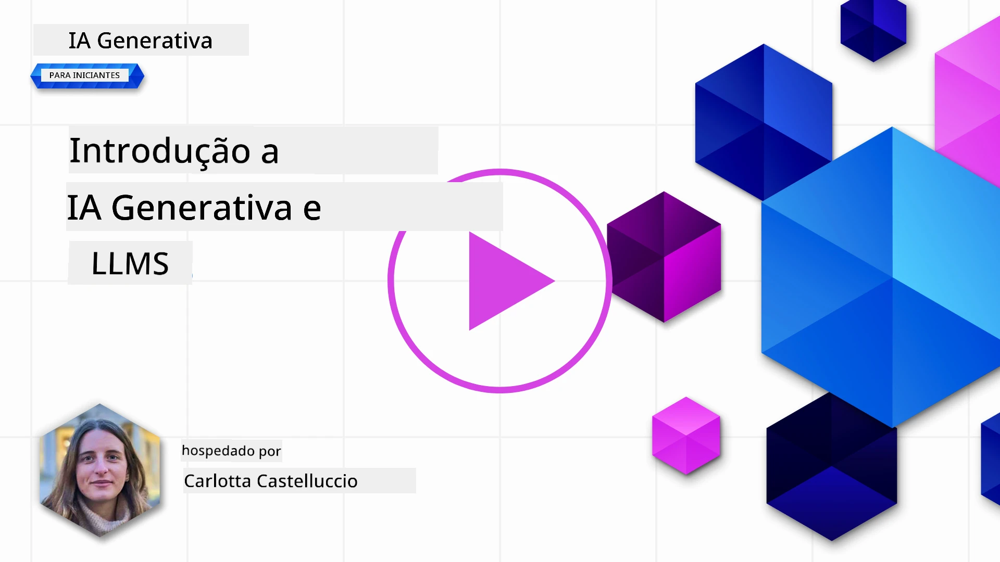
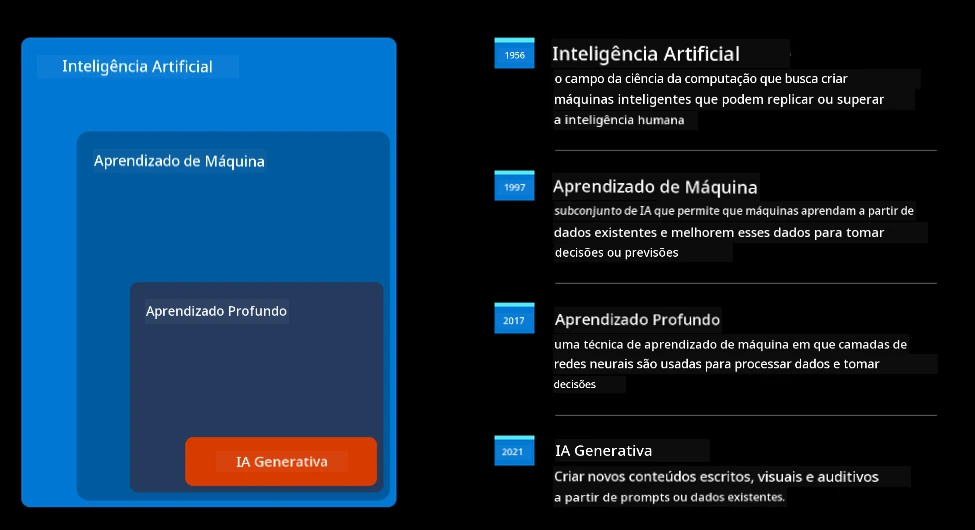
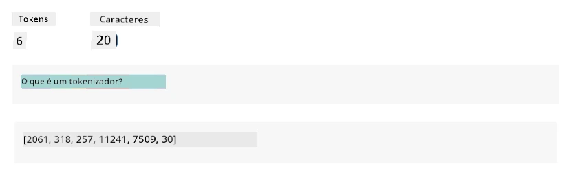
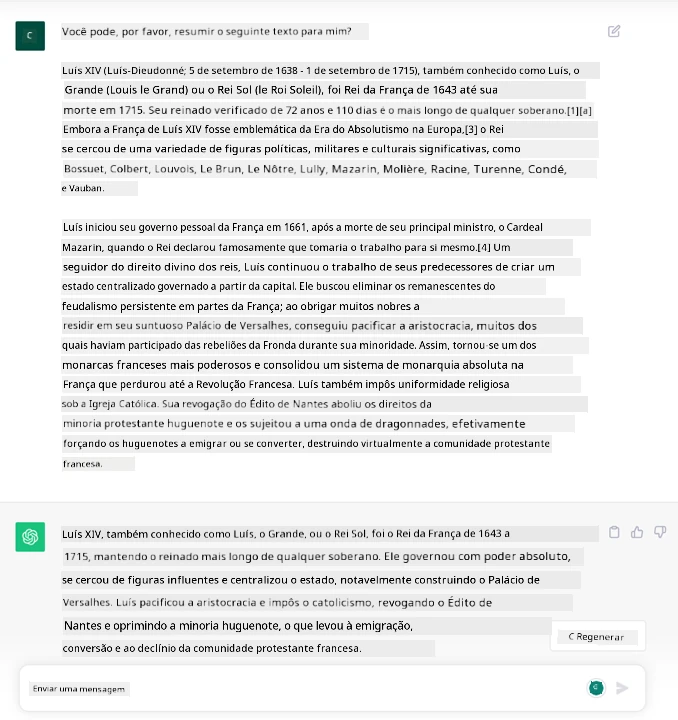
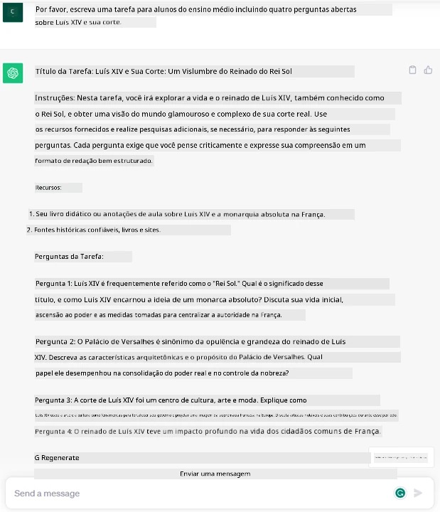
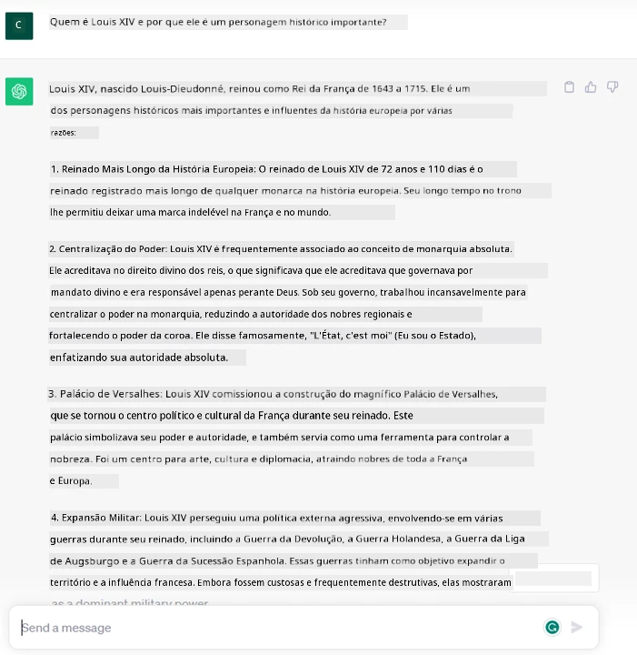
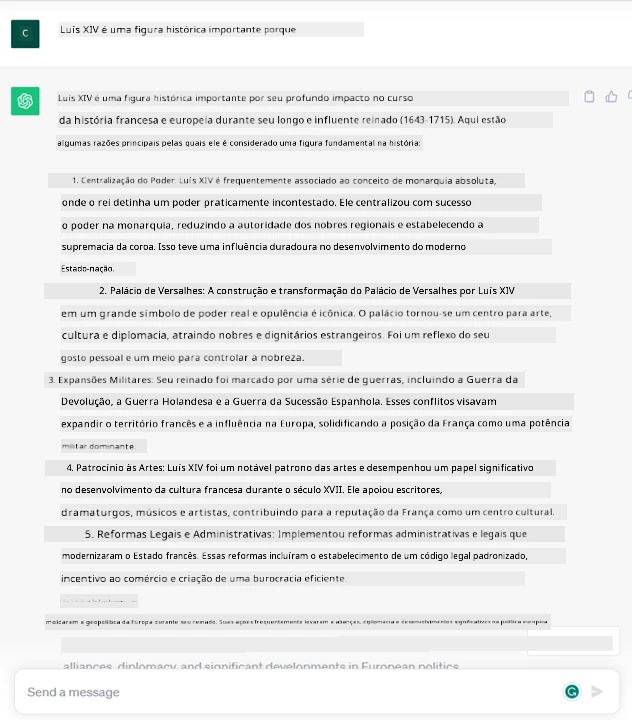
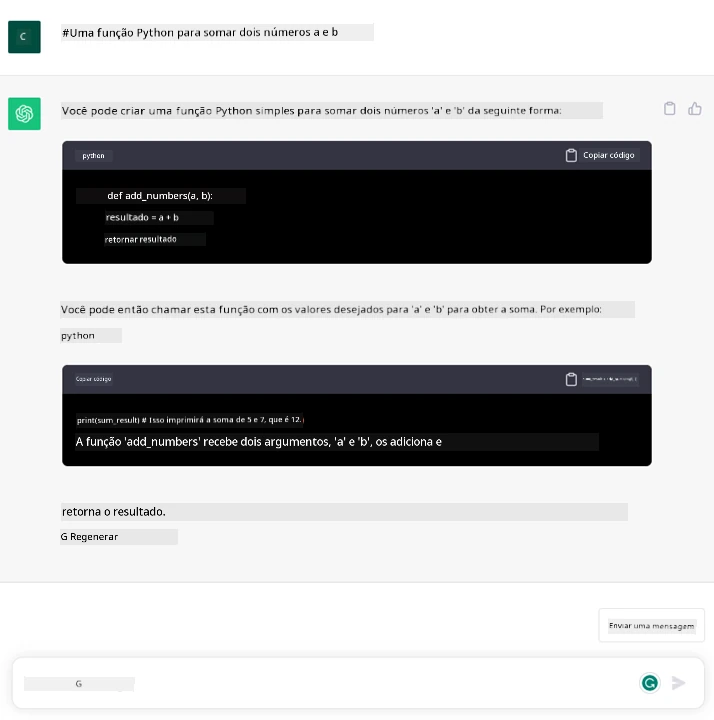

# Introdução à IA Generativa e Modelos de Linguagem de Grande Escala

_(Clique na imagem acima para assistir ao vídeo desta aula)_

IA generativa é inteligência artificial capaz de gerar texto, imagens e outros tipos de conteúdo. O que torna essa tecnologia fantástica é que ela democratiza a IA, qualquer um pode usá-la com apenas um prompt de texto, uma frase escrita em linguagem natural. Não há necessidade de você aprender uma linguagem como Java ou SQL para realizar algo significativo, tudo que você precisa é usar sua linguagem, dizer o que deseja e surge uma sugestão de um modelo de IA. As aplicações e o impacto disso são enormes, você pode escrever ou entender relatórios, desenvolver aplicações e muito mais, tudo em segundos.

Neste currículo, exploraremos como nossa startup utiliza IA generativa para desbloquear novos cenários no mundo da educação e como abordamos os inevitáveis desafios associados às implicações sociais da sua aplicação e às limitações da tecnologia.

## Introdução

Esta aula cobrirá:

- Introdução ao cenário de negócios: nossa ideia e missão da startup.
- IA Generativa e como chegamos ao atual cenário tecnológico.
- Funcionamento interno de um modelo de linguagem de grande escala.
- Principais capacidades e casos de uso práticos de Modelos de Linguagem de Grande Escala.

## Objetivos de Aprendizagem

Após concluir esta aula, você entenderá:

- O que é IA generativa e como os Modelos de Linguagem de Grande Escala funcionam.
- Como você pode aproveitar modelos de linguagem de grande escala para diferentes casos de uso, focando em cenários educacionais.

## Cenário: nossa startup educacional

A Inteligência Artificial Generativa representa o ápice da tecnologia de IA, ultrapassando os limites do que antes se considerava impossível. Modelos generativos de IA possuem diversas capacidades e aplicações, mas para este currículo exploraremos como ela está revolucionando a educação por meio de uma startup fictícia. Chamaremos essa startup de _nossa startup_. Nossa startup atua no setor educacional com a missão ambiciosa de

> _melhorar a acessibilidade no aprendizado, em escala global, garantindo acesso equitativo à educação e proporcionando experiências de aprendizado personalizadas para cada estudante, conforme suas necessidades_.

Nossa equipe da startup sabe que não conseguiremos atingir esse objetivo sem aproveitar uma das ferramentas mais poderosas dos tempos modernos – os Modelos de Linguagem de Grande Escala (LLMs).

Espera-se que a IA generativa revolucione a forma como aprendemos e ensinamos hoje, com estudantes dispondo de professores virtuais 24 horas por dia que fornecem imensa quantidade de informações e exemplos, e professores podendo usar ferramentas inovadoras para avaliar seus alunos e dar feedback.

Para começar, vamos definir alguns conceitos básicos e terminologia que usaremos ao longo do currículo.

## Como chegamos à IA Generativa?

Apesar do extraordinário _hype_ criado recentemente pelo anúncio dos modelos de IA generativa, essa tecnologia está em desenvolvimento há décadas, com os primeiros esforços de pesquisa datando dos anos 60. Agora chegamos a um ponto em que a IA possui capacidades cognitivas humanas, como conversação, demonstrada por exemplo pelo [OpenAI ChatGPT](https://openai.com/chatgpt) ou [Microsoft Copilot](https://copilot.microsoft.com/?WT.mc_id=academic-105485-koreyst), que também utiliza um modelo GPT para sua experiência de busca web conversacional.

Voltando um pouco, os primeiros protótipos de IA consistiam em chatbots baseados em escrita, dependentes de uma base de conhecimento extraída de um grupo de especialistas e representada num computador. As respostas na base de conhecimento eram acionadas por palavras-chave no texto de entrada.
Contudo, logo ficou claro que essa abordagem, usando chatbots escritos, não escalava bem.

### Uma abordagem estatística para IA: Aprendizado de Máquina

Um ponto de virada ocorreu durante os anos 90, com a aplicação de uma abordagem estatística para análise de texto. Isso levou ao desenvolvimento de novos algoritmos – conhecidos como aprendizado de máquina – capazes de aprender padrões a partir dos dados sem serem explicitamente programados. Essa abordagem permite que máquinas simulem a compreensão da linguagem humana: um modelo estatístico é treinado em pares texto-rótulo, permitindo classificar textos desconhecidos com um rótulo pré-definido representando a intenção da mensagem.

### Redes neurais e assistentes virtuais modernos

Nos últimos anos, a evolução tecnológica do hardware, capaz de lidar com maiores volumes de dados e cálculos mais complexos, incentivou pesquisas em IA, levando ao desenvolvimento de algoritmos avançados de aprendizado de máquina conhecidos como redes neurais ou aprendizado profundo.

Redes neurais (em particular Redes Neurais Recorrentes – RNNs) ampliaram significativamente o processamento de linguagem natural, permitindo representar o significado do texto de maneira mais relevante, valorizando o contexto de uma palavra numa frase.

Essa é a tecnologia que alimentou os assistentes virtuais nascidos na primeira década do novo século, muito proficientes em interpretar a linguagem humana, identificar uma necessidade e realizar uma ação para satisfazê-la – como responder com um roteiro predefinido ou consumir um serviço de terceiros.

### Atualmente, IA Generativa

É assim que chegamos à IA Generativa hoje, que pode ser vista como um subconjunto do aprendizado profundo.

Após décadas de pesquisa no campo da IA, uma nova arquitetura de modelo – chamada _Transformer_ – superou os limites das RNNs, sendo capaz de receber sequências de texto muito mais longas como entrada. Os Transformers são baseados no mecanismo de atenção, permitindo ao modelo atribuir pesos diferentes às entradas que recebe, ‘prestando mais atenção’ onde a informação mais relevante está concentrada, independentemente da ordem na sequência de texto.

A maioria dos modelos recentes de IA generativa – também conhecidos como Modelos de Linguagem de Grande Escala (LLMs), já que trabalham com entradas e saídas textuais – são de fato baseados nessa arquitetura. O que é interessante nesses modelos – treinados com enorme volume de dados não rotulados de diversas fontes como livros, artigos e sites – é que eles podem ser adaptados para uma grande variedade de tarefas e gerar texto gramaticalmente correto com uma aparência de criatividade. Assim, não só melhoraram incrivelmente a capacidade da máquina de ‘entender’ um texto de entrada, mas também habilitaram sua capacidade de gerar uma resposta original em linguagem humana.

## Como funcionam os modelos de linguagem de grande escala?

No próximo capítulo exploraremos diferentes tipos de modelos de IA generativa, mas por agora vejamos como funcionam os modelos de linguagem de grande escala, com foco nos modelos OpenAI GPT (Generative Pre-trained Transformer).

- **Tokenizer, texto para números**: Modelos de Linguagem de Grande Escala recebem um texto como entrada e geram um texto como saída. Contudo, sendo modelos estatísticos, trabalham muito melhor com números do que com sequências de texto. Por isso, toda entrada para o modelo é processada por um tokenizador, antes de ser usada pelo núcleo do modelo. Um token é um pedaço de texto – consistindo de um número variável de caracteres, então a principal tarefa do tokenizador é dividir a entrada numa série de tokens. Depois, cada token é mapeado com um índice de token, que é a codificação inteira do pedaço original de texto.

- **Previsão dos tokens de saída**: Dado n tokens como entrada (com máximo n variando de um modelo para outro), o modelo é capaz de prever um token como saída. Esse token é então incorporado na entrada da próxima iteração, num padrão de janela expansiva, permitindo uma melhor experiência ao usuário de receber uma (ou mais) sentenças como resposta. Isso explica por que, se você já brincou com ChatGPT, às vezes parece que ele para no meio de uma frase.

- **Processo de seleção, distribuição de probabilidade**: O token de saída é escolhido pelo modelo conforme sua probabilidade de ocorrer após a sequência atual de texto. Isso porque o modelo prevê uma distribuição de probabilidade sobre todos os ‘próximos tokens’ possíveis, calculada com base em seu treinamento. Contudo, nem sempre o token com a maior probabilidade é selecionado da distribuição resultante. Um grau de aleatoriedade é adicionado a essa escolha, de modo que o modelo atua de forma não determinística – não obtemos a mesma saída para a mesma entrada. Esse grau de aleatoriedade é adicionado para simular o processo de pensamento criativo e pode ser ajustado por um parâmetro do modelo chamado temperatura.

## Como nossa startup pode aproveitar os Modelos de Linguagem de Grande Escala?

Agora que temos uma melhor compreensão do funcionamento interno de um modelo de linguagem de grande escala, vejamos alguns exemplos práticos das tarefas mais comuns que eles podem realizar muito bem, com foco no nosso cenário de negócios.
Dissemos que a principal capacidade de um Modelo de Linguagem de Grande Escala é _gerar um texto do zero, a partir de uma entrada textual, escrita em linguagem natural_.

Mas que tipo de entrada e saída textual?
A entrada de um modelo de linguagem de grande escala é conhecida como prompt, enquanto a saída é conhecida como completion, termo que se refere ao mecanismo do modelo para gerar o próximo token para completar a entrada atual. Vamos nos aprofundar no que é um prompt e como projetá-lo para obter o máximo do nosso modelo. Mas por agora, digamos que um prompt pode incluir:

- Uma **instrução** especificando o tipo de saída que esperamos do modelo. Essa instrução às vezes pode incluir alguns exemplos ou dados adicionais.

  1. Resumo de um artigo, livro, avaliações de produtos e mais, junto com extração de insights de dados não estruturados.
    
    
  
  2. Ideação criativa e criação de um artigo, ensaio, trabalho ou mais.
      
     

- Uma **pergunta**, feita na forma de uma conversa com um agente.
  
  

- Um trecho de **texto a completar**, que implicitamente é um pedido de assistência para escrita.
  
  

- Um trecho de **código** junto com o pedido de explicações e documentação, ou um comentário solicitando gerar um código para realizar uma tarefa específica.
  
  

Os exemplos acima são bastante simples e não têm a intenção de ser uma demonstração exaustiva das capacidades dos Modelos de Linguagem de Grande Escala. Eles servem para mostrar o potencial do uso da IA generativa, em particular, mas não limitado a contextos educacionais.

Além disso, a saída de um modelo de IA generativa não é perfeita e, às vezes, a criatividade do modelo pode prejudicá-lo, resultando em uma saída que é uma combinação de palavras que o usuário humano pode interpretar como uma mistificação da realidade, ou pode ser ofensiva. A IA generativa não é inteligente – pelo menos na definição mais ampla de inteligência, que inclui raciocínio crítico e criativo ou inteligência emocional; ela não é determinística e não é confiável, pois fabricacoes, como referências errôneas, conteúdos e declarações podem ser combinadas com informações corretas e apresentadas de modo persuasivo e confiante. Nas aulas seguintes, lidaremos com todas essas limitações e veremos o que podemos fazer para mitigá-las.

## Tarefa

Sua tarefa é pesquisar mais sobre [IA generativa](https://en.wikipedia.org/wiki/Generative_artificial_intelligence?WT.mc_id=academic-105485-koreyst) e tentar identificar uma área onde você adicionaria IA generativa hoje que ainda não a tem. Como o impacto seria diferente do modo "antigo", você conseguiria fazer algo que antes não podia, ou seria mais rápido? Escreva um resumo de 300 palavras sobre como seria sua startup de IA dos sonhos e inclua títulos como "Problema", "Como eu usaria IA", "Impacto" e opcionalmente um plano de negócios.

Se fizer essa tarefa, você pode até estar pronto para se inscrever na incubadora da Microsoft, [Microsoft for Startups Founders Hub](https://www.microsoft.com/startups?WT.mc_id=academic-105485-koreyst) oferecemos créditos para Azure, OpenAI, mentoria e muito mais, confira!

## Verificação de conhecimento

O que é verdade sobre os modelos de linguagem de grande escala?

1. Você obtém a mesma resposta exata sempre.
1. Eles fazem tudo perfeitamente, ótimos em somar números, produzir código funcional etc.
1. A resposta pode variar apesar de usar o mesmo prompt. Eles também são ótimos em fornecer um primeiro rascunho de algo, seja texto ou código. Mas você precisa melhorar os resultados.

A: 3, um LLM é não determinístico, a resposta varia, porém você pode controlar sua variação via configuração de temperatura. Também não se deve esperar que faça tudo perfeitamente, ele está aqui para fazer o trabalho pesado para você, o que frequentemente significa que você obtém uma boa primeira tentativa que precisa ser aperfeiçoada gradualmente.

## Excelente trabalho! Continue a jornada

Após completar esta aula, confira nossa [coleção de Aprendizado em IA Generativa](https://aka.ms/genai-collection?WT.mc_id=academic-105485-koreyst) para continuar avançando no seu conhecimento em IA Generativa!

Vá para a Lição 2 onde vamos ver como [explorar e comparar diferentes tipos de LLM](../02-exploring-and-comparing-different-llms/README.md?WT.mc_id=academic-105485-koreyst)!

---

<!-- CO-OP TRANSLATOR DISCLAIMER START -->
**Aviso Legal**:
Este documento foi traduzido usando o serviço de tradução por IA [Co-op Translator](https://github.com/Azure/co-op-translator). Embora nos esforcemos pela precisão, por favor, esteja ciente de que traduções automatizadas podem conter erros ou imprecisões. O documento original em seu idioma nativo deve ser considerado a fonte autorizada. Para informações críticas, recomenda-se tradução profissional humana. Não nos responsabilizamos por quaisquer mal-entendidos ou interpretações incorretas decorrentes do uso desta tradução.
<!-- CO-OP TRANSLATOR DISCLAIMER END -->