# Explorando e comparando diferentes LLMs

[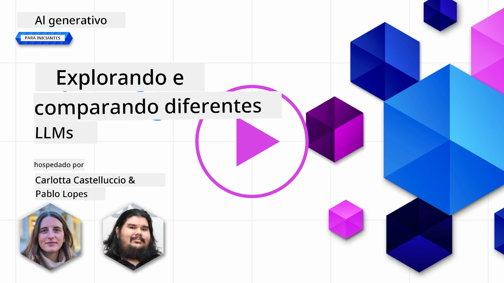](https://youtu.be/KIRUeDKscfI?si=8BHX1zvwzQBn-PlK)

> _Clique na imagem acima para assistir ao vídeo desta lição_

Na lição anterior, vimos como a IA Generativa está mudando o cenário tecnológico, como Large Language Models (LLMs) funcionam e como um negócio - como nossa startup - pode aplicá-los aos seus casos de uso e crescer! Neste capítulo, vamos comparar e contrastar diferentes tipos de grandes modelos de linguagem (LLMs) para entender seus prós e contras.

O próximo passo na jornada da nossa startup é explorar o panorama atual dos LLMs e entender quais são adequados para nosso caso de uso.

## Introdução

Esta lição abordará:

- Diferentes tipos de LLMs no cenário atual.
- Testar, iterar e comparar diferentes modelos para seu caso de uso no Azure.
- Como implantar um LLM.

## Objetivos de Aprendizagem

Após concluir esta lição, você será capaz de:

- Selecionar o modelo certo para seu caso de uso.
- Entender como testar, iterar e melhorar o desempenho do seu modelo.
- Saber como empresas implantam modelos.

## Entender os diferentes tipos de LLMs

LLMs podem ter múltiplas categorias baseadas em sua arquitetura, dados de treinamento e caso de uso. Entender essas diferenças ajudará nossa startup a selecionar o modelo correto para o cenário, além de entender como testar, iterar e melhorar o desempenho.

Existem muitos tipos diferentes de modelos LLM; sua escolha depende do que você pretende usar, seus dados, quanto está disposto a pagar e mais.

Dependendo se você pretende usar os modelos para texto, áudio, vídeo, geração de imagens e assim por diante, você pode optar por um tipo diferente de modelo.

- **Reconhecimento de áudio e fala**. Modelos no estilo Whisper ainda são úteis como modelos gerais de reconhecimento de fala, mas as escolhas de produção agora também incluem modelos mais recentes de fala para texto, como `gpt-4o-transcribe`, `gpt-4o-mini-transcribe` e variantes de diarização. Avalie a cobertura de idiomas, diarização, suporte em tempo real, latência e custo para seu cenário. Saiba mais na [documentação de fala para texto da OpenAI](https://platform.openai.com/docs/guides/speech-to-text?WT.mc_id=academic-105485-koreyst).

- **Geração de imagens**. DALL-E e Midjourney são opções bem conhecidas para geração de imagens, mas as APIs atuais de imagem da OpenAI estão centradas em modelos GPT Image como `gpt-image-2`, enquanto Stable Diffusion, Imagen, Flux e outras famílias de modelos também são escolhas comuns. Compare adesão a prompts, suporte a edição, controle de estilo, requisitos de segurança e licenciamento. Saiba mais no [guia de geração de imagens da OpenAI](https://platform.openai.com/docs/guides/images?WT.mc_id=academic-105485-koreyst) e no Capítulo 9 deste currículo.

- **Geração de texto**. Modelos de texto agora abrangem modelos de ponta, modelos de raciocínio, modelos menores de baixa latência e modelos com pesos abertos. Exemplos atuais incluem modelos GPT-5.x da OpenAI, modelos Claude 4.x da Anthropic, modelos Gemini 3.x do Google, modelos Llama 4 da Meta e modelos Mistral. Não escolha apenas pela data de lançamento ou preço; compare qualidade da tarefa, latência, janela de contexto, uso de ferramentas, comportamento de segurança, disponibilidade regional e custo total. O [catálogo de modelos Microsoft Foundry](https://ai.azure.com/catalog?WT.mc_id=academic-105485-koreyst) é um bom lugar para comparar modelos disponíveis no Azure.

- **Multimodalidade**. Muitos modelos atuais podem processar mais que texto. Alguns aceitam entrada de imagem, áudio ou vídeo; alguns podem chamar ferramentas; e modelos especializados podem gerar imagens, áudio ou vídeo. Por exemplo, modelos OpenAI atuais suportam entrada de texto e imagem, modelos Gemini podem suportar texto, código, imagem, áudio e vídeo dependendo da variante, e Llama 4 Scout e Maverick são modelos multimodais nativos de peso aberto. Sempre verifique cada ficha do modelo para modalidades de entrada e saída suportadas antes de construir um fluxo de trabalho ao redor dele.

Selecionar um modelo significa obter algumas capacidades básicas, que podem não ser suficientes, entretanto. Frequentemente você tem dados específicos da empresa que precisa, de alguma forma, informar ao LLM. Existem algumas opções diferentes para abordar isso, mais adiante nas próximas seções.

### Modelos Foundation versus LLMs

O termo Modelo Foundation foi [criado por pesquisadores de Stanford](https://arxiv.org/abs/2108.07258?WT.mc_id=academic-105485-koreyst) e definido como um modelo de IA que segue alguns critérios, como:

- **Eles são treinados usando aprendizado não supervisionado ou auto-supervisionado**, ou seja, são treinados em dados multimodais não rotulados, e não requerem anotação humana ou rotulagem para o processo de treinamento.
- **São modelos muito grandes**, baseados em redes neurais profundas treinadas com bilhões de parâmetros.
- **Normalmente destinam-se a servir como uma 'base' para outros modelos**, ou seja, podem ser usados como ponto de partida para outros modelos serem construídos em cima, o que pode ser feito por fine-tuning.

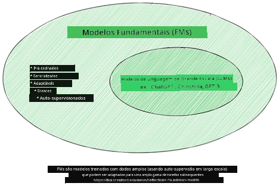

Fonte da imagem: [Guia essencial para Modelos Foundation e Grandes Modelos de Linguagem | por Babar M Bhatti | Medium
](https://thebabar.medium.com/essential-guide-to-foundation-models-and-large-language-models-27dab58f7404)

Para esclarecer ainda mais essa distinção, vamos pegar o ChatGPT como exemplo histórico. Versões iniciais do ChatGPT usaram o GPT-3.5 como modelo foundation. A OpenAI então usou dados e técnicas de alinhamento específicas para chat para criar uma versão ajustada que teve melhor desempenho em cenários conversacionais, como chatbots. Serviços modernos de IA frequentemente alternam entre várias variantes de modelos, então o nome do serviço e do modelo subjacente nem sempre são a mesma coisa.

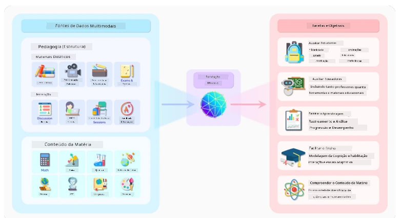

Fonte da imagem: [2108.07258.pdf (arxiv.org)](https://arxiv.org/pdf/2108.07258.pdf?WT.mc_id=academic-105485-koreyst)

### Modelos Open-Weight/Open-Source versus Proprietários

Outra forma de categorizar LLMs é se são open-weight, open-source ou proprietários.

Modelos open-source e open-weight disponibilizam artefatos do modelo para inspeção, download ou customização, mas suas licenças diferem. Alguns são totalmente open source, enquanto outros são modelos open-weight com restrições de uso. Eles podem ser úteis quando uma empresa precisa de mais controle sobre implantação, localidade dos dados, custo ou customização. Contudo, as equipes ainda precisam revisar termos de licença, custos de serviço, manutenção, atualizações de segurança e qualidade de avaliação antes de usá-los em produção. Exemplos incluem [Meta Llama 4](https://ai.meta.com/blog/llama-4-multimodal-intelligence/?WT.mc_id=academic-105485-koreyst), alguns [modelos Mistral](https://docs.mistral.ai/models/overview?WT.mc_id=academic-105485-koreyst) e muitos modelos hospedados no [Hugging Face](https://huggingface.co/models?WT.mc_id=academic-105485-koreyst).

Modelos proprietários são de propriedade e hospedados por um provedor. Esses modelos são frequentemente otimizados para uso gerenciado em produção e podem oferecer suporte robusto, sistemas de segurança, integração de ferramentas e escalabilidade. Contudo, clientes normalmente não podem inspecionar ou modificar os pesos do modelo, e devem revisar os termos do provedor para privacidade, retenção, conformidade e uso aceitável. Exemplos incluem [modelos OpenAI](https://platform.openai.com/docs/models?WT.mc_id=academic-105485-koreyst), [Google Gemini](https://deepmind.google/models/gemini/pro/?WT.mc_id=academic-105485-koreyst) e [Anthropic Claude](https://platform.claude.com/docs/en/about-claude/models/overview?WT.mc_id=academic-105485-koreyst).

### Embedding versus Geração de imagens versus Geração de texto e código

LLMs também podem ser categorizados pelo tipo de saída que geram.

Embeddings são um conjunto de modelos que podem converter texto em uma forma numérica, chamada embedding, que é uma representação numérica do texto de entrada. Embeddings facilitam para máquinas entenderem as relações entre palavras ou sentenças e podem ser usados como entradas por outros modelos, como modelos de classificação ou de agrupamento que têm melhor desempenho com dados numéricos. Modelos de embedding são frequentemente usados para aprendizado por transferência, onde um modelo é construído para uma tarefa substituta com abundância de dados, e então os pesos do modelo (embeddings) são reutilizados para outras tarefas posteriores. Um exemplo dessa categoria são os [embeddings da OpenAI](https://platform.openai.com/docs/models/embeddings?WT.mc_id=academic-105485-koreyst).

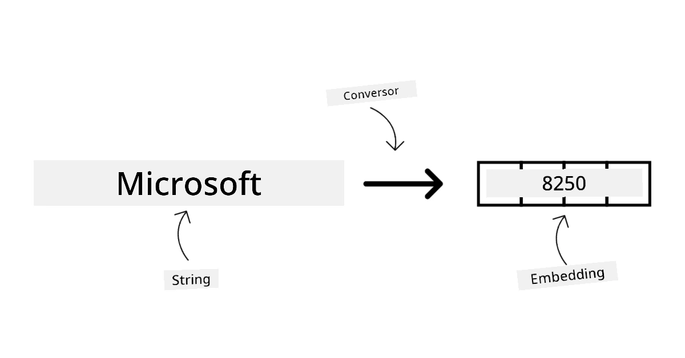

Modelos de geração de imagens são modelos que geram imagens. Esses modelos são frequentemente usados para edição de imagens, síntese de imagens e tradução de imagens. Modelos de geração de imagens são frequentemente treinados em grandes conjuntos de dados de imagens, como [LAION-5B](https://laion.ai/blog/laion-5b/?WT.mc_id=academic-105485-koreyst), e podem ser usados para gerar imagens novas ou editar imagens existentes com técnicas de inpainting, super-resolução e colorização. Exemplos incluem [modelos GPT Image](https://platform.openai.com/docs/guides/images?WT.mc_id=academic-105485-koreyst), [modelos Stable Diffusion](https://github.com/Stability-AI/StableDiffusion?WT.mc_id=academic-105485-koreyst) e modelos Imagen.

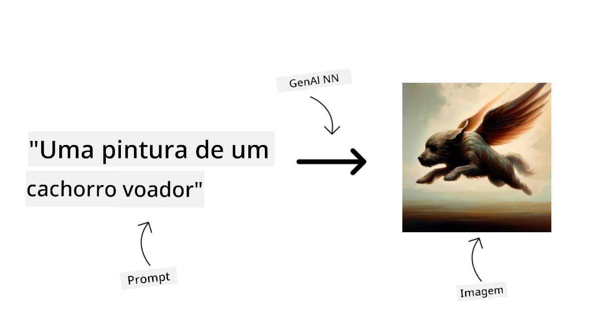

Modelos de geração de texto e código são modelos que geram texto ou código. Esses modelos são frequentemente usados para resumo de texto, tradução e resposta a perguntas. Modelos de geração de texto são frequentemente treinados em grandes conjuntos de dados de texto, como [BookCorpus](https://www.cv-foundation.org/openaccess/content_iccv_2015/html/Zhu_Aligning_Books_and_ICCV_2015_paper.html?WT.mc_id=academic-105485-koreyst), e podem ser usados para gerar texto novo ou responder perguntas. Modelos de geração de código, como [CodeParrot](https://huggingface.co/codeparrot?WT.mc_id=academic-105485-koreyst), são frequentemente treinados em grandes conjuntos de código, como GitHub, e podem ser usados para gerar código novo ou corrigir bugs em código existente.

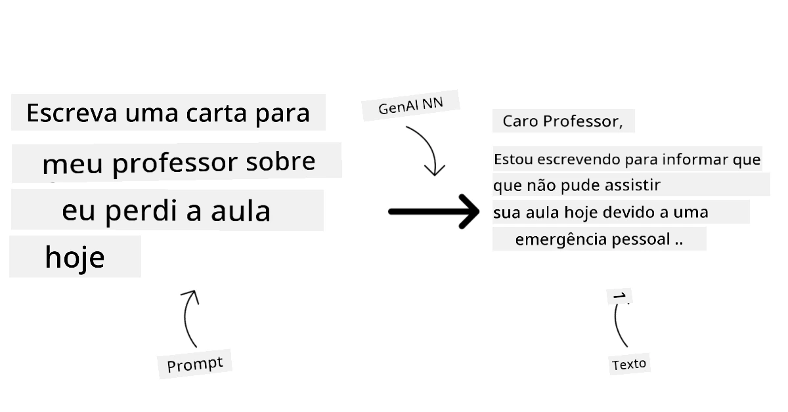

### Encoder-Decoder versus Somente Decoder

Para falar sobre os diferentes tipos de arquiteturas dos LLMs, vamos usar uma analogia.

Imagine que seu gerente deu a você a tarefa de escrever um quiz para os alunos. Você tem dois colegas; um supervisiona a criação do conteúdo e o outro supervisiona a revisão.

O criador de conteúdo é como um modelo somente decoder: ele pode olhar o tópico, ver o que você já escreveu e então continuar gerando conteúdo baseado nesse contexto. Ele é muito bom em escrever conteúdo envolvente e informativo, mas nem sempre é a melhor escolha quando a tarefa é apenas classificar, recuperar ou codificar informações. Exemplos de famílias de modelos somente decoder incluem GPT e Llama.

O revisor é como um modelo somente encoder, ele olha o curso escrito e as respostas, percebe a relação entre eles e entende o contexto, mas não é bom em gerar conteúdo. Um exemplo de modelo somente encoder seria o BERT.

Imagine que também podemos ter alguém que poderia criar e revisar o quiz, este é um modelo Encoder-Decoder. Alguns exemplos seriam BART e T5.

### Serviço versus Modelo

Agora, vamos falar sobre a diferença entre um serviço e um modelo. Um serviço é um produto oferecido por um Provedor de Serviços em Nuvem, e geralmente é uma combinação de modelos, dados e outros componentes. Um modelo é o componente central de um serviço, e geralmente é um modelo foundation, como um LLM.

Serviços são frequentemente otimizados para uso em produção e geralmente são mais fáceis de usar do que modelos, via uma interface gráfica de usuário. Contudo, serviços nem sempre estão disponíveis gratuitamente, e podem requerer uma assinatura ou pagamento para uso, em troca de aproveitar o equipamento e recursos do proprietário do serviço, otimizando despesas e facilitando a escalabilidade. Um exemplo de serviço é o [Azure OpenAI Service](https://learn.microsoft.com/azure/ai-services/openai/overview?WT.mc_id=academic-105485-koreyst), que oferece um plano de pagamento conforme o uso, significando que os usuários são cobrados proporcionalmente ao quanto utilizam o serviço. O Azure OpenAI Service também oferece segurança de nível empresarial e uma estrutura de IA responsável além das capacidades dos modelos.

Modelos são os artefatos das redes neurais: parâmetros, pesos, arquitetura, tokenizer e configuração de suporte. Executar um modelo localmente ou em ambiente privado requer hardware adequado, infraestrutura de serviço, monitoramento, e licença compatível open-source/open-weight ou licença comercial. Modelos open-weight como Llama 4 ou Mistral podem ser auto-hospedados, mas ainda exigem potência computacional e expertise operacional.

## Como testar e iterar com diferentes modelos para entender o desempenho no Azure

Uma vez que nossa equipe explorou o cenário atual dos LLMs e identificou alguns bons candidatos para seus cenários, o próximo passo é testá-los em seus dados e em suas cargas de trabalho. Este é um processo iterativo, feito por experimentos e medições.
A maioria dos modelos que mencionamos nos parágrafos anteriores (modelos OpenAI, modelos de código aberto como Llama 4 e Mistral, e modelos do Hugging Face) estão disponíveis no [Microsoft Foundry Models](https://learn.microsoft.com/azure/foundry/concepts/foundry-models-overview?WT.mc_id=academic-105485-koreyst).

[Microsoft Foundry](https://learn.microsoft.com/azure/foundry/what-is-foundry?WT.mc_id=academic-105485-koreyst), anteriormente Azure AI Studio/Azure AI Foundry, é uma plataforma Azure unificada para construir aplicativos e agentes de IA. Ela ajuda desenvolvedores a gerenciar o ciclo de vida desde a experimentação e avaliação até o deployment, monitoramento e governança. O catálogo de modelos do Microsoft Foundry permite que o usuário:

- Encontre o modelo base de interesse no catálogo, incluindo modelos vendidos pela Azure e modelos de parceiros e provedores da comunidade. Os usuários podem filtrar por tarefa, fornecedor, licença, opção de deployment ou nome.

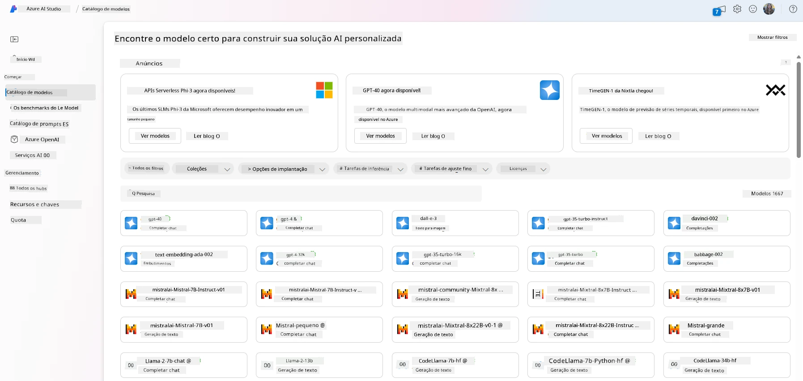

- Revise o cartão do modelo, incluindo uma descrição detalhada do uso pretendido e dos dados de treinamento, exemplos de código e resultados de avaliação na biblioteca interna de avaliações.

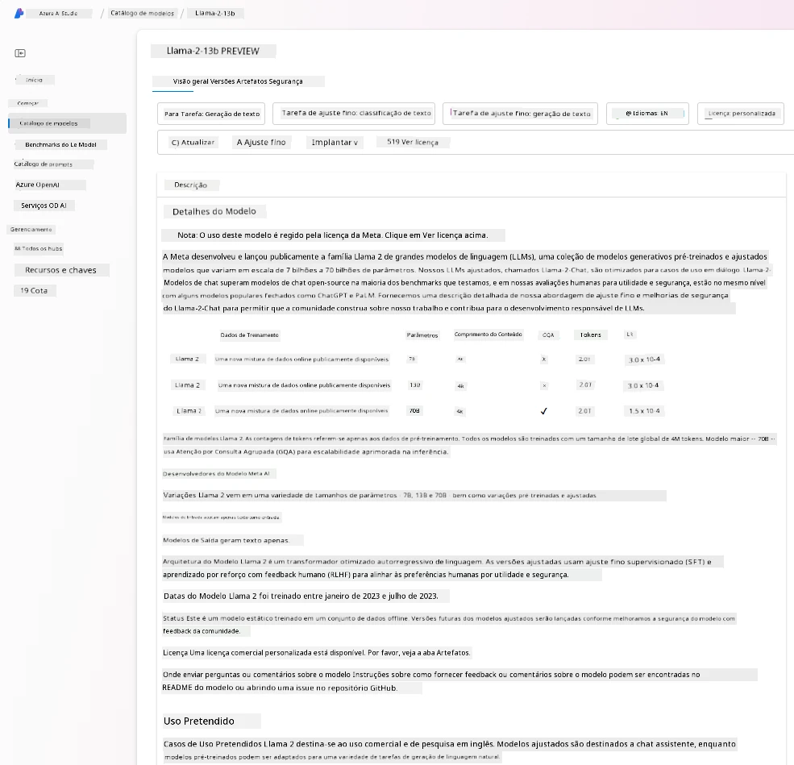

- Compare benchmarks entre modelos e conjuntos de dados disponíveis na indústria para avaliar qual atende ao cenário de negócio, por meio do painel [Model Benchmarks](https://learn.microsoft.com/azure/ai-studio/how-to/model-benchmarks?WT.mc_id=academic-105485-koreyst).

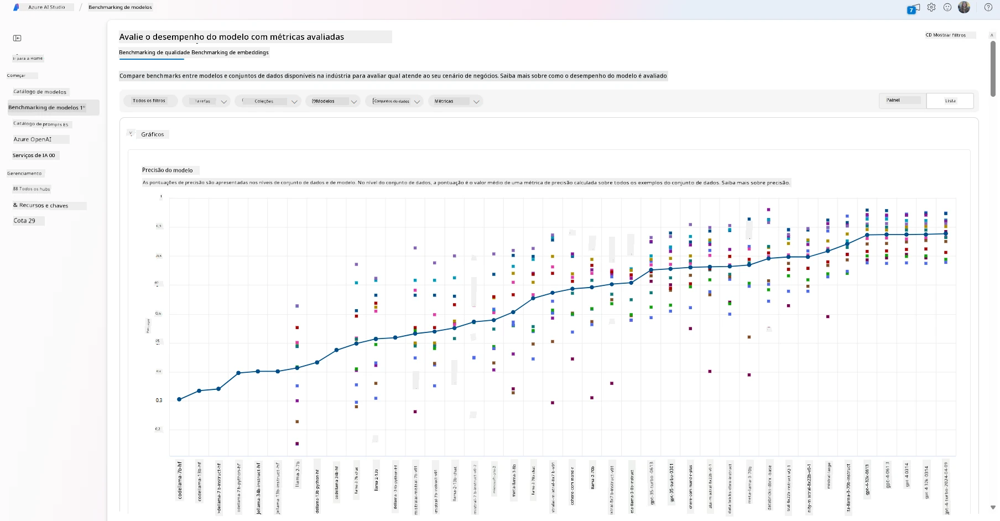

- Faça fine-tuning em modelos suportados com dados de treino personalizados para melhorar o desempenho do modelo em uma carga de trabalho específica, aproveitando as capacidades de experimentação e rastreamento do Microsoft Foundry.

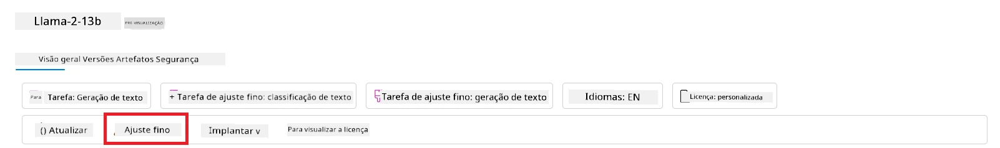

- Implemente o modelo pré-treinado original ou a versão fine-tuned em um endpoint remoto de inferência em tempo real, usando opções de deployment em computação gerenciada ou serverless, para permitir que aplicativos o consumam.

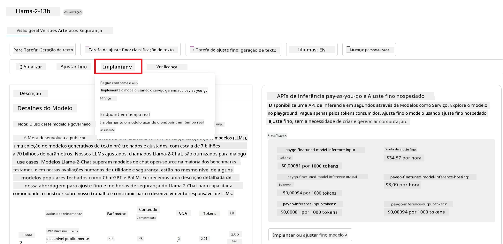

> [!NOTE]
> Nem todos os modelos no catálogo estão atualmente disponíveis para fine-tuning e/ou deployment pay-as-you-go. Verifique o cartão do modelo para detalhes sobre as capacidades e limitações do modelo.

## Melhorando os resultados dos LLMs

Exploramos com nossa equipe startup diferentes tipos de LLMs e uma plataforma em nuvem (Microsoft Foundry) que nos permite comparar diferentes modelos, avaliá-los em dados de teste, melhorar o desempenho e implantá-los em endpoints de inferência.

Mas quando eles deveriam considerar fazer fine-tuning de um modelo em vez de usar um pré-treinado? Existem outras abordagens para melhorar o desempenho do modelo em cargas específicas?

Há várias abordagens que uma empresa pode usar para obter os resultados que precisa de um LLM. Você pode selecionar diferentes tipos de modelos com diferentes graus de treinamento ao implantar um LLM em produção, com diferentes níveis de complexidade, custo e qualidade. Aqui estão algumas abordagens diferentes:

- **Engenharia de prompt com contexto**. A ideia é fornecer contexto suficiente quando você faz o prompt para garantir que obtenha as respostas necessárias.

- **Retrieval Augmented Generation, RAG**. Seus dados podem existir em um banco de dados ou endpoint web, por exemplo, para garantir que esses dados, ou um subconjunto deles, sejam incluídos na hora do prompt, você pode buscar os dados relevantes e torná-los parte do prompt do usuário.

- **Modelo fine-tuned**. Aqui, você treinou o modelo mais a fundo com seus próprios dados, o que fez o modelo ser mais exato e responsivo às suas necessidades, mas pode ser custoso.

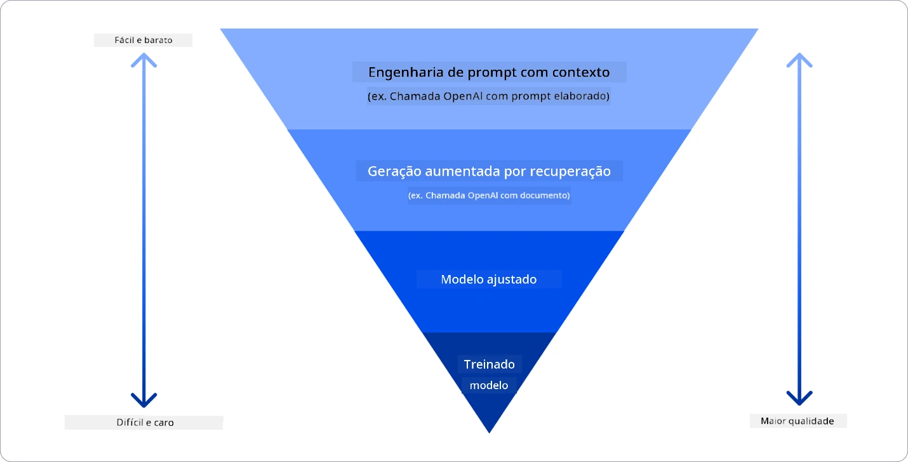

Fonte da imagem: [Four Ways that Enterprises Deploy LLMs | Fiddler AI Blog](https://www.fiddler.ai/blog/four-ways-that-enterprises-deploy-llms?WT.mc_id=academic-105485-koreyst)

### Engenharia de Prompt com Contexto

LLMs pré-treinados funcionam muito bem em tarefas generalizadas em linguagem natural, mesmo chamando-os com um prompt curto, como uma frase para completar ou uma pergunta – o chamado aprendizado “zero-shot”.

No entanto, quanto mais o usuário consegue enquadrar sua consulta, com um pedido detalhado e exemplos – o Contexto – mais precisa e próxima às expectativas do usuário será a resposta. Nesse caso, falamos de aprendizado “one-shot” se o prompt incluir apenas um exemplo e aprendizado “few-shot” se incluir múltiplos exemplos.
Engenharia de prompt com contexto é a abordagem mais custo-efetiva para começar.

### Retrieval Augmented Generation (RAG)

LLMs têm a limitação de que podem usar apenas os dados que foram utilizados durante seu treinamento para gerar uma resposta. Isso significa que eles não sabem nada sobre fatos que aconteceram após o processo de treinamento, e não podem acessar informações não públicas (como dados da empresa).
Isso pode ser superado com RAG, uma técnica que aumenta o prompt com dados externos na forma de pedaços de documentos, considerando os limites de comprimento do prompt. Isso é suportado por ferramentas de banco de dados vetorial (como [Azure Vector Search](https://learn.microsoft.com/azure/search/vector-search-overview?WT.mc_id=academic-105485-koreyst)) que recuperam os pedaços úteis de fontes de dados pré-definidas variadas e os adicionam ao Contexto do prompt.

Essa técnica é muito útil quando uma empresa não tem dados suficientes, tempo ou recursos para fazer fine-tuning de um LLM, mas ainda deseja melhorar o desempenho em uma carga de trabalho específica e reduzir riscos de respostas alucinadas, desatualizadas ou não suportadas.

### Modelo fine-tuned

Fine-tuning é um processo que aproveita o aprendizado por transferência para ‘adaptar’ o modelo a uma tarefa específica ou resolver um problema específico. Diferentemente do aprendizado few-shot e RAG, resulta na geração de um novo modelo, com pesos e vieses atualizados. Requer um conjunto de exemplos de treinamento consistindo em uma entrada única (o prompt) e sua saída associada (a conclusão).
Essa seria a abordagem preferida se:

- **Usando modelos menores específicos para tarefa**. Uma empresa gostaria de fazer fine-tuning de um modelo menor para uma tarefa restrita em vez de promptar repetidamente um modelo grande de fronteira, resultando em uma solução mais custo-efetiva e rápida.

- **Considerando a latência**. A latência é importante para um caso específico de uso, então não é possível usar prompts muito longos ou o número de exemplos que devem ser aprendidos pelo modelo não se enquadra no limite de comprimento do prompt.

- **Adaptando comportamento estável**. Uma empresa possui muitos exemplos de alta qualidade e quer que o modelo siga consistentemente um padrão de tarefa, formato de saída, tom ou estilo específico de domínio. Se o principal problema for fatos novos ou conhecimento privado que muda com frequência, use RAG em vez de depender somente do fine-tuning.

### Modelo treinado

Treinar um LLM do zero é, sem dúvida, a abordagem mais difícil e complexa de adotar, exigindo grandes quantidades de dados, recursos qualificados e poder computacional adequado. Essa opção deve ser considerada apenas em um cenário onde uma empresa tem um caso de uso específico de domínio e uma grande quantidade de dados centrais ao domínio.

## Verificação de conhecimento

Qual poderia ser uma boa abordagem para melhorar os resultados de completamento de LLMs?

1. Engenharia de prompt com contexto
1. RAG
1. Modelo fine-tuned

R: Os três podem ajudar. Comece com engenharia de prompt e contexto para melhorias rápidas, e use RAG quando o modelo precisar de fatos atuais ou dados privados da empresa. Escolha fine-tuning quando tiver exemplos suficientes de alta qualidade e precisar que o modelo siga consistentemente uma tarefa, formato, tom ou padrão de domínio.

## 🚀 Desafio

Leia mais sobre como você pode [usar RAG](https://learn.microsoft.com/azure/search/retrieval-augmented-generation-overview?WT.mc_id=academic-105485-koreyst) para seu negócio.

## Ótimo trabalho, continue seu aprendizado

Após concluir esta lição, confira nossa [coleção de Aprendizado em IA Generativa](https://aka.ms/genai-collection?WT.mc_id=academic-105485-koreyst) para continuar aprimorando seu conhecimento em IA Generativa!

Vá para a Lição 3, onde veremos como [construir com IA Generativa de forma responsável](../03-using-generative-ai-responsibly/README.md?WT.mc_id=academic-105485-koreyst)!

---

<!-- CO-OP TRANSLATOR DISCLAIMER START -->
**Aviso Legal**:
Este documento foi traduzido usando o serviço de tradução por IA [Co-op Translator](https://github.com/Azure/co-op-translator). Embora nos esforcemos pela precisão, por favor, esteja ciente de que traduções automatizadas podem conter erros ou imprecisões. O documento original em seu idioma nativo deve ser considerado a fonte autorizada. Para informações críticas, recomenda-se tradução profissional humana. Não nos responsabilizamos por quaisquer mal-entendidos ou interpretações incorretas decorrentes do uso desta tradução.
<!-- CO-OP TRANSLATOR DISCLAIMER END -->