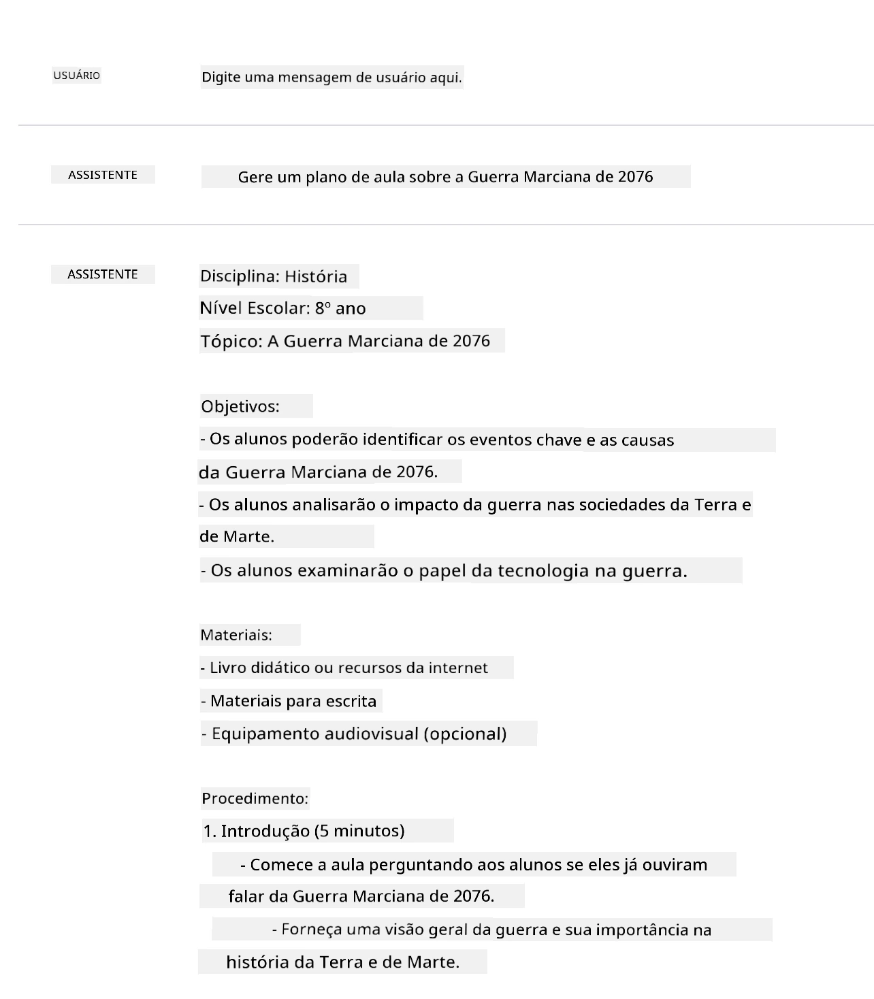
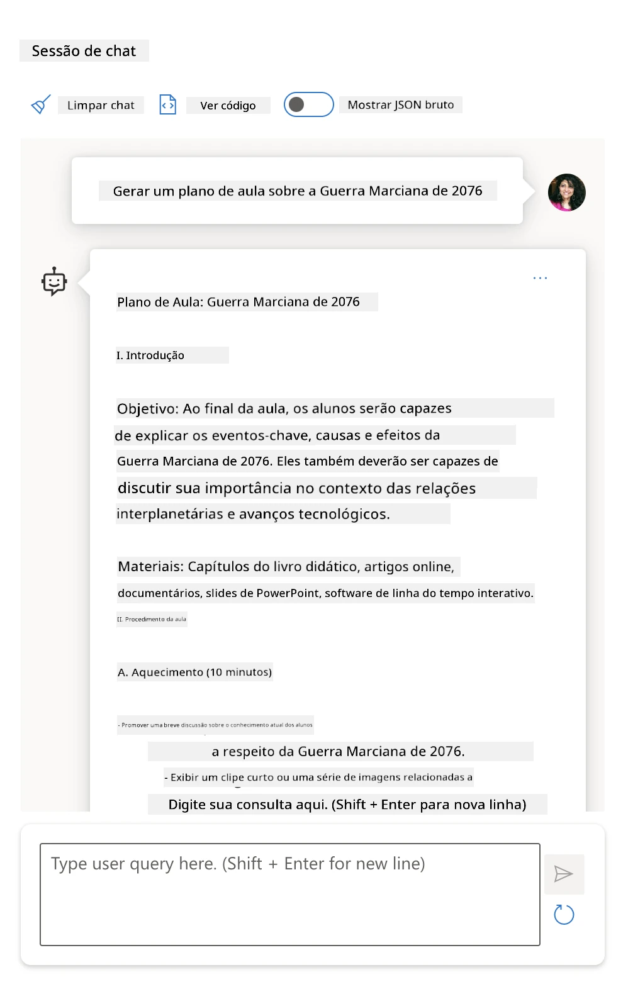
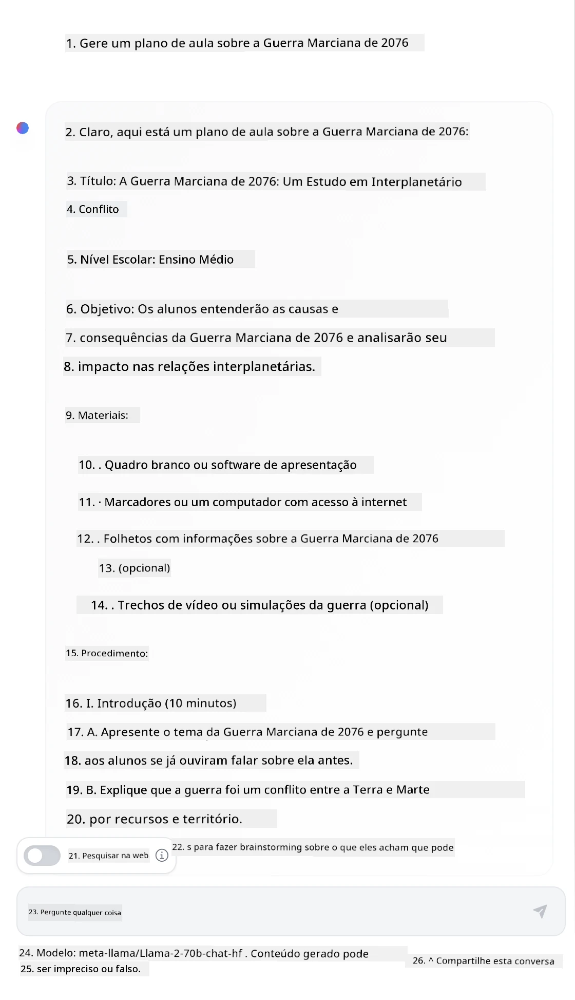

# Fundamentos da Engenharia de Prompt

[](https://youtu.be/GElCu2kUlRs?si=qrXsBvXnCW12epb8)

## Introdução
Este módulo aborda conceitos e técnicas essenciais para criar prompts eficazes em modelos generativos de IA. A forma como você escreve seu prompt para um LLM também importa. Um prompt cuidadosamente elaborado pode alcançar uma resposta de melhor qualidade. Mas o que exatamente significam termos como _prompt_ e _engenharia de prompt_? E como posso melhorar o _input_ do prompt que envio ao LLM? Essas são as perguntas que tentaremos responder neste capítulo e no próximo.

_A IA generativa_ é capaz de criar conteúdo novo (por exemplo, texto, imagens, áudio, código etc.) em resposta a solicitações do usuário. Ela realiza isso usando _Grandes Modelos de Linguagem_ como a série GPT da OpenAI ("Transformador Generativo Pré-treinado") que são treinados para usar linguagem natural e código.

Os usuários agora podem interagir com esses modelos usando paradigmas familiares como chat, sem necessidade de conhecimento técnico ou treinamento. Os modelos são _baseados em prompt_ - os usuários enviam um texto de entrada (prompt) e recebem a resposta da IA (completação). Eles podem então "conversar com a IA" de forma iterativa, em conversas de múltiplas etapas, refinando seu prompt até que a resposta atenda às suas expectativas.

"Prompts" tornam-se a principal _interface de programação_ para aplicativos de IA generativa, dizendo aos modelos o que fazer e influenciando a qualidade das respostas retornadas. A "Engenharia de Prompt" é uma área de estudo em rápido crescimento que se concentra no _projeto e otimização_ de prompts para fornecer respostas consistentes e de qualidade em escala.

## Objetivos de Aprendizagem

Nesta lição, aprendemos o que é Engenharia de Prompt, por que ela é importante e como podemos criar prompts mais eficazes para um dado modelo e objetivo de aplicação. Vamos entender conceitos centrais e melhores práticas para engenharia de prompt - e conhecer um ambiente interativo de Jupyter Notebooks "sandbox" onde podemos ver esses conceitos aplicados a exemplos reais.

Ao final desta lição, seremos capazes de:

1. Explicar o que é engenharia de prompt e por que ela importa.
2. Descrever os componentes de um prompt e como eles são usados.
3. Aprender melhores práticas e técnicas para engenharia de prompt.
4. Aplicar as técnicas aprendidas a exemplos reais, usando um endpoint OpenAI.

## Termos-Chave

Engenharia de Prompt: A prática de projetar e refinar entradas para guiar modelos de IA a produzirem saídas desejadas.  
Tokenização: O processo de converter texto em unidades menores, chamadas tokens, que um modelo pode entender e processar.  
LLMs Ajustados por Instruções: Grandes Modelos de Linguagem (LLMs) que foram finamente ajustados com instruções específicas para melhorar a precisão e relevância das suas respostas.

## Sandbox de Aprendizado

Engenharia de prompt é atualmente mais arte do que ciência. A melhor maneira de melhorar nossa intuição para ela é _praticando mais_ e adotando uma abordagem de tentativa e erro que combina expertise no domínio da aplicação com técnicas recomendadas e otimizações específicas de modelos.

O Jupyter Notebook que acompanha esta lição oferece um ambiente _sandbox_ onde você pode experimentar o que aprende — conforme avança ou como parte do desafio de código no final. Para executar os exercícios, você precisará de:

1. **Uma chave de API do Azure OpenAI** - o endpoint do serviço para um LLM implantado.  
2. **Um Runtime Python** - no qual o Notebook possa ser executado.  
3. **Variáveis de Ambiente Locais** - _complete as etapas do [SETUP](./../00-course-setup/02-setup-local.md?WT.mc_id=academic-105485-koreyst) agora para ficar pronto_.

O notebook vem com exercícios _iniciais_ - mas você é incentivado a adicionar suas próprias seções de _Markdown_ (descrição) e _Código_ (solicitações de prompt) para experimentar mais exemplos ou ideias - e construir sua intuição para design de prompts.

## Guia Ilustrado

Quer ter uma visão geral do que esta lição cobre antes de começar? Veja este guia ilustrado, que oferece uma ideia dos principais tópicos abordados e dos principais aprendizados para você refletir em cada um. O roteiro da lição leva você desde a compreensão dos conceitos centrais e desafios até a abordagem deles com técnicas e melhores práticas relevantes de engenharia de prompt. Observe que a seção "Técnicas Avançadas" deste guia se refere ao conteúdo abordado no _próximo_ capítulo deste currículo.


## Nossa Startup

Agora, vamos falar sobre como _este tema_ se relaciona com a missão da nossa startup de [trazer inovação em IA para a educação](https://educationblog.microsoft.com/2023/06/collaborating-to-bring-ai-innovation-to-education?WT.mc_id=academic-105485-koreyst). Queremos construir aplicações de IA para _aprendizado personalizado_ - então vamos pensar em como diferentes usuários do nosso aplicativo podem "desenhar" prompts:

- **Administradores** podem pedir para a IA _analisar dados curriculares para identificar lacunas na cobertura_. A IA pode resumir resultados ou visualizá-los com código.
- **Educadores** podem pedir para a IA _gerar um plano de aula para um público-alvo e tema específico_. A IA pode construir o plano personalizado em um formato especificado.
- **Estudantes** podem pedir para a IA _tutorar em uma disciplina difícil_. A IA pode agora guiar os alunos com aulas, dicas e exemplos adequados ao seu nível.

Isso é só a ponta do iceberg. Confira [Prompts Para Educação](https://github.com/microsoft/prompts-for-edu/tree/main?WT.mc_id=academic-105485-koreyst) - uma biblioteca open source de prompts organizada por especialistas em educação - para ter uma noção mais ampla das possibilidades! _Experimente executar alguns desses prompts no sandbox ou usando o OpenAI Playground para ver o que acontece!_

<!--
LESSON TEMPLATE:
This unit should cover core concept #1.
Reinforce the concept with examples and references.

CONCEPT #1:
Prompt Engineering.
Define it and explain why it is needed.
-->

## O que é Engenharia de Prompt?

Começamos esta lição definindo **Engenharia de Prompt** como o processo de _projetar e otimizar_ entradas de texto (prompts) para entregar respostas (completações) consistentes e de qualidade para um dado objetivo de aplicação e modelo. Podemos pensar nisso como um processo de 2 etapas:

- _projetar_ o prompt inicial para um dado modelo e objetivo  
- _refinar_ o prompt iterativamente para melhorar a qualidade da resposta

Este é necessariamente um processo de tentativa e erro que requer intuição e esforço do usuário para obter resultados ótimos. Então por que é importante? Para responder a essa pergunta, primeiro precisamos entender três conceitos:

- _Tokenização_ = como o modelo "vê" o prompt  
- _LLMs Base_ = como o modelo base "processa" um prompt  
- _LLMs Ajustados por Instrução_ = como o modelo pode agora "entender tarefas"

### Tokenização

Um LLM vê prompts como uma _sequência de tokens_ onde diferentes modelos (ou versões de um modelo) podem tokenizar o mesmo prompt de maneiras diferentes. Como os LLMs são treinados em tokens (e não em texto bruto), a forma como os prompts são tokenizados impacta diretamente a qualidade da resposta gerada.

Para entender intuitivamente como a tokenização funciona, experimente ferramentas como o [OpenAI Tokenizer](https://platform.openai.com/tokenizer?WT.mc_id=academic-105485-koreyst) mostrada abaixo. Copie seu prompt — e veja como ele é convertido em tokens, prestando atenção em como espaços em branco e sinais de pontuação são tratados. Observe que este exemplo mostra um LLM mais antigo (GPT-3) — então tentar isso com um modelo mais novo pode gerar resultados diferentes.


### Conceito: Modelos Fundamentais

Uma vez que um prompt é tokenizado, a função principal do ["LLM Base"](https://blog.gopenai.com/an-introduction-to-base-and-instruction-tuned-large-language-models-8de102c785a6?WT.mc_id=academic-105485-koreyst) (ou modelo fundamental) é prever o próximo token naquela sequência. Como LLMs são treinados em conjuntos massivos de texto, eles têm uma boa noção das relações estatísticas entre tokens e podem fazer essa previsão com certa confiança. Note que eles não entendem o _significado_ das palavras no prompt ou token; eles apenas veem um padrão que podem "completar" com a próxima previsão. Eles podem continuar prevendo a sequência até serem interrompidos por intervenção do usuário ou alguma condição preestabelecida.

Quer ver como a completação baseada em prompt funciona? Cole o prompt acima no Azure OpenAI Studio [_Chat Playground_](https://oai.azure.com/playground?WT.mc_id=academic-105485-koreyst) com as configurações padrão. O sistema está configurado para tratar os prompts como solicitações de informação — então você deverá ver uma completamento que satisfaça esse contexto.

Mas e se o usuário quiser ver algo específico que atenda a certos critérios ou objetivo de tarefa? É aí que os LLMs _ajustados por instrução_ entram em cena.


### Conceito: LLMs Ajustados por Instrução

Um [LLM Ajustado por Instrução](https://blog.gopenai.com/an-introduction-to-base-and-instruction-tuned-large-language-models-8de102c785a6?WT.mc_id=academic-105485-koreyst) começa com o modelo fundamental e o ajusta finamente com exemplos ou pares entrada/saída (por exemplo, "mensagens" de múltiplas etapas) que podem conter instruções claras — e a resposta da IA tenta seguir essa instrução.

Isso usa técnicas como Aprendizado por Reforço com Feedback Humano (RLHF) que podem treinar o modelo a _seguir instruções_ e _aprender com feedback_ para produzir respostas mais adequadas a aplicações práticas e mais relevantes aos objetivos do usuário.

Vamos experimentar — revisite o prompt acima, mas agora altere a _mensagem do sistema_ para fornecer a seguinte instrução como contexto:

> _Resuma o conteúdo fornecido para um aluno da segunda série. Mantenha o resultado em um parágrafo com 3-5 tópicos._

Veja como o resultado agora está ajustado para refletir o objetivo e formato desejados? Um educador pode usar essa resposta diretamente nos seus slides para essa aula.


## Por que precisamos de Engenharia de Prompt?

Agora que sabemos como os prompts são processados pelos LLMs, vamos falar sobre _por que_ precisamos de engenharia de prompt. A resposta está no fato de que os LLMs atuais apresentam diversos desafios que tornam _completações confiáveis e consistentes_ mais difíceis de alcançar sem esforço em construção e otimização do prompt. Por exemplo:

1. **As respostas do modelo são estocásticas.** O _mesmo prompt_ provavelmente produzirá respostas diferentes com modelos ou versões diferentes. E pode até produzir resultados diferentes com o _mesmo modelo_ em diferentes momentos. _Técnicas de engenharia de prompt podem ajudar a minimizar essas variações fornecendo melhores barreiras_.

2. **Modelos podem fabricar respostas.** Modelos são pré-treinados com _conjuntos de dados grandes, porém finitos_, o que significa que não têm conhecimento sobre conceitos fora desse escopo de treinamento. Como resultado, podem produzir completações que são incorretas, imaginárias ou diretamente contradizem fatos conhecidos. _Técnicas de engenharia de prompt ajudam usuários a identificar e mitigar essas fabricações, por exemplo, pedindo citações ou raciocínio da IA_.

3. **As capacidades dos modelos variam.** Modelos mais novos ou gerações mais recentes terão capacidades mais ricas, mas também trazem características e trade-offs únicos em custo e complexidade. _A engenharia de prompt pode ajudar a desenvolver melhores práticas e fluxos de trabalho que abstraem diferenças e se adaptam a requisitos específicos de modelos de maneira escalável e integrada_.

Vamos ver isso em ação no OpenAI ou Azure OpenAI Playground:

- Use o mesmo prompt em diferentes implantações de LLM (por exemplo, OpenAI, Azure OpenAI, Hugging Face) - você viu variações?  
- Use o mesmo prompt repetidamente com a _mesma_ implantação de LLM (por exemplo, playground Azure OpenAI) - como essas variações diferiram?

### Exemplo de Fabricações

Neste curso, usamos o termo **"fabricação"** para fazer referência ao fenômeno em que os LLMs às vezes geram informações factualmente incorretas devido a limitações em seu treinamento ou outras restrições. Você também pode ter ouvido isso chamado de _"alucinações"_ em artigos populares ou pesquisas. Contudo, recomendamos fortemente usar _"fabricação"_ como termo para não antropomorfizar acidentalmente o comportamento atribuindo uma característica humana a um resultado gerado por máquina. Isso também reforça as [diretrizes de IA responsável](https://www.microsoft.com/ai/responsible-ai?WT.mc_id=academic-105485-koreyst) do ponto de vista terminológico, eliminando termos que podem ser considerados ofensivos ou não inclusivos em alguns contextos.

Quer ter uma noção de como as fabricações funcionam? Pense em um prompt que instrui a IA a gerar conteúdo para um tópico inexistente (para garantir que não esteja no conjunto de treinamento). Por exemplo — eu tentei este prompt:

> **Prompt:** gere um plano de aula sobre a Guerra Marciana de 2076.
Uma busca na web mostrou que existiam relatos fictícios (por exemplo, séries de televisão ou livros) sobre guerras em Marte - mas nenhum em 2076. O senso comum também nos diz que 2076 está _no futuro_ e, portanto, não pode estar associado a um evento real.

Então, o que acontece quando executamos este prompt com diferentes provedores de LLM?

> **Resposta 1**: OpenAI Playground (GPT-35)



> **Resposta 2**: Azure OpenAI Playground (GPT-35)



> **Resposta 3**: : Hugging Face Chat Playground (LLama-2)



Como esperado, cada modelo (ou versão do modelo) produz respostas ligeiramente diferentes graças ao comportamento estocástico e às variações de capacidade do modelo. Por exemplo, um modelo direciona para um público de 8ª série enquanto o outro assume um estudante do ensino médio. Mas todos os três modelos geraram respostas que poderiam convencer um usuário desinformado de que o evento era real.

Técnicas de engenharia de prompt como _metaprompting_ e _configuração de temperatura_ podem reduzir algumas das fabricações do modelo até certo ponto. Novas _arquiteturas_ de engenharia de prompt também incorporam novas ferramentas e técnicas perfeitamente no fluxo do prompt, para mitigar ou reduzir alguns desses efeitos.

## Estudo de Caso: GitHub Copilot

Vamos encerrar esta seção tendo uma noção de como a engenharia de prompt é usada em soluções reais, analisando um Estudo de Caso: [GitHub Copilot](https://github.com/features/copilot?WT.mc_id=academic-105485-koreyst).

GitHub Copilot é seu "Programador AI Parceiro" - ele converte prompts de texto em códigos completos e está integrado ao seu ambiente de desenvolvimento (por exemplo, Visual Studio Code) para uma experiência fluida. Conforme documentado na série de blogs abaixo, a primeira versão foi baseada no modelo OpenAI Codex - com engenheiros rapidamente percebendo a necessidade de ajustar o modelo e desenvolver melhores técnicas de engenharia de prompt para melhorar a qualidade do código. Em julho, eles [estrearam um modelo de IA melhorado que vai além do Codex](https://github.blog/2023-07-28-smarter-more-efficient-coding-github-copilot-goes-beyond-codex-with-improved-ai-model/?WT.mc_id=academic-105485-koreyst) para sugestões ainda mais rápidas.

Leia os posts na ordem para acompanhar a jornada de aprendizado deles.

- **Maio 2023** | [GitHub Copilot está melhorando na compreensão do seu código](https://github.blog/2023-05-17-how-github-copilot-is-getting-better-at-understanding-your-code/?WT.mc_id=academic-105485-koreyst)
- **Maio 2023** | [Dentro do GitHub: trabalhando com os LLMs por trás do GitHub Copilot](https://github.blog/2023-05-17-inside-github-working-with-the-llms-behind-github-copilot/?WT.mc_id=academic-105485-koreyst)
- **Jun 2023** | [Como escrever melhores prompts para o GitHub Copilot](https://github.blog/2023-06-20-how-to-write-better-prompts-for-github-copilot/?WT.mc_id=academic-105485-koreyst)
- **Jul 2023** | [.. GitHub Copilot vai além do Codex com modelo de IA melhorado](https://github.blog/2023-07-28-smarter-more-efficient-coding-github-copilot-goes-beyond-codex-with-improved-ai-model/?WT.mc_id=academic-105485-koreyst)
- **Jul 2023** | [Guia do desenvolvedor para engenharia de prompt e LLMs](https://github.blog/2023-07-17-prompt-engineering-guide-generative-ai-llms/?WT.mc_id=academic-105485-koreyst)
- **Set 2023** | [Como construir um app executivo LLM: lições do GitHub Copilot](https://github.blog/2023-09-06-how-to-build-an-enterprise-llm-application-lessons-from-github-copilot/?WT.mc_id=academic-105485-koreyst)

Você também pode navegar no [blog de Engenharia](https://github.blog/category/engineering/?WT.mc_id=academic-105485-koreyst) deles para mais posts como [este aqui](https://github.blog/2023-09-27-how-i-used-github-copilot-chat-to-build-a-reactjs-gallery-prototype/?WT.mc_id=academic-105485-koreyst) que mostram como esses modelos e técnicas são _aplicados_ para impulsionar aplicações no mundo real.

---

<!--
LESSON TEMPLATE:
This unit should cover core concept #2.
Reinforce the concept with examples and references.

CONCEPT #2:
Prompt Design.
Illustrated with examples.
-->

## Construção de Prompt

Já vimos por que a engenharia de prompt é importante - agora vamos entender como prompts são _construídos_ para que possamos avaliar diferentes técnicas para um design de prompt mais eficaz.

### Prompt Básico

Vamos começar com o prompt básico: uma entrada de texto enviada ao modelo sem nenhum outro contexto. Aqui está um exemplo - quando enviamos as primeiras palavras do hino nacional dos EUA para a OpenAI [Completion API](https://platform.openai.com/docs/api-reference/completions?WT.mc_id=academic-105485-koreyst) ela imediatamente _completa_ a resposta com as próximas linhas, ilustrando o comportamento básico de predição.

| Prompt (Entrada)     | Completação (Saída)                                                                                                                        |
| :----------------- | :----------------------------------------------------------------------------------------------------------------------------------------- |
| Oh say can you see | Parece que você está começando a letra de "The Star-Spangled Banner", o hino nacional dos Estados Unidos. A letra completa é ... |

### Prompt Complexo

Agora vamos adicionar contexto e instruções a esse prompt básico. A [Chat Completion API](https://learn.microsoft.com/azure/ai-services/openai/how-to/chatgpt?WT.mc_id=academic-105485-koreyst) nos permite construir um prompt complexo como uma coleção de _mensagens_ com:

- Pares de entrada/saída refletindo input do _usuário_ e resposta do _assistente_.
- Mensagem do sistema definindo o contexto para o comportamento ou personalidade do assistente.

A requisição agora está na forma abaixo, onde a _tokenização_ captura efetivamente informações relevantes do contexto e da conversa. Agora, mudar o contexto do sistema pode ser tão impactante na qualidade das completações quanto as entradas fornecidas pelo usuário.

```python
response = openai.chat.completions.create(
    model="gpt-3.5-turbo",
    messages=[
        {"role": "system", "content": "You are a helpful assistant."},
        {"role": "user", "content": "Who won the world series in 2020?"},
        {"role": "assistant", "content": "The Los Angeles Dodgers won the World Series in 2020."},
        {"role": "user", "content": "Where was it played?"}
    ]
)
```

### Prompt de Instrução

Nos exemplos acima, o prompt do usuário era uma simples consulta em texto que pode ser interpretada como um pedido de informação. Com prompts de _instrução_, podemos usar esse texto para especificar a tarefa com mais detalhes, fornecendo uma orientação melhor para a IA. Aqui está um exemplo:

| Prompt (Entrada)                                                                                                                                                                                                                         | Completação (Saída)                                                                                                        | Tipo de Instrução   |
| :------------------------------------------------------------------------------------------------------------------------------------------------------------------------------------------------------------------------------------- | :------------------------------------------------------------------------------------------------------------------------- | :------------------ |
| Escreva uma descrição da Guerra Civil                                                                                                                                                                                                  | _retornou um parágrafo simples_                                                                                           | Simples             |
| Escreva uma descrição da Guerra Civil. Forneça datas e eventos chave e descreva sua importância                                                                                                                                         | _retornou um parágrafo seguido por uma lista datas principais dos eventos com descrições_                                  | Complexo            |
| Escreva uma descrição da Guerra Civil em 1 parágrafo. Forneça 3 tópicos com datas-chave e sua importância. Forneça mais 3 tópicos com figuras históricas importantes e suas contribuições. Retorne a saída em um arquivo JSON       | _retorna um texto mais extensivo em uma caixa, formatado como JSON que você pode copiar e colar em um arquivo e validar_    | Complexo. Formatado. |

## Conteúdo Primário

Nos exemplos acima, o prompt ainda era bastante aberto, permitindo que o LLM decidisse qual parte de seu conjunto de dados pré-treinado era relevante. Com o padrão de design _conteúdo primário_, o texto de entrada é dividido em duas partes:

- uma instrução (ação)
- conteúdo relevante (que influencia a ação)

Aqui está um exemplo onde a instrução é "resuma isto em 2 frases".

| Prompt (Entrada)                                                                                                                                                                                                                                                                                                                                                                                                                                                                                                                                                                                                                                                                                     | Completação (Saída)                                                                                                                                                                                                                                                                           |
| :------------------------------------------------------------------------------------------------------------------------------------------------------------------------------------------------------------------------------------------------------------------------------------------------------------------------------------------------------------------------------------------------------------------------------------------------------------------------------------------------------------------------------------------------------------------------------------------------------------------------------------------------------------------------------------------------- | :--------------------------------------------------------------------------------------------------------------------------------------------------------------------------------------------------------------------------------------------------------------------------------------------- |
| Júpiter é o quinto planeta a partir do Sol e o maior do Sistema Solar. É um gigante gasoso com uma massa equivalente a um milésimo da do Sol, mas duas vezes e meia a de todos os outros planetas do Sistema Solar juntos. Júpiter é um dos objetos mais brilhantes visíveis a olho nu no céu noturno e é conhecido por civilizações antigas desde antes da história registrada. É nomeado em homenagem ao deus romano Júpiter.[19] Quando visto da Terra, Júpiter pode ser brilhante o suficiente para que sua luz refletida projete sombras visíveis,[20] e é em média o terceiro objeto natural mais brilhante no céu noturno depois da Lua e Vênus. <br/> **Resuma isto em 2 frases curtas** | Júpiter, o quinto planeta a partir do Sol, é o maior do Sistema Solar e é conhecido por ser um dos objetos mais brilhantes no céu noturno. Nomeado em homenagem ao deus romano Júpiter, é um gigante gasoso cuja massa é duas vezes e meia a de todos os outros planetas do Sistema Solar juntos. |

O segmento de conteúdo primário pode ser usado de várias formas para direcionar instruções mais eficazes:

- **Exemplos** - ao invés de dizer ao modelo o que fazer com uma instrução explícita, forneça exemplos do que fazer e deixe-o inferir o padrão.
- **Dicas** - siga a instrução com uma "dica" que prepara a conclusão, guiando o modelo para respostas mais relevantes.
- **Modelos** - estas são 'receitas' repetíveis para prompts com espaços reservados (variáveis) que podem ser customizados com dados para casos de uso específicos.

Vamos explorar estes em ação.

### Usando Exemplos

Esta é uma abordagem onde você usa o conteúdo primário para "alimentar o modelo" com alguns exemplos da saída desejada para uma dada instrução, e deixa que ele infira o padrão para a saída desejada. Baseado na quantidade de exemplos fornecidos, podemos ter zero-shot prompting, one-shot prompting, few-shot prompting etc.

O prompt agora consiste em três componentes:

- Uma descrição da tarefa
- Alguns exemplos da saída desejada
- O início de um novo exemplo (que se torna uma descrição implícita de tarefa)

| Tipo de Aprendizado | Prompt (Entrada)                                                                                                                                    | Completação (Saída)       |
| :------------------ | :------------------------------------------------------------------------------------------------------------------------------------------------ | :------------------------- |
| Zero-shot           | "O Sol está brilhando". Traduza para o espanhol                                                                                                  | "El Sol está brillando".   |
| One-shot            | "O Sol está brilhando" => "El Sol está brillando". <br> "É um dia frio e ventoso" =>                                                            | "Es un día frío y ventoso".|
| Few-shot            | O jogador correu pelas bases => Baseball <br/> O jogador fez um ace => Tênis <br/> O jogador fez um seis => Críquete <br/> O jogador fez uma enterrada => | Basquete                  |
|                     |                                                                                                                                                   |                           |

Note como tivemos que fornecer instrução explícita ("Traduza para o espanhol") no zero-shot prompting, mas ela é inferida no exemplo one-shot prompting. O exemplo few-shot mostra como adicionar mais exemplos permite que os modelos façam inferências mais precisas sem instruções adicionais.

### Dicas no Prompt

Outra técnica para usar conteúdo primário é fornecer _dicas_ ao invés de exemplos. Neste caso, damos ao modelo um empurrão na direção certa, _começando_ com um trecho que reflete o formato desejado da resposta. O modelo então "pega a dica" para continuar nessa linha.

| Número de Dicas | Prompt (Entrada)                                                                                                                                                                                                                                                                                                                                                                                                                                               | Completação (Saída)                                                                                                                                                                                                                                                                                     |
| :-------------- | :------------------------------------------------------------------------------------------------------------------------------------------------------------------------------------------------------------------------------------------------------------------------------------------------------------------------------------------------------------------------------------------------------------------------------------------------------------ | :------------------------------------------------------------------------------------------------------------------------------------------------------------------------------------------------------------------------------------------------------------------------------------------------------ |
| 0               | Júpiter é o quinto planeta a partir do Sol e o maior do Sistema Solar. É um gigante gasoso com uma massa equivalente a um milésimo da do Sol, mas duas vezes e meia a de todos os outros planetas do Sistema Solar juntos. Júpiter é um dos objetos mais brilhantes visíveis a olho nu no céu noturno, e é conhecido há muito tempo pelas civilizações antigas. <br/>**Resuma Isto**                                       | Júpiter é o maior planeta do nosso Sistema Solar e o quinto a partir do Sol. É um gigante gasoso com uma massa equivalente a 1/1000 da massa do Sol, mas é mais pesado do que todos os outros planetas juntos. Civilizações antigas já conhecem Júpiter há muito tempo e ele é facilmente visível no céu noturno. |
| 1              | Júpiter é o quinto planeta a partir do Sol e o maior do Sistema Solar. É um gigante gasoso com uma massa de um milésimo da massa do Sol, mas duas vezes e meia a soma de todos os outros planetas do Sistema Solar juntos. Júpiter é um dos objetos mais brilhantes visíveis a olho nu no céu noturno e é conhecido por civilizações antigas desde antes da história registrada. <br/>**Resuma Isso** <br/> O que aprendemos é que Júpiter | é o quinto planeta a partir do Sol e o maior do Sistema Solar. É um gigante gasoso com uma massa de um milésimo da massa do Sol, mas duas vezes e meia a soma de todos os outros planetas juntos. É facilmente visível a olho nu e é conhecido desde os tempos antigos.                        |
| 2              | Júpiter é o quinto planeta a partir do Sol e o maior do Sistema Solar. É um gigante gasoso com uma massa de um milésimo da massa do Sol, mas duas vezes e meia a soma de todos os outros planetas do Sistema Solar juntos. Júpiter é um dos objetos mais brilhantes visíveis a olho nu no céu noturno e é conhecido por civilizações antigas desde antes da história registrada. <br/>**Resuma Isso** <br/> Top 3 fatos que aprendemos:         | 1. Júpiter é o quinto planeta a partir do Sol e o maior do Sistema Solar. <br/> 2. É um gigante gasoso com uma massa de um milésimo da massa do Sol...<br/> 3. Júpiter tem sido visível a olho nu desde os tempos antigos ...                                                                       |
|                |                                                                                                                                                                                                                                                                                                                                                                                                                                                              |                                                                                                                                                                                                                                                                                                           |

### Modelos de Prompt

Um modelo de prompt é uma _receita predefinida para um prompt_ que pode ser armazenada e reutilizada conforme necessário, para conduzir experiências de usuário mais consistentes em escala. Na sua forma mais simples, é simplesmente uma coleção de exemplos de prompt como [este do OpenAI](https://platform.openai.com/examples?WT.mc_id=academic-105485-koreyst) que fornece tanto os componentes interativos do prompt (mensagens do usuário e do sistema) quanto o formato de requisição via API — para suportar a reutilização.

Em sua forma mais complexa, como [este exemplo do LangChain](https://python.langchain.com/docs/concepts/prompt_templates/?WT.mc_id=academic-105485-koreyst), ele contém _espaços reservados_ que podem ser substituídos por dados de várias fontes (entrada do usuário, contexto do sistema, fontes externas etc.) para gerar um prompt dinamicamente. Isso nos permite criar uma biblioteca de prompts reutilizáveis que podem ser usados para oferecer experiências de usuário consistentes **programaticamente** em escala.

Finalmente, o verdadeiro valor dos modelos está na capacidade de criar e publicar _bibliotecas de prompts_ para domínios de aplicação verticais — onde o modelo de prompt é agora _otimizado_ para refletir contexto específico da aplicação ou exemplos que tornam as respostas mais relevantes e precisas para o público-alvo. O repositório [Prompts For Edu](https://github.com/microsoft/prompts-for-edu?WT.mc_id=academic-105485-koreyst) é um excelente exemplo dessa abordagem, reunindo uma biblioteca de prompts para o domínio educacional com ênfase em objetivos chave como planejamento de aulas, design curricular, tutoria de estudantes, etc.

## Conteúdo de Apoio

Se pensarmos na construção do prompt como tendo uma instrução (tarefa) e um alvo (conteúdo primário), então o _conteúdo secundário_ funciona como contexto adicional que fornecemos para **influenciar a saída de alguma forma**. Pode ser parâmetros de ajuste, instruções de formatação, taxonomias temáticas etc. que ajudam o modelo a _personalizar_ a resposta para adequar-se aos objetivos ou expectativas do usuário.

Por exemplo: Dado um catálogo de cursos com metadados extensivos (nome, descrição, nível, tags de metadados, instrutor etc.) sobre todos os cursos disponíveis no currículo:

- podemos definir uma instrução para "resumir o catálogo de cursos para o outono de 2023"
- podemos usar o conteúdo primário para fornecer alguns exemplos da saída desejada
- podemos usar o conteúdo secundário para identificar as 5 principais "tags" de interesse.

Agora, o modelo pode fornecer um resumo no formato mostrado pelos exemplos — mas se um resultado tiver múltiplas tags, pode priorizar as 5 tags identificadas no conteúdo secundário.

---

<!--
MODELO DE LIÇÃO:
Esta unidade deve cobrir o conceito principal #1.
Reforce o conceito com exemplos e referências.

CONCEITO #3:
Técnicas de Engenharia de Prompt.
Quais são algumas técnicas básicas para engenharia de prompt?
Ilustre com alguns exercícios.
-->

## Melhores Práticas para Prompting

Agora que sabemos como os prompts podem ser _construídos_, podemos começar a pensar em como _desenhá-los_ para refletir as melhores práticas. Podemos pensar nisso em duas partes — ter a _mentalidade_ adequada e aplicar as _técnicas_ corretas.

### Mentalidade de Engenharia de Prompt

Engenharia de Prompt é um processo de tentativa e erro, então mantenha em mente três fatores amplos que guiam:

1. **Entendimento do Domínio Importa.** A precisão e relevância da resposta é uma função do _domínio_ em que a aplicação ou usuário opera. Aplique sua intuição e expertise no domínio para **personalizar as técnicas** ainda mais. Por exemplo, defina _personalidades específicas do domínio_ em prompts do sistema, ou use _modelos específicos do domínio_ nos prompts do usuário. Forneça conteúdo secundário que reflita contextos específicos do domínio, ou use _sinais e exemplos específicos do domínio_ para guiar o modelo a padrões de uso familiares.

2. **Entendimento do Modelo Importa.** Sabemos que modelos são estocásticos por natureza. Mas as implementações dos modelos também podem variar em termos do conjunto de dados com que foram treinados (conhecimento pré-treinado), das capacidades que fornecem (ex.: via API ou SDK) e do tipo de conteúdo para qual são otimizados (ex.: código vs imagens vs texto). Entenda os pontos fortes e limitações do modelo que está usando e use esse conhecimento para _priorizar tarefas_ ou criar _modelos personalizados_ otimizados para as capacidades do modelo.

3. **Iteração e Validação Importam.** Os modelos estão evoluindo rapidamente, assim como as técnicas para engenharia de prompt. Como especialista no domínio, você pode ter outros contextos ou critérios para _sua_ aplicação específica, que podem não se aplicar à comunidade mais ampla. Use ferramentas e técnicas de engenharia de prompt para “dar um pontapé inicial” na construção do prompt, então itere e valide os resultados usando sua própria intuição e expertise do domínio. Registre suas percepções e crie uma **base de conhecimento** (ex.: bibliotecas de prompt) que podem ser usadas como uma nova base para outros, para iterações mais rápidas no futuro.

## Melhores Práticas

Agora vamos olhar as práticas recomendadas comuns pelos praticantes do [OpenAI](https://help.openai.com/en/articles/6654000-best-practices-for-prompt-engineering-with-openai-api?WT.mc_id=academic-105485-koreyst) e do [Azure OpenAI](https://learn.microsoft.com/azure/ai-services/openai/concepts/prompt-engineering#best-practices?WT.mc_id=academic-105485-koreyst).

| O quê                             | Por quê                                                                                                                                                                                                                                            |
| :-------------------------------- | :------------------------------------------------------------------------------------------------------------------------------------------------------------------------------------------------------------------------------------------------ |
| Avalie os modelos mais recentes. | Novas gerações de modelos provavelmente têm recursos e qualidade melhorados — mas podem também acarretar custos maiores. Avalie-os em impacto e então decida sobre a migração.                                                                          |
| Separe instruções e contexto     | Verifique se seu modelo/fornecedor define _delimitadores_ para distinguir instruções, conteúdo primário e secundário mais claramente. Isso pode ajudar os modelos a atribuir pesos mais exatos aos tokens.                                            |
| Seja específico e claro           | Dê mais detalhes sobre o contexto desejado, resultado, extensão, formato, estilo etc. Isso melhora tanto a qualidade quanto a consistência das respostas. Registre receitas em modelos reutilizáveis.                                                  |
| Seja descritivo, use exemplos     | Modelos podem responder melhor com abordagem “mostrar e contar”. Comece com uma abordagem `zero-shot` dando uma instrução (sem exemplos), e depois tente `few-shot` como refinamento, fornecendo alguns exemplos da saída desejada. Use analogias.      |
| Use sinais para impulsionar respostas | Estimule o modelo rumo a um resultado desejado dando algumas palavras ou expressões iniciais que ele possa usar como ponto de partida para a resposta.                                                                                            |
| Redobre esforços                 | Às vezes será necessário repetir instruções para o modelo. Dê instruções antes e depois do conteúdo primário, use instrução e sinal juntos, etc. Itere e valide para ver o que funciona.                                                            |
| Ordem importa                     | A ordem em que você apresenta as informações ao modelo pode impactar o resultado, mesmo nos exemplos de aprendizado, devido ao viés de recência. Experimente diferentes opções para ver o que funciona melhor.                                        |
| Dê uma “saída” ao modelo          | Dê ao modelo uma resposta _fallback_ que ele pode fornecer se não puder completar a tarefa por qualquer motivo. Isso reduz chances de gerar respostas falsas ou fabricadas.                                                                           |
|                                 |                                                                                                                                                                                                                                                   |

Como em qualquer melhor prática, lembre que _seus resultados podem variar_ dependendo do modelo, tarefa e domínio. Use estas como ponto de partida e itere para encontrar o que melhor funciona para você. Reavalie constantemente seu processo de engenharia de prompt à medida que novos modelos e ferramentas surgem, com foco em escalabilidade do processo e qualidade da resposta.

<!--
MODELO DE LIÇÃO:
Esta unidade deve fornecer um desafio de código se aplicável

DESAFIO:
Link para um Jupyter Notebook com apenas comentários no código nas instruções (seções de código vazias).

SOLUÇÃO:
Link para uma cópia desse Notebook com os prompts preenchidos e executados, mostrando um exemplo.
-->

## Tarefa

Parabéns! Você chegou ao fim da lição! É hora de colocar alguns desses conceitos e técnicas em prática com exemplos reais!

Para nossa tarefa, usaremos um Jupyter Notebook com exercícios que você pode completar interativamente. Você também pode expandir o Notebook com suas próprias células Markdown e de Código para explorar ideias e técnicas por conta própria.

### Para começar, faça um fork do repositório, depois

- (Recomendado) Inicie o GitHub Codespaces  
- (Alternativamente) Clone o repositório para seu dispositivo local e use com Docker Desktop  
- (Alternativamente) Abra o Notebook com seu ambiente de runtime favorito.

### Em seguida, configure suas variáveis de ambiente

- Copie o arquivo `.env.copy` na raiz do repositório para `.env` e preencha os valores `AZURE_OPENAI_API_KEY`, `AZURE_OPENAI_ENDPOINT` e `AZURE_OPENAI_DEPLOYMENT`. Volte para a seção [Learning Sandbox](../../../04-prompt-engineering-fundamentals) para aprender como fazer.

### Depois, abra o Jupyter Notebook

- Selecione o kernel do runtime. Se usar as opções 1 ou 2, selecione o kernel padrão Python 3.10.x fornecido pelo container de desenvolvimento.

Você está pronto para executar os exercícios. Note que não existem respostas _certas ou erradas_ aqui — apenas exploração por tentativa e erro para construir intuição sobre o que funciona para um determinado modelo e domínio de aplicação.

_Por essa razão não há segmentos de Solução de Código nesta lição. Em vez disso, o Notebook terá células Markdown intituladas "Minha Solução:" mostrando uma saída de exemplo como referência._

 <!--
MODELO DE LIÇÃO:
Encerre a seção com um resumo e recursos para aprendizado autodirigido.
-->

## Verificação do Conhecimento

Qual dos seguintes prompts é bom, seguindo algumas melhores práticas razoáveis?

1. Mostre-me uma imagem de carro vermelho  
2. Mostre-me uma imagem de carro vermelho da marca Volvo e modelo XC90 estacionado perto de um penhasco com o sol se pondo  
3. Mostre-me uma imagem de carro vermelho da marca Volvo e modelo XC90

R: 2, é o melhor prompt pois fornece detalhes sobre “o quê” e vai aos específicos (não qualquer carro, mas uma marca e modelo específicos) e também descreve o cenário geral. A opção 3 é a próxima melhor pois também contém muita descrição.

## 🚀 Desafio

Veja se você consegue aproveitar a técnica do “sinal” com o prompt: Complete a frase "Mostre-me uma imagem de carro vermelho da marca Volvo e ". Como o modelo responde, e como você melhoraria?

## Excelente Trabalho! Continue seu Aprendizado

Quer aprender mais sobre diferentes conceitos de Engenharia de Prompt? Acesse a [página de aprendizado contínuo](https://aka.ms/genai-collection?WT.mc_id=academic-105485-koreyst) para encontrar outros ótimos recursos sobre este tema.

Siga para a Lição 5, onde veremos [técnicas avançadas de prompting](../05-advanced-prompts/README.md?WT.mc_id=academic-105485-koreyst)!

---

<!-- CO-OP TRANSLATOR DISCLAIMER START -->
**Aviso Legal**:  
Este documento foi traduzido utilizando o serviço de tradução por IA [Co-op Translator](https://github.com/Azure/co-op-translator). Embora nos esforcemos para garantir a precisão, esteja ciente de que traduções automáticas podem conter erros ou imprecisões. O documento original em seu idioma nativo deve ser considerado a fonte autoritária. Para informações críticas, recomenda-se tradução profissional humana. Não nos responsabilizamos por quaisquer mal-entendidos ou interpretações incorretas decorrentes do uso desta tradução.
<!-- CO-OP TRANSLATOR DISCLAIMER END -->