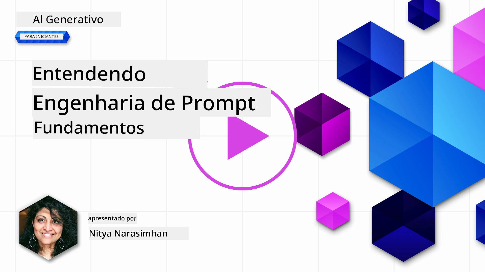
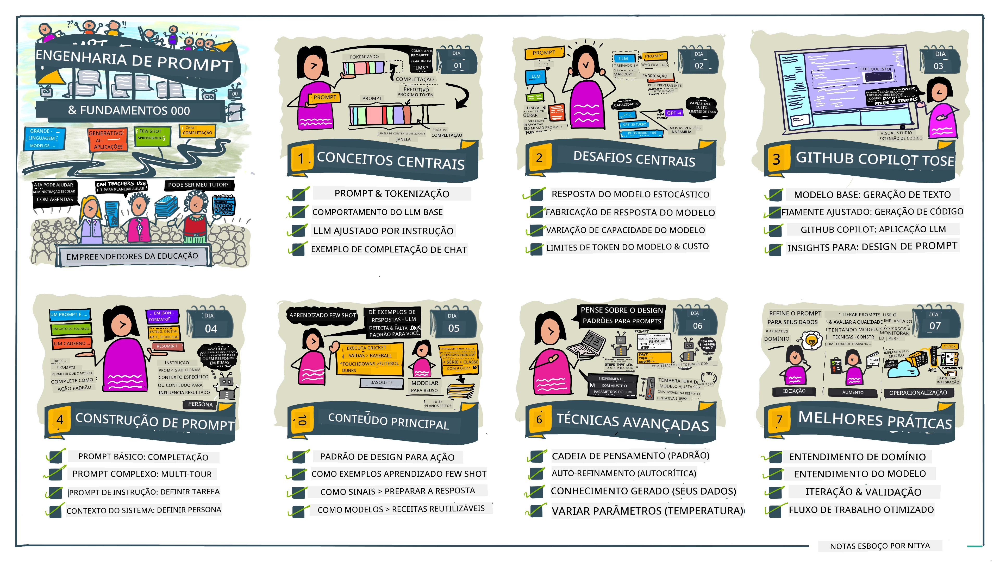
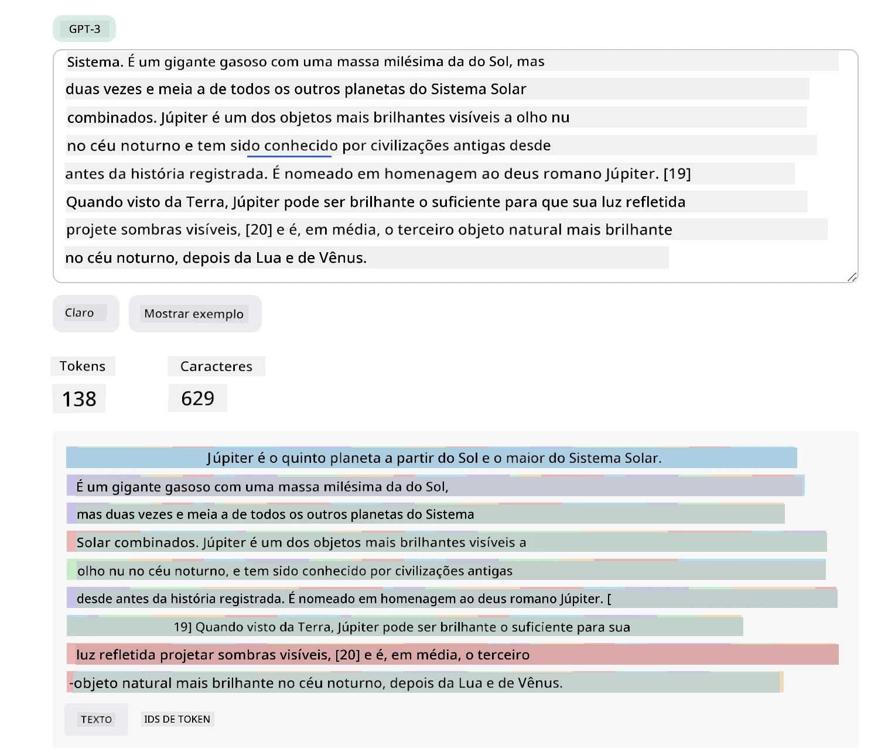
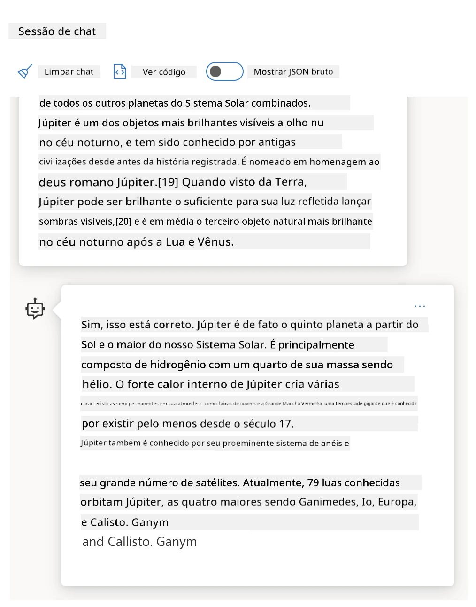
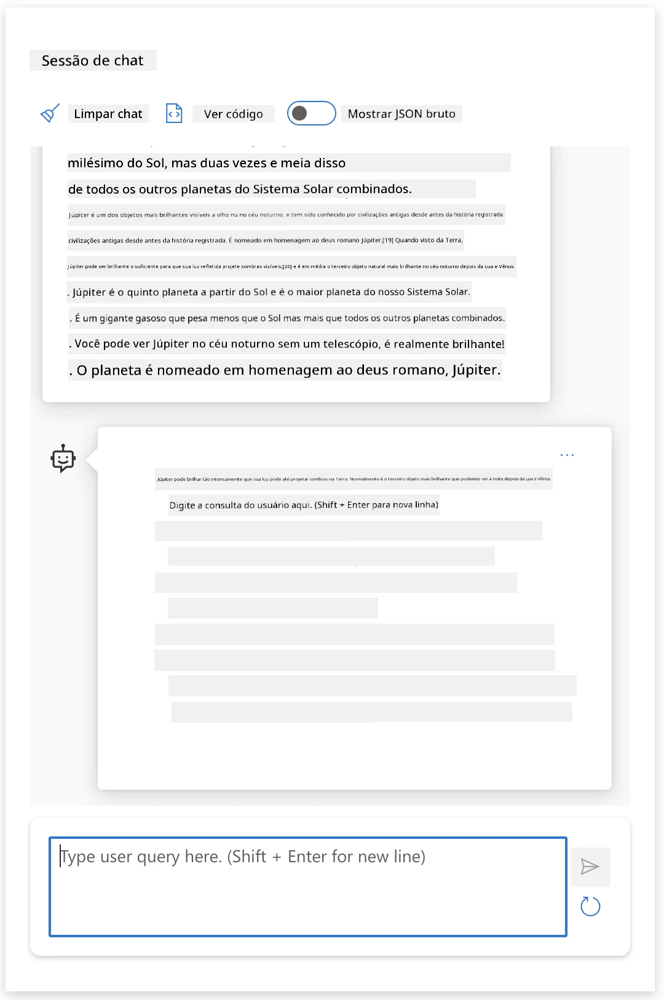
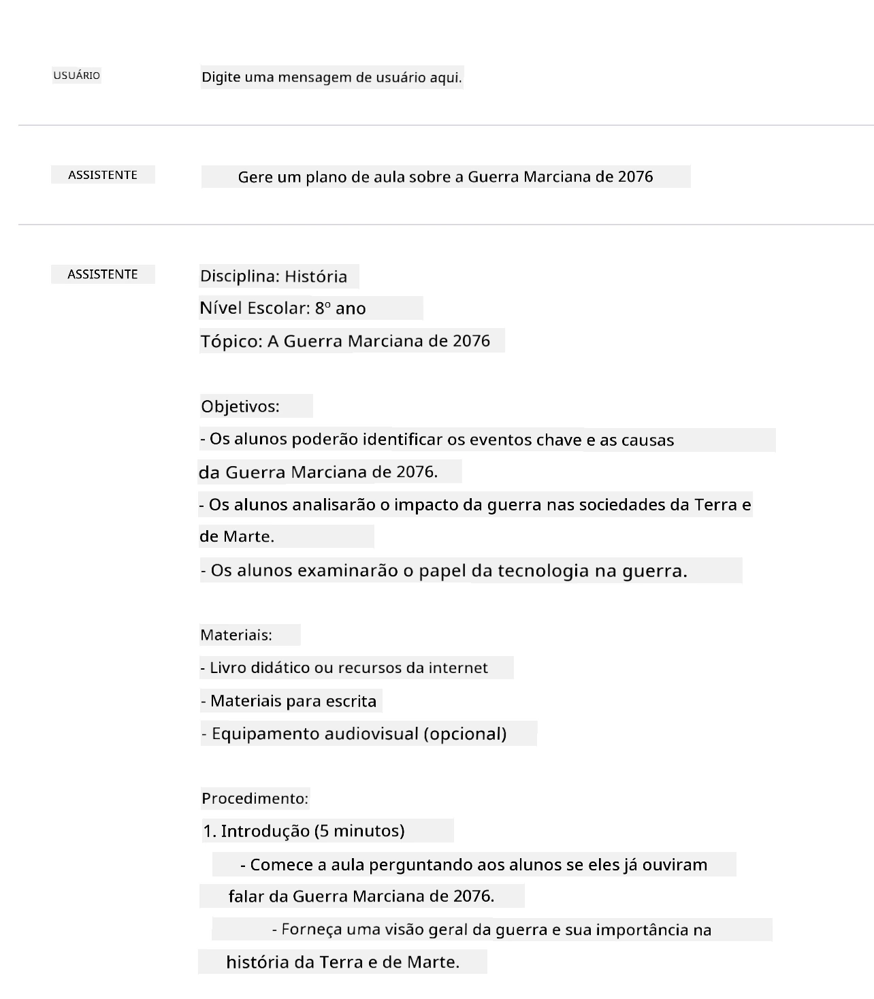
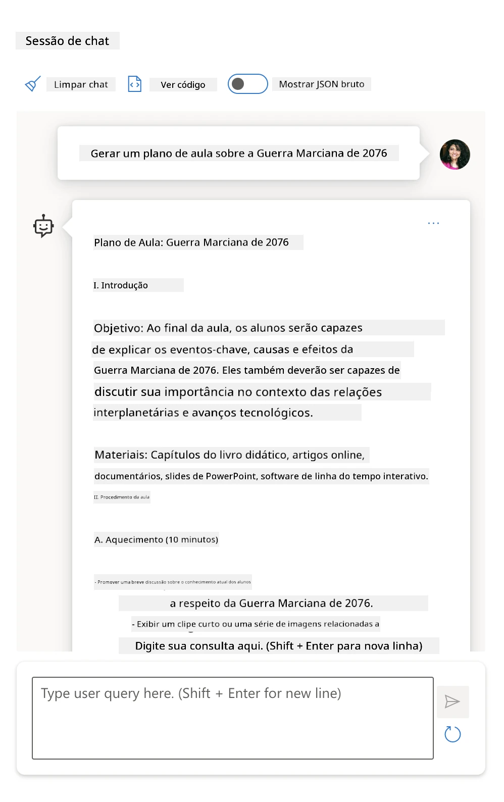
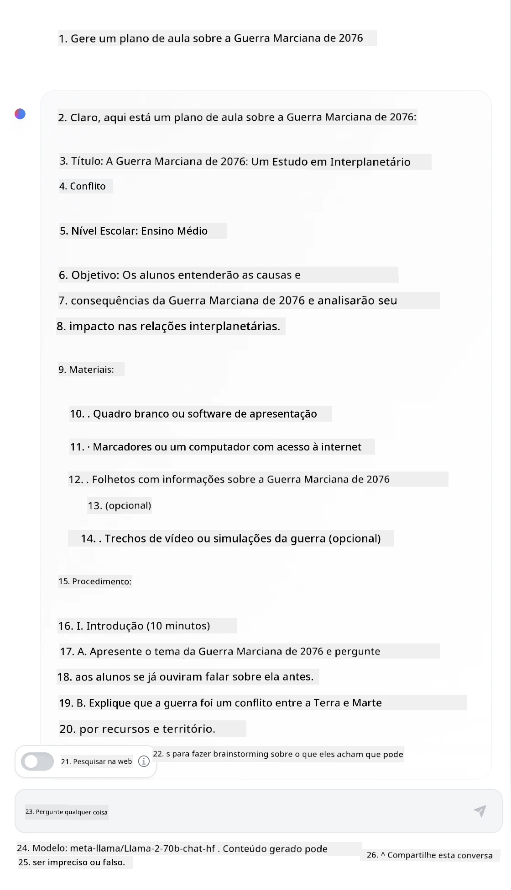

# Fundamentos de Engenharia de Prompt

[](https://youtu.be/GElCu2kUlRs?si=qrXsBvXnCW12epb8)

## Introdução
Este módulo cobre conceitos e técnicas essenciais para criar prompts eficazes em modelos generativos de IA. A forma como você escreve seu prompt para um LLM também importa. Um prompt cuidadosamente elaborado pode alcançar uma melhor qualidade de resposta. Mas o que exatamente significam termos como _prompt_ e _engenharia de prompt_? E como eu melhoro o _input_ do prompt que envio para o LLM? Essas são as perguntas que tentaremos responder neste capítulo e no próximo.

A _IA generativa_ é capaz de criar novo conteúdo (por exemplo, texto, imagens, áudio, código etc.) em resposta aos pedidos dos usuários. Ela alcança isso usando _Modelos de Linguagem Ampla_ como a série GPT da OpenAI ("Transformador Generativo Pré-treinado") que são treinados para usar linguagem natural e código.

Agora os usuários podem interagir com esses modelos usando paradigmas familiares como chat, sem precisar de qualquer expertise técnica ou treinamento. Os modelos são _baseados em prompt_ — os usuários enviam um texto (prompt) e recebem de volta a resposta da IA (completação). Eles podem então "conversar com a IA" de forma iterativa, em conversas multi-turno, refinando seu prompt até que a resposta corresponda às suas expectativas.

"Prompts" tornam-se agora a interface principal de _programação_ para aplicações de IA generativa, dizendo aos modelos o que fazer e influenciando a qualidade das respostas retornadas. "Engenharia de Prompt" é um campo em rápido crescimento que foca no _design e otimização_ de prompts para entregar respostas consistentes e de qualidade em escala.

## Objetivos de Aprendizagem

Nesta lição, aprendemos o que é Engenharia de Prompt, por que ela é importante e como podemos criar prompts mais eficazes para um determinado modelo e objetivo de aplicação. Vamos entender conceitos centrais e as melhores práticas para engenharia de prompt – e conhecer um ambiente interativo de Jupyter Notebooks "sandbox" onde podemos ver esses conceitos aplicados em exemplos reais.

Ao final desta lição, seremos capazes de:

1. Explicar o que é engenharia de prompt e por que ela importa.
2. Descrever os componentes de um prompt e como eles são usados.
3. Aprender melhores práticas e técnicas para engenharia de prompt.
4. Aplicar as técnicas aprendidas em exemplos reais, usando um endpoint OpenAI.

## Termos-Chave

Engenharia de Prompt: A prática de desenhar e refinar entradas para guiar modelos de IA a produzirem resultados desejados.
Tokenização: O processo de converter texto em unidades menores, chamadas tokens, que um modelo pode entender e processar.
LLMs Ajustados por Instrução: Modelos de Linguagem Ampla (LLMs) que foram ajustados finamente com instruções específicas para melhorar a precisão e relevância das respostas.

## Sandbox de Aprendizagem

A engenharia de prompt atualmente é mais uma arte do que uma ciência. A melhor forma de melhorar nossa intuição sobre isso é _praticar mais_ e adotar uma abordagem de tentativa e erro que combine expertise no domínio da aplicação com técnicas recomendadas e otimizações específicas para o modelo.

O Jupyter Notebook que acompanha esta lição oferece um ambiente de _sandbox_ onde você pode testar o que aprende – conforme avança ou como parte do desafio de código no final. Para executar os exercícios, você precisará de:

1. **Uma chave API do Azure OpenAI** – o endpoint do serviço para um LLM implantado.
2. **Um runtime Python** – no qual o Notebook possa ser executado.
3. **Variáveis de ambiente locais** – _complete os passos do [SETUP](./../00-course-setup/02-setup-local.md?WT.mc_id=academic-105485-koreyst) agora para se preparar_.

O notebook vem com exercícios _inicializadores_ – mas você está encorajado a adicionar suas próprias seções de _Markdown_ (descrição) e _Código_ (requisições de prompt) para experimentar mais exemplos ou ideias – e construir sua intuição sobre design de prompt.

## Guia Ilustrado

Quer ter uma visão geral do que esta lição cobre antes de mergulhar? Confira este guia ilustrado, que dá uma ideia dos principais tópicos abordados e os principais aprendizados para você refletir em cada um. O roteiro da lição leva você a partir da compreensão dos conceitos e desafios centrais até abordá-los com técnicas relevantes de engenharia de prompt e melhores práticas. Note que a seção "Técnicas Avançadas" neste guia se refere ao conteúdo coberto no _próximo_ capítulo deste currículo.



## Nossa Startup

Agora, vamos falar sobre como _este tema_ se relaciona à nossa missão de startup para [trazer inovação em IA para a educação](https://educationblog.microsoft.com/2023/06/collaborating-to-bring-ai-innovation-to-education?WT.mc_id=academic-105485-koreyst). Queremos construir aplicações de IA para _aprendizado personalizado_ – então vamos pensar em como diferentes usuários da nossa aplicação podem "desenhar" prompts:

- **Administradores** podem pedir à IA para _analisar dados curriculares para identificar lacunas na cobertura_. A IA pode resumir os resultados ou visualizá-los com código.
- **Educadores** podem pedir à IA para _gerar um plano de aula para um público-alvo e tópico_. A IA pode construir o plano personalizado em um formato especificado.
- **Estudantes** podem pedir à IA para _tutorá-los em uma matéria difícil_. A IA pode orientar alunos com aulas, dicas e exemplos ajustados ao seu nível.

Isso é só a ponta do iceberg. Confira [Prompts Para Educação](https://github.com/microsoft/prompts-for-edu/tree/main?WT.mc_id=academic-105485-koreyst) – uma biblioteca open-source de prompts curada por especialistas em educação – para ter uma ideia mais ampla das possibilidades! _Tente executar alguns desses prompts no sandbox ou no OpenAI Playground para ver o que acontece!_

<!--
LESSON TEMPLATE:
This unit should cover core concept #1.
Reinforce the concept with examples and references.

CONCEPT #1:
Prompt Engineering.
Define it and explain why it is needed.
-->

## O que é Engenharia de Prompt?

Começamos esta lição definindo **Engenharia de Prompt** como o processo de _desenhar e otimizar_ entradas de texto (prompts) para entregar respostas consistentes e de qualidade (completions) para um objetivo de aplicação e modelo específicos. Podemos pensar nisso como um processo em 2 passos:

- _desenhar_ o prompt inicial para um modelo e objetivo determinados
- _refinar_ o prompt de forma iterativa para melhorar a qualidade da resposta

Esse é necessariamente um processo de tentativa e erro que requer intuição e esforço do usuário para obter resultados ótimos. Então, por que isso é importante? Para responder a essa pergunta, primeiro precisamos entender três conceitos:

- _Tokenização_ = como o modelo "vê" o prompt
- _LLMs Base_ = como o modelo base "processa" um prompt
- _LLMs Ajustados por Instrução_ = como o modelo agora pode ver "tarefas"

### Tokenização

Um LLM vê os prompts como uma _sequência de tokens_ onde diferentes modelos (ou versões de um modelo) podem tokenizar o mesmo prompt de maneiras diferentes. Como os LLMs são treinados em tokens (e não em texto bruto), a forma como os prompts são tokenizados tem impacto direto na qualidade da resposta gerada.

Para ter uma intuição de como a tokenização funciona, experimente ferramentas como o [OpenAI Tokenizer](https://platform.openai.com/tokenizer?WT.mc_id=academic-105485-koreyst) mostrado abaixo. Copie seu prompt - e veja como ele é convertido em tokens, prestando atenção em como caracteres de espaço e sinais de pontuação são tratados. Note que este exemplo mostra um LLM mais antigo (GPT-3) – então tentar isso com um modelo mais novo pode produzir um resultado diferente.



### Conceito: Modelos Foundation

Uma vez que o prompt é tokenizado, a função principal do ["LLM Base"](https://blog.gopenai.com/an-introduction-to-base-and-instruction-tuned-large-language-models-8de102c785a6?WT.mc_id=academic-105485-koreyst) (ou modelo Foundation) é prever o token na sequência. Como os LLMs são treinados em grandes conjuntos de dados textuais, eles têm uma boa noção das relações estatísticas entre tokens e podem fazer essa previsão com certa confiança. Note que eles não entendem o _significado_ das palavras no prompt ou token; eles apenas veem um padrão que podem "completar" com sua próxima previsão. Eles podem continuar prevendo a sequência até serem interrompidos por intervenção do usuário ou alguma condição preestabelecida.

Quer ver como funciona a compleção baseada em prompt? Insira o prompt acima no Azure OpenAI Studio [_Chat Playground_](https://oai.azure.com/playground?WT.mc_id=academic-105485-koreyst) com as configurações padrão. O sistema está configurado para tratar prompts como pedidos de informação – então você deve ver uma compleção que satisfaça esse contexto.

Mas e se o usuário quiser algo específico que atenda algum critério ou objetivo de tarefa? É aí que entram os LLMs _ajustados por instrução_.



### Conceito: LLMs Ajustados por Instrução

Um [LLM Ajustado por Instrução](https://blog.gopenai.com/an-introduction-to-base-and-instruction-tuned-large-language-models-8de102c785a6?WT.mc_id=academic-105485-koreyst) começa com o modelo base e o ajusta finamente com exemplos ou pares entrada/saída (por exemplo, "mensagens" multi-turno) que podem conter instruções claras – e a resposta da IA tenta seguir essa instrução.

Isso usa técnicas como Aprendizado por Reforço com Feedback Humano (RLHF) que treinam o modelo para _seguir instruções_ e _aprender com feedback_, produzindo respostas mais adequadas para aplicações práticas e mais relevantes para os objetivos do usuário.

Vamos experimentar – revise o prompt acima, mas agora mude a _mensagem do sistema_ para fornecer a seguinte instrução como contexto:

> _Resuma o conteúdo fornecido para um aluno da segunda série. Mantenha o resultado em um parágrafo com 3-5 itens em bullet points._

Veja como o resultado agora está ajustado para refletir o objetivo e formato desejados? Um educador pode usar essa resposta diretamente em seus slides para essa aula.



## Por que precisamos de Engenharia de Prompt?

Agora que sabemos como os prompts são processados pelos LLMs, vamos falar sobre _por que_ precisamos da engenharia de prompt. A resposta está no fato de que os LLMs atuais apresentam vários desafios que tornam _completações confiáveis e consistentes_ mais difíceis de alcançar sem esforço na construção e otimização do prompt. Por exemplo:

1. **As respostas dos modelos são estocásticas.** O _mesmo prompt_ provavelmente produzirá respostas diferentes com modelos diferentes ou versões de um modelo. E pode até produzir resultados diferentes com o _mesmo modelo_ em momentos diferentes. _Técnicas de engenharia de prompt podem ajudar a minimizar essas variações fornecendo melhores guardrails_.

1. **Modelos podem criar respostas fabricadas.** Os modelos são pré-treinados com conjuntos de dados _grandes, porém finitos_, o que significa que carecem de conhecimento sobre conceitos fora desse escopo de treinamento. Como resultado, podem gerar completações imprecisas, imaginárias ou diretamente contraditórias a fatos conhecidos. _Técnicas de engenharia de prompt ajudam os usuários a identificar e mitigar essas fabricações, por exemplo, pedindo citações ou raciocínio à IA_.

1. **As capacidades dos modelos variam.** Modelos mais novos ou gerações diferentes terão capacidades mais ricas, mas também apresentam peculiaridades e trade-offs únicos em custo e complexidade. _A engenharia de prompt pode ajudar a desenvolver melhores práticas e fluxos de trabalho que abstraem essas diferenças e se adaptam a requisitos específicos dos modelos de forma escalável e fluida_.

Vamos ver isso em ação no Playground do OpenAI ou Azure OpenAI:

- Use o mesmo prompt com diferentes deploys de LLM (ex: OpenAI, Azure OpenAI, Hugging Face) – você notou as variações?
- Use o mesmo prompt repetidamente com o _mesmo_ deploy de LLM (ex: playground do Azure OpenAI) – como essas variações diferiram?

### Exemplo de Fabricações

Neste curso, usamos o termo **"fabricação"** para se referir ao fenômeno em que os LLMs às vezes geram informações factualmente incorretas devido a limitações no treinamento ou outras restrições. Você também pode ter ouvido isso referido como _"alucinações"_ em artigos populares ou trabalhos acadêmicos. Entretanto, recomendamos fortemente usar _"fabricação"_ para evitar antropomorfizar o comportamento, atribuindo uma característica humana a um resultado gerado por máquina. Isso também reforça as [diretrizes de IA Responsável](https://www.microsoft.com/ai/responsible-ai?WT.mc_id=academic-105485-koreyst) do ponto de vista terminológico, removendo termos que podem ser ofensivos ou não inclusivos em alguns contextos.

Quer entender melhor como funcionam as fabricações? Pense em um prompt que instrua a IA a gerar conteúdo sobre um tópico inexistente (para garantir que não seja encontrado no conjunto de dados de treinamento). Por exemplo – experimentei este prompt:

> **Prompt:** gerar um plano de aula sobre a Guerra Marciana de 2076.
Uma pesquisa na web me mostrou que existem relatos ficcionais (por exemplo, séries de televisão ou livros) sobre guerras marcianas - mas nenhum em 2076. O senso comum também nos diz que 2076 é _no futuro_ e, portanto, não pode estar associado a um evento real.

Então, o que acontece quando executamos este prompt com diferentes provedores de LLM?

> **Resposta 1**: OpenAI Playground (GPT-35)



> **Resposta 2**: Azure OpenAI Playground (GPT-35)



> **Resposta 3**: : Hugging Face Chat Playground (LLama-2)



Como esperado, cada modelo (ou versão do modelo) produz respostas ligeiramente diferentes devido ao comportamento estocástico e às variações na capacidade do modelo. Por exemplo, um modelo tem como público-alvo alunos de 8ª série enquanto o outro assume um estudante do ensino médio. Mas todos os três modelos geraram respostas que poderiam convencer um usuário desinformado de que o evento era real.

Técnicas de engenharia de prompt como _metaprompting_ e _configuração de temperatura_ podem reduzir as fabrications do modelo até certo ponto. Novas _arquiteturas_ de engenharia de prompt também incorporam novas ferramentas e técnicas sem interrupções ao fluxo do prompt, para mitigar ou reduzir alguns desses efeitos.

## Estudo de Caso: GitHub Copilot

Vamos encerrar esta seção tendo uma ideia de como a engenharia de prompt é usada em soluções do mundo real, analisando um Estudo de Caso: [GitHub Copilot](https://github.com/features/copilot?WT.mc_id=academic-105485-koreyst).

GitHub Copilot é seu "programador par AI" - ele converte prompts de texto em completions de código e está integrado ao seu ambiente de desenvolvimento (por exemplo, Visual Studio Code) para uma experiência de usuário perfeita. Conforme documentado na série de blogs abaixo, a versão inicial foi baseada no modelo OpenAI Codex - com engenheiros percebendo rapidamente a necessidade de ajustar o modelo e desenvolver melhores técnicas de engenharia de prompt para melhorar a qualidade do código. Em julho, eles [lançaram um modelo de IA aprimorado que vai além do Codex](https://github.blog/2023-07-28-smarter-more-efficient-coding-github-copilot-goes-beyond-codex-with-improved-ai-model/?WT.mc_id=academic-105485-koreyst) para sugestões ainda mais rápidas.

Leia as postagens na ordem para acompanhar a jornada de aprendizado.

- **Maio 2023** | [GitHub Copilot está melhorando na compreensão de seu código](https://github.blog/2023-05-17-how-github-copilot-is-getting-better-at-understanding-your-code/?WT.mc_id=academic-105485-koreyst)
- **Maio 2023** | [Inside GitHub: trabalhando com os LLMs por trás do GitHub Copilot](https://github.blog/2023-05-17-inside-github-working-with-the-llms-behind-github-copilot/?WT.mc_id=academic-105485-koreyst).
- **Junho 2023** | [Como escrever melhores prompts para o GitHub Copilot](https://github.blog/2023-06-20-how-to-write-better-prompts-for-github-copilot/?WT.mc_id=academic-105485-koreyst).
- **Julho 2023** | [.. GitHub Copilot vai além do Codex com modelo de IA aprimorado](https://github.blog/2023-07-28-smarter-more-efficient-coding-github-copilot-goes-beyond-codex-with-improved-ai-model/?WT.mc_id=academic-105485-koreyst)
- **Julho 2023** | [Guia do desenvolvedor para engenharia de prompt e LLMs](https://github.blog/2023-07-17-prompt-engineering-guide-generative-ai-llms/?WT.mc_id=academic-105485-koreyst)
- **Setembro 2023** | [Como construir um app empresarial LLM: lições do GitHub Copilot](https://github.blog/2023-09-06-how-to-build-an-enterprise-llm-application-lessons-from-github-copilot/?WT.mc_id=academic-105485-koreyst)

Você também pode navegar pelo [blog de engenharia](https://github.blog/category/engineering/?WT.mc_id=academic-105485-koreyst) deles para mais posts como [este](https://github.blog/2023-09-27-how-i-used-github-copilot-chat-to-build-a-reactjs-gallery-prototype/?WT.mc_id=academic-105485-koreyst) que mostram como esses modelos e técnicas são _aplicados_ para impulsionar aplicações do mundo real.

---

<!--
MODELO DE LIÇÃO:
Esta unidade deve cobrir o conceito principal #2.
Reforce o conceito com exemplos e referências.

CONCEITO #2:
Design de Prompt.
Ilustrado com exemplos.
-->

## Construção de Prompt

Vimos por que a engenharia de prompt é importante - agora vamos entender como os prompts são _construídos_ para que possamos avaliar diferentes técnicas para um design de prompt mais eficaz.

### Prompt Básico

Vamos começar com o prompt básico: uma entrada de texto enviada ao modelo sem outro contexto. Aqui está um exemplo - quando enviamos as primeiras palavras do hino nacional dos EUA para a OpenAI [Completion API](https://platform.openai.com/docs/api-reference/completions?WT.mc_id=academic-105485-koreyst), ela _completa_ instantaneamente a resposta com as próximas linhas, ilustrando o comportamento básico de previsão.

| Prompt (Entrada)     | Completion (Saída)                                                                                                                        |
| :----------------- | :----------------------------------------------------------------------------------------------------------------------------------------- |
| Oh say can you see | Parece que você está começando as letras de "The Star-Spangled Banner," o hino nacional dos Estados Unidos. As letras completas são ... |

### Prompt Complexo

Agora vamos adicionar contexto e instruções a esse prompt básico. A [Chat Completion API](https://learn.microsoft.com/azure/ai-services/openai/how-to/chatgpt?WT.mc_id=academic-105485-koreyst) nos permite construir um prompt complexo como uma coleção de _mensagens_ com:

- Pares de entrada/saída refletindo a entrada do _usuário_ e a resposta do _assistente_.
- Mensagem do sistema definindo o contexto para o comportamento ou personalidade do assistente.

A solicitação agora está na forma abaixo, onde a _tokenização_ captura efetivamente informações relevantes do contexto e da conversa. Agora, mudar o contexto do sistema pode ser tão impactante na qualidade das completions quanto as entradas do usuário fornecidas.

```python
response = openai.chat.completions.create(
    model="gpt-3.5-turbo",
    messages=[
        {"role": "system", "content": "You are a helpful assistant."},
        {"role": "user", "content": "Who won the world series in 2020?"},
        {"role": "assistant", "content": "The Los Angeles Dodgers won the World Series in 2020."},
        {"role": "user", "content": "Where was it played?"}
    ]
)
```

### Prompt de Instrução

Nos exemplos acima, o prompt do usuário era uma consulta de texto simples que pode ser interpretada como um pedido de informação. Com os prompts de _instrução_, podemos usar esse texto para especificar uma tarefa com mais detalhes, proporcionando uma orientação melhor para a IA. Aqui está um exemplo:

| Prompt (Entrada)                                                                                                                                                                                                                         | Completion (Saída)                                                                                                        | Tipo de Instrução    |
| :------------------------------------------------------------------------------------------------------------------------------------------------------------------------------------------------------------------------------------- | :------------------------------------------------------------------------------------------------------------------------- | :------------------ |
| Escreva uma descrição da Guerra Civil                                                                                                                                                                                                   | _retornou um parágrafo simples_                                                                                           | Simples             |
| Escreva uma descrição da Guerra Civil. Forneça datas e eventos principais e descreva sua importância                                                                                                                                     | _retornou um parágrafo seguido por uma lista de datas de eventos principais com descrições_                               | Complexo            |
| Escreva uma descrição da Guerra Civil em 1 parágrafo. Forneça 3 tópicos com datas importantes e sua importância. Forneça mais 3 tópicos com figuras históricas-chave e suas contribuições. Retorne a saída em um arquivo JSON            | _retorna detalhes mais extensos em um caixa de texto, formatado como JSON que você pode copiar-colar para um arquivo e validar conforme necessário_ | Complexo. Formatado. |

## Conteúdo Primário

Nos exemplos acima, o prompt ainda era bastante aberto, permitindo que o LLM decidisse qual parte de seu conjunto de dados pré-treinados era relevante. Com o padrão de design de _conteúdo primário_, o texto de entrada é dividido em duas partes:

- uma instrução (ação)
- conteúdo relevante (que influencia a ação)

Aqui está um exemplo onde a instrução é "resuma isso em 2 frases".

| Prompt (Entrada)                                                                                                                                                                                                                                                                                                                                                                                                                                                                                                                                                                                                                                                                                      | Completion (Saída)                                                                                                                                                                                                                                                                             |
| :-------------------------------------------------------------------------------------------------------------------------------------------------------------------------------------------------------------------------------------------------------------------------------------------------------------------------------------------------------------------------------------------------------------------------------------------------------------------------------------------------------------------------------------------------------------------------------------------------------------------------------------------------------------------------------------------------- | :---------------------------------------------------------------------------------------------------------------------------------------------------------------------------------------------------------------------------------------------------------------------------------------------- |
| Júpiter é o quinto planeta a partir do Sol e o maior do Sistema Solar. É um gigante gasoso com uma massa um milésimo da massa do Sol, mas duas vezes e meia a massa de todos os outros planetas do Sistema Solar combinados. Júpiter é um dos objetos mais brilhantes visíveis a olho nu no céu noturno, e é conhecido por civilizações antigas desde antes da história registrada. Ele recebe o nome do deus romano Júpiter.[19] Quando visto da Terra, Júpiter pode ser brilhante o suficiente para sua luz refletida projetar sombras visíveis,[20] e é, em média, o terceiro objeto natural mais brilhante no céu noturno depois da Lua e de Vênus. <br/> **Resuma isso em 2 frases curtas** | Júpiter, o quinto planeta a partir do Sol, é o maior do Sistema Solar e conhecido por ser um dos objetos mais brilhantes no céu noturno. Nomeado em homenagem ao deus romano Júpiter, é um gigante gasoso cuja massa é duas vezes e meia a soma das massas de todos os outros planetas do Sistema Solar. |

O segmento de conteúdo primário pode ser usado de várias maneiras para direcionar instruções mais eficazes:

- **Exemplos** - em vez de dizer ao modelo o que fazer com uma instrução explícita, dê exemplos do que fazer e deixe-o inferir o padrão.
- **Indícios** - siga a instrução com um "indício" que prepara a completion, guiando o modelo para respostas mais relevantes.
- **Modelos** - são 'receitas' repetitivas para prompts com espaços reservados (variáveis) que podem ser personalizados com dados para usos específicos.

Vamos explorar isso na prática.

### Usando Exemplos

Esta é uma abordagem onde você usa o conteúdo primário para "alimentar o modelo" com alguns exemplos da saída desejada para uma dada instrução e deixa-o inferir o padrão da saída desejada. Com base no número de exemplos fornecidos, podemos ter prompting zero-shot, one-shot, few-shot etc.

O prompt agora consiste em três componentes:

- Uma descrição da tarefa
- Alguns exemplos da saída desejada
- O início de um novo exemplo (que se torna uma descrição implícita da tarefa)

| Tipo de Aprendizado | Prompt (Entrada)                                                                                                                                        | Completion (Saída)         |
| :------------------ | :---------------------------------------------------------------------------------------------------------------------------------------------------- | :-------------------------- |
| Zero-shot           | "O Sol está brilhando". Traduza para o espanhol                                                                                                       | "El Sol está brillando".    |
| One-shot            | "O Sol está brilhando" => "El Sol está brillando". <br> "É um dia frio e ventoso" =>                                                                     | "Es un día frío y ventoso". |
| Few-shot            | O jogador correu as bases => Beisebol <br/> O jogador fez um ace => Tênis <br/> O jogador marcou um seis => Críquete <br/> O jogador fez uma enterrada => | Basquete                   |
|                     |                                                                                                                                                       |                             |

Note como precisávamos fornecer instruções explícitas ("Traduza para o espanhol") no prompting zero-shot, mas ela é inferida no exemplo de one-shot. O exemplo few-shot mostra como adicionar mais exemplos permite que os modelos façam inferências mais precisas sem instruções adicionais.

### Indícios no Prompt

Outra técnica para usar o conteúdo primário é fornecer _indícios_ ao invés de exemplos. Nesse caso, estamos dando ao modelo um empurrão na direção certa, _começando_ com um trecho que reflete o formato de resposta desejado. O modelo então "pega o indício" para continuar nessa linha.

| Número de Indícios | Prompt (Entrada)                                                                                                                                                                                                                                                                                                                                                                                                                                               | Completion (Saída)                                                                                                                                                                                                                                                                                       |
| :----------------- | :----------------------------------------------------------------------------------------------------------------------------------------------------------------------------------------------------------------------------------------------------------------------------------------------------------------------------------------------------------------------------------------------------------------------------------------------------------- | :-------------------------------------------------------------------------------------------------------------------------------------------------------------------------------------------------------------------------------------------------------------------------------------------------------- |
| 0                  | Júpiter é o quinto planeta a partir do Sol e o maior do Sistema Solar. É um gigante gasoso com uma massa um milésimo da massa do Sol, mas duas vezes e meia a massa de todos os outros planetas do Sistema Solar combinados. Júpiter é um dos objetos mais brilhantes visíveis a olho nu no céu noturno, e é conhecido por civilizações antigas desde antes da história registrada. <br/>**Resuma isso**                                       | Júpiter é o maior planeta do nosso Sistema Solar e o quinto a partir do Sol. É um gigante gasoso com uma massa equivalente a 1/1000 da massa do Sol, mas é mais pesado que todos os outros planetas juntos. Civilizações antigas conhecem Júpiter há muito tempo, e ele é facilmente visível no céu noturno.. |
| 1              | Júpiter é o quinto planeta a partir do Sol e o maior do Sistema Solar. É um gigante gasoso com uma massa um milésimo da do Sol, mas duas vezes e meia a soma de todos os outros planetas do Sistema Solar juntos. Júpiter é um dos objetos mais brilhantes visíveis a olho nu no céu noturno e é conhecido por civilizações antigas desde antes da história registrada. <br/>**Resuma isto** <br/> O que aprendemos é que Júpiter | é o quinto planeta a partir do Sol e o maior do Sistema Solar. É um gigante gasoso com uma massa um milésimo da do Sol, mas duas vezes e meia a soma de todos os outros planetas juntos. É facilmente visível a olho nu e conhecido desde a antiguidade.                        |
| 2              | Júpiter é o quinto planeta a partir do Sol e o maior do Sistema Solar. É um gigante gasoso com uma massa um milésimo da do Sol, mas duas vezes e meia a soma de todos os outros planetas do Sistema Solar juntos. Júpiter é um dos objetos mais brilhantes visíveis a olho nu no céu noturno e é conhecido por civilizações antigas desde antes da história registrada. <br/>**Resuma isto** <br/> Top 3 fatos que aprendemos:         | 1. Júpiter é o quinto planeta a partir do Sol e o maior do Sistema Solar. <br/> 2. É um gigante gasoso com uma massa um milésimo da do Sol...<br/> 3. Júpiter é visível a olho nu desde a antiguidade ...                                                                       |
|                |                                                                                                                                                                                                                                                                                                                                                                                                                                                              |                                                                                                                                                                                                                                                                                                           |

### Modelos de Prompt

Um modelo de prompt é uma _receita pré-definida para um prompt_ que pode ser armazenada e reutilizada conforme necessário, para oferecer experiências de usuário mais consistentes em larga escala. Na sua forma mais simples, é simplesmente uma coleção de exemplos de prompt como [este da OpenAI](https://cookbook.openai.com/examples/gpt4-1_prompting_guide?WT.mc_id=academic-105485-koreyst) que fornece componentes interativos do prompt (mensagens do usuário e do sistema) e o formato de solicitação via API – para apoiar a reutilização.

Em sua forma mais complexa, como [este exemplo da LangChain](https://python.langchain.com/docs/concepts/prompt_templates/?WT.mc_id=academic-105485-koreyst), contém _marcadores de posição_ que podem ser substituídos por dados de várias fontes (entrada do usuário, contexto do sistema, fontes externas etc.) para gerar um prompt dinamicamente. Isso nos possibilita criar uma biblioteca de prompts reutilizáveis que podem ser usados para impulsionar experiências de usuário consistentes **programaticamente** em escala.

Finalmente, o verdadeiro valor dos modelos está na capacidade de criar e publicar _bibliotecas de prompts_ para domínios de aplicação vertical – onde o modelo de prompt é agora _otimizado_ para refletir o contexto ou exemplos específicos da aplicação que tornam as respostas mais relevantes e precisas para o público alvo. O repositório [Prompts For Edu](https://github.com/microsoft/prompts-for-edu?WT.mc_id=academic-105485-koreyst) é um ótimo exemplo dessa abordagem, curando uma biblioteca de prompts para o domínio educacional com ênfase em objetivos-chave como planejamento de aulas, design curricular, tutoria para estudantes etc.

## Conteúdo de Apoio

Se pensarmos na construção do prompt como tendo uma instrução (tarefa) e um alvo (conteúdo principal), então o _conteúdo secundário_ é como um contexto adicional que fornecemos para **influenciar a saída de alguma forma**. Pode ser parâmetros de ajuste, instruções de formatação, taxonomias de assunto etc. que ajudam o modelo a _personalizar_ sua resposta para atender melhor aos objetivos ou expectativas do usuário.

Por exemplo: dado um catálogo de cursos com metadados extensos (nome, descrição, nível, tags de metadados, instrutor etc.) de todos os cursos disponíveis no currículo:

- podemos definir uma instrução para "resumir o catálogo de cursos para o outono de 2023"
- podemos usar o conteúdo principal para fornecer alguns exemplos do resultado desejado
- podemos usar o conteúdo secundário para identificar as 5 principais "tags" de interesse.

Agora, o modelo pode fornecer um resumo no formato mostrado pelos exemplos – mas se um resultado tiver múltiplas tags, ele pode priorizar as 5 tags identificadas no conteúdo secundário.

---

<!--
MODEL DE AULA:
Esta unidade deve cobrir o conceito principal #1.
Reforce o conceito com exemplos e referências.

CONCEITO #3:
Técnicas de Engenharia de Prompt.
Quais são algumas técnicas básicas para engenharia de prompt?
Ilustre com alguns exercícios.
-->

## Melhores Práticas para Prompt

Agora que sabemos como os prompts podem ser _construídos_, podemos começar a pensar em como _projetá-los_ para refletir as melhores práticas. Podemos pensar nisso em duas partes - ter a atitude certa (_mindset_) e aplicar as _técnicas_ certas.

### Mentalidade de Engenharia de Prompt

A engenharia de prompt é um processo de tentativa e erro, então mantenha em mente três fatores orientadores amplos:

1. **Entendimento de Domínio é Importante.** A precisão e relevância da resposta é função do _domínio_ em que aquela aplicação ou usuário opera. Use sua intuição e expertise do domínio para **personalizar técnicas** ainda mais. Por exemplo, defina _personalidades específicas de domínio_ nos seus prompts de sistema, ou use _modelos específicos de domínio_ nos seus prompts de usuário. Forneça conteúdo secundário que reflita contextos específicos do domínio, ou use _dicas e exemplos específicos de domínio_ para guiar o modelo a padrões de uso familiares.

2. **Entendimento do Modelo é Importante.** Sabemos que modelos são estocásticos por natureza. Mas implementações de modelos também variam em termos do conjunto de dados de treinamento usado (conhecimento pré-treinado), das capacidades oferecidas (por exemplo, via API ou SDK) e do tipo de conteúdo para o qual são otimizados (ex: código vs imagens vs texto). Entenda os pontos fortes e limitações do modelo que você usa, e use esse conhecimento para _priorizar tarefas_ ou construir _modelos personalizados_ otimizados para as capacidades do modelo.

3. **Iteração e Validação Importam.** Modelos evoluem rapidamente, assim como as técnicas para engenharia de prompt. Como especialista no domínio, você pode ter outros contextos ou critérios para sua aplicação específica, que talvez não se aplicam à comunidade mais ampla. Use ferramentas e técnicas de engenharia de prompt para “dar um pontapé inicial” na construção de prompts, depois itere e valide os resultados usando sua própria intuição e expertise do domínio. Registre seus insights e crie uma **base de conhecimento** (ex: bibliotecas de prompts) que pode ser usada como um novo padrão por outros, para acelerar iterações futuras.

## Melhores Práticas

Agora vejamos as práticas recomendadas comuns indicadas pelos profissionais da [OpenAI](https://help.openai.com/en/articles/6654000-best-practices-for-prompt-engineering-with-openai-api?WT.mc_id=academic-105485-koreyst) e [Azure OpenAI](https://learn.microsoft.com/azure/ai-services/openai/concepts/prompt-engineering#best-practices?WT.mc_id=academic-105485-koreyst).

| O que                             | Por quê                                                                                                                                                                                                                                             |
| :-------------------------------- | :-------------------------------------------------------------------------------------------------------------------------------------------------------------------------------------------------------------------------------------------------- |
| Avalie os modelos mais recentes.  | Novas gerações de modelos provavelmente têm recursos e qualidade melhorados – mas também podem gerar custos maiores. Avalie o impacto e tome decisões de migração.                                                                                 |
| Separe instruções e contexto      | Verifique se seu modelo/fornecedor define _delimitadores_ para distinguir mais claramente instruções, conteúdo principal e secundário. Isso pode ajudar os modelos a atribuir pesos mais precisos aos tokens.                                          |
| Seja específico e claro           | Dê mais detalhes sobre o contexto desejado, resultado, extensão, formato, estilo etc. Isso melhora qualidade e consistência das respostas. Registre essas receitas em modelos reutilizáveis.                                                        |
| Seja descritivo, use exemplos      | Modelos respondem melhor a uma abordagem de "mostrar e contar". Comece com um método `zero-shot` dando uma instrução (sem exemplos), depois tente `few-shot` como refinamento, fornecendo alguns exemplos do resultado desejado. Use analogias.         |
| Use dicas para iniciar respostas   | Empurre o modelo para um resultado desejado dando algumas palavras ou frases iniciais para que ele use como ponto de partida para a resposta.                                                                                                      |
| Repita para reforçar              | Às vezes pode ser necessário repetir as instruções para o modelo. Dê instruções antes e depois do conteúdo principal, use uma instrução e uma dica etc. Itere e valide para ver o que funciona.                                                     |
| A ordem importa                   | A ordem em que você apresenta as informações ao modelo pode impactar a saída, até mesmo nos exemplos de aprendizado, devido ao viés de recência. Experimente diferentes opções para ver o que funciona melhor.                                        |
| Dê ao modelo uma “saida segura”   | Forneça uma resposta de _retorno_ que o modelo possa usar caso não consiga completar a tarefa por algum motivo. Isso pode reduzir chances de o modelo gerar respostas falsas ou fabricadas.                                                         |
|                                   |                                                                                                                                                                                                                                                      |

Como em qualquer melhor prática, lembre-se que _os resultados podem variar_ dependendo do modelo, da tarefa e do domínio. Use estes como ponto de partida e itere para descobrir o que funciona melhor para você. Reavalie constantemente seu processo de engenharia de prompt à medida que novos modelos e ferramentas ficam disponíveis, com foco na escalabilidade do processo e qualidade da resposta.

<!--
MODEL DE AULA:
Esta unidade deve proporcionar um desafio de código, se aplicável

DESAFIO:
Link para um Jupyter Notebook com apenas comentários de código nas instruções (seções de código vazias).

SOLUÇÃO:
Link para uma cópia do Notebook com os prompts preenchidos e executados, mostrando um exemplo de saída.
-->

## Atividade

Parabéns! Você chegou ao final da lição! É hora de colocar alguns desses conceitos e técnicas à prova com exemplos reais!

Para nossa atividade, usaremos um Jupyter Notebook com exercícios que você pode completar interativamente. Você também pode estender o Notebook com suas próprias células Markdown e de código para explorar ideias e técnicas por conta própria.

### Para começar, faça um fork do repositório, depois

- (Recomendado) Inicie o GitHub Codespaces
- (Alternativamente) Clone o repositório para seu dispositivo local e use com Docker Desktop
- (Alternativamente) Abra o Notebook com seu ambiente de execução preferido.

### Depois, configure suas variáveis de ambiente

- Copie o arquivo `.env.copy` da raiz do repo para `.env` e preencha os valores de `AZURE_OPENAI_API_KEY`, `AZURE_OPENAI_ENDPOINT` e `AZURE_OPENAI_DEPLOYMENT`. Volte à [seção Learning Sandbox](#sandbox-de-aprendizagem) para aprender como.

### Em seguida, abra o Jupyter Notebook

- Selecione o kernel de execução. Se usar as opções 1 ou 2, basta escolher o kernel padrão Python 3.10.x fornecido pelo container de desenvolvimento.

Está tudo pronto para executar os exercícios. Note que não há respostas _certas ou erradas_ aqui – apenas explorar opções por tentativa e erro e construir intuição sobre o que funciona para um dado modelo e domínio de aplicação.

_Por esse motivo, não há segmentos de Solução de Código nesta lição. Em vez disso, o Notebook terá células Markdown intituladas "Minha Solução:" mostrando um exemplo de saída para referência._

 <!--
MODEL DE AULA:
Encapsule a seção com um resumo e recursos para aprendizagem autodidata.
-->

## Verificação do Conhecimento

Qual dos seguintes é um bom prompt seguindo algumas práticas recomendadas razoáveis?

1. Mostre-me uma imagem de um carro vermelho
2. Mostre-me uma imagem de um carro vermelho da marca Volvo e modelo XC90 estacionado perto de um penhasco com o sol se pondo
3. Mostre-me uma imagem de um carro vermelho da marca Volvo e modelo XC90

Resposta: 2, é o melhor prompt pois fornece detalhes sobre "o que" e vai aos detalhes (não é apenas um carro, mas marca e modelo específicos) e ainda descreve o cenário geral. O 3 é o segundo melhor pois também contém muita descrição.

## 🚀 Desafio

Veja se você consegue usar a técnica da "dica" com o prompt: Complete a frase "Mostre-me uma imagem de um carro vermelho da marca Volvo e ". O que ele responde? Como você melhoraria?

## Ótimo trabalho! Continue aprendendo

Quer aprender mais sobre diferentes conceitos de Engenharia de Prompt? Vá para a [página de aprendizado contínuo](https://aka.ms/genai-collection?WT.mc_id=academic-105485-koreyst) para encontrar outros ótimos recursos sobre este tema.

Siga para a Lição 5 onde veremos [técnicas avançadas de prompting](../05-advanced-prompts/README.md?WT.mc_id=academic-105485-koreyst)!

---

<!-- CO-OP TRANSLATOR DISCLAIMER START -->
**Aviso Legal**:
Este documento foi traduzido usando o serviço de tradução por IA [Co-op Translator](https://github.com/Azure/co-op-translator). Embora nos esforcemos pela precisão, por favor, esteja ciente de que traduções automatizadas podem conter erros ou imprecisões. O documento original em seu idioma nativo deve ser considerado a fonte autorizada. Para informações críticas, recomenda-se tradução profissional humana. Não nos responsabilizamos por quaisquer mal-entendidos ou interpretações incorretas decorrentes do uso desta tradução.
<!-- CO-OP TRANSLATOR DISCLAIMER END -->